For **SAP-C02**, don't learn IAM as a list of features. Learn it as an **architecture decision problem**:

> **Who/what is requesting access → to what → under which conditions → with what level of privilege → and how do I manage that at scale with minimum operational overhead and cost?**

The two services in this topic solve different problems:

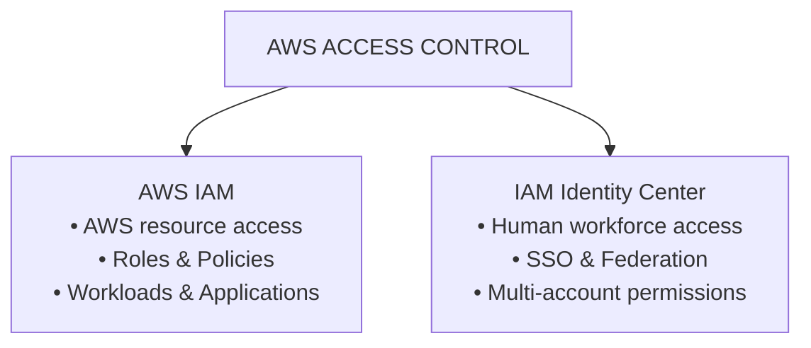

---

# 1. Why Does IAM Exist?

Before IAM, imagine AWS resources simply being accessible based on network location or account ownership.

That doesn't solve:

* Who is allowed to access what?
* What can an EC2 instance access?
* Can developers access production?
* Can an application write to S3?
* Can one AWS account access another?
* How do you enforce least privilege?
* How do you revoke access?
* How do you audit access?

AWS needed a centralized **authorization and identity mechanism**.

That's the fundamental reason IAM exists.

---

# 2. The Core IAM Problem

Think of every AWS request as:

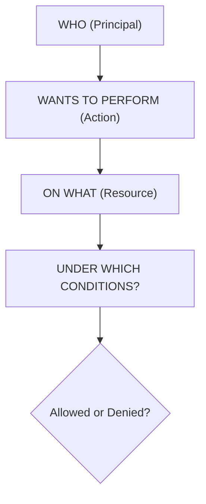

Example:

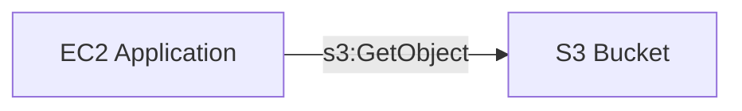

IAM answers:

> Is this EC2 workload allowed to perform `s3:GetObject` on this bucket?

---

# 3. IAM's Main Components

You need to think about:

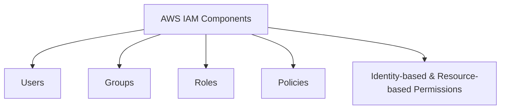

But for **modern AWS architecture**, the most important concepts are:

> **IAM Roles + Policies**

Not manually creating IAM users for every person.

---

# 4. IAM Users — Why Do They Exist?

An IAM user represents an AWS identity within an AWS account.

Historically:


Users can have:

* Console access
* Access keys

But from a modern SAP-C02 architecture perspective:

> **Avoid creating long-lived IAM users for human workforce access when federation/Identity Center is appropriate.**

---

# 5. Why IAM Users Are Operationally Expensive

Imagine:

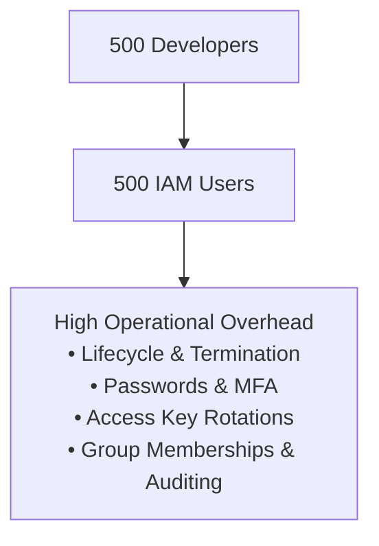

Operational overhead grows with the number of users.

That's why AWS provides better workforce identity patterns.

---

# 6. IAM Roles — The Most Important IAM Concept

A role is an identity that can be **assumed**.

Think:


The role itself doesn't have a traditional password or permanent access key.

---

# 7. Why Roles Exist

Roles solve the problem of:

> **"How can something access AWS without embedding long-lived credentials?"**

Example:

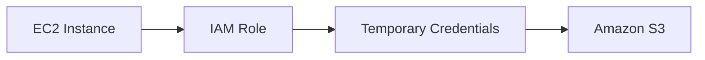

No:

```text
AWS_ACCESS_KEY_ID
AWS_SECRET_ACCESS_KEY
```

hardcoded into the application.

---

# 8. Role vs User — Exam Mental Model

| Requirement | Think |
|---|---|
| Human identity | IAM Identity Center / federation |
| AWS workload identity | IAM Role |
| EC2 accessing S3 | IAM Role |
| Lambda accessing DynamoDB | IAM Role |
| ECS task accessing S3 | IAM Role |
| Cross-account access | IAM Role |
| CI/CD accessing AWS | IAM Role |
| Long-lived human credentials | Avoid where possible |

---

# 9. IAM Policies

Policies define permissions.

Conceptually:

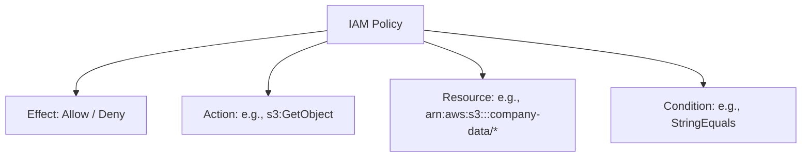

Example:

```text
Allow
  s3:GetObject
  on
  arn:aws:s3:::company-data/*
```

The goal is:

> **Grant exactly what is required and nothing more.**

That's **least privilege**.

---

# 10. Why Least Privilege Exists

Suppose an application only needs:

```text
S3 GetObject
```

but you give it:

```text
AdministratorAccess
```

Then a compromised application could potentially perform many destructive actions.

Instead:

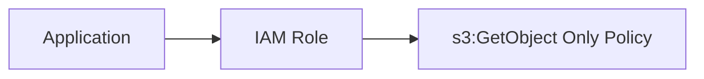

This reduces the blast radius.

---

# 11. IAM Is Not Just Security — It's Architecture

For SAP-C02, think:

> **IAM is an application dependency.**

Example:

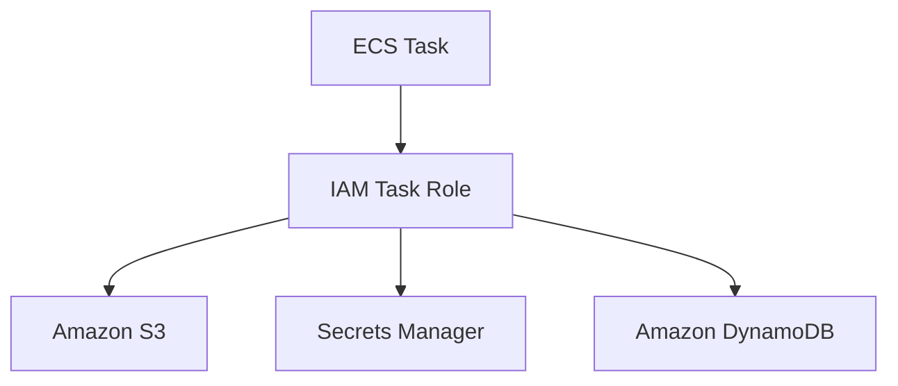

The architecture should define permissions as part of the workload design.

---

# 12. IAM Role for EC2

Classic exam architecture:

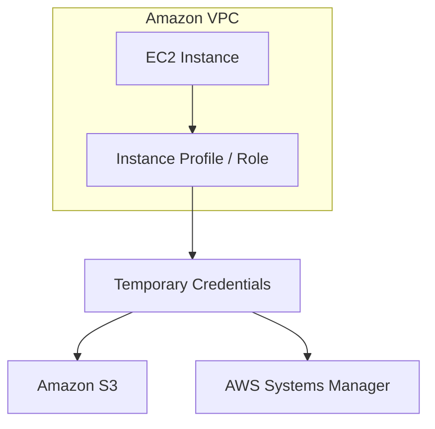

### Why?

Avoid:

```text
EC2
 │
 ▼
Hardcoded access keys
```

Use:

```text
EC2
 │
 ▼
IAM Role
```

### Operational overhead

**Low.**

AWS handles temporary credential delivery and rotation.

### Cost

IAM itself has no charge for the basic IAM capability.

The cost is primarily the AWS resources you access, not the IAM role itself.

---

# 13. IAM Role for Lambda

Same principle:

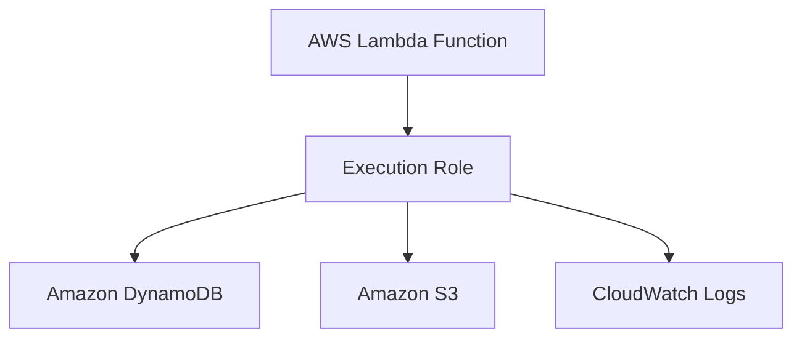

Don't create an IAM user for Lambda.

---

# 14. IAM Role for ECS

For ECS, SAP-C02 questions may distinguish:

### Task execution role

Used by ECS/Fargate infrastructure for things such as pulling images and sending logs, depending on configuration.

### Task role

Used by the application running inside the container.

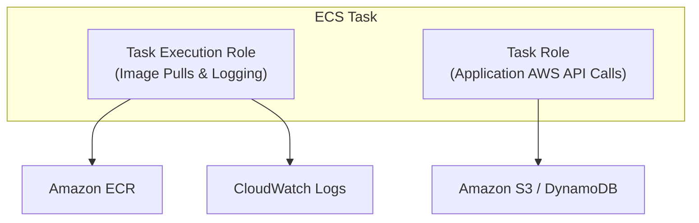

This separation is important for least privilege.

---

# 15. IAM Role for Cross-Account Access

Suppose:

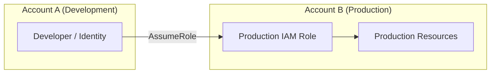

This is much better than sharing credentials between accounts.

---

# 16. Why Cross-Account Roles Exist

They solve:

> **"How can an identity from Account A temporarily access resources in Account B without creating permanent credentials in Account B?"**

Example:


Very common in multi-account AWS organizations.

---

# 17. IAM Role — Two Policies You Should Understand

For cross-account `AssumeRole`, think about:

```text
Trust Policy
     +
Permissions Policy
```

### Trust policy

Answers:

> **Who can assume this role?**

### Permissions policy

Answers:

> **What can the role do after assuming it?**

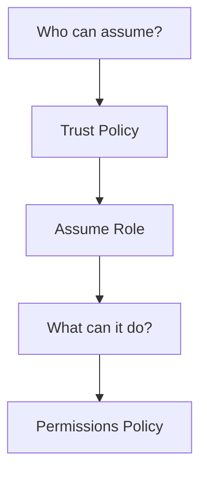

This distinction is a classic exam area.

---

# 18. IAM Identity Center — Why Does It Exist?

Now we move to the other service.

IAM Identity Center solves a different problem:

> **"How do I centrally manage human workforce access across many AWS accounts and applications?"**

Imagine:

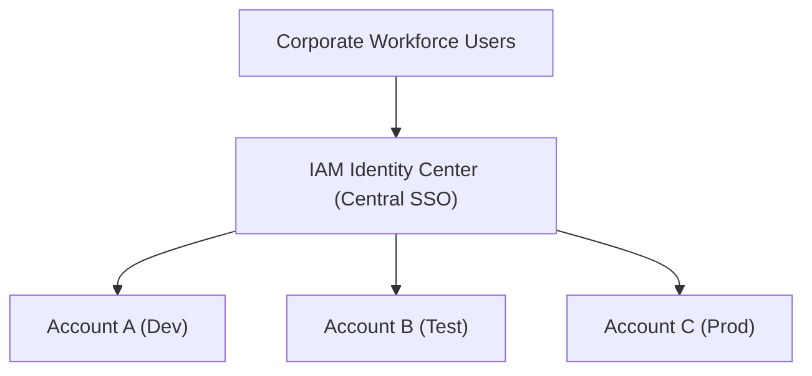

Instead of creating separate IAM users in every account.

---

# 19. The Problem at Scale

Without Identity Center:

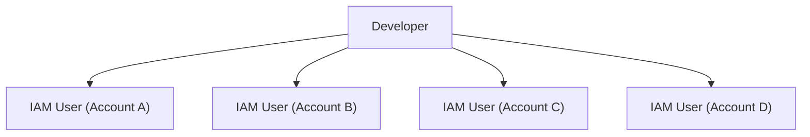

Huge operational problem.

With Identity Center:

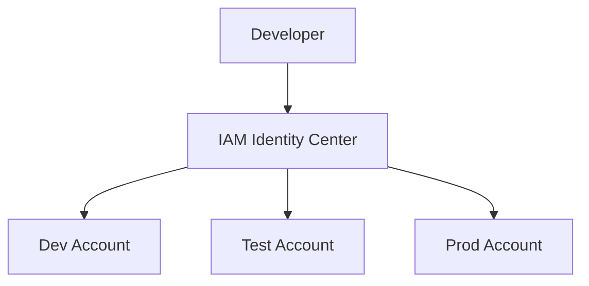

One workforce identity can obtain access to multiple accounts based on assignments.

---

# 20. IAM Identity Center + External IdP

In an enterprise, you often already have:

* Microsoft Entra ID
* Active Directory
* Okta
* Another SAML/OIDC-capable identity provider

Architecture:

```mermaid
flowchart LR
    User["Corporate User"] --> IdP["Corporate IdP (Entra ID / Okta)"] --> IC["IAM Identity Center"] --> Accounts["AWS Multi-Account Environment"]
```

This is a very strong enterprise architecture.

---

# 21. Why Not IAM Users?

Compare:

### IAM users

```text
User
 │
 ├── Account A
 ├── Account B
 ├── Account C
 └── Account D
```

### Identity Center

```text
User
 │
 ▼
Central Identity
 │
 ▼
Account assignments
```

The second is much easier to govern.

---

# 22. IAM Identity Center and AWS Organizations

These services commonly work together.

```mermaid
flowchart TD
    Org["AWS Organizations (Account Governance & OUs)"] <--> IC["IAM Identity Center (Workforce Access)"]
    IC --> AccA["Account A"]
    IC --> AccB["Account B"]
    IC --> AccC["Account C"]
```

### Organizations

Manages:

* Accounts
* Organizational Units
* SCPs
* Central governance

### Identity Center

Manages:

* Human workforce access
* Permission sets
* Account assignments

---

# 23. Permission Sets

This is a key Identity Center concept.

Think:

```text
Permission Set
      │
      ├── ReadOnly
      ├── Developer
      ├── DatabaseAdmin
      └── SecurityAudit
```

Then:

```mermaid
flowchart LR
    Group["Workforce Group (Developers)"] --> PermSet["Developer Permission Set"] --> Account["Target AWS Account"]
```

Example:

```text
Developers
    │
    ▼
Developer Permission Set
    │
    ▼
Dev Account
```

---

# 24. Permission Set vs IAM Policy

Don't confuse them.

### IAM policy

Defines AWS permissions.

### Identity Center permission set

Defines the permissions/session configuration assigned to workforce users/groups for AWS account access.

Conceptually:

```mermaid
flowchart TD
    Workforce["Workforce User"] --> PermSet["Permission Set"] --> Account["AWS Account"] --> ManagedRole["Managed IAM Role (Created in Account)"]
```

---

# 25. IAM Identity Center — Operational Overhead

### Without Identity Center

```text
1000 users
×
20 AWS accounts
```

Potentially huge access-management complexity.

### With Identity Center

```mermaid
flowchart TD
    Users["Users / Groups"] --> Central["Central Assignments"] --> Accounts["20 AWS Accounts"]
```

Much lower operational overhead.

That's why it is highly attractive in enterprise multi-account environments.

---

# 26. Cost Perspective

For SAP-C02, don't assume:

> "More secure = more expensive."

IAM is fundamentally a governance/control layer.

The important cost question is often:

> **Which architecture minimizes operational cost while maintaining security?**

### IAM

Basic IAM functionality does not carry a separate per-user/per-role charge.

### IAM Identity Center

The service is designed for centralized workforce access; the important architectural cost benefit is often **reduced administrative overhead**, rather than simply comparing an IAM user price against an Identity Center price.

Also consider costs of any external identity provider you use.

---

# 27. Operational Cost Is Often More Important

Suppose:

```text
500 engineers
20 AWS accounts
```

Manual IAM-user administration creates costs through:

* Onboarding
* Offboarding
* Permission changes
* Access reviews
* MFA management
* Credential management
* Auditing

Identity Center centralizes this.

So:

> **Lower operational overhead can be a much bigger architectural benefit than direct AWS service pricing.**

---

# 28. IAM vs IAM Identity Center

This is the most important comparison:

| Feature | IAM | IAM Identity Center |
|---|---|---|
| Primary purpose | AWS access control | Workforce access |
| Workloads | ✅ | Not primary |
| Human users | Possible, but not preferred for centralized workforce access | ✅ |
| Roles | ✅ | Uses AWS account roles through assignments |
| Policies | ✅ | Permission sets ultimately define permissions |
| Multi-account workforce | Possible but cumbersome | ✅ Designed for this |
| SSO | Not primary purpose | ✅ |
| External IdP | Federation possible | ✅ Strong fit |
| Operational overhead at scale | Higher if manually managed | Lower |
| Best mental model | "What can this principal do?" | "Which people get access to which accounts/apps?" |

---

# 29. The SAP-C02 Decision

If the question says:

> "Employees need centralized access to multiple AWS accounts."

Think:

**IAM Identity Center**

---

If it says:

> "EC2 needs to access S3."

Think:

**IAM Role**

---

If it says:

> "Lambda needs DynamoDB access."

Think:

**IAM execution role**

---

If it says:

> "Application in Account A needs temporary access to Account B."

Think:

**Cross-account IAM Role**

---

If it says:

> "Corporate employees authenticate using the company's existing identity provider."

Think:

**IAM Identity Center + external IdP**

---

# 30. Identity Center + Organizations + SCP

This is a **very important SAP-C02 architecture**.

These three solve different layers:

```mermaid
flowchart TD
    Org["AWS Organizations (Governance)"] --> IC["IAM Identity Center (Human Access)"]
    Org --> SCP["Service Control Policies (Guardrails)"]

    IC --> Accounts["AWS Accounts"]
    SCP --> Accounts
    Accounts --> IAM["IAM (Workload & Resource Access)"]
```

### Identity Center

> Who gets access?

### IAM

> What can the identity do?

### SCP

> What maximum permissions are allowed for the account/OU?

---

# 31. SCP vs IAM Policy

Classic exam trap.

Suppose:

```text
IAM Policy
Allow s3:DeleteBucket
```

But:

```text
SCP
Deny s3:DeleteBucket
```

Result:

```text
DENIED
```

Think:

> **SCP = organizational guardrail**

not a replacement for IAM permissions.

---

# 32. Permission Evaluation Mental Model

Simplified:

```mermaid
flowchart TD
    Req["Request"] --> Auth["Authentication"] --> IdentityRes["Identity & Resource Policies"] --> SCPBound["SCP / Boundaries / Explicit Denies"] --> Cond["Conditions"] --> Decision{"Allow or Deny?"}
```

The exact IAM evaluation model has more nuance, but for SAP-C02 you should always remember:

> **Explicit Deny wins.**

---

# 33. IAM Policy Conditions

Conditions are extremely valuable for least privilege.

For example:

```text
Allow S3 access
ONLY IF
source conditions are satisfied
```

Common condition concepts include:

* Source IP
* VPC endpoint
* MFA
* Requested region
* Principal tags
* Resource tags
* Encryption requirements
* Time-based conditions

This lets you move from:

```text
Allow
```

to:

```text
Allow IF...
```

---

# 34. ABAC — Attribute-Based Access Control

For large organizations, ABAC can dramatically reduce operational overhead.

Instead of creating:

```text
Project-A-Role
Project-B-Role
Project-C-Role
Project-D-Role
...
```

use tags/attributes.

Example:

```text
User:
Project = Finance

Resource:
Project = Finance
```

Policy:

```text
Allow access
IF
user.Project == resource.Project
```

Conceptually:

```mermaid
flowchart TD
    Policy["IAM ABAC Policy"] --> Match{"Principal Tag == Resource Tag?"}
    Match -->|YES| Allow["Allow Access"]
    Match -->|NO| Deny["Deny Access"]
```

For large enterprises:

> **ABAC can reduce policy-management overhead.**

---

# 35. RBAC vs ABAC

### RBAC (Role-Based Access Control)

```mermaid
flowchart LR
    User["User"] --> Role["Assigned Role"] --> Perms["Static Permissions"]
```

Easy to understand, but can create role explosion as teams scale.

### ABAC (Attribute-Based Access Control)

```mermaid
flowchart TD
    UserAttr["User Attribute (e.g., Project=Finance)"] --> Match{"Tags Match?"}
    ResAttr["Resource Tag (e.g., Project=Finance)"] --> Match
    Match -->|YES| Allow["Allow Access"]
    Match -->|NO| Deny["Deny Access"]
```

Can scale better when access follows organizational attributes.

---

# 36. IAM Access Analyzer

Although your stated topic is IAM and Identity Center, for SAP-C02 you should associate **IAM Access Analyzer**.

It helps identify:

* Resources shared externally
* Unintended access
* Policies that grant access
* Unused permissions in applicable scenarios

Mental model:

```mermaid
flowchart TD
    IAM["AWS IAM (Roles & Policies)"] --> Analyzer["IAM Access Analyzer"] --> Finding["Identifies Too Broad / External Access"]
```

This complements IAM rather than replacing it.

---

# 37. IAM Access Analyzer vs IAM

### IAM

> Defines access.

### IAM Access Analyzer

> Helps analyze access.

```mermaid
flowchart LR
    Policy["IAM Policy"] --> Perms["Granted Permissions"] --> Analyzer["Access Analyzer"] --> Alert["Unintended External Access Alert"]
```

---

# 38. IAM Access Analyzer vs Access Advisor

Another exam distinction.

### IAM Access Analyzer

Think:

> **"Who can access this resource?"**

and policy/access analysis.

### IAM Access Advisor

Think:

> **"Which services has this identity actually used?"**

This can help refine permissions.

```mermaid
flowchart TD
    Analyzer["Access Analyzer ➔ Potential / Configured Access"]
    Advisor["Access Advisor ➔ Historical Service Usage"]
```

---

# 39. IAM Credential Report

For IAM users, the credential report can provide account-level credential information useful for auditing.

But remember:

> If you're designing modern workforce access, don't solve an enterprise workforce problem by creating thousands of IAM users just so you can generate a credential report.

That's treating the symptom instead of solving the architecture.

---

# 40. Security Architecture — Recommended Modern Pattern

For a large organization:

```mermaid
flowchart TD
    IdP["Corporate IdP"] --> IC["IAM Identity Center"]
    IC --> Orgs["AWS Organizations (SCPs)"]
    Orgs --> Accounts["AWS Accounts"]
    Accounts --> IAM["IAM Roles"]
    IAM --> Workloads["EC2 / Lambda / ECS Tasks"]
    Workloads --> Services["AWS Services"]
```

This separates **human identity, organizational governance, and workload identity**.

---

# 41. Minimum Requirements — What Do I Actually Need?

This is the architectural way to think about it.

### Small AWS environment

```text
One account
Few engineers
Few workloads
```

You may only need:

```text
IAM Roles
IAM Policies
MFA
```

Don't introduce unnecessary complexity.

---

### Enterprise / Multi-account

```text
50+ AWS accounts
1000+ employees
Central corporate identity
```

Now:

```text
AWS Organizations
+
IAM Identity Center
+
External IdP
+
SCPs
+
IAM Roles
```

makes much more sense.

---

# 42. Operational Overhead Matrix

| Design | Small environment | Large enterprise |
|---|--:|--:|
| IAM users everywhere | Simple initially | 🔴 Very high |
| IAM roles | 🟢 Low | 🟢 Low |
| Identity Center | 🟢 Good | 🟢 Excellent |
| External IdP + Identity Center | Maybe unnecessary | 🟢 Excellent |
| Manual cross-account users | 🔴 | 🔴 |
| Cross-account roles | 🟢 | 🟢 |
| ABAC | Maybe unnecessary | 🟢 Excellent at scale |
| SCPs | Useful | 🟢 Essential governance tool |
| Access Analyzer | 🟢 | 🟢 |

---

# 43. Cost Optimization Through IAM

IAM isn't primarily a cost-control service, but it affects cost indirectly.

Example:

```text
Developer
   │
   ▼
Overly broad access
   │
   ▼
Can create expensive resources
   │
   ▼
Unexpected AWS bill
```

Least privilege can reduce the risk of unauthorized or accidental resource creation.

But don't confuse this with:

> IAM directly reduces AWS resource pricing.

It doesn't.

---

# 44. IAM and Automation

For automation:

```mermaid
flowchart LR
    CICD["CI/CD Pipeline"] --> Role["Federated IAM Role (OIDC)"] --> TempCreds["Temporary Credentials"] --> APIs["AWS APIs"]
```

Avoid:

```text
GitHub/GitLab/Jenkins
        │
        ▼
Long-lived AWS access key
```

Modern architectures can use **OIDC federation** so CI/CD systems obtain temporary AWS credentials through an IAM role.

This is a strong SAP-C02 security pattern.

---

# 45. Human vs Machine Identity

This is perhaps the **best mental model** for the entire topic:

```mermaid
flowchart TD
    Identity["IDENTITY MANAGEMENT"] --> Human["HUMAN WORKFORCE"]
    Identity --> Machine["MACHINE / WORKLOAD"]

    Human --> IC["IAM Identity Center"] --> SSO["Workforce SSO"] --> Accounts["AWS Accounts"]
    Machine --> Role["IAM Role"] --> TempCreds["Temporary Credentials"] --> Services["AWS Services"]
```

If you remember only one diagram, remember this.

---

# 46. Common SAP-C02 Traps

### ❌ Trap 1

> Create IAM users for every developer.

Usually not the preferred modern enterprise architecture.

Think:

**Identity Center + federation**

---

### ❌ Trap 2

> Give EC2 an IAM user access key.

Prefer:

**IAM role attached to EC2**

---

### ❌ Trap 3

> Give everyone AdministratorAccess because it is operationally simpler.

Fails:

**Least privilege**

---

### ❌ Trap 4

> Use IAM Identity Center for EC2 permissions.

Not the primary use case.

Think:

**IAM role**

---

### ❌ Trap 5

> Use SCP to grant permissions.

SCPs provide guardrails/max permissions; they don't grant the permissions needed by themselves.

---

### ❌ Trap 6

> IAM role's trust policy specifies what the role can do.

No.

```text
Trust Policy
    ↓
WHO can assume?

Permissions Policy
    ↓
WHAT can they do?
```

---

# 47. SAP-C02 Scenario Recognition

| Scenario | Best architecture |
|---|---|
| EC2 → S3 | EC2 IAM Role |
| Lambda → DynamoDB | Lambda execution role |
| ECS application → AWS APIs | ECS task role |
| Developer → multiple AWS accounts | IAM Identity Center |
| Existing corporate IdP | Identity Center + external IdP |
| Account A → Account B | Cross-account IAM Role |
| CI/CD → AWS | Federated IAM Role / OIDC |
| Prevent entire OU from disabling CloudTrail | SCP |
| Find unintended public/cross-account access | IAM Access Analyzer |
| Determine unused permissions | IAM Access Advisor / policy analysis |
| Large organization with dynamic project access | ABAC |
| Avoid long-lived credentials | IAM Roles / federation |

---

# 48. Cost / Trade-Off Decision Tree

Use this in the exam:

```mermaid
flowchart TD
    Start["WHO needs access?"] --> Type{"Human or Workload?"}
    
    Type -->|Workload| Role["IAM Role"]
    Type -->|Human| Accounts{"Multiple Accounts?"}

    Accounts -->|YES| IC["IAM Identity Center"]
    Accounts -->|NO| IAMFed["IAM / Federation"]
```

Then:

```mermaid
flowchart TD
    Ent{"Enterprise Scale?"} -->|YES| EnterpriseArch["Identity Center + Organizations + SCP + External IdP"]
```

---

# 49. The "Why Does It Exist?" Summary

| Service | Why AWS created it | Problem solved |
|---|---|---|
| **IAM** | Fine-grained AWS authorization | Who can do what to which AWS resource? |
| **IAM Role** | Temporary/workload identity | Avoid long-lived credentials |
| **IAM Policy** | Permission definition | Least privilege |
| **IAM Identity Center** | Central workforce access | SSO across AWS accounts |
| **Permission Set** | Standardized workforce permissions | Consistent account access |
| **AWS Organizations** | Multi-account governance | Central account management |
| **SCP** | Organization guardrails | Restrict maximum permissions |
| **IAM Access Analyzer** | Access analysis | Detect unintended access |
| **IAM Access Advisor** | Usage visibility | Identify unused permissions |

---

# 🧠 Final SAP-C02 Mental Model

Don't memorize:

> "IAM does X, Identity Center does Y."

Think in **four questions**:

```mermaid
flowchart TD
    Design["ACCESS DESIGN"] --> Who["WHO? (Identity Center / IAM Role)"]
    Design --> What["WHAT? (IAM Policy)"]
    Design --> Where["WHERE? (AWS Account / Resource)"]
    Design --> Cond["CONDITIONS? (Least Privilege / ABAC)"]
```

And then apply the architecture:

```mermaid
flowchart TD
    Human["HUMAN WORKFORCE"] --> IC["IAM Identity Center"] --> Accounts["AWS Accounts (Governed by SCPs)"] --> IAM["AWS IAM"] --> Roles["Workload Roles (EC2 / Lambda / ECS Task Roles)"] --> Services["AWS Services"]
```

### 🏆 If you see these phrases in SAP-C02:

**"Employees / workforce / SSO / multiple AWS accounts"**  
→ **IAM Identity Center**

**"EC2/Lambda/ECS/application needs AWS access"**  
→ **IAM Role**

**"Cross-account temporary access"**  
→ **IAM Role + trust policy**

**"Who can assume the role?"**  
→ **Trust policy**

**"What can the role do?"**  
→ **Permissions policy**

**"Central corporate identity"**  
→ **Identity Center + external IdP**

**"Organization-wide restriction"**  
→ **SCP**

**"Least privilege / unintended access"**  
→ **IAM policies + Access Analyzer**

**"Avoid operational overhead at enterprise scale"**  
→ **Centralized Identity Center + federation + groups/permission sets + Organizations/SCPs**

**"Avoid long-lived credentials"**  
→ **IAM Roles / federation / temporary credentials**

The key SAP-C02 trade-off is not simply **"which service is cheaper?"** It is:

> **Use the simplest identity architecture that provides least privilege, centralized governance, temporary credentials, and manageable access at the organization's scale.**

---

# 14. Cross-Account Access Patterns: Resource-Based Policies vs. IAM Role Assumption

When sharing resources across AWS accounts (e.g. S3 buckets, KMS keys, OpenSearch domains, SQS queues), you must select between two distinct cross-account authorization mechanisms:

```mermaid
flowchart TD
    subgraph Pattern1["1. Resource-Based Policy (Direct Access)"]
        UserA1["User in Account A<br/>(Keeps Account A permissions active)"] -->|"Direct API Call with Account A Identity"| SharedRes["Shared Resource in Account B<br/>(S3 Bucket / KMS / OpenSearch)<br/>• Principal: Account A ID List"]
        Note1["✅ User works in trusted origin account<br/>✅ No role switching required<br/>✅ Ideal for copying data between accounts"]
    end

    subgraph Pattern2["2. IAM Role Assumption (Identity Proxy)"]
        UserA2["User in Account A"] -->|"sts:AssumeRole"| TargetRole["IAM Role in Account B<br/>(Trust Policy: Account A)"]
        TargetRole ==>|"Temporary Account B Credentials"| ResourceB["Target Resource in Account B"]
        Note2["⚠️ User loses Account A permissions while role is active<br/>⚠️ Cannot simultaneously access Account A & Account B resources in one session"]
    end

    style Pattern1 fill:#d4edda,stroke:#28a745,stroke-width:2px
    style Pattern2 fill:#fff3cd,stroke:#ffc107,stroke-width:1px
```

### Architectural Comparison: Resource-Based Policies vs. Role Assumption

| Dimension | Resource-Based Policy | Cross-Account IAM Role Assumption |
| :--- | :--- | :--- |
| **Policy Attachment** | Attached directly to the target resource (e.g., S3 Bucket Policy, KMS Key Policy, OpenSearch Domain Policy). | IAM Role created in target account; trust policy allows source account. |
| **Principal Specification** | Explicitly lists allowed AWS Account IDs (`Principal: { "AWS": ["111122223333"] }`). | Trust policy grants assumption rights to source account. |
| **User Permission Context** | **User retains their original identity and origin account permissions**. | **User assumes target identity and temporarily forfeits origin account permissions**. |
| **Multi-Account Copying** | **Ideal for copying data back and forth** (e.g., `s3 cp` from Account A bucket to Account B bucket in a single command). | Cumbersome for cross-account copies because the user identity switches context. |
| **Compliance & Auditing** | Evaluated and audited continuously via **AWS Config Rules** (tracks policy drift and resource configurations). | Evaluated via IAM policies and audited via CloudTrail / Access Analyzer / Config. |

---

## 14.1 Real-World Exam Scenario: Media Shared Account Access & Policy Auditing

- **Scenario**: A media company hosting its infrastructure on AWS needs to share resources (S3, KMS, OpenSearch Service) with another AWS account specified as a list of AWS account IDs. Users in the external account must still work within their origin trusted account and not give up user permissions in place of role permissions (e.g. copying data between accounts). The solution must also continuously assess, audit, and monitor policy configurations.
- **Correct Solution**:
  1. Set up cross-account access using **Resource-Based Policies** on the target resources (S3, KMS, OpenSearch), specifying the external AWS Account ID list.
  2. Use **AWS Config Rules** to continuously audit changes to IAM/resource policies and monitor configuration compliance.
- **Why Distractor Options Fail**:
  - *User-Based / Identity-Based Policies*: Identity policies inside Account A cannot grant permissions to resources inside Account B unless Account B's resource or role trusts Account A.
  - *Service-Linked Roles & SCPs*: Service-linked roles are pre-defined roles for AWS internal service interactions, NOT cross-account user sharing. Service Control Policies (SCPs) restrict maximum permissions in AWS Organizations; they cannot grant cross-account resource access to external accounts.
  - *AWS Systems Manager for Auditing*: SSM manages OS-level patching and EC2 automation. **AWS Config** is the dedicated AWS service for continuously tracking and auditing AWS resource policy configurations.

---

## 14.2 Real-World Exam Scenario 2: Mobile App Federated Access via Custom SAML 2.0 & Custom OIDC (Cognito Identity Pools)

- **Scenario**: A company uses Lightweight Directory Access Protocol (LDAP) for employee authentication. They plan to release a smartphone mobile app that allows employees to have federated access to AWS resources. Due to strict security compliance, the mobile app must use a **custom-built solution for user authentication** and **IAM roles for granting user permissions to AWS resources**. What TWO solutions should the Solutions Architect implement? (Select TWO)
- **Architecture Solution (Select TWO)**:
  1. **Custom SAML 2.0 Solution**: Build a **custom SAML 2.0-compatible solution** to handle authentication and authorization. Configure the solution to use **LDAP for user authentication** and use **SAML assertions** (`sts:AssumeRoleWithSAML`) to perform authorization to the **IAM Identity Provider**.
  2. **Custom OIDC Solution + Amazon Cognito Identity Pools**: Build a **custom OpenID Connect (OIDC)-compatible solution** for the user authentication functionality. Use **Amazon Cognito Identity Pools** (`sts:AssumeRoleWithWebIdentity`) to authorize access and issue temporary IAM role credentials for AWS resources.

```mermaid
flowchart TD
    subgraph MobileApp["1. Smartphone Mobile Application Tier"]
        AppUser["Employee User (Mobile App)"]
        CustomAuth["Custom Identity Solution<br/>(Authenticates against Corporate LDAP)"]
        AppUser ==> CustomAuth
    end

    subgraph OptionA_SAML["2. Custom SAML 2.0 Federation Path (IAM Provider)"]
        SAML_Engine["Custom SAML 2.0 Assertion Engine"]
        IAM_SAML["AWS IAM SAML 2.0 Identity Provider<br/>(sts:AssumeRoleWithSAML)"]
        IAM_Role_SAML["Temporary IAM Credentials<br/>(SAML Federate Role)"]

        CustomAuth ==> SAML_Engine ==> IAM_SAML ==> IAM_Role_SAML
    end

    subgraph OptionB_OIDC["3. Custom OIDC Federation Path (Cognito Identity Pools)"]
        OIDC_Engine["Custom OIDC-Compatible Provider"]
        Cognito_IDP["Amazon Cognito Identity Pools<br/>(sts:AssumeRoleWithWebIdentity)"]
        IAM_Role_Cognito["Temporary IAM Credentials<br/>(Cognito Identity Role)"]

        CustomAuth ==> OIDC_Engine ==> Cognito_IDP ==> IAM_Role_Cognito
    end

    classDef saml fill:#7950f2,stroke:#5f3dc4,color:#ffffff;
    classDef cognito fill:#2b8a3e,stroke:#1e632b,color:#ffffff;

    class SAML_Engine,IAM_SAML,IAM_Role_SAML saml;
    class OIDC_Engine,Cognito_IDP,IAM_Role_Cognito cognito;
```

### Key Technical Rationale:
1. **Custom SAML 2.0 + LDAP Authentication**: SAML 2.0 is an open standard supported natively by AWS IAM. The custom solution authenticates the user against LDAP and generates a signed SAML assertion. The mobile app posts the SAML assertion to the AWS STS endpoint (`sts:AssumeRoleWithSAML`) to acquire temporary IAM role security credentials.
2. **Custom OIDC + Amazon Cognito Identity Pools**: Amazon Cognito Identity Pools natively support OpenID Connect (OIDC) identity providers. Once the user authenticates against the custom OIDC provider, Cognito Identity Pools exchange the OIDC token for temporary AWS IAM role credentials (`sts:AssumeRoleWithWebIdentity`).

### Why Distractor Options Fail:
- *Custom LDAP Connector with API Gateway + Lambda + DynamoDB token table (Your Selection)*: Storing custom authorization tokens permanently in a DynamoDB table is an anti-pattern for AWS resource federation. AWS security credentials must be generated dynamically using native AWS STS temporary security credentials (`AssumeRoleWithSAML` or `AssumeRoleWithWebIdentity`).
- *Leveraging AWS IAM Identity Center (formerly AWS SSO) for OIDC or Mobile SAML*:
  - IAM Identity Center supports **SAML 2.0 ONLY** for web application Single Sign-On (SSO) through web browsers. It does **NOT** support OpenID Connect (OIDC) applications.
  - IAM Identity Center is designed for workforce web browser portal sign-ins, not embedding into custom native mobile app SDK workflows using OIDC.

---

## 14.3 Real-World Exam Scenario 3: Serverless ReactJS SPA with Web Identity Federation (`AssumeRoleWithWebIdentity`)

- **Scenario**: A startup is building a web application (ReactJS SPA) letting users upload photos of good deeds with a 143-character caption. The app requires direct access to Amazon DynamoDB (for captions) and Amazon S3 (for photos). Prototype usage has no large spikes. What is the **MOST cost-effective and scalable architecture**?
- **Architecture Solution**:
  1. Register the web application with a **Web Identity Provider** (Google, Facebook, Amazon, or OIDC-compatible IdP) and use the `AssumeRoleWithWebIdentity` API of AWS STS (or Amazon Cognito Identity Pools) to generate temporary AWS credentials.
  2. Create an **IAM role** for the web provider with permissions allowing `GET` and `PUT` operations on **Amazon S3** and **Amazon DynamoDB**.
  3. Serve the ReactJS web app out of an **Amazon S3 bucket enabled for static website hosting**.

```mermaid
flowchart TD
    subgraph ClientSide["1. Client-Side Browser Tier (Zero Server Cost)"]
        Browser["ReactJS Single-Page App (SPA)<br/>(Hosted in Amazon S3 Static Website)"]
    end

    subgraph Authentication["2. Web Identity Federation Tier"]
        WebIdP["Social Web IdP<br/>(Google / Facebook / Amazon)"]
        STS["AWS Security Token Service (STS)<br/>(AssumeRoleWithWebIdentity)"]

        Browser ==>|"1. Login"| WebIdP
        WebIdP ==>|"2. IdP Auth Token"| Browser
        Browser ==>|"3. Trade Token"| STS
    end

    subgraph DirectAccess["3. Direct AWS Resource Access Tier"]
        TempCreds["Temporary IAM Credentials<br/>(Scoped IAM Role)"]
        S3Bucket[("Amazon S3 Bucket<br/>(Photo Uploads)")]
        DynamoTable[("Amazon DynamoDB<br/>(Captions)")]

        STS ==>|"4. Issue Temp Credentials"| TempCreds
        TempCreds ==>|"5. Direct GET/PUT"| S3Bucket
        TempCreds ==>|"5. Direct GET/PUT"| DynamoTable
    end

    classDef client fill:#7950f2,stroke:#5f3dc4,color:#ffffff;
    classDef sts fill:#1864ab,stroke:#0b5394,color:#ffffff;
    classDef aws fill:#2b8a3e,stroke:#1e632b,color:#ffffff;

    class Browser client;
    class WebIdP,STS,TempCreds sts;
    class S3Bucket,DynamoTable aws;
```

### Key Technical Rationale:
1. **ReactJS SPAs Hosted in S3 Static Website**: Single-Page Applications (ReactJS, Vue, Angular) build into client-side static HTML/JS/CSS bundles. Serving them out of an **S3 Static Website** eliminates EC2 server fleets, NGINX configuration, and ALB costs.
2. **Web Identity Federation (`AssumeRoleWithWebIdentity`)**: STS `AssumeRoleWithWebIdentity` or Amazon Cognito Identity Pools allow browser clients to exchange third-party social tokens (Google, Facebook, Amazon) directly for temporary IAM credentials without managing backend login servers.
3. **Direct Client Access to AWS**: Clients upload photos directly to S3 and write captions directly to DynamoDB using scoped IAM role temporary credentials, maximizing scalability and minimizing cost.

### Why Distractor Options Fail:
- *Token Vending Machine (TVM) on EC2 (Your Selection)*:
  - **Token Vending Machines (TVMs)** running on a single EC2 instance are an obsolete legacy anti-pattern from before native Web Identity Federation and STS `AssumeRoleWithWebIdentity` existed. Running a TVM on EC2 creates a Single Point of Failure (SPOF), severe performance bottlenecks, and unnecessary EC2 server costs.
- *Fleet of EC2 Instances with NGINX & Load Balancers*: Hosting a static ReactJS SPA on NGINX EC2 fleets behind an ALB incurs high fixed running costs (ALB $0.0225/hr + EC2 hours) compared to S3 static website hosting (cents per month for low usage).

---

## 14.4 Real-World Exam Scenario 4: Secure EC2 S3 Uploads (IAM Roles & IMDS vs. User Data & SCP Traps)

- **Scenario**: A mobile app for the Department of Transportation lets government staff upload photos of construction projects to an EC2 web server. The EC2 instance adds watermarks to the photos and uploads them to an Amazon S3 bucket. Which solution provides a **secure architecture** allowing the EC2 instance to upload photos to S3?
- **Architecture Solution**:
  - Create an **IAM role** with permissions to list (`s3:ListBucket`) and write (`s3:PutObject`) objects to the S3 bucket.
  - Attach the IAM role to the EC2 instance via an **Instance Profile**. The application on the EC2 instance automatically retrieves short-lived temporary security credentials from the **Instance Metadata Service (IMDS)** (`http://169.254.169.254/latest/meta-data/iam/security-credentials/`).

```mermaid
flowchart TD
    subgraph ComputeTier["1. EC2 Web Server Tier"]
        EC2App["Watermarking Web Application<br/>(Running on EC2 Instance)"]
        IMDS["Instance Metadata Service (IMDS)<br/>http://169.254.169.254/latest/meta-data/"]
        InstanceProfile["IAM Instance Profile<br/>(Attached to EC2 Instance)"]

        EC2App ==>|"1. Query IMDS Endpoint"| IMDS
        InstanceProfile -.->|"Binds IAM Role"| EC2App
    end

    subgraph CredentialsTier["2. Dynamic Temporary Security Credentials"]
        TempCreds["Short-Lived Temporary Credentials<br/>• Access Key ID<br/>• Secret Access Key<br/>• Session Token<br/>⚡ Automatically rotated by AWS!"]

        IMDS ==>|"2. Return Short-Lived Creds"| TempCreds
    end

    subgraph StorageTier["3. Target Storage Tier"]
        S3Bucket[("Amazon S3 Bucket<br/>(Durable Photo Storage)")]

        TempCreds ==>|"3. Authenticated s3:PutObject"| S3Bucket
    end

    classDef ec2 fill:#d1ecf1,stroke:#17a2b8,stroke-width:1px;
    classDef creds fill:#7950f2,stroke:#5f3dc4,color:#ffffff;
    classDef s3 fill:#2b8a3e,stroke:#1e632b,color:#ffffff;

    class EC2App,IMDS,InstanceProfile ec2;
    class TempCreds creds;
    class S3Bucket s3;
```

### Key Technical Rationale:
1. **IAM Roles & Temporary Credentials**: Applications running on EC2 instances should never use static long-lived IAM User access keys. Attaching an **IAM Role** provides short-lived temporary credentials rotated automatically by AWS.
2. **Instance Metadata Service (IMDS)**: Temporary credentials issued to instance roles are fetched by the AWS SDK/CLI from **Instance Metadata** (`http://169.254.169.254/latest/meta-data/iam/security-credentials/<role-name>`).
3. **Difference between User Data & Instance Metadata**:
   - **Instance Metadata (IMDS)**: Contains dynamic runtime metadata, including instance ID, IP addresses, and IAM role temporary security credentials.
   - **User Data**: Static launch shell scripts (`cloud-init`) executed once at instance creation. Passing security credentials in User Data is a severe security risk.

### Why Distractor Options Fail:
- *Retrieving temporary credentials from User Data*:
  - Credentials are fetched dynamically from **Instance Metadata (IMDS)**, NOT User Data! User Data contains static startup scripts.
- *Hardcoding IAM User Access Keys*:
  - Storing static IAM User access keys in application code, configuration files, or EC2 storage creates severe security risks (risk of leak via AMI snapshots or code repositories).
- *Attaching a Service Contr---

## 14.5 Real-World Exam Scenario 5: Extending On-Premises Active Directory to AWS (AWS Directory Service + Trust Relationship vs. Identity Center User Creation Trap)

- **Scenario**: A company manages all employee accounts and Windows devices using an on-premises Microsoft Active Directory. The IT department wants to enable Single Sign-On (SSO) so employees can use their **existing Windows account password** to connect to AWS resources. What is the recommended way to **extend the current Active Directory domain to AWS**?
- **Architecture Solution**:
  - Use **AWS Directory Service (AWS Managed Microsoft AD)** to integrate AWS resources with the existing on-premises Active Directory by establishing an **Active Directory Trust Relationship** (Forest/External Trust) over Direct Connect or VPN.
  - Enable Single Sign-On (SSO) using Managed Microsoft AD to allow seamless authentication with existing Windows credentials.

```mermaid
flowchart TD
    subgraph OnPremises["1. On-Premises Corporate Data Center"]
        OnPremAD[("On-Premises Microsoft Active Directory<br/>• Employee Accounts & Passwords<br/>• Domain: corp.example.com")]
    end

    subgraph HybridConnectivity["2. Encrypted Hybrid Network Link"]
        DX["AWS Direct Connect / Site-to-Site VPN"]
        OnPremAD <==> DX
    end

    subgraph AWSCloud["3. AWS Managed Cloud Directory Tier"]
        AWSManagedAD[("AWS Directory Service<br/>(AWS Managed Microsoft AD)<br/>• Domain: aws.example.com")]
        Trust["⚡ Active Directory Trust Relationship<br/>(Forest / External Trust)"]

        DX <==> AWSManagedAD
        OnPremAD <==|"Two-Way / One-Way Forest Trust"| Trust <==> AWSManagedAD
    end

    subgraph SSOTier["4. Seamless Single Sign-On (SSO) Access"]
        Console["AWS Management Console / CLI"]
        SSO["AWS SSO / IAM Identity Center<br/>(Integrated via Directory Service)"]

        AWSManagedAD ==> SSO ==> Console
    end

    classDef onprem fill:#fff3cd,stroke:#ffc107,stroke-width:1px;
    classDef ad fill:#7950f2,stroke:#5f3dc4,color:#ffffff;
    classDef sso fill:#2b8a3e,stroke:#1e632b,color:#ffffff;

    class OnPremAD onprem;
    class AWSManagedAD,Trust ad;
    class Console,SSO sso;
```

### Key Technical Rationale:
1. **Extending AD Domains via Active Directory Trust Relationships**: **AWS Managed Microsoft AD** allows establishing a secure, standards-based Active Directory Trust Relationship (Forest Trust or External Trust) with on-premises Active Directory over AWS Direct Connect or VPN. This extends identity authentication to AWS without syncing password hashes or rebuilding domain hierarchies.
2. **Seamless Windows Password SSO**: Because the trust relationship validates credentials against the on-premises domain controllers, employees log into AWS resources using their existing Windows Active Directory credentials.
3. **AWS Directory Service Integration**: AWS Services (IAM Identity Center, RDS for SQL Server, Amazon WorkSpaces) integrate directly with AWS Managed Microsoft AD to pass authentication requests back to the on-premises domain.

### Why Distractor Options Fail:
- *Manually Creating Users & Groups in AWS IAM Identity Center (Your Selection)*:
  - Manually creating local users and groups in IAM Identity Center provisions a **separate, isolated cloud directory**. It does **NOT extend** the existing on-premises Active Directory, forcing administrators to maintain duplicate credentials and preventing employees from using their current Windows account passwords.
  - When IAM Identity Center connects to Active Directory, it does so **via AWS Directory Service** (AD Connector or AWS Managed AD)—administrators do not manually create users/groups inside Identity Center.
- *Amazon Cognito*:
  - Amazon Cognito is designed for customer-facing web and mobile applications (B2C social identities like Google, Facebook, Apple, or OIDC/SAML user pools); it is not designed to extend internal enterprise Windows Active Directory domains to AWS infrastructure.
---

## 14.6 Real-World Exam Scenario 6: Enterprise LDAP Authentication & Identity Broker STS Federation (Select TWO)

- **Scenario**: A call center company hosts a corporate web portal on AWS linked to their on-premises data center via an AWS Direct Connect LAG (Private VIF). The web portal must authenticate users against an **on-premises LDAP server**. Once authenticated, users must access user-specific Amazon S3 buckets. What TWO implementations satisfy these requirements? (Select TWO)
- **Architecture Solutions (Select TWO)**:
  1. **Identity Broker + STS Federated Credentials**: Authenticate users against the on-premises LDAP server using a custom **Identity Broker**. Have the Identity Broker call **AWS Security Token Service (STS)** (`GetFederatedToken`/`AssumeRole`) to retrieve temporary federated credentials, which the web application uses to access the S3 bucket.
  2. **Application LDAP Auth + STS `AssumeRole`**: Have the web application authenticate users directly against LDAP to retrieve the associated **IAM Role ARN**. The application calls **AWS STS** (`AssumeRole`) to obtain temporary IAM role credentials and access the user's S3 bucket.

```mermaid
flowchart TD
    subgraph OnPremises["1. On-Premises Corporate Network"]
        LDAP[("On-Premises LDAP Server<br/>(User Credentials & Group Directory)")]
    end

    subgraph IdentityBrokerTier["2. Identity Broker & Authentication Tier"]
        UserApp["Web Application / Identity Broker"]
        UserApp ==>|"1. Validate Username/Password"| LDAP
        LDAP ==>|"2. Return Identity & Role ARN"| UserApp
    end

    subgraph STSTier["3. AWS Security Token Service (STS) Federation"]
        STS["AWS Security Token Service (STS)<br/>(AssumeRole / GetFederatedToken)"]
        UserApp ==>|"3. Request Temp Credentials"| STS
        STS ==>|"4. Issue Temporary AWS Credentials"| UserApp
    end

    subgraph ResourceTier["4. Scoped S3 Object Access"]
        S3Bucket[("Amazon S3 Bucket<br/>(User-Specific Bucket / Folder)")]
        UserApp ==>|"5. Authenticated S3 Operation"| S3Bucket
    end

    classDef onprem fill:#fff3cd,stroke:#ffc107,stroke-width:1px;
    classDef broker fill:#7950f2,stroke:#5f3dc4,color:#ffffff;
    classDef sts fill:#1864ab,stroke:#0b5394,color:#ffffff;
    classDef s3 fill:#2b8a3e,stroke:#1e632b,color:#ffffff;

    class LDAP onprem;
    class UserApp broker;
    class STS sts;
    class S3Bucket s3;
```

### Key Technical Rationale:
1. **LDAP Authentication Prior to STS Calling**: Users MUST be authenticated against the on-premises **LDAP directory FIRST** before calling AWS STS to issue temporary credentials.
2. **Two Valid Enterprise Identity Broker Patterns**:
   - **Pattern A (Identity Broker)**: Identity Broker authenticates user against LDAP $\rightarrow$ Identity Broker calls `STS:GetFederatedToken` or `STS:AssumeRole` $\rightarrow$ Hands temporary credentials to the web app/client.
   - **Pattern B (Application Role Mapping)**: Web App authenticates user against LDAP $\rightarrow$ Retrieves associated IAM Role name $\rightarrow$ App calls `STS:AssumeRole` $\rightarrow$ Uses temporary credentials to perform S3 operations.

### Why Distractor Options Fail:
- *Identity Broker assuming an IAM role via STS without LDAP authentication*:
  - Completely omits validating user credentials against the on-premises LDAP server! An identity broker cannot issue temporary AWS credentials without first verifying user identity against LDAP.
- *Passing raw LDAP credentials directly to IAM*:
  - AWS IAM API does NOT accept raw LDAP credentials or passwords. Authentication must occur against LDAP first, followed by an STS API call (`AssumeRole`).
- *Using Direct Connect Gateway & Transit VPC for LDAP authentication*:
  - Direct Connect Gateway and Transit VPC handle network routing; they do NOT perform user authentication or issue temporary IAM S3 credentials.

---

## 14.7 Real-World Exam Scenario 7: CloudFormation EC2 Instance Profile IAM Role Binding (Instance Profile vs. SSM Parameter Store Trap)

- **Scenario**: A healthcare company uses AWS CloudFormation to deploy a 3-tier web application (web, application, DynamoDB database tier). The architect must allow application EC2 instances access to the DynamoDB tables without exposing API access/secret keys anywhere in code or templates. What is the correct solution?
- **Architecture Solution**:
  - Create an **IAM Role** (`AWS::IAM::Role`) in the CloudFormation template assigning the required permissions to read and write from the DynamoDB table.
  - Have the `IamInstanceProfile` property of the application EC2 instance reference the role via an **IAM Instance Profile** (`AWS::IAM::InstanceProfile`).

```mermaid
flowchart TD
    subgraph CloudFormation["1. AWS CloudFormation Provisioning Engine"]
        IAMRole["AWS::IAM::Role<br/>(Policy: dynamodb:GetItem, dynamodb:PutItem)"]
        InstanceProfile["AWS::IAM::InstanceProfile<br/>(Binds IAM Role for EC2 Compute)"]
        EC2Resource["AWS::EC2::Instance<br/>(Property: IamInstanceProfile: !Ref InstanceProfile)"]

        IAMRole ==> InstanceProfile ==> EC2Resource
    end

    subgraph RuntimeCompute["2. EC2 Instance Metadata Runtime (Zero Stored Keys)"]
        EC2Instance["EC2 Application Instance"]
        IMDS["Instance Metadata Service (IMDS)<br/>http://169.254.169.254/latest/meta-data/"]
        DynamoDB[("Amazon DynamoDB Table")]

        EC2Resource -.-> EC2Instance
        EC2Instance ==>|"1. Fetch Temp Security Credentials"| IMDS
        EC2Instance ==>|"2. Authenticated Read/Write"| DynamoDB
    end

    classDef cfn fill:#7950f2,stroke:#5f3dc4,color:#ffffff;
    classDef runtime fill:#2b8a3e,stroke:#1e632b,color:#ffffff;

    class IAMRole,InstanceProfile,EC2Resource cfn;
    class EC2Instance,IMDS,DynamoDB runtime;
```

### Key Technical Rationale:
1. **IAM Instance Profiles for EC2**: In CloudFormation, to attach an IAM role to an EC2 instance, you must create an `AWS::IAM::InstanceProfile` resource that wraps the `AWS::IAM::Role`, and then reference the Instance Profile in the `IamInstanceProfile` property of `AWS::EC2::Instance` or `AWS::AutoScaling::LaunchConfiguration`.
2. **Zero Long-Lived API Credentials**: Applications automatically retrieve short-lived, rotated temporary security credentials from **Instance Metadata (IMDS)**, eliminating static access/secret keys in application code or templates.

### Why Distractor Options Fail:
- *Storing IAM Role ARN in SSM Parameter Store (Your Selection)*:
  - Creating an SSM parameter via `AWS::SSM::Parameter` to store the IAM Role ARN and pointing the `IamInstanceProfile` property to the parameter is completely unnecessary and invalid!
  - CloudFormation properties reference resource ARNs directly in YAML/JSON using `!GetAtt IAMRole.Arn` or `!Ref InstanceProfile`.
  - Passing an SSM Parameter containing a Role ARN to the `IamInstanceProfile` property creates a CloudFormation syntax validation error because `IamInstanceProfile` expects an `AWS::IAM::InstanceProfile` resource reference or name, NOT an SSM Parameter object!
- *Passing IAM User Access/Secret Keys via User Data*:
  - User Data stores plain-text startup scripts. Passing access keys via User Data exposes long-lived static credentials in EC2 metadata and CloudFormation execution logs.
- *Entering IAM User Access/Secret Keys in CloudFormation Parameters*:
  - Hardcoding or entering static IAM user access/secret keys exposes credentials and creates long-lived static credentials, violating least privilege and security rules.

---

## 14.8 Real-World Exam Scenario 8: Hybrid Workforce Single Sign-On (On-Premises SAML 2.0 IdP + STS + IAM Identity Center vs. AssumeRoleWithWebIdentity Trap)

- **Scenario**: A fast-food chain adopts a hybrid cloud infrastructure extending its on-premises data centers into AWS. The architect must allow corporate employees, who are already logged into their corporate accounts, to access the AWS Management Console to manage AWS resources without creating separate IAM users or requiring users to memorize multiple credentials. What is the BEST way to handle user authentication?
- **Architecture Solution**:
  - Authenticate users using an **on-premises SAML 2.0-compliant Identity Provider (IdP)** (e.g. ADFS, Ping Identity, Okta).
  - Retrieve temporary security credentials using **AWS Security Token Service (STS)** (`AssumeRoleWithSAML`).
  - Grant federated access to the AWS Management Console via **AWS IAM Identity Center** (formerly AWS Single Sign-On).

```mermaid
flowchart TD
    subgraph OnPremise ["1. On-Premises Corporate Enterprise Tier"]
        Employees["Corporate Employees<br/>(Signed into Corporate Accounts)"]
        SAML_IdP["On-Premises SAML 2.0 IdP<br/>(ADFS / Ping / Okta)"]
        Employees ==>|"1. Corporate Single Sign-On"| SAML_IdP
    end

    subgraph FederationTier ["2. AWS Identity Center & STS Federation"]
        IdentityCenter["AWS IAM Identity Center<br/>🔒 SAML 2.0 Service Provider Endpoint"]
        SAML_IdP ==>|"2. SAML 2.0 Assertion Token"| IdentityCenter

        STS["AWS Security Token Service (STS)<br/>⚡ STS:AssumeRoleWithSAML"]
        IdentityCenter ==>|"3. Exchange SAML Assertion"| STS
        STS ==>|"4. Issue Temporary Access Keys & Session Token"| IdentityCenter
    end

    subgraph AWSConsole ["3. AWS Cloud Management Console"]
        Console["AWS Management Console<br/>(Federated Role Access to AWS Resources)"]
        IdentityCenter ==>|"5. Seamless Federated Console Access"| Console
    end

    classDef onprem fill:#fff3cd,stroke:#ffc107,stroke-width:1px;
    classDef fed fill:#7950f2,stroke:#5f3dc4,color:#ffffff;
    classDef console fill:#2b8a3e,stroke:#1e632b,color:#ffffff;

    class Employees,SAML_IdP onprem;
    class IdentityCenter,STS fed;
    class Console console;
```

### Key Technical Rationale:
1. **Enterprise Workforce Federation (`AssumeRoleWithSAML`)**:
   - For enterprise corporate workforce single sign-on, corporate identities authenticate against an on-premises **SAML 2.0-compliant IdP**.
   - The IdP emits a SAML assertion token exchanged via **AWS STS (`AssumeRoleWithSAML`)** for short-lived, temporary AWS credentials, avoiding manual IAM user creation.
2. **AWS IAM Identity Center for Centralized Console Access**:
   - **AWS IAM Identity Center** (formerly AWS SSO) acts as the central SAML 2.0 service provider endpoint, integrating with enterprise IdPs via SAML/SCIM to grant single sign-on access to the AWS Management Console across multi-account organizations.

### Why Distractor Options Fail:
- *Using `STS:AssumeRoleWithWebIdentity` (Your Selection)*:
  - **`STS:AssumeRoleWithWebIdentity` is strictly for Public Consumer Web Identity Federation** (OpenID Connect / OAuth 2.0) with public social identity providers like **Facebook, Google, Login with Amazon, or Amazon Cognito Identity Pools**!
  - Using `AssumeRoleWithWebIdentity` for corporate SAML 2.0 enterprise employee logins is **INVALID** and will fail!
- *Integrating Authentication with Amazon AppFlow*:
  - **Amazon AppFlow** is a managed data integration service used to transfer data between SaaS applications (Salesforce, Slack, ServiceNow, SAP) and AWS storage services (S3, Redshift). AppFlow is **NOT** an identity federation or authentication tool!
- *Web Identity Federation for Corporate Console Access*:
  - Web Identity Federation is designed for public mobile/web application users logging in via social accounts (Facebook, Google), NOT for corporate workforce employees managing AWS infrastructure via SAML 2.0 SSO.

---

## 14.9 Real-World Exam Scenario 9: Direct Mobile App S3 & DynamoDB Access via Web Identity Federation (STS `AssumeRoleWithWebIdentity` vs. Static Key & SAML Traps)

- **Scenario**: A startup develops a React Native mobile application for public users to report street infrastructure damage by uploading photos/videos to Amazon S3 and posting short text summaries to Amazon DynamoDB. To resolve availability issues with a custom backend GraphQL API, the team removed the backend API and decided to let the mobile app directly access S3 and DynamoDB while managing user authentication. What is the most cost-effective and scalable architecture for this requirement?
- **Architecture Solution**:
  - Set up **Web Identity Federation using the `AssumeRoleWithWebIdentity` API of AWS STS** and register with social identity providers (Amazon, Google, Facebook, or any OIDC-compatible IdP).
  - Create an **IAM role** for the provider and set up permissions allowing access to Amazon S3 and Amazon DynamoDB.
  - The mobile app authenticates with the social IdP, presents the IdP token to AWS STS via `AssumeRoleWithWebIdentity` to receive **temporary security credentials**, and uses these credentials to access S3 and DynamoDB directly.

```mermaid
flowchart TD
    subgraph MobileApp ["1. Public Client Tier (React Native Mobile App)"]
        User["Public App User"]
        App["Mobile Application Client"]
        User ==> App
    end

    subgraph IdentityProvider ["2. External Web Identity Provider (OIDC / OAuth 2.0)"]
        SocialIdP["Social Identity Provider<br/>(Google, Facebook, Amazon, OIDC IdP)"]
        App ==>|"1. User Authentication Request"| SocialIdP
        SocialIdP ==>|"2. Returns OIDC / OAuth 2.0 ID Token"| App
    end

    subgraph STSFederation ["3. AWS Security Token Service (STS)"]
        STSService["AWS STS Engine<br/>⚡ API: AssumeRoleWithWebIdentity"]
        IAMRole["IAM Role for Provider<br/>📜 S3 PutObject & DynamoDB PutItem Policy"]

        App ==>|"3. Calls AssumeRoleWithWebIdentity with IdP Token"| STSService
        STSService ==>|"4. Validates Token & Assumes IAM Role"| IAMRole
        STSService ==>|"5. Vends Short-Lived Temporary Credentials"| App
    end

    subgraph AWSResources ["4. AWS Target Resources Tier"]
        S3Bucket[("Amazon S3 Bucket<br/>📸 Media Photos & Videos")]
        DynamoTable[("Amazon DynamoDB<br/>📝 100-Char Damage Summaries")]

        App ==>|"6. Direct Upload with Temporary Credentials"| S3Bucket
        App ==>|"6. Direct Write with Temporary Credentials"| DynamoTable
    end

    classDef mobile fill:#fff3cd,stroke:#ffc107,stroke-width:1px;
    classDef idp fill:#d1ecf1,stroke:#17a2b8,stroke-width:1px;
    classDef sts fill:#7950f2,stroke:#5f3dc4,color:#ffffff;
    classDef res fill:#2b8a3e,stroke:#1e632b,color:#ffffff;

    class User,App mobile;
    class SocialIdP idp;
    class STSService,IAMRole sts;
    class S3Bucket,DynamoTable res;
```

### Key Technical Rationale:
1. **AWS STS `AssumeRoleWithWebIdentity` for Public Mobile Apps**:
   - For public-facing mobile/web applications logging users in through public social identity providers (Google, Facebook, Amazon, Apple, OIDC), **`sts:AssumeRoleWithWebIdentity`** exchanges external IdP authentication tokens for temporary AWS security credentials.
   - This eliminates custom backend API servers, providing infinite scalability and zero server management costs.
2. **Short-Lived Temporary Credentials**:
   - The mobile application receives temporary credentials (`AccessKeyId`, `SecretAccessKey`, `SessionToken`) mapped to an IAM role. Long-term static keys are NEVER embedded in the mobile client binary.

### Why Distractor Options Fail:
- *Embedding Long-Term AWS Access & Secret Keys in Mobile App*:
  - **Severe Security Violation**: Storing static IAM user access keys (`AKIA...`) inside a mobile client binary allows malicious users to decompile the app, extract the keys, and gain permanent unauthorized access to AWS account resources!
- *Using `STS:AssumeRole` API*:
  - **Invalid Authentication Mechanism**: `AssumeRole` requires the caller to ALREADY possess AWS IAM credentials to assume another role. It CANNOT consume external web identity (OIDC/OAuth) tokens directly from public social IdPs!
- *Using `STS:AssumeRoleWithSAML` API*:
  - **Enterprise vs. Social Misalignment**: `AssumeRoleWithSAML` is strictly designed for enterprise SAML 2.0 identity providers (e.g. ADFS, Ping, Okta), NOT public consumer social identity providers (Google, Facebook, Login with Amazon).

---

## 14.10 Real-World Exam Scenario 10: Non-SAML On-Premises LDAP Federation via Custom Identity Broker & AWS STS (Identity Broker + `AssumeRole` vs. Direct IAM LDAP Integration & SAML Traps)

- **Scenario**: A software company operates an on-premises LDAP server and has established an IPsec VPN connection to its AWS VPC. The company wants to allow employees to access AWS resources using their existing corporate LDAP account credentials. How should the Solutions Architect implement this requirement?
- **Architecture Solution**:
  - Create a **custom Identity Broker application** that authenticates employee credentials against the on-premises **LDAP server**.
  - Upon successful LDAP authentication, the Identity Broker calls **AWS Security Token Service (AWS STS)** via `AssumeRole` (or `GetFederationToken`) to generate **temporary AWS security credentials**.
  - The employees use these temporary credentials to access AWS resources securely.

```mermaid
flowchart TD
    subgraph CorporateOnPrem ["1. On-Premises Corporate Tier (VPN Link)"]
        Emp["Corporate Employee / Application"]
        IdentityBroker["Custom Identity Broker Application<br/>(Hosts authentication interface)"]
        LDAP["On-Premises LDAP Directory Server<br/>(Stores corporate account credentials)"]

        Emp ==>|"1. Enters Corporate Credentials"| IdentityBroker
        IdentityBroker <==|"2. Authenticates Credentials over IPsec VPN"==> LDAP
    end

    subgraph AWSCloudSTS ["2. AWS Security Token Service (STS) Tier"]
        STS["AWS Security Token Service (AWS STS)"]
        IAMRole["Target IAM Role<br/>📜 Vends Temporary Access Keys"]

        IdentityBroker ==>|"3. Calls sts:AssumeRole upon LDAP success"| STS
        STS ==>|"4. Assumes Role & Vends Temporary Credentials"| IAMRole
        STS ==>|"5. Returns Access Key, Secret Key & Session Token"| IdentityBroker
    end

    subgraph AccessExecution ["3. AWS Resource Access Tier"]
        AWSResources["AWS Resources (S3, EC2, DynamoDB)"]

        IdentityBroker ==>|"6. Hands Temporary Credentials to User"| Emp
        Emp ==>|"7. Accesses AWS Resources with Short-Lived Credentials"| AWSResources
    end

    classDef onprem fill:#fff3cd,stroke:#ffc107,stroke-width:1px;
    classDef sts fill:#7950f2,stroke:#5f3dc4,color:#ffffff;
    classDef aws fill:#2b8a3e,stroke:#1e632b,color:#ffffff;

    class Emp,IdentityBroker,LDAP onprem;
    class STS,IAMRole sts;
    class AWSResources aws;
```

### Key Technical Rationale:
1. **Custom Identity Broker for Non-SAML Identity Stores (LDAP)**:
   - When an identity store (such as a custom LDAP server) does **NOT** natively support SAML 2.0 or OIDC standards out-of-the-box, AWS IAM federation requires a **custom Identity Broker application**.
   - The Identity Broker acts as an intermediary: it verifies LDAP credentials against the corporate directory and bridges authentication to AWS.
2. **AWS STS `AssumeRole` for Temporary Credentials**:
   - Once LDAP authentication succeeds, the Identity Broker calls `sts:AssumeRole` (or `sts:GetFederationToken`) to generate short-lived temporary security credentials (`AccessKeyId`, `SecretAccessKey`, `SessionToken`) for the employee.

### Why Distractor Options Fail:
- *Directly Integrating On-Premises LDAP Server with AWS IAM*:
  - **Fictional Direct Integration**: AWS IAM does **NOT** directly connect to or authenticate against custom on-premises LDAP servers without a SAML/OIDC identity provider or custom Identity Broker!
- *Setting Up Direct SAML Federation on LDAP Server*:
  - **Protocol Mismatch**: Raw LDAP servers (port 389/636) store user directory trees; they do **not** generate SAML 2.0 assertions. SAML 2.0 federation requires a dedicated SAML Identity Provider (ADFS, Ping, Okta, Keycloak). You cannot establish direct SAML federation with a raw LDAP server without an IdP or Identity Broker.
- *Calling STS `GetFederationToken` without verifying LDAP authentication first*:
  - **Bypasses Authentication**: The Identity Broker must first authenticate the user against the corporate LDAP directory before requesting temporary credentials from AWS STS.

---

## 15. Common SAP-C02 IAM & Identity Traps


1. **Trap 1: Long-Lived Access Keys for Applications**: Hardcoding IAM user access keys in EC2 or Lambda code is an anti-pattern. Always attach **IAM Roles** (Instance Profiles / Execution Roles).
2. **Trap 2: Creating Individual IAM Users for Multi-Account Enterprises**: Manually managing IAM users across dozens of accounts causes massive operational overhead. Use **AWS IAM Identity Center (formerly AWS SSO)** with external IdP SAML/SCIM.
3. **Trap 3: Using Token Vending Machines (TVMs) on EC2**: TVMs on EC2 are obsolete SPOFs. Use **STS `AssumeRoleWithWebIdentity`** or **Amazon Cognito Identity Pools**.
4. **Trap 4: Forgetting Resource-Based Policies for Cross-Account Copies**: Using IAM Role assumption for cross-account S3 copies forces users to switch identities and lose origin permissions. Use **S3 Resource-Based Bucket Policies** so users retain origin account credentials.
5. **Trap 5: Hosting ReactJS/Angular SPAs on EC2 Fleets**: Single-Page Applications are static JavaScript bundles. Always host SPAs on **Amazon S3 Static Website Hosting** (or CloudFront CDN) paired with **Cognito/STS Web Identity Federation** for lowest cost and infinite scale.
6. **Trap 6: Confusing Instance Metadata (IMDS) with User Data**: Temporary security credentials for EC2 IAM instance profiles are retrieved dynamically from **Instance Metadata (`169.254.169.254`)**, NEVER static User Data launch scripts or attached Service Control Policies (SCPs).
7. **Trap 7: Manually Creating Local Users in IAM Identity Center to Integrate On-Premises AD**: Manually creating local users/groups in IAM Identity Center provisions an isolated cloud directory that fails to extend on-premises Active Directory. To extend an existing Windows AD domain to AWS for SSO, always use **AWS Directory Service (AWS Managed Microsoft AD)** with a **Forest Trust Relationship** (or AD Connector).
8. **Trap 8: Omitting LDAP Authentication Step in Identity Broker STS Flow**: An Identity Broker CANNOT issue AWS STS temporary credentials without first validating the user's identity against the on-premises LDAP server. Always authenticate against LDAP FIRST, then call `STS:AssumeRole` or `STS:GetFederatedToken`.
9. **Trap 9: Storing IAM Role ARNs in SSM Parameter Store to Attach to EC2 Instance Profiles**: In CloudFormation, attach IAM roles to EC2 instances by creating an `AWS::IAM::InstanceProfile` and referencing it directly (`!Ref InstanceProfile`). Never wrap Role ARNs in `AWS::SSM::Parameter` to populate the `IamInstanceProfile` property!
10. **Trap 10: Confusing `AssumeRoleWithSAML` with `AssumeRoleWithWebIdentity` for Corporate Access**: Corporate employee logins via on-premises Active Directory/SAML 2.0 require **`STS:AssumeRoleWithSAML`** (or IAM Identity Center). **`STS:AssumeRoleWithWebIdentity`** is strictly for public consumer social logins (Facebook, Google, Cognito). Never use `AssumeRoleWithWebIdentity` or Amazon AppFlow for corporate enterprise SAML 2.0 federation!

---