Prescribe Security Controls

For AWS Solutions Architect Professional, think about this topic as:

> **“How do I design security controls that detect, prevent, investigate, and centralize security risks across an AWS environment?”**

The four services in your syllabus solve different problems:

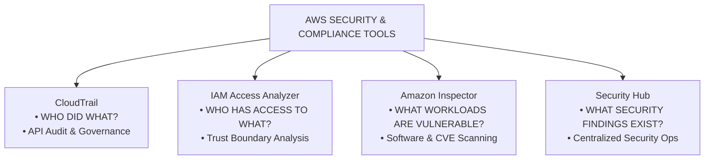

The important SAP-C02 skill is knowing when each service is appropriate, what minimum architecture satisfies the requirement, and what additional cost or operational burden your design introduces.

---

# 1. First: Security Control Categories

Before looking at individual services, classify the requirement.

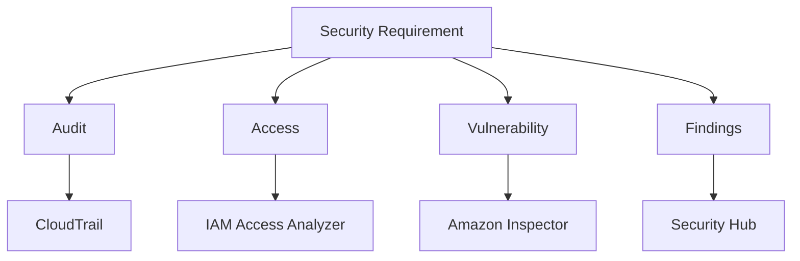

Think of them as different layers:

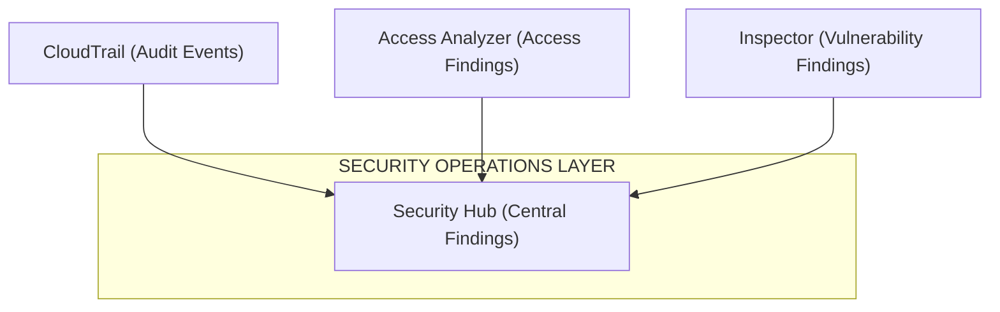

This distinction is extremely important for the exam.

---

# 2. AWS CloudTrail

## Why does CloudTrail exist?

AWS resources are controlled through API calls.

For example:

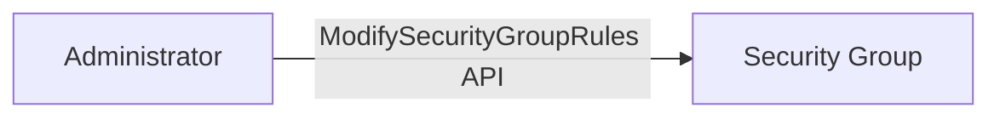

If something goes wrong, you need to know:

```text
WHO?
WHAT?
WHEN?
WHERE FROM?
WHICH RESOURCE?
```

CloudTrail records AWS API activity.

The problem it solves is:

> **“I need an audit trail of activity in my AWS environment.”**

CloudTrail is therefore primarily an:

> **Audit and governance service.**

---

# 3. What problem does CloudTrail solve?

Imagine somebody changes an S3 bucket policy.

Without an audit trail:

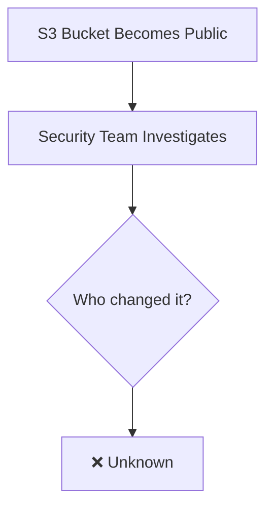

With CloudTrail:

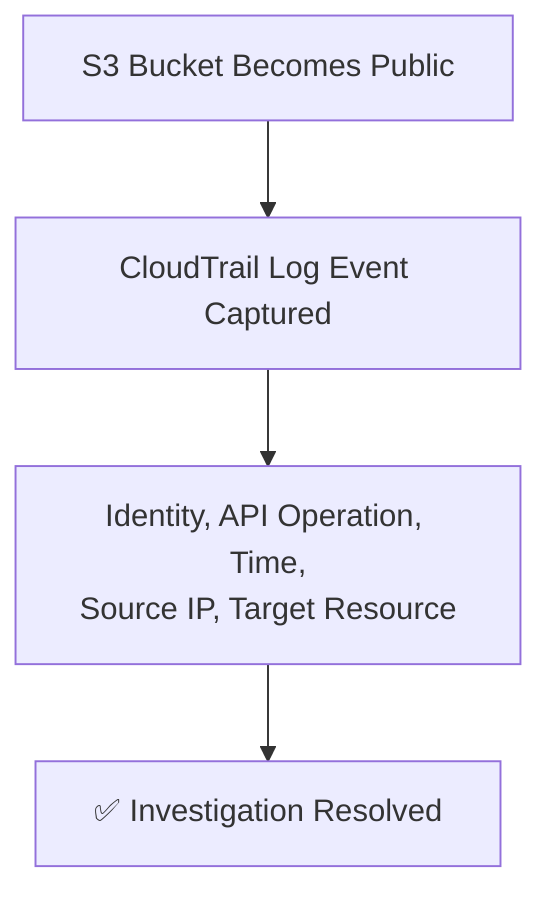

This is why CloudTrail exists.

---

# 4. What does CloudTrail actually record?

Think:

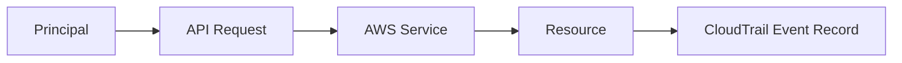

Examples:

```text
CreateRole
DeleteBucket
PutBucketPolicy
RunInstances
ModifySecurityGroupRules
CreateKey
AssumeRole
```

The important exam phrase is:

> **“Determine who performed an API operation.”**

Think:

**CloudTrail.**

---

# 5. Minimum CloudTrail architecture

For a simple account:

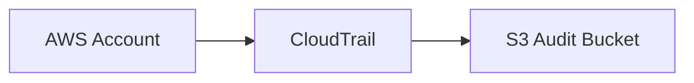

For an enterprise:

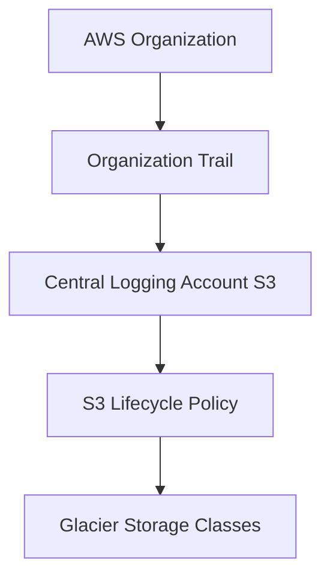

AWS manages the underlying CloudTrail infrastructure.

---

## 5.1 Enterprise Multi-Region & Global Service CloudTrail Requirements

For enterprise compliance (e.g., financial, healthcare, government), a basic single-region trail is insufficient. The logging architecture must capture **all regional resources** AND **all global security services** with strict integrity and durability controls:

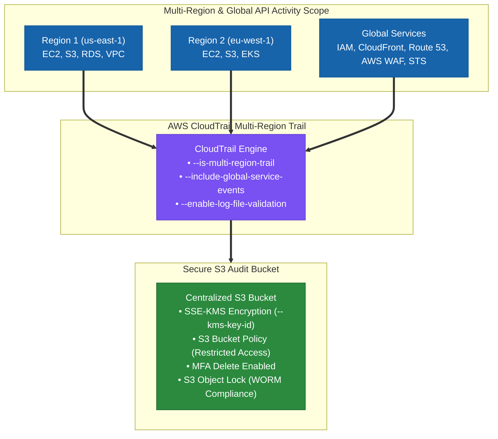

### High-Yield Exam CLI Parameters & Configuration Breakdown

| CLI Parameter / Security Feature | Operational Function | Why It Matters for Compliance | Exam Trap / Distortion |
| :--- | :--- | :--- | :--- |
| **`--is-multi-region-trail`** | Enables logging for **all current and future AWS Regions** into a single central S3 bucket. | Ensures zero blind spots across regions; captures unauthorized actions in unapproved regions. | Setting a trail in only one region misses activity across all other VPCs/regions. |
| **`--include-global-service-events`** | Includes API calls from **global AWS services** (IAM, CloudFront, Route 53, AWS WAF, STS). | IAM role creation, policy changes, and CloudFront updates are global events logged in `us-east-1` by default. | Passing `--no-include-global-service-events` explicitly **EXCLUDES** IAM/CloudFront/Route53 logs! |
| **`--enable-log-file-validation`** | Generates hourly digest files with **SHA-256 digital signatures** for delivered log files. | Proves log file integrity to auditors; detects if log files were modified or deleted. | Missing log validation allows potential log tampering without audit detection. |
| **`--kms-key-id`** | Applies **AWS KMS SSE-KMS encryption** to log files stored in S3. | Satisfies data-at-rest encryption regulatory mandates (PCI-DSS, SOC2, HIPAA). | Relying solely on default SSE-S3 when KMS customer-managed keys (CMK) are specified. |
| **MFA Delete & Bucket Policy** | Requires Multi-Factor Authentication to permanently delete bucket objects/versions. | Prevents rogue admins or compromised credentials from wiping historical audit trails. | Thinking IAM permissions alone prevent object deletion without MFA Delete enabled. |

> [!CRITICAL]
> **CloudTrail vs. CloudWatch Confusion Trap**:
> - **AWS CloudTrail**: Records **API calls and AWS Account activity** ("Who changed what, when, from where?"). There is **NO such thing as a "CloudWatch Trail"**!
> - **Amazon CloudWatch**: Collects **performance metrics, operational log files, and triggers alarms** ("What is CPU utilization? Query container log lines").
> - If an exam question asks to log API calls, user actions, or AWS resource changes $\rightarrow$ **Select AWS CloudTrail**, NEVER CloudWatch!

---

## 5.2 Real-World Exam Scenario: Multinational Financial Multi-Region Logging

- **Scenario**: A multinational financial firm hosts web applications across multiple VPCs in several AWS regions (using EC2, S3, CloudFront, and IAM). Compliance requires a secure, durable logging solution tracking all AWS resource changes across all regions, including management console, SDK, and API activity.
- **Solution**: 
  1. Create a new **AWS CloudTrail** trail delivered to a central S3 bucket.
  2. Pass both **`--is-multi-region-trail`** (captures all regional VPC activity) AND **`--include-global-service-events`** (captures IAM, CloudFront, Route 53 global activity).
  3. Encrypt log files using **KMS encryption** (`--kms-key-id`), enable **MFA Delete** on the S3 bucket, configure strict **S3 bucket policies**, and enable **log file validation**.
- **Incorrect Distractors**:
  - *Distractor 1*: Using "Amazon CloudWatch trail" (CloudWatch does not have trails; CloudTrail is required).
  - *Distractor 2*: Passing `--no-include-global-service-events` (this strips out IAM and CloudFront global events, failing audit requirements).
  - *Distractor 3*: Omitting `--is-multi-region-trail` (only logs activity in the single originating region).

---

# 6. Operational overhead

CloudTrail itself has low operational overhead.

AWS manages:

```text
Infrastructure
Scaling
Availability
Collection
```

Your operational responsibility starts around:

```text
Retention
Access control
Log analysis
Alerting
Centralization
Cost management
```

For example:

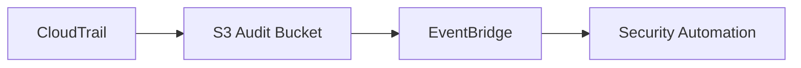

or:

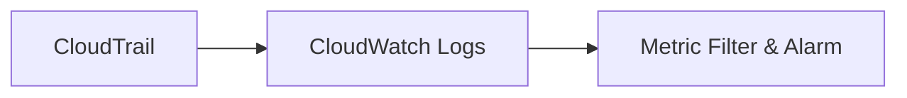

Every additional integration introduces configuration and cost.

---

# 7. CloudTrail cost thinking

For SAP-C02, don't stop at:

> “CloudTrail is managed.”

Think about downstream storage and analysis.

Example:

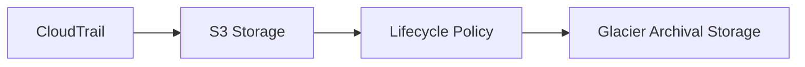

Long-term audit retention is often better suited to S3 lifecycle policies and archival storage than keeping everything in expensive active analytics systems.

Also consider:

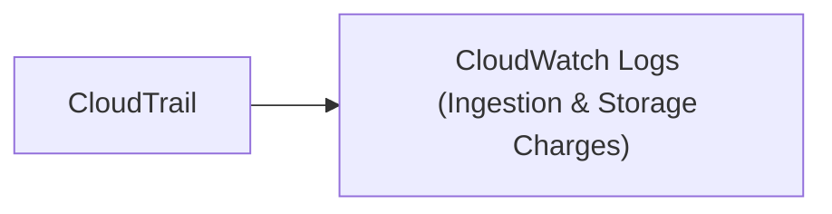

This introduces additional CloudWatch Logs storage and ingestion considerations.

The exam often rewards the architecture that satisfies the audit requirement with the least unnecessary processing.

---

# 8. CloudTrail trade-offs

Centralized logging:

Advantages:

```text
Central governance
Cross-account visibility
Simpler investigation
Tamper-resistant central storage
```

Trade-offs:

```text
More initial configuration
Central logging account becomes highly sensitive
Cross-account permissions required
Storage costs increase with retention
```

Sending everything to a real-time analytics platform:

Advantages:

```text
Fast investigation
Advanced analysis
Real-time detection
```

Trade-offs:

```text
Higher cost
More operational complexity
```

For SAP-C02, ask:

> **Does the requirement need real-time analysis, or does it only require long-term audit retention?**

---

# 9. Related CloudTrail services

Know these relationships:

```text
CloudTrail
   ├── S3
   ├── CloudWatch Logs
   ├── EventBridge
   ├── CloudTrail Lake
   ├── Security Hub
   ├── IAM
   └── AWS Organizations
```

Important distinction:

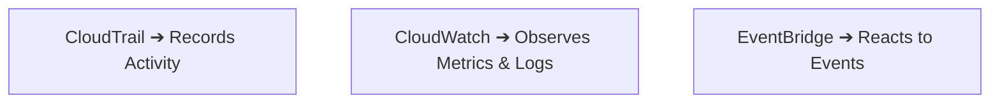

Example:

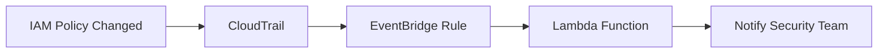

---

# 10. IAM Access Analyzer

Now move from:

> “Who did something?”

to:

> “Who has access?”

This is where IAM Access Analyzer fits.

---

# 11. Why does IAM Access Analyzer exist?

Large AWS environments contain many policies.

For example:

```text
S3 bucket → Bucket policy → Principal = *
```

Or:

```text
Account A → S3 bucket → Account B
```

You need to determine whether resources are unintentionally accessible outside their intended trust boundary.

IAM Access Analyzer helps identify access to resources from outside the expected zone of trust.

The core question is:

> **“Who can access this resource?”**

---

# 12. Problem it solves

Without Access Analyzer:

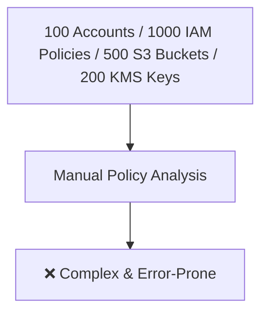

With Access Analyzer:

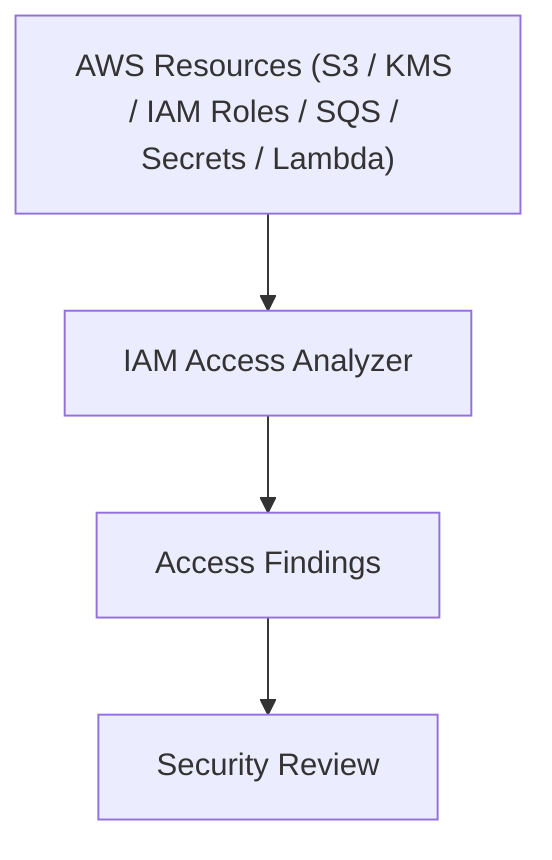

The exact supported resource types depend on the Access Analyzer capability being used.

---

# 13. Important distinction

Do not confuse Access Analyzer with IAM.

IAM:

> Defines permissions

Access Analyzer:

> Analyzes access

Think:

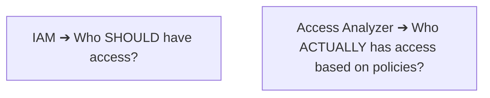

---

# 14. Minimum architecture

For an account:

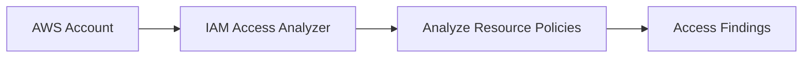

For an organization:

```mermaid
flowchart LR
    Org["AWS Organizations"] --> Delegated["Delegated Admin Security Account"] --> AA["IAM Access Analyzer"] --> Findings["Cross-Account Access Findings"]
```

You do not need to deploy agents.

You do not need EC2.

You do not need a database.

---

# 15. Operational overhead

Low.

AWS performs the analysis.

Your main workload is:

```mermaid
flowchart LR
    Finding["Finding Issued"] --> Review["Security Review"] --> Intended{"Is Access Intended?"}
    Intended -->|NO| Fix["Remediate Policy"]
    Intended -->|YES| Archive["Archive Finding"]
```

The difficult part in large organizations is finding management.

Example:

```mermaid
flowchart TD
    Resources["10,000 Resources"] --> Findings["Access Findings"] --> SecTeam["Security Team"] --> Prioritize["Prioritize & Remediate"]
```

---

# 16. Cost thinking

The important architecture question is:

> **“Do I need broad continuous access analysis across the whole organization?”**

Scope matters.

Think:

```text
Number of accounts
        +
Number of regions
        +
Number of resources
        +
Type of analyzer
        ↓
Cost
```

The service reduces manual policy analysis, but security teams still need to process findings.

This is a recurring SAP-C02 principle:

> **A managed security service reduces infrastructure operations, but it does not remove security governance work.**

---

# 17. Access Analyzer trade-offs

Aggressive least privilege:

```text
Smaller permissions → Better security
```

But:

```text
More policy management
More application permission issues
More troubleshooting
```

Broad permissions:

```text
Simpler application deployment
```

But:

```text
Larger attack surface
Higher security risk
```

Access Analyzer supports the move toward least privilege.

---

# 18. IAM Access Analyzer related services

```text
IAM Access Analyzer
       ├── IAM
       ├── AWS Organizations
       ├── S3
       ├── KMS
       ├── SQS
       ├── Lambda
       ├── Security Hub
       └── AWS Config
```

Exam clue:

> **“Identify resources accessible from another AWS account.”**

Think:

**IAM Access Analyzer.**

---

## 18.1 Real-World Exam Scenario: Generating Least-Privilege IAM Policies (CloudTrail + Access Analyzer)

- **Scenario**: A cloud governance team discovers during an audit that Lambda execution roles have overly broad permissions (e.g., full access to S3 and DynamoDB). The team must restrict permissions to the absolute minimum required by each function (**principle of least privilege**) with the **LEAST operational effort**.
- **Correct 2-Step Solution**:
  1. **Create a trail in AWS CloudTrail** and enable CloudTrail logging to capture S3 and DynamoDB data events.
  2. **Use IAM Access Analyzer** to review the CloudTrail logs and automatically **generate a granular IAM policy template** containing only the permissions actively used by the Lambda functions.
- **Reasoning & Key Exam Takeaway**:
  - IAM Access Analyzer's **Policy Generation** feature inspects CloudTrail event activity logs over a date range for a specific IAM user or role and automatically generates a fine-grained, customized least-privilege IAM policy.
  - *Why Incorrect Options Fail*:
    - **Amazon GuardDuty**: Threat detection service that monitors anomalous network/API behavior; does NOT generate IAM policies.
    - **AWS Audit Manager**: Continually audits AWS usage for compliance reporting; does NOT analyze raw API calls to output least-privilege IAM policies.
    - **AWS CodeGuru Profiler**: Analyzes CPU/memory application code performance; does NOT inspect IAM API permissions.

---

# 19. Amazon Inspector

Now move to workload security.

The question changes to:

> **“Is my software vulnerable?”**

---

# 20. Why does Inspector exist?

AWS infrastructure itself does not guarantee that your software is secure.

Example:

```text
EC2 → Operating system → Package → Known CVE
```

Or:

```text
Container image → Vulnerable dependency → Known CVE
```

Inspector identifies vulnerabilities in supported AWS workloads.

The core question is:

> **“Which workloads have known vulnerabilities?”**

---

# 21. Problem Inspector solves

Without Inspector:

```mermaid
flowchart TD
    EC2s["EC2 Instances & Container Images"] --> Manual["Manual Vulnerability Scanning"] --> Overhead["Scanner & Agent Mgmt / Scheduling / Reporting"]
```

Inspector provides AWS-managed vulnerability assessment.

Conceptually:

```mermaid
flowchart LR
    Workloads["Workloads (EC2 / ECR / Lambda)"] --> Inspector["Amazon Inspector"] --> Findings["Vulnerability Findings (CVEs)"] --> Remediate["Remediation Workflows"]
```

---

# 22. Inspector workload coverage

For exam purposes, remember:

```text
EC2
ECR container images
Lambda
```

The exam wording often gives you the workload.

Example:

> **“Identify software vulnerabilities in EC2 instances.”**

Think:

**Amazon Inspector.**

---

# 23. Minimum architecture

EC2:

```mermaid
flowchart LR
    EC2["EC2 Instance"] --> Insp1["Amazon Inspector"] --> Findings1["Vulnerability Findings"]
```

Container:

```mermaid
flowchart LR
    Dev["Developer"] --> ECR["Amazon ECR"] --> Insp2["Amazon Inspector"] --> Findings2["CVE Findings"]
```

Lambda:

```mermaid
flowchart LR
    Lambda["Lambda Function"] --> Insp3["Amazon Inspector"] --> Findings3["Vulnerability Findings"]
```

---

# 24. Operational overhead

Low compared with operating your own vulnerability scanner.

AWS handles the scanning infrastructure.

Your team still handles:

```mermaid
flowchart LR
    Finding["Finding Issued"] --> Prioritize["Prioritize CVE"] --> Patch["Patch Software"] --> Test["Test Code"] --> Deploy["Deploy Update"]
```

For containers:

```mermaid
flowchart LR
    VulnImage["Vulnerable Image"] --> Fix["Fix Dependency"] --> Build["Build Image"] --> Push["Push to ECR"] --> Deploy["Deploy Cluster Update"]
```

---

# 25. Inspector cost thinking

Think about scope.

Suppose:

```text
500 EC2 instances
20,000 container images
1,000 Lambda functions
```

Do not assume the cheapest architecture is:

> Enable everything everywhere without analysis.

Instead consider:

```text
Production ➔ High security priority
Development ➔ Different risk profile
Unused resources ➔ Remove them
```

Also consider the downstream cost of findings.

More scanning:

```text
More coverage → More findings → More remediation work
```

The service cost is only one part of the total security cost.

---

# 26. Inspector trade-offs

Continuous vulnerability assessment:

Advantages:

```text
Continuous visibility
Faster vulnerability detection
Less scanner management
```

Trade-offs:

```text
Service cost
More findings
Patch-management workload
Potential application compatibility issues after patching
```

Ignoring vulnerabilities:

```text
Lower immediate operational work
```

But:

```text
Higher security exposure
Compliance risk
Potential exploitation
```

---

# 27. Inspector related services

```text
Inspector
   ├── EC2
   ├── ECR
   ├── Lambda
   ├── Security Hub
   ├── EventBridge
   └── Systems Manager
```

A common architecture:

```mermaid
flowchart LR
    Insp["Amazon Inspector"] --> SH["Security Hub"] --> EB["EventBridge"] --> Action["Ticketing / Systems Manager Patching"]
```

---

# 28. AWS Security Hub

Now we move from individual security controls to centralized security operations.

---

# 29. Why does Security Hub exist?

Imagine an enterprise with:

```text
GuardDuty
Inspector
Macie
IAM Access Analyzer
AWS Config
```

Each produces security findings.

Without Security Hub:

```mermaid
flowchart TD
    GuardDuty["GuardDuty"] --> F1["Findings"]
    Inspector["Inspector"] --> F2["Findings"]
    Macie["Macie"] --> F3["Findings"]
    Config["AWS Config"] --> F4["Findings"]

    F1 & F2 & F3 & F4 --> Disjointed["❌ Multiple Consoles & Fragmented Workflows"]
```

Security Hub provides centralized security findings:

```mermaid
flowchart TD
    GuardDuty["GuardDuty"] --> SH["Security Hub"]
    Inspector["Inspector"] --> SH
    Macie["Macie"] --> SH
    AccessAnalyzer["Access Analyzer"] --> SH
    Config["AWS Config"] --> SH

    SH --> Centralized["✅ Centralized Security Findings Console"]
```

---

# 30. Problem Security Hub solves

The problem is not primarily detection.

Other services perform the detection.

Security Hub solves:

> **“How do I centrally view, prioritize, and manage security findings across my AWS environment?”**

---

# 31. Important distinction

This is one of the most important SAP-C02 distinctions.

```mermaid
flowchart TD
    GD["GuardDuty ➔ Detects threats"]
    Insp["Inspector ➔ Finds vulnerabilities"]
    Macie["Macie ➔ Finds sensitive data"]
    AA["Access Analyzer ➔ Finds unintended access"]
    Config["AWS Config ➔ Finds configuration violations"]

    GD & Insp & Macie & AA & Config --> SH["Security Hub ➔ Centralizes findings"]
```

Do not select Security Hub when the question specifically asks for vulnerability detection.

Use **Inspector**.

---

# 32. Minimum Security Hub architecture

Small environment:

```mermaid
flowchart LR
    SecServices["Security Services"] --> SH["Security Hub"] --> Findings["Centralized Security Findings"]
```

Enterprise:

```mermaid
flowchart TD
    Org["AWS Organization"] --> SecAcc["Security Account"] --> SH["Security Hub Central Aggregator"]
    
    GD["GuardDuty"] --> SH
    Insp["Inspector"] --> SH
    Macie["Macie"] --> SH
```

Then:

```mermaid
flowchart LR
    SH["Security Hub"] --> EB["EventBridge"] --> Auto["Automation / SIEM / Ticketing"]
```

---

# 33. Operational overhead

Low to moderate.

AWS manages the service.

You manage:

```text
Standards
Integrations
Finding prioritization
Automation
Remediation
```

The biggest operational problem is finding noise.

Example:

```mermaid
flowchart TD
    Accounts["100 AWS Accounts"] --> Findings["Thousands of Findings"] --> SecTeam["Security Team"] --> Prioritize["Manual Prioritization Overload"]
```

Therefore, a mature architecture needs:

```mermaid
flowchart LR
    SH["Security Hub"] --> EB["EventBridge Rules"] --> Auto["Lambda Remediation"] --> Ticket["Jira / ITSM Ticketing"]
```

rather than relying on humans to manually inspect every finding.

---

# 34. Security Hub cost thinking

Security Hub introduces service cost.

At enterprise scale, consider:

```text
Accounts
+
Regions
+
Security checks
+
Findings
+
Integrations
```

Also consider the cost of the services feeding Security Hub.

For example:

```text
GuardDuty + Inspector + Macie + Security Hub + EventBridge + SIEM
```

The security architecture cost is therefore greater than the Security Hub service charge alone.

---

# 35. Security Hub trade-offs

Centralized security:

Advantages:

```text
Single security view
Cross-service findings
Cross-account governance
Automation
Compliance visibility
```

Trade-offs:

```text
Additional service cost
Finding noise
Configuration effort
Security team workload
```

The key SAP-C02 question is:

> **“Does the organization need centralized security operations?”**

If yes, Security Hub becomes highly relevant.

---

# 36. How the four services fit together

This is the architecture you should remember.

```mermaid
flowchart TD
    subgraph Governance["AWS Organization"]
        SecAcc["Central Security Account"]
    end

    SecAcc --> CT["CloudTrail (Activity Events)"]
    SecAcc --> AA["Access Analyzer (Access Findings)"]
    SecAcc --> Insp["Inspector (Vulnerability Findings)"]

    CT & AA & Insp --> SH["Security Hub (Central Aggregator)"]
    SH --> EB["EventBridge"]
    EB --> Auto["Automation"]
    EB --> SIEM["SIEM Integration"]
```

Then add other security services:

```mermaid
flowchart TD
    GD["GuardDuty ➔ Threat detection"] --> SH["Security Hub"]
    Macie["Macie ➔ Sensitive data discovery"] --> SH
    Config["AWS Config ➔ Configuration compliance"] --> SH
```

All of these can contribute to centralized security operations.

---

# 37. CloudTrail vs Security Hub

Very common exam confusion.

CloudTrail:

```text
"Show me the API activity."
```

Security Hub:

```text
"Show me security findings."
```

Example:

> **Who deleted the security group rule?**

→ **CloudTrail.**

> **Show all security findings across 50 AWS accounts.**

→ **Security Hub.**

---

# 38. Access Analyzer vs Security Hub

Access Analyzer:

```text
"Is this resource accessible outside the intended trust boundary?"
```

Security Hub:

```text
"Centralize security findings."
```

Access Analyzer is a source of findings.

Security Hub is the central aggregation point.

---

# 39. Inspector vs Security Hub

Inspector:

```text
"Is this workload vulnerable?"
```

Security Hub:

```text
"Centralize the vulnerability finding and other security findings."
```

Therefore:

```mermaid
flowchart LR
    Inspector["Amazon Inspector"] --> CVE["CVE Vulnerability Finding"] --> SH["Security Hub"]
```

Do not replace Inspector with Security Hub.

---

# 40. AWS security service map

For SAP-C02, build this mental map.

```mermaid
flowchart TD
    Audit["AUDIT<br/>CloudTrail"] --> SH["SECURITY HUB<br/>(Central Findings Aggregator)"]
    Identity["IDENTITY / ACCESS<br/>IAM Access Analyzer"] --> SH
    Threats["THREATS<br/>Amazon GuardDuty"] --> SH
    Vuln["VULNERABILITIES<br/>Amazon Inspector"] --> SH
    Data["SENSITIVE DATA<br/>Amazon Macie"] --> SH
    Compliance["COMPLIANCE<br/>AWS Config"] --> SH

    SH --> EB["EventBridge"] --> Response["Automated Response & Remediation"]
```

---

# 41. Minimum architecture principle

This is critical for the Professional exam.

Suppose the requirement is:

> **“Identify vulnerabilities in EC2.”**

Minimum architecture:

```mermaid
flowchart LR
    EC2["EC2 Instance"] --> Insp["Amazon Inspector"]
```

Do not automatically add:

```text
Security Hub
GuardDuty
Macie
Config
SIEM
Lambda
EventBridge
```

unless the requirement needs them.

The exam often rewards:

> **Minimum architecture that satisfies all requirements.**

---

# 42. When you should add Security Hub

Requirement:

> “Identify vulnerabilities in EC2.”

```text
EC2 → Inspector
```

Requirement:

> “Identify vulnerabilities and centralize security findings across 100 AWS accounts.”

```mermaid
flowchart LR
    EC2["EC2 Instances"] --> Insp["Inspector"] --> SH["Security Hub"]
```

Requirement:

> “Automatically create tickets for critical findings.”

```mermaid
flowchart LR
    Insp["Inspector"] --> SH["Security Hub"] --> EB["EventBridge"] --> Ticket["Ticketing System"]
```

Each additional requirement changes the architecture.

---

# 43. Cost optimization decision tree

```mermaid
flowchart TD
    Start["Security Requirement"] --> Question{"What are you trying to know?"}
    
    Question -->|Who performed an action?| CT["CloudTrail"]
    Question -->|Who has access?| AA["IAM Access Analyzer"]
    Question -->|Is workload vulnerable?| Insp["Amazon Inspector"]
    Question -->|Centralize security findings?| SH["Security Hub"]
```

Then ask:

```mermaid
flowchart TD
    RealTime{"Need real-time response?"} -->|NO| Review["Store & Review Logs/Findings"]
    RealTime -->|YES| Automation["EventBridge ➔ Automated Remediation"]
```

---

# 44. Cost + Operational Overhead Matrix

| Requirement | Primary service | Operational overhead | Cost consideration |
|---|---|---|---|
| API audit | CloudTrail | Low | Events, storage, analytics |
| Long-term audit | CloudTrail + S3 | Low | S3 lifecycle and archival |
| Analyze external access | Access Analyzer | Low | Scope and analyzer type |
| EC2 vulnerability scanning | Inspector | Low | Number/type of monitored resources |
| Container vulnerability scanning | Inspector + ECR | Low | Image scanning scope |
| Central security findings | Security Hub | Low/medium | Findings and security checks |
| Automated remediation | EventBridge + automation | Medium | Event processing and automation |
| Enterprise security operations | Security Hub + Organizations | Medium | Multi-account and multi-region scope |

---

# 45. Common SAP-C02 exam traps

### Trap 1

> “Determine who changed an IAM policy.”

Wrong: Security Hub  
Correct: **CloudTrail**

### Trap 2

> “Identify an S3 bucket accessible from another AWS account.”

Wrong: Inspector  
Correct: **IAM Access Analyzer**

### Trap 3

> “Identify vulnerable software packages on EC2.”

Wrong: GuardDuty  
Correct: **Inspector**

### Trap 4

> “Centralize findings from GuardDuty, Inspector, and Macie.”

Correct: **Security Hub**

### Trap 5

> “Detect suspicious activity from a compromised EC2 instance.”

Correct: **GuardDuty** (Not Inspector. Inspector finds vulnerabilities. GuardDuty detects threats.)

### Trap 6

> “Identify sensitive information stored in S3.”

Correct: **Macie**

### Trap 7

> “Check whether resources comply with configuration rules.”

Correct: **AWS Config**

### Trap 8

> “Record API activity for seven years.”

Think:

```mermaid
flowchart LR
    CT["CloudTrail"] --> S3["S3 Bucket"] --> Lifecycle["Lifecycle Policy"] --> Archive["Glacier Archival Storage"]
```

Do not send all historical data into an expensive real-time analytics system without a requirement for it.

---

# 46. Enterprise security architecture

A larger organization might use:

```mermaid
flowchart TD
    subgraph Org["AWS Organization"]
        SecAcc["Central Security Account"]
    end

    SecAcc --> CT["CloudTrail"]
    SecAcc --> GD["GuardDuty"]
    SecAcc --> Insp["Inspector"]

    CT --> S3["Central S3 Bucket"]
    GD & Insp --> SH["Security Hub Aggregator"]

    SecAcc --> AA["Access Analyzer"] --> SH
    SecAcc --> Macie["Macie"] --> SH
    SecAcc --> Config["AWS Config"] --> SH

    SH --> EB["EventBridge"] --> Auto["Automation / Ticketing"] --> SIEM["Enterprise SIEM"]
```

The architecture follows a simple principle:

```mermaid
flowchart LR
    Collect["Collect"] --> Detect["Detect"] --> Aggregate["Aggregate"] --> Prioritize["Prioritize"] --> Automate["Automate"] --> Remediate["Remediate"]
```

---

# 47. What requires network connectivity?

This is another SAP-C02 distinction.

CloudTrail:

> AWS managed service

Inspector:

> AWS managed service

Security Hub:

> AWS managed service

Access Analyzer:

> AWS managed service

You do not build network connectivity between these services.

You are configuring AWS security controls and integrations.

This differs from hybrid architecture topics where VPN or Direct Connect becomes part of the minimum architecture.

---

# 48. What is the minimum requirement?

Think like this:

```text
Requirement → Smallest service → Smallest configuration → Only add supporting services when required
```

Examples:

```text
Audit API activity → CloudTrail
Analyze unintended access → Access Analyzer
Find workload vulnerabilities → Inspector
Centralize security findings → Security Hub
Automatically respond to findings → Security Hub → EventBridge → Automation
```

---

# 49. The Professional-level trade-off

At Associate level, you often ask:

> “Which AWS service solves the problem?”

At Professional level, ask:

```text
Does it solve the problem?
        ↓
What is the minimum architecture?
        ↓
What does AWS manage?
        ↓
What do I still operate?
        ↓
What does it cost at scale?
        ↓
How does it integrate?
        ↓
How does it behave across accounts?
        ↓
How does it behave across regions?
        ↓
How do I automate remediation?
        ↓
What security risk remains?
```

That is the architectural thinking the SAP-C02 questions are testing.

---

---

# 51. Real-World Exam Scenario: PII Discovery in S3 & Database HA (Amazon Macie + S3 Standard-IA + RDS Multi-AZ vs. Inspector & Glacier Traps)

- **Scenario**: A photo-sharing website hosted on AWS experiences frequent downtime because its MySQL RDS database instance goes down during Availability Zone outages. Photos and user metadata in S3 are frequently accessed in the first month, but must remain available for **immediate retrieval** no matter how long they are stored. Management requires an automated solution to discover, classify, and protect personally identifiable information (PII) data in the S3 bucket. What is the BEST solution?
- **Architecture Solution**:
  - Use **Amazon Macie** to automatically discover, classify, and protect PII data in the Amazon S3 bucket.
  - Configure an **S3 Lifecycle policy** to move old photos to the **S3 Standard-Infrequent Access (S3 Standard-IA)** storage class after 30 days.
  - Re-configure the existing database to use **RDS Multi-AZ Deployments** for automated failover.

```mermaid
flowchart TD
    subgraph DataSecurity ["1. Sensitive PII Data Security Tier"]
        S3Bucket[("Amazon S3 Bucket<br/>(Photo Objects & Metadata)")]
        Macie["Amazon Macie<br/>🔍 ML-Driven PII Discovery, Classification & Alerts"]

        S3Bucket <==|"Continuous Scanning & PII Classification"| Macie
    end

    subgraph StorageLifecycle ["2. Cost-Optimized Instant Retrieval Lifecycle"]
        S3Std["S3 Standard<br/>(First 30 Days: Frequent Access)"]
        S3IA["S3 Standard-Infrequent Access (Standard-IA)<br/>⚡ Lower Storage Cost + Instant Sub-ms Retrieval"]

        S3Std ==>|"S3 Lifecycle Rule (After 30 Days)"| S3IA
    end

    subgraph DatabaseHA ["3. High-Availability Relational Database Tier"]
        RDS_Primary[("Amazon RDS Primary DB<br/>(Active Instance in AZ-1)")]
        RDS_Standby[("Amazon RDS Multi-AZ Standby<br/>🛡️ Passive Synchronous Replica in AZ-2")]

        RDS_Primary <==|"Sync Replication & Automated Failover (<60s)"==> RDS_Standby
    end

    classDef sec fill:#7950f2,stroke:#5f3dc4,color:#ffffff;
    classDef store fill:#2b8a3e,stroke:#1e632b,color:#ffffff;
    classDef db fill:#1864ab,stroke:#0b5394,color:#ffffff;

    class Macie sec;
    class S3Bucket,S3Std,S3IA store;
    class RDS_Primary,RDS_Standby db;
```

### Key Technical Rationale:
1. **Amazon Macie vs. Amazon Inspector for S3 PII Discovery**:
   - **Amazon Macie** is a dedicated security service that uses Machine Learning and pattern matching to discover, classify, and protect sensitive data (PII, financial data, credentials) in **Amazon S3 buckets**.
   - **Amazon Inspector** is a software vulnerability and CVE scanner for **EC2 instances, ECR container images, and Lambda functions**. Inspector **CANNOT** scan S3 bucket contents for PII.
2. **S3 Standard-IA for Instant Retrieval**:
   - **S3 Standard-Infrequent Access (S3 Standard-IA)** provides lower storage costs while maintaining sub-millisecond instant retrieval for objects accessed infrequently after 30 days.
3. **RDS Multi-AZ for Availability Zone Failover**:
   - Re-configuring RDS to **Multi-AZ Deployment** provisions a synchronous passive standby instance in another AZ, ensuring automated DNS failover in < 60 seconds if an AZ outage occurs.

### Why Distractor Options Fail:
- *Amazon Inspector for PII Discovery*:
  - Amazon Inspector scans OS and software vulnerabilities (CVEs); it does NOT discover or classify sensitive PII data in S3 buckets (Amazon Macie does this).
- *S3 Glacier / Glacier Deep Archive*:
  - S3 Glacier (3–5 hours) and Glacier Deep Archive (12 hours) are offline cold archive classes. Using Glacier violates the explicit requirement that photos must be **immediately retrieved** no matter how long they are stored!
- *RDS Read Replicas for AZ Outage Downtime*:
  - Read Replicas offload read queries, but do NOT provide automated failover for write transactions when the primary database instance crashes during an AZ outage.

---

## 51.2 Real-World Exam Scenario 2: Providing Third-Party Compliance Auditors Access to Resource API Logs (AWS CloudTrail + IAM Read-Only User vs. Attaching IAM Roles to Resources, Emailing SNS Logs & Contacting AWS Traps)

- **Scenario**: A financial startup hosts its web portal on EC2 instances, Amazon S3, and Amazon DynamoDB. To meet financial regulatory compliance requirements, the company must undergo an audit. How should the Solutions Architect provide the third-party auditor access to the API activity logs of the AWS resources?
- **Architecture Solution**:
  - Enable **AWS CloudTrail** logging across the required AWS resources.
  - Create an **IAM user** with **read-only permissions** (e.g. `ReadOnlyAccess` or S3/CloudTrail read permissions).
  - Provide the access credentials securely to the auditor.

```mermaid
flowchart TD
    subgraph ResourceAPI ["1. AWS Infrastructure API Activity"]
        EC2["Amazon EC2 Instances"]
        S3["Amazon S3 Buckets"]
        DDB["Amazon DynamoDB Tables"]
    end

    subgraph AuditTrailTier ["2. Central Security Audit Tier"]
        CloudTrail["AWS CloudTrail<br/>📜 Continuous API Event Logging<br/>(Who, What, When, Where)"]
        S3_Logs[("Amazon S3 Audit Bucket<br/>🔒 Encrypted CloudTrail Log Storage")]

        EC2 & S3 & DDB ==>|"API Call Logs"| CloudTrail ==>|"Deliver Log Files"| S3_Logs
    end

    subgraph AuditorTier ["3. External Compliance Auditor Tier"]
        Auditor["Third-Party Auditor"]
        IAM_Auditor["IAM User / Read-Only Credentials<br/>📜 Policy: ReadOnlyAccess / CloudTrail Read"]

        Auditor ==>|"Authenticates with Read-Only Credentials"| IAM_Auditor ==>|"Inspect Audit Trail & Logs"| CloudTrail & S3_Logs
    end

    classDef aws fill:#1864ab,stroke:#0b5394,color:#ffffff;
    classDef audit fill:#7950f2,stroke:#5f3dc4,color:#ffffff;
    classDef auditor fill:#fff3cd,stroke:#ffc107,stroke-width:1px;

    class EC2,S3,DDB aws;
    class CloudTrail,S3_Logs audit;
    class Auditor,IAM_Auditor auditor;
```

### Key Technical Rationale:
1. **AWS CloudTrail for Regulatory API Audit Trails**:
   - CloudTrail is the fundamental AWS service for governance, operational auditing, and compliance. It records API history across AWS resources (EC2, S3, DynamoDB) into an S3 audit bucket.
2. **IAM Read-Only User for Auditor Access**:
   - Creating an IAM user with `ReadOnlyAccess` permissions allows the auditor to inspect CloudTrail logs and resource configurations via the AWS Console or S3 log bucket without granting write/modify permissions.

### Why Distractor Options Fail:
- *Attach IAM Roles directly to EC2, S3, and DynamoDB (Your Selection)*:
  - **Conceptual IAM Fallacy**: IAM roles **CANNOT be attached to S3 buckets or DynamoDB tables**! IAM roles are assumed by identities (users/services) or attached to EC2 instances via instance profiles to allow EC2 instances to access AWS services. Attaching a role to an EC2 instance does NOT grant an external human auditor access to API logs. Furthermore, resources do not record administrative API history internally—API activity is logged centrally by **AWS CloudTrail**.
- *Contacting AWS Support to Grant Auditor Access*:
  - **Shared Responsibility Model Violation**: Under the AWS Shared Responsibility Model, customers own and manage their account access controls and data. AWS Support does NOT manage or grant third-party auditors access to customer AWS accounts.
- *Emailing CloudTrail Logs via Amazon SNS*:
  - **Security & Technical Failure**: Emailing raw CloudTrail logs via unencrypted SNS emails creates a severe data leakage risk, and SNS cannot attach multi-megabyte JSON audit log files to emails.

---


# 52. Final Exam Cheat Sheet

```text
CloudTrail ➔ WHO DID WHAT? (API audit / investigation)
IAM Access Analyzer ➔ WHO HAS ACCESS? (Unintended external / cross-account access)
Amazon Inspector ➔ WHAT IS VULNERABLE? (EC2 / ECR / Lambda CVE scanning)
Amazon Macie ➔ WHAT SENSITIVE PII IS IN S3? (S3 PII discovery & data classification)
Amazon Security Hub ➔ WHERE ARE ALL MY FINDINGS? (Central security findings console)
```

Then remember the larger ecosystem:

```mermaid
flowchart TD
    CT["CloudTrail (API Activity)"] --> SH["Security Hub"]
    AA["Access Analyzer (Access Analysis)"] --> SH
    Insp["Inspector (Vulnerability Assessment)"] --> SH
    GD["GuardDuty (Threat Detection)"] --> SH
    Macie["Macie (Sensitive Data Discovery)"] --> SH
    Config["AWS Config (Configuration Compliance)"] --> SH

    SH --> EB["EventBridge"] --> Response["Automated Response"]
```

The five strongest exam associations are:

> **"Who changed it?"** → CloudTrail  
> **"Who can access it?"** → IAM Access Analyzer  
> **"Is it vulnerable?"** → Inspector  
> **"What sensitive PII is in my S3 bucket?"** → Amazon Macie  
> **"Where are all my security findings?"** → Security Hub

And the cost principle to keep applying throughout SAP-C02 is:

```text
Requirement → Minimum AWS service → Minimum scope → Managed service where suitable → Avoid unnecessary data processing → Automate only where the requirement justifies it
```

This matches the architecture-first approach in your Hybrid DNS notes, where the key strategy is to identify the requirement, select the minimum architecture, then evaluate HA, operational overhead, related services, and cost.