## AWS KMS + AWS Certificate Manager (ACM)

For **Solutions Architect Professional**, don't approach this topic as:

> "KMS encrypts things and ACM manages certificates."

Instead, think:

> **What exactly am I protecting? Who needs to use the key/certificate? Where should encryption happen? Who manages rotation? What is the minimum operational overhead? What does it cost at scale?**

The most important distinction is:

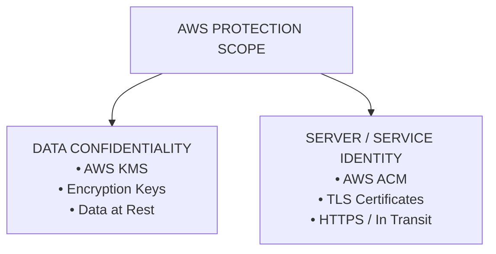

---

# 1. Why Do These Services Exist?

AWS has two fundamentally different security problems:

### Problem A — Protect data

> "If somebody gets access to the storage, how do I ensure the data is unreadable without the appropriate cryptographic key?"

→ **AWS KMS**

### Problem B — Prove the identity of a server/service

> "How does a client know that `https://api.example.com` really represents the intended service, and how do we establish encrypted TLS communication?"

→ **AWS Certificate Manager**

So:

> **KMS = encryption/key management**  
> **ACM = TLS certificate lifecycle management**

---

# 2. First Mental Model

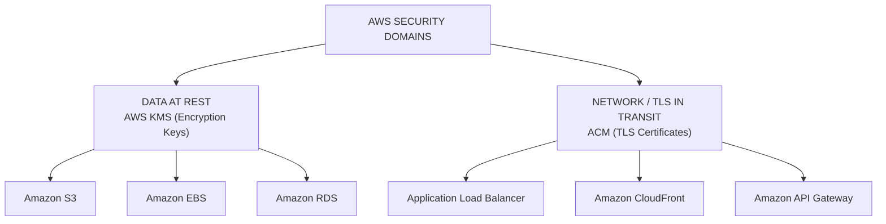

This distinction alone solves many exam questions.

---

# 3. AWS KMS — Why Does It Exist?

Without a managed key-management system, an organization might have to:

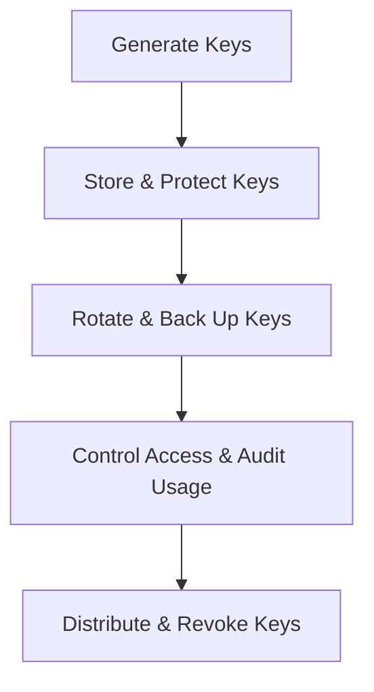

That becomes extremely difficult at enterprise scale.

AWS KMS exists to provide:

> **Centralized, controlled management of cryptographic keys integrated with AWS services.**

---

# 4. The Actual Problem KMS Solves

Suppose you have:

```text
S3 → Customer data
```

You want:

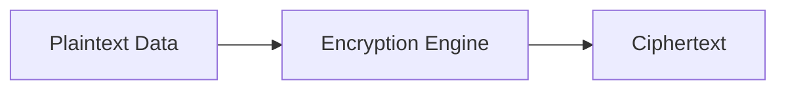

But now ask:

> Where does the encryption key live?

You don't want:

```text
Application → Hardcoded secret key
```

You want:

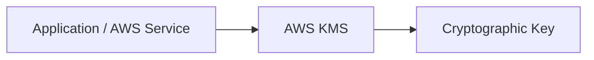

KMS handles the key-management side.

---

# 5. Encryption Is Not the Same as Key Management

This is an important distinction.

```text
Encryption
    =
Transform plaintext → ciphertext

Key management
    =
Create/control/protect/use/rotate/audit keys
```

KMS is primarily a **key-management service** with cryptographic operations and integrations.

AWS services such as S3, EBS, RDS, etc. can integrate with KMS.

---

# 6. KMS Customer Managed Key

For SAP-C02, you'll frequently encounter:

> **Customer managed KMS key**

Conceptually:

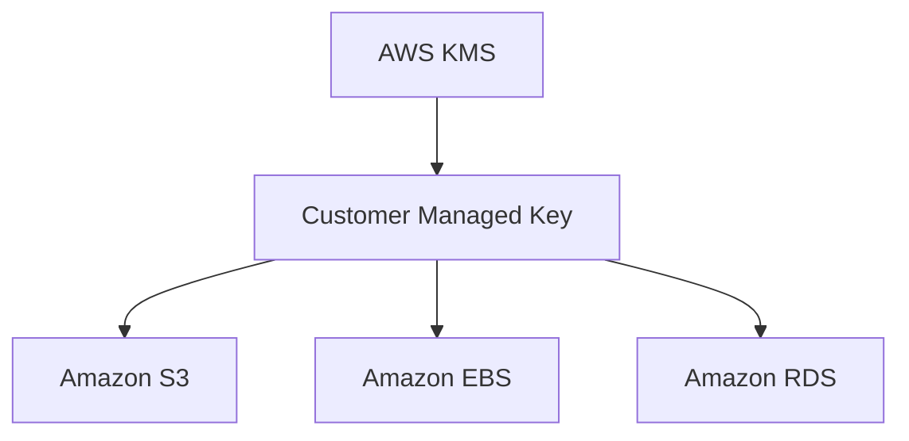

You control things such as:

* Key policy
* IAM permissions
* Rotation configuration
* Enable/disable
* Deletion scheduling
* Grants in applicable scenarios
* Audit visibility through AWS logging integrations

---

# 7. AWS Managed Keys vs Customer Managed Keys

This is an important trade-off.

### AWS managed key

AWS manages much of the lifecycle.

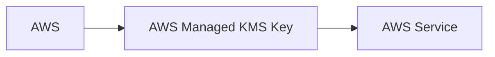

### Customer managed key

You get more control.

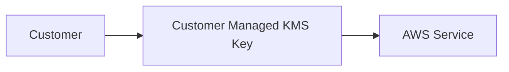

---

# 8. When Should You Choose Customer Managed KMS Keys?

Think:

> **"I need control."**

Examples:

* Regulatory requirements
* Key policy customization
* Explicit key administration
* Cross-account encryption architectures
* Detailed control over who can use the key
* Separation of duties
* Need to disable/revoke a key
* Organization-specific security requirements

If none of these requirements exist:

> Don't automatically choose customer-managed keys just because they sound more secure.

---

# 9. Operational Overhead — KMS

Customer-managed keys introduce management responsibilities.

You need to consider:

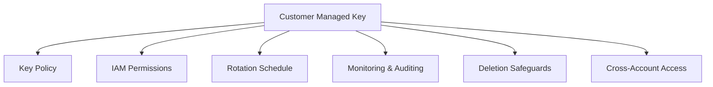

Therefore:

### AWS managed key

🟢 Lower operational overhead

### Customer managed key

🟡 More control  
🟡 More operational responsibility

This is a classic SAP-C02 trade-off.

---

# 10. KMS Cost Perspective

KMS isn't simply:

> "Encryption is free."

Depending on the KMS key type and usage, you can have:

* Key storage charges
* API request charges
* Additional charges depending on the cryptographic/key-management architecture

The important exam principle is:

> **At high scale, encryption architecture can generate KMS API costs.**

But don't optimize away encryption solely to save KMS API costs when security requirements demand it.

---

# 11. Envelope Encryption

This is extremely important for SAP-C02.

Imagine a huge file:

```text
1 TB data
```

You don't want your architecture to repeatedly use a centralized KMS key to directly encrypt every byte.

Instead:

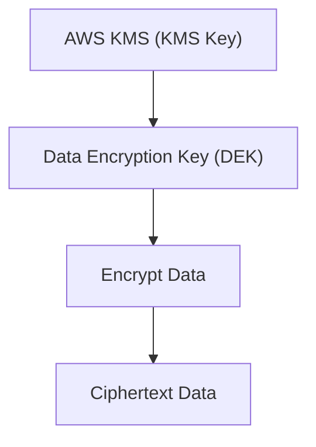

The data encryption key is then protected by a KMS key.

This is called:

> **Envelope encryption**

---

# 12. Envelope Encryption — Mental Model

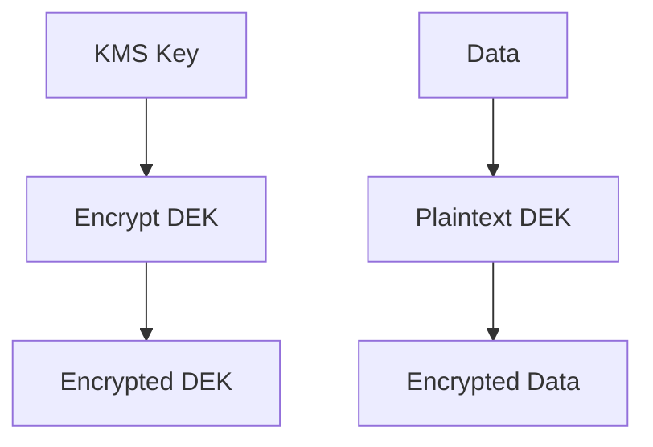

Stored together conceptually:

```text
Encrypted Data + Encrypted DEK
```

When authorized:

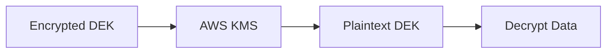

---

# 13. Why Envelope Encryption?

### Benefit

You can encrypt large amounts of data efficiently using a data key while KMS protects the key-encryption hierarchy.

This reduces the need to send the entire data stream through KMS cryptographic operations.

Think:

> **KMS protects keys; data keys efficiently protect the data.**

---

# 14. KMS + S3

Classic architecture:

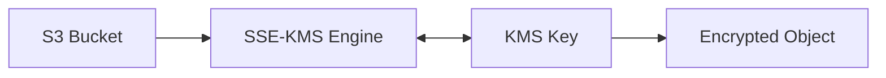

You can use S3 server-side encryption options, including SSE-KMS.

---

# 15. Why Use SSE-KMS Instead of Basic S3 Encryption?

Because sometimes you need more control.

Think:

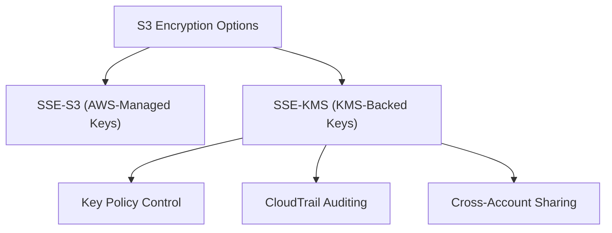

If the question says:

> "Need customer-controlled encryption keys and centralized key policy."

Think:

**SSE-KMS / customer managed KMS key**

---

# 16. KMS + EBS

Another classic:

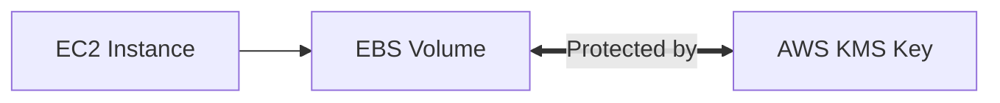

For encrypted EBS volumes, KMS can be involved in protecting the encryption keys.

Exam clue:

> "All EBS volumes must be encrypted."

Think:

**EBS encryption + KMS**

You can also enforce encryption through organizational/security controls.

---

# 17. KMS + RDS

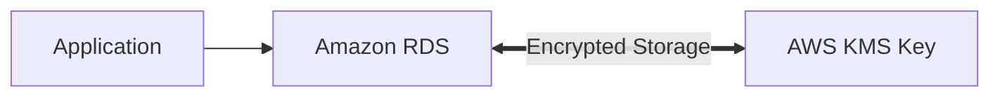

RDS supports encryption at rest using KMS.

The same architectural question applies:

> AWS managed key or customer managed key?

---

# 18. KMS + Secrets Manager

Don't confuse:

**Secrets Manager** with **KMS**.

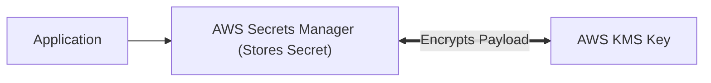

### Secrets Manager

> Stores/manages secrets.

### KMS

> Manages cryptographic keys.

They work together.

---

# 19. KMS + CloudTrail

Another important association:

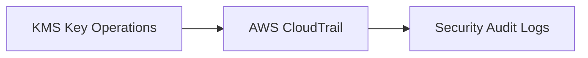

If the requirement is:

> "Audit who used the encryption key and when."

Think:

**KMS + CloudTrail**

---

# 20. KMS + IAM

KMS authorization can involve:

```text
IAM Policy + KMS Key Policy
```

This is important.

A KMS key has a **key policy**.

IAM policies can also participate in authorization depending on the setup.

For SAP-C02, remember:

> **KMS key policy is a critical part of controlling who can use/administer the key.**

---

# 21. KMS Key Policy vs IAM Policy

Think:

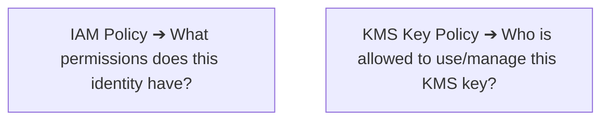

The interaction is nuanced, but the exam often tests whether you recognize the key policy as part of KMS authorization.

---

# 22. KMS Cross-Account Architecture

Suppose:

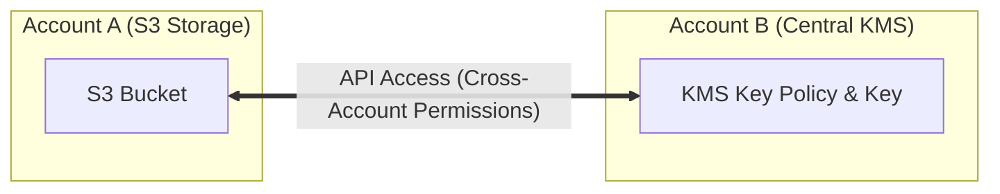

This requires carefully designed cross-account permissions.

Think:

```text
Account A
   │
   │ KMS API usage
   ▼
Account B
   │
KMS key policy
+
IAM permissions
```

This is a common SAP-C02 enterprise scenario.

---

# 23. KMS Multi-Region Keys

Suppose your application is:

```mermaid
flowchart TD
    subgraph RegionA["Region A (Primary)"]
        AppA["App"] --> KeyA["Primary KMS Key"] --> DataA["Encrypted Data"]
    end
    subgraph RegionB["Region B (DR)"]
        AppB["DR App"] --> KeyB["Replica KMS Key"] --> DataB["DR Data Copy"]
    end

    KeyA <== "Multi-Region Key Sync" ==> KeyB
```

You may need cryptographic key material available in multiple AWS Regions.

This is where **multi-Region KMS keys** become relevant.

### Why?

To support architectures requiring compatible cryptographic key material across Regions.

But:

> Don't select multi-Region keys merely because your application is multi-Region.

You need a requirement that actually benefits from them.

---

# 24. KMS Key Rotation

Security requirement:

> "Rotate encryption keys periodically."

KMS supports key rotation mechanisms for supported key types/configurations.

This is one reason KMS reduces operational burden compared with manually managing cryptographic keys.

Instead of:

```mermaid
flowchart LR
    Gen["Generate New Key"] --> Dist["Distribute"] --> Update["Update Apps"] --> Retire["Retire Old Key"]
```

KMS provides managed lifecycle capabilities.

---

# 25. KMS Deletion — Exam Trap

KMS key deletion is intentionally not an instant "oops, delete everything" operation.

There is a scheduled deletion process.

Why?

Because deleting a key can make encrypted data permanently inaccessible.

Think:

```mermaid
flowchart LR
    KMS["KMS Key"] -. "❌ Deleted Key" .- Data["Encrypted Data"] --> Loss["Permanent Data Loss"]
```

Therefore AWS makes key deletion deliberate.

---

# 26. KMS Availability vs Data Availability

Another architectural thought:

> Encryption is only useful if authorized workloads can still access the key.

For example:

```mermaid
flowchart LR
    App["Application"] -. "❌ Disabled / Deleted Key" .- KMS["KMS Key"] -. "Blocked Access" .- Data["Encrypted Data"]
```

If you incorrectly disable/delete the key, the application may be unable to decrypt data.

Therefore KMS key lifecycle is an **availability concern**, not just a security concern.

---

# 27. Now ACM — AWS Certificate Manager

KMS solves:

> **Encryption keys**

ACM solves:

> **TLS certificate lifecycle**

---

# 28. Why Does ACM Exist?

Without ACM, you would need to:

```mermaid
flowchart TD
    P1["Purchase / Request Cert"] --> P2["Validate Domain"] --> P3["Install & Configure Server"] --> P4["Monitor Expiration"] --> P5["Renew & Replace Cert"]
```

At enterprise scale:

```text
1000 domains
×
multiple environments
×
multiple certificates
```

This becomes painful.

ACM automates much of this lifecycle.

---

# 29. What Problem Does ACM Solve?

Suppose:

```mermaid
flowchart LR
    User["User"] -->|"HTTPS (TLS)"| App["Application (example.com ACM Certificate)"]
```

The application needs a TLS certificate.

ACM manages certificates and integrates them with AWS services.

---

# 30. ACM — Operational Overhead

This is one of ACM's biggest advantages.

With ACM-managed public certificates:

```mermaid
flowchart LR
    ACM["ACM Certificate"] --> Auto["Automatic Renewal"] --> Service["AWS-Integrated Service (ALB / CloudFront)"]
```

You don't have to manually:

```text
Download
Install
Replace
Renew
```

for supported integrations.

Therefore:

> **ACM is primarily an operational-overhead reduction service.**

---

# 31. ACM Public Certificates

For public-facing websites:

```mermaid
flowchart LR
    Internet["Internet Users"] -->|"HTTPS"| ALB["ALB (ACM Public Certificate)"]
```

ACM can provide public certificates for supported use cases.

---

# 32. ACM + ALB

Classic SAP-C02 architecture:

```mermaid
flowchart LR
    Internet["Internet"] -->|"HTTPS"| ALB["ALB (ACM Certificate Attached)"] -->|"HTTP / Internal TLS"| Backend["Backend Instances"]
```

This is generally preferable to manually managing certificates on every backend server.

---

# 33. Why Terminate TLS at the ALB?

Instead of:

```text
Client → HTTPS → EC2 (Certificate installed on every EC2)
```

Use:

```mermaid
flowchart LR
    Client["Client"] -->|"HTTPS"| ALB["ALB (TLS Termination via ACM)"] -->|"HTTP"| EC2["EC2 Instances"]
```

Benefits:

* Centralized certificate management
* Automatic scaling
* Less application-server administration
* Easier certificate renewal
* Offloads TLS processing from backend servers

---

# 34. ACM + CloudFront

Another classic:

```mermaid
flowchart LR
    User["User"] -->|"HTTPS"| CF["CloudFront (ACM Certificate)"] -->|"Origin Protocol"| Origin["Origin (ALB / S3)"]
```

This is especially important in global architectures.

But there's an exam-specific detail:

> **CloudFront ACM certificates are associated with the required AWS Region for CloudFront, not simply whichever Region your origin uses.**

Remember the CloudFront certificate-region requirement (`us-east-1`).

---

# 35. ACM + API Gateway

```mermaid
flowchart LR
    Client["Client"] -->|"HTTPS"| APIGW["API Gateway (Custom Domain ACM Cert)"] --> Backend["Backend Lambda / HTTP"]
```

Useful for custom domains.

---

# 36. ACM + Route 53

These services often appear together.

```mermaid
flowchart LR
    User["User"] --> R53["Route 53 DNS"] --> ALB["ALB / CloudFront (ACM Certificate)"]
```

Route 53:

> DNS

ACM:

> TLS certificate

They solve different problems.

---

# 37. ACM Private CA

Now an important advanced distinction.

Public website:

```mermaid
flowchart LR
    Internet["Internet"] --> ALB["ALB (ACM Public Certificate)"]
```

Internal enterprise services:

```mermaid
flowchart LR
    Corp["Corporate Network"] --> Service["Internal Service (ACM Private CA Certificate)"]
```

This is where **ACM Private CA** becomes relevant.

---

# 38. ACM Private CA — Why Does It Exist?

Suppose you have:

```text
service-a.internal
service-b.internal
service-c.internal
```

These aren't necessarily public Internet identities.

You want your organization to issue certificates for internal services.

Architecture:

```mermaid
flowchart TD
    PCA["ACM Private CA"] --> CertA["Service A Cert"]
    PCA --> CertB["Service B Cert"]
    PCA --> CertC["Service C Cert"]
```

This provides centralized private certificate authority capabilities.

---

# 39. Public ACM vs Private CA

| Requirement | Think |
|---|---|
| Public website HTTPS | ACM public certificate |
| ALB HTTPS | ACM |
| CloudFront HTTPS | ACM |
| API Gateway custom domain | ACM |
| Internal enterprise PKI | ACM Private CA |
| Internal service certificates | Private CA |
| Custom certificate authority | Private CA |

---

# 40. ACM Cost Trade-Off

### ACM public certificates

For supported AWS-managed public certificates:

> Generally no separate certificate charge.

That's one of the reasons ACM is attractive.

### ACM Private CA

Different story.

Private CA has associated charges for:

* CA operation
* Certificate issuance
* Other applicable usage

So:

```mermaid
flowchart TD
    Pub["Public HTTPS (ACM Public Cert) 🟢 Cost-effective"]
    Priv["Internal PKI (ACM Private CA) 🟡 Higher Cost"]
```

---

# 41. The Cost Question Is Not Just Certificate Price

Suppose you manually operate certificates:

```text
Certificate purchase
+
Engineer time
+
Renewal
+
Outage risk
+
Incident management
```

Even if the certificate itself is inexpensive:

> **Operational cost can be much higher.**

ACM reduces this operational burden.

For SAP-C02:

> **Managed services can be cheaper overall because they reduce human operations.**

---

# 42. ACM vs Self-Managed Certificates

### Self-managed

```mermaid
flowchart LR
    SelfCert["Self-Managed Cert"] --> EC2["EC2 Instance (Manual Installation & Renewal)"]
```

Operational overhead:

🔴 High at scale.

### ACM

```mermaid
flowchart LR
    ACMCert["ACM Managed Cert"] --> Auto["Automatic Renewal"] --> ALB["ALB / CloudFront / API Gateway"]
```

Operational overhead:

🟢 Low.

---

# 43. But ACM Has a Trade-Off

ACM certificates are tightly integrated with supported AWS services.

You can't assume:

> "ACM means I can just download the private key and install it anywhere."

For many AWS-managed certificate scenarios, AWS deliberately manages the private key and integration.

If you need the certificate/private key for a workload outside supported ACM integrations, you may need a different certificate-management approach.

This is an important architecture trade-off.

---

# 44. ACM Certificate Export — Exam Thinking

Suppose the question says:

> "The certificate must be installed on an on-premises web server."

Don't automatically assume standard ACM-managed public certificate is the answer.

Ask:

> **Can the certificate/private key be exported and used in this environment?**

If the architecture requires portable certificate/private-key material, consider the appropriate ACM/private certificate workflow or another certificate-management solution.

---

# 45. ACM Private CA + Kubernetes / Containers

Enterprise internal services can look like:

```mermaid
flowchart TD
    PCA["ACM Private CA"] --> CertA["Service A (EKS)"]
    PCA --> CertB["Service B (ECS)"]
    PCA --> CertC["Service C (EC2)"]
```

This can support internal PKI architectures.

But don't introduce private CA just because you have containers.

The requirement should be:

> **"We need private certificates / enterprise PKI."**

---

# 46. KMS vs ACM — Most Important Comparison

| Feature | AWS KMS | ACM |
|---|---|---|
| Primary purpose | Key management/encryption | TLS certificates |
| Protects | Data/cryptographic keys | Server/service identity |
| Encryption at rest | ✅ | ❌ |
| HTTPS/TLS | Not primary | ✅ |
| Key lifecycle | ✅ | Certificate lifecycle |
| Automatic certificate renewal | ❌ | ✅ for supported ACM-managed certs |
| S3/EBS/RDS integration | ✅ | ❌ |
| ALB HTTPS | Not the certificate manager | ✅ |
| CloudFront HTTPS | Not the certificate manager | ✅ |
| API Gateway custom domain | Not primary | ✅ |
| Private PKI | ❌ | ACM Private CA |
| Main value | Secure key control | Reduce certificate-management overhead |

---

# 47. Very Important: KMS Does NOT Replace ACM

A common conceptual mistake:

> "KMS manages keys, so use KMS for SSL certificates."

No.

Think:

```mermaid
flowchart LR
    ACM["ACM"] --> Cert["TLS Certificate"] --> Target1["ALB / CloudFront / API Gateway"]
```

KMS:

```mermaid
flowchart LR
    KMS["KMS"] --> Key["Encryption Key"] --> Target2["S3 / EBS / RDS / Secrets Manager"]
```

---

# 48. Very Important: ACM Does NOT Encrypt S3 Data

Another trap:

> "ACM provides encryption."

ACM provides certificates for TLS.

For data-at-rest encryption:

```text
S3 → KMS
EBS → KMS
RDS → KMS
Secrets Manager → KMS integration
```

---

# 49. KMS + ACM Together

They can coexist in the same architecture because they solve different problems.

Example:

```mermaid
flowchart TD
    User["Internet User"] -->|"HTTPS (Protected by ACM Cert)"| ALB["Application Load Balancer"] --> EC2["EC2 Instance"]
    EC2 --> S3["S3 Bucket (Encrypted by KMS)"]
    EC2 --> RDS["RDS Database (Encrypted by KMS)"]
```

### ACM

Protects:

> **Client ↔ ALB communication**

### KMS

Protects:

> **Data at rest**

---

# 50. Three Encryption States

SAP-C02 frequently thinks in:

```mermaid
flowchart TD
    Data["DATA SECURITY STATES"] --> Rest["At Rest ➔ AWS KMS"]
    Data --> Transit["In Transit ➔ TLS / ACM"]
    Data --> Use["In Use ➔ Confidential Computing / Enclaves"]
```

### At rest

Think:

**KMS**

### In transit

Think:

**TLS / ACM**

### In use

Much more complex; technologies such as confidential computing/encrypted memory may become relevant depending on the scenario.

---

# 51. Encryption in Transit HLD

```mermaid
flowchart LR
    User["User"] -->|"HTTPS (ACM)"| CF["CloudFront"] -->|"HTTPS (ACM)"| ALB["ALB"] -->|"HTTPS"| App["Application"] -->|"TLS"| RDS["RDS"]
```

Potential certificate management:

```text
ACM
 ├── CloudFront
 └── ALB
```

And encryption at rest:

```text
KMS
 ├── S3
 ├── EBS
 └── RDS
```

---

# 52. End-to-End Encryption Trade-Off

Suppose:

```mermaid
flowchart LR
    User["User"] -->|"HTTPS"| ALB["ALB (TLS Termination)"] -->|"HTTP"| EC2["EC2"]
```

TLS terminates at ALB.

This is simpler.

But security requirements may say:

> "Encryption must remain enabled all the way to the application."

Then:

```mermaid
flowchart LR
    User["User"] -->|"HTTPS"| ALB["ALB (TLS Re-encryption)"] -->|"HTTPS"| EC2["EC2"]
```

Now you need certificates on the backend too.

### Trade-off

| Design | Complexity | Security |
|---|--:|---|
| TLS terminate at ALB | 🟢 Lower | Good for many architectures |
| TLS through ALB to EC2 | 🟡 Higher | Stronger transit protection |
| Full mTLS | 🔴 Higher | Strong identity/authentication |

SAP-C02 asks you to choose based on requirements.

---

# 53. mTLS — Advanced Certificate Concept

Normal TLS:

```mermaid
flowchart LR
    Client["Client"] --> ServerCert["Server Certificate Verification"] --> EncConn["Encrypted Connection"]
```

mTLS:

```mermaid
flowchart LR
    ClientCert["Client Certificate"] <== "Mutual Authentication" ==> ServerCert["Server Certificate"]
```

This is useful when:

> Both client and server need cryptographic identity verification.

Think:

* APIs
* B2B integrations
* Zero-trust architectures
* Internal service-to-service communication

---

# 54. Certificate Rotation

Imagine:

```mermaid
flowchart LR
    Exp["Certificate Expires"] --> Outage["Service Outage ❌"]
```

That's a major operational risk.

ACM solves this for supported managed certificates by automating renewal.

So one of ACM's strongest architectural benefits is:

> **Eliminating certificate-expiration incidents.**

---

# 55. KMS Rotation vs ACM Renewal

Don't mix these.

### KMS

**Key rotation**

```text
Cryptographic key → Rotation
```

### ACM

**Certificate renewal**

```text
TLS certificate → Renewal
```

Different security objects.

---

# 56. Minimum Requirements — KMS

Suppose:

> "Encrypt EBS volumes."

Minimum:

```text
EBS encryption
```

with AWS-supported encryption/key-management options.

You don't necessarily need a customer-managed key.

---

Suppose:

> "Security team must control the encryption key and its policy."

Now:

```text
Customer managed KMS key
```

is more appropriate.

---

# 57. Minimum Requirements — ACM

Suppose:

> "Public ALB requires HTTPS."

Minimum:

```text
ALB + ACM certificate
```

No need for:

```text
Private CA
```

unless the requirements require private PKI.

---

# 58. When Private CA Is Overkill

Question:

> "A public-facing website needs HTTPS with automatic certificate renewal."

Bad architecture:

```text
Private CA + custom PKI + manual certificates
```

Better:

```text
ACM public certificate + ALB
```

Why?

> **Minimum operational overhead + lower cost + managed renewal.**

---

# 59. When Customer-Managed KMS Key Is Overkill

Question:

> "Encrypt S3 data at rest. No special key-management requirements."

Don't automatically choose:

```text
Customer-managed KMS key
```

unless the requirement needs customer control.

Potentially simpler:

```text
S3 encryption + AWS-managed KMS key
```

depending on the exact requirement.

---

# 60. When Customer-Managed KMS Is Required

Strong exam clues:

* "Customer controls the key"
* "Key policy must restrict access"
* "Security team owns keys"
* "Cross-account key sharing"
* "Regulatory requirement"
* "Ability to disable the key"
* "Separate key administrators from data administrators"
* "Custom key lifecycle"

→ **Customer-managed KMS key**

---

# 61. Separation of Duties

Enterprise architecture:

```mermaid
flowchart TD
    SecTeam["Security Team (KMS Key Administration)"] --> AppTeam["Application Team (Uses Encrypted Resources)"]
```

Application team doesn't necessarily need full administrative access to the KMS key.

This is a major security architecture principle.

---

# 62. KMS Grants

In complex AWS service integrations, **KMS grants** can provide delegated, scoped permissions to use KMS keys.

Mental model:

```mermaid
flowchart TD
    KMSKey["KMS Key"] --> KeyPolicy["Key Policy"]
    KMSKey --> IAMPolicy["IAM Policy"]
    KMSKey --> Grants["Grants (Delegated Scoped Permissions)"]
```

You don't need to reach for grants in every question.

Think of them when:

> An AWS service or principal needs delegated, controlled use of a KMS key.

---

# 63. KMS vs Secrets Manager vs ACM

This three-way distinction is valuable:

```mermaid
flowchart TD
    SecMaterial["SECURITY MATERIAL"] --> KMS["AWS KMS<br/>(Cryptographic Encryption Keys)"]
    SecMaterial --> Secrets["Secrets Manager<br/>(Passwords / API Keys / Database Credentials)"]
    SecMaterial --> ACM["AWS ACM<br/>(TLS / SSL Server Certificates)"]
```

### KMS

> "How do I protect cryptographic keys?"

### Secrets Manager

> "How do I securely store application secrets?"

### ACM

> "How do I manage TLS certificates?"

---

# 64. Cost/Operational Decision Matrix

| Requirement | Recommended | Operational overhead | Cost tendency |
|---|---|--:|--:|
| Basic AWS encryption | AWS-managed encryption/KMS integration | 🟢 Low | 🟢 |
| Customer-controlled keys | Customer-managed KMS | 🟡 Medium | 🟡 |
| Public HTTPS | ACM public cert | 🟢 Very low | 🟢 |
| Internal PKI | ACM Private CA | 🟡/🔴 | 🟡/🔴 |
| Manual certificates on EC2 | Self-managed | 🔴 High | Hidden operational cost |
| Centralized enterprise keys | KMS + policies | 🟡 | 🟡 |
| Multi-Region cryptographic architecture | Multi-Region KMS keys where required | 🟡 | 🟡 |

---

# 65. SAP-C02 Scenario Recognition

This is the section I'd memorize.

### "Encrypt S3 data at rest."

→ **S3 encryption**

Potentially:

→ **SSE-KMS**

---

### "Security team must control encryption keys."

→ **Customer-managed KMS key**

---

### "EC2 EBS volumes must be encrypted."

→ **EBS encryption + KMS**

---

### "RDS database must be encrypted at rest."

→ **RDS encryption + KMS**

---

### "Secrets must be stored securely."

→ **Secrets Manager**

Potential KMS integration.

---

### "ALB must provide HTTPS."

→ **ACM certificate**

---

### "CloudFront needs HTTPS."

→ **ACM certificate**

Remember CloudFront's certificate-region requirement.

---

### "API Gateway custom domain requires TLS."

→ **ACM**

---

### "Public certificates must automatically renew."

→ **ACM**

---

### "Internal services need certificates issued by the company's own CA."

→ **ACM Private CA**

---

### "Need advanced control over encryption keys."

→ **Customer-managed KMS**

---

### "Need encryption across multiple Regions."

→ Consider **multi-Region KMS keys**, if the exact cryptographic requirement calls for them.

---

# 66. The Biggest Trade-Off: Control vs Operations

This is the core architecture decision.

```mermaid
flowchart TD
    Ctrl["MORE CONTROL (Customer-Managed KMS / ACM Private CA)"] <== "Trade-off Spectrum" ==> Ops["LESS OPERATIONS (AWS-Managed KMS Keys / Public ACM Certs)"]
```

Generally:

> **More customization/control → more operational responsibility.**  
> **More managed → less operational overhead, but potentially less customization.**

---

# 67. The SAP-C02 "Minimum Work" Rule

When two options satisfy the security requirement, prefer:

> **The managed option with less operational overhead.**

Example:

### Requirement

"HTTPS for an ALB with automatic renewal."

Option A:

```text
EC2 + manual certificate + cron renewal + deployment pipeline
```

Option B:

```text
ACM + ALB
```

Choose:

**B**

---

## 67.1 Real-World Exam Scenario: Public Website HTTPS Termination via Free Public ACM Certificate on ALB (Public ACM + ALB vs. Costly Private CA & EC2 Export Traps)

### ACM Public vs. Private Certificate Feature & Cost Matrix

| Dimension | ACM Public Certificate | ACM Private Certificate (AWS Private CA) |
| :--- | :--- | :--- |
| **Issuance & Monthly Cost** | 🆓 **100% FREE** (Zero additional cost) | 💰 **$400/month** per Private CA + certificate fees |
| **Supported AWS Integrations** | **ALB, NLB, CloudFront, API Gateway** | ALB, NLB, CloudFront, API Gateway, EC2, On-Prem |
| **Can Export Key/Cert to EC2?**| ❌ **NO (Cannot be exported to EC2)** | ✅ **YES** (Can export raw PEM files to EC2 / On-Prem) |
| **Automatic Certificate Renewal**| ✅ **Automated by AWS** | ✅ Automated via ACM or Private CA APIs |
| **Primary Exam Use Case** | **Public web apps behind ALB/CloudFront** | Internal corporate networks & private microservices |

---

- **Scenario**: A tech team builds a public online learning system using an Application Load Balancer in front of two EC2 instances across two Availability Zones. What is the **most cost-effective and easiest** way to secure the website with an HTTPS connection?
- **Architecture Solution**:
  - Generate a **Public Certificate in AWS Certificate Manager (ACM)**.
  - Configure the **Application Load Balancer (ALB)** to use the Public Certificate to handle HTTPS requests.

```mermaid
flowchart TD
    subgraph Viewers ["1. Global Web Users"]
        Users["Public Web Clients"]
    end

    subgraph ALB_Tier ["2. Public HTTPS Endpoint Tier"]
        ACM_Public["AWS Certificate Manager (ACM)<br/>🔑 Public SSL/TLS Certificate (100% FREE)"]
        ALB["Application Load Balancer (ALB)<br/>🛡️ HTTPS Listener (Port 443)<br/>(Terminates SSL via Free Public ACM Cert)"]

        ACM_Public -.->|"Binds Public Certificate"| ALB
        Users ==>|"HTTPS GET (Port 443)"| ALB
    end

    subgraph Compute_Tier ["3. Multi-AZ Application Compute Tier"]
        EC2_AZ1["EC2 Web Instance (AZ-1)"]
        EC2_AZ2["EC2 Web Instance (AZ-2)"]

        ALB ==>|"HTTP Request (Port 80)"| EC2_AZ1 & EC2_AZ2
    end

    classDef acm fill:#fff3cd,stroke:#ffc107,stroke-width:1px;
    classDef alb fill:#7950f2,stroke:#5f3dc4,color:#ffffff;
    classDef ec2 fill:#2b8a3e,stroke:#1e632b,color:#ffffff;

    class ACM_Public acm;
    class ALB alb;
    class EC2_AZ1,EC2_AZ2 ec2;
```

### Key Technical Rationale:
1. **Public ACM Certificates are Completely Free**: ACM provides free public SSL/TLS certificates for public domain names, making it the most cost-effective solution for securing public web applications.
2. **Native ALB Integration & Zero OS Maintenance**: Public ACM certificates bind directly to an Application Load Balancer's HTTPS listener. AWS automatically handles certificate validation, deployment, and annual renewal with zero operational overhead and zero code changes on backend EC2 instances.

### Why Distractor Options Fail:
- *Generating a Private Certificate in ACM (AWS Private CA)*:
  - **AWS Private CA** incurs a heavy monthly operation fee ($400/month per Private CA), failing the **most cost-effective** requirement.
- *Configuring EC2 Instances to Use ACM Public Certificates*:
  - **Technical Impossibility**: Public certificates generated in ACM **cannot be exported** to raw certificate/private key files to be installed directly on EC2 OS instances. ACM public certificates can only be bound directly to integrated AWS services (ALB, NLB, CloudFront, API Gateway).

---


### Requirement

"Encrypt S3 data and security team must control the key."

Option A:

```text
SSE-S3
```

Option B:

```text
SSE-KMS + customer managed KMS key
```

Choose:

**B**, because the requirement explicitly needs key control.

---

# 68. High-Level Enterprise Architecture

Here's a strong SAP-C02 HLD:

```mermaid
flowchart TD
    Users["Users"] -->|"HTTPS"| CF["CloudFront (ACM Certificate)"] --> ALB["ALB (ACM Certificate)"] --> App["Application / ECS / EC2"]
    
    App --> S3["S3 (Encrypted via KMS)"]
    App --> RDS["RDS (Encrypted via KMS)"]
    App --> Secrets["Secrets Manager (Encrypted via KMS)"]
```

---

# 69. Security Architecture Layers

Think of security as:

```mermaid
flowchart TD
    App["APPLICATION LAYER<br/>(Authentication & IAM Authorization)"] --> Trans["TRANSIT / NETWORK LAYER<br/>(TLS / ACM & Security Groups / NACLs / WAF)"] --> Data["DATA LAYER<br/>(KMS Encryption at Rest)"]
```

This is a useful way to structure your SAP-C02 answers.

---

# 70. Final Exam Cheat Sheet

## 🔐 AWS KMS

**Why exists?**

> Centralized cryptographic key management.

**Solves:**

> Encryption/key-control problem.

**Best for:**

* S3
* EBS
* RDS
* Secrets Manager integration
* Other AWS encryption integrations

**Operational overhead:**

🟢 AWS-managed key  
🟡 Customer-managed key

**Cost:**

Key/API usage can incur charges; don't ignore scale.

**Use customer-managed key when:**

> You need explicit control, custom policies, regulatory requirements, cross-account design, separation of duties, etc.

---

## 🔒 AWS ACM

**Why exists?**

> Managed TLS certificate lifecycle.

**Solves:**

> Certificate provisioning, deployment integration, and renewal overhead.

**Best for:**

* ALB
* CloudFront
* API Gateway
* Other supported AWS services

**Operational overhead:**

🟢 Very low for supported managed certificates.

**Cost:**

Public ACM certificates for supported use cases are generally highly cost-effective; **ACM Private CA is a separately priced capability**.

---

### ACM Regional Scope: Elastic Load Balancers (ALB) vs. Amazon CloudFront

A critical exam distinction is **where** ACM certificates must be requested depending on the target AWS service integration:

```mermaid
flowchart TD
    subgraph Services["Target AWS Service Integration"]
        ALB_Target["Elastic Load Balancer (ALB / NLB)<br/>• Regional AWS Service"]
        CF_Target["Amazon CloudFront CDN<br/>• Global Edge Network"]
    end

    subgraph ScopeRules["ACM Certificate Region Rule"]
        ALB_Target ==> Rule_ALB["Must request ACM Certificate in the SAME AWS Region as the Load Balancer!<br/>(e.g., us-west-1 ALB requires us-west-1 ACM Cert.<br/>ap-southeast-2 ALB requires ap-southeast-2 ACM Cert.)"]
        CF_Target ==> Rule_CF["Must request ACM Certificate specifically in US East (N. Virginia) us-east-1!<br/>(CloudFront replicates the us-east-1 cert to all global edge locations)"]
    end

    style Rule_ALB fill:#d4edda,stroke:#28a745,stroke-width:2px
    style Rule_CF fill:#d1ecf1,stroke:#17a2b8,stroke-width:2px
```

| Target Resource | ACM Certificate Region Requirement | Regional Scope Behavior |
| :--- | :--- | :--- |
| **Application Load Balancer (ALB)** | **Same AWS Region as the ALB** | ACM is regional. An ACM cert requested in `us-west-1` **cannot** be attached to an ALB in `ap-southeast-2`. You must request a new ACM cert in **each target region**. |
| **Network Load Balancer (NLB)** | **Same AWS Region as the NLB** | Same as ALB; requires requesting local ACM certs in every target region. |
| **Amazon CloudFront** | **US East (N. Virginia) `us-east-1` ONLY** | CloudFront is a global service. Certificates in `us-east-1` are automatically distributed to all global edge locations. |
| **API Gateway (Regional)** | **Same AWS Region as API Gateway** | Regional endpoints require local ACM certs in the same region. |

---

## 🔒 Real-World Exam Scenario: Multi-Region ALB SSL/TLS Upgrade

- **Scenario**: A media company hosts web applications in `us-west-1` behind Application Load Balancers (ALBs) using HTTPS with FQDNs for SSL termination. A Solutions Architect is instructed to expand to a multi-region architecture adding `ap-southeast-2`, `ca-central-1`, and `eu-west-3`. How should the architect ensure all HTTPS services work without interruption?
- **Architecture Solution**:
  1. In **each new target AWS Region**, request a public SSL/TLS certificate using **AWS Certificate Manager (ACM)** for each required FQDN.
  2. Associate each newly requested ACM certificate to the corresponding Application Load Balancer running in that **same AWS Region**.
- **Why Distractor Options Fail**:
  - *Using one ACM certificate from `us-west-1` for all regional ALBs*: ACM is regional for load balancers. ALBs in `ap-southeast-2` or `eu-west-3` cannot bind an ACM certificate issued in `us-west-1`.
  - *Requesting certificates using AWS KMS*: **AWS KMS** manages cryptographic data encryption keys (KMS CMKs); it **cannot** issue or manage public/private SSL/TLS certificates for web servers or load balancers.
  - *Thinking `us-east-1` ACM certificates apply to ALBs*: ACM certificates in `us-east-1` only replicate globally for **CloudFront distributions**, NOT regional ALBs.

---

---

## 68.1 AWS CloudHSM vs. AWS KMS — FIPS 140-2 Level 3 & SSL Offloading

When security or regulatory compliance requires dedicated hardware control or **FIPS 140-2 Level 3 validation**, select **AWS CloudHSM**:

```mermaid
flowchart TD
    subgraph MultiAZ_CloudHSM["Highly Available AWS CloudHSM Architecture"]
        NLB["Elastic Load Balancer<br/>(TCP Listener / Pass-through)"]

        subgraph AZ1["Availability Zone 1"]
            Web1["Web Server 1"]
            HSM1["AWS CloudHSM Instance 1<br/>(FIPS 140-2 Level 3 Dedicated HSM)"]
        end

        subgraph AZ2["Availability Zone 2"]
            Web2["Web Server 2"]
            HSM2["AWS CloudHSM Instance 2<br/>(FIPS 140-2 Level 3 Dedicated HSM)"]
        end

        S3[("Private Amazon S3 Bucket<br/>(Server-Side Encrypted Web Logs)")]

        NLB ==> Web1 & Web2
        Web1 <==>|"SSL Offloading Handshake"| HSM1
        Web2 <==>|"SSL Offloading Handshake"| HSM2
        HSM1 <==>|"CloudHSM High Availability Cluster Sync"| HSM2

        Web1 & Web2 ==>|"Encrypted Web Logs"| S3
    end

    classDef hsm fill:#7950f2,stroke:#5f3dc4,color:#ffffff;
    classDef s3 fill:#e67700,stroke:#b05a00,color:#ffffff;

    class HSM1,HSM2 hsm;
    class S3 s3;
```

### Architectural Comparison Matrix

| Key Management Service | AWS KMS | AWS CloudHSM |
| :--- | :--- | :--- |
| **Multi-Tenancy** | Multi-tenant managed service | **Single-tenant dedicated HSM hardware** |
| **FIPS Compliance Level** | FIPS 140-2 Level 2 / Level 3 | **FIPS 140-2 Level 3 (Hardware Tamper Protection)** |
| **Private Key Exportability** | Keys cannot leave KMS service | **Private keys NEVER leave HSM hardware module** |
| **SSL/TLS Web Offloading** | Not supported for web servers | **Supported (Web server engine plugin for SSL offloading)** |
| **High Availability Requirement** | Built-in Multi-AZ by AWS | **Must deploy CloudHSM instances across $\ge 2$ AZs** |

---

## 71. Real-World Exam Scenario: Private Bank Secure Web App (Multi-AZ CloudHSM SSL Offloading + Private S3 Log Encryption)

- **Scenario**: A private bank hosts a web application serving highly sensitive client data. Traffic is predictable. The CISO requires that the **SSL private key cannot be exported or moved outside the corporate hardware security environment**. Application logs contain sensitive data and must be stored **securely and durably** so only authorized employees can decrypt them. The architecture must be **Highly Available**. What is the most suitable architecture?
- **Architecture Solution**:
  - Distribute traffic to web servers using an **Elastic Load Balancer that performs TCP load balancing**. Use **AWS CloudHSM deployed to two Availability Zones** to perform SSL transactions/offloading. Deliver application logs to a **private Amazon S3 bucket using Server-Side Encryption** (SSE-C / SSE-KMS).

### Key Technical Rationale:
1. **CloudHSM Multi-AZ High Availability**: AWS CloudHSM meets FIPS 140-2 Level 3 compliance, ensuring private keys cannot be extracted from the hardware module. To make the architecture **Highly Available**, CloudHSM instances must be explicitly deployed across **two Availability Zones** in an active cluster.
2. **TCP Pass-through & SSL Offloading**: Using a TCP load balancer allows raw TLS traffic to pass down to web servers, which offload cryptographic SSL handshake processing directly to the CloudHSM cluster.
3. **Durable Encrypted Log Storage**: Delivering application logs to a private Amazon S3 bucket with Server-Side Encryption ensures 11 9s durability and prevents unauthorized decryption.

### Why Distractor Options Fail:
- *Single-AZ CloudHSM (Your Selection)*: While CloudHSM satisfies key isolation, deploying CloudHSM in a **single Availability Zone** creates a single point of failure (SPOF) and fails the explicit requirement for a **Highly Available** architecture.
- *Retrieving SSL Private Key from S3 on boot*: Downloading raw SSL private keys from S3 onto EC2 file systems exposes keys on disk, failing the CISO requirement that private keys must not leave dedicated hardware security modules.
- *Uploading SSL Private Key to ELB + Writing Logs to Instance Store*: Uploading private keys to ELB does not provide dedicated FIPS 140-2 Level 3 client-managed HSM isolation. Furthermore, writing logs to ephemeral EC2 **instance store volumes** results in total data loss when instances stop or terminate, failing the durability requirement.

---

## 72. Real-World Exam Scenario: Multi-Domain HTTPS Certificate Management (ALB SNI & CloudFront Custom Certificates vs. SAN Certificate & Wildcard Traps — Select TWO)

- **Scenario**: A company hosts web applications on an EC2 Auto Scaling group behind an Application Load Balancer (ALB) to handle traffic from **multiple different web domains** (`domainA.com`, `domainB.net`, `domainC.org`). The Solutions Architect must enable HTTPS for all domains **WITHOUT needing to re-authenticate or re-provision a new certificate whenever a new domain name is added**. What TWO options are valid solutions?
- **Architecture Solutions (Select TWO)**:
  1. **ALB SNI Certificate Binding**: Upload all SSL certificates of the domains to the ALB console/API and **bind multiple certificates to the same secure HTTPS listener (443)**. The ALB will automatically choose the optimal TLS certificate for each client using **Server Name Indication (SNI)**.
  2. **CloudFront Distribution Custom Certificates**: Create a new **CloudFront web distribution** and configure it to serve HTTPS requests using custom SSL certificates (using SNI or Dedicated IP addresses) to associate alternate domain names with edge locations.

```mermaid
flowchart TD
    subgraph Clients ["1. Multi-Domain End Users"]
        ClientA["Client Request: https://domainA.com"]
        ClientB["Client Request: https://domainB.net"]
    end

    subgraph ALBSNI ["2. Application Load Balancer — HTTPS Listener (Port 443)"]
        Listener["ALB Secure HTTPS Listener (443)"]
        SNIEngine{"Server Name Indication (SNI) Engine<br/>🔍 Inspects Hostname in TLS ClientHello"}

        ClientA & ClientB ==> Listener ==> SNIEngine
    end

    subgraph Certificates ["3. Bound SSL Certificates (Zero Re-provisioning on Addition)"]
        CertA["Certificate A: domainA.com"]
        CertB["Certificate B: domainB.net"]
        CertNew["New Certificate C: domainC.org<br/>(Added dynamically without modifying Certs A or B!)"]

        SNIEngine -- "Host: domainA.com" --> CertA
        SNIEngine -- "Host: domainB.net" --> CertB
        SNIEngine -- "Host: domainC.org" --> CertNew
    end

    classDef client fill:#fff3cd,stroke:#ffc107,stroke-width:1px;
    classDef alb fill:#7950f2,stroke:#5f3dc4,color:#ffffff;
    classDef cert fill:#2b8a3e,stroke:#1e632b,color:#ffffff;

    class ClientA,ClientB client;
    class Listener,SNIEngine alb;
    class CertA,CertB,CertNew cert;
```

### Key Technical Rationale:
1. **Application Load Balancer (ALB) Multi-Certificate SNI Binding**:
   - Server Name Indication (SNI) allows binding multiple TLS certificates to a single HTTPS listener on an Application Load Balancer.
   - When a client initiates a TLS handshake, the ALB inspects the requested hostname in the `ClientHello` packet and serves the corresponding certificate.
   - **Adding New Domains**: When a new domain name is added, administrators simply request/upload a new individual certificate and attach it to the existing ALB listener—**without re-authenticating, re-issuing, or re-provisioning existing certificates**.
2. **Amazon CloudFront Custom SSL via SNI**:
   - CloudFront natively supports binding custom SSL certificates using SNI at edge locations to deliver HTTPS content across multiple alternate domain names (CNAMEs).

### Why Distractor Options Fail:
- *Adding a Subject Alternative Name (SAN) for each additional domain (Your Selection)*:
  - **Re-provisioning Failure**: A SAN (Multi-Domain) certificate packs multiple domain names into a single certificate. Whenever a new domain name is added, administrators **MUST re-verify domain ownership, re-issue, and re-provision the entire SAN certificate**, violating the strict requirement to avoid re-provisioning!
- *Using a Wildcard Certificate for Multiple Different Domains*:
  - **Single Apex Scope Only**: Wildcard certificates (`*.example.com`) cover multiple sub-domains for **a single domain name** (e.g. `api.example.com`, `app.example.com`). Wildcards **CANNOT** cover completely different domain names (`domainA.com` vs `domainB.net`).
- *Using a Gateway Load Balancer (GWLB) with SNI*:
  - **Layer 3/4 Engine**: Gateway Load Balancers operate at OSI Layer 3/4 to route raw IP packets through virtual security appliances; GWLBs do NOT terminate TLS or support HTTPS listeners / SNI certificate binding.

---


# 🧠 The 10 Lines I'd Memorize for SAP-C02

```text
KMS  → encryption keys
ACM  → TLS certificates

KMS  → data at rest
ACM  → data in transit / TLS

CloudHSM → FIPS 140-2 Level 3 + Dedicated HSM + SSL Offloading
CloudHSM HA → MUST deploy to at least 2 Availability Zones!

KMS  → key lifecycle + authorization
ACM  → certificate lifecycle + renewal

AWS-managed KMS key → minimum operations
Customer-managed KMS key → more control, more responsibility

ACM public certificate → public HTTPS, low operational overhead
ACM Private CA → internal/private PKI, higher cost/operations
```

And the **most important architect rule**:

> **Don't choose the most powerful security service. Choose the least-complex managed solution that satisfies the security requirement.**

For SAP-C02, when you see **"FIPS 140-2 Level 3 + Dedicated HSM + SSL Offloading"**, select **AWS CloudHSM deployed across two Availability Zones**.

When you see **"minimum operational overhead + automatic renewal + AWS service integration"**, ACM is often the answer for certificates.

When you see **"customer-controlled encryption keys + key policy + audit + cross-account/regulatory requirements"**, think customer-managed KMS.