For the **AWS Solutions Architect Professional** exam, don't memorize these as three networking objects.

Think of them as **three different layers of traffic control**:

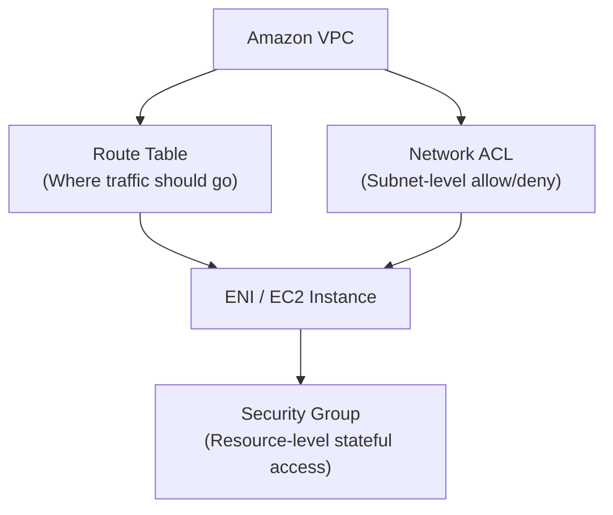

The exam question is usually:

> **"Where should I control this traffic, at what scope, with minimum operational overhead, and what happens when the architecture scales?"**

---

# 1. First: Why Do These Three Services/Controls Exist?

They solve **different problems**.

| Control | Fundamental question |
|---|---|
| **Route table** | **Where should the packet go?** |
| **Security Group** | **Should this resource/ENI be allowed to communicate?** |
| **Network ACL** | **Should this subnet allow/deny this traffic?** |

Memorize:

> 🛣️ **Route table = direction**  
> 🛡️ **Security Group = resource firewall**  
> 🚧 **NACL = subnet boundary firewall**

---

# 2. Route Tables

## Why does a route table exist?

A VPC needs to know:

> **"For this destination IP, where should I send the packet?"**

Example:

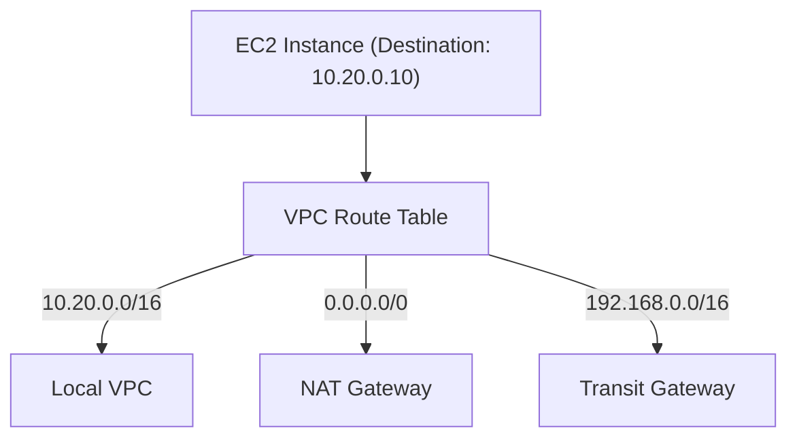

The route table makes the forwarding decision.

---

# 3. Route Table Is NOT a Firewall

This is a major exam trap.

Suppose:

```text
10.0.0.0/16 → local
```

That means traffic can be routed within the VPC.

It does **not** mean:

> "Traffic is authorized."

Authorization/filtering is handled by security controls such as:

* Security Groups
* Network ACLs
* IAM/resource policies where applicable

---

# 4. Route Table — The Problem It Solves

Without routing:

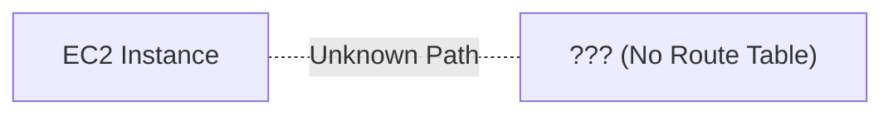

The network doesn't know where the destination is.

Route tables enable:

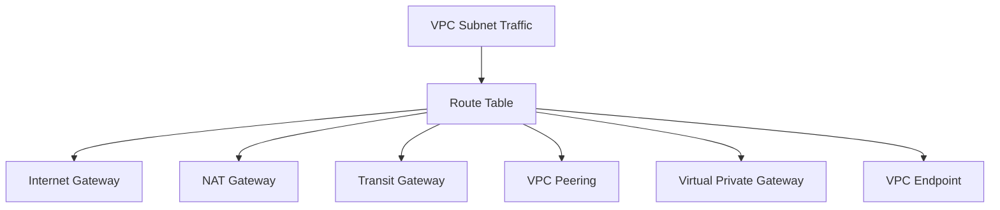

---

# 5. Route Table Example

Imagine:

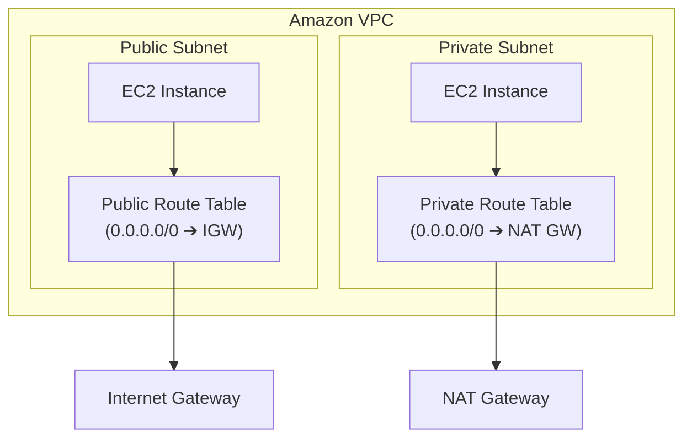

That's how you distinguish public and private subnet behavior.

---

# 6. Public vs Private Subnet

### Public subnet

A subnet is considered public when its route table has a route to an **Internet Gateway**, typically:

```text
0.0.0.0/0 → IGW
```

and the resource has the addressing required for Internet communication.

### Private subnet

Usually:

```text
0.0.0.0/0 → NAT Gateway
```

for outbound Internet access.

Or:

```text
0.0.0.0/0 → Transit Gateway
```

for centralized network connectivity.

Or potentially no default Internet route at all for isolated workloads.

---

# 7. Route Table Cost

The route table itself is not where you normally incur a separate hourly charge.

The **next hop** may cost money.

For example:

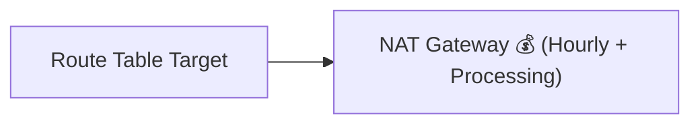

NAT Gateway has associated charges.

Similarly:

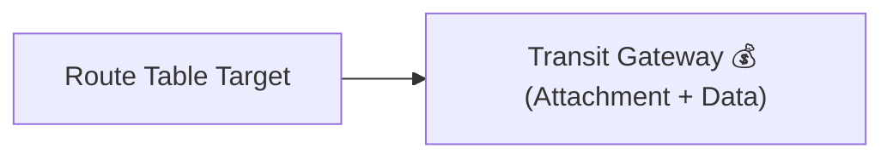

Transit Gateway has associated pricing.

Therefore, for SAP-C02:

> **Don't just ask what the route is. Ask what the target of the route costs.**

---

# 8. Route Table Operational Overhead

Usually **low**, but it can become significant at scale.

Small:

```text
VPC
 ├── Public RT
 └── Private RT
```

Easy.

Large enterprise:

```text
100 VPCs
20 route tables/VPC
hundreds of prefixes
multiple TGWs
multiple accounts
```

Now route management becomes an operational concern.

This is why architectural services such as **Transit Gateway** can reduce networking complexity compared with a large VPC-peering mesh.

---

# 9. Security Groups

Now move to the second control.

A Security Group is essentially a **stateful virtual firewall associated with network interfaces/resources**.

Think:

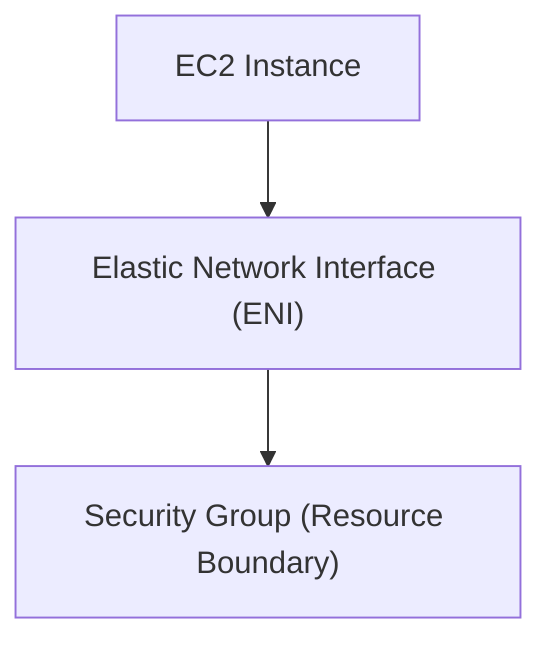

---

# 10. Why Do Security Groups Exist?

The problem:

> "Even if traffic can reach my subnet/resource, should the resource accept it?"

Example:

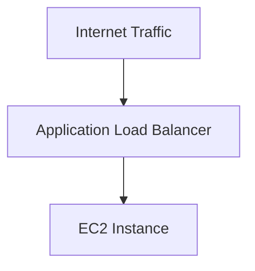

You want:

```text
Internet → ALB : 443
ALB → EC2 : 443
```

but:

```text
Internet → EC2 : 22
```

should be blocked.

Security Groups implement this kind of control.

---

# 11. Security Group = Stateful

This is extremely important.

Suppose:

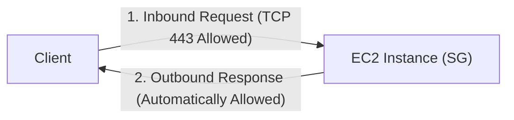

If the inbound request is allowed by the SG, the return traffic is automatically allowed as part of the established flow.

You don't normally need a separate outbound rule specifically matching the response.

That's **stateful** behavior.

---

# 12. Security Group Is Allow-Based

Security Groups support:

> **Allow rules**

They don't support explicit deny rules.

Example:

```text
SG
 ├── Allow TCP 443 from ALB-SG
 └── Allow TCP 22 from Admin-SG
```

You cannot simply add:

```text
DENY 10.1.1.10
```

to a security group.

That's a major exam clue.

---

# 13. Security Group Can Reference Another Security Group

This is one of the most useful AWS networking patterns.

Example:

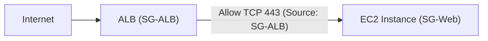

EC2 SG:

```text
Allow TCP 443
Source = SG-ALB
```

Meaning:

> Allow traffic from resources associated with the ALB security group.

This is much better than hardcoding changing IP addresses in many architectures.

---

# 14. Three-Tier Security Group Architecture

This is an SAP-C02 classic:

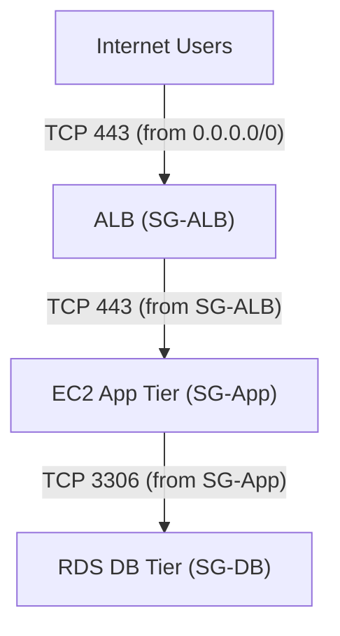

Rules:

```text
SG-ALB:
443 from Internet

SG-App:
443 from SG-ALB

SG-DB:
3306 from SG-App
```

This provides **least-privilege network connectivity**.

---

# 15. Why SG References Are Better Than IP Rules

Imagine autoscaling:

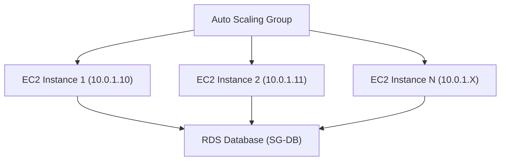

Their IP addresses can change.

If your database SG says:

```text
Allow 3306 from 10.0.1.10
Allow 3306 from 10.0.1.11
...
```

that's operationally ugly.

Instead:

```text
RDS SG
Allow 3306 from SG-App
```

Now any appropriate application instance associated with SG-App can connect.

### Operational overhead

**Low.**

### Scalability

**Excellent.**

---

# 16. Security Group Cost

Security Groups themselves generally don't have a separate per-hour charge.

The important cost is indirect:

> Better SG architecture can reduce operational effort and avoid unnecessary network infrastructure.

For example:

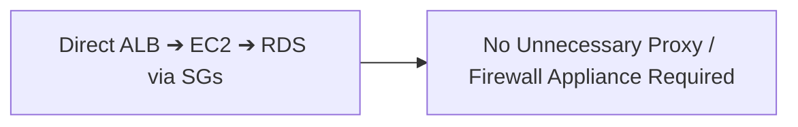

But don't interpret this as:

> "Security Groups are free, therefore use unlimited rules."

There are quotas and operational complexity.

---

# 17. Security Group Minimal Requirements

If your workload needs basic network access control:

```text
VPC
+
Security Groups
```

is usually enough.

You don't automatically need NACLs.

This is a very important SAP-C02 principle:

> **Don't add NACLs just because you can.**

---

# 18. Network ACLs

Now the third control.

A Network ACL is associated with a **subnet**.

Think:

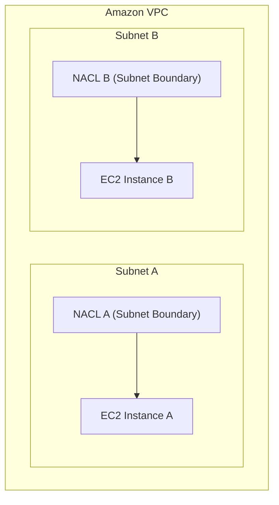

---

# 19. Why NACLs Exist

They solve:

> **"Should this traffic be allowed to enter or leave this subnet at the subnet boundary?"**

This is different from SG.

Security Group:

```text
Resource / ENI level
```

NACL:

```text
Subnet level
```

---

# 20. NACL Is Stateless

This is one of the most important exam facts.

Suppose:

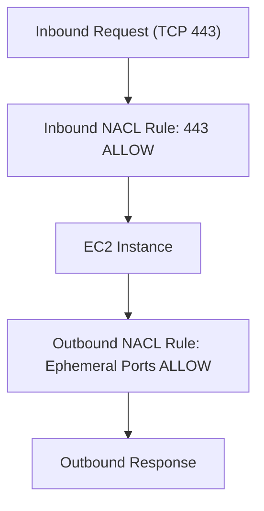

The NACL allows inbound TCP 443.

Because NACL is stateless, you must also allow the **return traffic** appropriately.

Conceptually:

```text
Inbound:
443 → ALLOW

Outbound:
Ephemeral ports → ALLOW
```

If you forget the return path:

```text
Request → works
Response → blocked
```

Result:

> Connection fails.

---

# 21. NACL Supports Allow AND Deny

Unlike Security Groups:

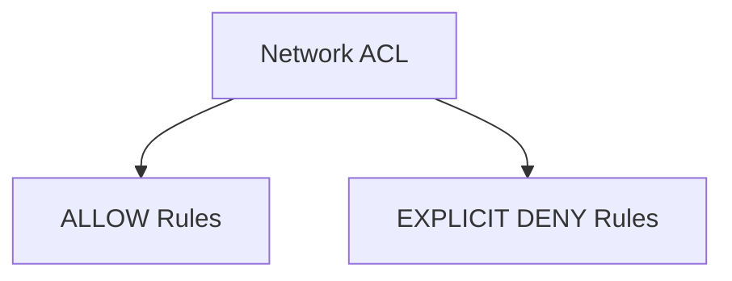

Example:

```text
Rule 100:
DENY 203.0.113.10

Rule 200:
ALLOW 0.0.0.0/0
```

The explicit deny can block that source.

---

# 22. NACL Rules Are Numbered

Example:

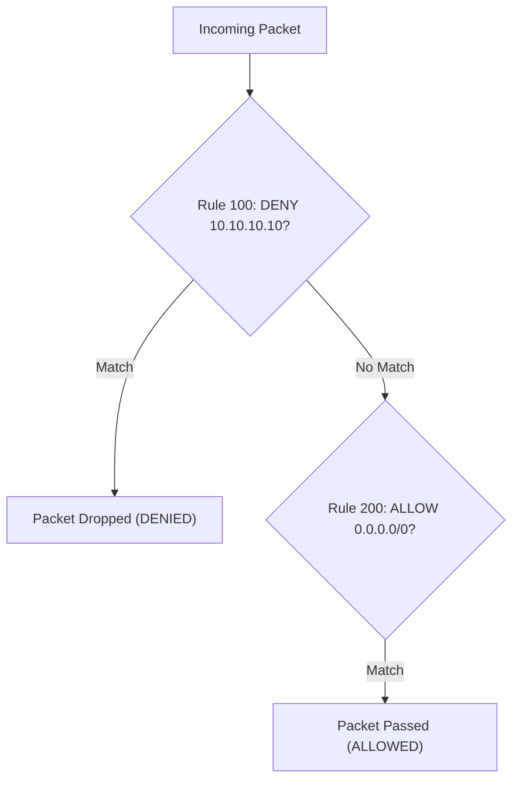

Rules are evaluated in order.

Lower rule number first.

Traffic matching 100 gets denied before reaching 200.

---

# 23. NACL vs Security Group

This table is extremely important.

| Feature | Security Group | Network ACL |
|---|---|---|
| Scope | ENI/resource | Subnet |
| Stateful | ✅ | ❌ |
| Stateless | ❌ | ✅ |
| Allow | ✅ | ✅ |
| Explicit deny | ❌ | ✅ |
| Rule order | Not evaluated like NACL numbered rules | ✅ |
| SG references | ✅ | ❌ |
| Default behavior | Deny inbound; outbound commonly allowed by default SG | Default NACL allows all |
| Best use | Primary workload firewall | Subnet-level coarse control |

---

# 24. Why Have Both?

Because they solve different security problems.

Think:

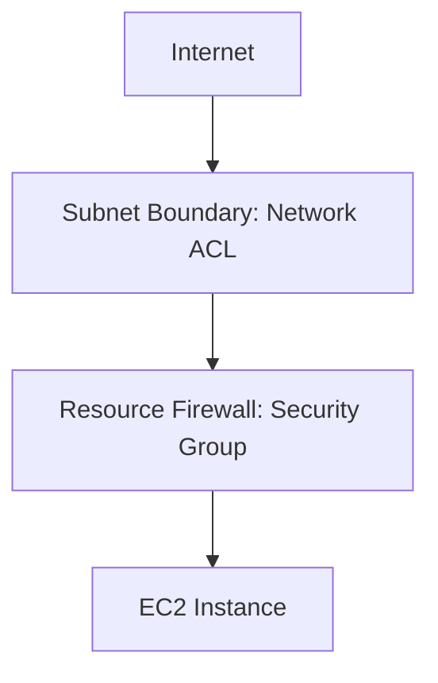

Two layers of control.

---

# 25. But Does Every VPC Need NACLs?

**No.**

This is where SAP-C02 tests architecture judgment.

If the requirement is:

> "Secure a normal three-tier application with minimum operational overhead."

A reasonable design is:

```text
VPC
 │
 ├── Route Tables
 └── Security Groups
```

You may not need custom NACLs.

---

# 26. When Should I Use NACLs?

NACL becomes attractive when the requirement explicitly asks for:

### 1. Subnet-level protection

```text
Subnet
   │
   ▼
NACL
```

### 2. Explicit deny

```text
Block this CIDR
```

### 3. Defense in depth

```text
SG + NACL
```

### 4. Compliance/security boundary

For example:

> "Block a known malicious CIDR at the subnet boundary."

NACL can be useful.

---

# 27. NACL Operational Overhead

This is where the trade-off appears.

Imagine:

```text
NACL
  │
  ├── Inbound rules
  │
  ├── Outbound rules
  │
  ├── Rule numbering
  │
  └── Ephemeral ports
```

Because it's stateless, you must think about both directions.

This increases operational complexity.

Therefore:

> **Don't use custom NACLs as your first-line security control unless there is a reason.**

---

# 28. Route Table vs SG vs NACL

Let's use one packet:

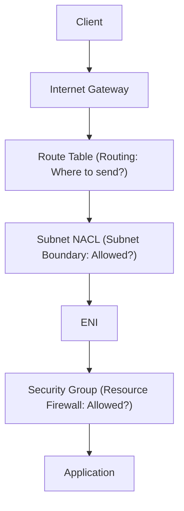

Conceptually:

### Route table

> Where should this packet go?

### NACL

> Is this subnet allowed to receive/send this traffic?

### Security Group

> Is this resource allowed to communicate?

---

# 29. Important Nuance: The Actual Packet Path

Don't memorize the previous diagram as an exact universal packet-processing sequence.

The better exam mental model is:

```text
Routing
+
Subnet boundary filtering
+
ENI/resource filtering
```

AWS networking packet processing has service-specific nuances.

For SAP-C02, the key is knowing **scope and behavior**, not assuming one universal sequence for every AWS networking path.

---

# 30. Cost Trade-Off

Here's the architectural comparison.

| Control | Direct cost | Operational cost | Security value |
|---|--:|--:|---|
| Route table | Low/no separate charge | Low → High at scale | Routing |
| SG | No separate charge | Low | High |
| NACL | No separate charge | Medium | High for subnet boundary |
| NAT Gateway | 💰 | Medium | Outbound architecture |
| Network Firewall | 💰💰 | Medium/High | Advanced network inspection |

This leads to an important SAP-C02 insight:

> **"No direct charge" does not mean "no cost."**

Operational complexity is a cost.

---

# 31. Security Group vs AWS Network Firewall

Another important association.

### Security Group

```text
Basic resource-level filtering
```

### NACL

```text
Basic subnet-level stateless filtering
```

### AWS Network Firewall

```text
Advanced centralized network inspection
```

Think:

```mermaid
flowchart TD
    Sec["NETWORK SECURITY CONTROLS"] --> SG["Security Group<br/>(Resource / Stateful)"]
    Sec --> NACL["Network ACL<br/>(Subnet / Stateless)"]
    Sec --> NetFW["AWS Network Firewall<br/>(Advanced Centralized Inspection)"]
```

Don't use Network Firewall when a simple SG solves the requirement.

---

# 32. When Network Firewall Makes Sense

Examples:

* Stateful inspection
* Centralized inspection
* Domain filtering
* Intrusion prevention capabilities
* Advanced traffic inspection
* Centralized egress control
* Multi-VPC inspection architecture

But:

> **It has additional cost and operational complexity.**

So if the question says:

> "Minimum operational overhead and basic application isolation"

Don't jump to Network Firewall.

Use:

**Security Groups.**

---

# 33. Centralized Inspection Architecture

For a larger enterprise:

```mermaid
flowchart TD
    subgraph AppVPCs["Application VPCs"]
        VPCA["VPC-A"]
        VPCB["VPC-B"]
        VPCC["VPC-C"]
    end

    AppVPCs --> TGW["Transit Gateway"] --> InspVPC["Inspection VPC (AWS Network Firewall)"] --> Egress["Egress / Internet Gateway"]
```

This is a much more sophisticated architecture.

Use it when the requirements justify centralized inspection.

---

# 34. Route Tables + Transit Gateway

Route tables become very important when Transit Gateway is introduced.

Example:

```mermaid
flowchart LR
    VPCA["VPC-A (VPC Route Table: 10.20.0.0/16 ➔ TGW)"] --> TGW["Transit Gateway (TGW Route Table)"] --> VPCB["VPC-B"]
```

The route table determines how traffic gets to TGW.

The TGW itself also has route tables.

This is why at enterprise scale you need to distinguish:

```text
VPC Route Table
        +
Transit Gateway Route Table
```

---

# 35. VPC Peering + Route Tables

Similarly:

```mermaid
flowchart LR
    VPCA["VPC-A (Route Table)"] --> Peer["VPC Peering Connection"] --> VPCB["VPC-B"]
```

You must add the appropriate routes.

VPC peering doesn't magically make every subnet reachable.

---

# 36. Route Tables + VPN / Direct Connect

For hybrid networking:

```mermaid
flowchart LR
    OnPrem["On-Premises Data Center"] --> Link["VPN / Direct Connect"] --> VGW["AWS VGW / TGW"] --> RT["VPC Route Tables"] --> VPC["VPC Subnets"]
```

Routes determine where private traffic goes.

For example:

```text
10.10.0.0/16 → VGW/TGW
```

or:

```text
192.168.0.0/16 → TGW
```

---

# 37. Security Groups + Load Balancers

Common architecture:

```mermaid
flowchart LR
    Internet["Internet"] -->|"TCP 443"| ALB["ALB (SG-ALB)"] -->|"TCP 443 (Source: SG-ALB)"| EC2["EC2 (SG-App)"]
```

SG-App:

```text
Allow 443
Source = SG-ALB
```

This is much better than:

```text
Allow 443 from 0.0.0.0/0
```

because it minimizes exposure.

---

# 38. Security Groups + RDS

Classic:

```mermaid
flowchart LR
    EC2["EC2 (SG-App)"] -->|"TCP 3306 (Source: SG-App)"| RDS["RDS (SG-DB)"]
```

RDS SG:

```text
Allow TCP 3306
Source = SG-App
```

Not:

```text
Allow 3306 from Internet
```

---

# 39. Security Groups + VPC Endpoints

Connect this with your previous topic.

```mermaid
flowchart LR
    EC2["EC2 (App SG)"] --> IFEP["Interface Endpoint ENI (Endpoint SG)"] --> Service["AWS Service"]
```

The endpoint ENI has a security group.

So you can control which workloads can communicate with the endpoint.

This is a great example of **associated services/concepts**:

```text
SG
+
VPC Endpoint
+
Private DNS
+
Route 53 Resolver
```

---

# 40. Security Groups + PrivateLink

Similarly:

```mermaid
flowchart LR
    Consumer["Consumer VPC"] --> IFEP["Interface Endpoint (SG)"] --> PL["PrivateLink"] --> Provider["Provider Service"]
```

The consumer's interface endpoint uses a Security Group.

This allows you to restrict who can reach the endpoint.

---

# 41. NACL + Public Subnet

Suppose you have:

```mermaid
flowchart TD
    Internet["Internet"] --> NACL["Public Subnet NACL (Deny Malicious CIDRs)"] --> ALB["Application Load Balancer (Public Subnet)"]
```

A NACL might provide a subnet-level deny for known malicious CIDRs.

But you still generally use:

```text
NACL
+
Security Group
```

not NACL alone.

---

# 42. The "Minimal Requirement" Principle

For SAP-C02, always ask:

> **What is the minimum AWS networking control that satisfies the requirement?**

### Requirement

"EC2 should only accept HTTPS from ALB."

Minimum:

```text
Security Group
```

Not:

```text
Security Group
+
NACL
+
Network Firewall
```

unless the question specifies additional requirements.

---

### Requirement

"Block a specific CIDR at subnet level."

Think:

```text
NACL
```

---

### Requirement

"Send 10.20.0.0/16 traffic through Transit Gateway."

Think:

```text
Route Table
```

---

# 43. Explicit Deny Requirement

This is a **very strong exam clue**.

Question:

> "Deny traffic from a specific IP range while allowing other traffic."

Security Group?

❌ Can't explicitly deny.

NACL?

✅ Can explicitly deny.

Network Firewall?

✅ Can potentially implement more advanced policies, but may be unnecessary.

If the requirement specifically says:

> **"Explicit deny at subnet level."**

→ **NACL**

---

# 44. Stateful vs Stateless — Memorize

```mermaid
flowchart TD
    SG["Security Group ➔ STATEFUL<br/>(Return traffic automatically allowed)"]
    NACL["Network ACL ➔ STATELESS<br/>(Must configure both Inbound & Outbound rules)"]
```

Mnemonic:

> **SG remembers. NACL doesn't.**

---

# 45. Security Group Scaling Advantage

Imagine Auto Scaling:

```mermaid
flowchart TD
    ALB["ALB (SG-ALB)"] --> ASG["Auto Scaling Group"]
    ASG --> EC2_1["EC2-1"]
    ASG --> EC2_2["EC2-2"]
    ASG --> EC2_N["EC2-100"]

    ASG --> DB["RDS DB (SG-DB: Allow TCP 3306 from SG-App)"]
```

SG rule:

```text
Allow 443 from SG-ALB
```

You don't need to update the DB firewall every time an EC2 instance appears.

That's why SGs are excellent for dynamic cloud architectures.

---

# 46. NACL Scaling Trade-Off

With NACL:

```mermaid
flowchart TD
    Subnet["Subnet NACL (Subnet Boundary)"] --> EC2_1["EC2-1 (Trusted)"]
    Subnet --> EC2_2["EC2-2 (Untrusted)"]
```

The rule applies to the entire subnet.

This can be powerful but coarse.

If:

```text
EC2-1 = trusted
EC2-2 = untrusted
```

a subnet-level NACL cannot easily express the same granular identity model as security groups.

Therefore:

> **NACL = coarse-grained**  
> **SG = finer-grained**

---

# 47. Multi-Tier HLD — Recommended Default

For a typical production application:

```mermaid
flowchart TD
    Users["Internet Users"] -->|"TCP 443"| ALB["ALB (SG-ALB)"]
    ALB -->|"TCP 443 (Source: SG-ALB)"| App["EC2 Application Tier (SG-App)"]
    App -->|"TCP 3306 (Source: SG-App)"| DB["RDS Database Tier (SG-DB)"]
```

### Why this is attractive

* Least privilege
* Low operational overhead
* Works with Auto Scaling
* No hardcoded instance IPs
* Simple
* No unnecessary firewall appliance

---

# 48. Defense-in-Depth HLD

If security requirements are stronger:

```mermaid
flowchart TD
    Internet["Internet"] --> ALB["ALB (SG-ALB)"] --> NACL["Subnet NACL Control"] --> EC2["EC2 Instance (SG-App)"]
```

NACL provides another boundary.

But don't add it solely for decoration.

---

# 49. Security Control Hierarchy

A useful way to think:

```mermaid
flowchart TD
    Control["TRAFFIC CONTROL LAYERS"] --> RT["ROUTING (Route Table)<br/>'Where does traffic go?'"]
    Control --> NACL["SUBNET (Network ACL)<br/>'Is subnet allowed?'"]
    Control --> SG["RESOURCE (Security Group)<br/>'Is resource allowed?'"]
    Control --> NetFW["ADVANCED (Network Firewall)<br/>'Deep inspection needed?'"]
```

---

# 50. Cost Trade-Off: Simple vs Advanced

Imagine three designs.

### Design A

```text
Route Tables
+
Security Groups
```

Cost:

🟢 Lowest operational complexity.

Use when requirements are straightforward.

---

### Design B

```text
Route Tables
+
Security Groups
+
NACLs
```

Cost:

🟡 Still relatively low direct cost, but more rule-management complexity.

Use when subnet-level controls or explicit denies are needed.

---

### Design C

```text
Route Tables
+
SG
+
NACL
+
Transit Gateway
+
Network Firewall
+
Inspection VPC
```

Cost:

🔴 Significantly more infrastructure and operational complexity.

Use only when the requirements justify it.

---

# 51. SAP-C02 Cost Question

Suppose AWS asks:

> "You need to isolate application tiers while minimizing operational overhead."

Don't think:

```text
Network Firewall
```

Think:

```text
Security Groups
```

---

Suppose:

> "Block traffic from known malicious IP addresses across a subnet."

Think:

```text
NACL
```

---

Suppose:

> "Route all traffic from VPC-A destined for on-premises through Transit Gateway."

Think:

```text
Route Table
+
TGW
```

---

# 52. Related Services You Should Associate

For SAP-C02, build this mental map:

```mermaid
flowchart TD
    NetSec["NETWORK SECURITY MAP"] --> RT["Route Tables (TGW / Peering / VPN / DX)"]
    NetSec --> SG["Security Groups (ALB / EC2 / RDS / VPC Endpoints)"]
    NetSec --> NACL["Network ACLs (Subnet CIDR Deny)"]
    NetSec --> Advanced["Advanced Observability & Inspection<br/>(Network Firewall / VPC Flow Logs / Reachability Analyzer / GuardDuty)"]
```

Each solves a different problem.

---

# 53. Don't Confuse Flow Logs With SG/NACL

This is an important distinction.

### Security Group

Controls traffic.

### NACL

Controls traffic.

### VPC Flow Logs

**Observes traffic metadata.**

```mermaid
flowchart TD
    Traffic["Network Traffic"] --> SG["Security Group (Controls)"]
    Traffic --> NACL["Network ACL (Controls)"]
    Traffic --> FlowLogs["VPC Flow Logs (Records Metadata)"]
```

Flow Logs don't magically allow/deny traffic.

---

# 54. Don't Confuse Reachability Analyzer

**VPC Reachability Analyzer** helps answer:

> "Can network traffic get from A to B based on the configured network path and controls?"

Conceptually:

```mermaid
flowchart LR
    Source["Source (EC2)"] --> RA["VPC Reachability Analyzer"] --> Path["Path Analysis (Route ➔ NACL ➔ SG)"] --> Status{"Reachable or Blocked?"}
```

Very useful for troubleshooting.

But it doesn't replace your actual security controls.

---

# 55. Security Group vs NACL vs Network Firewall

For the exam:

| Requirement | First thought |
|---|---|
| EC2-level access control | Security Group |
| ALB → EC2 | Security Group |
| EC2 → RDS | Security Group |
| Explicit deny | NACL |
| Subnet-level filtering | NACL |
| Simple architecture | SG |
| Advanced centralized inspection | Network Firewall |
| Traffic routing | Route table |
| Observe traffic | Flow Logs |
| Test reachability | Reachability Analyzer |

---

# 56. One Important Architecture Principle

Don't think:

> **"More security controls = more secure."**

Think:

> **"The right security control at the right layer = secure and operable."**

For example:

```text
Bad
────────────────────
SG
NACL
Network Firewall
Proxy
Gateway
IDS
IPS
WAF
...all everywhere
```

This can create:

* High cost
* Troubleshooting difficulty
* Configuration drift
* Operational overhead
* False positives
* Availability risk

Instead:

```mermaid
flowchart TD
    Users["Internet"] --> WAF["AWS WAF (Layer 7 Protection)"] --> ALB["ALB"] --> SG1["App Security Group"] --> EC2["EC2"] --> SG2["DB Security Group"] --> RDS["RDS"]
```

Add NACL/Network Firewall when requirements justify them.

---

# 57. Very Important: WAF Is Different

If the exam says:

> Block SQL injection / XSS / HTTP attacks

Don't think SG/NACL.

Think:

**AWS WAF**

Because:

```mermaid
flowchart TD
    L4["SG / NACL ➔ Layer 3/4 Network Filtering"]
    L7["AWS WAF ➔ Layer 7 Application Filtering (SQLi / XSS / HTTP)"]
```

---

# 58. Final Decision Tree

Memorize this:

```mermaid
flowchart TD
    Start["What problem are you solving?"] --> Type{"Routing, Resource, or Subnet?"}
    
    Type -->|Routing| RT["Route Table"]
    Type -->|Resource Access| SG["Security Group"]
    Type -->|Subnet Access| NACL["Network ACL"]

    SGChoice{"Need explicit DENY or Subnet Boundary?"} -->|YES| NACLChoice["Use NACL"]
    SGChoice -->|NO| SGUse["Use Security Group"]
```

---

# 🧠 SAP-C02 FINAL CHEAT SHEET

### Route Table

**Why exists?**

> Decide **where traffic goes**.

**Cost:**  
Usually no separate charge; target services may cost.

**Operational overhead:**  
Low initially; increases with complex multi-VPC environments.

**Related:**  
TGW, VPC Peering, VPN, Direct Connect, IGW, NAT Gateway, VPC endpoints.

---

### Security Group

**Why exists?**

> Control **resource/ENI-level traffic**.

**Stateful?**  
✅ Yes

**Explicit deny?**  
❌ No

**Operational overhead?**  
🟢 Low

**Best use:**  
EC2, ALB, RDS, ECS, VPC endpoints, etc.

**Cost:**  
No separate SG charge.

**Exam favorite:**  
`ALB SG → App SG → DB SG`

---

### Network ACL

**Why exists?**

> Control traffic at the **subnet boundary**.

**Stateful?**

❌ No — stateless.

**Explicit deny?**

✅ Yes.

**Operational overhead?**

🟡 Higher than SG because you manage both directions and rule ordering.

**Best use:**

* Subnet-level controls
* Explicit deny
* Defense in depth
* Compliance requirements

**Cost:**

No separate NACL charge, but operational complexity is the real trade-off.

---

---

# 59. Common SAP-C02 Exam Traps: Layer 3/4 vs. Layer 7 Caching & Filtering

> [!CAUTION]
> **Trap: Using Security Groups or Network ACLs for Domain / URL Whitelisting**
> - **Security Groups and Network ACLs operate strictly at Layer 3/4 (IP addresses, CIDR blocks, TCP/UDP ports)**.
> - **Neither Security Groups nor NACLs can inspect HTTP/HTTPS headers or filter traffic based on domain names or URLs**!
> - To filter outbound traffic by domain name or URL (e.g., retrieving software patches from `repo.example.com`), deploy a **Forward Web Proxy Server (Squid / HAProxy)** or **AWS Network Firewall** domain list rules.

---

# 🏆 The Three Sentences to Memorize

> **Route Table = Where does traffic go?**  
> **Security Group = Is this resource allowed to communicate?**  
> **NACL = Is this subnet allowed to send/receive this traffic?**

And the **SAP-C02 architecture principle**:

> **Start with the minimum control that satisfies the security requirement. Prefer Security Groups for normal workload isolation because they are stateful, scalable, and low operational overhead. Add NACLs when you specifically need subnet-level controls or explicit denies. Add Network Firewall or Forward Web Proxy when you need advanced Layer 7 domain/URL inspection—not simply because "more security" sounds better.**