# 1.3 Disaster Recovery Strategies in AWS

> **Domain Focus**: AWS Certified Solutions Architect – Professional (SAP-C02) & AWS Certified AI Practitioner / Cloud Architecture  
> **Core Principle**: Disaster recovery (DR) is driven strictly by **Business Requirements** $\rightarrow$ **RTO / RPO** $\rightarrow$ **DR Strategy** $\rightarrow$ **AWS Services** $\rightarrow$ **Cost & Operational Overhead**.

---

## 1. The Disaster Recovery (DR) Spectrum

Disaster recovery strategies represent a direct trade-off between **recovery speed** (low RTO/RPO) and **cost & complexity**. As recovery time and data loss targets approach zero, infrastructure cost and operational overhead increase exponentially.

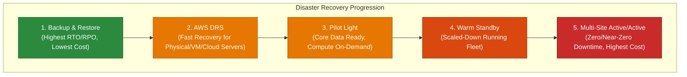

### Comprehensive Comparison Matrix

| DR Strategy | DR Environment State | RTO (Recovery Time) | RPO (Recovery Point) | Cost Multiplier | Operational Overhead | Failover Mechanism |
| :--- | :--- | :--- | :--- | :---: | :---: | :--- |
| **Backup & Restore** | No compute or standby resources running. Backups in S3 / AWS Backup. | **Hours to Days** | **Hours to Days** | `$` (Lowest) | Low (Ongoing) / High (During Disaster) | Manual redeployment via IaC (CloudFormation/Terraform) & snapshot restore. |
| **AWS Elastic Disaster Recovery (DRS)** | Low-cost staging area with continuous block-level data replication. | **Minutes to Hours** | **Seconds to Sub-Minute** | `$$` (Low–Med) | Low to Medium | Automated server launch into Target VPC via DRS console / API. |
| **Pilot Light** | Critical core running (live replicated DB + core network), compute stopped/template only. | **Tens of Minutes to Hours** | **Seconds to Minutes** | `$$` (Medium) | Medium | Promote DB read replica, provision compute fleet via Auto Scaling/IaC, update DNS. |
| **Warm Standby** | Fully functional application running at reduced capacity (e.g., 20% compute fleet). | **Minutes** | **Seconds to Sub-Minute** | `$$$` (High) | Medium to High | Auto Scaling scales compute to 100%, Route 53 health check switches active traffic. |
| **Multi-Site (Active/Active)** | Full production fleets running concurrently in two or more Regions. | **Near-Zero (Seconds)** | **Near-Zero (Real-time)** | `$$$$` (Highest) | Highest | Global traffic routing (Route 53 / Global Accelerator), multi-region active databases. |

> [!IMPORTANT]
> **Key Exam Rule**: Lower RTO + Lower RPO = Exponentially higher infrastructure and operational cost. Never select an Active/Active or Warm Standby architecture if business requirements allow hours of downtime and cost minimization is requested.

---

## 2. AWS Elastic Disaster Recovery (AWS DRS)

### Why It Exists & The Problem It Solves
AWS Elastic Disaster Recovery (**AWS DRS**) is the recommended AWS service for lift-and-shift DR. It simplifies disaster recovery for physical servers, VMware vSphere, Microsoft Hyper-V, and cloud-based instances into AWS without needing to redesign applications or maintain idle compute instances.

> **Core Formula**: Source Server $\rightarrow$ Continuous Replication (Agent) $\rightarrow$ AWS Staging Area $\rightarrow$ Non-disruptive DR Drills / Automated Cutover

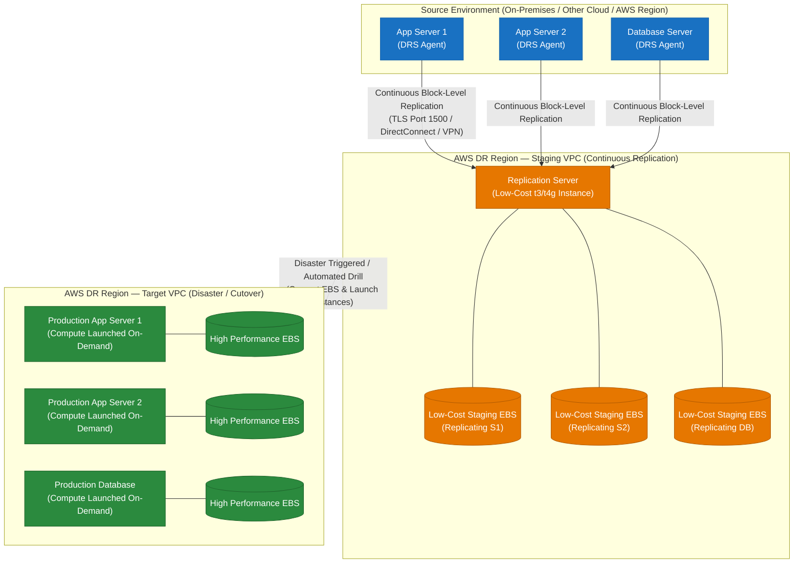

### Key Technical Characteristics of AWS DRS
- **Staging Area Architecture**: Uses low-cost lightweight replication instances (`t3.small` / `t4g.small`) and cost-effective EBS volumes (e.g., `sc1` / `st1` / `gp3`) to continuously capture OS-level block changes.
- **Point-in-Time Recovery (PITR)**: Provides crash-consistent and application-consistent recovery points using snapshot granularity. Ideal for recovering from ransomware or accidental data corruption.
- **Non-Disruptive Testing**: Perform DR drills anytime without impacting primary workloads or interrupting ongoing replication.
- **Launch Templates**: Define target instance types, subnets, security groups, IAM roles, and post-launch scripts in advance.

> [!TIP]
> **Exam Clue**: When a question states: *"Hundreds of on-premises VMware/physical servers must have DR into AWS with minimal architectural redesign, RPO in seconds, and lowest idle compute cost"*, the answer is **AWS Elastic Disaster Recovery (DRS)**.

---

## 3. Pilot Light

### Core Concept: "Keep the Critical Core Running"
In a **Pilot Light** strategy, the core data storage and critical foundations are continuously live and replicating in the DR Region. However, compute layers (web/app servers) and supporting services are **not running** during normal operations. They are provisioned only during failover via Automation (IaC, AMIs, Auto Scaling).


### Failover Workflow (Sequence of Events)
1. **Detection**: Route 53 health check detects primary region outage.
2. **Database Promotion**: Promote cross-region RDS read replica or Aurora Global Database secondary region to primary read/write.
3. **Compute Scaling**: Update Auto Scaling Group desired capacity from `0` to target capacity, or trigger CloudFormation / Terraform to launch EC2 / ECS / EKS fleets.
4. **Traffic Redirection**: Route 53 DNS records switch user traffic to the newly scaled DR endpoint.

---

## 4. Warm Standby

### Core Concept: "A Scaled-Down Functional Fleet Ready to Scale"
In a **Warm Standby** strategy, a fully functional but **scaled-down** replica of the entire production stack runs 24/7 in the DR Region. It is already handling end-to-end processing (or idle test traffic) and can handle full production loads immediately upon scaling up.

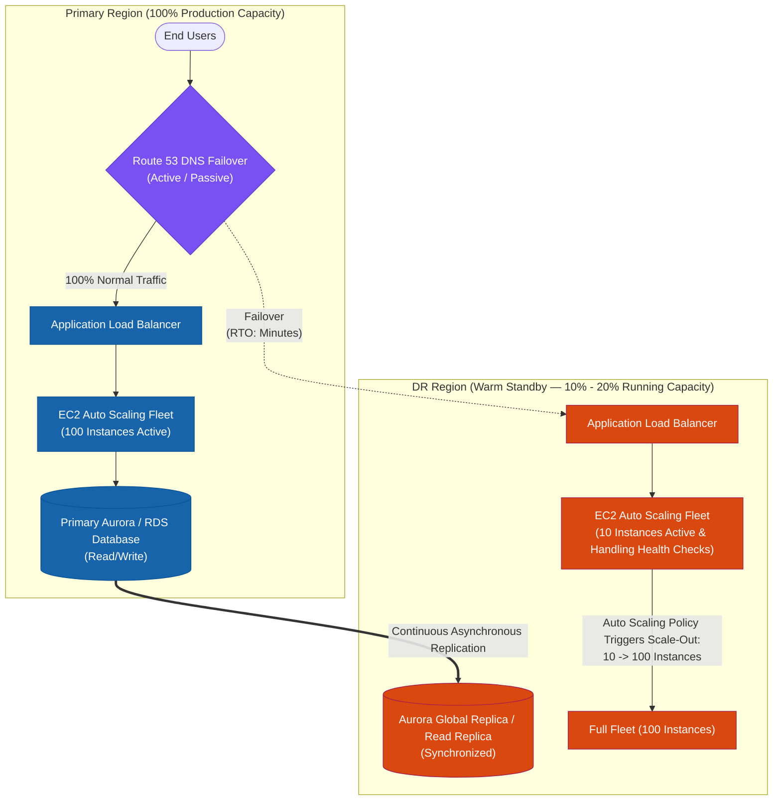

### Pilot Light vs. Warm Standby: The Critical Difference

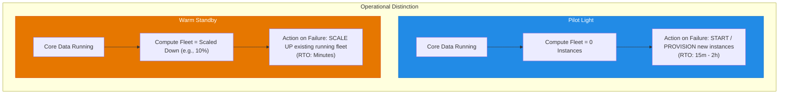

> [!TIP]
> **Memory Anchor**:
> - **Pilot Light**: *"Start what is not running."*
> - **Warm Standby**: *"Scale what is already running."*

---

## 5. Multi-Site (Active/Active)

### Core Concept: "Zero-Downtime Multi-Region Active Ingestion"
In a **Multi-Site Active/Active** architecture, multiple complete production environments run concurrently across two or more AWS Regions. Both regions actively serve user traffic simultaneously. If one Region experiences an outage, global traffic routing automatically sheds traffic away from the impaired Region with near-zero RTO.

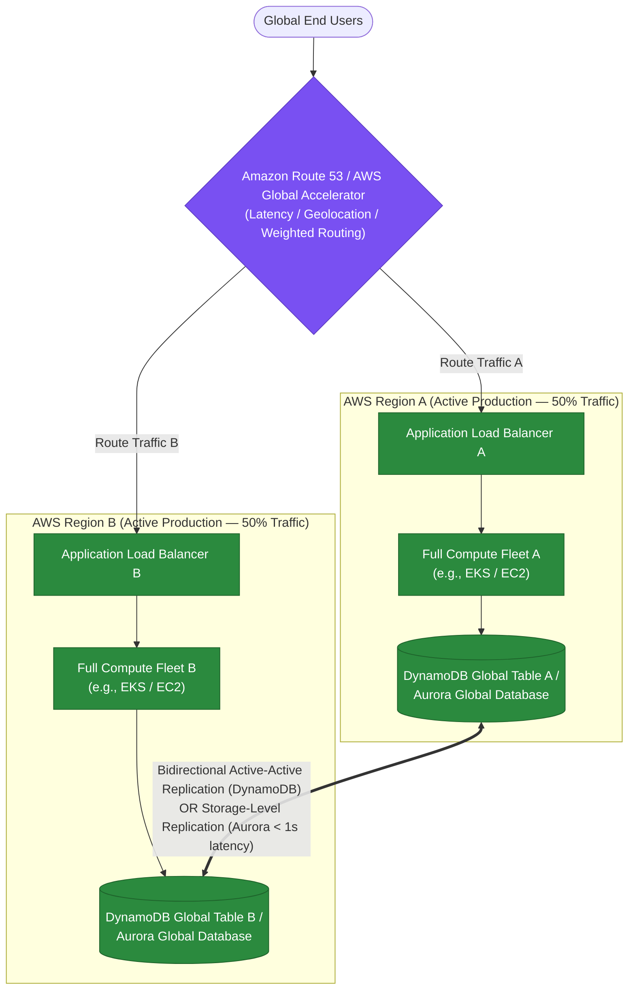

### Data Layer Strategies for Active/Active
1. **DynamoDB Global Tables**: Multi-region, multi-active database with automatic two-way replication. Built-in conflict resolution (last-write-wins).
2. **Amazon Aurora Global Database**: Single primary writer in one region, up to 5 read-only secondary regions with $< 1$ second cross-region replication lag. (Write traffic forwarded or routed to primary).
3. **Amazon S3 Cross-Region Replication (CRR) / Multi-Region Access Points (MRAP)**: Bidirectional active-active object storage with accelerated failover routing.

> [!WARNING]
> **Active/Active Challenges**: Multi-site is the most expensive and architecturally complex strategy. Data consistency (read-after-write, write-conflict resolution, distributed locks) must be solved at the application layer.

---

## 6. DR Architecture Decision Tree (Exam Decision Flowchart)

Use this step-by-step decision hierarchy when addressing scenario-based questions:

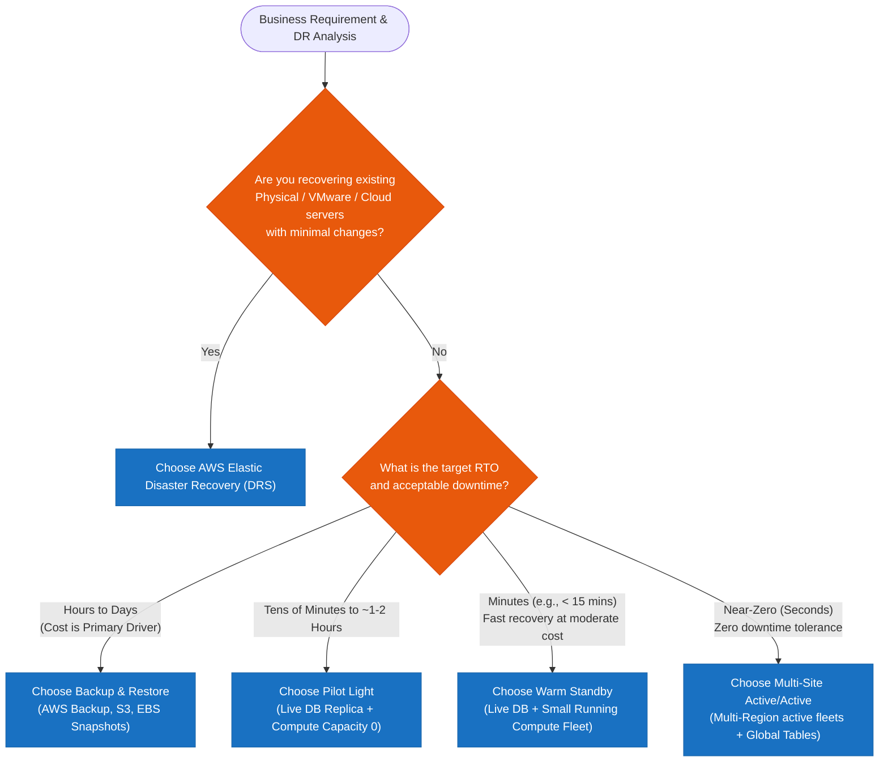

---

## 7. Operational Overhead & Supporting AWS Services

### Operational Complexity Spectrum

$$\text{Backup \& Restore} \longrightarrow \text{AWS DRS} \longrightarrow \text{Pilot Light} \longrightarrow \text{Warm Standby} \longrightarrow \text{Multi-Site Active/Active}$$

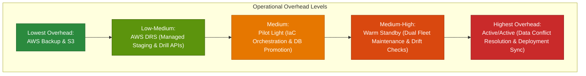

### Supporting AWS Services by Functional Category

| Category | Primary Services | Role in DR Architecture |
| :--- | :--- | :--- |
| **Global Traffic & DNS** | **Amazon Route 53**<br>**AWS Global Accelerator**<br>**Amazon CloudFront** | DNS failover with health checks, Anycast IP fast routing (<30s failover), edge caching and origin failover groups. |
| **Compute & Orchestration** | **EC2 Auto Scaling**<br>**Amazon ECS / EKS**<br>**AWS Lambda** | Dynamic scale-out from 0 to N instances, container orchestration across regions, automated failover runbooks. |
| **Database Tier** | **Aurora Global Database**<br>**DynamoDB Global Tables**<br>**RDS Cross-Region Replicas** | Fast cross-region replication (<1s), active-active multi-region writes, managed promotion during disaster. |
| **Storage & Backup** | **AWS Backup**<br>**Amazon S3 CRR**<br>**EBS Snapshot Copy** | Centralized cross-region backup policies, cross-region asynchronous object replication, encrypted snapshot copies. |
| **Infrastructure as Code** | **AWS CloudFormation**<br>**AWS CDK**<br>**Terraform** | Deterministic, rapid environment reproduction in DR region to eliminate manual configuration drift. |
| **Disaster Recovery** | **AWS Elastic Disaster Recovery** | Continuous block-level replication and non-disruptive automated drill orchestration for servers. |

---

## 8. Professional Scenario Walkthroughs & Exam Traps

### Scenario 1: Financial Core Banking
- **Question Statement**: An enterprise financial app processes mission-critical transactions. The organization mandates an **RTO $\le$ 10 minutes** and **RPO $\le$ 1 minute**. Infrastructure costs should be strictly minimized without violating recovery objectives.
- **Analysis**:
  - *Backup & Restore*: ❌ RTO is hours (too slow).
  - *Pilot Light*: ⚠️ Starting compute from scratch takes 15–20 minutes, breaching the 10-minute RTO.
  - *Active/Active*: ❌ Fulfills RTO/RPO but incurs 2x full production cost (fails cost optimization).
  - *Warm Standby*: ✅ **Correct**. Running a 10% compute fleet meets the 10-minute RTO via fast Auto Scaling while maintaining low RPO through database replication at reasonable cost.

### Scenario 2: Legacy Virtualized Workloads
- **Question Statement**: An enterprise must establish DR in AWS for 300 on-premises VMware virtual machines running legacy ERP apps. The team has minimal cloud engineering capacity and cannot refactor application architectures.
- **Analysis**:
  - *Answer*: **AWS Elastic Disaster Recovery (AWS DRS)**. Agent-based block-level replication into a staging VPC eliminates application redesign and minimizes operational overhead.

### Common Exam Traps

> [!CAUTION]
> 1. **Multi-AZ $\ne$ Regional Disaster Recovery**: Multi-AZ protects against local data center / Availability Zone failures. It does **not** protect against AWS Regional outages or control plane failures. Regional DR requires cross-region architectures.
> 2. **Backups Do Not Improve RTO**: Increasing snapshot frequency reduces data loss (**RPO**), but has zero effect on the time required to re-provision servers and restore disks (**RTO**).
> 3. **Route 53 Does Not Recover Applications**: Route 53 health checks and DNS failover only redirect network traffic to healthy endpoints; they do not promote databases or start failed compute instances.
> 4. **Don't Over-Engineer**: Always pick the most cost-effective strategy that meets the business RTO/RPO targets. Choosing Active/Active when Warm Standby or Pilot Light satisfies the SLA is considered an incorrect answer on the AWS SAP exam.
> 5. **Database Paradigm Match (NoSQL vs. Relational SQL)**: Never choose **Amazon Aurora Global Database** when the application architecture explicitly requires a **NoSQL database**. Choose **Amazon DynamoDB Global Tables** for NoSQL cross-region multi-master replication.

---

### Scenario 3: Multi-Region DR for NoSQL Logistics Web App (`us-east-1` ➔ `us-west-1`)

- **Scenario**: A logistics company hosts a global web application in `us-east-1` using EC2 instances for web/app tiers, S3 for static assets, and a **NoSQL database**. The company requires a DR site in `us-west-1` with identical data replication, ultra-fast automated failover, and automatic failback when `us-east-1` recovers.
- **Architecture Solution**:

```mermaid
flowchart TD
    subgraph PrimaryRegion["Primary AWS Region (us-east-1)"]
        ASG1["EC2 Auto Scaling Group<br/>(Web & App Tier)"]
        S3_1["Amazon S3 Bucket<br/>(Static Assets)"]
        DDB1[("Amazon DynamoDB Table<br/>(NoSQL Primary)")]
    end

    subgraph DRRegion["Secondary DR Region (us-west-1)"]
        ASG2["EC2 Auto Scaling Group<br/>(Deployed via CFN StackSets)"]
        S3_2["Amazon S3 Replica Bucket"]
        DDB2[("Amazon DynamoDB Table<br/>(NoSQL Secondary)")]
    end

    subgraph GlobalServices["Global Routing & Management Layer"]
        CFN["AWS CloudFormation StackSets<br/>(Provisions ASG templates across both Regions)"]
        S3CRR["S3 Cross-Region Replication (CRR)<br/>(Asynchronous static asset sync)"]
        DDBGlobal["Amazon DynamoDB Global Tables<br/>(Multi-Region Active-Active NoSQL sync)"]
        R53["Amazon Route 53 Failover Routing Policy<br/>• Health Check Primary us-east-1<br/>• Auto Failover to us-west-1 & Auto Failback"]
    end

    CFN ==> ASG1 & ASG2
    S3_1 ==>|"S3 CRR"| S3_2
    DDB1 <==>|"DynamoDB Global Tables"==> DDB2
    R53 ==>|"Active Traffic"| ASG1
    R53 -.->|"Failover Traffic"| ASG2

    classDef primary fill:#d1ecf1,stroke:#17a2b8,stroke-width:1px;
    classDef dr fill:#fff3cd,stroke:#ffc107,stroke-width:1px;
    classDef global fill:#d4edda,stroke:#28a745,stroke-width:2px;

    class PrimaryRegion,ASG1,S3_1,DDB1 primary;
    class DRRegion,ASG2,S3_2,DDB2 dr;
    class GlobalServices,CFN,S3CRR,DDBGlobal,R53 global;
```

### Key Architectural Rationale:
1. **Database Tier — DynamoDB Global Tables**: Fulfills the **NoSQL database requirement** with fully managed, multi-region active-active write replication. Eliminates custom replication code and delivers sub-second data synchronization between `us-east-1` and `us-west-1`.
2. **Infrastructure Provisioning — AWS CloudFormation StackSets**: Automatically deploys and maintains identical Auto Scaling Group configurations across multiple AWS regions from a single CloudFormation template.
3. **Automated Traffic Routing — Route 53 Failover Routing Policy**: Continuously monitors the primary region (`us-east-1`) via Route 53 Health Checks. Automatically routes user traffic to `us-west-1` during an outage and **automatically fails back** to `us-east-1` when health checks pass again.
4. **Static Content Storage — Amazon S3 Cross-Region Replication (CRR)**: Asynchronously replicates static web assets uploaded to the `us-east-1` S3 bucket into the `us-west-1` DR bucket.

### Why Distractor Options Fail:
- *Amazon Aurora Global Database*: Aurora is designed for **relational SQL databases** (MySQL/PostgreSQL), failing the explicit requirement for a **NoSQL database**.
- *Amazon RDS for MySQL + Manual Route 53 DNS Updates*: Relational MySQL fails the NoSQL requirement, and manually updating DNS records violates the requirement for **automated fast failover and failback**.
- *DynamoDB with S3 Backup/Restore*: Performing periodic S3 backups of DynamoDB tables introduces long recovery delays (RTO/RPO) and fails to support real-time replication or automated failback.

---

### Scenario 4: Low-Cost Backup and Restore with Amazon S3 Transaction Logs & Amazon Macie PII Discovery

- **Scenario**: An online delivery system running on EC2 instances behind an ALB in `ap-southeast-1` uses Amazon RDS MySQL. The company needs a disaster recovery strategy targeting **RTO < 3 hours** and **RPO = 15 minutes**. A Pilot Light environment was rejected as exceeding the budget. The company also requires automated discovery, classification, and protection of personally identifiable information (PII) or intellectual property data stores. What is the most cost-effective solution?
- **Architecture Solution**:
  1. Schedule a database backup to an **Amazon S3 bucket every hour** and store transaction logs to a **separate S3 bucket every 5 minutes**.
  2. Use **Amazon Macie** to automatically discover, classify, and protect sensitive data (PII and intellectual property).

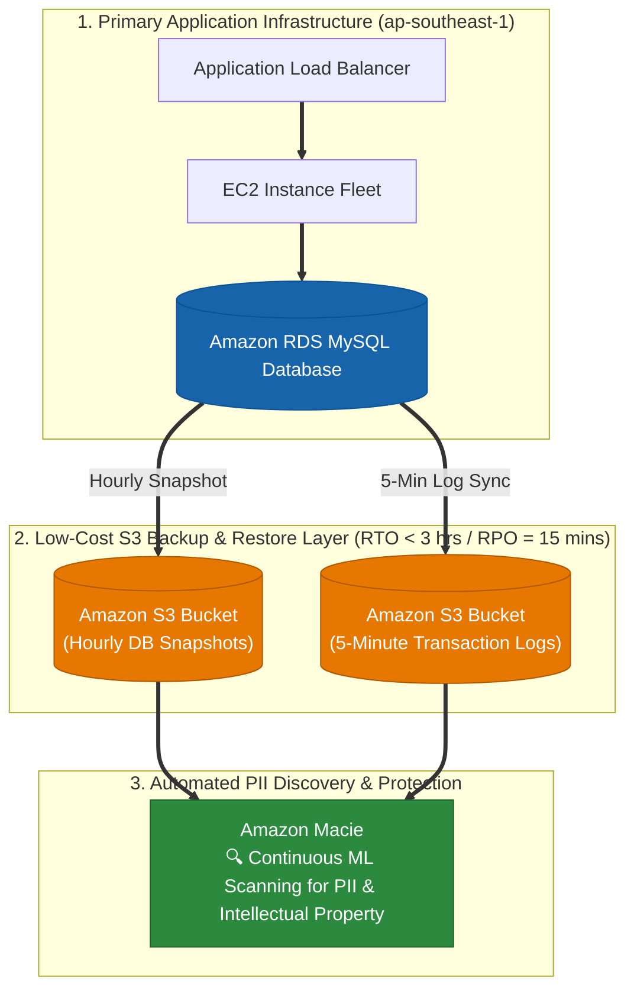

### Key Technical Rationale:
1. **S3 Transaction Log Sync for 15-Minute RPO**: Storing database transaction logs to S3 every 5 minutes allows Point-In-Time Recovery (PITR) up to the last 5-minute interval, easily satisfying the 15-minute RPO target at a fraction of Pilot Light costs.
2. **S3 Restoration Speed for < 3-Hour RTO**: Storing snapshots in S3 enables rapid retrieval and compute spin-up via CloudFormation/automation within 3 hours during a disaster.
3. **Amazon Macie for Automated PII Discovery**: Amazon Macie is a specialized security service using machine learning to discover, classify, and protect sensitive PII and intellectual property stored in S3 buckets.

### Why Distractor Options Fail:
- *Amazon Glacier backups for 3-hour RTO*: Standard retrievals from Glacier take 3 to 5 hours, violating the strict RTO target of < 3 hours. Expedited Glacier retrievals incur significant extra cost.
- *RDS Multi-AZ + AWS Shield for PII*: Multi-AZ RDS replication is synchronous within a single Region, NOT asynchronous, and cannot protect against regional outages or export standby instances across regions. Furthermore, **AWS Shield** is a DDoS protection service, NOT a PII data classification scanner!
- *AWS Storage Gateway + AWS Shield*: Storage Gateway connects on-premises environments to AWS; the application in this scenario is fully cloud-native in AWS, not hybrid on-premises. AWS Shield is for DDoS protection, not PII discovery.

---

### Scenario 5: Ultra-Tight RTO = 5 Minutes & Cross-Region 250 Miles DR (Warm Standby vs. Pilot Light Trap)

- **Scenario**: An e-commerce company runs a 3-tier web application (web, application, 128 GB DB tier). The disaster recovery plan requires a **Recovery Time Objective (RTO) of 5 minutes**, a **Recovery Point Objective (RPO) of 1 hour**, and the backup site must be at least **250 miles away** (Cross-Region DR). What is the **MOST cost-effective solution**?
- **Architecture Solution**:
  - Deploy a **Warm Standby** environment in the backup region.
  - Create a scaled-down fully functional environment in the DR region: **1 EC2 instance for the web tier** and **1 EC2 instance for the application tier**, each in their own Auto Scaling groups behind Application Load Balancers (ALBs).
  - Create a standby database instance replicating data continuously from the primary database.
  - In case of a disaster, scale out the Auto Scaling groups to meet production demand and update the Amazon Route 53 DNS records to point to the backup region ALBs.

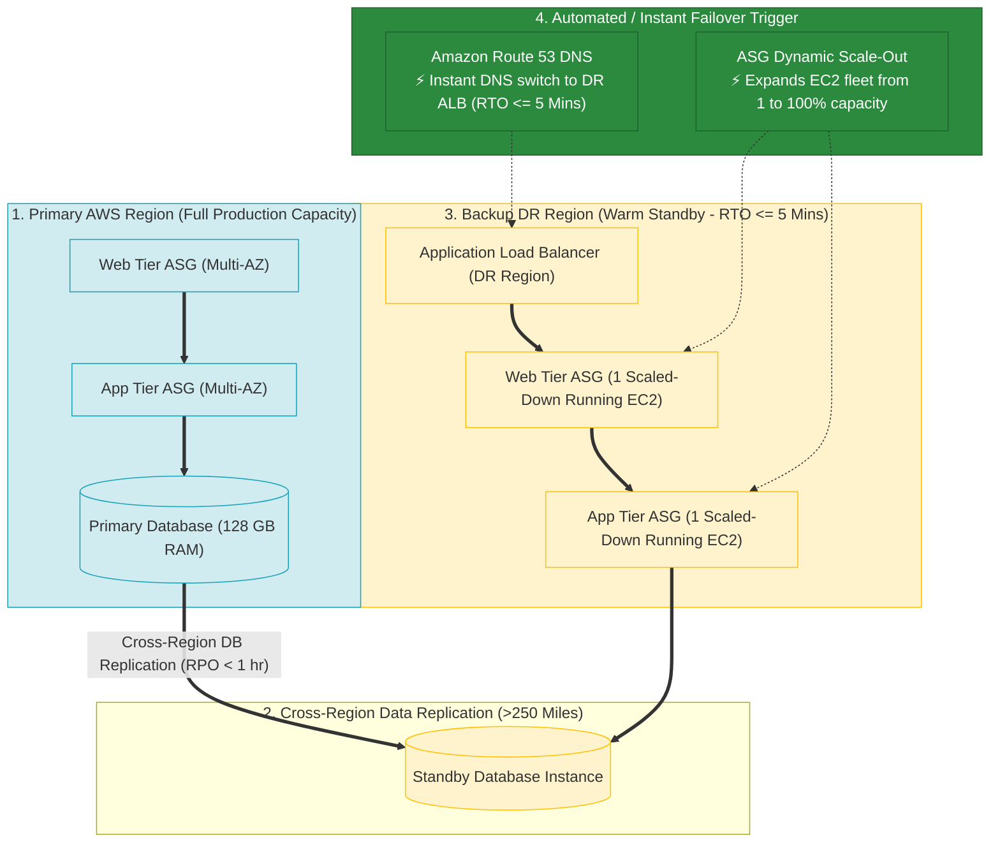

### Key Technical Rationale:
1. **RTO = 5 Minutes Demands Warm Standby**:
   - An RTO of 5 minutes is extremely aggressive.
   - In **Warm Standby**, 1 web server EC2 and 1 app server EC2 are **already running live behind ALBs** in the DR region. Traffic can be served immediately at reduced capacity while Auto Scaling groups expand instances to full capacity within minutes.
2. **Pilot Light vs. Warm Standby Threshold**:
   - **Pilot Light**: The web/app compute instances are turned OFF or completely un-provisioned. Provisioning ALBs, target groups, launching EC2 instances via CloudFormation, bootstrapping code, and passing health checks takes **10–15+ minutes**—failing the 5-minute RTO limit!
   - **Warm Standby**: Compute instances and ALBs are **already ON and running (scaled down)**—meeting the < 5-minute RTO target.
3. **Cost Optimization vs Multi-Site Active-Active**: Keeping a scaled-down Warm Standby (1 EC2 instance per tier) is dramatically cheaper than keeping 100% full production capacity running in a multi-region Active-Active deployment.

### Why Distractor Options Fail:
- *Pilot Light Strategy via CloudFormation (Your Selection)*:
  - Provisioning ALBs, launching EC2 instances via CloudFormation, and configuring load balancing during a disaster takes **10 to 15+ minutes**, missing the 5-minute RTO deadline.
- *Multi-Site Active-Active Strategy*:
  - Maintaining a 100% full capacity production environment in two regions 24/7 achieves near-zero RTO, but is extremely expensive and fails the minimum cost requirement.
- *Backup and Restore via S3 CRR*:
  - Restoring database backups and provisioning infrastructure from S3 snapshots takes hours to 24 hours, violating both RTO (5 min) and RPO (1 hr) targets.

---

### Scenario 6: Hybrid Storage Gateway Volume DR for Best RTO (Direct EBS Volume Restore vs. Storage Gateway Appliance & VTL Traps)

- **Scenario**: A company hosts a multi-tier Java CMS (JBoss application server + Oracle database). The Oracle database is regularly backed up to S3 using Oracle RMAN. Static content files are stored on a 512 GB Storage Gateway volume mounted to the on-premises application server via iSCSI (which backs up data asynchronously to S3 as volume snapshots). What AWS-based disaster recovery strategy will deliver the **BEST (fastest) RTO**?
- **Architecture Solution**:
  - Provision EC2 servers for both the JBoss application and Oracle database.
  - Restore the Oracle database backups directly from the Amazon S3 bucket.
  - Provision an **Amazon EBS volume** containing static content obtained directly from the **Storage Gateway volume snapshot**, and attach the EBS volume to the JBoss EC2 server.

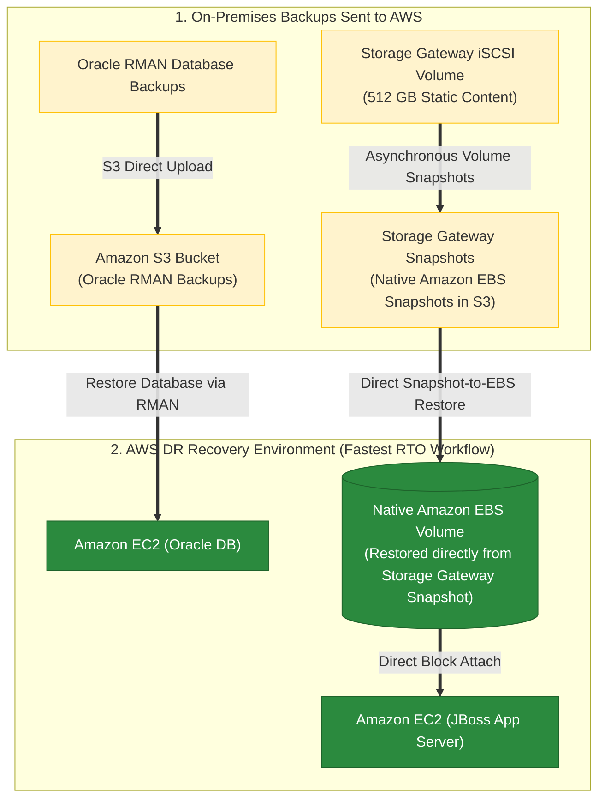

### Key Technical Rationale:
1. **Storage Gateway Volume Snapshots are Native EBS Snapshots**:
   - AWS Storage Gateway volume snapshots stored in S3 are stored as native **Amazon EBS Snapshots**.
   - During a disaster recovery event, restoring the snapshot directly into a native **Amazon EBS Volume** and attaching it to the JBoss EC2 instance provides the fastest RTO with zero appliance startup delays or iSCSI configuration steps.
2. **Oracle RMAN Restoration from S3**:
   - Oracle RMAN backups stored in Amazon S3 can be restored directly to an Oracle database running on an EC2 instance, providing rapid recovery.

### Why Distractor Options Fail:
- *Deploying Storage Gateway on EC2 as an iSCSI Volume*:
  - Deploying a Storage Gateway VM appliance instance on EC2 and attaching it via iSCSI introduces unnecessary boot delays, iSCSI initiator configuration overhead, and appliance management. Direct creation of a native **Amazon EBS Volume** from the snapshot is vastly faster and simpler.
- *Restoring RMAN Backups from Amazon Glacier*:
  - Amazon Glacier retrieval requires 3 to 5 hours (Standard) or 12 hours (Deep Archive), severely violating low RTO requirements. S3 Standard allows immediate retrieval.
- *Restoring Static Content from Storage Gateway VTL*:
  - Storage Gateway Virtual Tape Library (VTL) is designed for virtual tape backup archiving; it cannot be restored directly into high-performance block storage volumes for application web servers.

---

### Scenario 7: Passive Multi-Region Disaster Recovery Topology (ALB + ASG per Region & Route 53 Failover Routing Policy vs. Multi-Region ALB/ASG Traps)

- **Scenario**: A company located in `us-west-1` launches an online service. The application must be highly available and scale dynamically. The company requires a disaster recovery site in `us-east-1` that acts as a passive backup of the running application. How should the Solutions Architect implement this architecture?
- **Architecture Solution**:
  - In `us-west-1` (Primary): Create an **Application Load Balancer (ALB)** spanning multiple AZs and an **EC2 Auto Scaling Group** spanning multiple AZs behind the ALB.
  - In `us-east-1` (Secondary DR): Create the identical configuration (ALB + Auto Scaling Group spanning multiple AZs).
  - Configure **Amazon Route 53** record entries pointing to the ALBs with health checks enabled and a **Failover Routing Policy** (Primary = `us-west-1`, Secondary = `us-east-1`).

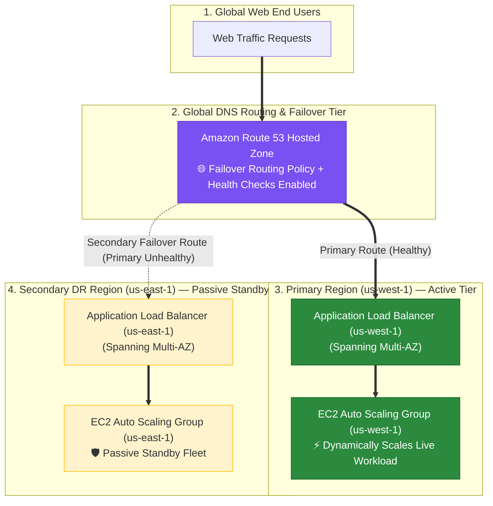

### Key Technical Rationale:
1. **Regional Boundary Rules for ALBs and Auto Scaling Groups**:
   - **ALB Scope**: An Application Load Balancer exists strictly within a single AWS Region and can span multiple Availability Zones (AZs) in that region. An ALB **CANNOT** span multiple AWS Regions even if Inter-Region VPC Peering is configured!
   - **Auto Scaling Group Scope**: An EC2 Auto Scaling Group deploys and manages instances within a single AWS Region across multiple AZs. An ASG **CANNOT** span multiple AWS Regions.
   - Therefore, a complete infrastructure stack (ALB + ASG) must be deployed independently in both the primary region (`us-west-1`) and secondary DR region (`us-east-1`).
2. **Amazon Route 53 Failover Routing Policy**:
   - Route 53's **Failover Routing Policy** is specifically designed for active-passive disaster recovery configurations. Route 53 monitors the health of the primary ALB in `us-west-1`. As long as `us-west-1` is healthy, 100% of DNS traffic is routed to `us-west-1`. If `us-west-1` fails health checks, Route 53 automatically fails over traffic to the passive standby ALB in `us-east-1`.

### Why Distractor Options Fail:
- *ALB or Auto Scaling Group Spanning Multiple Regions*:
  - It is technically impossible for an ALB or an EC2 Auto Scaling Group to span across multiple AWS Regions. Inter-Region VPC Peering connects VPC networks, but does not allow AWS resources like ALBs or ASGs to cross regional boundaries.
- *Separate Records Without Failover Routing Policy*:
  - Creating separate DNS records without specifying a Failover Routing Policy fails to configure active-passive disaster recovery. (Latency, Weighted, or Multivalue routing policies create active-active setups where both regions process live traffic simultaneously).

---

### Scenario 8: RDS Financial Database DR — RTO < 2 Hours & RPO = 10 Minutes (PITR Continuous Backups & S3 CRR vs. Glacier 3-Hour Retrieval & Multi-AZ Standby Traps — Select TWO)

- **Scenario**: An online stock trading application in `us-east-1` uses Amazon RDS for financial transactions. Compliance mandates that the disaster recovery strategy achieve an **RTO < 2 hours** and an **RPO = 10 minutes**. Which TWO Disaster Recovery strategies satisfy these compliance requirements?
- **Architecture Solutions (Select TWO)**:
  1. **Hourly DB Backups exported to S3 + Transaction Logs in S3 every 5 minutes + S3 Cross-Region Replication (CRR)**: Transaction logs captured every 5 minutes achieve **RPO = 5 minutes** (beating the 10-minute RPO target), while S3 CRR replicates backups to a secondary region for cross-region disaster resilience.
  2. **AWS Backup Plan for RDS with Continuous Backups & Point-in-Time Recovery (PITR) Enabled**: AWS Backup captures continuous transaction logs with 1-second precision, allowing point-in-time database restoration well within the 2-hour RTO.

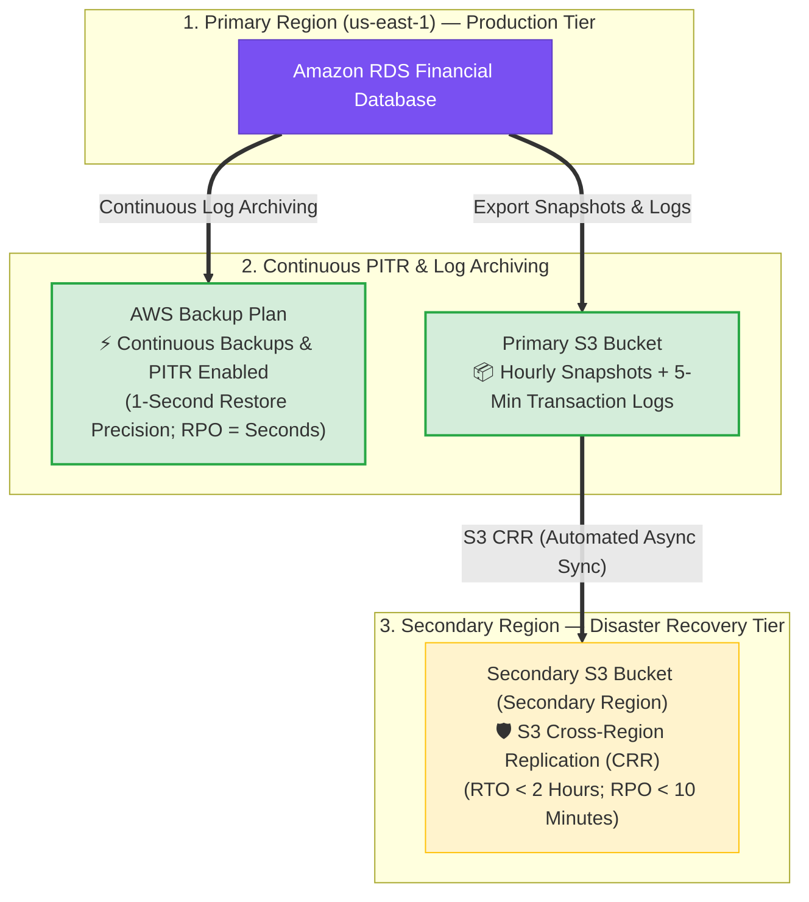

### Key Technical Rationale:
1. **Continuous Backups & PITR (AWS Backup & S3 Transaction Logs)**:
   - Amazon RDS transaction logs are archived every 5 minutes (or continuously via AWS Backup PITR). When restoring, RDS applies transaction logs onto the latest base backup to restore the database to any specified minute/second, meeting RPO < 10 mins and RTO < 2 hrs.
2. **S3 Cross-Region Replication (CRR)**:
   - Exporting database backups and transaction logs to an S3 bucket with **S3 CRR** enabled guarantees that full database state and point-in-time logs are replicated to a secondary region automatically for cross-region DR.

### Why Distractor Options Fail:
- *Storing 15-Minute DB Backups in S3 Glacier (Your Selection)*:
  - **S3 Glacier Flexible Retrieval** requires **3 to 5 hours** to initiate data retrieval! Restoring a database from Glacier backups guarantees an RTO violation (RTO > 3 hours, failing the 2-hour RTO mandate).
- *Storing Backups on EC2 Instance Store Volume*:
  - **Instance Store Volumes** are temporary and non-durable. Data stored on instance store volumes is permanently lost when an EC2 instance stops or terminates!
- *Configuring Synchronous Multi-AZ Replication Alone*:
  - Multi-AZ synchronous replication provides high availability for hardware/AZ failures, but is **NOT a backup strategy**. If data is corrupted, dropped, or maliciously deleted on the primary database, synchronous replication instantly mirrors the corruption to the standby replica! Standby replicas cannot restore data to a past point in time without snapshots and transaction logs.

---

### Scenario 9: Sub-Second RPO & Sub-5-Minute RTO Cross-Region Database DR (Aurora Global Database + Route 53 Failover vs. RDS MySQL Multi-AZ & Read Replica Traps)

- **Scenario**: A company runs a web service on EC2 instances in an Auto Scaling group behind an ALB in `us-east-1`, backed by a self-hosted MySQL DB on EC2. To prepare for disaster recovery, an ALB and ASG are being provisioned in `us-west-2`. The company requires a disaster recovery strategy with **RPO < 1 minute** and **RTO < 5 minutes** with **minimal operational overhead**. What step should be implemented next?
- **Architecture Solution**:
  - Migrate the database from EC2 to an **Amazon Aurora Global Database**, configuring `us-east-1` as the primary DB cluster and `us-west-2` as the secondary DB cluster.
  - Configure an **Amazon Route 53 DNS entry with health checks and a Failover Routing Policy** pointing to `us-west-2`.

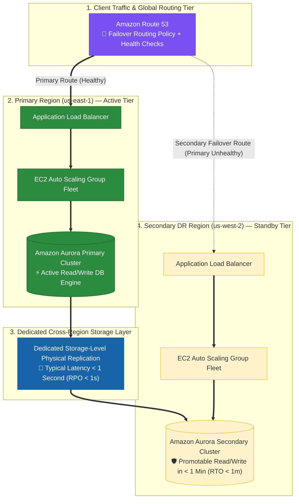

### Key Technical Rationale:
1. **Amazon Aurora Global Database for Sub-Second RPO & Sub-Minute RTO**:
   - Aurora Global Database uses dedicated physical storage-level replication across AWS regions, achieving cross-region replication latencies of **less than 1 second (RPO < 1s)** with zero impact on database performance.
   - If a regional disaster degrades `us-east-1`, the secondary cluster in `us-west-2` can be promoted to take full read/write responsibilities in **less than 1 minute (RTO < 1m)**.
2. **Route 53 Failover Routing Policy with Health Checks**:
   - Pairing Route 53 Failover Routing with health checks automatically detects primary region failures and updates DNS to route incoming client traffic to the secondary ALB in `us-west-2`.

### Why Distractor Options Fail:
- *Migrating MySQL to RDS MySQL with Multi-AZ Deployment enabled (Your Selection)*:
  - **Single-Region Scope Failure**: RDS Multi-AZ operates strictly within a single AWS Region (replicating synchronously between AZs in `us-east-1`). Enabling Multi-AZ on RDS MySQL in `us-east-1` provides **ZERO protection against a regional outage of `us-east-1`**! It does NOT replicate data to `us-west-2`, leaving no database in `us-west-2` when `us-east-1` fails.
- *Standard RDS MySQL Cross-Region Read Replica*:
  - Standard RDS MySQL cross-region read replicas rely on asynchronous MySQL binlog replication. Promoting an RDS MySQL read replica is a manual operation that reboots the database instance, risking SLA violations for strict 5-minute RTO / 1-minute RPO targets under heavy traffic. **Aurora Global Database** is purpose-built for sub-second RPO and sub-minute RTO cross-region failover.
- *Self-Hosted EC2 MySQL Master-Standby Replication via Snapshots*:
  - Restoring snapshots and manually setting up self-hosted EC2 MySQL replication introduces massive operational overhead and fails to utilize managed AWS services as required.

---

### Scenario 10: On-Premises Volume Gateway DR to EC2 via EBS Snapshots (EBS Snapshot -> EBS Volume -> EC2 Attachment vs. S3 Bucket, EFS & Storage Gateway VM Traps)

- **Scenario**: A company uses AWS Storage Gateway (stored volume) attached to an on-premises web app server via iSCSI to store 5TB of static content. As part of their disaster recovery plan, if the on-premises network fails, the web application must run on AWS EC2. What is the most suitable solution to restore access to the static content for the EC2 app server?
- **Architecture Solution**:
  - Generate an **Amazon EBS Snapshot** of the static content volume from the AWS Storage Gateway service.
  - Restore the snapshot to a new **Amazon EBS Volume**.
  - Attach the restored EBS volume to the target **Amazon EC2 instance** hosting the application server.

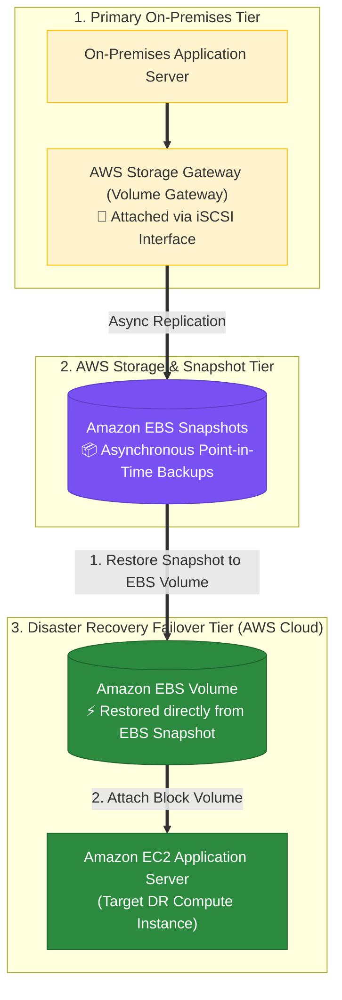

### Key Technical Rationale:
1. **Storage Gateway Volume Gateway Backup Mechanics**:
   - Data written to Storage Gateway Volume Gateways (stored or cached volumes) is asynchronously backed up to AWS as native **Amazon EBS Snapshots**.
2. **Restoring Block Storage to EC2 Instances**:
   - In a disaster recovery event, you can instantly restore an Amazon EBS volume directly from any Volume Gateway EBS snapshot and attach it as a block device to an Amazon EC2 application server instance.

### Why Distractor Options Fail:
- *Restoring Static Content to an S3 Bucket and Linking to EC2 (Your Selection)*:
  - **Storage Architecture Mismatch**: Storage Gateway Volume Gateways store backups as **EBS Snapshots**, NOT as raw browsable files/objects in S3! (Only Storage Gateway *File Gateway* presents S3 objects). You cannot "link" raw S3 buckets directly as native iSCSI/EBS block storage volumes to EC2 instances without performance-degrading third-party mounts.
- *Attaching Storage Gateway VM Appliance Directly to EC2*:
  - **Appliance Misunderstanding**: AWS Storage Gateway runs as a standalone virtual gateway appliance, NOT a block device that attaches directly inside an EC2 instance. Deploying an unnecessary Storage Gateway VM during DR adds overhead when a native EBS volume can be restored directly from the snapshot.
- *Creating an EFS File System from Storage Gateway*:
  - **Protocol Incompatibility**: Storage Gateway Volume Gateways produce block-level EBS snapshots, NOT POSIX Amazon EFS file systems.

---


### Common Exam Traps (Continued)

6. **Trap 6: Conflating AWS Shield with Amazon Macie for PII Discovery**: **AWS Shield** protects against DDoS network/application attacks. To continuously discover, classify, and protect personally identifiable information (PII) or intellectual property in data stores (S3), always select **Amazon Macie**.
7. **Trap 7: Selecting Pilot Light for RTO <= 5 Minutes**: Pilot Light requires spinning up EC2 servers and ALBs via CloudFormation during failover, which takes 10–15+ minutes. For RTO <= 5 minutes with minimum cost, always choose **Warm Standby** (1 running EC2 per tier behind ALBs).
8. **Trap 8: Deploying Storage Gateway Appliances on EC2 for DR Volume Restores**: AWS Storage Gateway volume snapshots in S3 are native **Amazon EBS Snapshots**. To achieve the fastest RTO during a disaster recovery event, create a native **Amazon EBS Volume** directly from the Storage Gateway snapshot and attach it to the target EC2 instance, rather than deploying an unnecessary Storage Gateway VM appliance on EC2.
9. **Trap 9: Assuming Application Load Balancers (ALBs) or Auto Scaling Groups (ASGs) Can Span Multiple Regions**: ALBs and ASGs exist strictly within a single AWS Region (spanning multiple AZs). They **CANNOT span across multiple regions** even with Inter-Region VPC Peering! For multi-region passive disaster recovery, deploy independent ALB + ASG stacks in both primary and secondary regions, and configure **Amazon Route 53** with a **Failover Routing Policy** and health checks.
10. **Trap 10: Using S3 Glacier Storage for Low RTO Target (< 2 Hours) or Multi-AZ Standby as a Backup**: **S3 Glacier Flexible Retrieval** requires 3 to 5 hours to retrieve archives (violating RTO < 2 hours). Furthermore, **RDS Multi-AZ synchronous replication** is an HA failover mechanism, NOT a backup strategy (data corruption on primary is instantly mirrored to standby!). To achieve RTO < 2 hrs and RPO < 10 mins, use **AWS Backup Continuous Backups / Point-in-Time Recovery (PITR)** and export hourly DB snapshots + 5-min transaction logs to S3 with **Cross-Region Replication (CRR)**.
11. **Trap 11: Assuming RDS Multi-AZ Provides Cross-Region Disaster Recovery**: **RDS Multi-AZ operates strictly within a single AWS Region** (synchronous replication across Availability Zones in the primary region). RDS Multi-AZ provides zero protection against a regional outage! To achieve cross-region disaster recovery with **RPO < 1 minute** and **RTO < 5 minutes** (or < 1 minute failover), migrate to **Amazon Aurora Global Database** (sub-second physical storage replication to a secondary region) and pair with **Route 53 Failover Routing**.

---


## 9. Key Summary & Mental Model

```
Business Impact
   └── RTO / RPO Targets
         └── DR Strategy Choice:
               ├── Hours RTO / Hours RPO        ──► Backup & Restore (S3 + TxLogs)
               ├── Physical/VM Lift-and-Shift   ──► AWS DRS
               ├── Storage Gateway Snapshot DR  ──► Restore Directly to Amazon EBS Volume (Fastest RTO)
               ├── Tens of Mins RTO / Low RPO   ──► Pilot Light (Scale from 0)
               ├── Minutes RTO / Low RPO        ──► Warm Standby (Scale from 10%)
               └── Near-Zero RTO / Zero RPO     ──► Multi-Site Active/Active
```