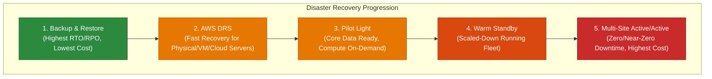
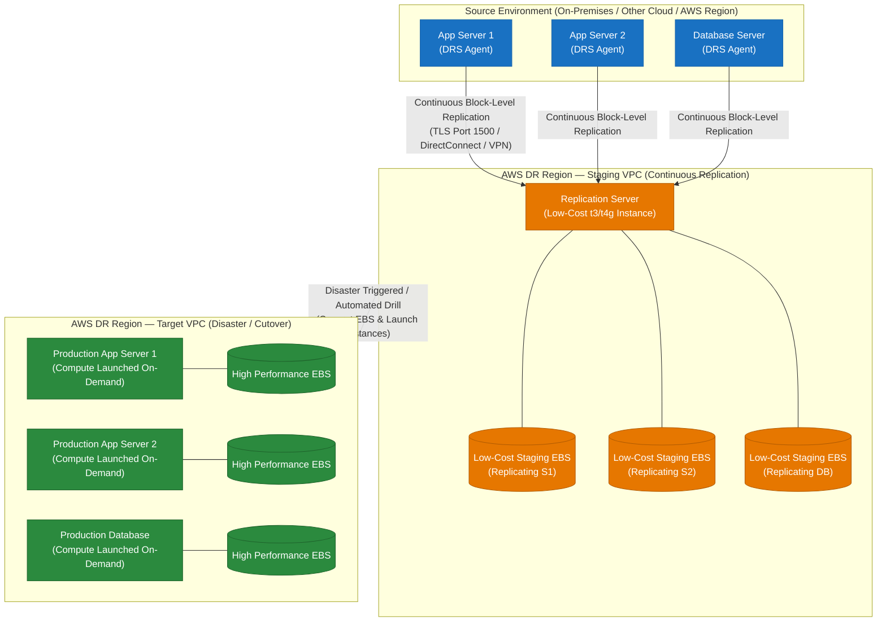
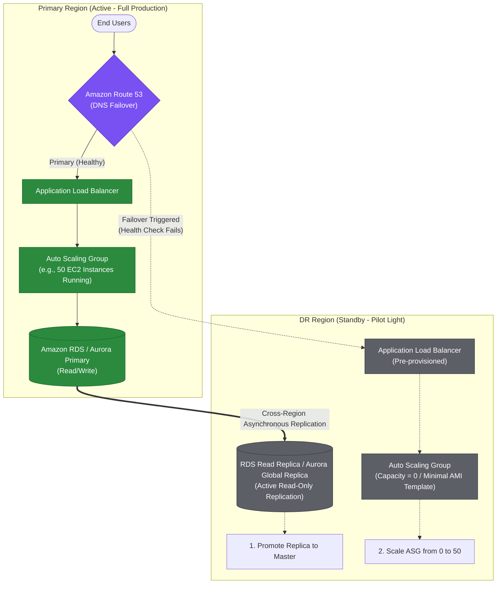
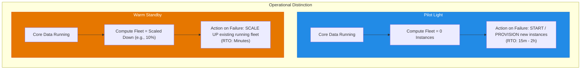
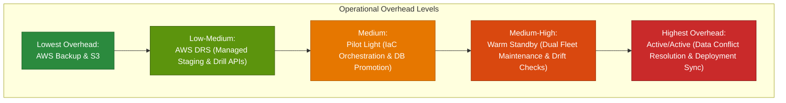
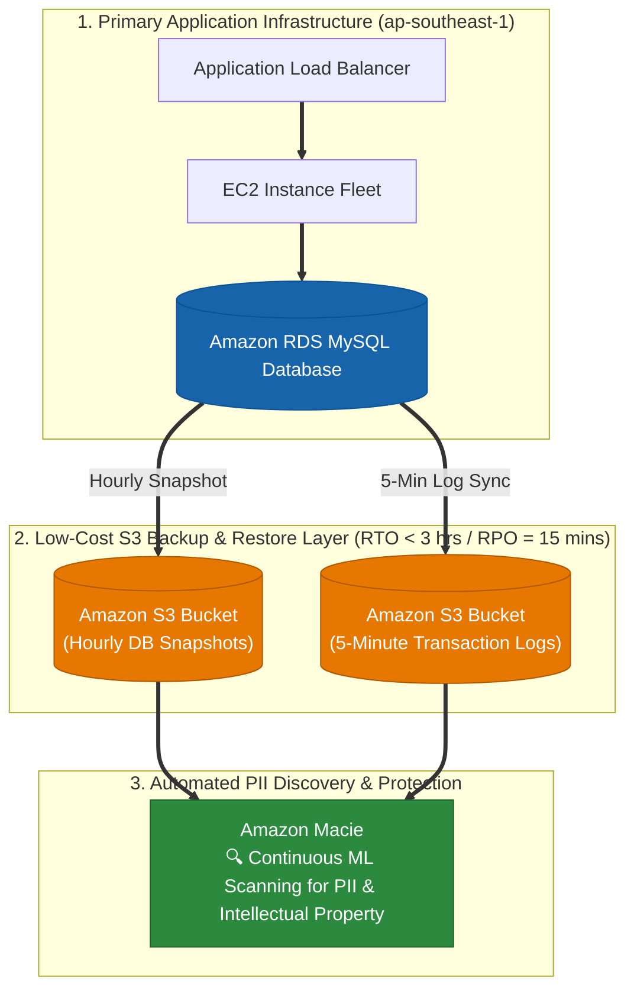

# 1.3 Disaster Recovery Strategies in AWS

> **Domain Focus**: AWS Certified Solutions Architect – Professional (SAP-C02) & AWS Certified AI Practitioner / Cloud Architecture  
> **Core Principle**: Disaster recovery (DR) is driven strictly by **Business Requirements** $\rightarrow$ **RTO / RPO** $\rightarrow$ **DR Strategy** $\rightarrow$ **AWS Services** $\rightarrow$ **Cost & Operational Overhead**.

---

## 1. The Disaster Recovery (DR) Spectrum

Disaster recovery strategies represent a direct trade-off between **recovery speed** (low RTO/RPO) and **cost & complexity**. As recovery time and data loss targets approach zero, infrastructure cost and operational overhead increase exponentially.



### Comprehensive Comparison Matrix

| DR Strategy | DR Environment State | RTO (Recovery Time) | RPO (Recovery Point) | Cost Multiplier | Operational Overhead | Failover Mechanism |
| :--- | :--- | :--- | :--- | :---: | :---: | :--- |
| **Backup & Restore** | No compute or standby resources running. Backups in S3 / AWS Backup. | **Hours to Days** | **Hours to Days** | `$` (Lowest) | Low (Ongoing) / High (During Disaster) | Manual redeployment via IaC (CloudFormation/Terraform) & snapshot restore. |
| **AWS Elastic Disaster Recovery (DRS)** | Low-cost staging area with continuous block-level data replication. | **Minutes to Hours** | **Seconds to Sub-Minute** | `$$` (Low–Med) | Low to Medium | Automated server launch into Target VPC via DRS console / API. |
| **Pilot Light** | Critical core running (live replicated DB + core network), compute stopped/template only. | **Tens of Minutes to Hours** | **Seconds to Minutes** | `$$` (Medium) | Medium | Promote DB read replica, provision compute fleet via Auto Scaling/IaC, update DNS. |
| **Warm Standby** | Fully functional application running at reduced capacity (e.g., 20% compute fleet). | **Minutes** | **Seconds to Sub-Minute** | `$$$` (High) | Medium to High | Auto Scaling scales compute to 100%, Route 53 health check switches active traffic. |
| **Multi-Site (Active/Active)** | Full production fleets running concurrently in two or more Regions. | **Near-Zero (Seconds)** | **Near-Zero (Real-time)** | `$$$$` (Highest) | Highest | Global traffic routing (Route 53 / Global Accelerator), multi-region active databases. |

> [!IMPORTANT]
> **Key Exam Rule**: Lower RTO + Lower RPO = Exponentially higher infrastructure and operational cost. Never select an Active/Active or Warm Standby architecture if business requirements allow hours of downtime and cost minimization is requested.

---

## 2. AWS Elastic Disaster Recovery (AWS DRS)

### Why It Exists & The Problem It Solves
AWS Elastic Disaster Recovery (**AWS DRS**) is the recommended AWS service for lift-and-shift DR. It simplifies disaster recovery for physical servers, VMware vSphere, Microsoft Hyper-V, and cloud-based instances into AWS without needing to redesign applications or maintain idle compute instances.

> **Core Formula**: Source Server $\rightarrow$ Continuous Replication (Agent) $\rightarrow$ AWS Staging Area $\rightarrow$ Non-disruptive DR Drills / Automated Cutover



### Key Technical Characteristics of AWS DRS
- **Staging Area Architecture**: Uses low-cost lightweight replication instances (`t3.small` / `t4g.small`) and cost-effective EBS volumes (e.g., `sc1` / `st1` / `gp3`) to continuously capture OS-level block changes.
- **Point-in-Time Recovery (PITR)**: Provides crash-consistent and application-consistent recovery points using snapshot granularity. Ideal for recovering from ransomware or accidental data corruption.
- **Non-Disruptive Testing**: Perform DR drills anytime without impacting primary workloads or interrupting ongoing replication.
- **Launch Templates**: Define target instance types, subnets, security groups, IAM roles, and post-launch scripts in advance.

> [!TIP]
> **Exam Clue**: When a question states: *"Hundreds of on-premises VMware/physical servers must have DR into AWS with minimal architectural redesign, RPO in seconds, and lowest idle compute cost"*, the answer is **AWS Elastic Disaster Recovery (DRS)**.

---

## 3. Pilot Light

### Core Concept: "Keep the Critical Core Running"
In a **Pilot Light** strategy, the core data storage and critical foundations are continuously live and replicating in the DR Region. However, compute layers (web/app servers) and supporting services are **not running** during normal operations. They are provisioned only during failover via Automation (IaC, AMIs, Auto Scaling).



### Failover Workflow (Sequence of Events)
1. **Detection**: Route 53 health check detects primary region outage.
2. **Database Promotion**: Promote cross-region RDS read replica or Aurora Global Database secondary region to primary read/write.
3. **Compute Scaling**: Update Auto Scaling Group desired capacity from `0` to target capacity, or trigger CloudFormation / Terraform to launch EC2 / ECS / EKS fleets.
4. **Traffic Redirection**: Route 53 DNS records switch user traffic to the newly scaled DR endpoint.

---

## 4. Warm Standby

### Core Concept: "A Scaled-Down Functional Fleet Ready to Scale"
In a **Warm Standby** strategy, a fully functional but **scaled-down** replica of the entire production stack runs 24/7 in the DR Region. It is already handling end-to-end processing (or idle test traffic) and can handle full production loads immediately upon scaling up.


### Pilot Light vs. Warm Standby: The Critical Difference



> [!TIP]
> **Memory Anchor**:
> - **Pilot Light**: *"Start what is not running."*
> - **Warm Standby**: *"Scale what is already running."*

---

## 5. Multi-Site (Active/Active)

### Core Concept: "Zero-Downtime Multi-Region Active Ingestion"
In a **Multi-Site Active/Active** architecture, multiple complete production environments run concurrently across two or more AWS Regions. Both regions actively serve user traffic simultaneously. If one Region experiences an outage, global traffic routing automatically sheds traffic away from the impaired Region with near-zero RTO.


### Data Layer Strategies for Active/Active
1. **DynamoDB Global Tables**: Multi-region, multi-active database with automatic two-way replication. Built-in conflict resolution (last-write-wins).
2. **Amazon Aurora Global Database**: Single primary writer in one region, up to 5 read-only secondary regions with $< 1$ second cross-region replication lag. (Write traffic forwarded or routed to primary).
3. **Amazon S3 Cross-Region Replication (CRR) / Multi-Region Access Points (MRAP)**: Bidirectional active-active object storage with accelerated failover routing.

> [!WARNING]
> **Active/Active Challenges**: Multi-site is the most expensive and architecturally complex strategy. Data consistency (read-after-write, write-conflict resolution, distributed locks) must be solved at the application layer.

---

## 6. DR Architecture Decision Tree (Exam Decision Flowchart)

Use this step-by-step decision hierarchy when addressing scenario-based questions:


---

## 7. Operational Overhead & Supporting AWS Services

### Operational Complexity Spectrum

$$\text{Backup \& Restore} \longrightarrow \text{AWS DRS} \longrightarrow \text{Pilot Light} \longrightarrow \text{Warm Standby} \longrightarrow \text{Multi-Site Active/Active}$$



### Supporting AWS Services by Functional Category

| Category | Primary Services | Role in DR Architecture |
| :--- | :--- | :--- |
| **Global Traffic & DNS** | **Amazon Route 53**<br>**AWS Global Accelerator**<br>**Amazon CloudFront** | DNS failover with health checks, Anycast IP fast routing (<30s failover), edge caching and origin failover groups. |
| **Compute & Orchestration** | **EC2 Auto Scaling**<br>**Amazon ECS / EKS**<br>**AWS Lambda** | Dynamic scale-out from 0 to N instances, container orchestration across regions, automated failover runbooks. |
| **Database Tier** | **Aurora Global Database**<br>**DynamoDB Global Tables**<br>**RDS Cross-Region Replicas** | Fast cross-region replication (<1s), active-active multi-region writes, managed promotion during disaster. |
| **Storage & Backup** | **AWS Backup**<br>**Amazon S3 CRR**<br>**EBS Snapshot Copy** | Centralized cross-region backup policies, cross-region asynchronous object replication, encrypted snapshot copies. |
| **Infrastructure as Code** | **AWS CloudFormation**<br>**AWS CDK**<br>**Terraform** | Deterministic, rapid environment reproduction in DR region to eliminate manual configuration drift. |
| **Disaster Recovery** | **AWS Elastic Disaster Recovery** | Continuous block-level replication and non-disruptive automated drill orchestration for servers. |

---

## 8. Professional Scenario Walkthroughs & Exam Traps

### Scenario 1: Financial Core Banking
- **Question Statement**: An enterprise financial app processes mission-critical transactions. The organization mandates an **RTO $\le$ 10 minutes** and **RPO $\le$ 1 minute**. Infrastructure costs should be strictly minimized without violating recovery objectives.
- **Analysis**:
  - *Backup & Restore*: ❌ RTO is hours (too slow).
  - *Pilot Light*: ⚠️ Starting compute from scratch takes 15–20 minutes, breaching the 10-minute RTO.
  - *Active/Active*: ❌ Fulfills RTO/RPO but incurs 2x full production cost (fails cost optimization).
  - *Warm Standby*: ✅ **Correct**. Running a 10% compute fleet meets the 10-minute RTO via fast Auto Scaling while maintaining low RPO through database replication at reasonable cost.

### Scenario 2: Legacy Virtualized Workloads
- **Question Statement**: An enterprise must establish DR in AWS for 300 on-premises VMware virtual machines running legacy ERP apps. The team has minimal cloud engineering capacity and cannot refactor application architectures.
- **Analysis**:
  - *Answer*: **AWS Elastic Disaster Recovery (AWS DRS)**. Agent-based block-level replication into a staging VPC eliminates application redesign and minimizes operational overhead.

### Common Exam Traps

> [!CAUTION]
> 1. **Multi-AZ $\ne$ Regional Disaster Recovery**: Multi-AZ protects against local data center / Availability Zone failures. It does **not** protect against AWS Regional outages or control plane failures. Regional DR requires cross-region architectures.
> 2. **Backups Do Not Improve RTO**: Increasing snapshot frequency reduces data loss (**RPO**), but has zero effect on the time required to re-provision servers and restore disks (**RTO**).
> 3. **Route 53 Does Not Recover Applications**: Route 53 health checks and DNS failover only redirect network traffic to healthy endpoints; they do not promote databases or start failed compute instances.
> 4. **Don't Over-Engineer**: Always pick the most cost-effective strategy that meets the business RTO/RPO targets. Choosing Active/Active when Warm Standby or Pilot Light satisfies the SLA is considered an incorrect answer on the AWS SAP exam.
> 5. **Database Paradigm Match (NoSQL vs. Relational SQL)**: Never choose **Amazon Aurora Global Database** when the application architecture explicitly requires a **NoSQL database**. Choose **Amazon DynamoDB Global Tables** for NoSQL cross-region multi-master replication.

---

### Scenario 3: Multi-Region DR for NoSQL Logistics Web App (`us-east-1` ➔ `us-west-1`)

- **Scenario**: A logistics company hosts a global web application in `us-east-1` using EC2 instances for web/app tiers, S3 for static assets, and a **NoSQL database**. The company requires a DR site in `us-west-1` with identical data replication, ultra-fast automated failover, and automatic failback when `us-east-1` recovers.
- **Architecture Solution**:

```mermaid
flowchart TD
    subgraph PrimaryRegion["Primary AWS Region (us-east-1)"]
        ASG1["EC2 Auto Scaling Group<br/>(Web & App Tier)"]
        S3_1["Amazon S3 Bucket<br/>(Static Assets)"]
        DDB1[("Amazon DynamoDB Table<br/>(NoSQL Primary)")]
    end

    subgraph DRRegion["Secondary DR Region (us-west-1)"]
        ASG2["EC2 Auto Scaling Group<br/>(Deployed via CFN StackSets)"]
        S3_2["Amazon S3 Replica Bucket"]
        DDB2[("Amazon DynamoDB Table<br/>(NoSQL Secondary)")]
    end

    subgraph GlobalServices["Global Routing & Management Layer"]
        CFN["AWS CloudFormation StackSets<br/>(Provisions ASG templates across both Regions)"]
        S3CRR["S3 Cross-Region Replication (CRR)<br/>(Asynchronous static asset sync)"]
        DDBGlobal["Amazon DynamoDB Global Tables<br/>(Multi-Region Active-Active NoSQL sync)"]
        R53["Amazon Route 53 Failover Routing Policy<br/>• Health Check Primary us-east-1<br/>• Auto Failover to us-west-1 & Auto Failback"]
    end

    CFN ==> ASG1 & ASG2
    S3_1 ==>|"S3 CRR"| S3_2
    DDB1 <==>|"DynamoDB Global Tables"==> DDB2
    R53 ==>|"Active Traffic"| ASG1
    R53 -.->|"Failover Traffic"| ASG2

    classDef primary fill:#d1ecf1,stroke:#17a2b8,stroke-width:1px;
    classDef dr fill:#fff3cd,stroke:#ffc107,stroke-width:1px;
    classDef global fill:#d4edda,stroke:#28a745,stroke-width:2px;

    class PrimaryRegion,ASG1,S3_1,DDB1 primary;
    class DRRegion,ASG2,S3_2,DDB2 dr;
    class GlobalServices,CFN,S3CRR,DDBGlobal,R53 global;
```

### Key Architectural Rationale:
1. **Database Tier — DynamoDB Global Tables**: Fulfills the **NoSQL database requirement** with fully managed, multi-region active-active write replication. Eliminates custom replication code and delivers sub-second data synchronization between `us-east-1` and `us-west-1`.
2. **Infrastructure Provisioning — AWS CloudFormation StackSets**: Automatically deploys and maintains identical Auto Scaling Group configurations across multiple AWS regions from a single CloudFormation template.
3. **Automated Traffic Routing — Route 53 Failover Routing Policy**: Continuously monitors the primary region (`us-east-1`) via Route 53 Health Checks. Automatically routes user traffic to `us-west-1` during an outage and **automatically fails back** to `us-east-1` when health checks pass again.
4. **Static Content Storage — Amazon S3 Cross-Region Replication (CRR)**: Asynchronously replicates static web assets uploaded to the `us-east-1` S3 bucket into the `us-west-1` DR bucket.

### Why Distractor Options Fail:
- *Amazon Aurora Global Database*: Aurora is designed for **relational SQL databases** (MySQL/PostgreSQL), failing the explicit requirement for a **NoSQL database**.
- *Amazon RDS for MySQL + Manual Route 53 DNS Updates*: Relational MySQL fails the NoSQL requirement, and manually updating DNS records violates the requirement for **automated fast failover and failback**.
- *DynamoDB with S3 Backup/Restore*: Performing periodic S3 backups of DynamoDB tables introduces long recovery delays (RTO/RPO) and fails to support real-time replication or automated failback.

---

### Scenario 4: Low-Cost Backup and Restore with Amazon S3 Transaction Logs & Amazon Macie PII Discovery

- **Scenario**: An online delivery system running on EC2 instances behind an ALB in `ap-southeast-1` uses Amazon RDS MySQL. The company needs a disaster recovery strategy targeting **RTO < 3 hours** and **RPO = 15 minutes**. A Pilot Light environment was rejected as exceeding the budget. The company also requires automated discovery, classification, and protection of personally identifiable information (PII) or intellectual property data stores. What is the most cost-effective solution?
- **Architecture Solution**:
  1. Schedule a database backup to an **Amazon S3 bucket every hour** and store transaction logs to a **separate S3 bucket every 5 minutes**.
  2. Use **Amazon Macie** to automatically discover, classify, and protect sensitive data (PII and intellectual property).



### Key Technical Rationale:
1. **S3 Transaction Log Sync for 15-Minute RPO**: Storing database transaction logs to S3 every 5 minutes allows Point-In-Time Recovery (PITR) up to the last 5-minute interval, easily satisfying the 15-minute RPO target at a fraction of Pilot Light costs.
2. **S3 Restoration Speed for < 3-Hour RTO**: Storing snapshots in S3 enables rapid retrieval and compute spin-up via CloudFormation/automation within 3 hours during a disaster.
3. **Amazon Macie for Automated PII Discovery**: Amazon Macie is a specialized security service using machine learning to discover, classify, and protect sensitive PII and intellectual property stored in S3 buckets.

### Why Distractor Options Fail:
- *Amazon Glacier backups for 3-hour RTO*: Standard retrievals from Glacier take 3 to 5 hours, violating the strict RTO target of < 3 hours. Expedited Glacier retrievals incur significant extra cost.
- *RDS Multi-AZ + AWS Shield for PII*: Multi-AZ RDS replication is synchronous within a single Region, NOT asynchronous, and cannot protect against regional outages or export standby instances across regions. Furthermore, **AWS Shield** is a DDoS protection service, NOT a PII data classification scanner!
- *AWS Storage Gateway + AWS Shield*: Storage Gateway connects on-premises environments to AWS; the application in this scenario is fully cloud-native in AWS, not hybrid on-premises. AWS Shield is for DDoS protection, not PII discovery.

---

### Common Exam Traps (Continued)

6. **Trap 6: Conflating AWS Shield with Amazon Macie for PII Discovery**: **AWS Shield** protects against DDoS network/application attacks. To continuously discover, classify, and protect personally identifiable information (PII) or intellectual property in data stores (S3), always select **Amazon Macie**.

---

## 9. Key Summary & Mental Model

```
Business Impact
   └── RTO / RPO Targets
         └── DR Strategy Choice:
               ├── Hours RTO / Hours RPO        ──► Backup & Restore (S3 + TxLogs)
               ├── Physical/VM Lift-and-Shift   ──► AWS DRS
               ├── Tens of Mins RTO / Low RPO   ──► Pilot Light (Scale from 0)
               ├── Minutes RTO / Low RPO        ──► Warm Standby (Scale from 10%)
               └── Near-Zero RTO / Zero RPO     ──► Multi-Site Active/Active
```