# 1.4 AWS Organizations and AWS Control Tower

> **Domain Focus**: AWS Certified Solutions Architect – Professional (SAP-C02) & Multi-Account Enterprise Governance  
> **Core Principle**: Multi-account architecture is the foundation of modern cloud security and governance.
> $$\text{AWS Account} = \text{Security, Blast Radius, Quota \& Administrative Boundary}$$
> **AWS Organizations** provides the foundational account hierarchy and policy guardrails, while **AWS Control Tower** provides an automated, opinionated Landing Zone with centralized governance, logging, and account vending.

---

## 1. Why Multi-Account Architecture Is Mandatory at Enterprise Scale

Operating an enterprise inside a single AWS account creates severe security, billing, and operational bottlenecks:

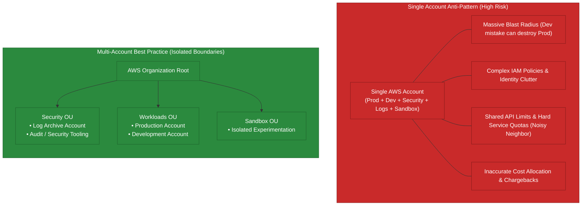

### Multi-Account Benefits
- **Strict Blast Radius Isolation**: A security breach or administrative mistake in a dev/sandbox account cannot impact production resources.
- **Independent Service Quotas**: Prevents dev workloads from starving production workloads of API limits or resource quotas (e.g., EC2 vCPU limits, NAT Gateways).
- **Simplified Security & Compliance**: Audits can be restricted to specific production accounts without exposing internal development accounts.
- **Granular Cost Tracking**: Accurate chargeback and showback reporting using consolidated billing without complex tag-only allocations.

---

## 2. AWS Organizations: The Multi-Account Foundation

AWS Organizations centrally manages account creation, organizational hierarchies, consolidated billing, and policy-based governance.

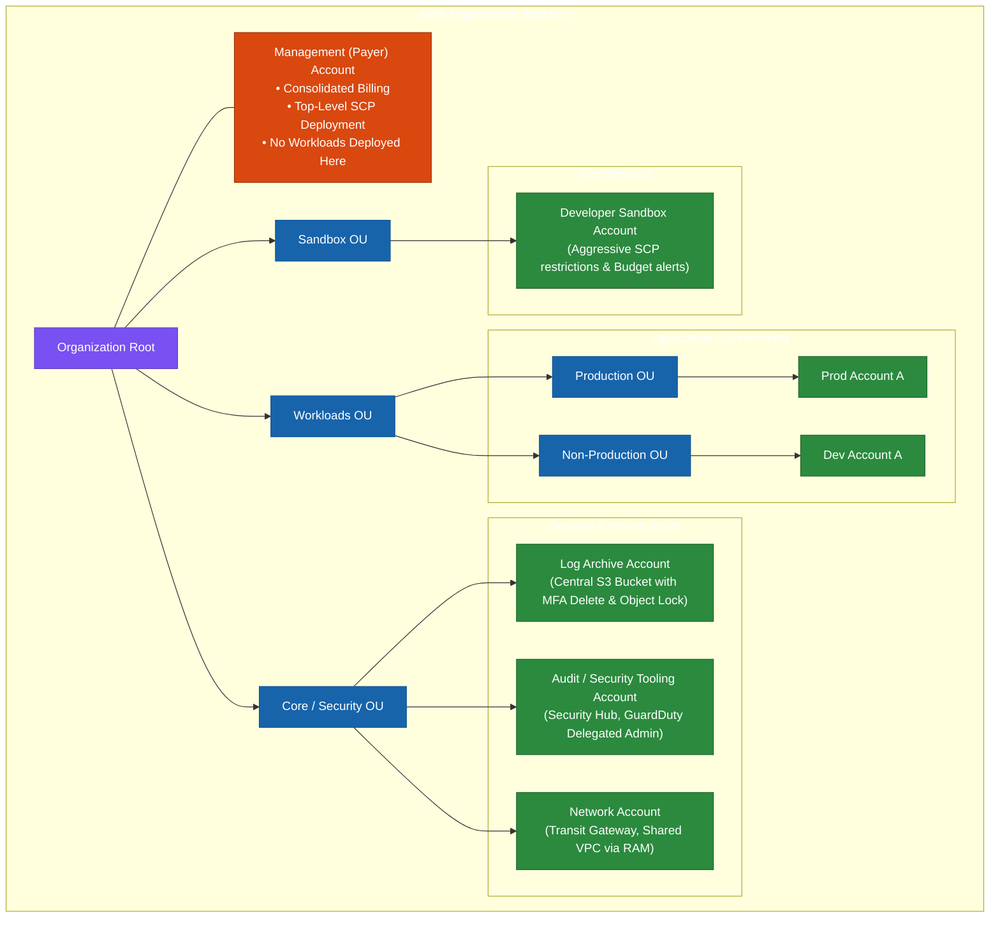

### Key Components of AWS Organizations
1. **Management Account (formerly Master Account)**: Owns consolidated billing, deploys organization-wide policies, and delegates administration. **Best Practice**: Run zero application workloads here.
2. **Organizational Units (OUs)**: Hierarchical containers used to group accounts and apply policies uniformly. OUs can be nested up to 5 levels deep.
3. **Delegated Administrator**: Allows designated member accounts (e.g., Security/Audit account) to manage specific AWS services (e.g., AWS Security Hub, Amazon GuardDuty, AWS IAM Identity Center, AWS Backup) without requiring root management account access.
4. **Service Control Policies (SCPs)**: Central policy guardrails applied at Root, OU, or Account level.

---

## 3.1 Critical SCP Exemption Rules & Evaluation Flow

> [!IMPORTANT]
> **What SCPs Do NOT Affect (Exam Rules)**:
> 1. **Service-Linked Roles (SLRs)**: **SCPs DO NOT affect any Service-Linked Role**. Service-linked roles are pre-defined IAM roles managed by AWS services (e.g. Amazon ECS, Auto Scaling, Elastic Load Balancing) to perform actions on your behalf across accounts. Service-linked roles **cannot be restricted by SCPs**.
> 2. **Management Account**: SCPs have zero effect on users or roles inside the **Management (Payer) Account**.
> 3. **Resource-Based Policies Outside the Org**: SCPs affect only principals within accounts that are part of the AWS Organization.
> 4. **Service Principal Calls**: Actions performed by certain AWS service principals directly (e.g. AWS STS credentials for service integrations) bypass SCP filtering.

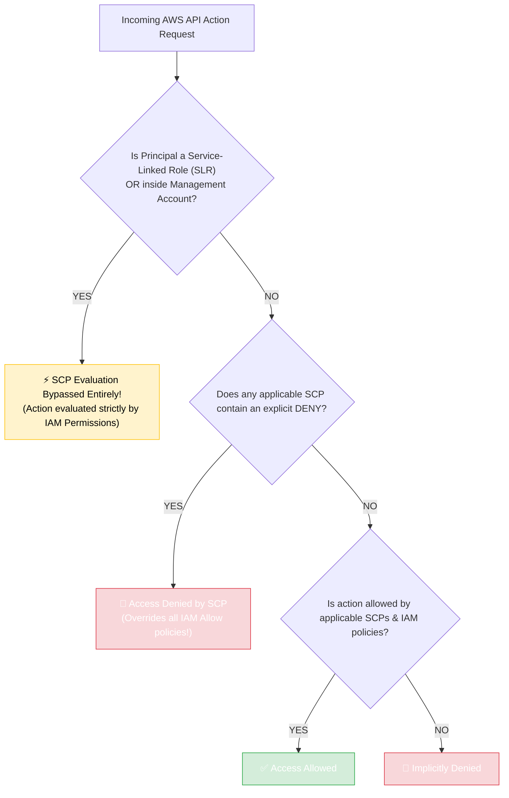

---

## 3.2 Service Control Policies (SCPs): Guardians of Maximum Permissions

### How SCPs Function
- **SCPs are guardrails, NOT permission grantors**: An SCP defines the **maximum allowable permissions** for accounts or OUs. It does **not** grant any permissions by itself; IAM policies inside the member account must still explicitly grant access.
- **Explicit DENY Overrides Everything**: If an SCP explicitly denies an action, no IAM entity (including the account `root` user) in that account can perform the action (except Service-Linked Roles).
- **Inheritance**: Policies applied at the Root apply to all OUs and accounts. Child OUs inherit all policies attached to parent OUs.

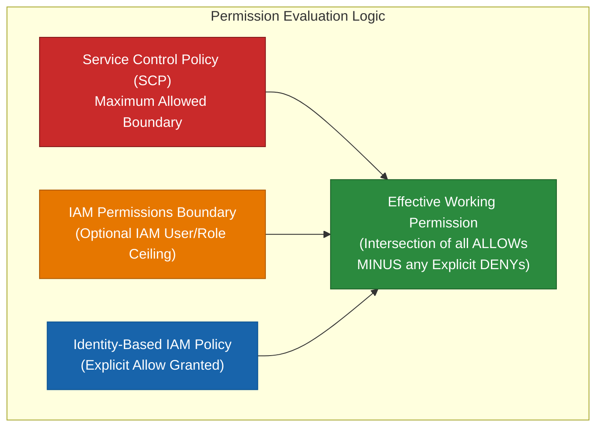

### Essential Enterprise SCP Patterns for the Exam

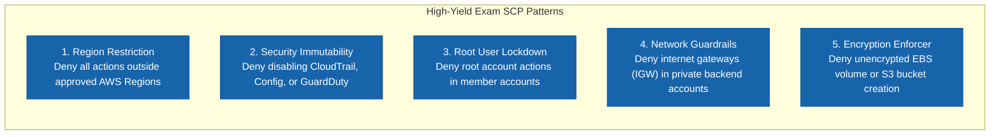

### SCP Inheritance Rules & The Root SCP Anti-Pattern

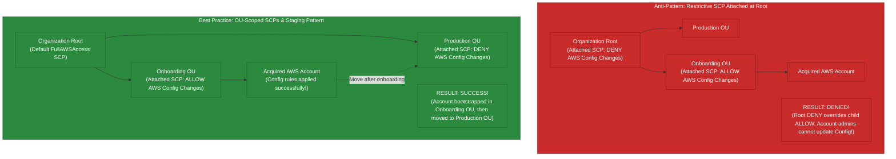

> [!IMPORTANT]
> **Key SCP Inheritance Principles**:
> 1. **Inherited DENY Cannot Be Overridden**: If an explicit `DENY` (or restricted service boundary) exists at the Organization Root or a parent OU, no child OU or account policy can override it with an `ALLOW`.
> 2. **Avoid Attaching Restrictive SCPs to Root**: AWS strongly recommends **never** attaching restrictive SCPs directly to the Organization Root. Instead, attach restrictive SCPs to specific workload OUs (e.g., `Production OU`).
> 3. **Staging / Onboarding OU Pattern**: Use a temporary staging OU with permissive or customized SCPs for account onboarding and bootstrapping (e.g., deploying required AWS Config rules or Security Hub agents) before moving the account into production OUs.

---

## 4. AWS Control Tower: The Managed Landing Zone Framework

### Organizations vs. Control Tower: Understanding the Difference
- **AWS Organizations**: Provides the raw foundational APIs (accounts, OUs, SCPs, billing). It is DIY—you must design, deploy, and script the landing zone yourself.
- **AWS Control Tower**: An automated, opinionated service that sets up and governs a secure, multi-account AWS environment (**Landing Zone**) based on AWS best practices.

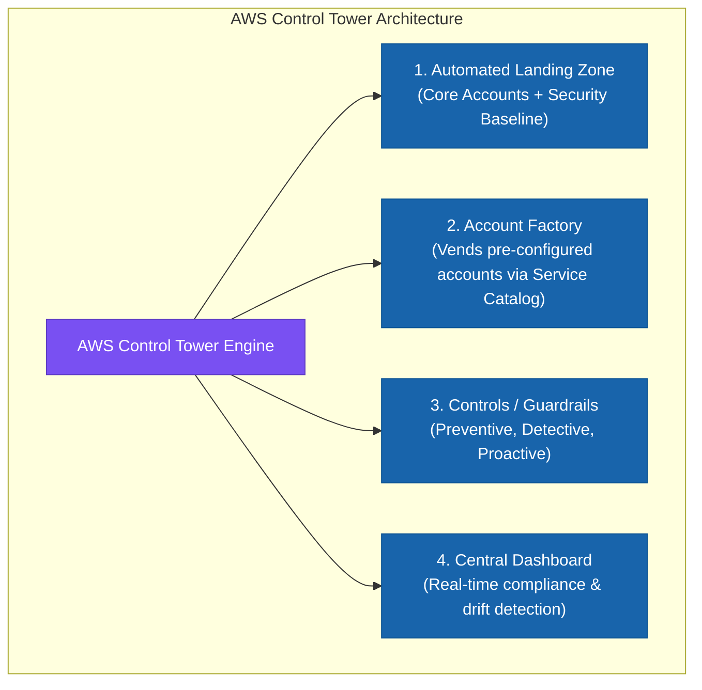

### Control Tower 3-Tier Controls (Guardrails)

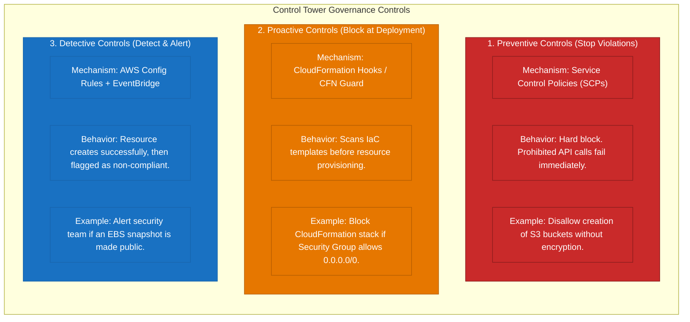

### Control Categories:
- **Mandatory**: Automatically enabled when Control Tower is set up (e.g., disallow changes to CloudTrail or Config).
- **Strongly Recommended**: Based on enterprise security best practices (e.g., detect unencrypted EBS volumes).
- **Elective**: Optional controls enabled based on enterprise compliance policies (e.g., disallow internet access for S3).

---

## 5. Account Factory & Automated Provisioning Workflow

**AWS Control Tower Account Factory** is built on **AWS Service Catalog**. It allows platform teams to vend standardized, compliant AWS accounts automatically.

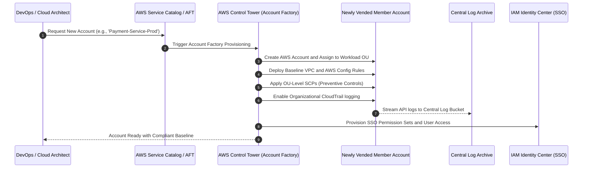

### Account Factory for Terraform (AFT)
For enterprises standardizing on HashiCorp Terraform, **AFT** provides a GitOps pipeline driven by Terraform to automate account provisioning, customizations, and post-provisioning hooks.

---

## 6. Comprehensive Multi-Account Service Comparison

| AWS Service | Primary Scope | Primary Role | Exam Clue / Keyword |
| :--- | :--- | :--- | :--- |
| **AWS Organizations** | Account Management | Core structure, OUs, SCPs, consolidated billing | *"Consolidated billing across 100 accounts with central policy guardrails"* |
| **AWS Control Tower** | Governance Framework | Automated Landing Zone setup, Account Factory, multi-tier controls | *"Standardized landing zone with automated account provisioning and guardrails"* |
| **AWS IAM Identity Center** | Identity & Access | Single Sign-On (SSO), multi-account role assignment, IdP integration (Okta/Azure AD) | *"Centrally manage workforce access across all AWS accounts using enterprise Active Directory"* |
| **AWS Resource Access Manager (RAM)** | Resource Sharing | Share VPC Subnets, Transit Gateways, Route 53 Resolver rules cross-account | *"Share Transit Gateway or private subnets with multiple accounts without duplication"* |
| **AWS Service Catalog** | Product Governance | Pre-approved CloudFormation templates for end-user self-service | *"Provide development teams a portal to launch pre-approved standard architectures"* |
| **AWS Config (Aggregator)** | Compliance Auditing | Organization-wide compliance aggregation and drift detection | *"Audit and verify compliance of all resources across all regions and accounts in the organization"* |
| **CloudTrail (Org Trail)** | Security Auditing | Centralized immutable log of all API actions across all member accounts | *"Ensure member accounts cannot disable or tamper with API audit logging"* |

---

## 7. Multi-Account Decision Flowchart (Exam Decision Tree)

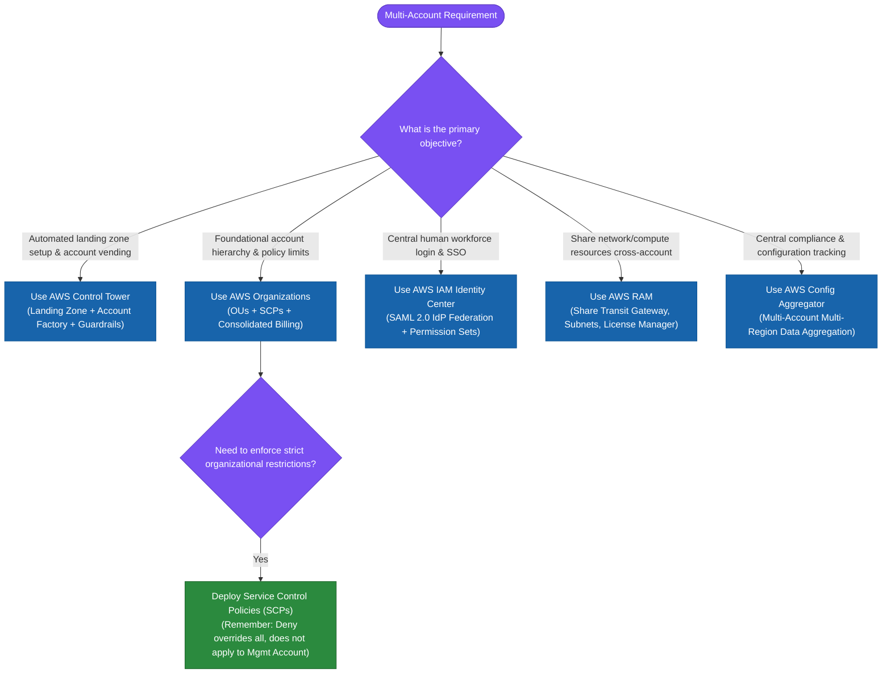

---

## 8. Real-World Professional Exam Scenarios & Traps

### Scenario 1: Preventing Unapproved Region Usage
- **Requirement**: An enterprise has compliance requirements to ensure data never leaves `eu-west-1` and `eu-central-1`. No team should be able to spin up resources in any other AWS region.
- **Solution**: Apply an **SCP at the Organization Root** with a conditional statement: `StringNotEquals: { "aws:RequestedRegion": ["eu-west-1", "eu-central-1"] }` with `Effect: Deny` on all actions (with exemptions for global services like IAM, Route 53, CloudFront).

### Scenario 2: Centralized Network Sharing
- **Requirement**: A centralized network team manages an AWS Transit Gateway and core VPCs in a Shared Network Account. 50 application accounts need connectivity to this Transit Gateway without creating individual VPC peerings.
- **Solution**: Use **AWS Resource Access Manager (RAM)** integrated with **AWS Organizations** to share the Transit Gateway attachment across the entire Organization or Workload OUs.

### Scenario 3: Onboarding Acquired AWS Accounts & Root SCP Inheritance Trap
- **Requirement**: An enterprise acquired a company and invited its AWS account via `InviteAccountToOrganization`. Administrators of the acquired account must configure AWS Config rules upon onboarding. However, the parent company's Root SCP restricts AWS Config changes, blocking the admins.
- **Solution**: 
  1. Remove restrictive SCPs from the **Organization Root** and attach them directly to the **Production OU** instead.
  2. Create a temporary **Onboarding OU** with an attached SCP that allows AWS Config modifications.
  3. Add the newly acquired account to **Onboarding OU**, make the required AWS Config updates, and then move the account into the **Production OU**.
- **Exam Distinction**:
  - *Why child OUs cannot override Root SCPs*: Inherited explicit `Deny` (or restricted service boundary) from Root cannot be overridden by an `Allow` policy in a child OU.
  - *Why removing restrictions on Root for everyone is incorrect*: Modifying Root SCPs exposes all accounts across the entire organization simultaneously, breaking security compliance.

### Scenario 4: Custom SCP Fails to Block Amazon ECS Service-Linked Role Actions
- **Requirement**: An administrator created a custom SCP with explicit `Deny` rules on an OU to restrict a new systems administration account from performing specific Amazon ECS actions. However, an Amazon ECS cluster using an attached **Service-Linked Role (SLR)** could STILL perform the restricted actions. Why did the SCP fail to block the action?
- **Solution**: **SCPs DO NOT affect Service-Linked Roles (SLRs)**.
  - Service-linked roles enable AWS services (like Amazon ECS, Auto Scaling, ELB) to integrate with AWS Organizations and manage resources across member accounts on your behalf.
  - AWS intentionally exempts Service-Linked Roles from SCP filtering to prevent organizational policies from breaking core AWS service functionality.
- **Exam Distinction**:
  - *Why higher-level OU Allow SCPs do not override child Deny SCPs*: In AWS Organizations, an **Explicit Deny ALWAYS overrides an Allow**, regardless of where in the OU hierarchy the Deny or Allow is attached. A parent OU Allow can NEVER override a child OU explicit Deny.
  - *Why default FullAWSAccess SCP is irrelevant*: Custom Deny SCPs override `FullAWSAccess` (`Allow *`) for normal IAM users and roles, but Service-Linked Roles bypass SCP evaluation entirely!

### Scenario 5: Centrally Restricting AWS Services Across Department Accounts (Root User Control)
- **Requirement**: An enterprise has multiple AWS accounts for departments (Finance, HR, Engineering), each managed by a System Administrator with local `root` user access. The security team needs to centrally manage policies across all accounts to allow or deny specific AWS services with the **LEAST amount of complexity**. What solution should be implemented?
- **Architecture Solution**:
  - Set up **AWS Organizations** and attach **Service Control Policies (SCPs)** to Organizational Units (OUs) or member accounts to centrally allow or deny specific AWS services.
- **Key Technical Rationale**:
  1. **Root User Restriction**: IAM policies managed locally inside member accounts **CANNOT restrict the account `root` user identity**. In contrast, SCPs apply to all IAM users, roles, **AND the account `root` user** within member accounts!
  2. **Top-Down Centralized Governance**: SCPs provide centralized management across dozens of accounts without needing custom scripts, complex cross-account roles, or local IAM policy management.

### Why Distractor Options Fail:
- *Creating Custom IAM Policies per Account*: IAM policies are local to each account and cannot restrict the account `root` user identity. They also require managing policies in every account individually, introducing massive operational complexity.
- *Setting Up Manual Cross-Account Access*: Configuring cross-account IAM roles between dozens of department accounts creates an unmanageable mesh of trust relationships and fails to provide centralized service guardrails.
- *Identity Federation with Federated IAM Roles*: Identity federation provides workforce authentication (SSO), but federating users does not enforce central multi-account service boundaries or restrict local account root users.

### Scenario 6: Multi-Account Shared Resource Termination Control (OUs + Cross-Account IAM Roles vs. SCP & Service-Linked Role Traps)

- **Scenario**: A shared production AWS account hosts EC2 instances, EKS clusters, and Aurora Serverless databases owned by multiple business units. Multiple member AWS accounts across business units have access. Developers from one business unit accidentally terminated resources owned by another business unit. What is the most suitable **multi-account strategy** to allow ONLY the specific business unit that owns a resource to terminate its own resources?
- **Architecture Solution**:
  - Use **AWS Organizations** to group member accounts belonging to a specific business unit into dedicated **Organizational Units (OUs)**.
  - Create an **IAM Role in the production account** for each business unit, containing an IAM policy that allows access to EC2 instances including **resource-level permissions** (e.g. tag-based conditions `ec2:ResourceTag/BusinessUnit = Finance` or explicit resource ARNs) to terminate only the resources owned by that business unit.
  - Provide cross-account access and trust policies allowing member accounts of that OU to assume the production IAM role.

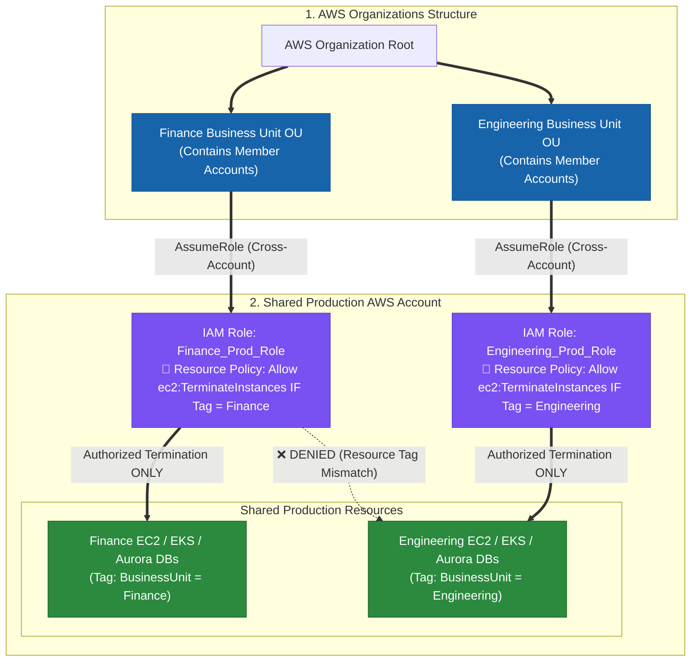

### Key Technical Rationale:
1. **SCPs Do NOT Grant Permissions**: **Service Control Policies (SCPs)** define the maximum allowable permissions (guardrails) across an account or OU. SCPs **NEVER grant permissions**! Even if an SCP permits `ec2:TerminateInstances`, a user or role CANNOT terminate an instance unless an **IAM Identity-Based Policy** in the account explicitly grants `ec2:TerminateInstances`.
2. **Cross-Account IAM Roles for Multi-Account Access**: To allow developers in member accounts to interact with resources in a shared production account, administrators create an IAM Role in the target production account and configure a trust policy allowing member account principals to call `sts:AssumeRole`.
3. **Resource-Level Permissions & Tagging**: AWS IAM supports resource-level condition keys (e.g. `aws:ResourceTag/BusinessUnit`). Combining resource-level IAM policies on cross-account roles ensures each business unit can only perform destructive actions (like termination) on its own tagged resources.

### Why Distractor Options Fail:
- *Creating `AWSServiceRoleForOrganizations` Service-Linked Role (Your Selection)*:
  - **`AWSServiceRoleForOrganizations` is an internal AWS system service-linked role** automatically generated so AWS Organizations can integrate with other AWS services (like GuardDuty or Config) across accounts. It is **NOT** a custom IAM role created by administrators to delegate user cross-account access!
- *Creating Service Control Policies (SCPs) in the Production Account to Grant Termination Access*:
  - **SCPs DO NOT GRANT PERMISSIONS**! Creating an SCP containing `Allow ec2:TerminateInstances` does NOT grant permission to terminate instances; permissions must be granted by IAM Policies on cross-account roles in the production account.

---

### Common Exam Traps

> [!CAUTION]
> 1. **SCPs Do NOT Grant Access**: An SCP containing an `Allow *` statement does **not** grant any permissions to IAM users; it merely permits IAM policies inside the account to grant permissions.
> 2. **Management Account Immunity**: SCPs have **zero effect** on the Management (Payer) Account. Workloads placed in the Management Account bypass all organizational guardrails.
> 3. **Service-Linked Role (SLR) Immunity**: SCPs **DO NOT affect Service-Linked Roles**. Pre-defined service-linked roles used by services like Amazon ECS or Auto Scaling bypass SCP filtering.
> 4. **Root User Restriction (SCPs vs. IAM Policies)**: IAM policies **cannot** restrict the `root` user identity of an AWS account. Only **SCPs** in AWS Organizations can restrict member account `root` users.
> 5. **Root SCP Inheritance Lockout**: You **cannot** override an inherited `DENY` or service restriction at a child OU if it is attached at the Organization Root. Always move restrictive SCPs down to target OUs (e.g., `Production OU`) and use a staging OU (`Onboarding OU`) for account initialization.
> 6. **RAM vs. VPC Peering**: When connecting dozens of VPCs across different accounts, VPC Peering creates an unmanageable mesh. Use **AWS RAM + AWS Transit Gateway**.
> 7. **Over-Engineering Control Tower / Proton**: If a question only asks to set up central account service restrictions with minimal complexity, **AWS Organizations + SCPs** is the simplest native solution. Do not select Control Tower or Proton unless automated landing zones or application environment provisioning templates are explicitly required.
> 8. **Confusing `AWSServiceRoleForOrganizations` with Custom Cross-Account IAM Roles**: `AWSServiceRoleForOrganizations` is an internal AWS system role for service integrations; it CANNOT be used as a custom IAM role for user cross-account access. To grant cross-account access across OUs, create a standard **IAM Role** in the target account with custom trust and permission policies.

---

## 9. Key Summary & Mental Model

```
Multi-Account Governance
   ├── AWS Organizations   ──► Foundational Account Hierarchy & SCP Guardrails
   ├── AWS Control Tower   ──► Managed Landing Zone + Account Factory + Controls
   ├── IAM Identity Center ──► Central Workforce Single Sign-On (SSO)
   ├── AWS RAM             ──► Cross-Account Resource Sharing (TGW, Subnets)
   └── AWS Config / Trail  ──► Organization-Wide Compliance & Immutable Logging
```