# 1.4 AWS Resource Sharing Across Environments

> **Domain Focus**: AWS Certified Solutions Architect – Professional (SAP-C02) & Multi-Account Cloud Architecture  
> **Core Question**: *"How do I let multiple AWS accounts use a shared resource without duplicating the resource in every account?"*  
> **Primary AWS Service**: **AWS Resource Access Manager (AWS RAM)**.

---

## Executive Overview & Architectural Mindset

For the AWS Solutions Architect Professional exam, **“AWS resource sharing across environments”** centers on this foundational principle:
> *“How do I let multiple AWS accounts use a shared resource without duplicating the resource in every account?”*

The primary service to evaluate first is **AWS Resource Access Manager (AWS RAM)**.

---

## 1. Why Resource Sharing Exists

Suppose your company operates:
- **Production Account**
- **Development Account**
- **Testing Account**

Each account requires access to central infrastructure:
- Transit Gateway
- VPC subnets
- Route 53 Resolver rules
- AWS License Manager resources
- Other RAM-supported resources

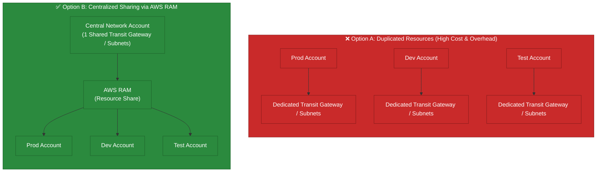

### Architectural Choices:
- **Option A**: Create the resource separately in every account.
- **Option B**: Create one shared resource and allow multiple accounts to use it.

Resource sharing solves the second problem:
$$\text{One Central Resource} \quad \Longrightarrow \quad \text{Accessible Across Multiple AWS Accounts}$$

---

## 2. Why AWS RAM Exists

AWS Resource Access Manager (**AWS RAM**) exists to securely share supported AWS resources across AWS accounts and within an AWS Organization or Organizational Unit (OU).

### Without RAM:
- **Account A** $\rightarrow$ Resource A
- **Account B** $\rightarrow$ Resource B
- **Account C** $\rightarrow$ Resource C

This creates:
- Duplicate infrastructure.
- Substantially higher cost.
- Increased administrative complexity.
- Configuration drift and differences.
- Multiplied resource monitoring surfaces.

### With RAM:
$$\text{Central Account} \longrightarrow \text{Shared Resource} \longrightarrow \text{Account A / Account B / Account C}$$

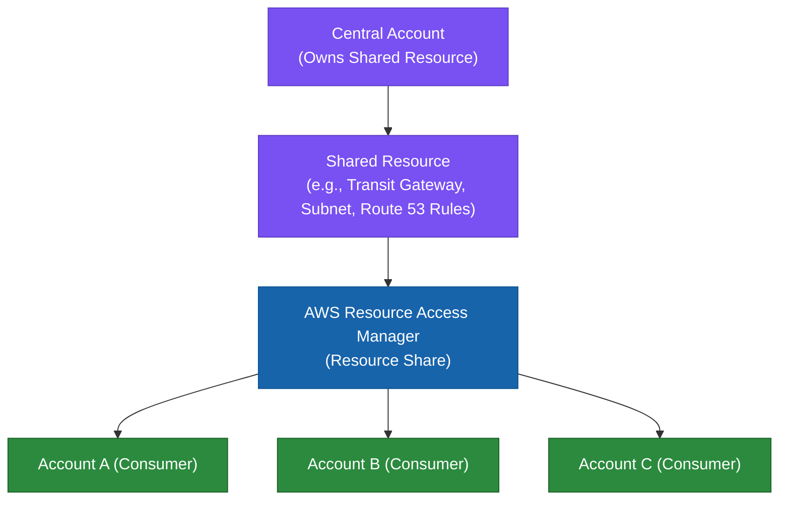

---

## 3. The Classic Professional Exam Example: Transit Gateway

This is one of the most critical enterprise scenarios tested on the exam.

Suppose you have **100 AWS accounts**, each with its own VPC, requiring centralized network connectivity:

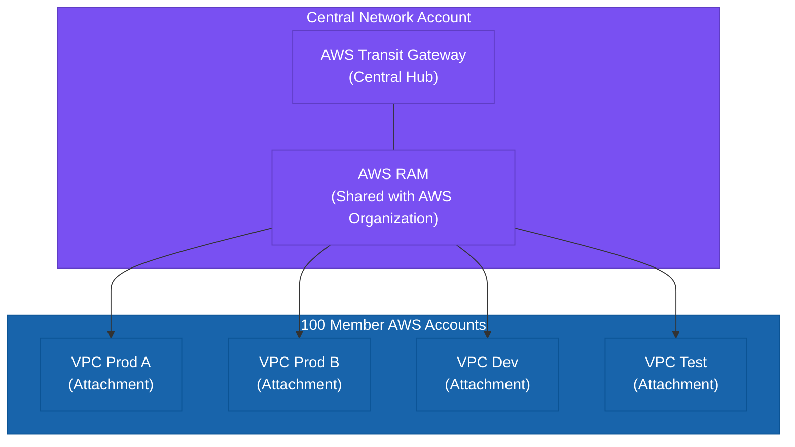

### Roles:
- **AWS RAM**: Shares the Transit Gateway across accounts.
- **Transit Gateway**: Interconnects the VPC networks.

> [!IMPORTANT]
> **Key Exam Distinction**: AWS RAM shares the resource definition; Transit Gateway routes the network traffic. Do not confuse the sharing mechanism with the networking service.

---

## 4. Why Not Create One Transit Gateway per Account?

Because it creates massive, unnecessary infrastructure duplication. You would end up with:
$$\text{100 Accounts} \quad \Longrightarrow \quad \text{100 Transit Gateways}$$

This drastically increases:
- Direct service costs.
- Network routing complexity.
- Route table management overhead.
- Operational troubleshooting complexity.

**Optimal Architecture**:
$$\text{Network Account} \longrightarrow \text{One Transit Gateway} \longrightarrow \text{Shared via RAM to Many VPCs}$$

---

## 5. Is AWS RAM a Minimal Requirement?

AWS RAM is the minimal requirement **only when the task involves sharing a RAM-supported resource**.

- If Account A owns a VPC and Account B needs access to a shared network resource $\rightarrow$ **AWS RAM**.
- If the requirement is: *"Give a user access to another AWS account"* $\rightarrow$ **IAM Identity Center** (NOT RAM).
- If the requirement is: *"Share an S3 object with another account"* $\rightarrow$ **S3 Bucket Policy / Cross-Account IAM** (NOT RAM).
- If the requirement is: *"Share a Transit Gateway across accounts"* $\rightarrow$ **AWS RAM**.

---

## 6. Very Important Distinction: RAM Does Not Share Everything

> [!WARNING]
> **Exam Trap**: AWS RAM supports **specific** resource types. You cannot assume that any arbitrary AWS resource can be shared across accounts via RAM.

### Examples of Supported RAM Resources:
- **Networking**: VPC Subnets (VPC Sharing), Transit Gateways, Route 53 Resolver Rules / Query Log Configs, IPAM Pools, VPC Lattice Service Networks.
- **Compute & Containers**: AWS Outposts, EC2 Capacity Reservations, EC2 Dedicated Hosts.
- **Security & Governance**: AWS License Manager Configurations, AWS Network Firewall rule groups, AWS Systems Manager Incident Manager contacts.
- **Data & Analytics**: AWS Glue Databases/Tables, Amazon SageMaker Lineage Groups.

Always verify that the target resource type supports RAM before selecting it.

---

## 7. RAM vs. IAM

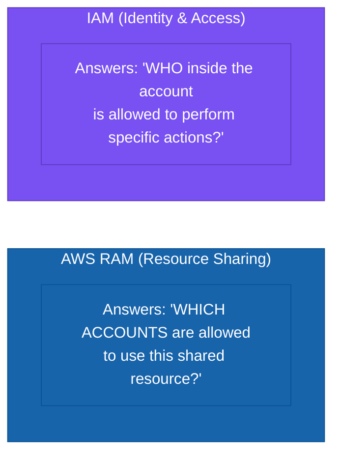

### Example:
1. **Network Account** shares a Transit Gateway with **Production Account** via **AWS RAM**.
2. **IAM** inside the Production Account controls which IAM roles/users are permitted to create Transit Gateway attachments (`ec2:CreateTransitGatewayVpcAttachment`).

- **RAM** = Resource sharing.
- **IAM** = Permissions and identity authorization.

---

## 8. RAM vs. AWS Organizations

- **AWS Organizations**: Governs the multi-account structure, OUs, consolidated billing, and SCP guardrails.
- **AWS RAM**: Shares supported resources between accounts within that organizational structure.

$$\text{AWS Organization} \longrightarrow \text{Network OU} \longrightarrow \text{Network Account} \longrightarrow \text{Transit Gateway} \longrightarrow \text{AWS RAM} \longrightarrow \text{Production Accounts}$$

Organizations provides the governance foundation; RAM provides the cross-account resource sharing mechanism. They complement each other.

---

## 9. RAM and Organizational Sharing

When integrated with **AWS Organizations**, RAM eliminates the operational overhead of managing individual account IDs:

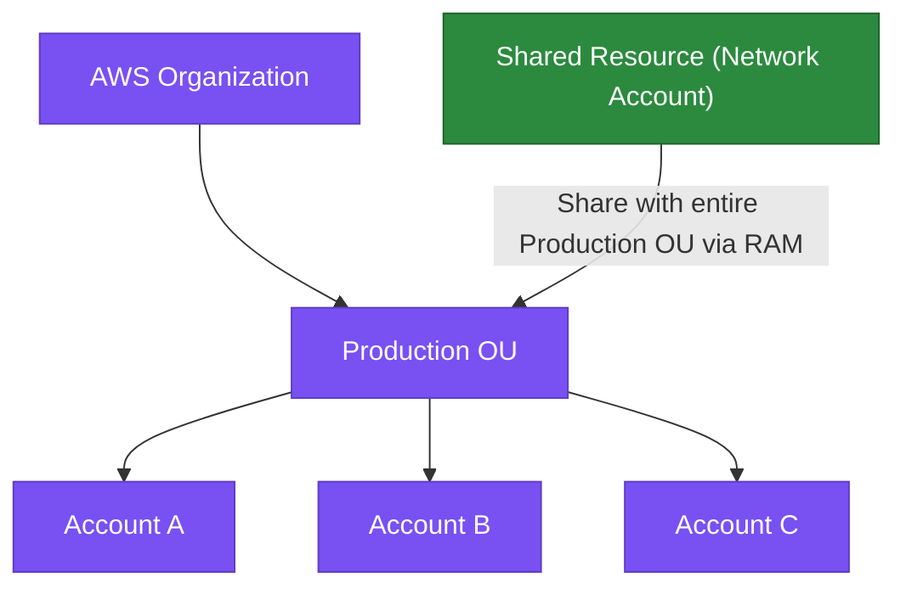

When new accounts are created inside the OU, they automatically inherit access to the shared resource without manual reconfiguration.

---

## 10. Operational Overhead

AWS RAM significantly reduces operational overhead across multi-account environments.

- **Without RAM**: Repeatedly create, configure, patch, and monitor resources in every account.
- **With RAM**: Centralize the resource in a dedicated account, share it once via RAM, and manage it centrally.

### Centralized Responsibility:
The owning account becomes critical shared infrastructure. If the shared resource is misconfigured or fails, all consuming accounts are impacted.

---

## 11. Centralization vs. Decentralization Architecture Trade-Off

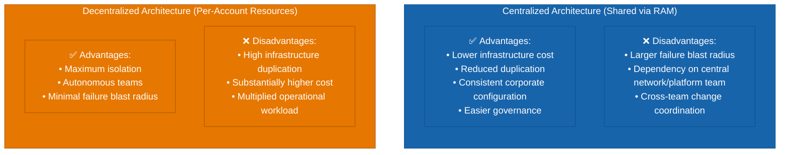

---

## 12. Cost Perspective

Resource sharing reduces cost by eliminating redundant infrastructure.

### Scenario: 10 accounts need network connectivity:
- **Option A**: 10 independent network resources.
- **Option B**: 1 shared resource via RAM.

Option B reduces baseline infrastructure costs. However, architects must evaluate the total cost model:
- Resource base pricing.
- Cross-account and cross-AZ data transfer charges.
- Centralized security inspection traffic processing fees.
- Network routing architecture.

---

## 13. Important Cost Trap: Network Traffic & Centralized Inspection

Centralizing network infrastructure reduces duplication, but routing all traffic through a centralized inspection VPC can introduce additional data processing charges:

$$\text{App VPC} \longrightarrow \text{Transit Gateway} \longrightarrow \text{Central Inspection VPC} \longrightarrow \text{Transit Gateway} \longrightarrow \text{Destination VPC}$$


> [!NOTE]
> **Professional Exam Insight**: Reduced infrastructure duplication does not automatically mean lower total architecture cost if data transfer and inspection fees are high.

---

## 14. Centralized Networking Example

A standard enterprise networking architecture:

```
                Network Account
                      │
               Transit Gateway
                /      |      \
               /       |       \
            VPC A    VPC B    VPC C
             │         │        │
          Prod       Dev      Test
```

- **Transit Gateway** is owned and managed by the **Network Account**.
- **AWS RAM** shares the Transit Gateway with application accounts.
- Each application account attaches its VPC, achieving network centralization with account isolation.

---

## 15. Shared VPC (VPC Sharing via RAM)

AWS RAM allows the owner of a VPC to share **subnets** with other accounts in the same AWS Organization.

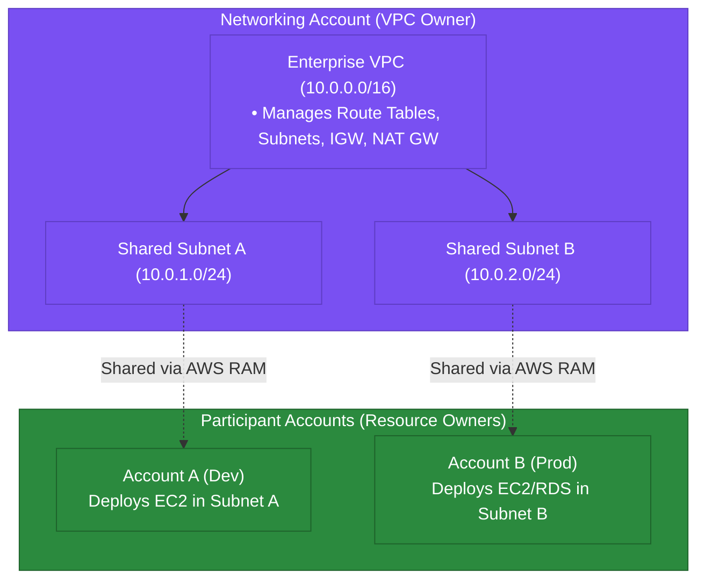

### Roles in a Shared VPC:
- **VPC Owner (Network Team)**: Creates and owns the VPC, subnets, route tables, Network ACLs, internet gateways, and NAT gateways.
- **Participant Accounts (App Teams)**: Create and manage their own resources (EC2 instances, RDS databases, ALBs) and Security Groups inside the shared subnets.

---

## 16. Why VPC Sharing Exists

In enterprise organizations with a central network team:
- The networking team controls the network perimeter, IP CIDR allocation, and routing.
- Application teams deploy resources independently without needing to manage networking components.
- Avoids VPC sprawl and complex cross-VPC peering/transit networking.

---

## 17. VPC Sharing Trade-Offs

### Advantages:
- Centralized network topology and IP address management (reduces IP exhaustion).
- Fewer total VPCs across the enterprise.
- Efficient utilization of shared NAT Gateways and VPC Endpoints.
- Uniform routing and security boundary enforcement.

### Disadvantages:
- Shared blast radius at the subnet/VPC level.
- High operational coordination between network and application teams.
- Security Group references across accounts have specific constraints.

---

## 18. VPC Sharing vs. Separate VPCs

| Characteristic | Separate VPCs (Connected via TGW) | Shared VPC (VPC Sharing via RAM) |
| :--- | :--- | :--- |
| **Isolation Level** | **Maximum**: Completely separate VPCs and subnets per account. | **High**: Accounts isolated by IAM and Security Groups, but share subnets/VPC. |
| **IP Management** | Requires distinct CIDRs per VPC to allow routing. | Centralized CIDR management in a single VPC. |
| **Cost Profile** | Higher (multiple NAT Gateways, TGW attachment fees). | Lower (shared NAT Gateways, shared VPC Endpoints). |
| **Operational Control** | App teams manage their own VPCs and routes. | Central network team owns VPC and routes. |

---

## 19. RAM and Route 53 Resolver Rules

A central networking account creates outbound/inbound **Route 53 Resolver rules** (for hybrid DNS resolution with on-premises DNS servers) and shares them across application accounts using **AWS RAM**.

$$\text{Central Network Account} \longrightarrow \text{Resolver Rule} \longrightarrow \text{AWS RAM} \longrightarrow \text{100 Application Accounts / VPCs}$$

All application VPCs automatically inherit centralized DNS resolution rules without duplicating endpoints.

---

## 20. RAM in Centralized Enterprise Network Architecture

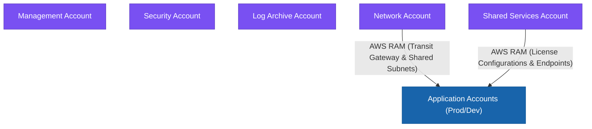

---

## 21. AWS RAM vs. AWS Control Tower

- **AWS Control Tower**: Sets up and governs the multi-account Landing Zone (account creation, baselines, guardrails).
- **AWS RAM**: Shares specific supported resources across the accounts in that landing zone.

$$\text{Control Tower (Landing Zone)} \longrightarrow \text{Organizations (Account Hierarchy)} \longrightarrow \text{RAM (Resource Sharing)}$$

---

## 22. AWS RAM vs. AWS Service Catalog

- **AWS RAM**: Shares active infrastructure resources (Transit Gateways, subnets, licenses).
- **AWS Service Catalog**: Provides pre-approved CloudFormation templates for users to launch approved standard architectures.

---

## 23. AWS RAM vs. AWS PrivateLink

- **AWS PrivateLink**: Provides private, secure TCP connectivity to services (SaaS or central services) over VPC Interface Endpoints without exposing traffic to the internet.
- **AWS RAM**: Shares actual AWS resources across accounts.

---

## 24. AWS RAM Naming & Scope Clarification

> [!TIP]
> **Core Concept**: AWS RAM does **not** mean *"give someone access to my AWS account"*.  
> - For human workforce access $\rightarrow$ **IAM / IAM Identity Center**.  
> - For cross-account resource sharing $\rightarrow$ **AWS RAM**.

---

## 24.1 AWS Organizations Trusted Access Integration with AWS RAM & Service-Linked Roles

When automating organization-wide resource sharing across AWS accounts, AWS RAM integrates natively with **AWS Organizations** via **Trusted Access**:

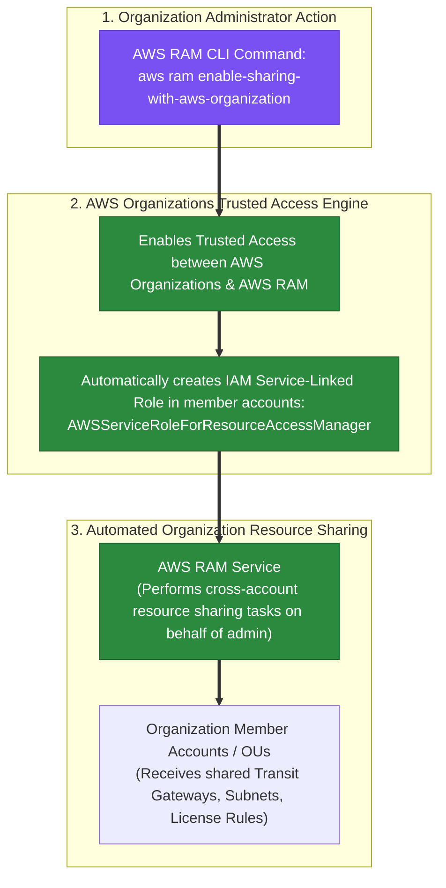

### Key Technical Rationale:
1. **Trusted Access CLI Command**: Running `aws ram enable-sharing-with-aws-organization` enables Trusted Access, permitting AWS RAM to perform automated resource sharing tasks across organization accounts without requiring manual cross-account IAM role assumption logic.
2. **Automated Service-Linked Role (SLR) Management**: Enabling Trusted Access automatically creates the IAM Service-Linked Role `AWSServiceRoleForResourceAccessManager` across all organization member accounts.
3. **Immutable SLR Trust Policies**: Service-Linked Roles are pre-defined by AWS. **You CANNOT modify the trust policy of a Service-Linked Role**. Only the designated AWS service (AWS RAM) can assume its SLR.

---

## 25. The Multi-Account Tooling Matrix

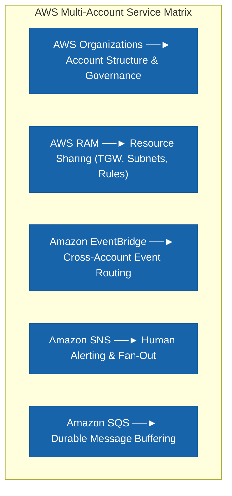

---

## 26. Minimum Architecture Decision Guide

- *"Centralize VPC connectivity for multiple AWS accounts"* $\rightarrow$ **Transit Gateway + AWS RAM**.
- *"Allow multiple accounts to deploy resources into centrally managed subnets"* $\rightarrow$ **VPC Sharing + AWS RAM**.
- *"Share a supported resource with accounts in the organization"* $\rightarrow$ **AWS RAM**.
- *"Automate RAM tasks across AWS Organizations on moderator's behalf"* $\rightarrow$ **`aws ram enable-sharing-with-aws-organization` (Trusted Access)**.
- *"Give developers access to multiple AWS accounts"* $\rightarrow$ **IAM Identity Center**.

---

## 29.2 Real-World Exam Scenario: Multi-Account Resource Management via Master IAM Users & Target Cross-Account IAM Roles (Consolidated Billing & Role Location Traps)

- **Scenario**: A company hosts its Development and Testing environments in separate AWS accounts linked to a Master/Management AWS account via Consolidated Billing. Administrators in the Master account need the ability to stop, delete, and terminate resources in both Dev and Test member accounts to maintain strict budget controls without creating separate IAM users in each account. What is the recommended solution?
- **Architecture Solution**:
  - Create IAM users (or IAM Identity Center identities) in the **Master/Management account**.
  - In both **Dev and Test target member accounts**, create **cross-account IAM roles** that have full administrative permissions while granting role assumption access to the Master account (`arn:aws:iam::<MasterAccountID>:root`).
  - Master account administrators assume the cross-account roles to perform resource management operations in Dev and Test accounts.

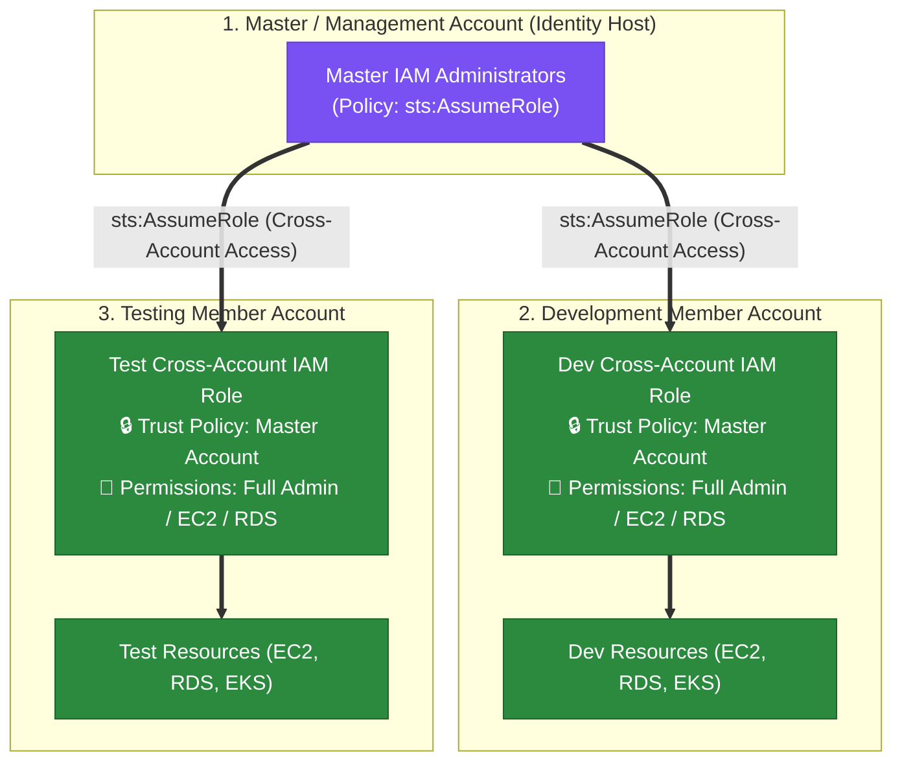

### Key Technical Rationale:
1. **Target Account Cross-Account IAM Role Pattern**:
   - Cross-account IAM roles MUST be created in the **target AWS accounts** (Dev and Test) where the resources physically reside. The role's **Trust Policy** must explicitly trust the calling principal in the Master account (`arn:aws:iam::<MasterAccountID>:root`).
2. **Master Account Identity Centralization**:
   - Creating IAM users (or IAM Identity Center users) exclusively in the Master account avoids credential proliferation and eliminates creating duplicate IAM users across dozens of member accounts.

### Why Distractor Options Fail:
- *Creating Cross-Account Role in Master Account*:
  - Creating a cross-account role in the Master account grants external accounts access to Master account resources; it does **NOT** grant Master account administrators access to Dev/Test member account resources!
- *Permissions Inherited from Master Account*:
  - IAM permissions are **never inherited across AWS account boundaries**. Cross-account access requires an explicit trust policy on the IAM role in the target account and `sts:AssumeRole` permissions in the calling account.
- *Consolidated Billing Grants Resource Access*:
  - **Consolidated Billing** is strictly a financial aggregation feature in AWS Organizations for centralizing payments and volume discounts; it grants **ZERO resource access or IAM permissions** across member accounts.

---


- **Scenario**: A company uses AWS Organizations to manage multi-account AWS infrastructure. As part of process automation, an organizational account owns specified AWS resources that must be shared with other AWS accounts using AWS RAM. An existing service managed by an account moderator maintains specific configuration details. What is a simple and effective solution allowing the service to perform tasks on organization accounts on the moderator's behalf?
- **Architecture Solution**:
  - Use **Trusted Access** by running the `enable-sharing-with-aws-organization` command in the **AWS RAM CLI**. Mirror the configuration changes performed by the account that previously managed this service.

### Why Distractor Options Fail:
- *Modifying a Service-Linked Role's Trust Policy (Your Selection)*: **Service-Linked Roles (SLRs) are managed entirely by AWS—you CANNOT modify the trust policy of a Service-Linked Role!** Only the linked service can assume an SLR. Furthermore, you do not manually construct SLRs; enabling **Trusted Access** in AWS Organizations automatically provisions the SLR for you.
- *Installing SSM Agents on Worker VMs*: Systems Manager (SSM) manages OS patching and VM automation; it cannot manage native AWS RAM cross-account resource sharing across AWS Organizations.
- *Enabling "Cross-Account Access" in RAM*: The official AWS integration mechanism is **Trusted Access with AWS Organizations**, not generic "cross-account access".

---

## 27. Professional Scenario Walkthrough: Central Network Hub

- **Question**: A company has 50 AWS accounts. The network team wants to centrally manage connectivity while application teams maintain their own AWS accounts. The company wants to avoid deploying separate Transit Gateways in every account.
- **Best Architecture**:
  $$\text{Network Account} \longrightarrow \text{Transit Gateway} \longrightarrow \text{AWS RAM} \longrightarrow \text{Application Accounts}$$
- **Reasoning**: One central network hub, multiple consuming accounts, eliminates duplication, and establishes clear network team ownership.

---

## 28. Professional Scenario Walkthrough: Centralized Subnet Governance

- **Question**: A company has separate production and development accounts. The network team wants to centrally manage the VPC and allow application teams in different accounts to deploy resources into specific subnets.
- **Best Architecture**: **VPC sharing through AWS RAM**. The VPC owner maintains full control over subnets and routing, while participant accounts deploy workloads into shared subnets.

---

## 29. Professional Scenario Walkthrough: Determining the Correct "Access" Service

A company has 100 accounts and wants developers to access resources in a central account. Evaluate the specific nature of access:
- If developers need **AWS Management Console access** $\rightarrow$ **IAM Identity Center**.
- If applications need a **Shared Transit Gateway** $\rightarrow$ **AWS RAM**.
- If applications need **Access to an S3 bucket** $\rightarrow$ **S3 Bucket Policies / Cross-Account IAM**.
- If applications need **Private access to a service** $\rightarrow$ **AWS PrivateLink**.

---

## 30. Cost and Operational Decision Matrix

| Requirement | Architecture | Cost Tendency | Operational Overhead |
| :--- | :--- | :---: | :---: |
| **Independent Infrastructure** | Separate resources per account | Higher | Higher |
| **Shared Supported Resource** | AWS RAM | Lower duplication | Lower |
| **Central VPC** | VPC Sharing | Lower duplication | Medium |
| **Central Network Connectivity** | Transit Gateway + RAM | Often efficient at scale | Medium |
| **Maximum Account Isolation** | Separate VPCs / resources | Higher | Higher |
| **Human Access Across Accounts** | IAM Identity Center | Low infrastructure overhead | Low |
| **Private Service Access** | AWS PrivateLink | Resource / network cost | Medium |

---

## 31. The Big Professional Exam Trade-Off

### Centralization:
$$\text{Cost } \downarrow \quad | \quad \text{Duplication } \downarrow \quad | \quad \text{Management Effort } \downarrow \quad | \quad \text{Consistency } \uparrow$$
$$\text{Trade-off: Blast Radius } \uparrow \quad | \quad \text{Central Team Dependency } \uparrow \quad | \quad \text{Coordination } \uparrow$$

### Decentralization:
$$\text{Isolation } \uparrow \quad | \quad \text{Team Autonomy } \uparrow \quad | \quad \text{Blast Radius } \downarrow$$
$$\text{Trade-off: Cost } \uparrow \quad | \quad \text{Duplication } \uparrow \quad | \quad \text{Operational Effort } \uparrow$$

---

## 32. Final Mental Model & Exam Decision Tree

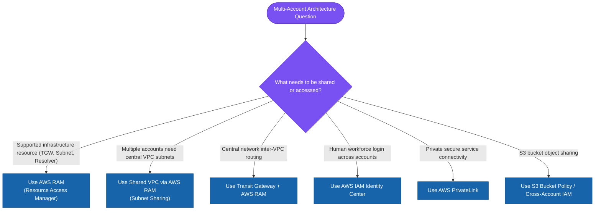

```
Summary Hierarchy:
Do I need multiple accounts?                                     ──► AWS Organizations
Do I need to share a supported AWS resource between accounts?   ──► AWS RAM
Do I need centralized network connectivity?                      ──► Transit Gateway + RAM
Do I need multiple accounts to use centrally managed subnets?    ──► VPC Sharing + RAM
Do humans need access to multiple accounts?                      ──► IAM Identity Center
Do applications need private access to a service?                ──► AWS PrivateLink
```

> **The Core Architectural Question Tested**:
> *"Should this resource be centralized and shared, or independently deployed in each account?"*  
> Evaluate through: **Isolation $\rightarrow$ Cost $\rightarrow$ Blast Radius $\rightarrow$ Operational Overhead $\rightarrow$ Scale $\rightarrow$ Governance**.