# AWS — Task 1.5: Determine Cost Optimization and Visibility Strategies

> **Domain Focus**: AWS Certified Solutions Architect – Professional (SAP-C02) & Cloud Financial Management (FinOps)  
> **Core Principle**: The important question is not simply *“Which AWS cost tool should I use?”*, but rather:
> $$\text{“At what stage of the architecture am I, what cost problem am I trying to solve, and how much operational overhead should I introduce to solve it?”}$$

AWS Cost Optimization is one of the AWS Well-Architected Framework pillars. AWS frames it around five core areas:
1. **Cloud Financial Management**
2. **Expenditure and usage awareness**
3. **Cost-effective resources**
4. **Managing demand and supply**
5. **Optimizing over time** ([AWS Documentation](https://docs.aws.amazon.com/wellarchitected/2025-02-25/framework/the-pillars-of-the-framework.html?utm_source=chatgpt.com "The pillars of the framework - AWS Well-Architected Framework"))

For this exam task, the core tools are:
1. **AWS Pricing Calculator**
2. **AWS Cost Explorer**
3. **AWS Budgets**
4. **AWS Trusted Advisor**

The key is understanding **why each exists**.

---

# 1. First Understand the Problem

Imagine a company running AWS:

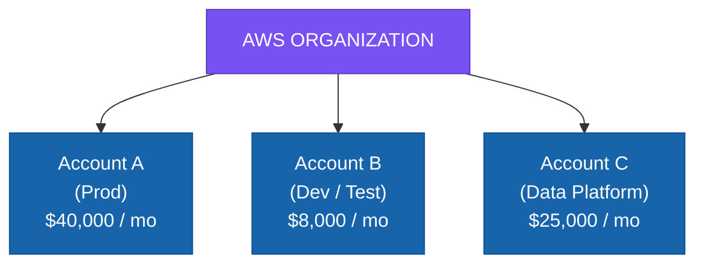

- The CFO asks: *“Why are we spending $73,000 per month?”*
- The engineering team asks: *“Which workload is responsible?”*
- The architect asks: *“If we change the architecture, what will it cost?”*
- The finance team asks: *“Will we exceed our monthly budget?”*
- The operations team asks: *“Are there unused or oversized resources?”*

These are **different questions**. Therefore, AWS provides different tools.

---

# 2. The Most Important Mental Model

Memorize this lifecycle:

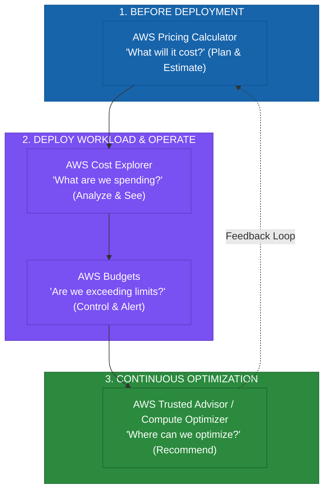

> **Pricing Calculator = Estimate (PLAN)**  
> **Cost Explorer = Analyze (SEE)**  
> **Budgets = Control / Alert (CONTROL)**  
> **Trusted Advisor = Recommend (OPTIMIZE)**  

This four-word model is extremely useful for SAP-C02.

---

# 3. Why Does AWS Cost Management Exist?

Traditional data centers often work like this:
$$\text{Buy hardware} \longrightarrow \text{Provision for peak capacity} \longrightarrow \text{Hardware sits idle during low demand} \longrightarrow \text{Capital expenditure}$$

Cloud changes the economics:
$$\text{Demand} \longrightarrow \text{Provision resources} \longrightarrow \text{Use resources} \longrightarrow \text{Pay for usage} \longrightarrow \text{Scale down when demand decreases}$$

AWS explicitly promotes the consumption model: pay for the resources consumed and increase or decrease usage according to business requirements. ([AWS Documentation](https://docs.aws.amazon.com/wellarchitected/latest/cost-optimization-pillar/design-principles.html?utm_source=chatgpt.com "Design principles - Cost Optimization Pillar"))

But this creates a new problem:
> **Cloud makes it easy to create resources — and therefore easy to create unnecessary spending.**

For example:
- Developer creates: EC2 instance, RDS database, NAT Gateway, EBS volume, Load Balancer.
- Six months later: Nobody remembers why they exist.

Cloud can therefore have:
$$\text{No hardware waste} \quad \text{BUT} \quad \text{Potential resource waste}$$

Cost visibility and optimization tools solve this problem.

---

# 4. Tool #1 — AWS Pricing Calculator

## Why does it exist?
The first cost question happens **before deployment**:
> “How much will this architecture cost?”

You don't want to deploy an architecture and discover afterward that:
- Expected: $5,000/month
- Actual: $18,000/month

AWS Pricing Calculator allows you to estimate the cost impact of workloads, applications, resources, and architecture changes. It can also incorporate discounts and purchase commitments in the authenticated/in-console experience. ([Amazon Web Services, Inc.](https://aws.amazon.com/aws-cost-management/aws-pricing-calculator/?utm_source=chatgpt.com "AWS Pricing Calculator - AWS"))

---

# 5. What Problem Does Pricing Calculator Solve?

Suppose the architect has two designs:

### Architecture A:
- 20 × EC2 + RDS + ALB + EBS

### Architecture B:
- ECS + Aurora + ALB + S3

The architect wants to compare:
$$\text{Architecture} \longrightarrow \text{Expected usage} \longrightarrow \text{Expected cost}$$

Pricing Calculator helps answer:
> **“What is the estimated financial impact before I build it?”**

---

# 6. Pricing Calculator — Exam Perspective

Think:
$$\text{NEW WORKLOAD} \longrightarrow \text{NEW REGION} \longrightarrow \text{MIGRATION} \longrightarrow \text{ARCHITECTURE CHANGE} \longrightarrow \text{COMMITMENT DECISION} \longrightarrow \text{PRICING CALCULATOR}$$

For example:
> “A company plans to migrate 500 servers to AWS. Estimate the monthly AWS cost before migration.”

Think: **AWS Pricing Calculator**.

---

# 7. Pricing Calculator Is Not Cost Explorer

This distinction is important.

### Pricing Calculator:
$$\text{Future} \longrightarrow \text{Estimate}$$

### Cost Explorer:
$$\text{Past + Current} \longrightarrow \text{Analyze}$$

- Example: *“How much will our new application cost?”* $\longrightarrow$ **Pricing Calculator**
- Example: *“Why did our AWS bill increase 30% this month?”* $\longrightarrow$ **Cost Explorer**

---

# 8. Pricing Calculator — Operational Overhead

Very low. You don't deploy infrastructure. You don't maintain servers. You simply model:
$$\text{Service} + \text{Region} + \text{Usage} + \text{Pricing model} + \text{Commitments} \longrightarrow \text{Estimate}$$

| Evaluation Dimension | Pricing Calculator Status |
| :--- | :---: |
| **Operational overhead** | ⭐ **Very low** |
| **Infrastructure required** | ❌ None |
| **Helps before deployment** | ✅ Yes |
| **Estimates future cost** | ✅ Yes |
| **Analyzes actual spending** | ❌ No |
| **Automatically stops resources** | ❌ No |

---

# 9. Pricing Calculator — Trade-Off

The major trade-off is:
> **Estimate $\ne$ Actual Bill**

Your estimate depends on assumptions. For example:
- Assumed: 1,000 requests/sec
- Actual: 10,000 requests/sec

Your estimate becomes irrelevant. Therefore:
> **Pricing Calculator is only as accurate as the workload assumptions.**

AWS also notes that Pricing Calculator provides estimates and actual fees depend on factors such as actual AWS usage. ([AWS Documentation](https://docs.aws.amazon.com/cost-management/latest/userguide/pricing-calculator.html?utm_source=chatgpt.com "Generating estimates with Pricing Calculator - AWS Cost Management"))

---

# 10. Pricing Calculator — Cost Perspective

The calculator itself is not the optimization. It helps you make a **cost-aware architecture decision before spending money**.

For example:
- Architecture A: $20K/month
- Architecture B: $12K/month

You can then ask:
> *Does Architecture A provide enough additional business value to justify the extra $8K?*

This is much closer to the SAP-C02 mindset. AWS explicitly recommends considering cost when selecting workload components rather than treating cost as something to optimize only after deployment. ([AWS Documentation](https://docs.aws.amazon.com/wellarchitected/latest/framework/cost_select_service_select_for_cost.html?utm_source=chatgpt.com "COST05-BP05 Select components of this workload to optimize cost in line with organization priorities - AWS Well-Architected Framework"))

---

# 11. Option #2 — AWS Cost Explorer

Now the workload is running. The question changes:
> **“Where is my money actually going?”**

This is where Cost Explorer comes in. AWS describes Cost Explorer as a tool to visualize, understand, and analyze AWS costs and usage over time. It supports filtering and grouping by dimensions such as service, Region, and account. ([Amazon Web Services, Inc.](https://aws.amazon.com/aws-cost-management/aws-cost-explorer/features/?utm_source=chatgpt.com "Cloud Financial Management – AWS Cost Explorer - Amazon Web Services"))

---

# 12. Why Does Cost Explorer Exist?

Imagine the bill is:
- **AWS Total**: $100,000/month

That is not actionable. You need the granular breakdown:
- EC2: $30K
- RDS: $20K
- S3: $10K
- Data Transfer: $15K
- NAT Gateway: $8K
- EKS: $7K
- Other: $10K

Cost Explorer converts *“I have a $100K bill”* into:
- *“RDS increased 40%.”*
- *“Data transfer increased 25%.”*
- *“Account B is responsible for most growth.”*
- *“Region X has unexpected spending.”*

---

# 13. Cost Explorer — The Core Problem

Think:
> **Visibility into actual AWS spending.**

It answers:
- **WHO?** $\rightarrow$ Which account?
- **WHAT?** $\rightarrow$ Which service?
- **WHERE?** $\rightarrow$ Which Region?
- **WHEN?** $\rightarrow$ Which period?
- **HOW MUCH?** $\rightarrow$ How much money?

---

# 14. Cost Explorer Example

Suppose:
- January: $50K
- February: $55K
- March: $80K

Cost Explorer helps investigate the increase:
- March increase: EC2 (+$5K), RDS (+$2K), Data Tx (+$18K), S3 (+$5K).

Now the architect knows:
> **Data transfer is the major cost driver.**

The next architecture investigation might involve: CloudFront, S3 placement, cross-AZ traffic, cross-Region traffic, NAT Gateway traffic, and architecture topology. This is why Cost Explorer is a **visibility tool**, not merely a billing graph.

---

# 15. Cost Explorer — Filtering and Grouping

One of the important capabilities is:
$$\text{Total Cost} \longrightarrow \text{Filter (e.g., EC2)} \longrightarrow \text{Group By (e.g., Account)} \longrightarrow \text{Analyze}$$

Result:
- Account A $\rightarrow$ $20K
- Account B $\rightarrow$ $5K
- Account C $\rightarrow$ $50K

Cost Explorer supports filtering and grouping by multiple dimensions and provides visualizations, reports, and forecasts. ([Amazon Web Services, Inc.](https://aws.amazon.com/aws-cost-management/aws-cost-explorer/features/?utm_source=chatgpt.com "Cloud Financial Management – AWS Cost Explorer - Amazon Web Services"))

---

# 16. Cost Explorer — Forecasting

Cost Explorer can also forecast future spending based on historical patterns:
$$\text{Historical Spending} \longrightarrow \text{Cost Explorer Forecast} \longrightarrow \text{Expected Future Cost}$$

This is different from Pricing Calculator:
- **Pricing Calculator**: Architecture assumptions $\rightarrow$ Estimated cost.
- **Cost Explorer forecast**: Historical usage $\rightarrow$ Forecast.

AWS currently documents Cost Explorer forecasting for future cost and usage based on historical patterns. ([Amazon Web Services, Inc.](https://aws.amazon.com/aws-cost-management/aws-cost-explorer/features/?utm_source=chatgpt.com "Cloud Financial Management – AWS Cost Explorer - Amazon Web Services"))

---

# 17. Cost Explorer — Operational Overhead

Very low. It is managed by AWS. You don't build: Database + Dashboard + ETL pipeline + Billing data processor. AWS provides the interface and APIs.

Therefore:
> **Use Cost Explorer before building your own cost analytics platform.**

---

# 18. Cost Explorer — Trade-Off

Cost Explorer is excellent for interactive analysis. But suppose your organization asks:
> *“Give us a detailed centralized cost data platform that we can integrate with our enterprise data lake.”*

Then you may need additional services such as:
$$\text{AWS Cost and Usage Report (CUR)} \longrightarrow \text{Amazon S3} \longrightarrow \text{Amazon Athena} \longrightarrow \text{Amazon QuickSight / Analytics}$$

- **Cost Explorer**: Quick interactive analysis.
- **CUR / Data Exports**: Detailed raw data for custom enterprise analytics.

Don't automatically build a custom pipeline when Cost Explorer already satisfies the requirement.

---

# 19. Cost Explorer — Cost Consideration

Cost Explorer is generally the natural starting point for human analysis. However, be careful with programmatic API usage and advanced granularity. AWS charges for Cost Explorer API requests and certain additional granular data capabilities. ([Amazon Web Services, Inc.](https://aws.amazon.com/aws-cost-management/aws-cost-explorer/pricing/?utm_source=chatgpt.com "AWS Cost Explorer Pricing - Amazon Web Services"))

Exam principle:
> **Don't introduce high-volume API-based cost analytics if a managed console/reporting capability already satisfies the requirement.**

---

# 20. Option #3 — AWS Budgets

Now imagine Cost Explorer tells you:
> *“We spent $80K.”*

But management says:
> *“Our monthly limit is $70K.”*

Cost Explorer can show you the problem. But you need:
> **A threshold and an alert/action.**

That's where **AWS Budgets** comes in. AWS Budgets allows you to define cost, usage, and certain utilization/coverage budgets and alert when actual or forecasted values approach or exceed thresholds. ([Amazon Web Services, Inc.](https://aws.amazon.com/aws-cost-management/aws-budgets/?nc2=h_l3_dm&utm_source=chatgpt.com "Set Custom Cost and Usage Budgets – AWS Budgets – Amazon Web Services"))

---

# 21. Why Does AWS Budgets Exist?

The problem is:
$$\text{Visibility} \ne \text{Control}$$

- **Cost Explorer**: *“Your cost is increasing.”*
- **Budgets**: *“Alert me when cost reaches $70K.”* (and potentially: *“Take an action when the threshold is exceeded.”*)

Therefore:
> **Budgets turns cost awareness into proactive governance.**

---

# 22. AWS Budgets Example

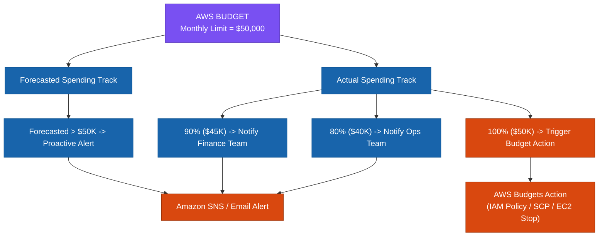

---

# 23. Actual vs. Forecasted Budget

This is a common exam distinction:

### Actual Budget Alert:
> *“We have already spent too much.”*
$$\text{Actual spending} \longrightarrow \text{Threshold reached} \longrightarrow \text{Alert}$$

### Forecasted Budget Alert:
> *“Based on current trends, we are likely to exceed the budget.”*
$$\text{Current trend} \longrightarrow \text{Forecast calculation} \longrightarrow \text{Expected breach} \longrightarrow \text{Alert}$$

Forecast-based alerts are valuable because you can act **before** the bill arrives. AWS Budgets supports both actual and forecasted spend alerts. ([AWS Documentation](https://docs.aws.amazon.com/cost-management/latest/userguide/budgets-managing-costs.html?utm_source=chatgpt.com "Managing your costs with AWS Budgets - AWS Cost Management"))

---

# 24. Budgets Can Be More Than Cost

Don't think only in terms of cost budgets. AWS Budgets can track:
- **Cost Budgets**
- **Usage Budgets** (e.g., S3 storage GBs, EC2 hours)
- **Reserved Instance (RI) Utilization Budgets**
- **Reserved Instance (RI) Coverage Budgets**
- **Savings Plans Utilization Budgets**
- **Savings Plans Coverage Budgets**

AWS documents budgets for cost/usage and aggregate RI or Savings Plans utilization and coverage. ([AWS Documentation](https://docs.aws.amazon.com/cost-management/latest/userguide/budgets-managing-costs.html?utm_source=chatgpt.com "Managing your costs with AWS Budgets - AWS Cost Management"))

Therefore:
> **Budget $\ne$ simply “monthly dollar limit.”**

---

# 25. Budgets — Operational Overhead

Low. You define:
$$\text{Budget} + \text{Threshold} + \text{Notification} + \text{Optional Action} \longrightarrow \text{AWS Manages Monitoring}$$

AWS manages the monitoring. This is much simpler than building custom billing monitors with Lambda, databases, schedulers, and dashboards.

---

# 26. Budgets — Trade-Off

The important trade-off is:
> **Alerting versus Automatic Enforcement.**

- **Notification**: Budget exceeded $\longrightarrow$ Email / SNS alert.
- **Action**: Budget threshold breached $\longrightarrow$ Restrict or modify resources/permissions automatically.

AWS Budgets supports custom actions that can help prevent overages, and AWS documents actions involving IAM policies, SCPs, and resources. ([Amazon Web Services, Inc.](https://aws.amazon.com/aws-cost-management/aws-budgets/?nc2=h_l3_dm&utm_source=chatgpt.com "Set Custom Cost and Usage Budgets – AWS Budgets – Amazon Web Services"))

> [!CAUTION]
> **Automatic Action Risk**: An automatic action that shuts down production instances or applies restrictive SCPs can cause catastrophic application outages. Cost optimization must not blindly sacrifice availability or business requirements.

---

# 27. Budget Is Not Cost Explorer

| Requirement | Best Tool |
| :--- | :--- |
| **Estimate a new architecture** | **AWS Pricing Calculator** |
| **Analyze current spending** | **AWS Cost Explorer** |
| **Alert when spending approaches limit** | **AWS Budgets** |
| **Identify optimization recommendations** | **AWS Trusted Advisor** |

- **Pricing Calculator** $\rightarrow$ *“How much?”*
- **Cost Explorer** $\rightarrow$ *“Where did it go?”*
- **Budgets** $\rightarrow$ *“Are we exceeding our limit?”*
- **Trusted Advisor** $\rightarrow$ *“What should we optimize?”*

---

# 28. Option #4 — AWS Trusted Advisor

Now we reach the optimization problem. Suppose Cost Explorer tells you:
> *“EC2 = $40K/month”*

The architect still has to ask:
> *“Which EC2 resources are inefficient?”*

This is where Trusted Advisor helps. AWS Trusted Advisor evaluates AWS environments against best-practice checks across areas including cost optimization, performance, security, resilience, operational excellence, and service limits, and provides recommendations. ([Amazon Web Services, Inc.](https://aws.amazon.com/premiumsupport/technology/trusted-advisor/?track=costma&utm_source=chatgpt.com "Best Practice Guidance for AWS Optimization - AWS Trusted Advisor"))

---

# 29. Why Does Trusted Advisor Exist?

Because:
> **Visibility alone doesn't tell you what action to take.**

$$\text{Cost Explorer (Find cost driver)} \longrightarrow \text{Trusted Advisor (Find optimization opportunity)}$$

---

# 30. Trusted Advisor — Think "Recommendations"

The exam clue is:
> *“AWS automatically checks your environment against AWS best practices and recommends actions.”*  
> $\longrightarrow$ **AWS Trusted Advisor**.

It covers 6 pillars:
1. **Cost optimization** (e.g., idle RDS DB instances, unattached EBS volumes, underutilized EC2 instances).
2. **Performance**
3. **Security**
4. **Resilience / Fault Tolerance**
5. **Operational excellence**
6. **Service limits** ([Amazon Web Services, Inc.](https://aws.amazon.com/premiumsupport/technology/trusted-advisor/?track=costma&utm_source=chatgpt.com "Best Practice Guidance for AWS Optimization - AWS Trusted Advisor"))

---

# 31. Trusted Advisor — Example

Suppose:
- Instance A $\rightarrow$ heavily used
- Instance B $\rightarrow$ heavily used
- Instance C $\rightarrow$ barely used
- Instance D $\rightarrow$ unused

Cost Explorer states: *“EC2 spending = $30K”*.  
Trusted Advisor flags: *“Potential optimization opportunity: unused / underutilized resource”*.

Then the architect decides whether to terminate, resize, schedule, or change pricing models. Trusted Advisor provides the recommendation; it does **not** mean *“automatically change everything without validation”*.

---

# 32. Trusted Advisor — Operational Overhead

Very low from an infrastructure perspective. AWS performs the checks automatically. However:
> **Acting on recommendations creates operational work.**

$$\text{Trusted Advisor Recommendation} \longrightarrow \text{Architect Reviews} \longrightarrow \text{Change Architecture} \longrightarrow \text{Test} \longrightarrow \text{Deploy} \longrightarrow \text{Monitor}$$

Distinguish:
- **Tool operational overhead** $\rightarrow$ Low.
- **Optimization implementation effort** $\rightarrow$ Potentially high.

---

# 33. Trusted Advisor — Cost Trade-Off

The recommendation itself isn't the complete architecture. If Trusted Advisor suggests *“Downsize EC2”*, you must ask:
- What is the workload?
- What is the SLA?
- What is peak utilization?
- What happens during traffic spikes?
- Is this production with HA/DR requirements?

A recommendation optimized purely for cost can conflict with performance, reliability, availability, or security.

---

# 34. Cost Optimization Is NOT "Minimize Cost"

This is one of the most important ideas on the exam. AWS defines cost optimization as delivering business value at the lowest price point, but explicitly notes that cost decisions involve trade-offs such as speed-to-market versus cost. ([AWS Documentation](https://docs.aws.amazon.com/wellarchitected/latest/cost-optimization-pillar/definition.html?utm_source=chatgpt.com "Definition - Cost Optimization Pillar"))

- **BAD**: *“Always choose the cheapest option.”*
- **GOOD**: *“Choose the lowest cost that satisfies business requirements.”*

If the business requires 99.99% availability ($1,500/mo), selecting a 99.0% option ($1,000/mo) is not cost optimized; it is **under-engineered**.

---

# 35. The Cost Optimization Triangle

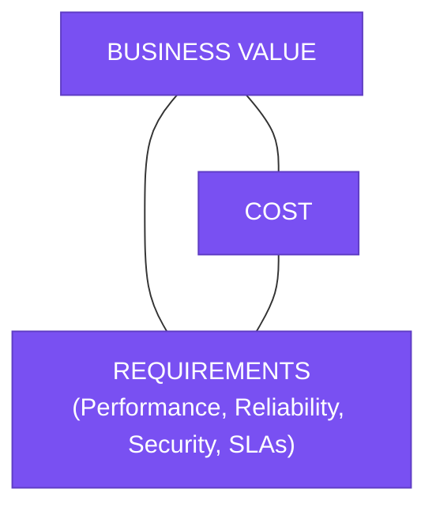

> **Goal**: Lowest cost while still completely satisfying the required business, performance, reliability, and security objectives.

---

# 36. Minimal Requirements Principle

Always ask:
> **What is the minimum capability required to satisfy the requirement?**

- *“Estimate the cost of a new workload”* $\longrightarrow$ **Pricing Calculator**.
- *“Alert when monthly spending exceeds $10,000”* $\longrightarrow$ **AWS Budgets**.
- *“Investigate why EC2 spending increased”* $\longrightarrow$ **Cost Explorer**.
- *“Identify AWS best-practice optimization opportunities”* $\longrightarrow$ **Trusted Advisor**.

---

# 37. The "Don't Over-Engineer" Rule

> **Use the simplest AWS managed capability that completely satisfies the requirement.**

Only introduce `Lambda + EventBridge + S3 + Athena + QuickSight` when the requirement explicitly demands custom automation or advanced analytics that native tools cannot provide.

---

# 38. Cost Visibility Architecture

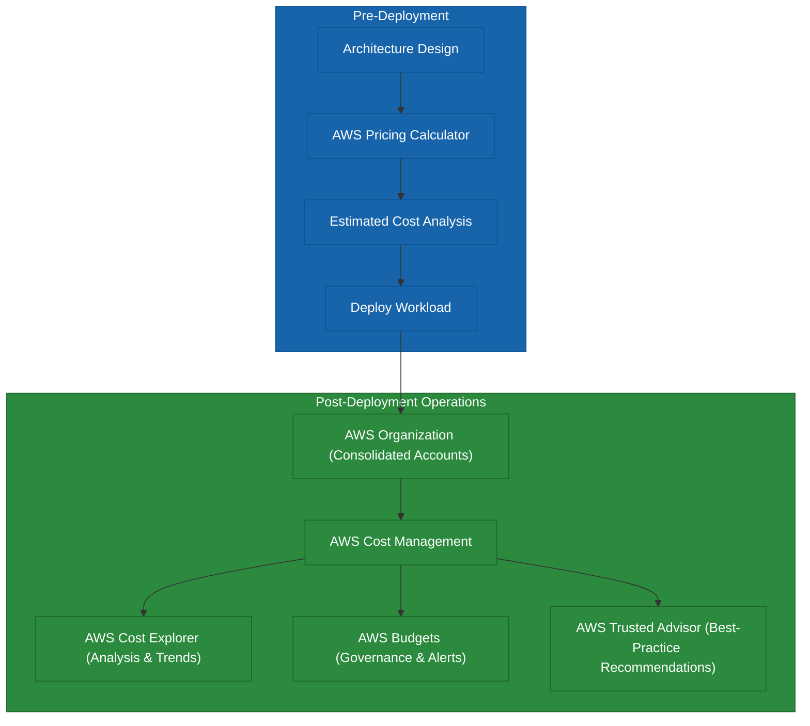

---

# 39. A Better Enterprise Cost Architecture

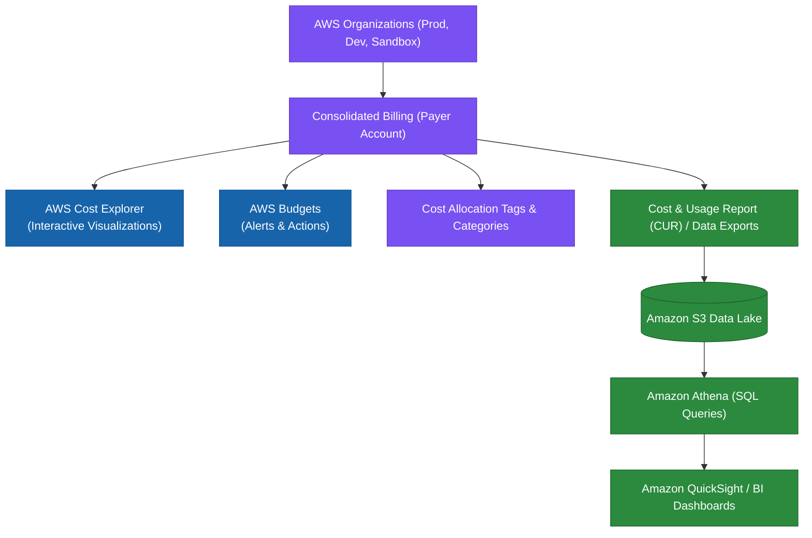

---

# 40. Cost Allocation

When finance asks *“How much does each business unit consume?”*, you need cost attribution. AWS supports cost allocation using mechanisms such as tags and account structure. AWS recommends allocating workload costs based on usage metrics or business outcomes so organizations can measure workload cost efficiency. ([AWS Documentation](https://docs.aws.amazon.com/wellarchitected/latest/cost-optimization-pillar/cost_monitor_usage_allocate_outcome.html?utm_source=chatgpt.com "COST03-BP06 Allocate costs based on workload metrics - Cost Optimization Pillar"))

---

# 41. Why Cost Allocation Matters

Without allocation:
- AWS = $1,000,000 (Nobody takes ownership).

With allocation:
- Product A $\rightarrow$ $400K
- Product B $\rightarrow$ $300K
- Product C $\rightarrow$ $200K
- Shared Services $\rightarrow$ $100K

$$\text{Visibility} \longrightarrow \text{Ownership} \longrightarrow \text{Optimization}$$

---

# 42. Account Structure Is Also a Cost Tool

Separate AWS accounts under AWS Organizations provide:
- Isolation
- Governance
- Direct cost attribution
- Blast-radius control

---

# 43. Consolidated Billing

With consolidated billing, the organization gets a single centralized billing view and can benefit from volume discount tiering across accounts (e.g., aggregated S3 storage tiers).

> **AWS Organizations + Consolidated Billing = Fundamental enterprise cost foundation.**

---

# 44. Cost Categories

Cost Categories map AWS accounts, tags, and charge types into business-oriented categories (e.g., Business Units: Payments, Retail, Analytics):
$$\text{AWS Accounts / Tags} \longrightarrow \text{Cost Categories} \longrightarrow \text{Business Unit Reporting}$$

---

# 45. Cost Explorer vs. Cost and Usage Report (CUR)

- **Cost Explorer**: Fast, interactive human analysis in the AWS console.
- **Cost and Usage Report (CUR) / Data Exports**: Detailed raw billing metadata exported to Amazon S3 for custom big-data pipelines and enterprise BI integration.

---

# 46. When Should You Build a Custom Cost Dashboard?

Ask first: *“Can Cost Explorer satisfy the requirement?”*
- If yes $\longrightarrow$ **Use Cost Explorer**.
- If no $\longrightarrow$ **CUR + S3 + Athena + QuickSight**.

The SAP-C02 exam rewards **avoiding unnecessary operational complexity**.

---

# 47. Relationship Between the Four Core Tools

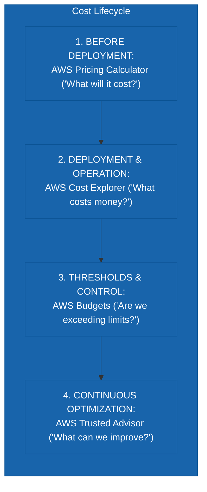

---

# 48. Cost Optimization Feedback Loop

$$\text{PLAN (Estimate)} \longrightarrow \text{BUILD} \longrightarrow \text{MEASURE} \longrightarrow \text{ANALYZE} \longrightarrow \text{OPTIMIZE} \longrightarrow \text{REPEAT}$$

AWS explicitly treats cost optimization as an ongoing practice, including regular workload review and optimization over time. ([AWS Documentation](https://docs.aws.amazon.com/wellarchitected/latest/cost-optimization-pillar/definition.html?utm_source=chatgpt.com "Definition - Cost Optimization Pillar"))

---

# 49. Real SAP-C02 Scenario: Migration Cost Estimation
- **Scenario**: A company plans to migrate an application to AWS. The architecture team needs to estimate monthly costs before deployment and compare several architecture options.
- **Answer**: **AWS Pricing Calculator** (No actual AWS usage exists yet to analyze).

---

# 50. Scenario: Unexpected Cost Increase
- **Scenario**: AWS spending increased significantly this month. The architect needs to identify which services and accounts caused the increase.
- **Answer**: **AWS Cost Explorer** (Analyze actual historical spending).

---

# 51. Scenario: Spending Threshold
- **Scenario**: The company wants an alert when monthly AWS spending is forecast to exceed $100,000.
- **Answer**: **AWS Budgets** (Keyword: *threshold / alert / forecasted spend*).

---

# 52. Scenario: Find Optimization Opportunities
- **Scenario**: The company wants AWS best-practice recommendations for unused or inefficient resources.
- **Answer**: **AWS Trusted Advisor** (Keyword: *recommendations*).

---

# 53. Scenario: Custom Enterprise Cost Dashboard
- **Scenario**: Finance requires detailed cost data exported to an S3-based data lake for custom reporting and analysis.
- **Answer**: **CUR / Data Exports $\rightarrow$ Amazon S3 $\rightarrow$ Amazon Athena / QuickSight**.

---

# 54. Scenario: Cost Ownership
- **Scenario**: The company wants to allocate AWS costs to individual teams and business units.
- **Answer**: **Accounts + Cost Allocation Tags + Cost Categories + Cost Explorer**.

---

# 55. Scenario: Prevent Overspending
- **Scenario**: A development account should receive an alert when spending reaches 80% of its monthly budget and take a predefined action if the threshold is exceeded.
- **Answer**: **AWS Budgets (with Budget Actions)**.

---

# 56. Trusted Advisor vs. Cost Explorer
- **Cost Explorer** $\longrightarrow$ Data $\rightarrow$ Analyze (*Where is money going?*).
- **Trusted Advisor** $\longrightarrow$ Best Practices $\rightarrow$ Recommendations (*What should we optimize?*).

---

# 57. Budgets vs. Cost Explorer
- **Cost Explorer**: *“What happened?”* (Historical analysis).
- **Budgets**: *“What limit did we set, and are we approaching it?”* (Threshold enforcement).

---

# 58. Pricing Calculator vs. Cost Explorer
- **Pricing Calculator**: New architecture $\rightarrow$ Estimate.
- **Cost Explorer**: Running architecture $\rightarrow$ Actual cost analysis.

---

# 59. Cost Tool Decision Tree (Mental Model)

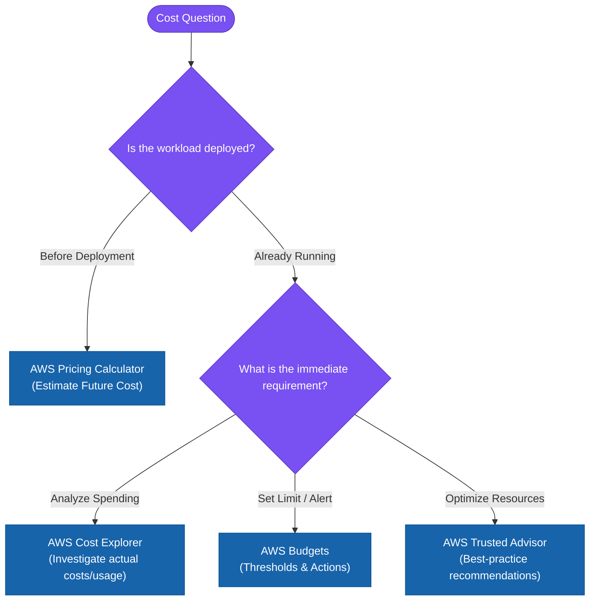

---

# 60. More Detailed Decision Tree

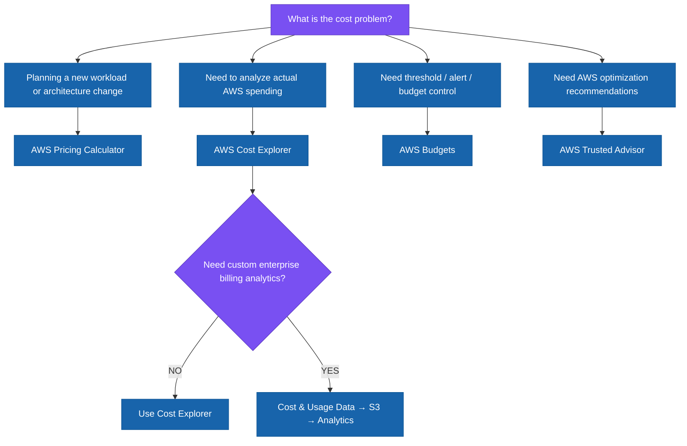

---

# 61. Cost Perspective — Compare the Tools

| Tool | Primary Question | Stage | Operational Overhead | Main Trade-Off |
| :--- | :--- | :--- | :---: | :--- |
| **Pricing Calculator** | What will it cost? | Before deployment | Very Low | Estimate depends on workload assumptions |
| **Cost Explorer** | Where is money going? | After deployment | Very Low | Less suitable for custom enterprise data lake analytics |
| **AWS Budgets** | Are we exceeding our limit? | During operation | Low | Automatic actions require caution |
| **Trusted Advisor** | What should we optimize? | During operation | Very Low | Recommendations still require validation |
| **CUR / Data Exports** | Give me detailed cost data | Ongoing | Medium | More flexibility, more architecture |
| **Cost Categories** | How do costs map to business units? | Ongoing | Low–Medium | Requires clear categorization strategy |

---

# 62. Cost vs. Operational Overhead

$$\text{Pricing Calculator (Lowest Complexity)} \longrightarrow \text{AWS Budgets} \longrightarrow \text{Cost Explorer} \longrightarrow \text{CUR + S3 + Athena (Highest Customization)}$$

> **Principle**: Use the lowest-complexity solution that completely satisfies the requirement.

---

# 63. Don't Confuse Cost Visibility With Cost Optimization

- **VISIBILITY** $\rightarrow$ *“I know what I'm spending.”*
- **CONTROL** $\rightarrow$ *“I can detect when spending exceeds limits.”*
- **OPTIMIZATION** $\rightarrow$ *“I can identify and implement ways to reduce cost.”*
- **GOVERNANCE** $\rightarrow$ *“I can make cost management part of organizational policy.”*

---

# 64. The Broader AWS Cost Ecosystem

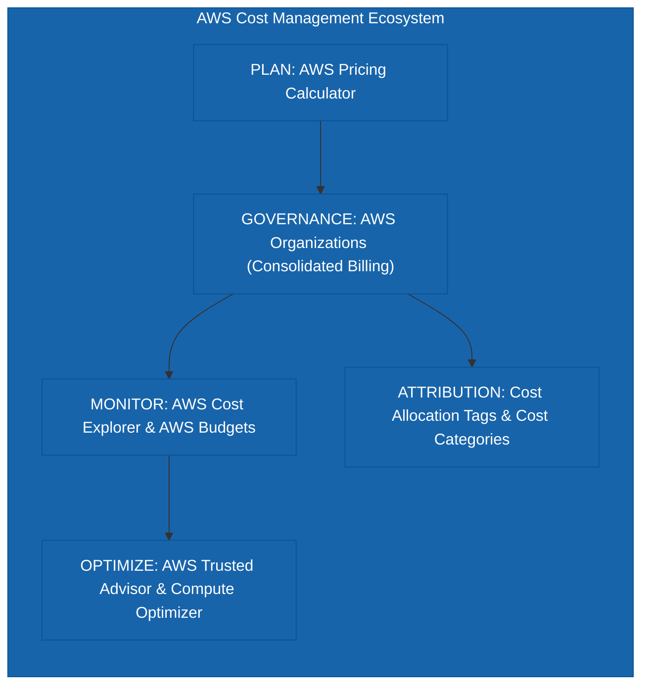

---

# 65. Related Service — AWS Organizations

Enterprise cost management leverages **AWS Organizations** for centralized governance, consolidated billing, and account-level cost visibility. When an exam question mentions *“hundreds of AWS accounts”*, think **AWS Organizations** alongside cost management tools.

---

# 66. Related Service — AWS Cost Anomaly Detection

- **AWS Budgets**: *“Alert me when spending reaches a known threshold (e.g., $100K).”*
- **AWS Cost Anomaly Detection**: *“Detect unusual spending patterns automatically using machine learning.”*

AWS includes Cost Anomaly Detection as part of its broader cost-management capabilities. ([Amazon Web Services, Inc.](https://aws.amazon.com/aws-cost-management/?utm_source=chatgpt.com "AWS Cloud Financial Management | Amazon Web Services"))

---

# 67. Budgets vs. Cost Anomaly Detection

- **Budget**: Expected limit $\rightarrow$ $50K/month $\rightarrow$ Threshold alert.
- **Anomaly Detection**: Normal behavior ($10K/day) suddenly spikes to $40K/day $\rightarrow$ Anomaly alert (even if the monthly budget is not yet breached).

> **Budgets = Threshold-based control**  
> **Anomaly Detection = Unusual-spending detection**

---

# 68. Related Service — AWS Compute Optimizer

- **Trusted Advisor**: Broad AWS best-practice recommendations across cost, performance, security, and fault tolerance.
- **Compute Optimizer**: Deep machine-learning recommendations for rightsizing EC2, Auto Scaling groups, EBS volumes, and Lambda functions based on utilization metrics.

---

# 69. Related Service — Savings Plans

Cost optimization involves optimizing pricing models:
$$\text{On-Demand Usage} \longrightarrow \text{Analyze Baseline in Cost Explorer} \longrightarrow \text{Commit to Savings Plans / RIs}$$

> **Commit only when you have sufficient confidence in predictable long-term baseline usage.**

---

# 70. Pricing Model Trade-Offs

- **On-Demand**: Maximum flexibility, zero commitment $\longleftrightarrow$ Higher unit cost.
- **Savings Plans / RIs**: Lower unit cost $\longleftrightarrow$ 1-year or 3-year commitment, risk of underutilization.

---

# 71. Spot Instances

For fault-tolerant, stateless, or batch workloads that can tolerate interruption, **Spot Instances** provide up to 90% cost savings compared to On-Demand.

---

# 72. Elasticity Is a Cost Strategy

> **Don't pay for capacity you don't need: Match supply to demand dynamically.**

$$\text{Static Capacity (100 instances 24/7)} \quad \text{vs.} \quad \text{Elastic Auto Scaling (10} \rightarrow 100 \rightarrow \text{10 instances)}$$

AWS's Cost Optimization guidance explicitly recommends dynamically supplying resources to match demand and avoiding unnecessary overprovisioning. ([AWS Documentation](https://docs.aws.amazon.com/wellarchitected/latest/cost-optimization-pillar/manage-demand-and-supply-resources.html?utm_source=chatgpt.com "Manage demand and supply resources - Cost Optimization Pillar"))

---

# 73. Auto Scaling and Cost

Auto Scaling applies across EC2, ECS, DynamoDB, and Aurora Serverless. Always evaluate startup times and SLAs before scaling down aggressively.

---

# 74. Storage Is Also a Cost Optimization Problem

$$\text{Frequently Accessed (S3 Standard)} \longrightarrow \text{Infrequently Accessed (S3 Standard-IA)} \longrightarrow \text{Archived (S3 Glacier Deep Archive)}$$

Match storage classes to access patterns.

---

# 75. Data Transfer Is a Major Cost Consideration

Architects must consider:
- Cross-AZ traffic
- Cross-Region traffic
- Internet egress
- NAT Gateway data processing fees
- Centralized traffic inspection topology

AWS's Cost Optimization pillar explicitly includes data-transfer cost planning as a dedicated best-practice area. ([AWS Documentation](https://docs.aws.amazon.com/wellarchitected/2025-02-25/framework/the-pillars-of-the-framework.html?utm_source=chatgpt.com "The pillars of the framework - AWS Well-Architected Framework"))

---

# 76. Cost Optimization Can Conflict With Other Pillars

> **Cost optimization is always constrained by performance, reliability, availability, and security.**

Choosing an architecture purely for cost that fails business SLAs or availability requirements is an architectural failure.

---

# 77. Cost Optimization vs. Operational Overhead

When choosing between:
- A: Self-managed cost-monitoring platform
- B: Managed AWS Cost Explorer + Budgets

**Choose B**: Managed services eliminate undifferentiated heavy lifting, reducing total operational cost. ([AWS Documentation](https://docs.aws.amazon.com/wellarchitected/latest/cost-optimization-pillar/design-principles.html?utm_source=chatgpt.com "Design principles - Cost Optimization Pillar"))

---

# 78. The "Five Questions" Framework

For every cost-management service, ask:
1. **WHY DOES IT EXIST?**
2. **WHAT PROBLEM DOES IT SOLVE?**
3. **WHAT IS THE MINIMUM REQUIREMENT?**
4. **WHAT OPERATIONAL OVERHEAD DOES IT ADD?**
5. **WHAT IS THE COST / TRADE-OFF?**

---

# 79. Apply the Five Questions — Pricing Calculator
- **WHY?** Estimate future cost.
- **PROBLEM?** Avoid deploying an architecture without understanding cost.
- **MINIMUM?** Need cost estimate before deployment.
- **OVERHEAD?** Very low.
- **TRADE-OFF?** Estimate depends on assumptions.

---

# 80. Apply the Five Questions — Cost Explorer
- **WHY?** Understand actual AWS spending.
- **PROBLEM?** AWS bill is too aggregated to explain cost drivers.
- **MINIMUM?** Need interactive cost analysis.
- **OVERHEAD?** Very low.
- **TRADE-OFF?** Custom enterprise analytics may require additional data architecture.

---

# 81. Apply the Five Questions — Budgets
- **WHY?** Set spending limits.
- **PROBLEM?** Unexpected or excessive spending.
- **MINIMUM?** Define budget + threshold + notification.
- **OVERHEAD?** Low.
- **TRADE-OFF?** Automatic actions can have unintended operational consequences.

---

# 82. Apply the Five Questions — Trusted Advisor
- **WHY?** Identify AWS best-practice deviations.
- **PROBLEM?** Teams don't know where optimization opportunities exist.
- **MINIMUM?** Enable/use appropriate Trusted Advisor checks.
- **OVERHEAD?** Very low for the checking itself.
- **TRADE-OFF?** Recommendations require human validation and implementation.

---

# 83. The Cost Optimization Operating Model

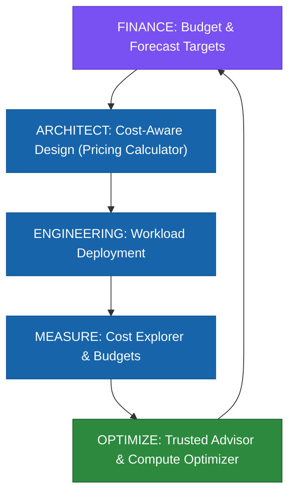

This is **Cloud Financial Management / FinOps thinking**. AWS's Well-Architected guidance emphasizes ownership, budgets, cost awareness, monitoring, allocation, and continuous optimization rather than treating cost as a one-time exercise. ([AWS Documentation](https://docs.aws.amazon.com/wellarchitected/2025-02-25/framework/the-pillars-of-the-framework.html?utm_source=chatgpt.com "The pillars of the framework - AWS Well-Architected Framework"))

---

# 84. Exam Trap — Cheapest Doesn't Mean Correct
Don't automatically select the cheapest service if it fails availability, performance, or SLA requirements.

---

# 85. Exam Trap — Don't Build What AWS Already Provides
- Need monthly cost alerts? $\longrightarrow$ **AWS Budgets** (NOT custom CloudWatch + Lambda).
- Need cost breakdown by service? $\longrightarrow$ **AWS Cost Explorer**.

---

# 86. Exam Trap — Estimate vs. Actual
- *“Estimate”* $\longrightarrow$ **Pricing Calculator**.
- *“Actual spending”* $\longrightarrow$ **Cost Explorer**.
- *“Forecasted budget breach”* $\longrightarrow$ **AWS Budgets**.

---

# 87. Exam Trap — Recommendation vs. Analysis
- *“Show me spending”* $\longrightarrow$ **Cost Explorer**.
- *“Recommend optimization”* $\longrightarrow$ **Trusted Advisor**.

---

# 88. Exam Trap — Budget vs. Anomaly
- *“Alert at $100K”* $\longrightarrow$ **AWS Budgets**.
- *“Detect unusual spending”* $\longrightarrow$ **Cost Anomaly Detection**.

---

# 89. Exam Trap — Custom Reporting
If the requirement explicitly asks for a custom data pipeline or BI data lake $\longrightarrow$ **CUR + S3 + Athena + QuickSight**.

---

---

## 90.1 AWS Organizations Consolidated Billing — Reserved Instance & Savings Plans Discount Sharing

By default, the consolidated billing feature of **AWS Organizations** treats all member accounts in an organization as a single billing entity. This means hourly cost-benefit discounts from **Reserved Instances (RIs)** or **Savings Plans (SPs)** purchased by one member account automatically apply to eligible usage in all other member accounts across the organization.

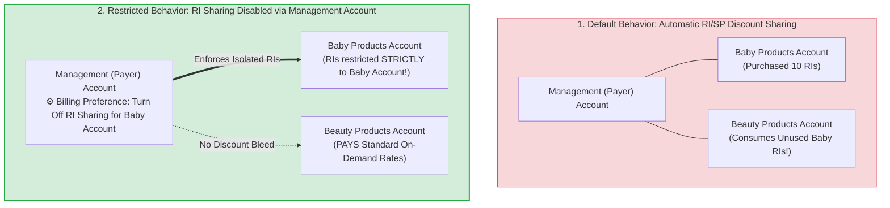

### Key Technical Rationale:
1. **Management (Payer) Account Central Control**: **Only the Management (Payer) Account** has administrative access to turn off Reserved Instance and Savings Plans discount sharing preferences in the AWS Billing & Cost Management Console.
2. **Member Account Limitation**: Individual member accounts **CANNOT** modify RI or Savings Plans discount sharing settings locally in their member billing consoles.
3. **No Account Isolation Required**: Turning off RI sharing on the Management Account isolates discount application without needing to remove member accounts from AWS Organizations or break consolidated billing.

---

## 94.1 Real-World Exam Scenario: Restricting Reserved Instance Discounts to a Specific Business Unit Account

- **Scenario**: A multinational corporation uses AWS Organizations consolidated billing across Business Unit accounts (Beauty, Baby, Health, Home Care). The Baby products BU purchased 10 Reserved Instances for a new supply chain application going live in 3 months. The team does NOT want their RI discounts shared with or consumed by other business units in the organization. What is the most suitable solution?
- **Architecture Solution**:
  - **Turn off Reserved Instance (RI) discount sharing on the Management (Payer) account** for the member accounts in the Baby products business unit.

### Why Distractor Options Fail:
- *Set RI sharing to private on the member account (Your Selection)*: Member accounts do NOT have a "private" setting or control over RI discount sharing in their local Billing Console. Discount sharing preferences can ONLY be modified at the **Management (Payer) Account** level.
- *Remove the member account from AWS Organization*: Removing the account breaks consolidated billing, central security SCPs, IAM Identity Center SSO, and organizational governance. Turning off RI sharing in the Management Account achieves the goal natively without altering account membership.
- *RI sharing is mandatory and cannot be disabled*: False. AWS explicitly provides a toggle in the Management Account Billing Console Preferences to enable or disable RI/Savings Plans discount sharing for individual member accounts.

---

# 91. Exam Trap — Commitment Purchase
Analyze usage in **Cost Explorer** first before committing to Savings Plans or RIs.

---

# 92. Final Decision Matrix

| Requirement | Primary Answer | Why |
| :--- | :--- | :--- |
| **Estimate new architecture cost** | **Pricing Calculator** | Future cost modeling |
| **Compare architecture costs** | **Pricing Calculator** | Scenario comparison |
| **Analyze current AWS bill** | **Cost Explorer** | Actual cost/usage analysis |
| **Find cost trend** | **Cost Explorer** | Historical analysis |
| **Forecast spending** | **Cost Explorer** | Historical-based forecasting |
| **Set monthly spending limit** | **AWS Budgets** | Budget thresholds |
| **Alert on forecasted overspending** | **AWS Budgets** | Forecast budget alerts |
| **Track RI/SP utilization** | **AWS Budgets** | Coverage/utilization budgets |
| **Isolate RI/SP discounts to single account** | **Management Account Billing Preferences** | Turn off RI sharing in Payer account |
| **Find AWS best-practice recommendations** | **Trusted Advisor** | Automated best-practice checks |
| **Detect unusual spending** | **Cost Anomaly Detection** | Anomaly detection |
| **Rightsize resources** | **Compute Optimizer** | Resource recommendations |
| **Custom billing data lake** | **CUR / Data Exports + S3** | Detailed data pipeline |
| **Business cost attribution** | **Tags / Cost Categories / Accounts** | Allocation |
| **Multi-account billing** | **AWS Organizations** | Centralized organization/billing model |

---

# 93. 🧠 The Ultimate SAP-C02 Cost Mental Model

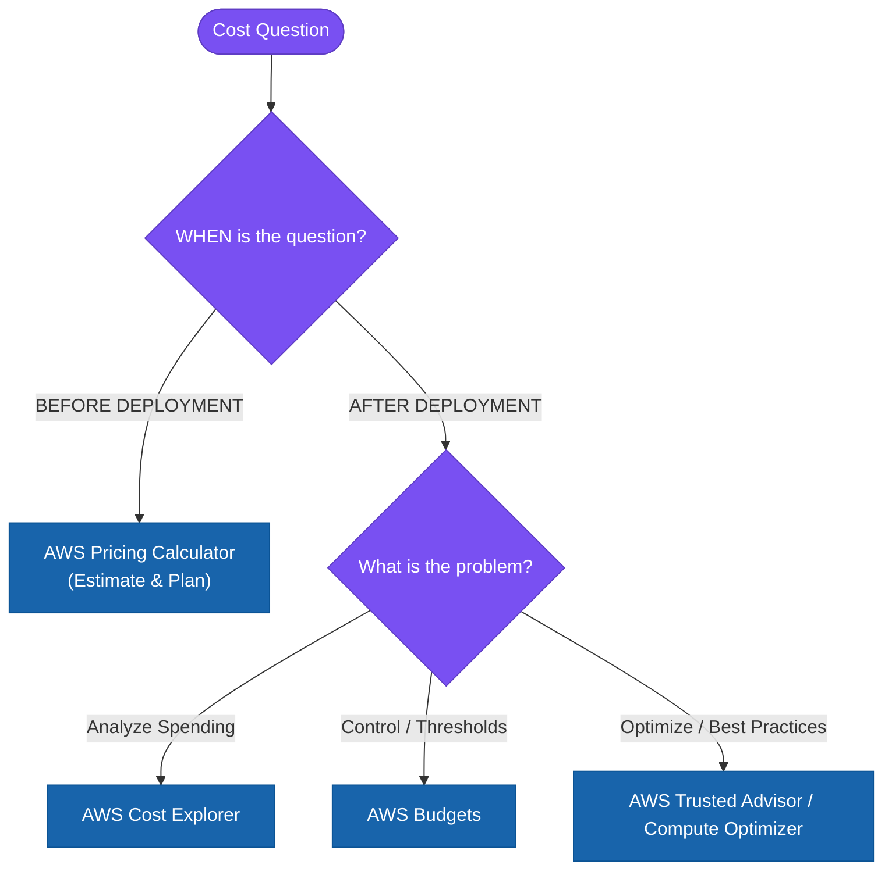

---

# 94. 🏆 Final AWS SAP-C02 Cheat Sheet

| If the question says... | Think... |
| :--- | :--- |
| **“How much will it cost?”** | **Pricing Calculator** |
| **“Estimate a new architecture”** | **Pricing Calculator** |
| **“Compare architecture costs”** | **Pricing Calculator** |
| **“Analyze AWS spending”** | **Cost Explorer** |
| **“Which service/account is driving cost?”** | **Cost Explorer** |
| **“Forecast future AWS cost”** | **Cost Explorer** |
| **“Set a spending threshold”** | **AWS Budgets** |
| **“Alert when budget is exceeded”** | **AWS Budgets** |
| **“Forecasted budget breach”** | **AWS Budgets** |
| **“Track Savings Plans / RI coverage”** | **AWS Budgets** |
| **“AWS best-practice recommendations”** | **Trusted Advisor** |
| **“Identify unused/underutilized resources”** | **Trusted Advisor** |
| **“Rightsizing recommendations”** | **Compute Optimizer** |
| **“Unexpected spending”** | **Cost Anomaly Detection** |
| **“Detailed billing data in S3”** | **CUR / Data Exports** |
| **“Business-unit cost allocation”** | **Tags / Cost Categories** |
| **“Many AWS accounts / centralized billing”** | **AWS Organizations** |

---

# 95. The Golden Exam Rule

> **Don't optimize cost blindly. Optimize the cost of delivering the required business outcome.**

Remember the lifecycle:
$$\text{PLAN (Pricing Calculator)} \longrightarrow \text{BUILD} \longrightarrow \text{MEASURE (Cost Explorer)} \longrightarrow \text{CONTROL (Budgets)} \longrightarrow \text{OPTIMIZE (Trusted Advisor)} \longrightarrow \text{ATTRIBUTE (Tags/Categories)} \longrightarrow \text{REVIEW}$$

The deepest SAP-C02 lesson is:
> **Cost optimization is an architectural concern, not a billing-team-only concern.**

A strong Solutions Architect considers cost **before deployment**, makes costs **visible during operation**, establishes **guardrails against unexpected spending**, and continuously evaluates whether the architecture is still delivering the required business value at the appropriate cost. AWS's Well-Architected guidance explicitly treats cost optimization as an ongoing discipline with trade-offs against speed, performance, reliability, and other business requirements. ([AWS Documentation](https://docs.aws.amazon.com/wellarchitected/latest/cost-optimization-pillar/definition.html?utm_source=chatgpt.com "Definition - Cost Optimization Pillar"))

**One-line memory trick:**
- **Pricing Calculator = PLAN**
- **Cost Explorer = SEE**
- **Budgets = CONTROL**
- **Trusted Advisor = OPTIMIZE**

---

### Official AWS References:
- [AWS Cost Management](https://aws.amazon.com/aws-cost-management/?utm_source=chatgpt.com)
- [AWS Pricing Calculator](https://aws.amazon.com/aws-cost-management/aws-pricing-calculator/?utm_source=chatgpt.com)
- [AWS Cost Explorer](https://aws.amazon.com/aws-cost-management/aws-cost-explorer/features/?utm_source=chatgpt.com)
- [AWS Budgets](https://aws.amazon.com/aws-cost-management/aws-budgets/?nc2=h_l3_dm&utm_source=chatgpt.com)
- [AWS Trusted Advisor](https://aws.amazon.com/premiumsupport/technology/trusted-advisor/?track=costma&utm_source=chatgpt.com)