# AWS — Task 1.5: AWS Purchasing Options

> **Domain Focus**: AWS Certified Solutions Architect – Professional (SAP-C02) & Cloud Financial Management  
> **Core Architectural Mindset**: Do not simply memorize *“RI = discount, Savings Plans = discount, Spot = cheap.”* Instead, evaluate:
> $$\text{“How predictable is my workload, how flexible is it, what interruption risk can it tolerate, and how much commitment am I willing to make in exchange for lower cost?”}$$

The major purchasing options you should understand are:
1. **On-Demand**
2. **Reserved Instances (RIs)**
3. **Savings Plans**
4. **Spot Instances**
5. **Dedicated Hosts / Dedicated Instances** — for specific tenancy, BYOL licensing, and compliance requirements (not primarily a discount mechanism).
6. **AWS Free Tier** — useful for learning/small workloads, but not an enterprise purchasing strategy.

The most important exam comparison is:
$$\text{On-Demand} \quad \text{vs.} \quad \text{Reserved Instances} \quad \text{vs.} \quad \text{Savings Plans} \quad \text{vs.} \quad \text{Spot Instances}$$

---

# 1. First Understand the Problem

Imagine an organization runs compute workloads:


Suppose the monthly compute bill is **$100,000**. The architect discovers:
- **30%** = Predictable baseline (runs 24/7/365).
- **40%** = Variable workload (scales with business hours).
- **20%** = Batch processing & data pipelines (fault-tolerant).
- **10%** = Experimental & temporary development.

Now ask:
> *“Can we reduce the unit cost?”*

Yes, but the optimal purchasing option strictly depends on the workload's operational profile.

---

# 2. The Fundamental AWS Purchasing Model

Think about compute purchasing as a spectrum balancing **Flexibility**, **Commitment**, and **Interruption Risk**:

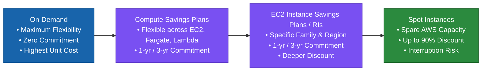

### Core Spectrum Rules:
- **On-Demand**: Highest flexibility $\rightarrow$ No long-term commitment $\rightarrow$ Baseline hourly pricing.
- **Reserved / Savings Plans**: Commitment $\rightarrow$ Reduced flexibility $\rightarrow$ Lower effective cost.
- **Spot**: Highest interruption risk $\rightarrow$ No commitment $\rightarrow$ Potentially very large discount (up to 90%).

> [!IMPORTANT]
> **Fundamental Cloud Economics Rule**: Lower cost usually comes with some form of commitment, reduced flexibility, or interruption risk.

---

# 3. Why Do Purchasing Options Exist?

AWS has a fundamental economic problem to solve. Some workloads are:
- **Always running**: 24 × 7 × 365 days.
- **Running occasionally**: Short-term, sporadic tasks.
- **Highly variable**: Spiky daytime traffic.
- **Fault-tolerant batch jobs**: Non-urgent asynchronous processing.

It would be inefficient to give all workloads the same pricing model. Therefore, AWS matches economic models to workload profiles:

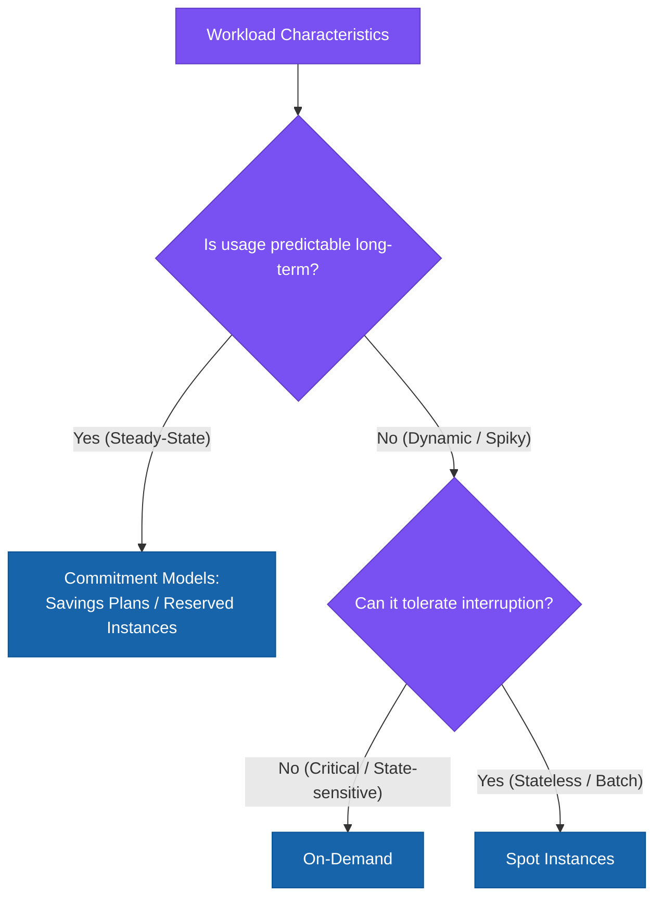

---

# 4. The First Question: How Predictable Is the Workload?

This is the single most important SAP-C02 purchasing question:
> **“Do I know that I will need this compute capacity for a long period?”**

- **YES** $\longrightarrow$ **Reserved Instances / Savings Plans**.
- **NO** $\longrightarrow$ **On-Demand**.
- **I need it, but it can be interrupted without business harm** $\longrightarrow$ **Spot Instances**.

---

# 5. On-Demand — The Baseline

Before discussing discounts, understand the baseline. On-Demand means:
> **Pay for compute capacity by the second/hour without a long-term commitment.**

$$\text{Need capacity} \longrightarrow \text{Launch On-Demand} \longrightarrow \text{Use resources} \longrightarrow \text{Pay for exact duration} \longrightarrow \text{Stop / Terminate}$$

---

# 6. Why Does On-Demand Exist?

Because AWS cannot assume that every workload is predictable. Examples include:
- New applications with unknown adoption.
- Temporary migration cutover workloads.
- Development and test environments.
- Short-term proof-of-concepts (PoCs).
- Sudden unpredictable traffic spikes exceeding baseline.

You do not want to commit for 1 or 3 years when long-term requirements are uncertain.

---

# 7. On-Demand Solves the Flexibility Problem

Suppose a new application is launched. You don't know whether it will require 5 instances or 100 instances. Making a 3-year commitment on day one is financially dangerous.

$$\text{New Application} \longrightarrow \text{Run On-Demand} \longrightarrow \text{Observe Usage Patterns (30–90 Days)} \longrightarrow \text{Establish Baseline} \longrightarrow \text{Commit}$$

---

# 8. On-Demand — Operational Overhead

Very low. There is no purchasing commitment to manage, track, or renew:
$$\text{Launch} \longrightarrow \text{Use} \longrightarrow \text{Scale} \longrightarrow \text{Terminate}$$

However, the **cost per unit of compute is generally the highest**.

---

# 9. On-Demand — Trade-Off

| Advantage | Trade-Off |
| :--- | :--- |
| **Maximum flexibility** | Higher unit cost |
| **No long-term commitment** | Zero commitment discounts |
| **Ideal for unpredictable workloads** | Expensive for steady-state 24/7 workloads |
| **Instant provisioning & teardown** | Requires continuous cost monitoring to prevent sprawl |

> [!TIP]
> **Exam Principle**: On-Demand is not “bad.” It is the correct choice when flexibility is more valuable than commitment savings.

---

# 10. When Should You Choose On-Demand?

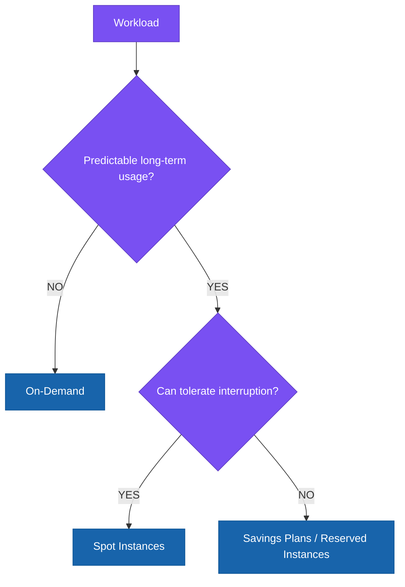

### Typical Exam Clues:
- *“Short-term”*
- *“Unpredictable”*
- *“New workload”*
- *“Cannot commit”*
- *“Variable usage”*  
$\longrightarrow$ **On-Demand**.

---

# 11. Option 2 — Reserved Instances (RIs)

Reserved Instances exist because AWS knows something important:
> *Many customers run the same compute capacity continuously for months or years.*

$$\text{EC2 / RDS Instance} \quad \xrightarrow{\quad\text{Runs 24/7/365}\quad} \quad \text{1 Year / 3 Years}$$

Paying On-Demand rates for steady-state predictable capacity is wasteful.

> **Reserved Instances**: Reserve capacity or commit to steady-state usage in exchange for a lower effective price.

---

# 12. What Problem Do Reserved Instances Solve?

For steady-state workloads (e.g., Core Production Databases):
- **On-Demand**: $$$$$$$$$$$$$$$$$$$$
- **Reserved Instances**: $$$$$$$$$$$$

The architectural idea is:
$$\text{Exchange Commitment for Lower Effective Cost}$$

---

# 13. Reserved Instance — The Commitment

The key word is **COMMITMENT**. You are committing to pay for steady usage over a specified duration:
- **1 Year**
- **3 Years** (Offers the highest discount)

$$\text{Higher Commitment Duration \& Upfront Payment} \quad \Longrightarrow \quad \text{Deeper Discount}$$

---

# 14. Why Not Use RI Everywhere?

Because workloads and architectures evolve:
- Today: 100 × instance type A
- Next year: 50 × instance type B (or migrated to Serverless/Containers)

If you commit blindly:
$$\text{Unused RI Commitment} \quad \Longrightarrow \quad \text{Wasted Financial Capital}$$

> **Commitment is only valuable when usage is sufficiently predictable.**

---

# 15. Reserved Instance — Operational Overhead

Infrastructure overhead is low, but **financial management overhead is moderate**:
- Term (1-yr vs. 3-yr)
- Payment Option (All Upfront, Partial Upfront, No Upfront)
- Instance Family & Size
- Region & Availability Zone
- Platform (Linux, Windows, SQL Server)
- Tenancy (Shared vs. Dedicated)
- Expiration and renewal tracking

---

# 16. Reserved Instance — Cost Perspective

$$\text{Net Benefit} = \text{Advertised Discount} - \text{Cost of Unused Commitment} - \text{Flexibility Lost}$$

A 60% discount on an instance that sits unused for 40% of the year yields negative ROI.

---

# 17. Reserved Instance — When It Makes Sense

- **Excellent Candidate**: Production Amazon RDS / Aurora database running 24/7/365 with stable CPU/RAM sizing.
- **Good Candidate**: EC2 instances with predictable instance families and stable long-term baseline.
- **Poor Candidate**: Temporary migration servers or short-lived dev/test environments.

---

# 18. Reserved Instances — Important Exam Detail

> [!WARNING]
> **Exam Distinction**: Reserved Instances are **not** universal across all AWS services. They are service-specific pricing mechanisms (e.g., EC2 RIs, RDS RIs, OpenSearch RIs, ElastiCache RIs, Redshift RIs). RIs do not cover Lambda or Fargate.

---

# 19. Savings Plans

Savings Plans exist to solve the rigidity problem of traditional Reserved Instances:
> *“Customers want commitment-based discounts, but also want architectural flexibility across instance families, operating systems, regions, and compute services.”*

### Core Definition:
Commit to a consistent amount of eligible compute spend (measured in **$/hour**, e.g., $10/hour) for a 1- or 3-year term, and receive discounted rates for all eligible usage up to that commitment.

---

# 20. Why Were Savings Plans Needed?

Modern architectures blend multiple compute abstractions:
$$\text{EC2 Instances} \quad + \quad \text{AWS Fargate (ECS/EKS)} \quad + \quad \text{AWS Lambda}$$

As teams modernize from EC2 to Fargate or Lambda, traditional EC2 RIs become underutilized. **Savings Plans** automatically apply discounts across these compute services without requiring manual exchanges.

---

# 21. Savings Plans — The Big Exam Idea

- **Reserved Instances (RIs)**: Tied to specific service instances and configurations.
- **Savings Plans**: Committed $/hour spend across eligible compute services with built-in flexibility.

---

# 22. Types of Savings Plans

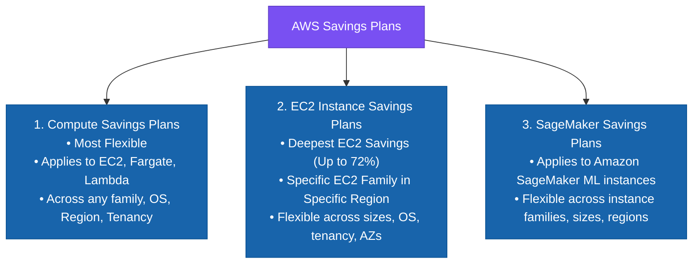

---

# 23. Compute Savings Plans

Compute Savings Plans provide the greatest architectural flexibility:
- **Eligible Services**: Amazon EC2, AWS Fargate, AWS Lambda.
- **Allowed Changes**:
  - Change instance family (e.g., `c6i` $\rightarrow$ `c7g` Graviton).
  - Change instance size (e.g., `xlarge` $\rightarrow$ `4xlarge`).
  - Change Region (e.g., `us-east-1` $\rightarrow$ `eu-west-1`).
  - Change Operating System (e.g., Windows $\rightarrow$ Linux).
  - Move compute from EC2 to Fargate or Lambda.

---

# 24. Compute Savings Plan — Why Does It Exist?

Suppose an enterprise currently spends $10/hour on EC2, but plans to refactor 50% of the workload to Fargate and 20% to Lambda over the next 12 months.

$$\text{Compute Savings Plan} \quad \Longrightarrow \quad \text{Applies continuously across EC2, Fargate, and Lambda automatically}$$

---

# 25. EC2 Instance Savings Plans

EC2 Instance Savings Plans provide deeper discounts (up to 72%) in exchange for committing to a **specific EC2 instance family in a specific Region** (e.g., `m7g` in `us-east-1`).

### What remains flexible:
- Instance size (e.g., `m7g.large` $\leftrightarrow$ `m7g.2xlarge`).
- Operating System (Windows $\leftrightarrow$ Linux).
- Tenancy (Default $\leftrightarrow$ Dedicated).
- Availability Zone within the specified Region.

---

# 26. Savings Plans vs. Reserved Instances

| Characteristic | Standard Reserved Instances | Compute Savings Plans | EC2 Instance Savings Plans |
| :--- | :--- | :--- | :--- |
| **Commitment Type** | Specific instance / capacity | Hourly compute spend ($/hr) | Hourly EC2 family spend ($/hr) |
| **Flexibility Level** | Lowest | **Highest** | Medium |
| **Amazon EC2** | ✅ Supported | ✅ Supported | ✅ Supported |
| **AWS Fargate** | ❌ Not Supported | ✅ Supported | ❌ Not Supported |
| **AWS Lambda** | ❌ Not Supported | ✅ Supported | ❌ Not Supported |
| **Change Region / Family** | ❌ Locked | ✅ Allowed | ❌ Locked to Family/Region |
| **Change Instance Size** | Limited by RI type | ✅ Full Flexibility | ✅ Full Flexibility within Family |
| **Best For** | Stable RDS / Redshift / EC2 | Dynamic multi-service compute | Stable EC2 family workloads |

---

# 27. Savings Plans — Operational Overhead

Infrastructure overhead is zero (managed by AWS billing engine). Financial management requires tracking two core metrics:
1. **Utilization**: Percentage of purchased commitment actively used.
2. **Coverage**: Percentage of total eligible compute covered by the plan.

---

# 28. Savings Plan Utilization

$$\text{Utilization} = \frac{\text{Actual Eligible Spend Applied}}{\text{Committed Spend Purchased}} \times 100$$

- Example: Purchased commitment = $100/hour. Actual eligible usage = $80/hour.
- **Utilization = 80%** (The remaining $20/hour is pure financial waste).

---

# 29. Savings Plan Coverage

$$\text{Coverage} = \frac{\text{Compute Spend Covered by Savings Plan}}{\text{Total Eligible Compute Spend}} \times 100$$

- Example: Total compute spend = $150/hour. Covered by Savings Plan = $100/hour.
- **Coverage = 66.7%** (The remaining $50/hour runs at On-Demand rates).

---

# 30. Utilization vs. Coverage

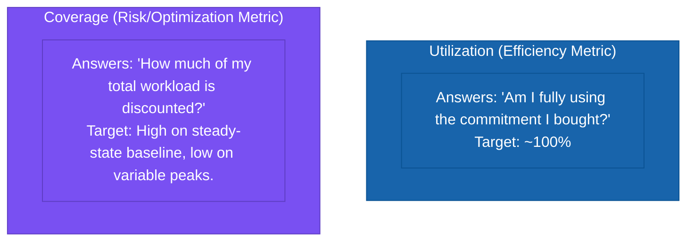

---

# 31. Spot Instances

Spot Instances allow you to request unused EC2 capacity at steep discounts (up to 90% off On-Demand rates).

> **The Fundamental Trade-Off**: In exchange for massive discounts, AWS can reclaim the instance with a **2-minute interruption warning** whenever capacity is needed back.

---

# 32. What Problem Does Spot Solve?

Workloads that are stateless, distributed, fault-tolerant, and capable of resuming work without data corruption:
- Big Data & Analytics (Amazon EMR, Apache Spark, Hadoop).
- Containerized workloads (Amazon EKS, Amazon ECS Spot tasks).
- CI/CD build agents (GitLab Runners, Jenkins workers).
- Image & video rendering farms.
- Machine Learning training & batch inference.
- High-Performance Computing (HPC) simulations.

---

# 33. Spot's Fundamental Trade-Off

$$\text{Massive Cost Savings (Up to 90\%)} \quad \longleftrightarrow \quad \text{2-Minute Interruption Risk}$$

Spot is not merely *“cheap EC2”*; it is an **architectural pattern** requiring interruption handling.

---

# 34. Spot Is an Architecture Decision

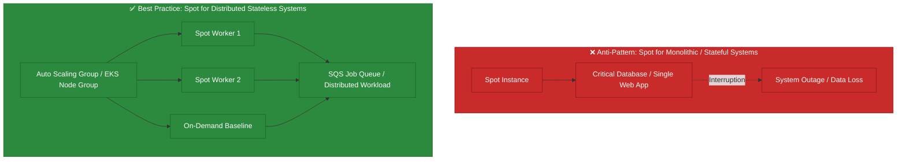

---

# 35. Spot — The Right Mental Model

Spot requires designing for:
- Stateless application tiers.
- Checkpointing progress to Amazon S3 or DynamoDB.
- Queue-based asynchronous decoupling (Amazon SQS).
- Graceful handling of `EC2 Spot Instance Interruption Warnings` (via EventBridge).

---

# 36. Spot and Auto Scaling

Using Auto Scaling Groups with mixed instances policies:
- **Base capacity**: On-Demand (guaranteed stability).
- **Burst / Scale-out capacity**: Spot Instances (maximum cost efficiency).

---

# 37. Spot Capacity Pools

A critical architectural best practice for Spot:
> **Diversify across multiple instance types and Availability Zones.**

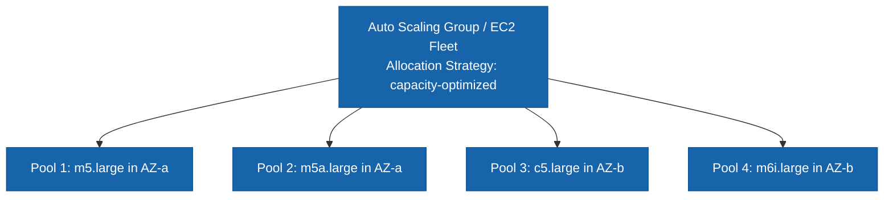

If one pool experiences high demand and reclaimed capacity, the other pools maintain availability.

---

# 38. Spot — Operational Overhead

Spot has low infrastructure management overhead, but **higher application design overhead**:
- Requires state externalization.
- Requires retry logic and dead-letter queues (DLQs).
- Requires multiple instance family configurations.

---

# 39. Spot — Cost Trade-Off

$$\text{Net Spot Value} = \text{Compute Savings} - \text{Interruption Handling Overhead} - \text{Cost of Retried Work}$$

---

# 40. Spot vs. On-Demand

| Feature | On-Demand | Spot Instances |
| :--- | :--- | :--- |
| **Commitment** | None | None |
| **Flexibility** | Maximum | High (subject to capacity availability) |
| **Interruption Risk** | ❌ No Spot interruptions | ⚠️ Yes (2-minute warning) |
| **Pricing** | Standard full price | **Up to 90% discount** |
| **Best For** | Critical, stateful, unpredictable apps | Stateless, batch, fault-tolerant workloads |
| **Architecture Requirement** | Standard | Stateless & distributed |

> [!TIP]
> **Exam Keyword**: *“Can tolerate interruptions”* or *“Batch data processing with automatic retries”* $\longrightarrow$ **Spot Instances**.

---

# 41. Spot vs. Savings Plans

- **Savings Plans**: Financial commitment to steady-state usage $\rightarrow$ High predictability, zero interruption risk.
- **Spot Instances**: Opportunistic usage of spare capacity $\rightarrow$ No commitment, high interruption risk.

---

# 42. Can You Combine Them?

Yes. High-performing enterprise architectures combine all options into a layered capacity model:

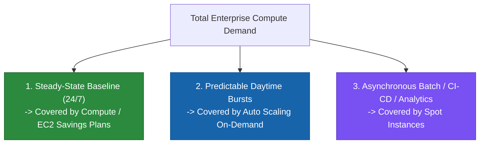

---

# 43. The Baseline + Burst Model

```
Capacity
200 |                 ███████████ (Spot / On-Demand for Peak)
    |                 ███████████
100 |███████████████████████████ (Savings Plans for 24/7 Baseline)
    +───────────────────────────> Time
```

Commit only to the **100-instance baseline**, leaving variable spikes to On-Demand or Spot.

---

# 44. Why Not Buy a Savings Plan for Peak Capacity?

If peak is 200 instances and baseline is 100 instances, buying a 200-instance commitment leaves 100 instances of paid commitment unused during non-peak hours, resulting in massive wasted spend.

---

# 45. Cost Optimization Principle — Commit to the Baseline

- **Predictable baseline** $\rightarrow$ Savings Plans / Reserved Instances.
- **Unpredictable spikes** $\rightarrow$ On-Demand.
- **Interruptible batch / worker tasks** $\rightarrow$ Spot Instances.

---

# 46. Reserved Instances vs. Savings Plans — Deeper Comparison

- Specific database engines (RDS, OpenSearch, Redshift) $\rightarrow$ **Reserved Instances**.
- General compute across EC2, Fargate, Lambda $\rightarrow$ **Compute Savings Plans**.
- Dedicated EC2 fleets with stable family in a Region $\rightarrow$ **EC2 Instance Savings Plans**.

---

# 47. Convertible vs. Standard RIs

- **Standard RI**: Higher discount (up to 72%), but cannot change instance family.
- **Convertible RI**: Lower discount (up to 54%), but allows exchanging for different instance families, OS, or tenancies.

---

# 48. Regional vs. Zonal RIs (EC2)

- **Regional RI**: Applies discount to any instance in the Region matching the family (e.g., `us-east-1`), regardless of AZ. Provides **no capacity reservation**.
- **Zonal RI**: Applies discount to a specific AZ (e.g., `us-east-1a`) and provides a **Capacity Reservation**.

---

# 49. Important Trap — RI Discount vs. Capacity Reservation

> [!WARNING]
> **Exam Trap**: A discount does not equal guaranteed capacity. To guarantee capacity in a specific AZ, you need a **Zonal RI** or an **On-Demand Capacity Reservation**.

---

# 50. On-Demand Capacity Reservations (ODCR)

- **Primary Goal**: Reserve physical compute capacity in a specific Availability Zone.
- **Billing**: Charged at On-Demand rates unless matched with an active Regional RI or Savings Plan.
- **Use Case**: Critical disaster recovery readiness or regulatory capacity assurance.

---

# 51. Dedicated Hosts — Don't Confuse With Cost Optimization

**Dedicated Hosts** allocate a physical server dedicated to your use. They are selected for:
- Bringing your own per-socket / per-core software licenses (BYOL: Windows Server, SQL Server, Oracle).
- Strict hardware isolation compliance.

They are **not** chosen as a discount mechanism.

---

# 52. Related Services — Cost Management

Purchasing decisions must be validated through:
- **AWS Cost Explorer**: Historical utilization analysis.
- **AWS Budgets**: Tracking commitment utilization/coverage alerts.
- **AWS Compute Optimizer**: Rightsizing before purchasing commitments.
- **AWS Trusted Advisor**: Best-practice checks.

---

# 53. Cost Explorer + Purchasing Options

Use Cost Explorer's **Savings Plans & RI Recommendations** tool to analyze historical usage patterns before committing capital.

---

# 54. AWS Budgets + Purchasing Options

Configure **Savings Plans / RI Utilization & Coverage Budgets** to receive proactive alerts when utilization drops below 95% or coverage falls below target.

---

# 55. Trusted Advisor + Purchasing Options

Trusted Advisor surfaces idle resources (e.g., unattached EBS volumes, idle RDS instances) that should be terminated prior to calculating commitment baselines.

---

# 56. Compute Optimizer + Purchasing Options

Always right-size compute resources with **AWS Compute Optimizer** before buying commitments.

---

# 57. Correct Order of Cost Optimization

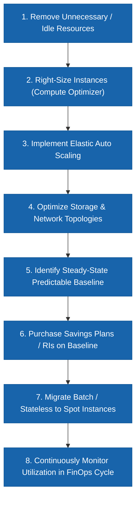

---

# 58. Why Follow This Sequence?

If you purchase commitments before rightsizing, you lock your organization into paying for oversized and unnecessary compute for 1 to 3 years.

---

# 59. The Cost Optimization Pyramid

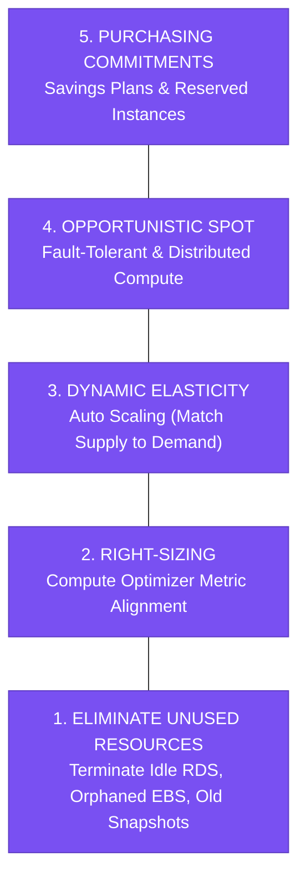

---

# 60. Scenario — Stable Production EC2
- **Scenario**: Production application runs continuously with predictable EC2 usage for the next 3 years.
- **Answer**: **3-Year Compute Savings Plan / EC2 Instance Savings Plan**.

---

# 61. Scenario — Variable Production
- **Scenario**: Application has a stable baseline but traffic occasionally doubles during promotional events.
- **Answer**: **Savings Plans for the baseline + Auto Scaling On-Demand for bursts**.

---

# 62. Scenario — Batch Processing
- **Scenario**: Nightly data processing workload that can restart failed tasks and tolerate interruption.
- **Answer**: **Spot Instances** (orchestrated via AWS Batch / Amazon EMR).

---

# 63. Scenario — New Startup Application
- **Scenario**: A new application has unpredictable adoption and traffic patterns.
- **Answer**: **On-Demand** (Establish 30–90 day baseline before committing).

---

# 64. Scenario — EC2 + Fargate Migration
- **Scenario**: Company currently runs EC2 but plans to refactor workloads to Fargate over the next 12 months.
- **Answer**: **Compute Savings Plan** (Seamlessly transitions discounts across EC2 and Fargate).

---

# 65. Scenario — Stable EC2 Family
- **Scenario**: Company runs a stable `m7i` EC2 fleet in `us-east-1` and wants the highest possible discount with size flexibility.
- **Answer**: **EC2 Instance Savings Plan**.

---

# 66. Scenario — Capacity Guarantee
- **Scenario**: A mission-critical application must guarantee EC2 instance availability in a specific AZ during peak events.
- **Answer**: **On-Demand Capacity Reservation (ODCR) or Zonal RI**.

---

# 67. Scenario — Lowest Possible Cost for Fault-Tolerant Workload
- **Scenario**: Workload can tolerate interruptions and runs across multiple instance types and AZs.
- **Answer**: **Spot Instances with Mixed Instances Auto Scaling Groups**.

---

# 68. Scenario — Highest Flexibility
- **Scenario**: Short-term proof of concept lasting 3 weeks.
- **Answer**: **On-Demand**.

---

# 69. Scenario — Commitment Risk
- **Scenario**: Demand is expected to decline by 50% next year.
- **Answer**: **On-Demand or 1-Year Conservative Savings Plan matching the lower projected baseline**.

---

# 70. Cost Comparison Overview

$$\text{On-Demand (Highest Cost / Zero Risk)} \quad \longrightarrow \quad \text{Savings Plans / RIs (Low Cost / Commitment Risk)} \quad \longrightarrow \quad \text{Spot (Lowest Cost / Interruption Risk)}$$

---

# 71. The Real Cost Equation

$$\text{Total Cost of Ownership (TCO)} = \text{AWS Infrastructure} + \text{Operational Overhead} + \text{Unused Commitment Waste} + \text{Engineering Rework}$$

---

# 72. Example — Spot Looks Cheaper
Spot is 70% cheaper, but if a stateful app requires 6 months of re-engineering to handle interruptions, On-Demand or Savings Plans may yield a lower overall TCO.

---

# 73. Example — RI Looks Cheaper
An RI is 40% cheaper, but if the workload is decommissioned in 4 months, the remaining 8 months of paid commitment erase all savings.

---

# 74. The Professional Architect Question
> *“Which purchasing model best matches workload behavior, business objectives, and architectural constraints?”*

---

# 75. Purchasing Strategy by Workload Matrix

| Workload Type | Preferred Purchasing Strategy | Rationale |
| :--- | :--- | :--- |
| **New / Unpredictable** | On-Demand | Maximum flexibility, zero commitment risk |
| **Stable 24/7 Compute** | Savings Plans / RIs | Maximizes commitment discounts on steady baseline |
| **Stable EC2 Family in 1 Region** | EC2 Instance Savings Plan | Deep discount with instance size flexibility |
| **Multi-Service Compute (EC2/Fargate/Lambda)** | Compute Savings Plan | Broadest multi-service modernization flexibility |
| **Fault-Tolerant Batch / HPC** | Spot Instances | Up to 90% savings with zero commitment |
| **Variable Production Workload** | Savings Plan Baseline + On-Demand Bursts | Balances cost efficiency with high availability |
| **Guaranteed AZ Capacity** | On-Demand Capacity Reservation | Assures capacity independent of discounts |
| **Short-Lived Migration Cutover** | On-Demand | Prevents abandoned long-term commitments |
| **BYOL Dedicated Licensing** | Dedicated Hosts | Satisfies per-core/per-socket licensing compliance |

---

# 76. Purchasing Strategy Decision Tree

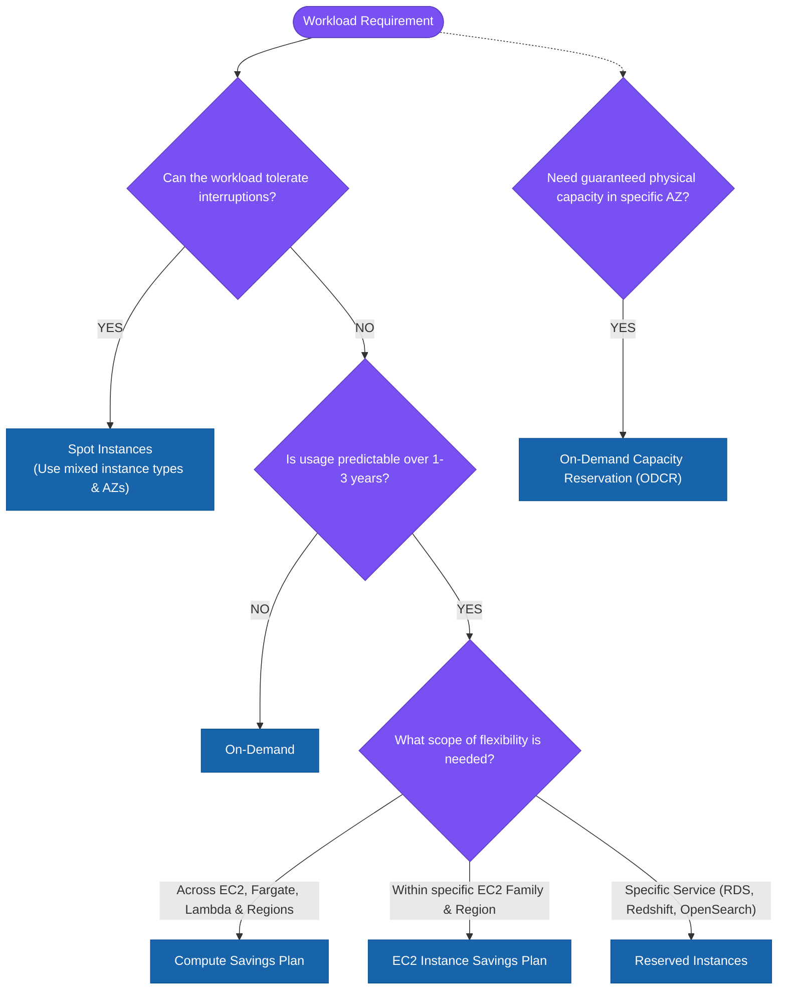

---

# 77. A Better Decision Tree (Simplified)

```
                              WORKLOAD
                                 │
                    Can it tolerate interruption?
                            /          \
                          YES           NO
                           │             │
                         SPOT    Is usage predictable?
                                       /       \
                                     NO         YES
                                     │           │
                                 ON-DEMAND   COMMITMENT
                                                 │
                                     ┌───────────┴───────────┐
                                     │                       │
                               Broad Compute            Specific EC2
                                     │                       │
                            Compute Savings Plan        EC2 SP / RI
```

---

# 78. Related Service — EC2 Auto Scaling
Auto Scaling groups seamlessly combine On-Demand base capacity with Spot scale-out instances.

---

# 79. Related Service — EC2 Fleet
EC2 Fleet manages heterogeneous Spot and On-Demand instance provisioning across diverse instance families and AZs.

---

# 80. Related Service — Amazon ECS / EKS
Enables containerized microservices to leverage Spot capacity pools with automated task rescheduling.

---

# 81. Related Service — AWS Batch
Automatically provisions optimal Spot compute environments based on queue volume and job requirements.

---

# 82. Related Service — Amazon SQS
Decouples producers from Spot worker nodes, guaranteeing message durability across instance interruptions.

---

# 83. Related Service — Amazon CloudWatch
Monitors resource utilization metrics (CPU, RAM, Disk I/O) to identify rightsizing and commitment opportunities.

---

# 84. Related Service — AWS Cost Explorer
Visualizes historical spend and calculates recommended Savings Plan commitment values ($/hr).

---

# 85. Related Service — AWS Compute Optimizer
Leverages ML to deliver prescriptive EC2, EBS, and Lambda rightsizing recommendations.

---

# 86. Related Service — AWS Budgets
Enforces financial guardrails on commitment utilization and coverage percentages.

---

# 87. Related Service — AWS Organizations
Aggregates compute usage across all member accounts to apply organization-wide Savings Plan volume discount tiering.

---

# 88. Enterprise Purchasing Strategy

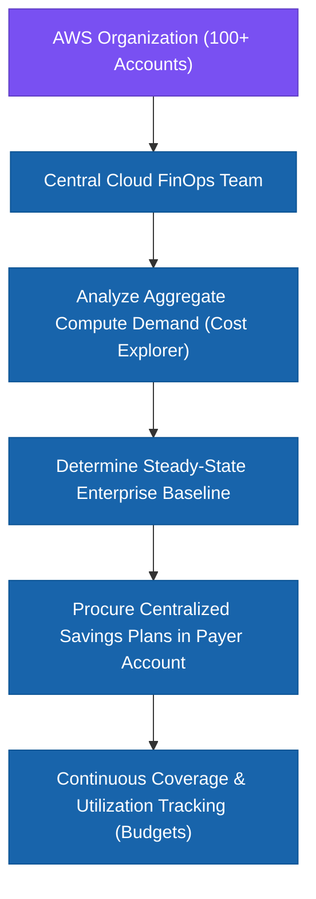

---

# 89. Cost Governance Model

$$\text{Aggregate Usage} \longrightarrow \text{Analyze Baseline} \longrightarrow \text{Procure Commitments} \longrightarrow \text{Monitor Coverage/Utilization} \longrightarrow \text{Optimize}$$

---

# 90. Commitment Should Follow Predictability

Commitments should strictly track confidence in long-term workload demand.

---

# 91. The Three Dimensions of Purchasing

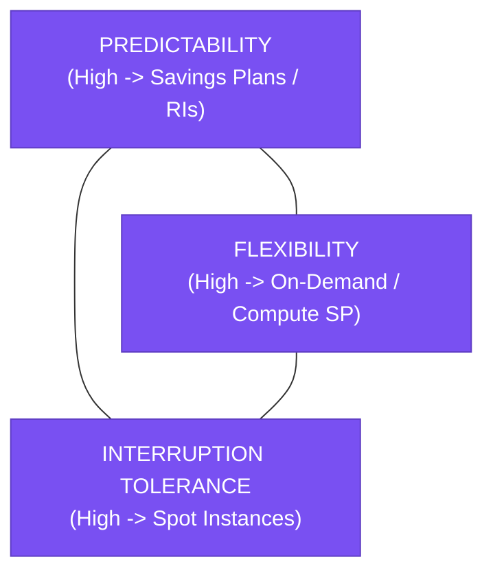

---

# 92. The Biggest Trade-Offs

- **On-Demand**: Flexibility $\uparrow$, Commitment $\downarrow$, Cost $\uparrow$.
- **Reserved Instances**: Commitment $\uparrow$, Flexibility $\downarrow$, Cost $\downarrow$.
- **Savings Plans**: Commitment $\uparrow$, Flexibility (Plan-dependent), Cost $\downarrow$.
- **Spot Instances**: Commitment $\downarrow$, Interruption Risk $\uparrow$, Cost $\downarrow\downarrow$.

---

# 93. Purchasing Options — Final Comparison Matrix

| Feature | On-Demand | Reserved Instances | Savings Plans | Spot Instances |
| :--- | :---: | :---: | :---: | :---: |
| **Long-Term Commitment** | ❌ None | ✅ 1 or 3 Years | ✅ 1 or 3 Years | ❌ None |
| **Predictable Baseline** | Not required | ⭐⭐⭐⭐⭐ Critical | ⭐⭐⭐⭐⭐ Critical | Not required |
| **Flexibility** | ⭐⭐⭐⭐⭐ Maximum | ⭐⭐ Limited | ⭐⭐⭐⭐ Broad | ⭐⭐⭐⭐ High |
| **Interruption Risk** | ❌ Zero | ❌ Zero | ❌ Zero | ⚠️ **High (2-Min Warning)** |
| **Potential Savings** | Baseline pricing | Up to 72% | Up to 72% | **Up to 90%** |
| **Application Redesign** | None | None | None | Often Required |
| **Financial Risk** | Spend sprawl | Underutilization | Underutilization | Interruption impact |

---

# 94. The "Minimal Requirements" Principle

- Do I need zero commitment? $\longrightarrow$ **On-Demand**.
- Do I need discounts on predictable steady usage? $\longrightarrow$ **Savings Plans / RIs**.
- Do I need multi-service compute flexibility? $\longrightarrow$ **Compute Savings Plans**.
- Do I have a stable EC2 family in one Region? $\longrightarrow$ **EC2 Instance Savings Plans**.
- Can the workload tolerate interruptions? $\longrightarrow$ **Spot Instances**.
- Do I need guaranteed physical capacity in an AZ? $\longrightarrow$ **On-Demand Capacity Reservation**.

---

# 95. What NOT to Do (Anti-Patterns)
- **Do not** use Spot for monolithic, stateful, or single-instance critical production apps.
- **Do not** purchase Savings Plans matching peak capacity; commit only to the predictable baseline.
- **Do not** buy RIs or Savings Plans before rightsizing and removing idle resources.

---

# 96. What NOT to Do With Savings Plans
Never commit to 100% of your current total spending without removing architectural waste and evaluating future modernization plans.

---

# 97. What NOT to Do With RIs
Do not purchase standard RIs for temporary, experimental, or migration workloads that will terminate before the commitment ends.

---

# 98. What NOT to Do With Spot
Do not deploy Spot instances without automated recovery, queue buffering, or Auto Scaling mixed-instance diversification.

---

# 99. The SAP-C02 Professional-Level Question
When an exam question asks to *“minimize compute cost while maintaining application availability without extensive code changes”*, select **Savings Plans on the steady baseline + Auto Scaling On-Demand for bursts**.

---

# 100. The Cost-Optimal Architecture Is Often Hybrid

$$\text{Stable Baseline (Savings Plans)} \quad + \quad \text{Dynamic Scale-Out (On-Demand)} \quad + \quad \text{Background Processing (Spot)}$$

---

# 101. The AWS Purchasing Lifecycle

$$\text{Understand Usage} \longrightarrow \text{Remove Waste} \longrightarrow \text{Right-Size} \longrightarrow \text{Add Elasticity} \longrightarrow \text{Identify Baseline} \longrightarrow \text{Commit} \longrightarrow \text{Spot for Batch} \longrightarrow \text{Monitor}$$

---

# 102. 🧠 Final SAP-C02 Cheat Sheet

- **Unpredictable workload** $\longrightarrow$ **On-Demand**.
- **Predictable long-term workload** $\longrightarrow$ **Savings Plans / RIs**.
- **Predictable compute spend across EC2, Fargate, Lambda** $\longrightarrow$ **Compute Savings Plan**.
- **Stable EC2 family in a single Region** $\longrightarrow$ **EC2 Instance Savings Plan**.
- **Specific stable eligible database/service** $\longrightarrow$ **Reserved Instance**.
- **Tolerates interruptions & stateless** $\longrightarrow$ **Spot Instances**.
- **Guaranteed AZ physical capacity** $\longrightarrow$ **On-Demand Capacity Reservation**.

---

# 103. The Golden Mental Model

> **On-Demand = Pay for flexibility**  
> **Reserved Instances = Commit to predictable service-specific usage**  
> **Savings Plans = Commit to predictable compute spend with broader flexibility**  
> **Spot = Trade interruption tolerance for massive cost reduction**  

$$\text{Don't optimize AWS price in isolation. Optimize the total cost of delivering the required business outcome.}$$

---

---

## 104.1 Real-World Exam Scenario: Cost-Optimized EKS Container Sizing & RDS Database Surge Architecture

- **Scenario**: A company migrates an on-premises application to AWS using Amazon EKS (managed EC2 worker nodes) and Amazon RDS for MySQL. The system experiences predictable schedules of high usage during sales events and holiday seasons. An AWS Well-Architected review mandates **minimizing compute costs during peak-demand surges** with the **MOST cost-optimized pricing strategy**. What is the optimal solution?
- **Architecture Solution**:
  1. **EKS Regular Baseline Compute**: Purchase **Compute Savings Plans** for the EC2 worker nodes used for regular baseline traffic.
  2. **EKS Peak Surge Compute**: Scale the EKS node cluster using **EC2 Spot Instances** during peak demand surges.
  3. **RDS Database Baseline**: Handle the predicted baseline database load with a **1-Year All Upfront Reserved Instance** for Amazon RDS MySQL.
  4. **RDS Peak Surge DB**: **Vertically scale up** the RDS database instance size on scheduled high-usage events.

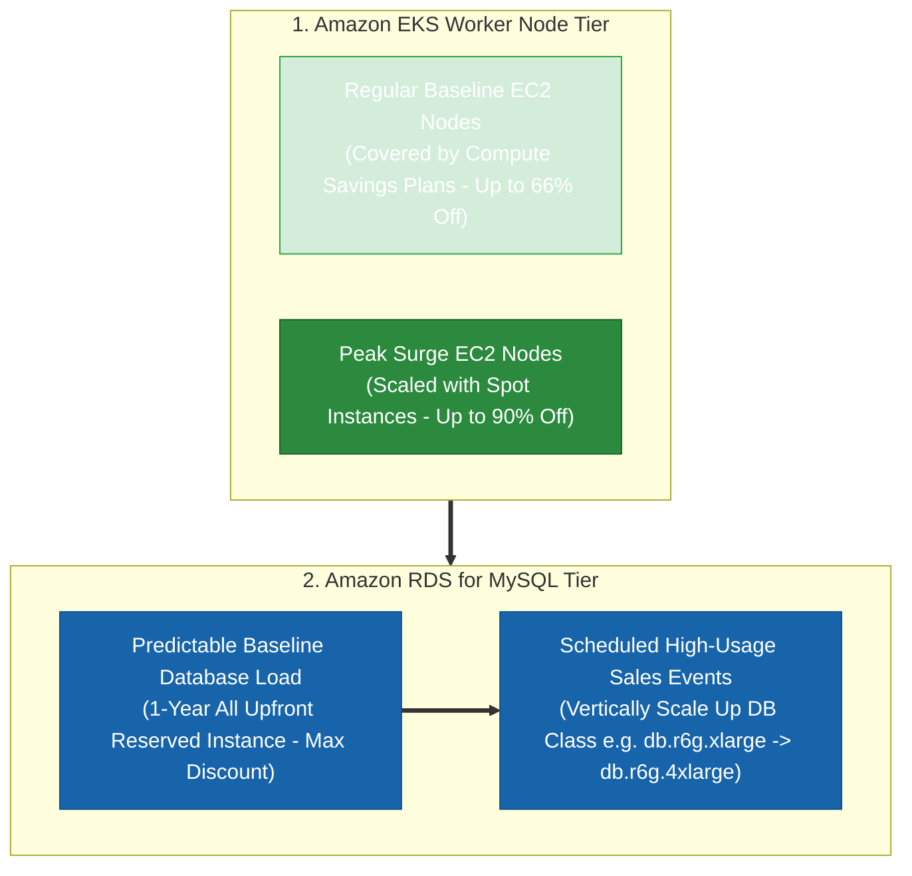

### Key Technical Rationale:
1. **Compute Savings Plans for EKS Baseline**: Compute Savings Plans offer up to 66% discount while providing broad flexibility across EC2 instance families, sizes, regions, and compute engines (EC2, Fargate, Lambda). This allows changing worker node instance types freely as EKS workloads evolve.
2. **EC2 Spot Instances for Peak EKS Surges**: Containerized Kubernetes pods on EKS are stateless and fault-tolerant. Scaling EKS worker nodes with Spot Instances during peak sales surges provides up to 90% discount over On-Demand pricing.
3. **1-Year All Upfront RDS Reserved Instance**: Paying 100% upfront for a 1-year RDS Reserved Instance yields the highest possible discount tier compared to Partial Upfront or No Upfront payment options.
4. **Scheduled Vertical DB Scaling**: Vertically scaling up the RDS DB instance instance class (`db.r6g.xlarge` $\rightarrow$ `db.r6g.4xlarge`) prior to scheduled sales events provides the necessary CPU/RAM headroom for peak writes without over-paying for 24/7 high-spec DB instances.

### Why Distractor Options Fail:
- *Scaling EKS Nodes with On-Demand Instances / On-Demand Capacity Reservations*: On-Demand Capacity Reservations guarantee physical capacity in an AZ, but charge full On-Demand rates with zero cost discount. Scaling surge nodes with On-Demand is far more expensive than using Spot instances.
- *EC2 Instance Savings Plans*: EC2 Instance Savings Plans lock you into a single instance family in a specific region. Compute Savings Plans provide the necessary multi-family flexibility for containerized EKS clusters.
- *Dedicated Instances / Standard RIs for Peak*: Dedicated Instances run on single-tenant hardware and incur expensive single-tenant fees. Standard RIs lack instance family flexibility.
- *No Upfront / Partial Upfront RIs for RDS*: Paying Partial Upfront or No Upfront yields lower discount percentages than **All Upfront** for predictable 1-year database baselines.

---

# 104. One-Page Exam Decision Tree

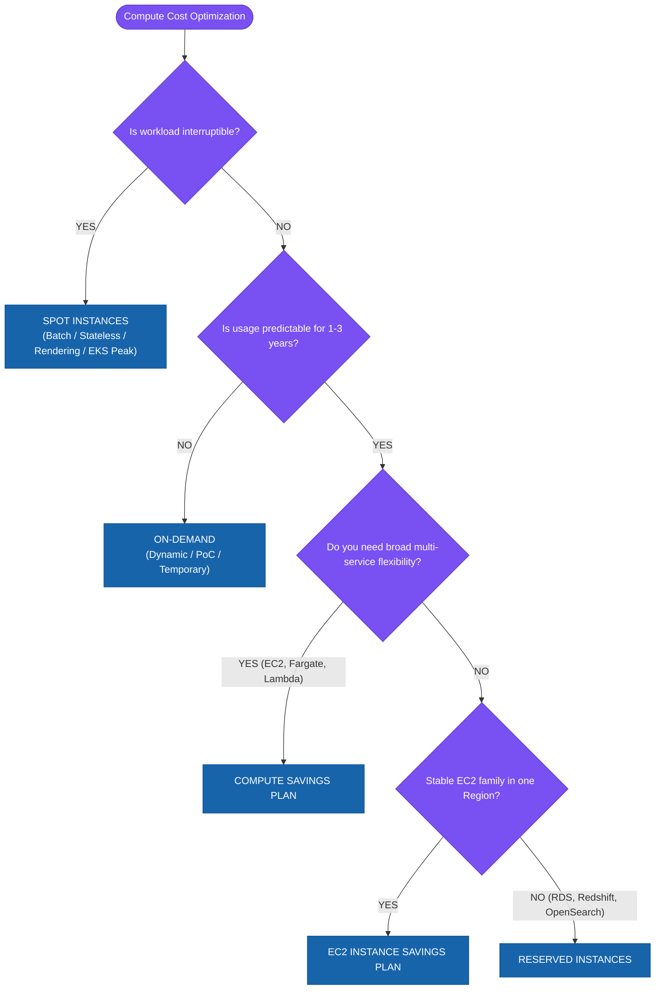

---

# 🏆 Final Memory Table

| Question in the Exam | Think |
| :--- | :--- |
| **“No commitment, maximum flexibility”** | **On-Demand** |
| **“Predictable long-term workload”** | **RI / Savings Plans** |
| **“Predictable compute spend across EC2/Fargate/Lambda”** | **Compute Savings Plan** |
| **“Stable EC2 family in a Region”** | **EC2 Instance Savings Plan** |
| **“Specific stable eligible configuration (e.g. RDS)”** | **Reserved Instance** |
| **“Can tolerate interruptions”** | **Spot Instances** |
| **“Batch / rendering / distributed processing”** | **Spot Instances** |
| **“Stable baseline + unpredictable bursts”** | **Commitment + On-Demand/Spot** |
| **“Guaranteed capacity in an AZ”** | **Capacity Reservation / Zonal RI** |
| **“Need to analyze commitment utilization/coverage”** | **Cost Explorer / AWS Budgets** |
| **“Need rightsizing before commitment”** | **Compute Optimizer** |
| **“Need cost alerts”** | **AWS Budgets** |
| **“Need cost recommendations”** | **Trusted Advisor** |

---

### The Final Professional Sequence:
$$\text{REMOVE WASTE} \longrightarrow \text{RIGHT-SIZE} \longrightarrow \text{ELASTICITY} \longrightarrow \text{PREDICTABLE BASELINE} \longrightarrow \text{COMMIT} \longrightarrow \text{SPOT FOR INTERRUPTIBLE WORK} \longrightarrow \text{MONITOR} \longrightarrow \text{REASSESS}$$