# AWS SAP — Task 1.5: Enterprise Cost Management & Optimization Skills

> **Domain Focus**: AWS Certified Solutions Architect – Professional (SAP-C02) & Cloud Financial Management (FinOps)  
> **Core Architectural Mindset**: This skill is not merely about memorizing Cost Explorer, tags, or Savings Plans. It centers on answering:
> $$\text{“How do I build a cost-aware AWS architecture where I can see who is spending money, understand why, choose the right pricing model, and continuously optimize without creating unnecessary operational work?”}$$

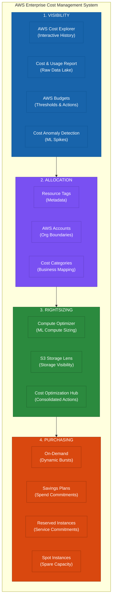

> **The SAP Exam Mindset**:
> $$\text{Measure} \longrightarrow \text{Allocate} \longrightarrow \text{Analyze} \longrightarrow \text{Rightsize} \longrightarrow \text{Commit Appropriately} \longrightarrow \text{Continuously Monitor}$$

---

# 1. Why Does AWS Cost Monitoring Exist?

Imagine an enterprise running an AWS Organization:
- **Production Account**
- **Development Account**
- **Data Platform Account**
- **Security Account**
- **Marketing Account**
- **Shared Services Account**

**Monthly AWS bill**: **$500,000**. Management asks: *“Why did AWS cost $500K this month?”*

Without proper visibility and allocation, the bill is an unexplainable monolith. Cost-management tools provide granular answers to:
- Who spent it?
- What service caused the spike?
- Which account, application, environment, and business unit is responsible?
- Why did it increase?
- Is the spending expected?
- Can we reduce it?

---

# 2. Cost Monitoring Is NOT One AWS Service

Do not equate *“Cost Explorer = AWS cost management.”* Cost visibility encompasses distinct operational dimensions:

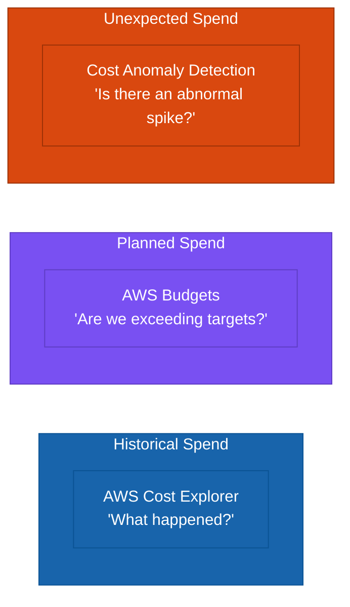

For advanced big-data analytics:
$$\text{AWS Cost and Usage Report (CUR)} \longrightarrow \text{Amazon S3} \longrightarrow \text{Amazon Athena} \longrightarrow \text{Custom BI Dashboards}$$

---

# 3. AWS Cost Explorer

## Why does it exist?
Because an AWS invoice alone cannot explain multi-dimensional cost drivers across services, regions, and accounts.

Cost Explorer allows you to visualize, group, and filter cost and usage data across dimensions such as:
- Service (EC2, S3, RDS, Data Transfer, NAT Gateway)
- Region (`us-east-1`, `eu-west-1`)
- Account (Prod, Dev, Data)
- Instance Type (`m5.xlarge`, `c7g.2xlarge`)
- Database Engine (Aurora PostgreSQL, MySQL)
- Cost Allocation Tags (`Environment=Production`, `Owner=TeamA`)
- Cost Categories (`BusinessUnit=Finance`) ([AWS Documentation](https://docs.aws.amazon.com/cost-management/latest/userguide/view-billing-dashboard.html?utm_source=chatgpt.com "Using the AWS Billing and Cost Management home page - AWS Cost Management"))

---

# 4. What Problem Does Cost Explorer Solve?

> **Problem**: *“I know my AWS bill is high, but I don't know what is driving it.”*

Cost Explorer provides **historical visibility and investigative analytics**:
- **WHERE** is money being spent?
- **WHEN** did it increase?
- **WHAT** service caused the increase?
- **WHICH** account, Region, and usage type?

Cost Explorer is a visibility tool, not an automatic remediation engine.

---

# 5. Cost Explorer Operational Overhead

Very low. AWS operates the managed interface and APIs. You do not need to build `CUR + Glue + Athena + QuickSight` for standard cost exploration.

- **Standard queries & interactive inspection** $\longrightarrow$ **AWS Cost Explorer**.
- **Complex custom enterprise FinOps & chargeback models** $\longrightarrow$ **CUR / Data Exports + S3 + Analytics**.

---

# 6. Cost Explorer Trade-Off

- **Advantages**: Easy to use, zero infrastructure, low operational overhead.
- **Trade-off**: Less customizable than raw billing data for organizations requiring custom chargeback formulas incorporating employee counts, corporate revenue, or on-premises telemetry.

---

# 7. AWS Budgets

Cost Explorer looks backward (*“What happened?”*); **AWS Budgets** looks forward (*“Are we approaching the amount we planned to spend?”*):

- Engineering monthly budget: **$50,000**
- Actual spend at mid-month: **$42,000**
- Projected month-end forecast: **$53,000**

AWS Budgets allows setting custom cost and usage budgets with notifications when actual or forecasted spending exceeds defined thresholds (e.g., 80%, 100%, or forecast breaches). ([AWS Documentation](https://docs.aws.amazon.com/awsaccountbilling/latest/aboutv2/billing-what-is.html?utm_source=chatgpt.com "What is AWS Billing and Cost Management? - AWS Billing"))

---

# 8. Cost Explorer vs. Budgets

$$\text{Cost Explorer (Look Back / Analyze)} \quad \longleftrightarrow \quad \text{AWS Budgets (Look Forward / Control \& Alert)}$$

> [!TIP]
> **Exam Clue**: *“Finance wants an alert when the development account is forecast to exceed $10,000”* $\longrightarrow$ **AWS Budgets** (NOT Cost Explorer).

---

# 9. AWS Budgets — Is It Operational Overhead?

Very low. You define:
$$\text{Scope (Account/Service)} + \text{Target Amount} + \text{Threshold \%} + \text{Notification (Email/SNS)} \longrightarrow \text{AWS Manages Monitoring}$$

---

# 10. Budgets Are Not a Magic Kill Switch

A budget alert does not mean AWS automatically shuts down production resources. While Budget Actions can trigger automated responses (IAM policies, SCPs, or instance stops), terminating production resources upon reaching a dollar limit can cause catastrophic outages.

> **SAP Mindset**: Cost governance must not accidentally become availability governance.

---

# 11. Cost Anomaly Detection

- **AWS Budgets**: Evaluates spend against a known, pre-configured threshold ($100K/mo).
- **AWS Cost Anomaly Detection**: Uses Machine Learning to identify unexpected deviations from historical baselines (e.g., an unexpected 400% surge in daily S3 egress fees).

$$\text{Historical Behavior Baseline} \longrightarrow \text{ML Analysis} \longrightarrow \text{Detect Unusual Deviation} \longrightarrow \text{Alert}$$

---

# 12. Three Tools You Should Separate

1. **Cost Explorer** $\rightarrow$ Analyze historical spend drivers.
2. **AWS Budgets** $\rightarrow$ Control spend against planned financial limits.
3. **Cost Anomaly Detection** $\rightarrow$ Detect unexpected spending spikes automatically.

---

# 13. Cost Allocation — The Bigger Problem

Management asks: *“How much did Engineering spend out of our $1,000,000 monthly bill?”*

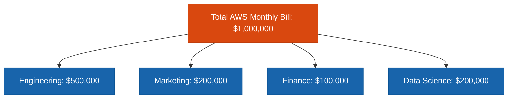

This is **Cost Allocation**. Without it, there is no ownership or accountability.

---

# 14. Why Tags Exist

AWS resource tags are key-value pairs (`Key=Value`). Their core purpose is creating a **consistent metadata taxonomy** that allows costs and resources to be attributed to the right owner, product, or cost center. ([AWS Documentation](https://docs.aws.amazon.com/whitepapers/latest/tagging-best-practices/cost-allocation-tags.html?utm_source=chatgpt.com "Cost allocation tags - Best Practices for Tagging AWS Resources"))

---

# 15. A Good Enterprise Tagging Strategy

Do not allow ad-hoc tagging. Establish a standardized taxonomy:
- `Application` (e.g., `Payments`)
- `BusinessUnit` (e.g., `Finance`)
- `CostCenter` (e.g., `FIN-123`)
- `Environment` (e.g., `Production`, `Staging`, `Dev`)
- `Owner` (e.g., `payments-team@company.com`)
- `Project` (e.g., `PaymentModernization`)
- `DataClassification` (e.g., `Confidential`, `PII`)

---

# 16. Why Standardization Matters

Inconsistent tag keys and casing destroy aggregation:
- `Team=Finance`, `Department=FIN`, `BU=Financial`, `Business=Finance`.

Standardizing on a single key (`BusinessUnit`) and a controlled list of valid values enables accurate cost rollups.

---

# 17. Tags Are More Than Cost Allocation

Tags support:
- Cost Allocation
- Operational Automation (e.g., `Environment=Dev` $\rightarrow$ auto-stop at 7 PM)
- Access Control (Attribute-Based Access Control / ABAC)
- Compliance & Security auditing

> [!IMPORTANT]
> **Activation Requirement**: Resource tags do not appear in billing reports until they are explicitly **activated as Cost Allocation Tags** in the AWS Billing console.

---

# 18. Tagging Operational Overhead

Tagging involves low technical overhead, but **high organizational governance overhead**:
- Enforcing mandatory tags at resource creation.
- Auditing missing tags.
- Handling resources that do not support tagging.
- Allocating shared un-taggable infrastructure.

---

# 19. How Do You Enforce Tags?

- **Preventive**: Service Control Policies (SCPs) or IAM policies denying resource creation without required tags.
- **Detective**: AWS Config rules identifying non-compliant untagged resources.
- **Automated**: AWS CloudFormation / Terraform templates with mandatory tagging parameters.

---

# 20. Important Problem: Not Everything Is Easily Tagged

Single-application EC2 instances are easy to tag. But shared enterprise components cannot be cleanly tagged with a single business unit:
- Shared NAT Gateways
- Shared Transit Gateways
- Centralized Security & Logging tooling
- Data transfer fees, Enterprise Support, taxes, and credits

This is where **AWS Cost Categories** becomes essential.

---

# 21. Cost Categories

AWS Cost Categories let you create business-level grouping rules over billing data using accounts, tags, services, regions, and usage types. ([AWS Documentation](https://docs.aws.amazon.com/awsaccountbilling/latest/aboutv2/create-cost-categories.html?utm_source=chatgpt.com "Creating cost categories - AWS Billing"))

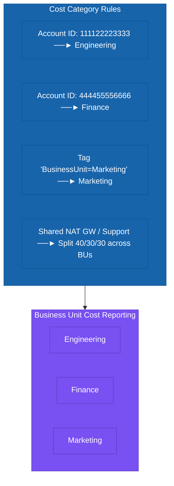

---

# 22. Why Cost Categories Exist

Raw AWS dimensions (Account ID, Region, Service) do not match corporate organizational hierarchies. Cost Categories act as an abstraction mapping layer between AWS billing and corporate reporting structures.

---

# 23. Tags vs. Cost Categories

- **Tags**: Metadata attached directly to individual AWS resources (`EC2` $\rightarrow$ `BusinessUnit=Finance`).
- **Cost Categories**: Business rules applied on top of billing data across accounts, tags, and charges.

$$\text{Tags} = \text{Resource Metadata} \quad \longleftrightarrow \quad \text{Cost Categories} = \text{Billing Classification}$$

---

# 24. Cost Categories Can Handle Shared Costs

Shared costs (e.g., Transit Gateways, Enterprise Support) cannot be divided with a single tag. Cost Categories support **split-charge rules** (e.g., allocating a shared VPC's cost proportionally based on each business unit's direct spend). ([AWS Documentation](https://docs.aws.amazon.com/awsaccountbilling/latest/aboutv2/create-cost-categories.html?utm_source=chatgpt.com "Creating cost categories - AWS Billing"))

---

# 25. Showback vs. Chargeback

- **Showback**: Reporting cost consumption to teams to drive awareness and financial accountability without internal money transfers.
- **Chargeback**: Formally invoicing internal business unit cost centers to recover cloud expenditure. ([AWS Documentation](https://docs.aws.amazon.com/whitepapers/latest/tagging-best-practices/cost-allocation-tags.html?utm_source=chatgpt.com "Cost allocation tags - Best Practices for Tagging AWS Resources"))

---

# 26. Account Strategy vs. Tagging Strategy

Large enterprises combine account boundaries with tagging:
- **AWS Accounts**: Hard organizational and administrative boundaries.
- **Account Tags**: Applying tags at the account level in AWS Organizations to allocate un-taggable service fees. ([AWS Documentation](https://docs.aws.amazon.com/en_en/awsaccountbilling/latest/aboutv2/account-tags-cost-allocation.html?utm_source=chatgpt.com "Using account tags for cost allocation - AWS Billing"))
- **Resource Tags**: Granular workload attribution within accounts.

---

# 27. A Strong Enterprise Cost Model

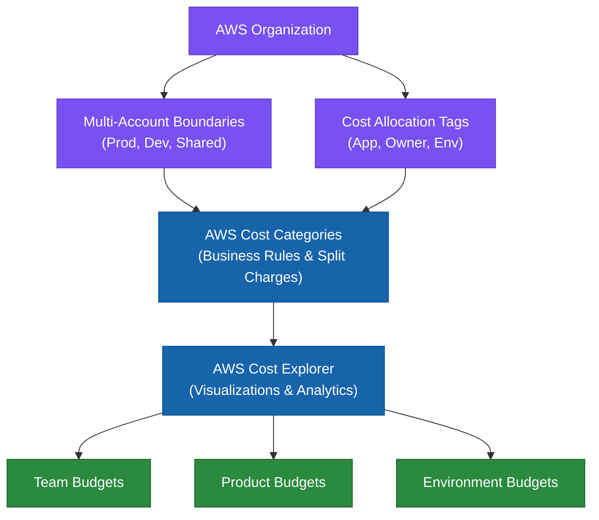

---

# 28. Cost Allocation Coverage

$$\text{Cost Allocation Coverage} = \frac{\text{Properly Allocated Spend}}{\text{Total AWS Spend}} \times 100$$

AWS Billing surfaces cost-allocation coverage metrics to highlight untagged and unallocated spend across the organization. ([AWS Documentation](https://docs.aws.amazon.com/cost-management/latest/userguide/view-billing-dashboard.html?utm_source=chatgpt.com "Using the AWS Billing and Cost Management home page - AWS Cost Management"))

---

# 29. Now the Purchasing Problem

Once you know *where* money is going and *who* owns it:
> *“How do I pay less for the same compute workload?”*

The four primary purchasing models are:
1. **On-Demand**
2. **Savings Plans**
3. **Reserved Instances**
4. **Spot Instances** ([AWS Documentation](https://docs.aws.amazon.com/decision-guides/latest/ec2-purchasing-options-aws-how-to-choose/ec2-purchasing-options-aws-how-to-choose.html?icmpid=docs_homepage_featuredsvcs&utm_source=chatgpt.com "Choosing a purchasing option for Amazon EC2 - Choosing a purchasing option for Amazon EC2"))

---

# 30. On-Demand

Pay for compute by the second/hour with **zero long-term commitment**. Ideal for new, unpredictable, short-term, or stateful applications that cannot be interrupted. ([AWS Documentation](https://docs.aws.amazon.com/us_en/AWSEC2/latest/UserGuide/ec2-on-demand-instances.html?utm_source=chatgpt.com "Purchasing On-Demand Instances for Amazon EC2 - Amazon Elastic Compute Cloud"))

---

# 31. Savings Plans

Commit to a consistent hourly spend (e.g., $10/hour) for a 1- or 3-year term, receiving significant discounts across eligible compute usage. ([AWS Documentation](https://docs.aws.amazon.com/savingsplans/latest/userguide/sp-purchase.html?utm_source=chatgpt.com "Purchasing Savings Plans - Savings Plans"))

---

# 32. Why Savings Plans Exist

To provide commitment discounts without locking organizations to a specific instance size, OS, or architecture configuration.

---

# 33. Compute Savings Plans

The most flexible Savings Plan. Applies automatically across **Amazon EC2, AWS Fargate, and AWS Lambda**, regardless of instance family, size, Region, OS, or tenancy. ([AWS Documentation](https://docs.aws.amazon.com/decision-guides/latest/ec2-purchasing-options-aws-how-to-choose/ec2-purchasing-options-aws-how-to-choose.html?icmpid=docs_homepage_featuredsvcs&utm_source=chatgpt.com "Choosing a purchasing option for Amazon EC2 - Choosing a purchasing option for Amazon EC2"))

---

# 34. EC2 Instance Savings Plans

Provides deeper discounts (up to 72%) in exchange for committing to a **specific EC2 instance family in a specific Region** (e.g., `c7g` in `us-east-1`). Flexibility remains across instance sizes, OS, and AZs. ([AWS Documentation](https://docs.aws.amazon.com/decision-guides/latest/ec2-purchasing-options-aws-how-to-choose/ec2-purchasing-options-aws-how-to-choose.html?icmpid=docs_homepage_featuredsvcs&utm_source=chatgpt.com "Choosing a purchasing option for Amazon EC2 - Choosing a purchasing option for Amazon EC2"))

---

# 35. Reserved Instances (RIs)

Traditional configuration-specific commitments. For Amazon EC2, AWS currently recommends Savings Plans over RIs due to their superior flexibility. ([AWS Documentation](https://docs.aws.amazon.com/AWSEC2/latest/UserGuide/ec2-reserved-instances.html?utm_source=chatgpt.com "Reserved Instances for Amazon EC2 overview - Amazon Elastic Compute Cloud"))

---

# 36. When RIs Still Matter

Reserved Instances remain relevant for non-EC2 database and analytics engines (e.g., Amazon RDS RIs, OpenSearch RIs, Redshift RIs, ElastiCache RIs). ([AWS Documentation](https://docs.aws.amazon.com/decision-guides/latest/ec2-purchasing-options-aws-how-to-choose/ec2-purchasing-options-aws-how-to-choose.html?icmpid=docs_homepage_featuredsvcs&utm_source=chatgpt.com "Choosing a purchasing option for Amazon EC2 - Choosing a purchasing option for Amazon EC2"))

---

# 37. Spot Instances

Leverage unused EC2 spare capacity at **up to 90% discount** off On-Demand rates, with the condition that AWS can reclaim the instance with a **2-minute interruption notice**. ([AWS Documentation](https://docs.aws.amazon.com/decision-guides/latest/ec2-purchasing-options-aws-how-to-choose/ec2-purchasing-options-aws-how-to-choose.html?icmpid=docs_homepage_featuredsvcs&utm_source=chatgpt.com "Choosing a purchasing option for Amazon EC2 - Choosing a purchasing option for Amazon EC2"))

---

# 38. Spot Exists to Solve a Different Problem

Spot trades interruption tolerance for massive compute discounts.
- **Ideal**: Batch processing, Big Data (EMR), rendering, CI/CD runners, containerized stateless workers.
- **Poor fit**: Single critical relational databases or stateful monolithic systems. ([AWS Documentation](https://docs.aws.amazon.com/decision-guides/latest/ec2-purchasing-options-aws-how-to-choose/ec2-purchasing-options-aws-how-to-choose.html?icmpid=docs_homepage_featuredsvcs&utm_source=chatgpt.com "Choosing a purchasing option for Amazon EC2 - Choosing a purchasing option for Amazon EC2"))

---

# 39. Purchasing Options Are Really Risk Models

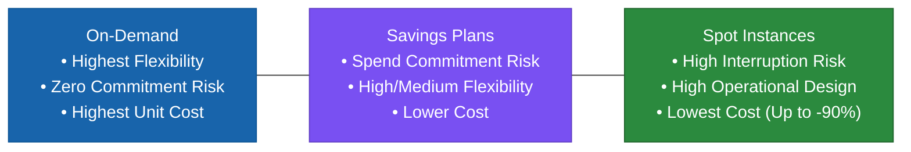

---

# 40. Purchasing Options vs. Performance

> **Purchasing models determine pricing and commitment terms; they do not alter CPU, memory, or hardware performance.** (An `m5.large` runs identically whether billed via On-Demand, Savings Plan, or Spot).

---

# 41. Capacity Reservation Is Different

- **Savings Plans / RIs**: Financial discount mechanism.
- **On-Demand Capacity Reservation (ODCR)**: Physical capacity assurance in a specific AZ (no discount unless matched with a regional commitment). ([AWS Documentation](https://docs.aws.amazon.com/decision-guides/latest/ec2-purchasing-options-aws-how-to-choose/ec2-purchasing-options-aws-how-to-choose.html?icmpid=docs_homepage_featuredsvcs&utm_source=chatgpt.com "Choosing a purchasing option for Amazon EC2 - Choosing a purchasing option for Amazon EC2"))

---

# 42. The Biggest Purchasing Mistake

> **Never buy long-term commitments on over-provisioned infrastructure.**  
> Always use **AWS Compute Optimizer** to rightsize first, establish the clean baseline, and then purchase Savings Plans. ([AWS Documentation](https://docs.aws.amazon.com/decision-guides/latest/ec2-purchasing-options-aws-how-to-choose/ec2-purchasing-options-aws-how-to-choose.html?icmpid=docs_homepage_featuredsvcs&utm_source=chatgpt.com "Choosing a purchasing option for Amazon EC2 - Choosing a purchasing option for Amazon EC2"))

---

# 43. Purchasing Strategy Should Be Layered

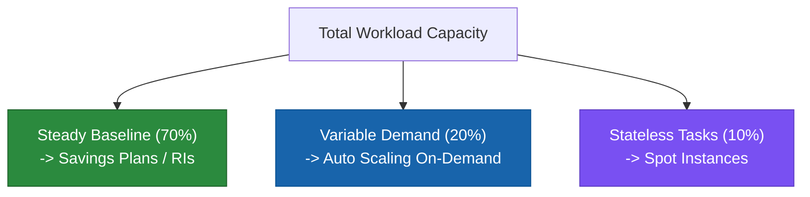

---

# 44. Example — E-Commerce System

- **Normal traffic (100 instances)**: Covered by **Savings Plans**.
- **Peak daytime traffic (+100 instances)**: Scaled dynamically via **On-Demand**.
- **Background image processing (+100 workers)**: Handled via **Spot Instances**.

---

# 45. What About Auto Scaling?

Auto Scaling groups separate **capacity scaling** from the **underlying billing model** by combining On-Demand base allocations with Spot scale-out instances.

---

# 46. What About Containers?

Compute Savings Plans seamlessly apply to containerized workloads running on **Amazon ECS with AWS Fargate** or **Amazon EKS**. ([AWS Documentation](https://docs.aws.amazon.com/decision-guides/latest/ec2-purchasing-options-aws-how-to-choose/ec2-purchasing-options-aws-how-to-choose.html?icmpid=docs_homepage_featuredsvcs&utm_source=chatgpt.com "Choosing a purchasing option for Amazon EC2 - Choosing a purchasing option for Amazon EC2"))

---

# 47. What About Lambda?

Compute Savings Plans also apply to serverless compute duration and memory spend on **AWS Lambda**.

---

# 48. Cost Monitoring + Tags + Purchasing (The Complete Flow)

$$\text{AWS Resources} \longrightarrow \text{Tags} \longrightarrow \text{Cost Allocation} \longrightarrow \text{Cost Explorer} \longrightarrow \text{Compute Optimizer (Rightsize)} \longrightarrow \text{Savings Plan (Baseline)}$$

---

# 49. Cost Strategy for Business Units

A mature enterprise governance model provides each business unit with:
- Dedicated AWS Account(s) in AWS Organizations
- Activated Cost Allocation Tags
- Custom Cost Category mapping
- Team-level AWS Budget alerts
- Continuous Cost Anomaly Detection

---

# 50. Cost Categories + Tags + Accounts Distinction

- **AWS Account** $\rightarrow$ Strong administrative and blast-radius boundary.
- **Resource Tag** $\rightarrow$ Technical metadata attached to the resource.
- **Cost Category** $\rightarrow$ High-level business classification rule.
- **Cost Explorer** $\rightarrow$ Historical investigation tool.
- **AWS Budgets** $\rightarrow$ Forward-looking threshold control.
- **Cost Anomaly Detection** $\rightarrow$ Automated ML spike detection.

---

# 51. What If Tags Are Missing?

Combine **resource tags** with **account tags** in AWS Organizations and **Cost Category fallback rules** to achieve 100% financial attribution even for un-taggable shared services. ([AWS Documentation](https://docs.aws.amazon.com/en_en/awsaccountbilling/latest/aboutv2/account-tags-cost-allocation.html?utm_source=chatgpt.com "Using account tags for cost allocation - AWS Billing"))

---

# 52. Cost and Usage Monitoring Architecture

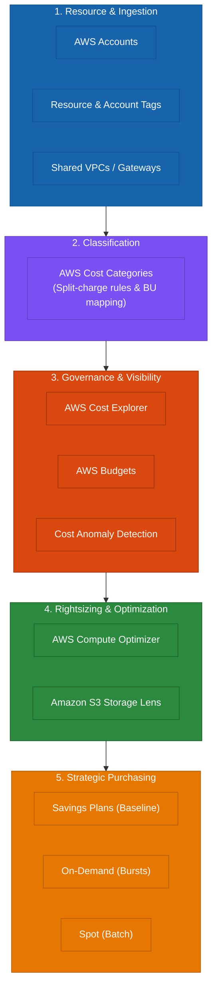

---

# 53. Cost Optimization Is a Continuous Process

$$\text{Measure} \longrightarrow \text{Allocate} \longrightarrow \text{Analyze} \longrightarrow \text{Rightsize} \longrightarrow \text{Purchase} \longrightarrow \text{Monitor} \longrightarrow \text{Repeat}$$

---

# 54. The SAP Trade-Off Matrix

| Purchasing Strategy | Effective Cost | Flexibility | Operational Design Overhead | Ideal Workload Profile |
| :--- | :---: | :---: | :---: | :--- |
| **On-Demand** | $$$$ | ⭐⭐⭐⭐⭐ Maximum | Low | Unpredictable, short-term, or new apps |
| **Compute Savings Plan** | $$ | ⭐⭐⭐⭐⭐ Broad | Low | Predictable multi-service compute baseline |
| **EC2 Instance Savings Plan** | $ | ⭐⭐⭐ Regional | Low | Stable EC2 instance family in one Region |
| **Reserved Instances (RIs)** | $ | ⭐⭐ Limited | Medium | Specific database/analytics engines (RDS) |
| **Spot Instances** | $ (Up to -90%) | ⭐⭐⭐⭐ High | High (Resilience required) | Fault-tolerant, stateless, batch processing |
| **Capacity Reservation** | $$$$ | ⭐⭐ Zonal | Medium | Mission-critical capacity assurance |

---

# 55. The "Why Does It Exist?" Cheat Sheet

- **Cost Explorer**: Historical spend breakdown, filtering, and trend analysis.
- **AWS Budgets**: Threshold alerts, forecast warnings, and spend governance.
- **Cost Anomaly Detection**: ML-driven detection of unexpected spending spikes.
- **Cost Allocation Tags**: Metadata attached to resources for granular ownership tracking.
- **Cost Categories**: Business-level grouping, shared-cost allocation, and split-charge rules.

---

# 56. Purchasing Cheat Sheet

- **Unknown future / short-term** $\longrightarrow$ **On-Demand**.
- **Predictable compute baseline across EC2/Fargate/Lambda** $\longrightarrow$ **Compute Savings Plan**.
- **Predictable EC2 family in one Region** $\longrightarrow$ **EC2 Instance Savings Plan**.
- **Specific database engine (RDS/OpenSearch)** $\longrightarrow$ **Reserved Instances**.
- **Fault-tolerant / stateless / batch** $\longrightarrow$ **Spot Instances**.

---

# 57. 🧠 The Most Important SAP Question

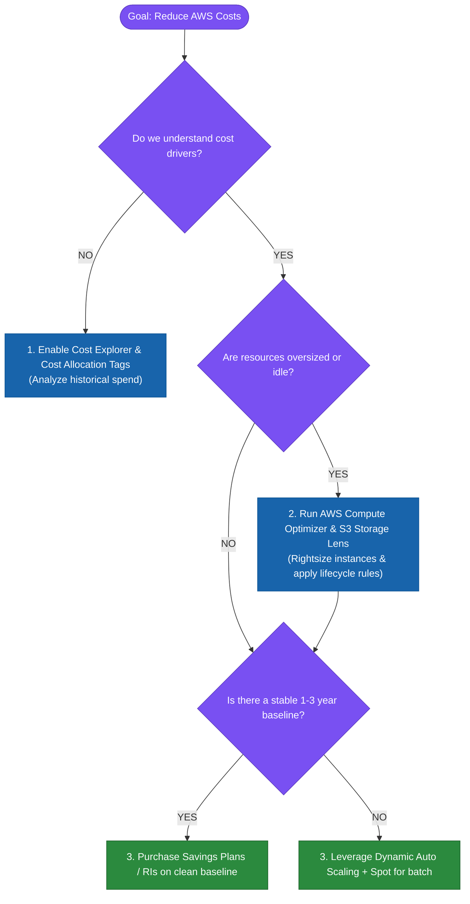

---

# 58. Exam Trap — "Cheapest"
Never choose Spot for mission-critical, stateful, or non-interruptible workloads simply because the unit price is lowest.

---

# 59. Exam Trap — "Predictable"
A 3-year steady EC2 workload does not automatically mean traditional RI. **Savings Plans** provide equal or better economics with substantially higher architectural flexibility. ([AWS Documentation](https://docs.aws.amazon.com/AWSEC2/latest/UserGuide/ec2-reserved-instances.html?utm_source=chatgpt.com "Reserved Instances for Amazon EC2 overview - Amazon Elastic Compute Cloud"))

---

# 60. Exam Trap — "Tag Everything"
Do not rely exclusively on resource tags for 100% cost allocation. Combine resource tags with **account boundaries, account tags, and Cost Category split-charge rules**.

---

# 61. Exam Trap — "Budget Exceeded"
- Alert when spend exceeds threshold $\longrightarrow$ **AWS Budgets**.
- Investigate why spend increased $\longrightarrow$ **Cost Explorer**.
- Identify unusual spending spikes $\longrightarrow$ **Cost Anomaly Detection**.

---

# 62. Exam Trap — "Resource Is Too Large"
When EC2 utilization is consistently low and sizing recommendations are required $\longrightarrow$ **AWS Compute Optimizer** (NOT Cost Explorer or Budgets).

---

## 62.1 Real-World Exam Scenario: High Availability & Cost-Effective AZ Recovery (Spot Fleet with On-Demand + Spot Mix)

- **Scenario**: A digital media publishing portal running on a single EC2 instance reaches 90% peak load. The company needs to enable **quick recovery in the event of an Availability Zone (AZ) outage** using the **MOST cost-effective solution**.
- **Correct Solution**: **Launch a Spot Fleet of On-Demand and Spot instances across multiple Availability Zones. Attach an Application Load Balancer (ALB) to the fleet.**
- **Key Architectural Rationale**:
  - **Mixed Capacity Strategy (On-Demand + Spot)**:
    - **On-Demand Instances**: Guarantee steady-state baseline compute availability without risk of capacity revocation.
    - **Spot Instances**: Handle peak load spikes at up to a 90% cost discount over On-Demand.
  - **Multi-AZ Spot Fleet Distribution + ALB**:
    - Spreading the Spot Fleet across multiple AZs behind an ALB guarantees that if an AZ suffers an outage, the Spot Fleet automatically launches replacement capacity in healthy AZs.
    - **Spot Pool Diversification**: Configuring a Spot Fleet across multiple instance types (`c5.large`, `m5.large`, `r5.large`) prevents single-family Spot capacity reclamation from interrupting the application.
  - *Why Incorrect Options Fail*:
    - **100% On-Demand Auto Scaling Group**: Highly available, but lacks Spot cost savings for peak load.
    - **100% Spot Fleet (or 100% Spot ASG)**: Highly vulnerable to service disruption. If AWS reclaims Spot capacity due to market price surges, baseline portal access crashes.

---

# 63. The Complete Cost Mental Model

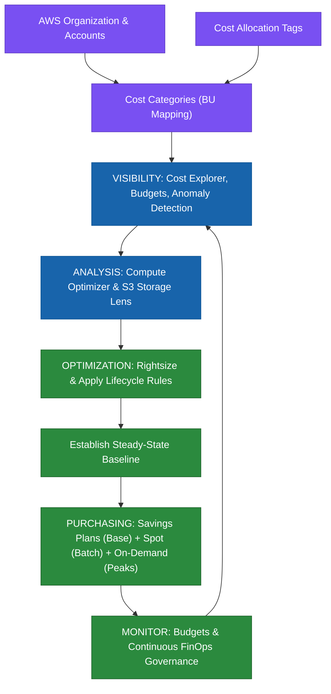

---

# 🏆 Final AWS SAP Cheat Sheet

1. **Can I see the cost?** $\longrightarrow$ **Cost Explorer / CUR**.
2. **Can I attribute the cost?** $\longrightarrow$ **Tags / Accounts / Cost Categories**.
3. **Can I control the cost?** $\longrightarrow$ **AWS Budgets**.
4. **Is something abnormal?** $\longrightarrow$ **Cost Anomaly Detection**.
5. **Is the resource oversized?** $\longrightarrow$ **Compute Optimizer / S3 Storage Lens**.
6. **Can I optimize architecture?** $\longrightarrow$ **Rightsize, S3 Lifecycle, Auto Scaling, Delete idle resources**.
7. **Can I commit to stable usage?** $\longrightarrow$ **Savings Plans (or RIs where appropriate)**.
8. **Can the workload tolerate interruption?** $\longrightarrow$ **Spot Instances**.
9. **Do I need capacity guaranteed?** $\longrightarrow$ **On-Demand Capacity Reservation**.
10. **How do I ensure optimization continues?** $\longrightarrow$ **Continuous FinOps monitoring loop**.

---

## The Deepest SAP Principle

> **Don't optimize the bill first. Optimize the architecture first, then optimize how you purchase that architecture.**

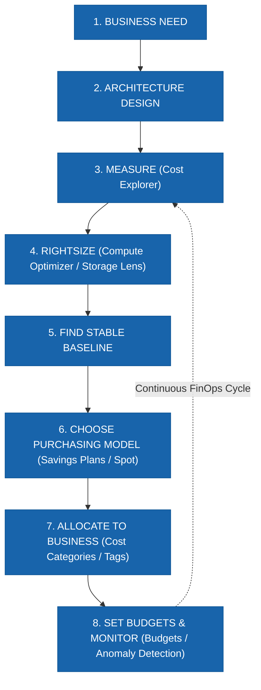

This single mental model connects the entire **SAP Task 1.5 domain**: **Visibility $\rightarrow$ Allocation $\rightarrow$ Rightsizing $\rightarrow$ Purchasing $\rightarrow$ Governance $\rightarrow$ Continuous Optimization**. ([AWS Documentation](https://docs.aws.amazon.com/wellarchitected/latest/cost-optimization-pillar/cost_pricing_model_analysis.html?utm_source=chatgpt.com "COST07-BP01 Perform pricing model analysis - Cost Optimization Pillar"))