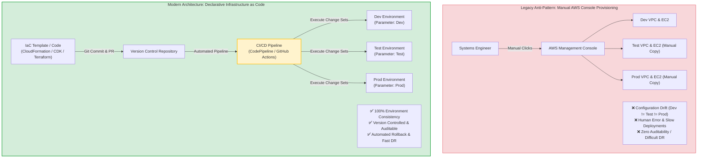
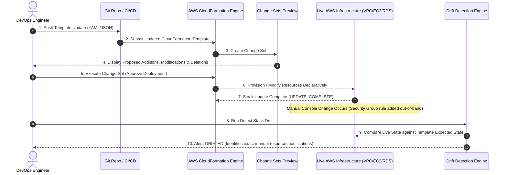
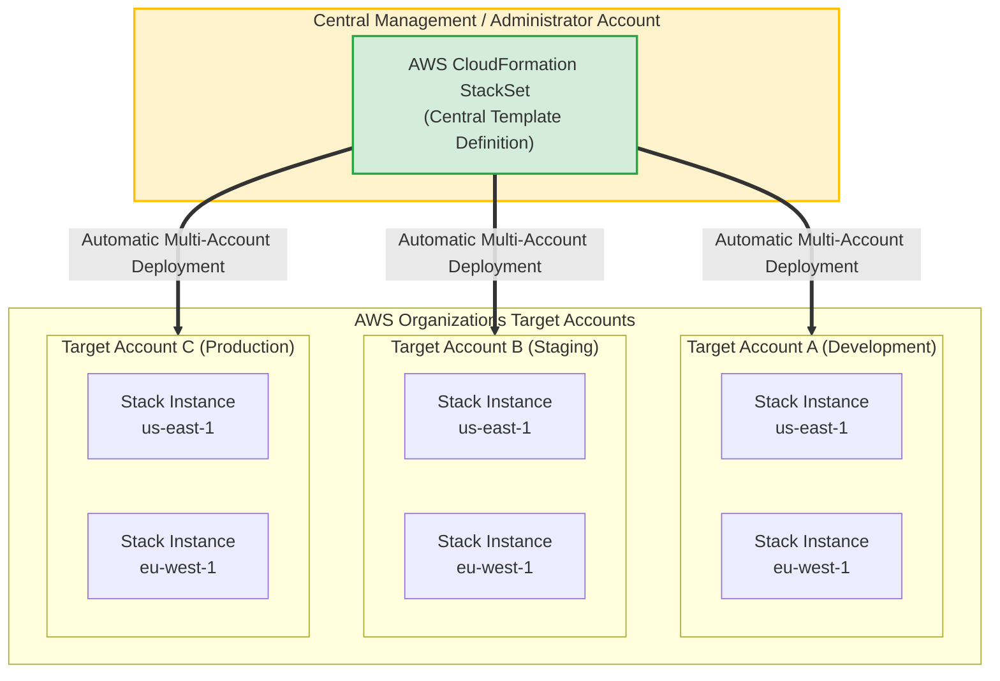
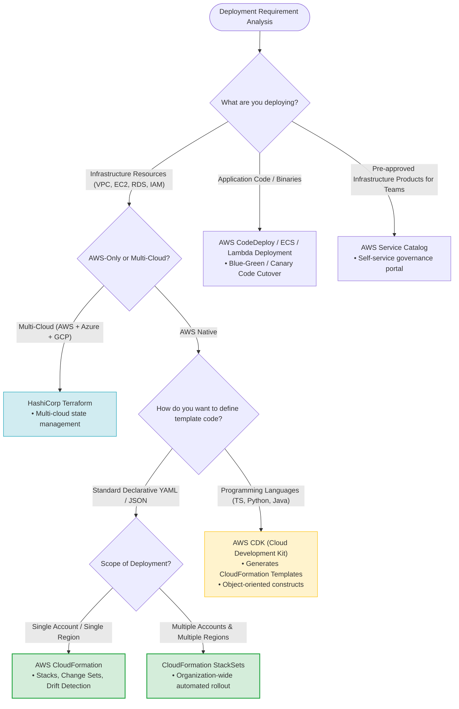
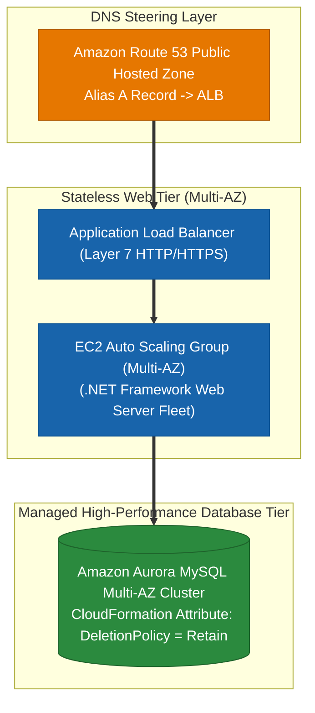
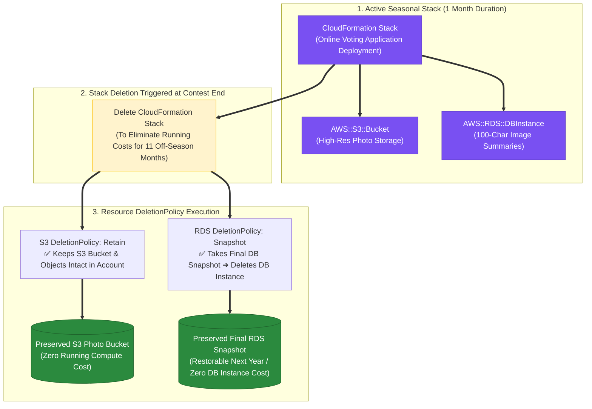
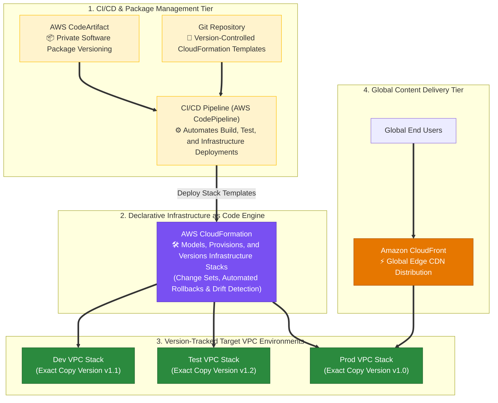

> [!NOTE]
> **Exam Mindset**: For the AWS Solutions Architect Professional (SAP-C02) and AI Practitioner (AIP-C01) exams, do not view **AWS CloudFormation** merely as a tool for creating resources. View Infrastructure as Code (IaC) as the fundamental mechanism to **create repeatable, consistent, auditable infrastructure across multiple environments and AWS accounts while reducing manual operational work and configuration drift**.

---

## 1. Why Infrastructure as Code (IaC) Exists

### Manual Provisioning Anti-Pattern
Before IaC, engineers manually created resources through the AWS Management Console or ad-hoc scripts.



### Consequences of Manual Setup
- **Configuration Drift**: Dev, Test, and Production environments slowly diverge due to undocumented manual changes.
- **Human Errors**: Misconfigured security groups, subnet CIDRs, or missing environment variables.
- **Slow Deployment Cycles**: Manual recreation of complex environments takes days or weeks.
- **Poor Auditability**: Inability to track who modified what resource and when.
- **High RTO in Disaster Recovery**: Rebuilding infrastructure in a new region during a disaster is slow and error-prone.

---

## 2. What Problem IaC Solves

IaC converts physical and cloud infrastructure definitions into version-controlled source code files.

```
Infrastructure Definition ──> IaC Template (Git) ──> AWS APIs ──> Consistent AWS Resources
```

### Key Business Benefits
- **Consistency**: Guaranteed parity across Development, Staging, and Production environments using parameterized templates (`Environment = dev` vs `Environment = prod`).
- **Repeatability**: Provision complete application stacks on demand in minutes.
- **Automation & Version Control**: Infrastructure changes are tracked via Git commits, pull requests, and automated review gates.
- **Auditability**: Complete historical record of all infrastructure modifications.

---

## 3. Why AWS CloudFormation?

Amazon Web Services CloudFormation is AWS's native, fully managed IaC service that provisions and manages AWS resources using declarative JSON or YAML templates.

```
CloudFormation Template
    ├── VPC & Subnets
    ├── Route Tables & Gateways
    ├── Security Groups & IAM Roles
    ├── Application Load Balancers (ALB)
    ├── Auto Scaling Groups (ASG) & EC2
    └── Amazon RDS / DynamoDB Databases
```

### Declarative Architecture
> [!IMPORTANT]
> **Declarative vs. Imperative**:
> - **Declarative (CloudFormation)**: You state *"What infrastructure should exist"* (desired end state). CloudFormation automatically determines the dependency graph, creation order, and modification steps.
> - **Imperative (CLI Scripts)**: You execute step-by-step commands (*"1. Create VPC, 2. Create Subnet..."*). If step 4 fails, manual cleanup and state handling are required.

---

## 4. Declarative vs. Imperative Model Comparison

| Feature | Declarative Model (CloudFormation) | Imperative Model (Custom Scripts / CLI) |
| :--- | :--- | :--- |
| **Approach** | Define desired end state | Specify step-by-step commands |
| **Dependency Resolution** | **Automatic** (CloudFormation builds resource graph) | Manual ordering required |
| **State Management** | **Managed automatically** by CloudFormation Stacks | Manual state tracking required |
| **Rollback Behavior** | **Automatic Rollback** on stack creation failure | Manual rollback script required |
| **Drift Detection** | Built-in native drift detection | Requires custom comparison logic |

---

## 5. Operational Overhead Considerations

While IaC introduces initial setup effort (writing templates, setting up Git repositories, building CI/CD pipelines), it drastically reduces lifecycle operational overhead.

```
Without IaC: Manual Work ──> Human Error ──> Configuration Drift ──> High Recurring Operational Cost
With IaC:    Template Code ──> Pull Request ──> Automated Pipeline ──> Zero Drift / Low TCO
```

> [!TIP]
> **SAP Exam Rule**: A small increase in upfront engineering complexity (writing IaC templates and pipelines) is always preferred over recurring, manual operational effort and configuration drift across environments.

---

## 6. Minimum Requirements for CloudFormation

To deploy infrastructure with CloudFormation, the minimal prerequisites are:
1. A valid JSON or YAML CloudFormation Template.
2. An active AWS Account.
3. IAM Permissions to create target resources.

```
CloudFormation Engine ──> Provisions Target AWS Resources
```

> [!NOTE]
> **Minimal Requirement Exam Clue**: CloudFormation itself does **NOT** require third-party tools like Jenkins, GitHub Actions, Terraform, or Kubernetes. If a scenario asks for the *simplest native solution to automate AWS resource creation*, CloudFormation alone is sufficient.

---

## 7. The IaC Tooling Ecosystem

AWS supports multiple IaC frameworks tailored to different operational needs:

```
                          Infrastructure as Code
                                    │
    ┌───────────────────┬───────────┴───────┬───────────────────┐
    ▼                   ▼                   ▼                   ▼
CloudFormation      AWS CDK            Terraform             AWS SAM
(Native YAML/JSON)  (Programming Code) (Multi-Cloud)       (Serverless Focus)
```

---

## 8. CloudFormation vs. HashiCorp Terraform

| Selection Criterion | AWS CloudFormation | HashiCorp Terraform |
| :--- | :--- | :--- |
| **Target Scope** | **AWS Native** (Optimized for AWS ecosystem) | **Multi-Cloud** (AWS, Azure, GCP, On-Prem) |
| **Management Model** | Fully Managed by AWS (No state file servers) | Self-Managed / HashiCorp Cloud (State file management) |
| **Multi-Account Deployment**| **Native StackSets** | Terraform Workspaces / Modules / Terragrunt |
| **Change Preview** | **Change Sets** | `terraform plan` |
| **Configuration Drift** | **Drift Detection** | `terraform refresh` / `plan` |

> [!NOTE]
> - Choose **CloudFormation** when the requirement emphasizes *AWS-native integration, zero state management, and multi-account StackSets*.
> - Choose **Terraform** when the requirement specifies *multi-cloud resource orchestration using a single unified tool*.

---

## 9. CloudFormation vs. AWS CDK (Cloud Development Kit)

The AWS Cloud Development Kit (CDK) is an open-source software development framework to define cloud infrastructure using familiar programming languages (TypeScript, Python, Java, C#, Go).

```
CDK Code (TypeScript/Python) ──> cdk synth ──> CloudFormation Template (YAML/JSON) ──> CloudFormation Engine ──> AWS Resources
```

> [!IMPORTANT]
> **CDK Does Not Replace CloudFormation**: CDK synthesizes CloudFormation templates under the hood. It uses the CloudFormation deployment engine for stack provisioning, rollbacks, and state management.

---

## 10. Why Use AWS CDK?

Choose AWS CDK when infrastructure requires:
- Reusable high-level component constructs.
- Object-oriented abstractions, loops (`for` loops), and conditional logic.
- Integration into developer software development workflows (IDE autocompletion, unit testing for infrastructure).

---

## 11. Quick IaC Tool Selection Matrix

```
Need AWS-Native Declarative Templates ──────────> AWS CloudFormation
Need Programming Language Abstractions (Python/TS)──> AWS CDK
Need Multi-Cloud Infrastructure Provisioning ───> HashiCorp Terraform
Need Serverless Application Acceleration ───────> AWS SAM (Serverless Application Model)
```

---

## 12. CloudFormation Stacks

A **CloudFormation Stack** is a single logical unit of deployment comprising a group of AWS resources created, updated, or deleted together.

```
Production Stack
  ├── VPC & Subnets
  ├── Application Load Balancers
  ├── Auto Scaling Group
  └── Amazon RDS Database
```

Updating or deleting the Stack modifies or destroys all associated resources as a single atomic unit.

---

## 13. CloudFormation Change Sets

Before updating production infrastructure, use **Change Sets** to preview how proposed modifications will impact running resources (e.g., whether an update will perform an in-place modification or trigger a resource replacement).



> [!TIP]
> **Exam Trigger Keyword**: *"Preview infrastructure changes before applying them to production"* $\longrightarrow$ **CloudFormation Change Sets**.

---

## 14. CloudFormation Drift Detection

**Configuration Drift** occurs when live AWS resource configurations are modified outside of CloudFormation (e.g., manual console edits or CLI commands).

### How Drift Detection Works
CloudFormation compares the expected template property values against the actual live resource configuration settings in AWS and reports a status of `IN_SYNC` or `DRIFTED`.

> [!WARNING]
> **Exam Trigger Keyword**: *"Detect manual changes or out-of-band modifications made to AWS resources"* $\longrightarrow$ **CloudFormation Drift Detection**.

---

## 15. AWS CloudFormation StackSets

When deploying infrastructure across **multiple AWS accounts and multiple AWS Regions**, standard CloudFormation Stacks are insufficient. Use **CloudFormation StackSets**.



> [!IMPORTANT]
> **StackSets Scope**:
> - **StackSet**: Defined centrally in an Administrator account.
> - **Stack Instance**: Deployed into target accounts and regions.
> - **Exam Trigger**: *"Deploy security baseline, IAM roles, or VPC networking across multiple AWS accounts and Regions"* $\longrightarrow$ **CloudFormation StackSets**.

---

## 16. CloudFormation Nested Stacks

**Nested Stacks** allow modularizing large templates by calling secondary child templates from a primary parent template using `AWS::CloudFormation::Stack`.

```
Parent Application Stack
  ├── Child Network Stack (VPC/Subnets)
  ├── Child Security Stack (IAM/SGs)
  ├── Child Application Stack (ALB/ASG)
  └── Child Database Stack (RDS)
```

> [!NOTE]
> **Nested Stacks vs. StackSets**:
> - **Nested Stacks**: Used to modularize and decompose complex templates **within a single account/region**.
> - **StackSets**: Used to deploy templates **across multiple accounts and regions**.

---

## 17. Reusable Modules and Standardization

Modern enterprise deployment strategies use **CloudFormation Modules** or **CDK Construct Libraries** to enforce corporate security standards, networking baselines, and architectural patterns across development teams.

---

## 18. IaC in the Multi-Environment Deployment Pipeline

IaC enforces parity across deployment environments by ensuring the exact same template definition is promoted from Development to Staging and Production.

```
Git Commit ──> IaC Template ──> CI/CD Pipeline ──> Dev Stack ──> Test Stack ──> Staging Stack ──> Prod Stack
```

Eliminates the common industry issue: *"It works in Dev, but breaks in Production."*

---

## 19. IaC + CI/CD Integration Architecture

```
Developer ──> Git Push ──> PR Review ──> CodePipeline ──> CodeBuild (Lint/Test) ──> Create Change Set ──> Approve ──> CloudFormation Deploy
```

Enforces automated approval gates, compliance testing, and audit trails for all infrastructure changes.

---

## 20. IaC and Immutable Infrastructure

IaC enables **Immutable Infrastructure** strategies: instead of modifying running servers or updating configurations in-place, the CI/CD pipeline deploys a fresh ASG with an updated AMI and terminates the old ASG once health checks pass.

---

## 21. IaC in Disaster Recovery (DR)

During a regional outage, IaC templates allow spinning up identical infrastructure in a secondary AWS Region in minutes.

> [!CAUTION]
> **IaC Does Not Replicate Data**: IaC recreates the compute, networking, and database *infrastructure*, but does **NOT** replicate application data. Data replication requires dedicated services like **Amazon S3 Cross-Region Replication (CRR)**, **RDS Cross-Region Read Replicas**, or **DynamoDB Global Tables**.

---

## 22. Preventing Configuration Drift

To maintain IaC as the single source of truth:
1. Restrict IAM permissions so users cannot manually modify production resources in the AWS Console.
2. Force all infrastructure changes through CI/CD pipelines using CloudFormation.
3. Schedule periodic **CloudFormation Drift Detection** scans.

---

## 23. CloudFormation Cost Structure

> [!TIP]
> **Service Cost**: CloudFormation itself is **FREE**. You only pay for the underlying AWS resources (EC2, RDS, ALB, S3) created by the stack.

---

## 24. Total Cost of Ownership (TCO): Manual vs. IaC

```
Manual Approach:  Low Initial Effort ──> High Recurring Overhead ──> Frequent Errors & Outages (High TCO)
IaC Approach:     Higher Initial Setup ──> Automated Operations ──> Zero Parity Errors (Lowest TCO)
```

---

## 25. When IaC Is Overkill

For short-lived, one-off experimental sandbox environments created and destroyed within hours, writing a full IaC template may introduce unnecessary overhead. However, for all production, multi-account, or compliant workloads, IaC is mandatory.

---

## 26. Related AWS Deployment & Management Services

```
                                Deployment & Governance Ecosystem
                                                │
    ┌───────────────────┬───────────────────────┼───────────────────────┬───────────────────┐
    ▼                   ▼                       ▼                       ▼                   ▼
Service Catalog    AWS Proton            Systems Manager           AWS Config         Control Tower
(Approved Products) (Microservices Governance) (Resource Operations)    (Compliance Rules) (Multi-Account Governance)
```

---

## 27. CloudFormation vs. AWS Service Catalog

- **CloudFormation**: Defines how infrastructure resources are provisioned via code.
- **AWS Service Catalog**: Allows central IT administrators to create, govern, and publish catalogs of approved CloudFormation templates for end-users to self-service deploy.

---

## 28. CloudFormation vs. AWS Config

- **CloudFormation**: Provisions and updates infrastructure resources (**Provisioning Engine**).
- **AWS Config**: Continuously records resource configuration histories and evaluates compliance against rules (**Audit & Compliance Engine**).

---

## 29. CloudFormation vs. AWS Systems Manager (SSM)

- **CloudFormation**: Provisions infrastructure resources (**VPCs, ALBs, RDS**).
- **Systems Manager (SSM)**: Manages OS-level operations, patching, parameter storage, and remote shell access on running EC2 instances.

---

## 30. CloudFormation vs. AWS CodeDeploy

- **CloudFormation**: Deploys infrastructure stacks (**Infrastructure Tier**).
- **AWS CodeDeploy**: Automates application code deployments (Blue-Green/Canary) onto EC2, ECS, or Lambda (**Application Tier**).

---

## 31. CloudFormation StackSets vs. AWS Control Tower

- **Control Tower**: Sets up and governs a multi-account AWS environment using landing zones and guardrails.
- **StackSets**: Deploys specific CloudFormation templates across accounts and regions managed by Control Tower or Organizations.

---

## 32. End-to-End Deployment Strategy Lifecycle

```
1. Define (IaC) ──> 2. Validate (Change Sets) ──> 3. Provision (CloudFormation) ──> 4. Automate (CodePipeline)
        │
        ▼
5. Govern (Control Tower) ──> 6. Detect Drift (Config/CFN) ──> 7. Operate (SSM) ──> 8. Recover (IaC + Data DR)
```

---

## 33. SAP-C02 & AIP-C01 Exam Keyword Mapping

| Exam Trigger Phrase | Correct AWS Service / Feature |
| :--- | :--- |
| `"Repeatable infrastructure across environments"` | **Infrastructure as Code (CloudFormation)** |
| `"Preview infrastructure changes before applying"` | **CloudFormation Change Sets** |
| `"Detect manual modifications made outside template"`| **CloudFormation Drift Detection** |
| `"Deploy infrastructure across multiple accounts and Regions"` | **CloudFormation StackSets** |
| `"Define infrastructure using familiar programming languages"` | **AWS CDK** |
| `"Multi-cloud infrastructure provisioning"` | **HashiCorp Terraform** |
| `"Self-service portal for pre-approved IT products"` | **AWS Service Catalog** |
| `"Record resource configuration history and compliance"` | **AWS Config** |
| `"Automate OS patching and run scripts on EC2"` | **AWS Systems Manager (SSM)** |
| `"Automate application code deployments to EC2/Lambda"` | **AWS CodeDeploy** |

---

## 34. AWS IaC & Deployment Tooling Decision Tree



---

## 34.1 Real-World Exam Scenario: On-Premises 3-Tier .NET + MySQL Cloud Migration (300,000 Peak Users)

- **Scenario**: A company migrates its flagship product (3-tier .NET Framework web application + MySQL database) from an on-premises data center to AWS following inventory by AWS Application Discovery Service Agentless Collector. The architect must design a highly available, scalable, and cost-effective infrastructure to handle **300,000 peak users**. What is the optimal architecture?
- **Architecture Solution**:
  1. Launch an **AWS CloudFormation stack** containing an **Auto Scaling Group of Amazon EC2 instances** spanning multiple Availability Zones.
  2. Front the EC2 fleet with an **Application Load Balancer (ALB)** to distribute Layer 7 HTTP/HTTPS web traffic evenly.
  3. Provision an **Amazon Aurora MySQL database cluster** in a Multi-AZ configuration using `DeletionPolicy: Retain` within the CloudFormation template to prevent data loss if the stack is deleted.
  4. Create an **Amazon Route 53** Public Hosted Zone entry with an **Alias A Record** pointing directly to the ALB.



### Key Technical Rationale:
1. **Application Load Balancer (ALB) for Web Applications**: ALBs operate at Layer 7 (HTTP/HTTPS) and support path-based routing, host-based routing, and cookie/header evaluation. Network Load Balancers (NLB) operate at Layer 4 (TCP/UDP) and lack HTTP web routing features.
2. **Amazon Aurora MySQL Multi-AZ**: Aurora provides up to $5\times$ the throughput of standard MySQL with 6-way storage replication across 3 AZs.
3. **CloudFormation `DeletionPolicy: Retain`**: The `Retain` attribute preserves the database instance and its storage volume untouched even if the surrounding CloudFormation stack is deleted, protecting critical business data.
4. **Route 53 Alias A Record**: Points root apex domains directly to the dynamic IPs of the ALB with zero extra query cost.

### Why Distractor Options Fail:
- *Multi-Region Elastic Beanstalk + Geoproximity Routing*: Deploying active-active Auto Scaling fleets in two separate AWS Regions with cross-region Aurora read replicas is over-engineered and expensive. Cross-region read replicas are read-only; writes still travel back to the primary region. A single Multi-AZ region easily handles 300,000 peak users cost-effectively.
- *ECS Cluster on 100% Spot Instances + `DeletionPolicy: Snapshot`*: Running a flagship product's primary web tier on 100% Spot instances risks site downtime when Spot capacity is reclaimed. `DeletionPolicy: Snapshot` requires long restoration times compared to `Retain`.
- *Elastic Beanstalk with Network Load Balancer (NLB)*: NLBs operate at Layer 4 (TCP) and cannot perform HTTP/HTTPS Layer 7 load balancing, cookie sticky sessions, or header-based routing required for web applications.

---

## 34.5 Real-World Exam Scenario: Seasonal Application Stack Teardown & Data Preservation (CloudFormation DeletionPolicy: S3 Retain vs. RDS Snapshot vs. S3 Snapshot Trap)

- **Scenario**: A CloudFormation template deploys a seasonal online voting web application (Nature Photography Contest) that stores high-resolution photos in an Amazon S3 bucket and 100-character image summaries in an Amazon RDS database. The contest runs for 1 month each year. Once concluded, the CloudFormation stack is deleted to eliminate running costs until next year's contest. To prepare for next year, the S3 bucket with high-res photos must remain intact, and the RDS database summaries must be preserved without incurring hourly running costs for an idle RDS database during the 11 off-season months. How should the Solutions Architect configure the `DeletionPolicy` attributes?
- **Architecture Solution**:
  - Set `DeletionPolicy: Retain` on the S3 bucket resource declaration (`AWS::S3::Bucket`).
  - Set `DeletionPolicy: Snapshot` on the RDS database resource declaration (`AWS::RDS::DBInstance`).



### Key Technical Rationale:
1. **`DeletionPolicy: Retain` for S3 Buckets**:
   - Setting `DeletionPolicy: Retain` on `AWS::S3::Bucket` prevents CloudFormation from deleting the bucket and its objects when the stack is deleted, keeping all high-resolution photos safe in the AWS account.
2. **`DeletionPolicy: Snapshot` for RDS Instances**:
   - Setting `DeletionPolicy: Snapshot` on `AWS::RDS::DBInstance` automatically takes a final database snapshot prior to terminating the physical DB instance. This preserves the 100-character image summaries while stopping hourly instance charges during the 11 off-season months.

### Why Distractor Options Fail:
- *Setting `DeletionPolicy: Snapshot` on S3 Bucket*:
  - **CRITICAL CLOUDFORMATION SYNTAX TRAP**: `DeletionPolicy: Snapshot` is **NOT SUPPORTED on Amazon S3 buckets** (`AWS::S3::Bucket`). CloudFormation `Snapshot` deletion policy is ONLY supported on snapshot-capable resource types: RDS instances, EBS volumes, ElastiCache clusters, Redshift clusters, and Neptune databases. Attempting `DeletionPolicy: Snapshot` on an S3 bucket causes a CloudFormation stack creation/update syntax error! S3 resources support ONLY `Retain` or `Delete`.
- *Setting `DeletionPolicy: Retain` on Both S3 and RDS*:
  - Setting `Retain` on RDS leaves the physical RDS DB instance running after stack deletion, charging expensive hourly compute and storage running costs for 11 months when no users exist!
- *Cross-Region Replication (CRR) on S3 + RDS `Snapshot`*:
  - Enabling CRR replicates S3 objects to another region, but if `DeletionPolicy: Retain` is not explicitly set on the primary `AWS::S3::Bucket` resource declaration in the template, deleting the stack will delete the primary S3 bucket in the source region.

---

## 34.6 Real-World Exam Scenario: Global Enterprise Issue Tracking Architecture (CloudFormation + Multi-AZ ASG + ELB + CloudFront + RDS Multi-AZ vs. Spot & Redshift Traps)

- **Scenario**: An enterprise software company builds a proprietary issue tracking system hosted on AWS that is accessed by customers worldwide. The system expects steady-state usage, and the database handles online transaction processing (OLTP). Following an AWS Well-Architected Tool review, the architect must design a highly available, scalable, and fault-tolerant architecture. What is the BEST architecture setup?
- **Architecture Solution**:
  - Use an **AWS CloudFormation template** to launch an **Auto Scaling group of Amazon EC2 instances** across **multiple Availability Zones**, connected via an **Elastic Load Balancer (ELB/ALB)**.
  - Leverage **Amazon CloudFront** for distributing static web content globally.
  - Deploy an **Amazon RDS instance with a Multi-AZ deployment configuration** for high-availability database failover.

```mermaid
flowchart TD
    subgraph GlobalClients ["1. Global Customer Access Tier"]
        Clients["Worldwide Customers"]
    end

    subgraph EdgeCDN ["2. Global Content Delivery Tier"]
        CloudFront["Amazon CloudFront Edge Distribution<br/>⚡ Global Caching of Static Assets & Latency Reduction"]
        Clients ==>|"Static & Dynamic Requests"| CloudFront
    end

    subgraph IaC_Provisioning ["3. Infrastructure as Code Automation"]
        CFN["AWS CloudFormation Template<br/>📜 Declarative, Repeatable Multi-AZ Stack Deployment"]
    end

    subgraph ComputeTier ["4. Highly Available Multi-AZ Compute Tier"]
        ELB["Elastic Load Balancer (ALB)"]
        ASG["Auto Scaling Group of EC2 Instances<br/>(Spanning Multiple AZs for Steady-State Web Load)"]

        CloudFront ==>|"Forward Dynamic Requests"| ELB ==> ASG
    end

    subgraph DatabaseTier ["5. High-Availability Relational OLTP Database Tier"]
        RDS_Primary[("Amazon RDS Primary OLTP DB<br/>(Active Instance in AZ-1)")]
        RDS_Standby[("Amazon RDS Multi-AZ Standby DB<br/>🛡️ Passive Synchronous Failover Standby in AZ-2")]

        ASG ==>|"OLTP Writes & Reads"| RDS_Primary
        RDS_Primary <==|"Sync Replication & Auto Failover (<60s)"==> RDS_Standby
    end

    CFN -.->|"Deploys Stack"| CloudFront & ELB & ASG & RDS_Primary

    classDef cdn fill:#e67700,stroke:#b05a00,color:#ffffff;
    classDef compute fill:#1864ab,stroke:#0b5394,color:#ffffff;
    classDef db fill:#2b8a3e,stroke:#1e632b,color:#ffffff;
    classDef cfn fill:#7950f2,stroke:#5f3dc4,color:#ffffff;

    class CloudFront cdn;
    class ELB,ASG compute;
    class RDS_Primary,RDS_Standby db;
    class CFN cfn;
```

### Key Technical Rationale:
1. **CloudFormation for Repeatable Best Practices**: Deploying the architecture via CloudFormation ensures consistent, version-controlled IaC deployment matching AWS Well-Architected principles.
2. **Multi-AZ Auto Scaling + ELB**: Spanning EC2 instances across multiple Availability Zones behind an Elastic Load Balancer guarantees compute high availability and automatic health-check recovery.
3. **Amazon CloudFront Edge Caching**: Offloads static web content from backend servers to 210+ global PoPs, dramatically lowering global customer latency.
4. **Amazon RDS Multi-AZ for Relational OLTP**: Synchronous block replication to a passive standby in a secondary AZ ensures automated DNS failover in < 60 seconds if an AZ outage occurs.

### Why Distractor Options Fail:
- *Spot EC2 Instances for Steady-State Usage + RDS Read Replicas*:
  - **Spot Instances** are interruptible compute (terminated with a 2-minute warning) for batch workloads; Spot is NOT suitable for steady-state 24/7 core applications!
  - **RDS Read Replicas** provide read query scaling, but do NOT provide automated 60-second write failover during AZ outages (RDS Multi-AZ is required).
- *Dedicated EC2 Instance + Amazon Redshift*:
  - A single **Dedicated EC2 Instance** creates a single point of failure (SPOF) without Auto Scaling.
  - **Amazon Redshift** is an OLAP columnar data warehouse for complex analytical reporting; it is NOT suitable for high-frequency OLTP issue tracking transactions!
- *Multiple On-Demand EC2 Instances without ASG/ELB*:
  - Static EC2 instances without Auto Scaling and ELB load balancing fail high availability and elasticity requirements.

---

## 34.7 Real-World Exam Scenario: Declarative Infrastructure as Code Versioning & Staging (CloudFormation + CloudFront vs. Elastic Beanstalk & CloudWatch Traps)

### IaC vs. PaaS Service Differentiation Matrix

| Service | Category | Core Function | Supports IaC Infrastructure Versioning & Rollback? | Key Exam Keyword Trigger |
| :--- | :--- | :--- | :---: | :--- |
| **AWS CloudFormation** | **Infrastructure as Code (IaC)** | Declarative YAML/JSON template engine modeling all AWS resources | ✅ **YES** (Stack versioning, Change Sets & Rollback) | *"Manage infrastructure as code / Deploy exact copies of environments"* |
| **AWS Elastic Beanstalk**| **Platform as a Service (PaaS)** | Managed deployment engine for application code (Java, Python, .NET) | ❌ **NO** (App code focus; cannot model raw IaC infrastructure) | *"Quickly deploy web app code without managing web server capacity"* |
| **Amazon CloudFront** | **Content Delivery Network (CDN)** | Global edge caching & low-latency content distribution (210+ PoPs) | N/A (Edge CDN Engine) | *"Global CDN service for public-facing web applications"* |
| **Amazon CloudWatch** | **Monitoring & Observability** | Metrics, logs, dashboards, and automated alarm triggers | N/A (Monitoring Engine) | *"Monitor performance metrics & trigger alarms"* |

---

- **Scenario**: A software development company using CI/CD and AWS CodeArtifact wants to manage its AWS cloud infrastructure as code (IaC) to easily deploy exact copies of different versions of infrastructure across environments, stage changes, revert to previous versions, and track specific versions running in the VPC. All new public-facing applications require a global CDN. What is the recommended solution?
- **Architecture Solution**:
  - Use **AWS CloudFormation** to manage the cloud infrastructure as code (IaC) and **Amazon CloudFront** as the global CDN.



### Key Technical Rationale:
1. **AWS CloudFormation for IaC Environment Management**:
   - CloudFormation is the native declarative Infrastructure as Code engine in AWS. By storing templates in version control, teams can deploy exact copies of infrastructure stacks across environments (Dev/Test/Prod), use Change Sets to preview changes, revert to previous stack versions upon failure, and track specific infrastructure version IDs in the VPC.
2. **Amazon CloudFront for Global CDN Acceleration**:
   - CloudFront is the native AWS global Content Delivery Network service that caches static assets and accelerates dynamic HTTP traffic via edge locations worldwide.

### Why Distractor Options Fail:
- *AWS Elastic Beanstalk for IaC Management (Your Selection)*:
  - **AWS Elastic Beanstalk** is an application Platform as a Service (PaaS) designed for uploading web application zip files (Java, Node.js, Python, .NET). It does **NOT** provide a declarative IaC engine to model, version, or manage underlying custom networking, IAM policies, database tiers, or arbitrary cloud infrastructure as code. Use **AWS CloudFormation** for IaC.
- *Amazon CloudWatch as CDN*:
  - **Amazon CloudWatch** is a monitoring, metrics, and log collection service; it is **NOT** a CDN!

---


## 35. IaC Tool Trade-Off Summary


```
CloudFormation: AWS-Native | Managed State | Free Service | StackSets | Change Sets | Drift Detection
CDK:            Programming Abstractions | Reusable Constructs | Synthesizes CloudFormation
Terraform:      Multi-Cloud | Provider Ecosystem | Self-Managed State Management
```

---

## 36. IaC vs. CI/CD Distinctions

- **IaC (CloudFormation)**: Defines *WHAT* infrastructure resources should exist.
- **CI/CD (CodePipeline/CodeBuild)**: Orchestrates *WHEN* and *HOW* templates and code changes are tested, approved, and executed.

---

## 37. Final Exam Mental Model

```
                         [ Business Requirement ]
                                    │
                                    ▼
                     [ Repeatable Infrastructure ]
                                    │
                                    ▼
                         [ Infrastructure as Code ]
                                    │
        ┌───────────────────────────┼───────────────────────────┐
        ▼                           ▼                           ▼
  [ CloudFormation ]            [ AWS CDK ]               [ Terraform ]
  (Native YAML/JSON)            (TypeScript/Python)       (Multi-Cloud)
        │
        ├─► Change Sets (Preview)
        ├─► Drift Detection (Audit)
        ├─► StackSets (Multi-Account)
        └─► Nested Stacks (Modular)
        │
        ▼
  [ CI/CD Pipeline (CodePipeline) ]
        │
        ▼
  [ Live AWS Infrastructure Resources ]
```

### Core Exam Takeaways
- **CloudFormation** = Infrastructure provisioning engine.
- **CDK** = Infrastructure defined using programming languages.
- **Terraform** = Multi-cloud IaC.
- **StackSets** = Multi-account and multi-region deployments.
- **Change Sets** = Preview infrastructure modifications.
- **Drift Detection** = Identify manual configuration changes.
- **CodeDeploy** = Application code deployments.
- **AWS Config** = Configuration compliance auditing.
- **Control Tower** = Multi-account environment governance.
- **Service Catalog** = Pre-approved infrastructure products.