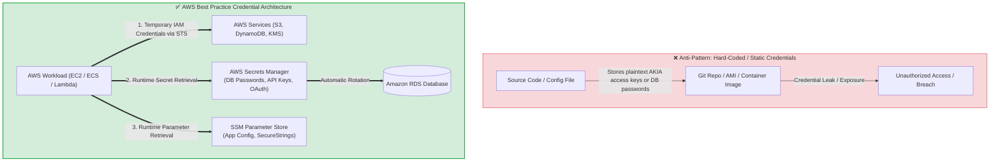
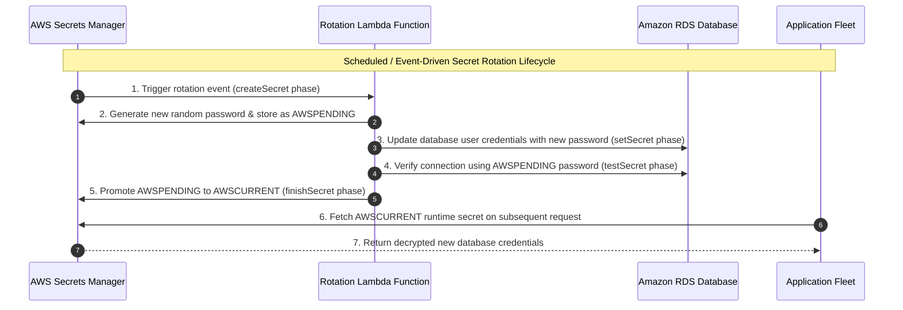
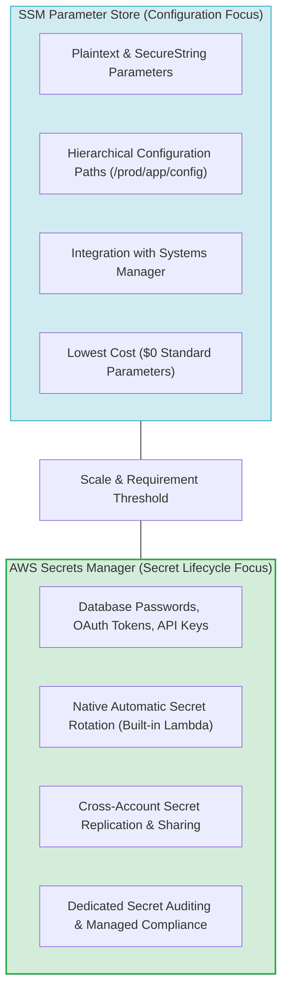
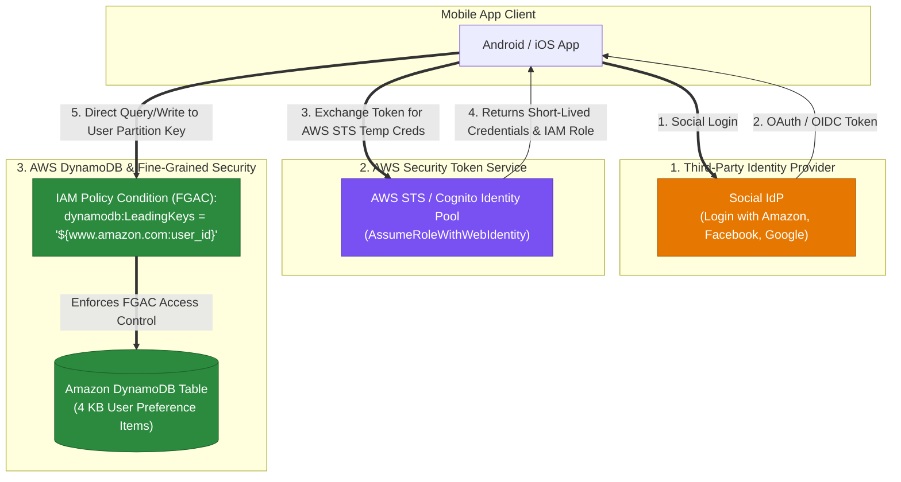
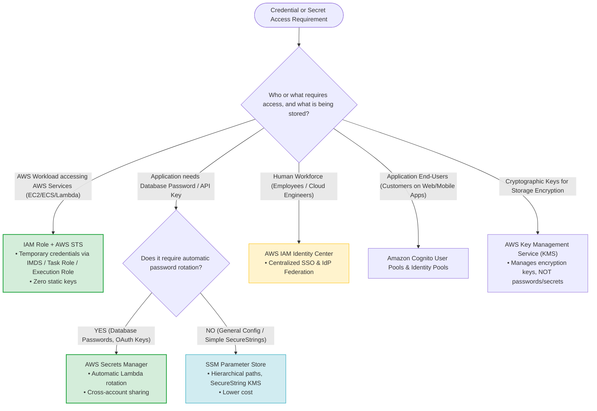

# Task 2.3: Determine Security Controls Based on Requirements — Credential Management Services

> [!NOTE]
> **Exam Mindset**: For the AWS Solutions Architect Professional (SAP-C02) and AI Practitioner (AIP-C01) exams, view **Credential Management Services** through the primary architectural question: **"How do I provide human users, application workloads, or external systems secure access to AWS or database resources without hardcoding, distributing, rotating manually, or exposing long-lived credentials?"**

---

## 1. Why Credential Management Exists

Hardcoding credentials in application source code, Docker containers, or EC2 User Data introduces severe security risks.



### Core Service Roles Summary
- **AWS IAM**: Authorizes permissions (*"Who can perform what actions?"*).
- **AWS Security Token Service (STS)**: Generates short-lived, temporary credentials for IAM roles.
- **AWS Secrets Manager**: Encrypts, stores, and **automatically rotates** application secrets (DB passwords, API keys).
- **AWS Systems Manager Parameter Store**: Manages application configuration parameters and simple `SecureString` secrets.
- **AWS Key Management Service (KMS)**: Manages cryptographic encryption keys (used by Secrets Manager and Parameter Store).
- **AWS IAM Identity Center**: Manages centralized workforce single sign-on (SSO) and corporate IdP access across accounts.
- **Amazon Cognito**: Authenticates external application end-users (mobile and web application customers).

---

## 2. Deep-Dive: AWS IAM

IAM is the primary authorization service for AWS infrastructure.
- **Goal**: Defines permissions using IAM Policies attached to Users, Groups, and Roles.
- **Rule**: IAM is **NOT** a general-purpose password database or secret storage vault.

---

## 3. Deep-Dive: IAM Roles

IAM Roles eliminate the need to distribute or store long-lived AWS access keys (`AKIA...`).
- Workloads (EC2 instance profiles, ECS task roles, Lambda execution roles, EKS pod identities) assume IAM roles to receive **temporary security credentials** automatically via IMDS or container metadata services.

> [!TIP]
> **Exam Trigger**: *"Application running on EC2 needs to access Amazon S3 without storing credentials"* $\longrightarrow$ **Attach an IAM Role / Instance Profile to the EC2 instance**.

---

## 4. Deep-Dive: AWS Security Token Service (STS)

**AWS STS** is the web service that issues short-lived temporary security credentials containing an `AccessKeyId`, `SecretAccessKey`, `SessionToken`, and `Expiration`.

```
Principal ──> sts:AssumeRole ──> Temporary Security Credentials (Valid 1h - 12h) ──> Target AWS Resource
```

- **Primary Use Cases**: Cross-account role assumption, enterprise identity federation, temporary elevated administrative access.

---

## 5. Deep-Dive: AWS Secrets Manager

**AWS Secrets Manager** protects secrets needed to access applications, services, and IT resources (RDS database credentials, API keys, OAuth tokens).

```
Application ──> Fetch Secret at Runtime ──> AWS Secrets Manager ──> Return Decrypted DB Password
```

- **Key Benefit**: Prevents credentials from being hardcoded in source code or configuration files.

---

## 6. AWS Secrets Manager Automatic Secret Rotation

Secrets Manager natively integrates with AWS Lambda to automatically rotate database credentials on a scheduled basis without application downtime.



> [!IMPORTANT]
> **Exam Trigger**: *"Database password must be rotated automatically every 30 days without manual intervention"* $\longrightarrow$ **AWS Secrets Manager with automatic Lambda rotation**.

---

## 7. Deep-Dive: AWS Systems Manager Parameter Store

**Systems Manager Parameter Store** provides secure, hierarchical storage for configuration data management and parameter values (`String`, `StringList`, `SecureString`).

- **SecureString**: Uses AWS KMS to encrypt sensitive parameters.

---

## 8. Comparative Matrix: Parameter Store vs. Secrets Manager



| Feature | SSM Parameter Store | AWS Secrets Manager |
| :--- | :--- | :--- |
| **Primary Design Focus** | Application Configuration Management | Application Secret Lifecycle & Rotation |
| **Automatic Secret Rotation** | ❌ Limited (Custom EventBridge/Lambda required) | ✅ **Native built-in Lambda rotation templates** (RDS, Redshift, DocumentDB) |
| **Cross-Account Secret Sharing** | Basic | ✅ **Native cross-account secret sharing & replication** |
| **Parameter Types** | `String`, `StringList`, `SecureString` (KMS) | JSON Key/Value Secret Structure |
| **Direct Cost Model** | **Lowest** (Standard parameters are free) | Paid ($0.40/secret/month + API request fees) |

---

## 9. Deep-Dive: AWS Key Management Service (KMS)

- **KMS**: Manages **cryptographic keys** used to execute `Encrypt` and `Decrypt` operations.
- **Secrets Manager**: Manages **application secret payloads** (which use KMS keys to encrypt secrets at rest).

> [!WARNING]
> Do not confuse KMS with Secrets Manager. KMS does **NOT** store application passwords; it encrypts them.

---

## 10. Deep-Dive: AWS IAM Identity Center

- **Target Audience**: **Human Workforce (Employees, Contractors, Cloud Engineers)**.
- **Capabilities**: Provides centralized single sign-on (SSO) and permission set assignments across multiple AWS accounts in an AWS Organization.
- **Federation**: Integrates directly with enterprise Identity Providers (Okta, Microsoft Entra ID, Ping Identity).

---

## 11. Deep-Dive: Amazon Cognito

- **Target Audience**: **External Application End-Users (Customers using mobile/web apps)**.
- **Cognito User Pools**: Manages customer sign-up, sign-in, MFA, and JWT identity tokens.
- **Cognito Identity Pools**: Exchanges federated identity tokens for temporary AWS IAM credentials.

---

## 12. Enterprise Identity Target Summary Matrix

| Identity Category | Target AWS Service | Example Scenario |
| :--- | :--- | :--- |
| **AWS Workloads (EC2/ECS/Lambda)** | **IAM Roles + AWS STS** | Application fetching data from S3 or DynamoDB. |
| **Workforce Humans (Employees)** | **AWS IAM Identity Center** | Engineers logging into the AWS Management Console across 50 accounts. |
| **Application End-Users (Customers)**| **Amazon Cognito** | Mobile app users logging into a consumer banking app. |
| **Application Secrets (DB Passwords)**| **AWS Secrets Manager** | Web app retrieving RDS MySQL credentials at runtime. |
| **Application Config Parameters** | **SSM Parameter Store** | Application fetching non-sensitive environment variables (`/prod/app/timeout`). |

---

## 13. Operational Overhead & Pricing Trade-Offs

- **IAM Roles & STS**: Zero infrastructure charge, minimal operational overhead.
- **Parameter Store**: Free for standard parameters; low operational overhead.
- **Secrets Manager**: Paid per secret; low operational overhead once rotation is configured.
- **IAM Identity Center**: Centralized administration dramatically reduces workforce overhead across multi-account organizations.

---

## 14. Scenario Pattern 1: Hard-Coded Credential Remediation
- **Problem**: Developers hardcode AWS access keys in source code.
- **Solution**: Remove static keys $\rightarrow$ Attach an **IAM Instance Profile / IAM Role** to compute workloads $\rightarrow$ Obtain temporary credentials via STS automatically.

---

## 15. Scenario Pattern 2: Cross-Account Resource Access
- **Problem**: Application in Account A needs access to an S3 bucket in Account B without long-lived keys.
- **Solution**: Application assumes an **IAM Role in Account B** using **STS `AssumeRole`** governed by Account B's Role Trust Policy.

---

## 16. Scenario Pattern 3: Automatic Database Password Rotation
- **Problem**: Database compliance demands rotating RDS passwords every 30 days without application downtime.
- **Solution**: Store database credentials in **AWS Secrets Manager** $\rightarrow$ Enable **automatic Lambda secret rotation**.

---

## 17. Scenario Pattern 4: Centralized Application Configuration
- **Problem**: Store non-sensitive application environment variables centrally across EC2 fleets.
- **Solution**: Store configuration parameters in **AWS Systems Manager Parameter Store**.

---

## 17.1 Scenario Pattern 5: Public Consumer Mobile App End-User Authentication
- **Problem**: A viral public mobile app requires authenticating millions of consumer users via social login (Google, Facebook, Amazon) and granting temporary AWS credentials to store photos in S3 and captions in DynamoDB.
- **Solution**: Use **Amazon Cognito User Pools** (for user management & social IdP login) and **Cognito Identity Pools** (to vend temporary AWS credentials via STS for S3/DynamoDB access). Avoid enterprise SAML 2.0 or LDAP/Active Directory servers for consumer apps.

---

## 17.2 Scenario Pattern 6: Mobile App User Preferences with Web Identity Federation & DynamoDB FGAC

- **Scenario**: A mobile app (3 million active users) allows users to log in using social accounts (Login with Amazon, Google, Facebook) to synchronize 4 KB user preference profiles across devices. The architecture must be highly available, cost-effective, scalable, and secure.
- **Architecture Solution**:
  1. Authenticate users via **Web Identity Federation / AWS STS** (`AssumeRoleWithWebIdentity`) or Amazon Cognito Identity Pools.
  2. Provision a table in **Amazon DynamoDB** containing an item for each user holding the 4 KB user preferences.
  3. Enforce **DynamoDB Fine-Grained Access Control (FGAC)** in IAM policies using condition keys (e.g. `dynamodb:LeadingKeys`) to restrict authenticated mobile users to querying and updating ONLY their own partition key item.



### Key Architectural Rationale:
1. **Web Identity Federation & AWS STS**: Mobile apps obtain temporary AWS credentials directly from STS using social login OAuth/OIDC tokens without storing hardcoded AWS access keys inside the app binary.
2. **DynamoDB Fine-Grained Access Control (FGAC)**: IAM policy conditions (`"dynamodb:LeadingKeys": ["${www.amazon.com:user_id}"]`) allow mobile clients to access DynamoDB **directly** while ensuring each user can only read/write their own item partition.
3. **Appropriate Payload Size (4 KB)**: A 4 KB preference payload fits well within DynamoDB's 400 KB item limit. Offloading a 4 KB item to S3 introduces unnecessary complexity and latency.

### Why Distractor Options Fail:
- *Storing 4 KB Data in S3 + DynamoDB Pointers*: Offloading data to S3 is recommended ONLY for large payloads or items exceeding DynamoDB's 400 KB limit. For 4 KB items, using S3 adds redundant API calls and fails to leverage DynamoDB FGAC.
- *RDS MySQL Instance with Read Replicas*: Relational databases do not support direct mobile client Web Identity Federation or DynamoDB FGAC policies, and RDS lacks the serverless auto-scaling needed for 3 million mobile users at low cost.

---

## 18. SAP-C02 Credential & Secret Management Master Decision Engine



---

## 19. SAP-C02 Exam Keyword Cheat Sheet

```
"AWS Workload needs access to AWS"        ──> IAM Role + AWS STS
"Temporary credentials"                   ──> AWS STS
"Cross-account role assumption"           ──> STS AssumeRole
"Store database passwords with rotation" ──> AWS Secrets Manager
"Automatic credential rotation"           ──> AWS Secrets Manager + Lambda
"Centralized configuration parameters"    ──> SSM Parameter Store
"Free / Low-cost parameter storage"       ──> SSM Parameter Store Standard Parameters
"Employee workforce single sign-on"       ──> AWS IAM Identity Center
"Application customer authentication"     ──> Amazon Cognito
"Manage storage encryption keys"          ──> AWS Key Management Service (KMS)
```

---

## 20. Common SAP-C02 Exam Traps

1. **Trap 1: Storing AWS Access Keys in Secrets Manager**: AWS workloads do not need access keys stored in Secrets Manager. Use **IAM Roles** to grant direct, temporary access.
2. **Trap 2: Choosing Parameter Store for Automatic Database Rotation**: Parameter Store does not provide built-in automatic rotation templates for databases. Use **Secrets Manager**.
3. **Trap 3: Using IAM Identity Center for Consumer App Customers**: IAM Identity Center is strictly for corporate employees/workforce. Use **Amazon Cognito** for consumer application end-users.
4. **Trap 4: Confusing KMS with Secrets Manager**: KMS encrypts data using cryptographic keys; Secrets Manager manages and rotates application credentials.

---

## 21. Core SAP-C02 Mental Model Chain

```
Classify Need ➔ Workload (IAM Role/STS) | App Secret (Secrets Manager) | App Config (Parameter Store) | Workforce (IAM Identity Center) | Customer (Cognito)
```

### Core Exam Rule
Always select the least complex, native credential service that satisfies the security, rotation, and identity requirements without introducing hardcoded static keys.