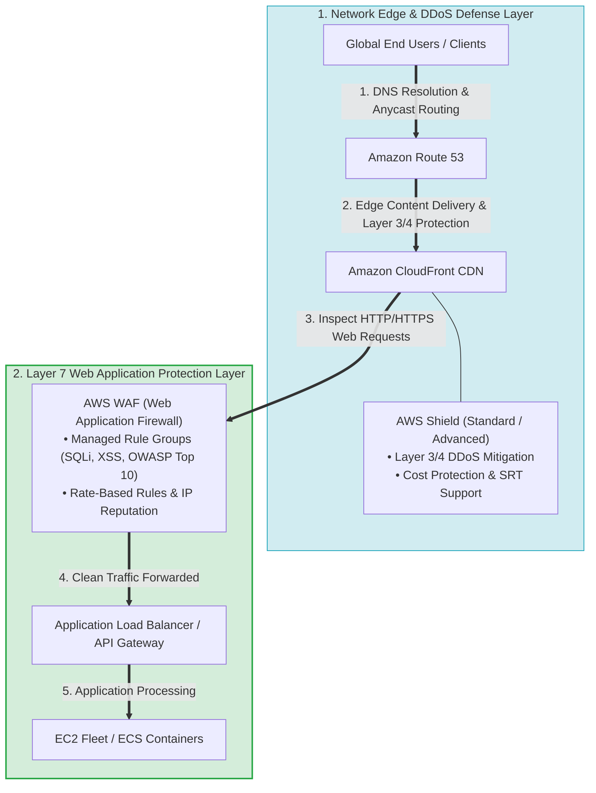
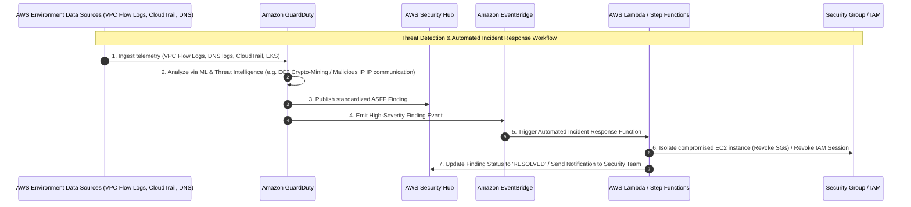
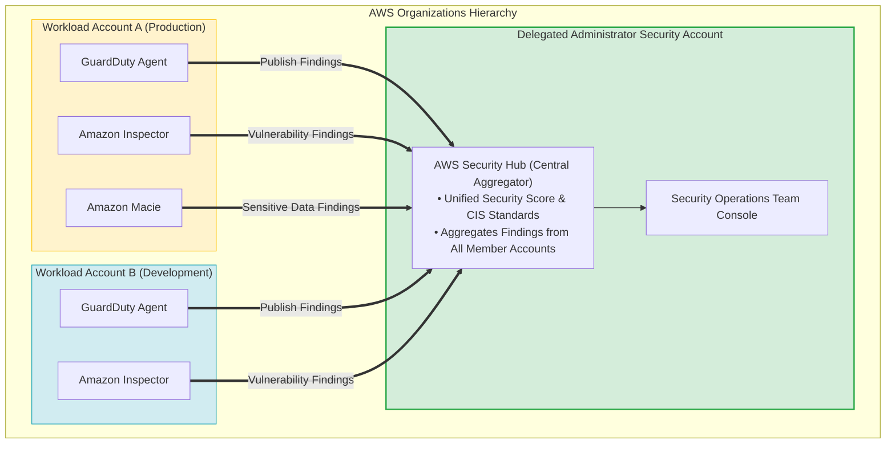
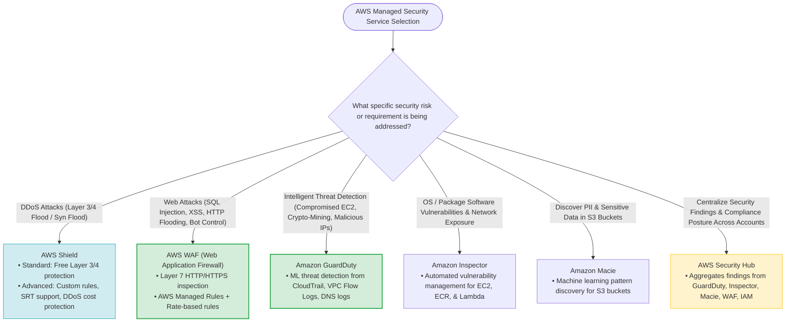
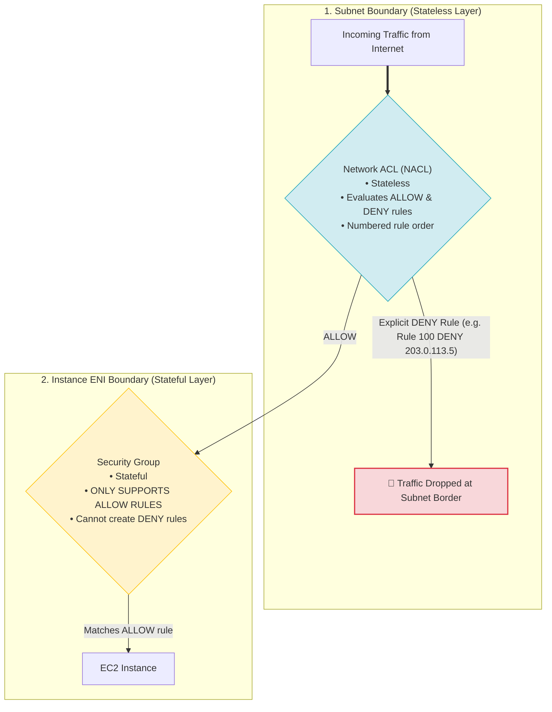

> [!NOTE]
> **Exam Mindset**: For the AWS Solutions Architect Professional (SAP-C02) and AI Practitioner (AIP-C01) exams, do not memorize AWS Shield, AWS WAF, Amazon GuardDuty, and AWS Security Hub as isolated services. Treat them as four specialized security layers operating together:
> - **AWS Shield** $\rightarrow$ **DDoS Mitigation** (Layer 3/4 Network/Transport Defense)
> - **AWS WAF** $\rightarrow$ **Web Request Filtering** (Layer 7 HTTP/HTTPS Payload Defense)
> - **Amazon GuardDuty** $\rightarrow$ **Managed Threat Detection** (Behavioral Analysis via ML)
> - **AWS Security Hub** $\rightarrow$ **Centralized Posture & Finding Aggregation** (Multi-Account Governance)

---

## 1. The Big Picture: Layered Security Architecture



### Core Service Responsibilities
- **AWS WAF**: Blocks malicious HTTP/HTTPS web requests (SQL Injection, XSS, Bots).
- **AWS Shield**: Protects against volumetric and state-exhaustion DDoS attacks.
- **Amazon GuardDuty**: Continuously analyzes log data to detect compromised AWS resources and malicious behavior.
- **AWS Security Hub**: Aggregates security findings across accounts into a single pane of glass.
- **AWS CloudTrail**: Records API activity for audit trail verification.

---

## 2. AWS Shield: Managed DDoS Protection

AWS Shield protects application workloads running on AWS against Distributed Denial of Service (DDoS) attacks.

```
Normal Flow: Client (10k req/sec) ──> Application
DDoS Attack: Attacker Fleet (10M req/sec Flood) ──> AWS Shield Filtering Engine ──> Clean Traffic ──> Application
```

- **Target Failure**: Consuming network bandwidth, SYN flood buffers, load balancer capacity, or server resources.

---

## 3. Shield Standard vs. Shield Advanced Comparison

| Feature | AWS Shield Standard | AWS Shield Advanced |
| :--- | :--- | :--- |
| **Availability & Cost** | **Included automatically ($0)** with all AWS services | **Paid subscription ($3,000/month)** + data transfer fees |
| **Protection Scope** | Layer 3/4 network & transport DDoS attacks (SYN floods, UDP reflection) | Advanced Layer 3/4/7 DDoS attack mitigation |
| **Target Integration** | Amazon CloudFront, Route 53 | CloudFront, Route 53, ALB, NLB, AWS Global Accelerator, Elastic IP |
| **Specialized Capabilities**| Automatic baseline mitigation | **DDoS Response Team (SRT)** 24/7 access, **DDoS Cost Protection** |
| **Visibility & Metrics** | Basic health status | Real-time event reporting, CloudWatch metrics, WAF auto-mitigation |

> [!TIP]
> **Exam Trigger**: *"Mission-critical web application requires 24/7 dedicated DDoS response team support and cost protection against auto-scaling bill spikes during DDoS attacks"* $\longrightarrow$ **AWS Shield Advanced**.

---

## 4. Why AWS Shield vs. AWS WAF?

- **AWS WAF**: Inspects **HTTP/HTTPS request payloads** at Layer 7 (*"Is this specific request containing SQL Injection or XSS syntax?"*).
- **AWS Shield**: Protects **network transport infra & volume** at Layers 3/4 (*"Is the target endpoint being flooded with 100 Gbps of UDP/SYN traffic?"*).

---

## 5. Operational Overhead: AWS Shield

- **Shield Standard**: Zero operational overhead (always-on, managed transparently by AWS).
- **Shield Advanced**: Low operational overhead (AWS manages detection; customer enables protection on target resources).

---

## 6. Cost Perspective: AWS Shield

- Do **NOT** select AWS Shield Advanced for basic public-facing apps unless advanced features (DDoS Cost Protection, SRT 24/7 support, or custom resource protection) are explicitly requested.

---

## 7. AWS WAF (Web Application Firewall)

AWS WAF inspects HTTP and HTTPS web requests forwarded to Amazon CloudFront, Application Load Balancers (ALB), Amazon API Gateway, or AWS AppSync.

### Attacks Prevented by WAF
- **SQL Injection (SQLi)** and **Cross-Site Scripting (XSS)**
- **HTTP Request Flooding** (mitigated via Rate-Based Rules)
- **Malicious Bots & Scrapers** (AWS WAF Bot Control)
- **Geographic Restrictions** (Geo-matching rules)
- **Known Malicious IP Ranges** (IP Set rules)

---

## 8. Where AWS WAF Integrates in Architecture

```
User ──> CloudFront CDN ──> AWS WAF ──> Application Load Balancer (ALB) ──> EC2 / ECS Fleet
```

> [!NOTE]
> **Exam Trigger**: *"Protect a web application against SQL injection and cross-site scripting attacks"* $\longrightarrow$ **AWS WAF**.

---

## 9. Operational Overhead: AWS WAF Rules & Managed Rules

- **Custom Rules**: Requires writing and maintaining custom web ACL rules.
- **AWS Managed Rules**: Pre-configured rules maintained by AWS Threat Research (e.g., *Core Rule Set (CRS)*, *Known Bad Inputs*, *SQL Database Protection*). Reduces operational overhead significantly.

---

## 10. WAF vs. Security Group vs. Network ACL Comparison

| Control Layer | Operating Scope | Statefulness | Inspection Capability | Example Rule |
| :--- | :--- | :--- | :--- | :--- |
| **Security Group (SG)** | Resource / ENI Level | **Stateful** | IP, Port, Protocol only | Allow TCP 443 from 0.0.0.0/0 |
| **Network ACL (NACL)** | Subnet Boundary Level | **Stateless** | IP, Port, Protocol, Allow/Deny | Deny 203.0.113.10/32 |
| **AWS WAF** | **Layer 7 Application** | **Stateful** | **HTTP/HTTPS Headers, Body, URI, SQLi, XSS, Bots** | Block URI containing `/admin` or SQL syntax |

---

## 11. Amazon GuardDuty: Managed Threat Detection

**Amazon GuardDuty** is a continuous security monitoring service that uses machine learning, anomaly detection, and integrated threat intelligence to identify suspicious activity.

### Telemetry Analyzed by GuardDuty
- **AWS CloudTrail Event Logs** & CloudTrail Management Events
- **VPC Flow Logs**
- **DNS Logs**
- **Amazon EKS Audit Logs & Runtime Monitoring**
- **Amazon S3 Data Events & RDS Protection**

---

## 12. GuardDuty Behavioral Model: Detect, Don't Block

GuardDuty is a **detection engine**, not an inline blocking firewall. It generates **Findings** when anomalous or malicious activity occurs (e.g., EC2 instance communicating with a Command-and-Control server, cryptocurrency mining, compromised IAM credentials).

---

## 13. Threat Detection & Automated Remediation Pipeline



> [!IMPORTANT]
> **Exam Trigger**: *"Automatically detect compromised EC2 instances or unauthorized IAM activity and immediately isolate the resource"* $\longrightarrow$ **Amazon GuardDuty + Amazon EventBridge + AWS Lambda**.

---

## 14. Operational Overhead: Amazon GuardDuty

GuardDuty requires zero agent installation (analyzes foundational AWS control plane logs out-of-band). Operational effort is limited to building automated remediation workflows.

---

## 15. Cost Perspective: Amazon GuardDuty

Usage-based pricing (based on volume of CloudTrail events and flow log data analyzed). Highly cost-effective compared to self-managed IDS/IPS appliances.

---

## 16. GuardDuty vs. AWS WAF

- **AWS WAF**: Analyzes **inbound HTTP web traffic** at the edge to block malicious requests.
- **Amazon GuardDuty**: Analyzes **AWS account & workload telemetry out-of-band** to detect compromised resources.

---

## 17. AWS Security Hub: Centralized Security Posture Management

**AWS Security Hub** provides a comprehensive view of your security posture across AWS accounts and aggregates security findings from multiple AWS services and third-party partner products.

```
GuardDuty Findings  ──┐
Inspector Findings  ──┼──> AWS Security Hub (Central Security Account) ──> Unified Compliance Score & Insights
Macie Findings      ──┤
IAM Access Analyzer ──┘
```

---

## 18. Security Hub is an Aggregator, Not a Primary Detection Engine

Security Hub normalizes findings into the **AWS Security Finding Format (ASFF)** and evaluates security posture against compliance standards (CIS AWS Foundations Benchmark, PCI DSS, AWS Foundational Security Best Practices).

---

## 19. Enterprise Multi-Account Security Governance Architecture



---

## 20. Security Hub Integration with AWS Organizations

Supports **Delegated Administrator** mode to automatically enable Security Hub and aggregate security findings across all member accounts in an AWS Organization into a central Security Tooling account.

---

## 21. Cost Perspective: AWS Security Hub

Charged per security check evaluated and per finding ingested. Highly valuable in multi-account environments.

---

## 22. End-to-End Security Architecture Integration

```
User ──> CloudFront + Shield Advanced ──> AWS WAF ──> ALB ──> EC2 Application
                                                               └──> GuardDuty / Inspector / Macie (Telemetry)
                                                                     └──> AWS Security Hub (Central Security Account)
```

---

## 23. Adding AWS CloudTrail to the Security Stack

AWS CloudTrail records all API calls made in the AWS account (*"Who executed `DeleteSecurityGroup` at 02:00 AM?"*).

---

## 24. Amazon Inspector: Automated Vulnerability Management

**Amazon Inspector** continuously scans EC2 instances, ECR container images, and AWS Lambda functions for **software vulnerabilities (CVEs)** and unintended network exposure.

> [!NOTE]
> **Key Distinction**: Inspector finds **vulnerabilities** in packages; GuardDuty detects **active threats/compromise**.

---

## 25. Amazon Macie: Sensitive Data Discovery for S3

**Amazon Macie** uses machine learning and pattern matching to discover, classify, and protect **sensitive data (PII, credit card numbers, secret keys)** stored in Amazon S3 buckets.

---

## 26. Complete AWS Managed Security Services Reference Matrix

| Security Requirement | Primary AWS Managed Service | Operating Scope |
| :--- | :--- | :--- |
| **DDoS Protection (Layer 3/4/7)** | **AWS Shield (Standard / Advanced)** | Network Edge / CloudFront / ALB |
| **HTTP Request Filtering (SQLi/XSS)** | **AWS WAF** | Layer 7 Web Traffic |
| **Managed Threat Detection** | **Amazon GuardDuty** | Account & Workload Telemetry |
| **Software Vulnerability Scanning** | **Amazon Inspector** | EC2, ECR Images, Lambda Code |
| **Sensitive S3 Data Discovery (PII)** | **Amazon Macie** | Amazon S3 Buckets |
| **API Activity Auditing** | **AWS CloudTrail** | Management & Data API Events |
| **Centralized Finding Aggregation** | **AWS Security Hub** | Multi-Account Security Governance |
| **External Resource Sharing Analysis**| **IAM Access Analyzer** | IAM & Resource-Based Policies |

---

## 27. Why AWS Managed Security Services Over EC2 Appliances?

Managed AWS security services eliminate appliance provisioning, patch management, scaling constraints, and HA configurations. On the exam, favor native managed security services unless custom third-party requirements are specified.

---

## 28. Managed Service Selection Principle

When an exam question lists both a third-party EC2 appliance solution and an AWS Managed Security service, choose the **AWS Managed Security Service** if the prompt specifies *"minimize operational overhead"* or *"managed solution"*.

---

## 29. Public Web Application Minimal Security Baseline

```
Route 53 ──> CloudFront + Shield ──> AWS WAF ──> Application Load Balancer ──> EC2 / ECS Fleet
```

---

## 30. Security Hub Automated Remediation Pattern

```
GuardDuty / Inspector Finding ──> AWS Security Hub ──> EventBridge Rule ──> Lambda ──> Auto-Remediate
```

---

## 31. Multi-Account Enterprise Security Baseline

Use **AWS Organizations** with delegated administrator accounts for **AWS Security Hub**, **Amazon GuardDuty**, **Amazon Inspector**, and **Amazon Macie**.

---

## 32. Cost Decision Framework for Security Controls

1. **Shield Standard**: Always enabled ($0).
2. **AWS WAF**: Low cost; deploy for all public web endpoints.
3. **GuardDuty & Security Hub**: High ROI in multi-account organizations.
4. **Shield Advanced**: Deploy only when high-value public assets require $24/7$ SRT support or DDoS cost protection.

---

## 33. SAP-C02 Security Service Selection & Keyword Master Decision Tree



---

## 34. SAP-C02 Exam Keyword Cheat Sheet

```
"DDoS attack protection"               ──> AWS Shield
"SQL injection / Cross-Site Scripting" ──> AWS WAF
"Rate-limiting web requests"           ──> AWS WAF Rate-Based Rules
"Threat detection / Crypto-mining"     ──> Amazon GuardDuty
"Software vulnerability scanning"      ──> Amazon Inspector
"PII / Credit card discovery in S3"    ──> Amazon Macie
"Centralized security findings"        ──> AWS Security Hub
"API call auditing"                    ──> AWS CloudTrail
"Automate threat response"             ──> GuardDuty + EventBridge + Lambda
```

---

## 30.1 Network Access Control Lists (NACL) vs. Security Groups for IP Blocking



### Security Groups vs. Network ACLs Comparison

| Feature | Security Group (SG) | Network Access Control List (NACL) |
| :--- | :--- | :--- |
| **Operating Boundary** | Instance ENI level (Virtual Interface) | Subnet boundary level |
| **Statefulness** | **Stateful** (Return traffic automatically allowed) | **Stateless** (Inbound & outbound rules required) |
| **Supported Rule Types** | **ALLOW rules ONLY** | **ALLOW and DENY rules** |
| **Rule Evaluation Order** | Evaluates all rules before allowing traffic | Processed in strict **numbered numerical order** |
| **Use Case for Blocking IP**| **CANNOT block explicit IPs** | **Ideal for blocking specific offending IP/CIDR blocks** |

---

## 34.1 Real-World Exam Scenario: Blocking Offending IP Port Scanners & Layer 3/4 DDoS Defense

- **Scenario**: An enterprise identifies unusual API activity and port scanning targeted at EC2 instances from a specific IP address. The Solutions Architect must block the offending IP immediately and fortify the infrastructure against Layer 3/4 network and transport layer DDoS attacks.
- **Architecture Solution**:
  1. Add a specific **`DENY` rule** for the offending IP address in the **Network ACL (NACL)** associated with the EC2 subnets.
  2. Enable **AWS Shield Advanced** to protect cloud resources against network/transport layer (Layer 3/4) DDoS attacks.

### Why Distractor Options Fail:
- *Adding DENY rule to Security Groups*: **Security Groups DO NOT support `DENY` rules**—they only support `ALLOW` rules.
- *AWS WAF for Layer 3/4 DDoS*: AWS WAF inspects Layer 7 HTTP/HTTPS request payloads; it does **not** protect against Layer 3/4 network/transport layer DDoS attacks (SYN floods, UDP reflection).
- *Amazon Macie for DDoS*: **Amazon Macie** is an S3 data discovery and PII classification service using machine learning; it has zero network firewall or DDoS protection capabilities.
- *Route 53 IP Blocking*: Route 53 is a DNS service and cannot directly block IP addresses at the VPC subnet layer.
- *Windows Firewall modification*: Dropping packets at the guest OS level still allows malicious traffic to reach the EC2 network interface, consuming network bandwidth and hypervisor capacity.

---

## 34.2 Real-World Exam Scenario: Preventing Accidental Public Exposure of S3 Data (Amazon S3 Block Public Access vs. IAM Canned ACL, AWS Config & SCP Traps)

- **Scenario**: A company stores confidential files in an Amazon S3 bucket. A recent security incident occurred when confidential files were accidentally made public, resulting in data leakage. Management instructs the Solutions Architect to safeguard the S3 bucket by ensuring only private files can be uploaded and prohibiting all public read or write access with **MINIMAL EFFORT**. What solution should be implemented?
- **Architecture Solution**:
  - Enable **Amazon S3 Block Public Access** on the Amazon S3 bucket (or at the AWS account level).

```mermaid
flowchart TD
    subgraph AccessAttempt ["1. S3 Request / Policy Update Attempt"]
        PutObj["User PutObject with Public ACL"]
        PutPol["Bucket Policy Granting Public Access"]
    end

    subgraph S3BPA ["2. Amazon S3 Block Public Access Engine (Minimal Effort Single Toggle)"]
        BlockAcls["BlockPublicAcls: Denies new public ACLs"]
        IgnoreAcls["IgnorePublicAcls: Ignores all public ACLs"]
        BlockPolicy["BlockPublicPolicy: Denies new public policies"]
        RestrictBuckets["RestrictPublicBuckets: Restricts public bucket access"]

        PutObj & PutPol ==> S3BPA
    end

    subgraph Enforcement ["3. Centralized Override & Protection"]
        Denied["🚫 Request Instantly Denied / Public Access Blocked<br/>(Overrides all bucket policies & ACLs across account)"]
        S3BPA ==> Denied
    end

    classDef attempt fill:#fff3cd,stroke:#ffc107,stroke-width:1px;
    classDef bpa fill:#7950f2,stroke:#5f3dc4,color:#ffffff;
    classDef deny fill:#f8d7da,stroke:#dc3545,stroke-width:2px;

    class PutObj,PutPol attempt;
    class S3BPA,BlockAcls,IgnoreAcls,BlockPolicy,RestrictBuckets bpa;
    class Denied deny;
```

### Key Technical Rationale:
1. **Amazon S3 Block Public Access for Minimal Effort**:
   - S3 Block Public Access provides centralized controls at the bucket or account level that override all bucket policies, access control lists (ACLs), and object permissions to prevent public access.
   - It requires a single console toggle or API setting (`PutPublicAccessBlock`), delivering instant protection with **minimal operational effort**.

### Why Distractor Options Fail:
- *IAM Policy Restricting `s3:PutObject` to Private Canned ACLs*:
  - **High Operational Overhead**: Requires writing, testing, and attaching custom IAM policies to every IAM user, group, and role across the company. Furthermore, IAM policies do not prevent bucket policy changes that allow public read access.
- *AWS Config Managed Rules (`s3-bucket-public-read-prohibited`)*:
  - **Asynchronous Evaluation Only**: AWS Config managed rules evaluate configurations asynchronously and emit alerts or notifications—they **cannot** actively block an HTTP `PutObject` request in real time during execution!
- *AWS Organizations Service Control Policy (SCP)*:
  - **Excessive Setup Complexity**: Implementing SCPs requires setting up AWS Organizations, writing complex JSON policy statements, and deploying them across organizational units (OUs), violating the explicit requirement for **minimal effort**.

---

## 35. The Core SAP-C02 Layered Security Mental Model


- **Layer 1 (Network Border IP Blocking)**: `Network ACL (NACL Explicit DENY Rule)`
- **Layer 2 (Network Edge DDoS)**: `AWS Shield (Standard / Advanced)`
- **Layer 3 (Layer 7 Web App Security)**: `AWS WAF`
- **Layer 4 (Behavioral Threat Detection)**: `Amazon GuardDuty`
- **Layer 5 (Workload Vulnerability Management)**: `Amazon Inspector`
- **Layer 6 (Data Classification & Protection)**: `Amazon Macie`
- **Layer 7 (Centralized Security Operations)**: `AWS Security Hub`
- **Layer 8 (API Audit Trail)**: `AWS CloudTrail`