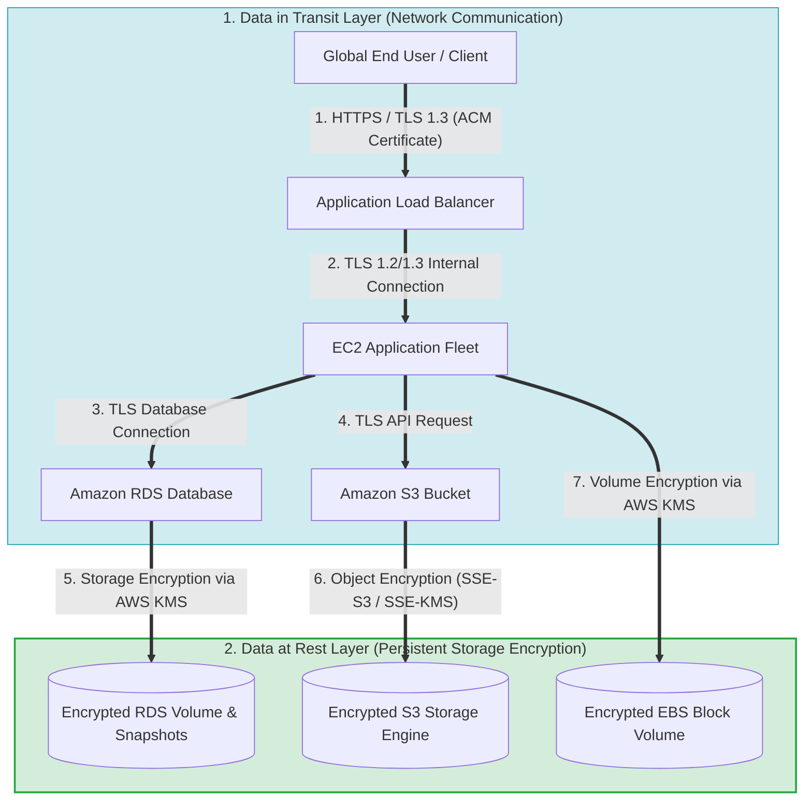
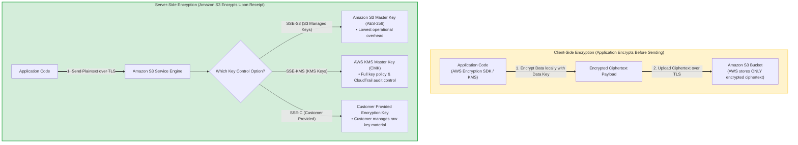
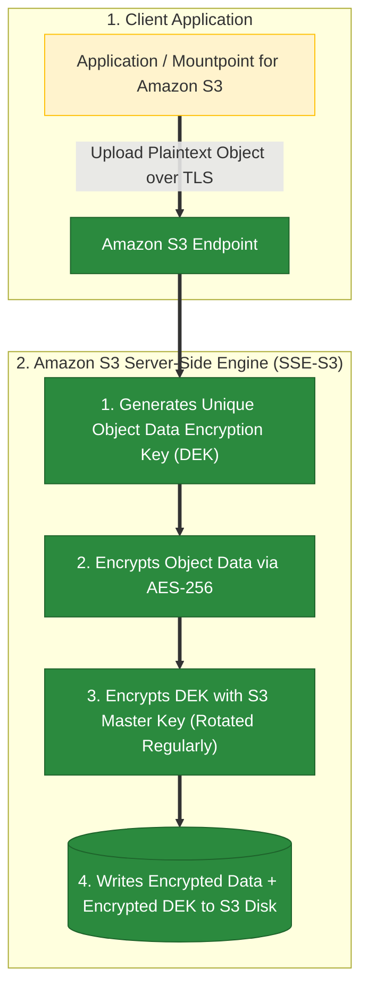
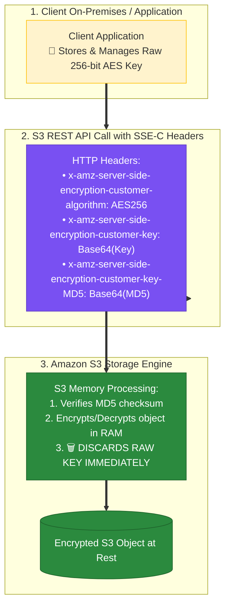
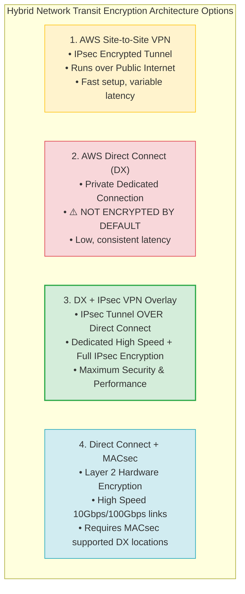
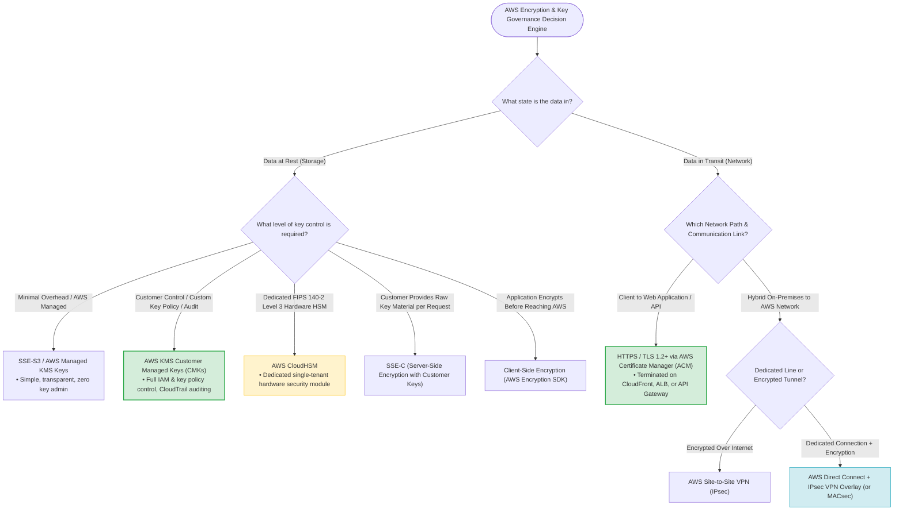
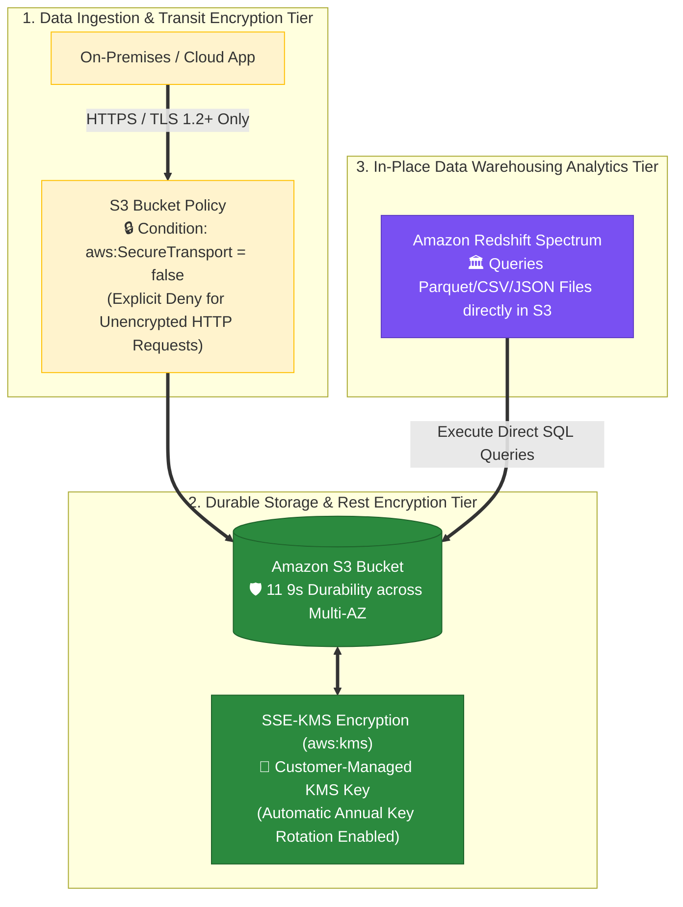
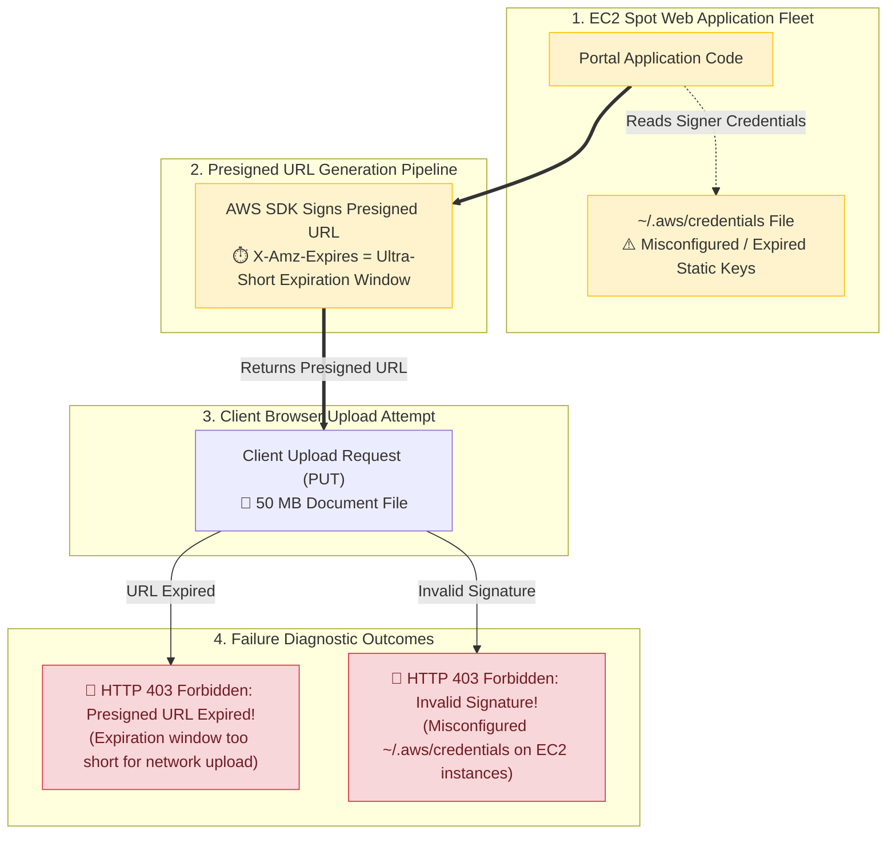

# Task 2.3: Determine Security Controls Based on Requirements — Encryption Options for Data at Rest and Data in Transit

> [!NOTE]
> **Exam Mindset**: For the AWS Solutions Architect Professional (SAP-C02) and AI Practitioner (AIP-C01) exams, do not start by asking *"Which encryption service should I use?"* Start by evaluating:
> 1. **Data State**: Is it **Data at Rest** (Storage) or **Data in Transit** (Network)?
> 2. **Key Governance**: Who controls the encryption keys (**AWS Managed** vs. **Customer Managed KMS Keys** vs. **CloudHSM FIPS 140-2 Level 3**)?
> 3. **Transparency**: Does encryption need to be **Server-Side (Transparent)** or **Client-Side (Envelope Encryption)**?

---

## 1. Why Encryption Exists: Data at Rest vs. Data in Transit

Encryption protects sensitive data from unauthorized disclosure across storage and network layers.



- **Data at Rest**: Protects static data stored on persistent media (S3, EBS, RDS, DynamoDB, EFS, FSx, Backups).
- **Data in Transit**: Protects data moving across networks between endpoints (TLS/SSL, IPsec VPN, MACsec).

---

## 2. Defining Data at Rest

Data at rest refers to inactive data stored physically on storage media. If an unauthorized entity gains access to the underlying physical disk or snapshot, the data remains completely unreadable without the corresponding cryptographic key.

---

## 3. AWS Key Management Service (KMS)

**AWS KMS** is a managed service that makes it easy to create and control the cryptographic keys used to encrypt data across AWS services and applications.

```
Without KMS: Application ──> Custom Encryption Code ──> Manually Managed Keys (High Risk & Overhead)
With KMS:    Application ──> AWS KMS API ──> Managed Key Lifecycle (Rotation, Auditing, Access Control)
```

---

## 4. KMS Key Types & Governance Hierarchy

| KMS Key Type | Key Management Owner | Key Policy Control | CloudTrail Auditability | Primary Use Case |
| :--- | :--- | :--- | :--- | :--- |
| **AWS Owned Keys** | AWS Service | None (Managed by AWS) | No direct KMS log entries | Default zero-cost encryption for AWS internal operations. |
| **AWS Managed Keys** | AWS Service on your behalf | Viewable only | Yes (KMS API calls logged) | Simple encryption with zero key administration overhead. |
| **Customer Managed Keys (CMKs)**| **Customer (You)** | **Full Control** (Key Policy & IAM) | **Yes (Full Auditability)** | Regulatory compliance, cross-account access, key rotation control. |

---

## 5. When to Choose Customer Managed KMS Keys (CMKs)

Select a **Customer Managed Key (CMK)** when the exam scenario specifies:
- *"Customer must control the key policy and access permissions"*
- *"Ability to manually rotate or immediately revoke key access"*
- *"Cross-account access to encrypted AWS resources"*
- *"Regulatory compliance requires customer-controlled keys & audit logs"*

---

## 6. When AWS Managed Encryption is Sufficient

If a scenario asks to *"Encrypt S3 objects at rest with minimal operational overhead"* and does **NOT** mention custom key control, cross-account sharing, or strict rotation rules, choose the simplest managed encryption option (**SSE-S3**). Do not introduce unnecessary CMK complexity.

---

## 7. Deep-Dive: Amazon S3 Encryption Options



### S3 Encryption Comparison Matrix

| Option | Encryption Location | Key Management Owner | Operational Overhead |
| :--- | :--- | :--- | :--- |
| **SSE-S3** | Server-Side (S3) | Amazon S3 (AES-256) | **Lowest** (Default S3 Encryption) |
| **SSE-KMS** | Server-Side (S3) | AWS KMS (Managed or Customer Key) | Low / Medium (KMS API charges apply) |
| **DSSE-KMS**| Server-Side (S3) | Dual-layer KMS Encryption | Medium (Compliance dual-encryption) |
| **SSE-C** | Server-Side (S3) | Customer provides raw key per HTTP request | High (Customer manages raw key material) |
| **Client-Side**| **Client App** | Application (AWS Encryption SDK) | **Highest** (AWS receives only ciphertext) |

---

## 7.1 Amazon S3 Envelope Encryption Mechanics: SSE-S3 vs. SSE-KMS vs. SSE-C vs. Client-Side Encryption

### Server-Side Encryption with Amazon S3-Managed Keys (SSE-S3)
- **Envelope Encryption Mechanics**:
  1. Amazon S3 generates a **unique Data Encryption Key (DEK)** for each uploaded object.
  2. The object data is encrypted using **256-bit Advanced Encryption Standard (AES-256)**.
  3. As an additional safeguard, S3 encrypts the unique data key itself with an S3 **Master Key** that Amazon S3 manages and **rotates regularly**.
  4. Encryption and decryption occur transparently on the S3 server side when objects are written to disk or retrieved by clients.
- **Client Visibility**: The client NEVER receives, manages, or sees encryption keys or KMS API calls.



### Detailed S3 Encryption Methods Comparison

| Feature | SSE-S3 (S3-Managed) | SSE-KMS (KMS-Managed) | SSE-C (Customer-Provided) | Client-Side Encryption |
| :--- | :--- | :--- | :--- | :--- |
| **Data Key Generation** | Server-side by Amazon S3 | Server-side via AWS KMS | Server-side from header key | **Client-side before upload** |
| **Master Key Management** | **Managed & rotated by S3** | Managed by KMS (AWS/CMK) | Managed by Customer | Managed by Customer |
| **Encryption Algorithm** | AES-256 | AES-256 (via KMS) | AES-256 (via header key) | Application chosen |
| **Client Key Access** | ❌ **Client never sees key** | ❌ Client never sees key | ⚠️ Must supply key per request | ✅ Client holds raw key |
| **CloudTrail Audit Logs** | ❌ No KMS API audit log | ✅ Logs KMS `Decrypt` calls | ❌ No KMS API audit log | ❌ No KMS API audit log |
| **Key Rotation** | **Automated regularly by S3** | Automated annually or manual | Customer manual rotation | Customer manual rotation |

### Why Distractor Options Fail:
- *Data encryption key returned to client to encrypt object data (Your Selection)*:
  - Returning a data encryption key to the client for local encryption is **Client-Side Encryption** (e.g. `GenerateDataKey` via AWS Encryption SDK), NOT Server-Side Encryption (SSE-S3)! In SSE-S3, key generation, object encryption, and master key rotation happen entirely on the S3 server side without sending keys to the client.
- *Manage AWS KMS Keys in SSE-S3*:
  - Managing KMS keys occurs in **SSE-KMS**, NOT SSE-S3. SSE-S3 uses S3-managed keys, not KMS keys.
- *Separate API Key Permissions*:
  - SSE-S3 uses 256-bit AES cryptographic keys, NOT API keys. Access control is enforced via standard S3 bucket policies and IAM permissions.

---

## 7.2 Real-World Exam Scenario: AWS CloudHSM Hardware SSL/TLS Offloading & Durable Log Encryption (CloudHSM + TCP Pass-Through ELB + Private S3 SSE Logs vs. S3 Key Retrieval & Ephemeral Volume Traps)

- **Scenario**: A health insurance company in a hybrid cloud environment mandates that web SSL private keys must be kept secure in hardware at all times, and application logs must be durably stored and restricted to authorized users. How should the cloud engineer satisfy these compliance requirements?
- **Architecture Solution**:
  - Configure the ELB (NLB/CLB) to perform **TCP Load Balancing** (Layer 4 pass-through).
  - Use an **AWS CloudHSM cluster** to offload SSL/TLS transactions, storing the web server's private key inside FIPS 140-2 Level 3 hardware.
  - Persist application server logs to a private **Amazon S3 bucket using Server-Side Encryption (SSE)**.

```mermaid
flowchart TD
    subgraph Clients ["1. Web Clients"]
        Users["Global HTTPS Web Clients"]
    end

    subgraph PassThroughLB ["2. Layer 4 Pass-Through Load Balancing"]
        ELB["Elastic Load Balancer (NLB / TCP Mode)<br/>⚡ Layer 4 TCP Pass-Through (Raw TLS Traffic)"]
        Users ==>|"Encrypted TLS Traffic (Port 443)"| ELB
    end

    subgraph ComputeHSMTier ["3. Hardware Security SSL Offload Tier"]
        EC2_App["EC2 Web Application Servers"]
        CloudHSM["AWS CloudHSM Cluster<br/>🛡️ FIPS 140-2 Level 3 Hardware Security Module<br/>(Stores Private Key & Performs Hardware SSL Offload)"]

        ELB ==>|"Forward Raw TLS Payload"| EC2_App
        EC2_App <==|"PKCS#11 / JCE Hardware Cryptographic Offload"==> CloudHSM
    end

    subgraph LogStorage ["4. Durable Encrypted Log Storage Tier"]
        S3_Logs[("Private Amazon S3 Bucket<br/>🔒 Durable Log Storage with Server-Side Encryption (SSE)<br/>(Restricted Access via IAM / KMS Policies)")]
        EC2_App ==>|"Persist Application Server Logs"| S3_Logs
    end

    classDef client fill:#fff3cd,stroke:#ffc107,stroke-width:1px;
    classDef hsm fill:#7950f2,stroke:#5f3dc4,color:#ffffff;
    classDef storage fill:#2b8a3e,stroke:#1e632b,color:#ffffff;

    class Users client;
    class ELB,EC2_App,CloudHSM hsm;
    class S3_Logs storage;
```

### Key Technical Rationale:
1. **AWS CloudHSM for Hardware SSL/TLS Offloading**:
   - CloudHSM provides dedicated FIPS 140-2 Level 3 hardware security modules. Storing web server private keys in CloudHSM guarantees that private key material NEVER leaves the hardware in plaintext.
   - Configuring the load balancer in **TCP Load Balancing Mode** (Layer 4) passes raw TLS traffic through to EC2 web servers, which invoke CloudHSM APIs (via PKCS#11 or JCE libraries) to perform cryptographic SSL/TLS handshake offloading inside dedicated hardware.
2. **Server-Side Encrypted S3 Bucket for Durable Log Storage**:
   - Application server audit logs stored in a private S3 bucket encrypted with **Server-Side Encryption (SSE)** provide high durability (11 9s) and fine-grained access control so only key users with `kms:Decrypt` and `s3:GetObject` permissions can view logs.

### Why Distractor Options Fail:
- *Storing Private Key in S3 & Downloading on Boot (Your Selection)*:
  - Storing raw SSL private key files in S3 buckets exposes keys to disk storage, S3 IAM policy misconfigurations, and plaintext memory leaks. Dedicated key security mandates storing private keys inside **AWS CloudHSM** hardware.
- *Persisting Application Logs to Encrypted Ephemeral Volumes*:
  - **Ephemeral / Instance Store Volumes** are temporary, non-durable block storage. Data stored on ephemeral volumes is permanently deleted whenever an EC2 instance stops or terminates! Storing application audit logs on ephemeral volumes violates log durability and compliance requirements.

---


## 8. S3 Server-Side Encryption with KMS (SSE-KMS)

Uses AWS KMS to generate envelope data keys. Enables fine-grained IAM policy controls, key rotation policies, and CloudTrail auditing for object access.

---

## 9. S3 Server-Side Encryption with Customer-Provided Keys (SSE-C)

Amazon S3 performs encryption/decryption in memory and immediately discards the raw key. The customer manages and stores the encryption keys on-premises, passing them in HTTP request headers.

### Required HTTP REST API Headers for SSE-C

When performing object uploads (`PUT`/`POST`), downloads (`GET`), metadata lookups (`HEAD`), or copy operations (`COPY`) on SSE-C encrypted objects, the client **MUST include all three HTTP request headers**:

| HTTP Request Header | Expected Value / Format | Purpose | When Required? |
| :--- | :--- | :--- | :--- |
| `x-amz-server-side-encryption-customer-algorithm` | `AES256` | Specifies the encryption algorithm S3 must use in memory. | `PUT`, `POST`, `GET`, `HEAD`, `COPY` |
| `x-amz-server-side-encryption-customer-key` | 256-bit AES key, Base64-encoded | Provides the raw encryption key material for S3 to encrypt/decrypt in memory. | `PUT`, `POST`, `GET`, `HEAD`, `COPY` |
| `x-amz-server-side-encryption-customer-key-MD5` | 128-bit MD5 digest of the raw key, Base64-encoded | Network integrity check to verify key was not corrupted in transit before S3 executes encryption/decryption. | `PUT`, `POST`, `GET`, `HEAD`, `COPY` |



> [!CAUTION]
> **Critical SSE-C Security & Operational Traps**:
> 1. **AWS Never Stores Key Material**: AWS does NOT store, log, or track customer-provided keys. If the customer loses the raw key, **all S3 object data is permanently unrecoverable**!
> 2. **S3 Console Incompatibility**: The **AWS Management Console CANNOT view or download SSE-C encrypted objects** because the console does not store or prompt for customer raw keys. SSE-C operations require AWS CLI, SDKs, or raw REST API calls.
> 3. **GET/HEAD Requests Mandatory Headers**: Attempting to read metadata (`HEAD`) or download an object (`GET`) without supplying the exact same 3 `x-amz-server-side-encryption-customer-*` headers returns `400 Bad Request` or `403 Forbidden`.
> 4. **S3 Presigned URLs with SSE-C Rule**: When creating or generating **Amazon S3 Presigned URLs for SSE-C encrypted objects**, you **MUST specify the encryption algorithm** using the `x-amz-server-side-encryption-customer-algorithm` request header during URL generation. When the client executes the HTTP request (`GET`/`PUT`) using the presigned URL, the client must include the matching `x-amz-server-side-encryption-customer-algorithm`, `x-amz-server-side-encryption-customer-key`, and `x-amz-server-side-encryption-customer-key-MD5` request headers.

---


## 10. Amazon EBS Volume Encryption

- Encrypts EBS boot volumes, data volumes, point-in-time snapshots, and all volume copies seamlessly via AWS KMS.
- **Account Setting**: Can enable *Always Encrypt New EBS Volumes* at the AWS Region level.

---

## 11. Amazon RDS Encryption at Rest vs. In-Transit

- **Encryption at Rest**: Encrypts database storage, automated backups, read replicas, and snapshots via KMS.
- **Encryption in Transit**: Requires enabling **TLS/SSL database connections** between the application and RDS.

> [!WARNING]
> Enabling RDS encryption at rest does **NOT** automatically encrypt network connections. Always enforce TLS for data in transit.

---

## 12. Amazon DynamoDB Encryption

All DynamoDB table data is encrypted at rest by default using AWS owned keys, AWS managed KMS keys, or customer managed KMS keys.

---

## 13. Amazon EFS Encryption Options

- **At Rest**: Transparent storage encryption enabled at file system creation via AWS KMS.
- **In Transit**: Enforced using the `amazon-efs-utils` mount helper with the `-o tls` option.

---

## 14. Secrets Management vs. Encryption Keys

```
AWS KMS ──> Manages Cryptographic Keys (Encrypt / Decrypt operations)
AWS Secrets Manager ──> Manages & Rotates Database Passwords, API Tokens, OAuth Secrets
SSM Parameter Store ──> Stores Configuration Parameters & SecureStrings
```

> [!IMPORTANT]
> **Exam Trap**: Do not use KMS to store application passwords or API tokens directly. Use **AWS Secrets Manager** or **SSM Parameter Store SecureStrings** (which use KMS for underlying encryption).

---

## 15. Defining Data in Transit

Data in transit refers to data actively moving across a network. It is protected against interception, tampering, and eavesdropping using **TLS/SSL (HTTPS)** or **IPsec network tunnels**.

---

## 16. HTTPS & Transport Layer Security (TLS)

TLS provides three core security guarantees for network communications:
1. **Confidentiality** (Payload encryption)
2. **Integrity** (Prevents packet tampering)
3. **Authentication** (Verifies server identity via X.509 digital certificates)

---

## 17. AWS Certificate Manager (ACM)

**AWS Certificate Manager (ACM)** provisions, manages, and deploys public and private SSL/TLS certificates for use with AWS services (CloudFront, Application Load Balancers, API Gateway).

> [!NOTE]
> Public TLS certificates issued by ACM are **free of charge** when used with integrated AWS services.

---

## 18. Architectural Roles: ACM vs. KMS vs. TLS

- **ACM**: Provisions and manages X.509 TLS **Digital Certificates**.
- **KMS**: Generates and manages **Cryptographic Keys** for storage encryption.
- **TLS**: Executes **Network Protocol Encryption** for data moving across the wire.

---

## 19. Amazon CloudFront End-to-End Transit Encryption

For complete end-to-end encryption with Amazon CloudFront, enforce HTTPS across **BOTH** network legs:
1. **Viewer $\rightarrow$ CloudFront Edge**: HTTPS enforced via ACM certificate.
2. **CloudFront Edge $\rightarrow$ Origin (ALB/S3)**: HTTPS enforced with valid origin SSL/TLS certificates.

---

## 20. Application Load Balancer (ALB) TLS Termination

- **TLS Offloading/Termination**: ALB decrypts HTTPS client traffic at port 443 and forwards plain HTTP traffic to backend EC2 instances on port 8080 over private VPC subnets.
- **End-to-End Encryption**: If required by compliance, ALB re-encrypts traffic and forwards HTTPS requests to backend EC2 instances over TLS.

---

## 21. Amazon API Gateway Transit Security

API Gateway endpoints enforce HTTPS by default. Private integrations via VPC Links ensure transit encryption when routing requests to internal VPC backends.

---

## 22. Myth Buster: VPC Private Traffic is NOT Automatically Encrypted

Private VPC networking isolates traffic from the public Internet, but does **NOT** automatically encrypt packet payloads moving between instances unless specific Nitro instance-to-instance encryption is supported or application TLS is enforced.

---

## 23. AWS PrivateLink and Encryption

**AWS PrivateLink** establishes private network connectivity to AWS services or third-party SaaS applications without exposing traffic to the public Internet. For strict compliance, combine PrivateLink with **TLS application-level encryption**.

---

## 24. AWS Site-to-Site VPN (IPsec)

Provides encrypted network tunnels over the public Internet between on-premises gateways and AWS Virtual Private Gateways (VGW) or Transit Gateways (TGW) using **IPsec (Internet Protocol Security)**.

---

## 25. AWS Direct Connect (DX) is NOT Encrypted by Default



> [!WARNING]
> **Exam Trap**: AWS Direct Connect provides a private dedicated connection, but **does NOT encrypt network traffic by default**. To encrypt Direct Connect traffic, deploy an **IPsec VPN overlay on top of Direct Connect** or enable **MACsec (Layer 2 IEEE 802.1AE)** on supported 10Gbps/100Gbps links.

---

## 26. Hybrid Connectivity Matrix: Site-to-Site VPN vs. Direct Connect

| Hybrid Option | Connection Type | Encryption Default | Latency & Bandwidth |
| :--- | :--- | :--- | :--- |
| **Site-to-Site VPN** | Public Internet | **Encrypted (IPsec)** | Variable latency / Up to 1.25 Gbps per tunnel |
| **Direct Connect (DX)** | Private Dedicated | ❌ **NOT Encrypted** | Consistent low latency / 1 Gbps to 100 Gbps |
| **DX + IPsec VPN Overlay** | Private Dedicated | **Encrypted (IPsec Overlay)**| High-performance dedicated + encrypted |
| **DX + MACsec** | Private Dedicated | **Encrypted (Layer 2 MACsec)**| Hardware-speed 10Gbps/100Gbps encryption |

---

## 27. AWS Transit Gateway Encryption Integration

AWS Transit Gateway integrates with AWS Site-to-Site VPN to terminate IPsec tunnels, enabling encrypted inter-VPC and hybrid network transit routing.

---

## 28. AWS Cloud WAN Global Transit Governance

AWS Cloud WAN centrally manages global core networks across AWS Regions and on-premises sites, orchestrating underlying VPN tunnels and Transit Gateways.

---

## 29. AWS CloudHSM

**AWS CloudHSM** provides dedicated, single-tenant Hardware Security Modules (HSMs) under your direct control inside your VPC, meeting **FIPS 140-2 Level 3** compliance requirements.

> [!TIP]
> **Exam Trigger**: *"Must maintain exclusive control of dedicated HSM hardware under FIPS 140-2 Level 3 requirements"* $\longrightarrow$ **AWS CloudHSM**.

---

## 30. Comparative Matrix: AWS KMS vs. AWS CloudHSM

| Feature | AWS Key Management Service (KMS) | AWS CloudHSM |
| :--- | :--- | :--- |
| **Tenancy & Hardware** | Multi-tenant managed service (AWS-managed HSMs) | **Dedicated single-tenant hardware HSM** |
| **Key Governance** | Managed via AWS IAM and Key Policies | Managed directly via standard PKCS#11 / JCE APIs |
| **FIPS Compliance Level**| FIPS 140-2 Level 2 (Level 3 for HSM module) | **FIPS 140-2 Level 3** |
| **Operational Overhead**| **Low** (Fully managed by AWS) | **High** (Customer manages backup, HA, admin) |
| **Relative Cost** | Low per-key / request cost | Higher fixed hourly cost per HSM instance |

---

## 31. AWS KMS External Key Store (XKS)

Allows KMS to generate and use encryption keys stored in a customer's external, on-premises Key Management Infrastructure outside of AWS.

---

## 32. AWS Encryption SDK for Application-Level Envelope Encryption

The **AWS Encryption SDK** is a client-side library that automates envelope encryption (encrypting data locally with a Data Encryption Key, then encrypting the DEK with a KMS Key).

---

## 33. Client-Side vs. Server-Side Encryption Summary

- **Client-Side Encryption**: Application encrypts data locally *before* transmitting it to AWS. AWS never sees plaintext data.
- **Server-Side Encryption**: Application sends plaintext over TLS; AWS service encrypts data upon receipt before writing to storage.

---

## 34. Encryption is NOT a Substitute for IAM Authorization

Encryption ensures data confidentiality, but does **NOT** grant access. Authorization requires matching IAM Policies, Resource Policies, and KMS Key Policies.

---

## 35. KMS Key Policy vs. IAM Policy Authorization

To access an S3 object encrypted with an SSE-KMS Customer Managed Key, a principal must have **BOTH**:
1. Permission in their **IAM Identity Policy** (`s3:GetObject` + `kms:Decrypt`)
2. Permission in the **KMS Key Policy** allowing the principal to perform `kms:Decrypt`

---

## 36. Cross-Account Encrypted Resource Sharing

Sharing an encrypted S3 bucket or snapshot across accounts requires modifying the **KMS Key Policy** in Account A to explicitly trust Account B's root account or IAM role.

---

## 37. AWS KMS Multi-Region Keys

Allows replicating KMS keys across AWS Regions with identical key IDs and key material, simplifying cross-Region encrypted data replication and disaster recovery.

---

## 38. Encryption Considerations in Disaster Recovery (DR)

During cross-Region disaster recovery, ensure secondary Regions have access to corresponding **KMS keys** (via Multi-Region keys or Cross-Region snapshot copy key re-encryption); otherwise, restored data cannot be decrypted.

---

## 39. Cost Optimization Principles for Encryption

- **SSE-S3**: Zero additional key cost.
- **SSE-KMS**: Monthly key charge ($1/month per CMK) + request fees (mitigated using KMS Bucket Keys for S3).
- **CloudHSM**: Highest fixed hourly cost per instance.

---

## 40. Operational Overhead Comparison Matrix

| Encryption Architecture | Operational Overhead | Customer Control Level |
| :--- | :--- | :--- |
| **SSE-S3** | **Lowest** | Low (AWS Managed) |
| **SSE-KMS** | Low / Medium | **High** (Key Policy & IAM control) |
| **SSE-C** | High | High (Raw key management) |
| **Client-Side Envelope Encryption** | **Highest** | **Maximum** (App-level encryption) |
| **AWS KMS (CMK)** | Low | High |
| **AWS CloudHSM** | **High** | **Maximum (Dedicated FIPS 3 HSM)** |
| **TLS via ACM** | Low | High |

---

## 41. SAP-C02 Complete Encryption & Key Management Decision Engine



---

## 41.1 Real-World Exam Scenario: Fully Managed Large-File Encryption at Rest & Transit for Redshift Spectrum (S3 SSE-KMS + HTTPS Bucket Policy vs. DynamoDB 400KB Limit, EC2 EBS & File Gateway Traps)

- **Scenario**: A company is migrating an on-premises application processing large files containing sensitive information to AWS. Due to limited staff, the company mandates fully managed AWS services with minimal maintenance. The storage solution must be highly durable and available, enforce data encryption at rest using customer-managed rotated KMS keys, enforce data encryption in transit, and support in-place querying via **Amazon Redshift Spectrum**. What is the recommended solution?
- **Architecture Solution**:
  - Create an **Amazon S3 bucket** to store all data files.
  - Enable **Server-Side Encryption with AWS KMS (SSE-KMS)** using a customer-managed key with automatic key rotation enabled.
  - Apply an S3 **Bucket Policy enforcing HTTPS-only connections** using `aws:SecureTransport: false`.



### Key Technical Rationale:
1. **Amazon S3 + Redshift Spectrum for Large-File Data Analytics**:
   - **Amazon S3** is a fully managed object storage service providing 99.999999999% (11 9s) durability across multiple Availability Zones with zero server maintenance.
   - **Amazon Redshift Spectrum** queries structured and semi-structured data files (Parquet, ORC, CSV, JSON) directly in Amazon S3 buckets without needing to load data into Redshift local storage.
2. **Encryption at Rest (SSE-KMS) & Encryption in Transit (HTTPS Enforcement)**:
   - **SSE-KMS (`aws:kms`)** encrypts objects at rest using customer-managed KMS keys, allowing administrators to configure automatic annual key rotation and custom IAM key policies.
   - Enforcing HTTPS in transit requires adding an explicit `Deny` statement to the S3 bucket policy when `aws:SecureTransport` is `false`.

### Why Distractor Options Fail:
- *Storing Data Files in an Amazon DynamoDB Table (Your Selection)*:
  - **400 KB Item Limit Failure**: DynamoDB has a strict **maximum item size limit of 400 KB**. Large files cannot fit into DynamoDB table items!
  - **Redshift Spectrum Incompatibility**: Redshift Spectrum queries files stored directly in **Amazon S3**, NOT Amazon DynamoDB tables!
- *Storing Files on an Amazon EC2 Instance with Encrypted EBS Volume*:
  - **High Operational Overhead & Lower Durability**: Managing EC2 instances and EBS volumes requires manual OS patching, storage provisioning, and backup scripting (violating the minimal maintenance mandate). Single EBS volumes lack S3's multi-AZ 11 9s durability.
- *Provisioning AWS Storage Gateway File Gateway + SSE-S3 Bucket Encryption*:
  - **Key Management & Appliance Overhead**: **SSE-S3** uses AWS-managed keys where customers CANNOT manage custom key policies or rotation. Deploying a File Gateway VM adds unneeded hardware/VM management overhead when files can be uploaded directly to S3 with SSE-KMS and HTTPS enforcement.

---

## 41.2 Real-World Exam Scenario 2: Troubleshooting S3 Presigned URL Upload Failures (Tight Expiration Window + Misconfigured EC2 `~/.aws/credentials` vs. S3 Versioning & ACL Traps)

- **Scenario**: An online document portal hosted on a fleet of EC2 Spot instances generates S3 presigned URLs for uploading corporate files to a private S3 bucket. A developer tested uploading files using a presigned URL generated on a laptop and succeeded. However, uploading files via the online portal failed a few days after deployment. Which TWO options are valid reasons for this failure? (Select TWO)
- **Architecture Solution**:
  - The expiration date of the pre-signed URL is incorrectly set to expire too quickly and may have already expired before the user completed the upload.
  - The required AWS credentials in the `~/.aws/credentials` configuration file located on the EC2 instances hosting the portal were misconfigured or missing (remediable by attaching an IAM Role / Instance Profile to the EC2 instances).



### Key Technical Rationale:
1. **Presigned URL Expiration Window (`X-Amz-Expires`)**:
   - S3 presigned URLs include a signed expiration timestamp. If the expiration duration is configured to be overly restrictive (e.g., 5 seconds), latency or client form upload time causes the URL to expire before the client completes the HTTP request, returning `403 Forbidden`.
2. **AWS SDK Credential Resolution Chain on EC2**:
   - To generate a presigned URL, the AWS SDK requires valid AWS credentials to compute the Signature Version 4 hash. If the EC2 instances lack an IAM Instance Profile and rely on hardcoded static credentials in `~/.aws/credentials`, missing or misconfigured credentials on those EC2 nodes cause presigned URL generation to fail or produce invalid signatures. (The best practice fix is attaching an IAM Role to the EC2 instance).

### Why Distractor Options Fail:
- *Object Versioning Invalidates Presigned URLs (Your Selection)*:
  - **False S3 Behavior**: Enabling or disabling S3 Object Versioning has **zero effect** on existing or new presigned URLs! Versioning simply creates multiple versions of overwritten objects upon upload.
- *S3 Bucket ACL Blocks Online Portal Uploads (Your Selection)*:
  - **Contradicted by Test Results**: Developers successfully uploaded files using presigned URLs during testing, proving that S3 Bucket ACLs were not blocking access.
- *Application Developers Lack IAM Access Policies*:
  - **Contradicted by Scenario**: The scenario explicitly states that appropriate IAM policies granting read and write access to the S3 bucket were assigned to the developers.

---


## 42. SAP-C02 Exam Keyword Cheat Sheet


```
"Encrypt S3 objects with minimal management" ──> SSE-S3
"Customer controls encryption keys & audit"   ──> AWS KMS Customer Managed Keys (CMKs)
"Dedicated FIPS 140-2 Level 3 hardware"     ──> AWS CloudHSM
"Customer provides raw key per request"     ──> SSE-C
"Encrypt before data leaves application"     ──> Client-Side Encryption / AWS Encryption SDK
"Dedicated private line + Encryption"        ──> Direct Connect + IPsec VPN Overlay (or MACsec)
"Manage SSL/TLS certificates"                ──> AWS Certificate Manager (ACM)
"Store & rotate DB passwords"                ──> AWS Secrets Manager (NOT KMS)
```

---

## 43. Common SAP-C02 Exam Traps

1. **Trap 1: Direct Connect is NOT Encrypted**: Direct Connect provides private line access, but is unencrypted by default. Combine with IPsec VPN overlay or MACsec for transit encryption.
2. **Trap 2: Private VPC Traffic is NOT Automatically Encrypted**: Enforce TLS for database and API connections inside private VPC subnets.
3. **Trap 3: KMS is NOT a Password Database**: Use **AWS Secrets Manager** for database passwords and API tokens.
4. **Trap 4: CloudHSM vs KMS**: Do not select CloudHSM simply for "better security"; select it only when dedicated HSM hardware or FIPS 140-2 Level 3 compliance is mandated.
5. **Trap 5: Misunderstanding SSE-S3 Envelope Encryption Mechanics**: SSE-S3 encrypts each S3 object with a **unique Data Encryption Key (DEK)** and encrypts the key itself with a **master key that Amazon S3 manages and rotates regularly**. Clients NEVER receive or manage keys in SSE-S3. Returning a data key to the client for local encryption is **Client-Side Encryption**, NOT SSE-S3!
6. **Trap 6: Storing Private Keys in S3 or Using Ephemeral Volumes for Audit Logs**: Storing raw SSL private key files in S3 buckets exposes keys to disk storage and IAM policy risks; dedicated key security mandates storing private keys inside **AWS CloudHSM** hardware (offloading SSL via Layer 4 TCP ELB). Furthermore, do NOT persist audit logs to **ephemeral / instance store volumes**, which are non-durable and wiped upon instance termination. Always persist audit logs to a private **Amazon S3 bucket with Server-Side Encryption (SSE)**.

---

## 44. The Core SAP-C02 Mental Model

- **KMS** = Manage Cryptographic Keys
- **SSE (S3/EBS/RDS/EFS)** = Encrypt Persistent Storage at Rest
- **TLS / HTTPS / ACM** = Encrypt Network Protocol Traffic in Transit
- **IPsec VPN** = Encrypt Network Tunnels Over Public Internet
- **CloudHSM** = Dedicated Hardware Security Module Governance

---

## 45. Final Exam Decision Shortcuts

- **Minimal management for S3 encryption** $\rightarrow$ **SSE-S3**.
- **Customer controls key policies & auditing** $\rightarrow$ **AWS KMS Customer Managed Keys**.
- **FIPS 140-2 Level 3 dedicated hardware** $\rightarrow$ **AWS CloudHSM**.
- **App encrypts data locally before sending** $\rightarrow$ **Client-Side Encryption (AWS Encryption SDK)**.
- **Dedicated hybrid link with encryption requirement** $\rightarrow$ **Direct Connect + IPsec VPN Overlay**.
- **Store & rotate database credentials** $\rightarrow$ **AWS Secrets Manager**.