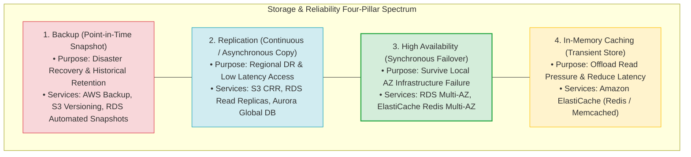
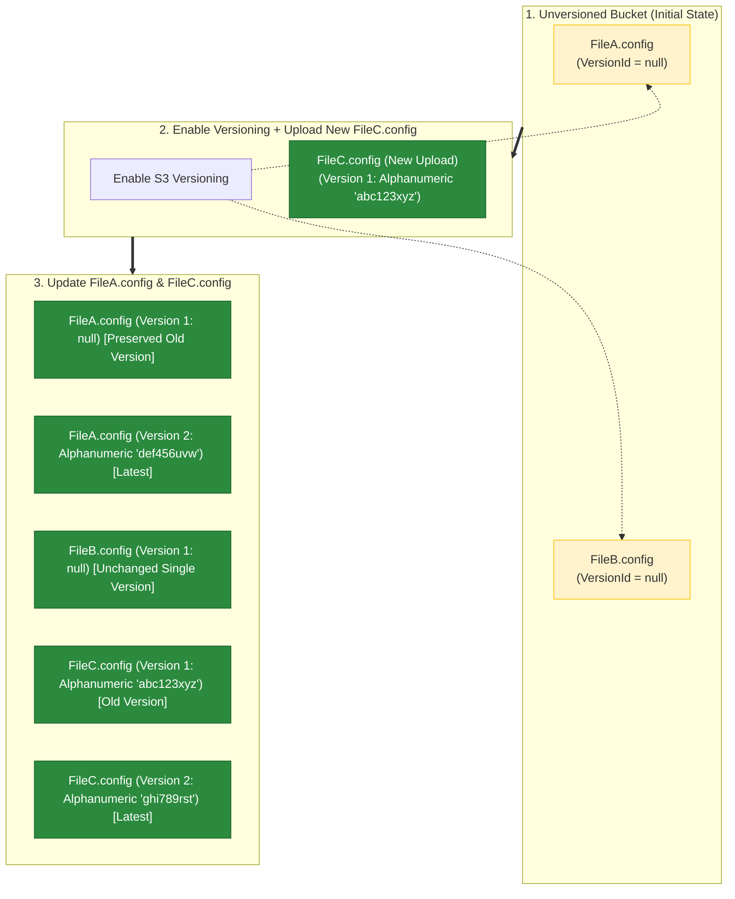
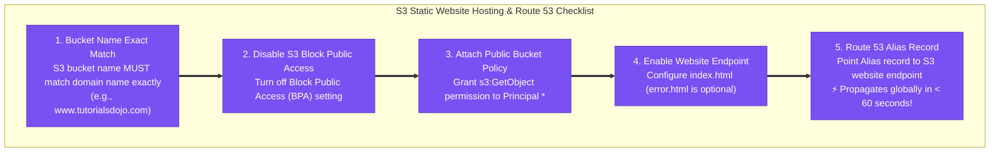
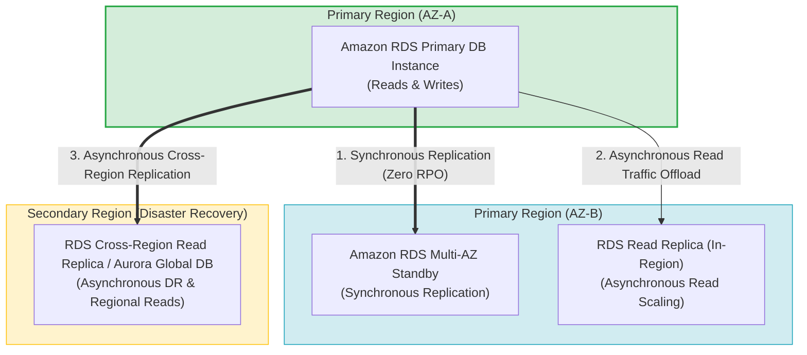
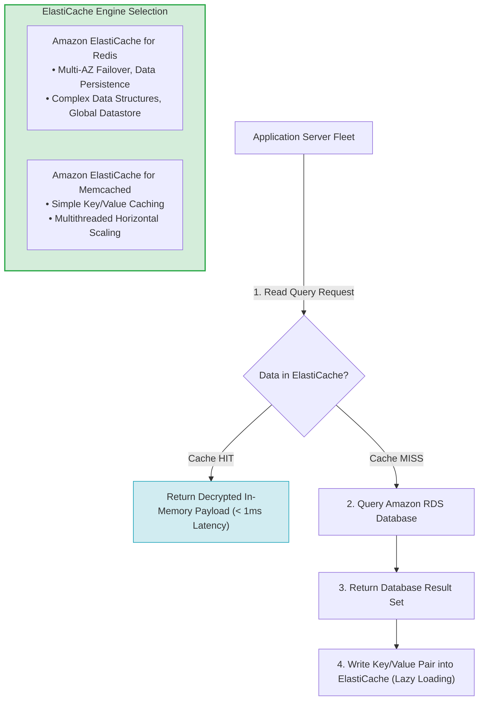
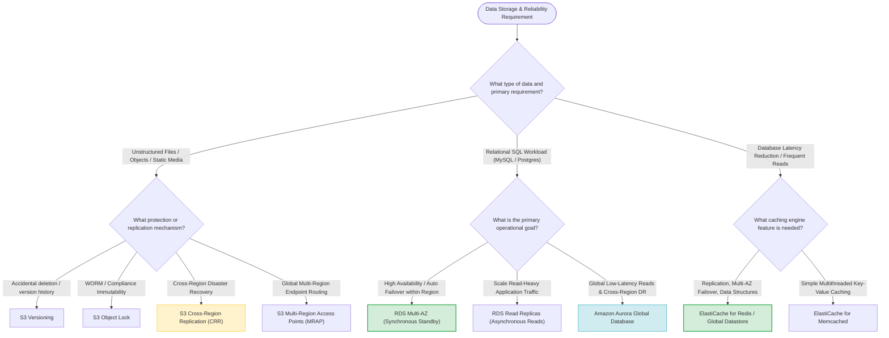
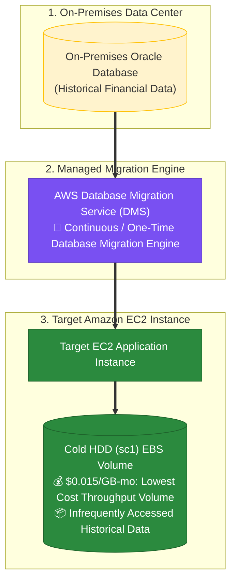

# Task 2.4: Design a Strategy to Meet Reliability Requirements — AWS Storage Services & Replication Strategies

> [!NOTE]
> **Exam Mindset**: For the AWS Solutions Architect Professional (SAP-C02) and AI Practitioner (AIP-C01) exams, do not treat storage services as simple disk targets. Evaluate storage and replication through a strict decision sequence:
> **Data Type** $\rightarrow$ **Access Pattern** $\rightarrow$ **Availability Target** $\rightarrow$ **Replication Mechanism** $\rightarrow$ **RTO/RPO SLA** $\rightarrow$ **Cost Impact**.

---

## 1. Core Concepts: Backup vs. Replication vs. High Availability vs. Caching



### Four-Pillar Feature Comparison Matrix

| Concept | Primary Purpose | Real-Time Access? | Reduces Primary DB Load? | Primary Data Store? |
| :--- | :--- | :---:| :---:| :---:|
| **Backup** | Historical recovery & point-in-time restore | ❌ No | ❌ No | ❌ No |
| **Replication** | Regional DR & read traffic scaling | ✅ Yes | ✅ Yes (for Read Replicas) | ✅ Yes |
| **High Availability**| Automatic failover for local AZ failures | ✅ Yes | ❌ No (Standby is passive) | ✅ Yes |
| **Caching** | Application latency reduction & DB offloading | ✅ Yes | ✅ **Yes (Offloads DB reads)** | ❌ **No (Transient)** |

---

## 2. Deep-Dive: Amazon S3

**Amazon S3** provides highly durable ($99.999999999\%$), scalable object storage for files, media, static website assets, data lakes, and backups.

```
EBS = Block Storage (Attached to EC2 instances)
EFS = Shared File System (NFS mount for multiple EC2s)
S3  = Object Storage (REST API access via HTTP GET/PUT)
```

---

## 3. S3 Replication Strategies: SRR vs. CRR

- **Same-Region Replication (SRR)**: Replicates objects between buckets within the same Region (used for account separation, compliance, and log aggregation).
- **Cross-Region Replication (CRR)**: Asynchronously replicates objects across different AWS Regions.

> [!NOTE]
> **Exam Trigger**: *"Objects must be replicated to a secondary AWS Region to satisfy regional disaster recovery compliance"* $\longrightarrow$ **S3 Cross-Region Replication (CRR)**.

---

## 4. Operational Overhead & Asynchronous Behavior of S3 Replication

- AWS manages underlying replication pipelines transparently.
- S3 replication is **asynchronous** (there is a small replication delay). If an exam question demands **RPO = zero (instantaneous synchronous object replication)**, pure asynchronous CRR alone will not suffice without S3 Replication Time Control (RTC) SLAs or synchronous application writes.

---

## 5. S3 Replication Cost Considerations

- Single Bucket $\rightarrow$ Lowest cost.
- CRR $\rightarrow$ Incurs secondary bucket storage fees, cross-region data transfer fees, and replication request charges.

---

## 6. S3 Versioning

Protects against accidental object deletion or overwriting by maintaining a history of all object revisions.

---

## 6.1 Amazon S3 Versioning State Mechanics: Pre-Existing `null` Versions vs. Alphanumeric Version IDs

### Amazon S3 Version ID Rules & Lifecycle States

1. **Pre-Existing Objects Before Enabling Versioning**:
   - Objects uploaded *before* enabling versioning on a bucket have a `VersionId` value of **`null`**.
   - AWS S3 **NEVER** retroactively assigns numeric `1` or alphanumeric strings to pre-existing files when versioning is enabled!
2. **Uploading / Updating Objects AFTER Versioning Enabled**:
   - Uploading a new object after versioning is enabled assigns a unique **alphanumeric string** as the `VersionId` (e.g. `3/L4bFiXD-WFZENSc8d.L2N4AK8zA6uE`).
   - Overwriting a pre-existing object (whose initial version was `null`) creates a **new second version** with an **alphanumeric Version ID** as the latest version, while the initial pre-existing version remains preserved with `VersionId = null`.
3. **Unchanged Pre-Existing Objects**:
   - Objects uploaded before versioning that are **NEVER updated** retain their single version with `VersionId = null`.



### Real-World Exam Scenario: Global Configuration File Versioning

- **Scenario**: An S3 bucket contains 4 existing configuration files (`MNL-NA`, `MNL-LA`, `MNL-EUR`, `MNL-ASIA`). Versioning is then enabled on the bucket. Afterward, a 5th file (`MNL-O`) is uploaded. One week later, `MNL-NA`, `MNL-LA`, and `MNL-O` are updated. Which two statements are correct? (Select TWO)
- **Architecture Solutions (Select TWO)**:
  1. **The `MNL-EUR.config` and `MNL-ASIA.config` files will have a Version ID of `null`.** (Since they existed before versioning was enabled and were never updated).
  2. **There would be two available versions for each of the `MNL-NA.config`, `MNL-LA.config`, and `MNL-O.config` files. The first Version ID of `MNL-NA.config` and `MNL-LA.config` has a value of `null`.**

### Why Distractor Options Fail:
- *Version ID of 1 (Your Selection)*:
  - AWS S3 **NEVER** uses simple integers like `1`, `2`, `3` for Version IDs! Pre-existing objects get `null`, and new/updated versions receive unique random alphanumeric strings.
- *The latest Version ID of `MNL-NA` and `MNL-LA` has a value of `null`*:
  - False! Updating `MNL-NA` and `MNL-LA` created a new latest version with a unique **alphanumeric Version ID**; `null` is the *first/oldest* version ID, not the latest.

---


## 7. S3 Object Lock (WORM Storage)

Enforces **Write-Once-Read-Many (WORM)** storage to prevent objects from being deleted or overwritten for a fixed retention period.

> [!TIP]
> **Exam Keywords**: *"Immutable logs"*, *"WORM requirements"*, *"Prevent deletion by any user including root"* $\longrightarrow$ **S3 Object Lock (Compliance Mode)**.

---

## 8. S3 Multi-Region Access Points (MRAP)

Provides a single global S3 endpoint (`.mrap.accesspoint.s3-global.amazonaws.com`) that routes client requests over the AWS global backbone to the lowest-latency regional S3 bucket.

---

## 8.1 Amazon S3 Static Website Hosting & Route 53 Custom Domain Setup

To host a static website on Amazon S3 with a custom domain (e.g. `www.tutorialsdojo.com`), five core configuration steps must be satisfied:



---

## 11.6 Real-World Exam Scenario: S3 Static Website Inaccessibility (Missing Public Read Access vs. DNS Propagation Trap)

- **Scenario**: A company hosts a static website using an S3 bucket named `www.tutorialsdojo.com` in `us-west-2`. Static website hosting is enabled, and `index.html` is uploaded. Custom domain `www.tutorialsdojo.com` is registered in Route 53, and a Route 53 Alias record is created pointing to the S3 website endpoint. The next day, users cannot see any content. What is the **MOST likely cause**?
- **Architecture Solution**:
  - **The S3 bucket does NOT have public read access** (missing public bucket policy or Block Public Access enabled), blocking website visitors from viewing the content (`403 Forbidden`).

### Why Distractor Options Fail:
- *Route 53 is still propagating DNS changes (Wait 12 hours) (Your Selection)*:
  - Route 53 is engineered to propagate record updates globally to all authoritative DNS servers in **under 60 seconds** under normal conditions. Waiting 12 hours is an incorrect assumption.
- *URL must explicitly specify `www.tutorialsdojo.com/index.html`*:
  - S3 static website hosting automatically serves the configured Index Document (`index.html`) when users access the root URL.
- *`error.html` is a required step*:
  - `error.html` is an optional setting for custom 4xx/5xx error pages. Omitting `error.html` does not block access to `index.html`.

---

## 9. Deep-Dive: Amazon RDS

**Amazon RDS** provides managed relational databases (MySQL, PostgreSQL, MariaDB, Oracle, SQL Server).

---

## 10. Amazon RDS High Availability vs. Read Scaling vs. Regional DR Topology



---

## 11. RDS Multi-AZ vs. Read Replicas vs. Aurora Global Database

| Feature | RDS Multi-AZ | RDS Read Replicas | Aurora Global Database |
| :--- | :--- | :--- | :--- |
| **Primary Goal** | **High Availability (HA)** | **Read Scaling** | **Global Reads & Regional DR** |
| **Replication Type** | **Synchronous** (Zero RPO) | **Asynchronous** | Storage-level replication (< 1s lag) |
| **Standby Instance Access** | ❌ **No (Passive Standby)** | ✅ **Yes (Serves Read Queries)** | ✅ **Yes (Serves Read Queries)** |
| **Automatic Failover** | ✅ **Yes** (Automated DNS failover) | ❌ Manual Promotion required | ✅ Fast failover (< 1 minute RTO) |
| **Geographic Scope** | Within single Region (Multi-AZ) | In-Region or Cross-Region | Multi-Region (Up to 5 secondary Regions) |

> [!WARNING]
> **Exam Trap 1**: RDS Multi-AZ Standby instances **cannot** serve read traffic. Do not select Multi-AZ to offload read queries. Use **Read Replicas** for read scaling.
> **Exam Trap 2**: Read Replicas do **not** provide automatic Multi-AZ failover by default. Do not rely on Read Replicas as your primary local HA mechanism.

---

## 12. Deep-Dive: Amazon Aurora Global Database

For MySQL/PostgreSQL workloads requiring global read scaling and regional disaster recovery, **Amazon Aurora Global Database** uses storage-level replication with lag under 1 second.

---

## 13. Deep-Dive: Amazon ElastiCache

**Amazon ElastiCache** provides in-memory caching (Redis or Memcached) to offload read pressure from relational databases and deliver sub-millisecond response times.



---

## 14. ElastiCache for Redis vs. Memcached Comparison

| Feature | ElastiCache for Redis | ElastiCache for Memcached |
| :--- | :--- | :--- |
| **Data Persistence** | ✅ **Yes** (Snapshots & append-only files) | ❌ **No (Purely volatile memory)** |
| **Multi-AZ & Auto Failover**| ✅ **Yes** (Supports Multi-AZ with auto-failover)| ❌ No (Node replacement only) |
| **Data Structures** | Strings, Hashes, Lists, Sets, Sorted Sets | Simple Key/Value strings only |
| **Global Replication** | ✅ **Yes** (ElastiCache Global Datastore) | ❌ No |
| **Multithreading** | Single-threaded engine core | ✅ Multithreaded architecture |

---

## 15. Important Rule: Cache is NOT Authoritative Storage

- ElastiCache data is **transient**. If an ElastiCache node fails, the application must handle cache misses gracefully by querying the primary database (RDS/Aurora).
- Never select ElastiCache as the sole persistent store for critical business transactions.

---

## 16. Disaster Recovery SLA Alignment (RTO vs. RPO)

- **RPO = 24 Hours, RTO = Hours** $\rightarrow$ **AWS Backup / RDS Automated Snapshots**.
- **RPO = Minutes, RTO = Tens of Minutes** $\rightarrow$ **Pilot Light / RDS Cross-Region Replica**.
- **RPO < 1 Second, RTO < 1 Minute** $\rightarrow$ **Amazon Aurora Global Database / DynamoDB Global Tables**.

---

## 17. SAP-C02 Master Storage & Replication Selection Decision Engine



---

## 18. SAP-C02 Exam Keyword Cheat Sheet

```
"Accidental object deletion protection" ──> S3 Versioning
"WORM compliance / immutable objects"  ──> S3 Object Lock
"Cross-Region object DR"                ──> S3 Cross-Region Replication (CRR)
"Automatic DB failover in Region"       ──> RDS Multi-AZ
"Offload read-heavy database traffic"   ──> RDS Read Replicas
"Global relational DB with RPO < 1s"    ──> Amazon Aurora Global Database
"Database latency reduction / Caching"  ──> Amazon ElastiCache
"Cache + Replication + Persistence"     ──> ElastiCache for Redis
"Simple multithreaded key/value cache"  ──> ElastiCache for Memcached
"Cross-Region cache replication"        ──> ElastiCache Global Datastore
```

---

## 18.5 Amazon EBS Volume Type Selection Matrix & Real-World Exam Scenario: Database Migration to Cold HDD (`sc1`) via AWS DMS

### Amazon EBS Volume Types Comparison Matrix

| Volume Type | Technology | Performance Metric | Primary Use Cases | Cost per GB-Month | Key Exam Keyword Trigger |
| :--- | :--- | :--- | :--- | :---: | :--- |
| **`gp3` / `gp2`** | General Purpose SSD | Baseline IOPS & Throughput | System boot volumes, dev/test, low-latency apps | `$0.08` | *"General workload / System boot volume"* |
| **`io1` / `io2`** | Provisioned IOPS SSD | High IOPS (up to 256,000 IOPS) | Mission-critical high-performance OLTP databases | `$0.125` (+ IOPS fee) | *"Highest performance / Strict IOPS SLA"* |
| **`st1`** | Throughput Optimized HDD | Throughput (up to 500 MB/s) | **Frequently accessed** Big Data, Log Processing, DW | `$0.045` | *"Frequently accessed throughput-intensive data"* |
| **`sc1`** | Cold HDD | Throughput (up to 250 MB/s) | **Infrequently accessed** historical archives & cold data | `$0.015` (Lowest) | *"Infrequently accessed cold data / Lowest cost"* |

> [!CAUTION]
> **EBS Volume Constraints**:
> - `st1` and `sc1` magnetic volumes **CANNOT be used as EC2 boot volumes** (`/dev/sda1`). Boot volumes must be SSD (`gp3`/`gp2`/`io2`).

---

### Real-World Exam Scenario: Oracle Migration of Infrequently Accessed Financial Data (AWS DMS + `sc1` vs. `io1` & MGN Traps)

- **Scenario**: A company migrates a legacy Oracle database from an on-premises data center to an existing Amazon EC2 instance on AWS. A new volume must be attached to the instance to store historical financial data that is **infrequently accessed**. What is the MOST cost-effective and throughput-oriented migration solution?
- **Architecture Solution**:
  - Migrate the database using **AWS Database Migration Service (AWS DMS)** and use a **Cold HDD (`sc1`) EBS volume**.



### Key Technical Rationale:
1. **AWS DMS for Database Migration**: AWS DMS migrates operational database schemas and data records from Oracle to Oracle on EC2 with minimal downtime. AWS Application Migration Service (MGN) migrates full server VM disks, NOT individual database volumes on existing EC2 instances.
2. **Cold HDD (`sc1`) for Infrequently Accessed Data at Lowest Cost**: At `$0.015/GB-month`, `sc1` is the **cheapest EBS block storage tier** in AWS. It delivers high sequential throughput (up to 250 MB/s), making it the ideal cost-effective volume for cold, infrequently accessed historical data.

### Why Distractor Options Fail:
- *Migrate using AWS DMS and Provisioned IOPS (`io1`) Volume (Your Selection)*:
  - `io1` is the **MOST EXPENSIVE** EBS volume type ($0.125/GB-month + provisioned IOPS charges) designed for mission-critical random IOPS OLTP databases. Using `io1` for infrequently accessed historical financial data completely violates cost optimization!
- *Migrate using AWS Transform MGN and Throughput Optimized (`st1`) Volume*:
  - **AWS Transform MGN** (AWS Application Migration Service) is an agent-based VM migration tool for full server disks (VMware/Hyper-V); it cannot migrate a database directly into a new target volume on an *existing* EC2 instance.
  - `st1` ($0.045/GB-month) is designed for *frequently accessed* throughput workloads; `sc1` ($0.015/GB-month) is $3\times$ cheaper for *infrequently accessed* historical data.
- *Migrate using AWS Transform MGN and General Purpose (`gp2`) Volume*:
  - `gp2` / `gp3` SSD ($0.08/GB-month) is over $5\times$ more expensive than `sc1` HDD ($0.015/GB-month), and AWS MGN is incorrect for database-level migration.

---

## 19. Common SAP-C02 Distractors & Traps

1. **Distractor 1**: *"Use RDS Multi-AZ to offload read traffic."* $\rightarrow$ **FALSE** (Multi-AZ standby is passive and unreachable for queries).
2. **Distractor 2**: *"Use Read Replicas for automatic local HA failover."* $\rightarrow$ **FALSE** (Read Replicas require manual promotion).
3. **Distractor 3**: *"Use S3 Versioning for regional disaster recovery."* $\rightarrow$ **FALSE** (Versioning protects version history within a single bucket; CRR provides cross-region copies).
4. **Distractor 4**: *"Use ElastiCache as the primary database for compliance data."* $\rightarrow$ **FALSE** (Caches are transient stores; use persistent databases for primary data).
5. **Trap 5: Selecting Provisioned IOPS (`io1`/`io2`) or General Purpose SSD (`gp2`/`gp3`) for Infrequently Accessed Data**: `io1`/`io2` and `gp3`/`gp2` SSDs are expensive storage tiers for transactional IOPS. For large, **infrequently accessed** sequential data archives requiring minimum cost, always select **Cold HDD (`sc1`)**. To migrate databases to specific EC2 volumes, use **AWS DMS** (not AWS MGN).

---

## 20. Summary Mental Model Sequence

`Data Access Pattern ➔ Compute/Volume Target ➔ Database Migration (AWS DMS) ➔ Cold Storage (sc1 HDD) ➔ Minimum TCO`