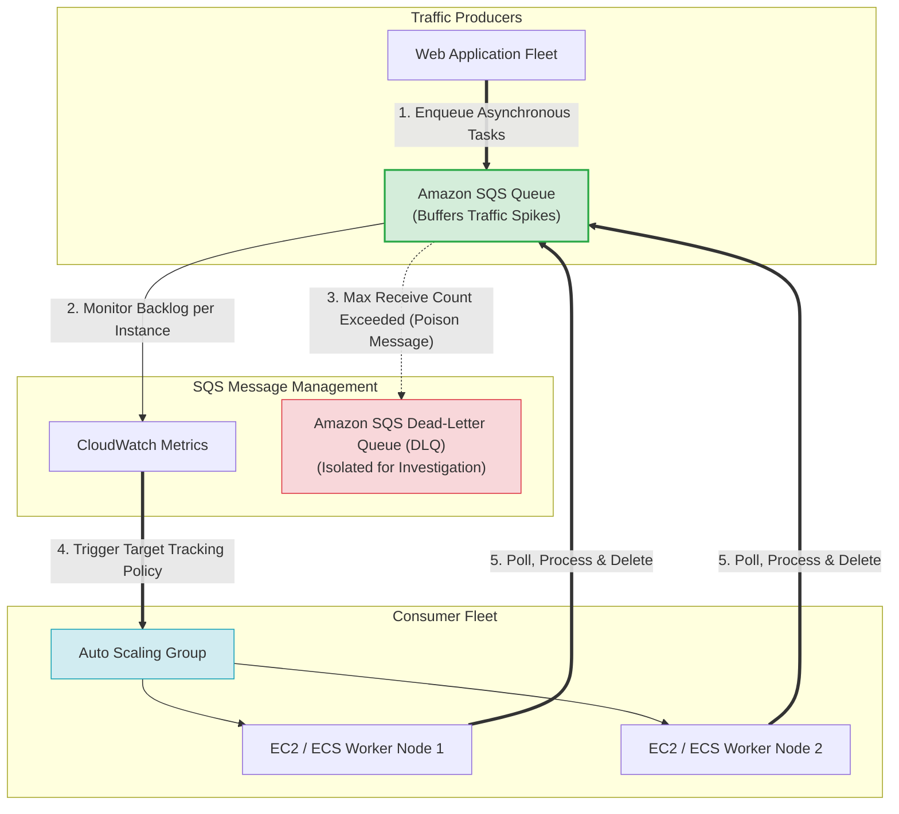
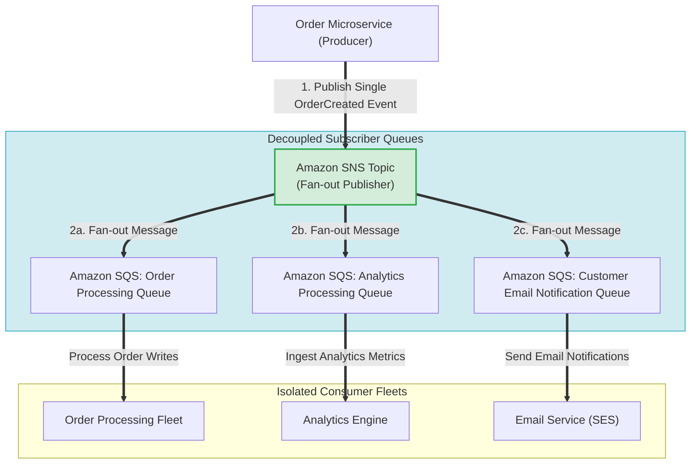
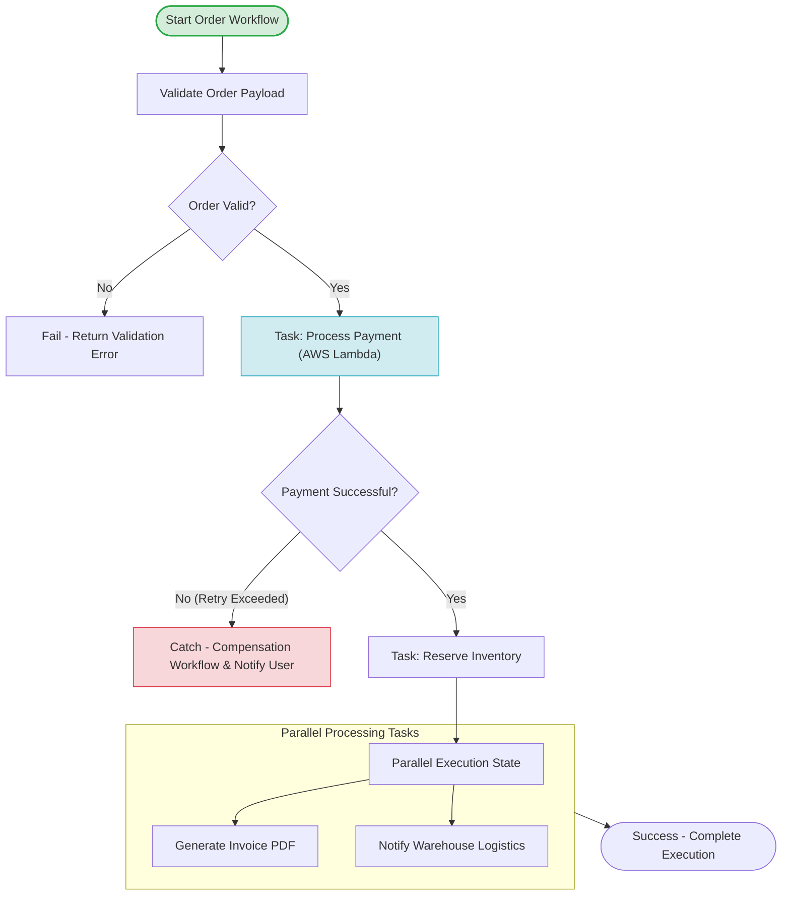
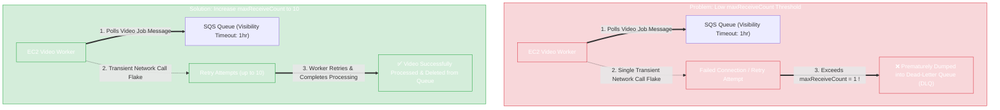
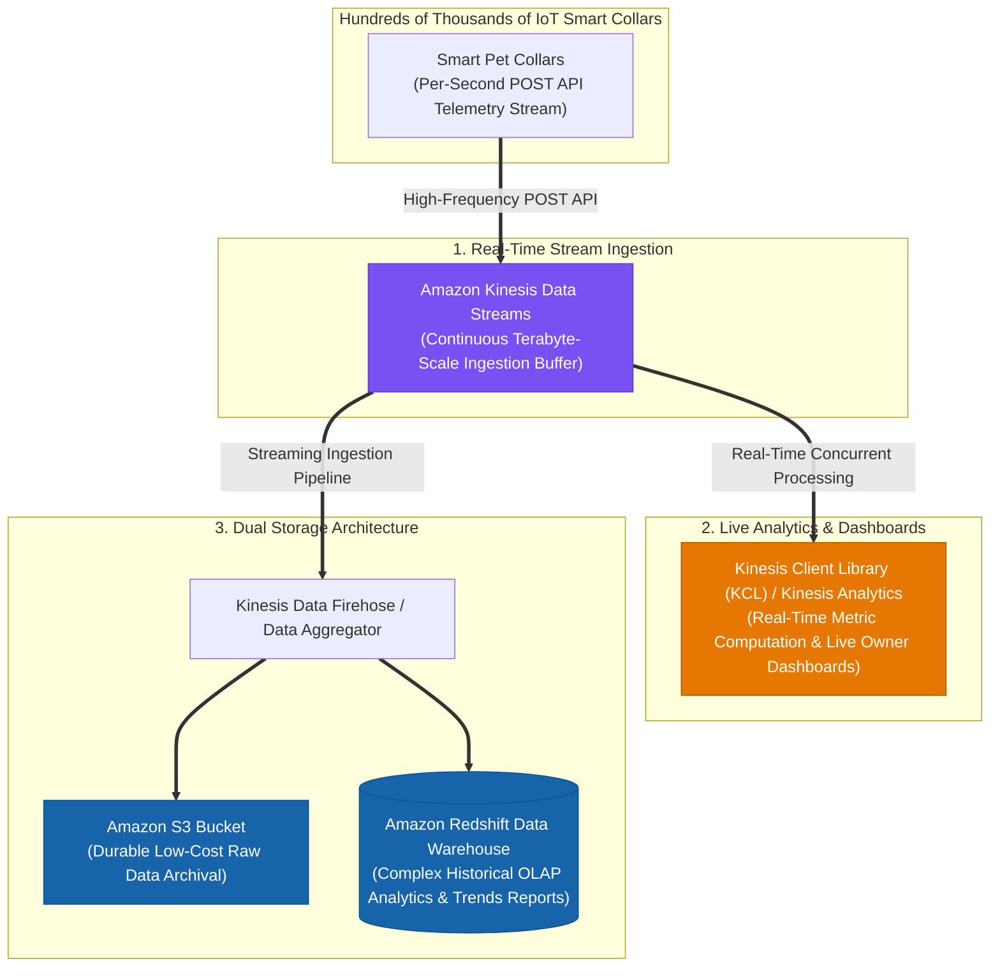
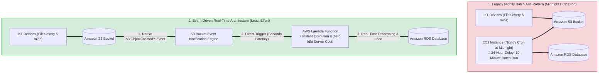
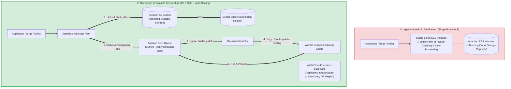

# Task 2.4: Design a Strategy to Meet Reliability Requirements — Application Integration (Amazon SNS, Amazon SQS, AWS Step Functions)

> [!NOTE]
> **Exam Mindset**: For the AWS Solutions Architect Professional (SAP-C02) and AI Practitioner (AIP-C01) exams, view application integration primarily as a **reliability, fault isolation, and decoupling problem**:
> *"How do I prevent one component failure or unexpected traffic surge from crashing the entire application?"*
> - **Amazon SQS** $\rightarrow$ **Buffering & Decoupling** (Pull-based queue buffer for asynchronous workloads)
> - **Amazon SNS** $\rightarrow$ **Notification & Fan-Out** (Push-based pub/sub topic for multiple subscribers)
> - **AWS Step Functions** $\rightarrow$ **Workflow Orchestration** (State machine managing multi-step execution, retries, and failure handling)

---

## 1. Deep-Dive: Amazon SQS (Simple Queue Service)

**Amazon SQS** provides fully managed, distributed message queuing to decouple application components.



### Core Problems Solved by SQS
- **Decoupling**: Removes synchronous dependencies between producers and consumers.
- **Traffic Spike Absorption**: Buffers sudden bursts of incoming traffic so consumers process jobs at a controlled rate.
- **Fault Isolation**: If consumer systems crash or undergo maintenance, messages safely accumulate in the queue without data loss.

---

## 2. SQS Standard vs. SQS FIFO

| Feature Dimension | Amazon SQS Standard Queue | Amazon SQS FIFO Queue |
| :--- | :--- | :--- |
| **Message Ordering** | Best-effort ordering | **Strict First-In-First-Out (FIFO) ordering** |
| **Delivery Semantics** | At-least-once delivery (duplicates possible) | **Exactly-once processing capability** |
| **Throughput Capacity** | Nearly unlimited throughput | Up to 300 msg/s (or 3,000 msg/s with batching) |
| **Deduplication** | Application must implement idempotency | Automated Deduplication ID / ContentDeduplication |
| **Primary Use Case** | **Default choice for high-throughput buffering** | Financial transactions, order processing sequences |

---

## 3. Critical SQS Operational Parameters

> [!IMPORTANT]
> **Exam Rule 1: Visibility Timeout**:
> - When a consumer polls a message from SQS, the message becomes invisible to other consumers for the duration of the **Visibility Timeout**.
> - **Duplicate Processing Trap**: If the Visibility Timeout is *shorter* than the consumer processing time, the message becomes visible again before processing completes, causing another consumer to pick up and process the same message. **Always set Visibility Timeout greater than maximum processing time**.

> [!TIP]
> **Exam Rule 2: Dead-Letter Queue (DLQ)**:
> - Configured using a `RedrivePolicy` with a `maxReceiveCount` (e.g., 5).
> - When a "poison pill" message repeatedly fails processing $5$ times, SQS moves it to the **Dead-Letter Queue (DLQ)**, preventing unprocessable messages from blocking queue capacity.

---

## 4. Deep-Dive: Amazon SNS (Simple Notification Service)

**Amazon SNS** is a fully managed pub/sub messaging service that broadcasts events from a publisher to multiple subscriber endpoints simultaneously (**Push-based Fan-Out**).



### The SNS + SQS Fan-Out Pattern
- **Why Combine SNS and SQS?**: SNS broadcasts an event to multiple subscribers. Subscribing SQS queues to an SNS topic ensures that each subscriber gets its own independent buffer, allowing consumers to scale and process messages at their own pace without affecting other systems.

---

## 5. Amazon SNS vs. Amazon SQS Comparison Matrix

| Dimension | Amazon SQS | Amazon SNS |
| :--- | :--- | :--- |
| **Communication Model** | **Pull-based** (Consumers poll the queue) | **Push-based** (SNS pushes to subscribers) |
| **Consumer Topology** | One message processed by **one consumer** | One event delivered to **multiple subscribers** |
| **Persistence & Buffering** | ✅ **Yes** (Messages persist up to 14 days) | ❌ **No** (Ephemeral delivery; no queue storage) |
| **Primary Use Case** | Decoupling & Workload Buffering | Event Distribution & Fan-Out Notifications |

---

## 6. Deep-Dive: AWS Step Functions

**AWS Step Functions** provides serverless visual workflow orchestration using state machines. It replaces complex application-level orchestration and "Lambda-chaining" anti-patterns.



### Step Functions Standard vs. Express Workflows

| Feature | Standard Workflows | Express Workflows |
| :--- | :--- | :--- |
| **Maximum Duration** | Up to **1 year** | Up to **5 minutes** |
| **Execution Rate** | Up to 2,000 / second | Over **100,000 / second** |
| **Execution History** | Audit-ready visual step history (stored 90 days) | CloudWatch Logs logging |
| **Primary Use Case** | **Long-running core business workflows** (Order processing, approval steps) | High-volume event processing, IoT data ingest, micro-batching |

---

## 7. Anti-Pattern Warning: Lambda Chaining vs. Step Functions

> [!WARNING]
> **Anti-Pattern**: Having Lambda A directly invoke Lambda B, which invokes Lambda C (Lambda Chaining).
> - **Why it breaks**: Error handling becomes unmanageable, retry logic requires custom code, execution state is lost, and debugging is difficult.
> - **Solution**: Use **AWS Step Functions** to orchestrate Lambda tasks. Step Functions manages state transitions, built-in retries (`Retry` block), and compensation paths (`Catch` block) automatically.

---

## 8. Service Spectrum: SQS vs. SNS vs. Step Functions vs. EventBridge

```
SQS          ──> "Store work until a consumer processes it" (Buffering Queue)
SNS          ──> "Broadcast an event to multiple subscribers" (Pub/Sub Fan-Out)
Step Functions──> "Execute multi-step business logic with state & retries" (Workflow Orchestration)
EventBridge  ──> "Route events across accounts & services based on rules" (Event Bus Router)
```

---

## 9. SAP-C02 Application Integration Master Decision Engine


---

## 10. SAP-C02 Exam Keyword Cheat Sheet

```
"Decouple components / Buffer traffic spikes" ──> Amazon SQS
"Strict message order preservation"         ──> SQS FIFO Queue
"Isolate unprocessable poison messages"     ──> SQS Dead-Letter Queue (DLQ)
"Fan-out event to multiple applications"     ──> Amazon SNS
"Fan-out with independent queue buffering"   ──> Amazon SNS + Amazon SQS
"Orchestrate multi-step workflow with retries"──> AWS Step Functions
"Long-running business workflow (> 5 mins)"  ──> Step Functions Standard Workflow
"High-volume short-duration event workflow"  ──> Step Functions Express Workflow
"Route events based on rules across accounts" ──> Amazon EventBridge
"Managed Apache Kafka event streaming"      ──> Amazon MSK
```

---

## 11. Common SAP-C02 Exam Traps

1. **Trap 1: Selecting SNS for Single-Consumer Buffering**: SNS is push-based and does not buffer messages for offline workers. Use **Amazon SQS** for single-consumer buffering.
2. **Trap 2: Short Visibility Timeout causing duplicate processing**: If processing takes 60s and Visibility Timeout is 30s, other workers will process duplicate messages. Increase Visibility Timeout to exceed processing duration.
3. **Trap 3: Using Lambda Chaining instead of Step Functions**: Invoking Lambda functions sequentially from inside code is brittle. Choose **Step Functions** for workflow orchestration.
4. **Trap 4: Selecting Step Functions Express for workflows > 5 minutes**: Express workflows cap out at 5 minutes. Select **Standard Workflows** for long-running processes (up to 1 year).
5. **Trap 5: Selecting SQS for Continuous Real-Time Streaming Analytics**: SQS is a message queue for discrete worker job consumption (messages deleted upon processing). For continuous high-frequency stream ingestion (e.g. IoT per-second telemetry), real-time dashboards, and concurrent multi-consumer analytics, select **Amazon Kinesis Data Streams**.
6. **Trap 6: Setting SQS Redrive Policy `maxReceiveCount = 1`**: Setting `maxReceiveCount` to 1 means a **single** transient network hiccup or client connection failure immediately dumps a valid message into the Dead-Letter Queue (DLQ). Always configure `maxReceiveCount` to a reasonable retry threshold (e.g. 5–10) to permit transient consumer retries before DLQ isolation.

---

## 11.2 Real-World Exam Scenario: SQS DLQ Premature Routing & `maxReceiveCount` Adjustment

- **Scenario**: A video processing platform uses an Auto Scaling group of EC2 instances driven by SQS messages. Each video takes **20–40 minutes** to process. SQS **Visibility Timeout is set to 1 hour (60 mins)** and **`maxReceiveCount` is set to 1**. CloudWatch alerts show valid videos landing in the Dead-Letter Queue (DLQ), but application logs show no errors and no video exceeds the 40-minute limit. CloudTrail logs show repeated `ReceiveMessage` API calls in quick succession for specific videos. What is the solution?
- **Architecture Solution**:
  - Reconfigure the SQS Redrive Policy and **increase `maxReceiveCount` to 10** (or 5–10 retries).



### Key Technical Rationale:
1. **Root Cause of DLQ Routing**: `maxReceiveCount` defines how many times SQS allows consumers to receive a message without deleting it before transferring it to the DLQ. With `maxReceiveCount = 1`, any single transient network glitch or client retry attempt immediately triggers DLQ redirection.
2. **Why Visibility Timeout of 1 Hour is Already Sufficient**: The current Visibility Timeout is 1 hour (60 minutes), which is greater than the maximum video processing time (40 minutes). Increasing the Visibility Timeout to 2 hours has no effect because messages were NOT timing out during processing.
3. **Correct Action**: Increasing `maxReceiveCount` to 10 allows worker instances to safely retry receiving and processing messages during transient network glitches before abandoning them to the DLQ.

### Why Distractor Options Fail:
- *Increasing Visibility Timeout to 2 Hours*: The current 1-hour visibility timeout already exceeds the 40-minute maximum processing time. Increasing visibility timeout does not stop `maxReceiveCount = 1` from dumping failed attempts into the DLQ.
- *Configuring Higher Delivery Delay*: Delivery delay postpones initial message visibility when a message is first added to the queue. It has no impact on retries or DLQ redrive policies.
- *Increasing ASG Minimum Instance Count*: Keeps idle EC2 instances running constantly when the queue is empty, increasing cost without addressing the low `maxReceiveCount` DLQ threshold.

---

## 11.3 Real-World Exam Scenario: Real-Time IoT Biometric Streaming Analytics Architecture

- **Scenario**: An IoT startup develops smart pet collars that collect biometric data every second and send POST API telemetry requests. The architecture must accept high-frequency biometric streams, power real-time dashboards for pet owners, archive data dually to Amazon S3 for low-cost storage, and store aggregated data in Amazon Redshift for complex historical OLAP analytics.
- **Architecture Solution**:



### Architectural Comparison: Amazon SQS vs. Amazon Kinesis Data Streams

| Requirement / Dimension | Amazon SQS Queue | Amazon Kinesis Data Streams |
| :--- | :--- | :--- |
| **Primary Data Pattern** | Discrete task queue / decoupled job messages. | **Continuous data streaming & real-time telemetry**. |
| **Consumption Model** | Pull-based; **message deleted after processing** by a single worker. | **Multi-consumer fan-out**; data retained in stream for multiple apps to read concurrently. |
| **Real-Time Analytics** | Not designed for real-time live metrics or sliding-window analytics. | **Native integration with KCL, Kinesis Analytics, & live dashboards**. |
| **Target Storage Integration**| Consumer must pull and write custom logic per target. | Native routing to **Amazon S3, Redshift, OpenSearch, & EMR**. |

### Why Distractor Options Fail:
- *Amazon S3 + Amazon Data Pipeline (Daily Batch)*: Data Pipeline runs batch analytics tasks once a day; it completely fails the **real-time biometric monitoring and live dashboard** requirement.
- *Amazon SQS Queue for Ingestion*: SQS buffers individual job messages for single-worker processing. It does not support real-time sliding-window stream analytics or multi-consumer continuous stream reads like Kinesis.
- *Amazon EMR Instance for Ingestion*: EMR (Elastic MapReduce) is an Apache Spark/Hadoop processing cluster framework; it is NOT a front-end streaming ingestion API for hundreds of thousands of IoT devices.

---

## 11.4 Real-World Exam Scenario: Event-Driven Real-Time S3 File Processing (S3 Event Notifications + AWS Lambda)

- **Scenario**: Global IoT devices upload status files every 5 minutes to an Amazon S3 bucket. A nightly EC2 Python cron job runs at midnight for 10 minutes to process the S3 files into Amazon RDS and delete them. Management wants to expedite processing so data is available in RDS **near real-time (as soon as uploaded)** with the **LEAST amount of effort**. What solution should be implemented?
- **Architecture Solution**:
  1. Convert the Python batch script into an **AWS Lambda function**.
  2. Configure **Amazon S3 Bucket Event Notifications** (`s3:ObjectCreated:*`) to directly trigger the Lambda function whenever a data file is uploaded to the S3 bucket.



### Key Technical Rationale:
1. **Direct Native Event Notifications**: S3 Bucket Event Notifications natively support triggering **AWS Lambda**, **Amazon SNS**, and **Amazon SQS** when objects are created (`s3:ObjectCreated:*`). Setting up S3 event notifications takes minimal configuration steps (least effort) and delivers event notifications in seconds.
2. **Eliminate Polling & Server Overhead**: Converting the EC2 batch job to a serverless Lambda function eliminates idle EC2 server costs and ensures every single IoT file is processed individually within seconds of arrival rather than waiting for a 24-hour midnight batch window.

### Why Distractor Options Fail:
- *CloudTrail Data Events + Amazon EventBridge*: Enabling S3 data event logging in CloudTrail and creating EventBridge rules to invoke Lambda works, but introduces unnecessary extra configuration steps, CloudTrail data event logging costs, and EventBridge routing overhead when **direct S3 Event Notifications** accomplish the exact result natively with least effort.
- *Scheduled EventBridge 1-Minute Cron + Parallel CloudWatch Rules*: Scheduled EventBridge cron rules can only run at 1-minute minimum intervals (causing a 1-minute delay). Parallel rules risk race conditions and double-processing files. Direct S3 Event Notifications trigger immediately upon object upload.
- *Increasing EC2 Instance Size + 1-Minute Cron*: Scaling EC2 instances and running 1-minute cron jobs fails to deliver near-real-time event execution, risks concurrent file processing across instances, and increases idle EC2 compute costs.

---

## 11.5 Real-World Exam Scenario 5: Legacy EC2 & EBS Bottleneck Overhaul (S3 CRR + SQS Decoupling & EC2 Auto Scaling)

- **Scenario**: An online immigration registration system runs on a single large EC2 instance with attached EBS volumes. The system accepts applicant registrations, photos, and documents, and performs automated eligibility verification. During applicant surges, the single instance becomes unavailable, verification processing lags, and attached EBS volumes run out of storage space. What is the recommended solution for high availability and scalable data storage?
- **Architecture Solution**:
  1. Upgrade the storage architecture to use an **Amazon S3 bucket with Cross-Region Replication (CRR)** enabled as the primary storage service for user-uploaded documents and photos.
  2. Set up an **Amazon SQS queue** to distribute verification processing tasks to an **EC2 Auto Scaling group** that dynamically scales workers based on SQS queue backlog length.
  3. Use **AWS CloudFormation** to replicate the architecture stack to another AWS Region.



### Key Technical Rationale:
1. **Amazon S3 for Unlimited Scalable Document Storage**: Replacing attached EBS volumes with **Amazon S3** provides virtually unlimited, highly scalable object storage with 11 9s of durability. **Cross-Region Replication (CRR)** ensures multi-region data availability.
2. **SQS Decoupling for Traffic Surge Absorption**: Enqueuing verification requests into **Amazon SQS** decouples frontend registration from backend verification, preventing traffic surges from crashing worker instances.
3. **Queue Backlog Target-Tracking Auto Scaling**: Auto Scaling workers based on SQS queue length (`ApproximateNumberOfMessagesVisible`) ensures worker capacity dynamically expands during registration spikes and contracts off-peak.
4. **CloudFormation for Infrastructure Replication**: Standardizes infrastructure deployment across primary and DR regions.

### Why Distractor Options Fail:
- *Upgrading to Provisioned IOPS EBS (Your Selection)*: **EBS volumes are block storage bound to single instances** with fixed capacity limits. EBS cannot easily scale to store millions of user documents across a dynamic worker fleet! Provisioned IOPS EBS volumes attached to worker EC2 instances are extremely expensive and fail to provide shared, centralized, scalable document storage across instances.
- *SNS for Task Queueing & Auto Scaling on Notification Count*: **Amazon SNS is a pub/sub push service; it does NOT queue or buffer messages** for worker polling! SQS is required for queue-based task buffering and backlog-based worker scaling.
- *SNS without SQS Queue Backlog Metrics*: SNS cannot trigger Auto Scaling based on queue backlog length because SNS does not maintain a persistent queue backlog.

---

## 12. Final Mental Model

`Event Occurs ➔ Route (EventBridge) ➔ Fan-Out (SNS) ➔ Buffer (SQS + S3 CRR Storage) ➔ Stream (Kinesis) ➔ Direct File Event (S3 Event Notifications to Lambda) ➔ Orchestrate (Step Functions)`