# Task 2.4: Design a Strategy to Meet Reliability Requirements — Application Integration (Amazon SNS, Amazon SQS, AWS Step Functions)

> [!NOTE]
> **Exam Mindset**: For the AWS Solutions Architect Professional (SAP-C02) and AI Practitioner (AIP-C01) exams, view application integration primarily as a **reliability, fault isolation, and decoupling problem**:
> *"How do I prevent one component failure or unexpected traffic surge from crashing the entire application?"*
> - **Amazon SQS** $\rightarrow$ **Buffering & Decoupling** (Pull-based queue buffer for asynchronous workloads)
> - **Amazon SNS** $\rightarrow$ **Notification & Fan-Out** (Push-based pub/sub topic for multiple subscribers)
> - **AWS Step Functions** $\rightarrow$ **Workflow Orchestration** (State machine managing multi-step execution, retries, and failure handling)

---

## 1. Deep-Dive: Amazon SQS (Simple Queue Service)

**Amazon SQS** provides fully managed, distributed message queuing to decouple application components.

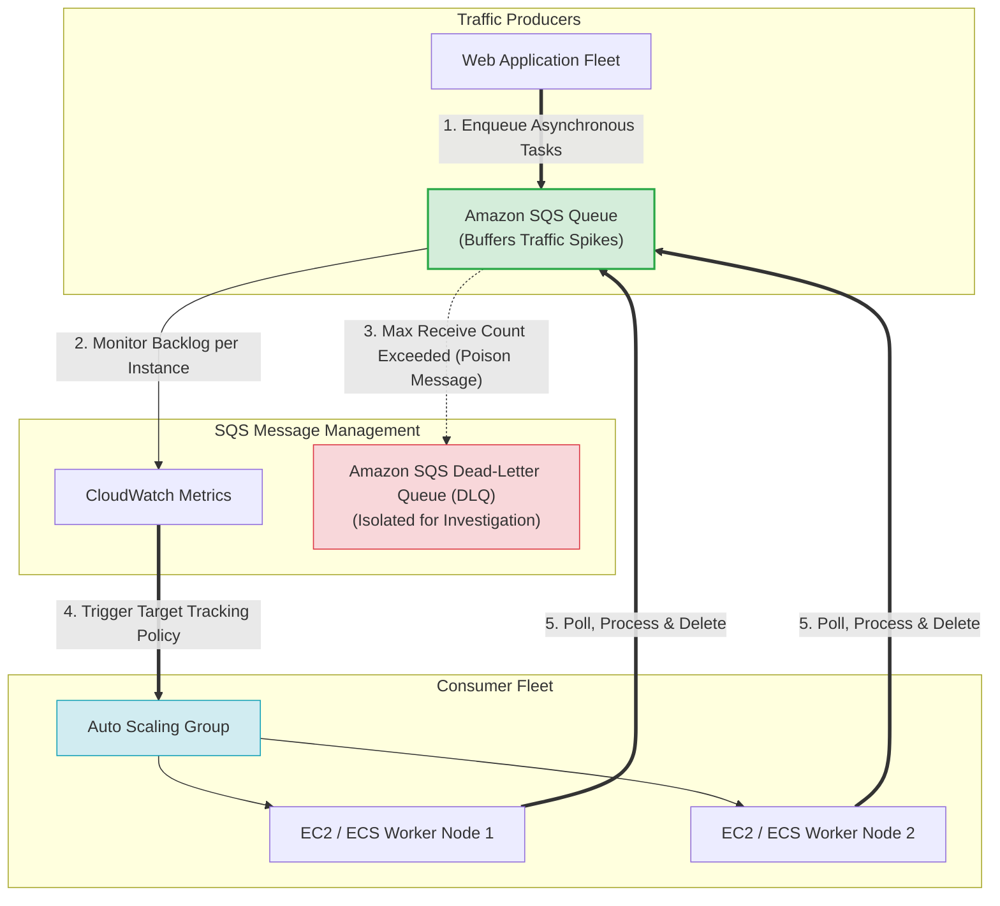

### Core Problems Solved by SQS
- **Decoupling**: Removes synchronous dependencies between producers and consumers.
- **Traffic Spike Absorption**: Buffers sudden bursts of incoming traffic so consumers process jobs at a controlled rate.
- **Fault Isolation**: If consumer systems crash or undergo maintenance, messages safely accumulate in the queue without data loss.

---

## 2. SQS Standard vs. SQS FIFO

| Feature Dimension | Amazon SQS Standard Queue | Amazon SQS FIFO Queue |
| :--- | :--- | :--- |
| **Message Ordering** | Best-effort ordering | **Strict First-In-First-Out (FIFO) ordering** |
| **Delivery Semantics** | At-least-once delivery (duplicates possible) | **Exactly-once processing capability** |
| **Throughput Capacity** | Nearly unlimited throughput | Up to 300 msg/s (or 3,000 msg/s with batching) |
| **Deduplication** | Application must implement idempotency | Automated Deduplication ID / ContentDeduplication |
| **Primary Use Case** | **Default choice for high-throughput buffering** | Financial transactions, order processing sequences |

---

## 3. Critical SQS Operational Parameters

> [!IMPORTANT]
> **Exam Rule 1: Visibility Timeout**:
> - When a consumer polls a message from SQS, the message becomes invisible to other consumers for the duration of the **Visibility Timeout**.
> - **Duplicate Processing Trap**: If the Visibility Timeout is *shorter* than the consumer processing time, the message becomes visible again before processing completes, causing another consumer to pick up and process the same message. **Always set Visibility Timeout greater than maximum processing time**.

> [!TIP]
> **Exam Rule 2: Dead-Letter Queue (DLQ)**:
> - Configured using a `RedrivePolicy` with a `maxReceiveCount` (e.g., 5).
> - When a "poison pill" message repeatedly fails processing $5$ times, SQS moves it to the **Dead-Letter Queue (DLQ)**, preventing unprocessable messages from blocking queue capacity.

---

## 4. Deep-Dive: Amazon SNS (Simple Notification Service)

**Amazon SNS** is a fully managed pub/sub messaging service that broadcasts events from a publisher to multiple subscriber endpoints simultaneously (**Push-based Fan-Out**).

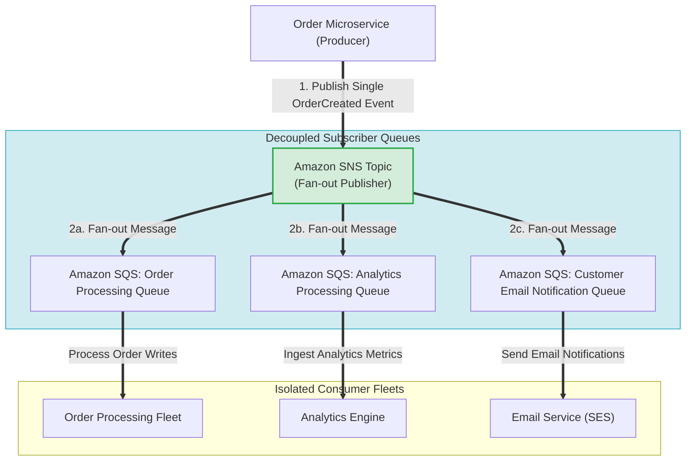

### The SNS + SQS Fan-Out Pattern
- **Why Combine SNS and SQS?**: SNS broadcasts an event to multiple subscribers. Subscribing SQS queues to an SNS topic ensures that each subscriber gets its own independent buffer, allowing consumers to scale and process messages at their own pace without affecting other systems.

---

## 5. Amazon SNS vs. Amazon SQS Comparison Matrix

| Dimension | Amazon SQS | Amazon SNS |
| :--- | :--- | :--- |
| **Communication Model** | **Pull-based** (Consumers poll the queue) | **Push-based** (SNS pushes to subscribers) |
| **Consumer Topology** | One message processed by **one consumer** | One event delivered to **multiple subscribers** |
| **Persistence & Buffering** | ✅ **Yes** (Messages persist up to 14 days) | ❌ **No** (Ephemeral delivery; no queue storage) |
| **Primary Use Case** | Decoupling & Workload Buffering | Event Distribution & Fan-Out Notifications |

---

## 6. Deep-Dive: AWS Step Functions

**AWS Step Functions** provides serverless visual workflow orchestration using state machines. It replaces complex application-level orchestration and "Lambda-chaining" anti-patterns.


### Step Functions Standard vs. Express Workflows

| Feature | Standard Workflows | Express Workflows |
| :--- | :--- | :--- |
| **Maximum Duration** | Up to **1 year** | Up to **5 minutes** |
| **Execution Rate** | Up to 2,000 / second | Over **100,000 / second** |
| **Execution History** | Audit-ready visual step history (stored 90 days) | CloudWatch Logs logging |
| **Primary Use Case** | **Long-running core business workflows** (Order processing, approval steps) | High-volume event processing, IoT data ingest, micro-batching |

---

## 7. Anti-Pattern Warning: Lambda Chaining vs. Step Functions

> [!WARNING]
> **Anti-Pattern**: Having Lambda A directly invoke Lambda B, which invokes Lambda C (Lambda Chaining).
> - **Why it breaks**: Error handling becomes unmanageable, retry logic requires custom code, execution state is lost, and debugging is difficult.
> - **Solution**: Use **AWS Step Functions** to orchestrate Lambda tasks. Step Functions manages state transitions, built-in retries (`Retry` block), and compensation paths (`Catch` block) automatically.

---

## 8. Service Spectrum: SQS vs. SNS vs. Step Functions vs. EventBridge

```
SQS          ──> "Store work until a consumer processes it" (Buffering Queue)
SNS          ──> "Broadcast an event to multiple subscribers" (Pub/Sub Fan-Out)
Step Functions──> "Execute multi-step business logic with state & retries" (Workflow Orchestration)
EventBridge  ──> "Route events across accounts & services based on rules" (Event Bus Router)
```

---

## 9. SAP-C02 Application Integration Master Decision Engine

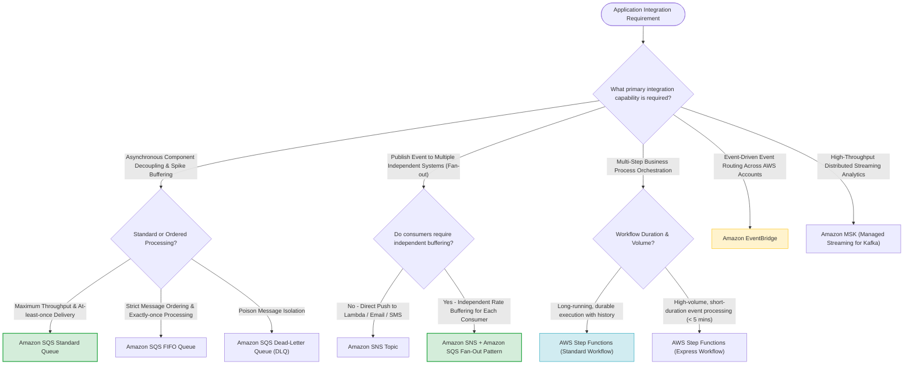

---

## 10. SAP-C02 Exam Keyword Cheat Sheet

```
"Decouple components / Buffer traffic spikes" ──> Amazon SQS
"Strict message order preservation"         ──> SQS FIFO Queue
"Isolate unprocessable poison messages"     ──> SQS Dead-Letter Queue (DLQ)
"Fan-out event to multiple applications"     ──> Amazon SNS
"Fan-out with independent queue buffering"   ──> Amazon SNS + Amazon SQS
"Orchestrate multi-step workflow with retries"──> AWS Step Functions
"Long-running business workflow (> 5 mins)"  ──> Step Functions Standard Workflow
"High-volume short-duration event workflow"  ──> Step Functions Express Workflow
"Route events based on rules across accounts" ──> Amazon EventBridge
"Managed Apache Kafka event streaming"      ──> Amazon MSK
```

---

## 11. Common SAP-C02 Exam Traps

1. **Trap 1: Selecting SNS for Single-Consumer Buffering**: SNS is push-based and does not buffer messages for offline workers. Use **Amazon SQS** for single-consumer buffering.
2. **Trap 2: Short Visibility Timeout causing duplicate processing**: If processing takes 60s and Visibility Timeout is 30s, other workers will process duplicate messages. Increase Visibility Timeout to exceed processing duration.
3. **Trap 3: Using Lambda Chaining instead of Step Functions**: Invoking Lambda functions sequentially from inside code is brittle. Choose **Step Functions** for workflow orchestration.
4. **Trap 4: Selecting Step Functions Express for workflows > 5 minutes**: Express workflows cap out at 5 minutes. Select **Standard Workflows** for long-running processes (up to 1 year).
5. **Trap 5: Selecting SQS for Continuous Real-Time Streaming Analytics**: SQS is a message queue for discrete worker job consumption (messages deleted upon processing). For continuous high-frequency stream ingestion (e.g. IoT per-second telemetry), real-time dashboards, and concurrent multi-consumer analytics, select **Amazon Kinesis Data Streams**.
6. **Trap 6: Setting SQS Redrive Policy `maxReceiveCount = 1`**: Setting `maxReceiveCount` to 1 means a **single** transient network hiccup or client connection failure immediately dumps a valid message into the Dead-Letter Queue (DLQ). Always configure `maxReceiveCount` to a reasonable retry threshold (e.g. 5–10) to permit transient consumer retries before DLQ isolation.

---

## 11.2 Real-World Exam Scenario: SQS DLQ Premature Routing & `maxReceiveCount` Adjustment

- **Scenario**: A video processing platform uses an Auto Scaling group of EC2 instances driven by SQS messages. Each video takes **20–40 minutes** to process. SQS **Visibility Timeout is set to 1 hour (60 mins)** and **`maxReceiveCount` is set to 1**. CloudWatch alerts show valid videos landing in the Dead-Letter Queue (DLQ), but application logs show no errors and no video exceeds the 40-minute limit. CloudTrail logs show repeated `ReceiveMessage` API calls in quick succession for specific videos. What is the solution?
- **Architecture Solution**:
  - Reconfigure the SQS Redrive Policy and **increase `maxReceiveCount` to 10** (or 5–10 retries).

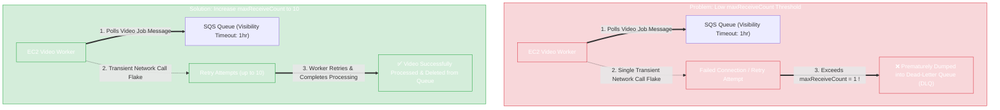

### Key Technical Rationale:
1. **Root Cause of DLQ Routing**: `maxReceiveCount` defines how many times SQS allows consumers to receive a message without deleting it before transferring it to the DLQ. With `maxReceiveCount = 1`, any single transient network glitch or client retry attempt immediately triggers DLQ redirection.
2. **Why Visibility Timeout of 1 Hour is Already Sufficient**: The current Visibility Timeout is 1 hour (60 minutes), which is greater than the maximum video processing time (40 minutes). Increasing the Visibility Timeout to 2 hours has no effect because messages were NOT timing out during processing.
3. **Correct Action**: Increasing `maxReceiveCount` to 10 allows worker instances to safely retry receiving and processing messages during transient network glitches before abandoning them to the DLQ.

### Why Distractor Options Fail:
- *Increasing Visibility Timeout to 2 Hours*: The current 1-hour visibility timeout already exceeds the 40-minute maximum processing time. Increasing visibility timeout does not stop `maxReceiveCount = 1` from dumping failed attempts into the DLQ.
- *Configuring Higher Delivery Delay*: Delivery delay postpones initial message visibility when a message is first added to the queue. It has no impact on retries or DLQ redrive policies.
- *Increasing ASG Minimum Instance Count*: Keeps idle EC2 instances running constantly when the queue is empty, increasing cost without addressing the low `maxReceiveCount` DLQ threshold.

---

## 11.3 Real-World Exam Scenario: Real-Time IoT Biometric Streaming Analytics Architecture

- **Scenario**: An IoT startup develops smart pet collars that collect biometric data every second and send POST API telemetry requests. The architecture must accept high-frequency biometric streams, power real-time dashboards for pet owners, archive data dually to Amazon S3 for low-cost storage, and store aggregated data in Amazon Redshift for complex historical OLAP analytics.
- **Architecture Solution**:

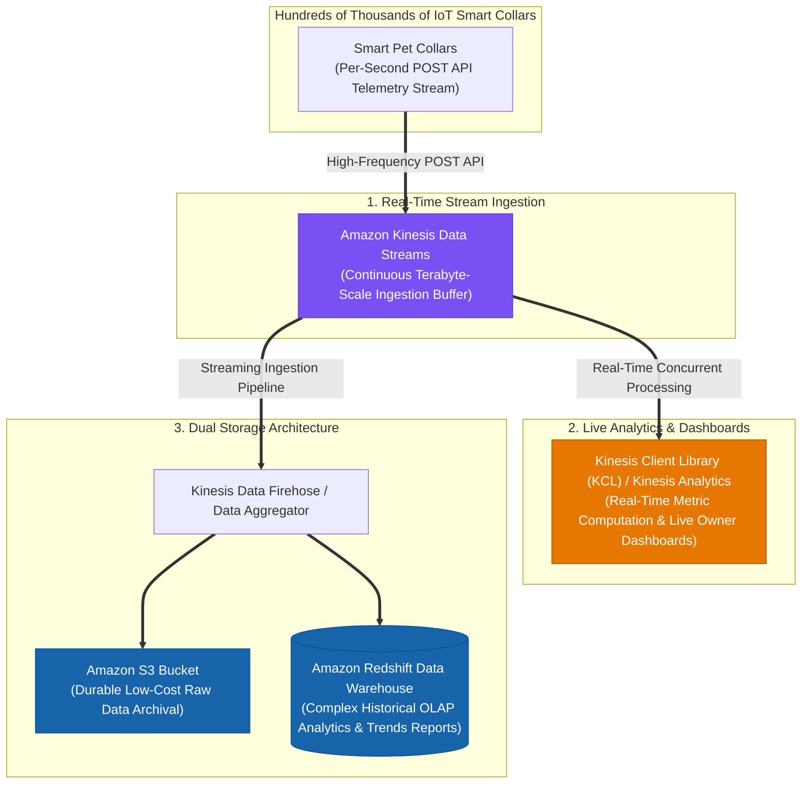

### Architectural Comparison: Amazon SQS vs. Amazon Kinesis Data Streams

| Requirement / Dimension | Amazon SQS Queue | Amazon Kinesis Data Streams |
| :--- | :--- | :--- |
| **Primary Data Pattern** | Discrete task queue / decoupled job messages. | **Continuous data streaming & real-time telemetry**. |
| **Consumption Model** | Pull-based; **message deleted after processing** by a single worker. | **Multi-consumer fan-out**; data retained in stream for multiple apps to read concurrently. |
| **Real-Time Analytics** | Not designed for real-time live metrics or sliding-window analytics. | **Native integration with KCL, Kinesis Analytics, & live dashboards**. |
| **Target Storage Integration**| Consumer must pull and write custom logic per target. | Native routing to **Amazon S3, Redshift, OpenSearch, & EMR**. |

### Why Distractor Options Fail:
- *Amazon S3 + Amazon Data Pipeline (Daily Batch)*: Data Pipeline runs batch analytics tasks once a day; it completely fails the **real-time biometric monitoring and live dashboard** requirement.
- *Amazon SQS Queue for Ingestion*: SQS buffers individual job messages for single-worker processing. It does not support real-time sliding-window stream analytics or multi-consumer continuous stream reads like Kinesis.
- *Amazon EMR Instance for Ingestion*: EMR (Elastic MapReduce) is an Apache Spark/Hadoop processing cluster framework; it is NOT a front-end streaming ingestion API for hundreds of thousands of IoT devices.

---

## 11.4 Real-World Exam Scenario: Event-Driven Real-Time S3 File Processing (S3 Event Notifications + AWS Lambda)

- **Scenario**: Global IoT devices upload status files every 5 minutes to an Amazon S3 bucket. A nightly EC2 Python cron job runs at midnight for 10 minutes to process the S3 files into Amazon RDS and delete them. Management wants to expedite processing so data is available in RDS **near real-time (as soon as uploaded)** with the **LEAST amount of effort**. What solution should be implemented?
- **Architecture Solution**:
  1. Convert the Python batch script into an **AWS Lambda function**.
  2. Configure **Amazon S3 Bucket Event Notifications** (`s3:ObjectCreated:*`) to directly trigger the Lambda function whenever a data file is uploaded to the S3 bucket.

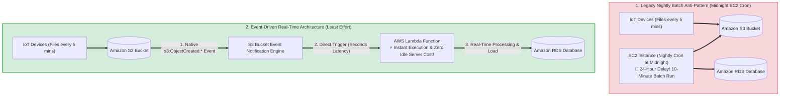

### Key Technical Rationale:
1. **Direct Native Event Notifications**: S3 Bucket Event Notifications natively support triggering **AWS Lambda**, **Amazon SNS**, and **Amazon SQS** when objects are created (`s3:ObjectCreated:*`). Setting up S3 event notifications takes minimal configuration steps (least effort) and delivers event notifications in seconds.
2. **Eliminate Polling & Server Overhead**: Converting the EC2 batch job to a serverless Lambda function eliminates idle EC2 server costs and ensures every single IoT file is processed individually within seconds of arrival rather than waiting for a 24-hour midnight batch window.

### Why Distractor Options Fail:
- *CloudTrail Data Events + Amazon EventBridge*: Enabling S3 data event logging in CloudTrail and creating EventBridge rules to invoke Lambda works, but introduces unnecessary extra configuration steps, CloudTrail data event logging costs, and EventBridge routing overhead when **direct S3 Event Notifications** accomplish the exact result natively with least effort.
- *Scheduled EventBridge 1-Minute Cron + Parallel CloudWatch Rules*: Scheduled EventBridge cron rules can only run at 1-minute minimum intervals (causing a 1-minute delay). Parallel rules risk race conditions and double-processing files. Direct S3 Event Notifications trigger immediately upon object upload.
- *Increasing EC2 Instance Size + 1-Minute Cron*: Scaling EC2 instances and running 1-minute cron jobs fails to deliver near-real-time event execution, risks concurrent file processing across instances, and increases idle EC2 compute costs.

---

## 11.5 Real-World Exam Scenario 5: Legacy EC2 & EBS Bottleneck Overhaul (S3 CRR + SQS Decoupling & EC2 Auto Scaling)

- **Scenario**: An online immigration registration system runs on a single large EC2 instance with attached EBS volumes. The system accepts applicant registrations, photos, and documents, and performs automated eligibility verification. During applicant surges, the single instance becomes unavailable, verification processing lags, and attached EBS volumes run out of storage space. What is the recommended solution for high availability and scalable data storage?
- **Architecture Solution**:
  1. Upgrade the storage architecture to use an **Amazon S3 bucket with Cross-Region Replication (CRR)** enabled as the primary storage service for user-uploaded documents and photos.
  2. Set up an **Amazon SQS queue** to distribute verification processing tasks to an **EC2 Auto Scaling group** that dynamically scales workers based on SQS queue backlog length.
  3. Use **AWS CloudFormation** to replicate the architecture stack to another AWS Region.

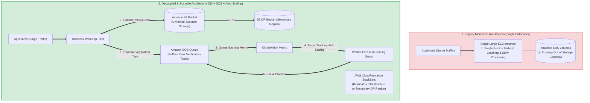

### Key Technical Rationale:
1. **Amazon S3 for Unlimited Scalable Document Storage**: Replacing attached EBS volumes with **Amazon S3** provides virtually unlimited, highly scalable object storage with 11 9s of durability. **Cross-Region Replication (CRR)** ensures multi-region data availability.
2. **SQS Decoupling for Traffic Surge Absorption**: Enqueuing verification requests into **Amazon SQS** decouples frontend registration from backend verification, preventing traffic surges from crashing worker instances.
3. **Queue Backlog Target-Tracking Auto Scaling**: Auto Scaling workers based on SQS queue length (`ApproximateNumberOfMessagesVisible`) ensures worker capacity dynamically expands during registration spikes and contracts off-peak.
4. **CloudFormation for Infrastructure Replication**: Standardizes infrastructure deployment across primary and DR regions.

### Why Distractor Options Fail:
- *Upgrading to Provisioned IOPS EBS (Your Selection)*: **EBS volumes are block storage bound to single instances** with fixed capacity limits. EBS cannot easily scale to store millions of user documents across a dynamic worker fleet! Provisioned IOPS EBS volumes attached to worker EC2 instances are extremely expensive and fail to provide shared, centralized, scalable document storage across instances.
- *SNS for Task Queueing & Auto Scaling on Notification Count*: **Amazon SNS is a pub/sub push service; it does NOT queue or buffer messages** for worker polling! SQS is required for queue-based task buffering and backlog-based worker scaling.
- *SNS without SQS Queue Backlog Metrics*: SNS cannot trigger Auto Scaling based on queue backlog length because SNS does not maintain a persistent queue backlog.

---

## 11.6 Real-World Exam Scenario 6: High-Scale Global Mobile Location Alerts (SQS + DynamoDB + SNS Mobile Push)

- **Scenario**: A global real estate startup adds location-based proximity alerts for iOS and Android mobile apps. The app has 2 million initial users worldwide (rapidly growing), and push notifications must be delivered in under 1 minute. The team chose a cost-effective queuing approach over AWS Wavelength. What is the most suitable architecture?
- **Architecture Solution**:
  - Configure the mobile app to send user location updates to an **Amazon SQS queue**.
  - Have a fleet of On-Demand **Amazon EC2 instances** poll the SQS queue and retrieve relevant real estate offers from an **Amazon DynamoDB table**.
  - Send the processed proximity offers directly to mobile devices using **AWS SNS Mobile Push**.

```mermaid
flowchart TD
    subgraph MobileAppTier["1. Global Mobile Client Tier (2M+ Users)"]
        MobileApps["iOS & Android Mobile Apps<br/>(Generates High-Frequency Location Payloads)"]
    end

    subgraph BufferingTier["2. Cost-Effective Asynchronous Queuing Tier"]
        SQS["Amazon SQS Queue<br/>📦 Buffers Millions of Location Payloads Globally"]
        MobileApps ==>|"Post Location Updates"| SQS
    end

    subgraph ProcessingTier["3. Worker Compute & Proximity Lookup Tier"]
        EC2Fleet["On-Demand EC2 Worker Fleet<br/>(Polls SQS & Processes Proximity Algorithms)"]
        DynamoDB[("Amazon DynamoDB Table<br/>⚡ Fast Single-Digit Ms NoSQL Offer Lookups")]

        SQS ==>|"Poll Messages"| EC2Fleet
        EC2Fleet <==>"Query Proximity Offers"| DynamoDB
    end

    subgraph NotificationTier["4. Mobile System Push Delivery Tier"]
        SNS_Push["AWS SNS Mobile Push Service<br/>🔔 Delivers Native Push Notifications (APNS / FCM) < 1 Min"]

        EC2Fleet ==>|"Trigger Mobile Push"| SNS_Push ==> MobileApps
    end

    classDef app fill:#7950f2,stroke:#5f3dc4,color:#ffffff;
    classDef queue fill:#d4edda,stroke:#28a745,stroke-width:2px;
    classDef worker fill:#1864ab,stroke:#0b5394,color:#ffffff;
    classDef sns fill:#e67700,stroke:#b05a00,color:#ffffff;

    class MobileApps app;
    class SQS queue;
    class EC2Fleet,DynamoDB worker;
    class SNS_Push sns;
```

### Key Technical Rationale:
1. **Amazon SQS for Cost-Effective Buffering**: SQS provides a highly scalable, low-cost message queue buffer to absorb high-frequency location payloads from 2+ million users worldwide without crashing worker backend systems.
2. **Amazon DynamoDB for Mobile Data Scaling**: Mobile location offers are simple key-value lookups. **Amazon DynamoDB** scales seamlessly to millions of concurrent reads with predictable single-digit millisecond latency.
3. **AWS SNS Mobile Push for Direct Alerts**: **Amazon SNS Mobile Push** connects directly to Apple Push Notification Service (APNS) and Firebase Cloud Messaging (FCM/GCM) to deliver native OS push notifications (sound, badges, banners) to mobile devices in under 1 minute.

### Why Distractor Options Fail:
- *AWS Device Farm for Push Notifications*:
  - **AWS Device Farm** is a cloud-based mobile app testing service for running automated test suites on physical Android and iOS devices; it is NOT a production push notification delivery service!
- *AWS AppSync for Push Notifications*:
  - **AWS AppSync** is a managed GraphQL API service with real-time WebSocket subscriptions. It is designed for live data sync inside open apps, NOT for sending native mobile OS system bar push notifications (APNS/FCM).
- *Amazon Pinpoint + Amazon RDS*:
  - Relational **Amazon RDS** databases struggle to handle rapid, high-concurrency key-value lookups from millions of global mobile users compared to Amazon DynamoDB. Furthermore, this option omits the explicit *queuing approach* (SQS) chosen by the team.

---

## 11.7 Real-World Exam Scenario 7: Real-Time Clickstream Web Analytics (Amazon Kinesis & Kinesis Workers vs. EMR Batch & Timestream Traps)

- **Scenario**: A popular sports news website needs to analyze each web visitor's clickstream data in real-time to understand the sequence of pages and advertisements clicked. The data must be processed in real-time to dynamically transform page layouts during active visitor sessions to increase user engagement and revenue. What solution should be implemented?
- **Architecture Solution**:
  - Push web clicks by session to **Amazon Kinesis (Kinesis Data Streams)** and analyze visitor behavior continuously using **Amazon Kinesis workers (Kinesis Client Library - KCL)**.

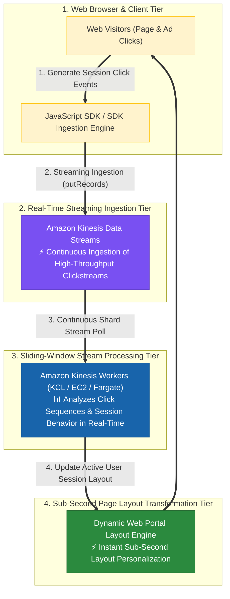

### Key Technical Rationale:
1. **Amazon Kinesis for Real-Time Clickstream Ingestion**: Amazon Kinesis Data Streams continuously ingests gigabytes of data per second from thousands of concurrent web sessions with sub-second latency.
2. **Kinesis Client Library (KCL) Workers for Stream Analytics**: Kinesis Workers read from Kinesis shards continuously, enabling sliding-window stateful analysis of visitor click sequences and immediate feedback into application layout engines.

### Why Distractor Options Fail:
- *Log Clicks in S3 & Analyze with EMR (Elastic MapReduce)*:
  - Storing click logs in S3 and processing via EMR (Hadoop/Spark batch clusters) is a **batch analytics pattern** operating on minutes/hours delays. It CANNOT dynamically modify web page layouts during an active live user click session!
- *Amazon SQS Queue + Periodically Drain to Amazon RDS*:
  - SQS buffers discrete queue messages for worker polling, and RDS is a relational database. Periodically draining SQS messages introduces batch polling delays that violate the real-time layout transformation SLA.
- *Publish Click Events to Amazon Timestream*:
  - **Amazon Timestream** is a purpose-built time-series database for timestamped IoT telemetry and DevOps metrics; it is NOT a real-time streaming ingestion engine with stream-processing worker libraries for clickstreams.

---

## 11.8 Real-World Exam Scenario 8: Serverless Order Fulfillment Workflow Migration (DynamoDB + Step Functions + Lambda vs. SQS Scheduled Polling & AWS Batch Traps)

- **Scenario**: A logistics company wants to migrate an internal warehouse shipment and tracking application from legacy email workflows to a fully **serverless application model** with minimal operational overhead. When a new order arrives, the application must track order state transitions ("received" $\rightarrow$ "in progress" $\rightarrow$ print shipping label $\rightarrow$ wait for physical package departure scan $\rightarrow$ "shipped"). What solution should be implemented?
- **Architecture Solution**:
  - Store order state information in an **Amazon DynamoDB table**.
  - Create an **AWS Step Functions state machine workflow** triggered for every new order.
  - The workflow marks the order as "in progress" in DynamoDB and triggers label printing. Once the package is physically scanned leaving the warehouse, trigger an **AWS Lambda function** to mark the order as "shipped" in DynamoDB and complete the Step Functions workflow.

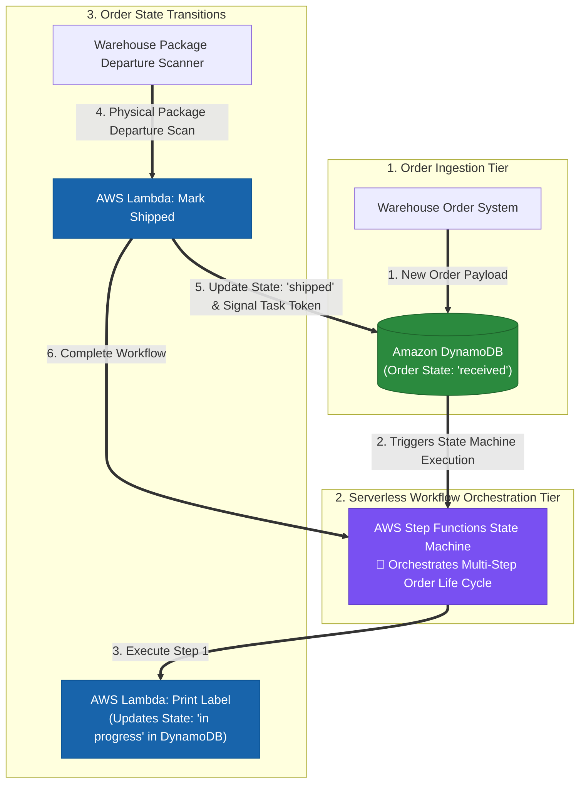

### Key Technical Rationale:
1. **AWS Step Functions for Serverless Workflow Orchestration**: Step Functions acts as a serverless state machine that manages multi-step business logic, handles retries, tracks task status ("in progress" $\rightarrow$ "shipped"), and seamlessly orchestrates long-running asynchronous processes.
2. **Amazon DynamoDB for Serverless State Persistence**: DynamoDB provides serverless, single-digit millisecond latency key-value storage for order metadata without provisioning DB servers.

### Why Distractor Options Fail:
- *SQS Queue + Scheduled Lambda Polling Every 5 Minutes (Your Selection)*:
  - Scheduling a Lambda function via EventBridge to poll an SQS queue every 5 minutes is an **AWS anti-pattern**! When the queue is empty, the scheduled Lambda still executes every 5 minutes, incurring useless invocation costs and log noise.
  - SQS + scheduled polling lacks state machine management for multi-step order state transitions waiting for physical human/warehouse events. Step Functions is specifically built for state machine orchestration with asynchronous callback task tokens.
- *AWS Batch Jobs for Order Steps*:
  - **AWS Batch** is designed for compute-intensive batch processing (e.g., nightly financial reports or containerized simulations), NOT for real-time web order workflow orchestration! AWS Batch cannot trigger Lambda functions directly to advance jobs through workflow stages.
- *Amazon EFS Volume + EC2 Instance Polling*:
  - Storing order files on EFS and running EC2 instances to poll and process orders requires provisioning, managing, and patching EC2 instances. This violates the core requirement for a **serverless model with minimal operational overhead**.

---

## 11.9 Real-World Exam Scenario 9: Decoupled High-Scale E-Commerce Flash Sale Architecture (CloudFront + ELB + ASG + Cognito + SQS + DynamoDB vs. Lex, RDS & Direct Write Traps)

- **Scenario**: An e-commerce company holds an annual flash sale event expecting millions of visitors. Visitors log in using Facebook or Google accounts, add items to cart, and checkout. The engineering team evaluated Amazon MSK (Managed Kafka) but opted for a simpler message queue to decouple checkout processing. What is the MOST scalable solution?
- **Architecture Solution**:
  - Combine an **Elastic Load Balancer (ELB)** in front of an **Auto Scaling Group of EC2 web servers** with **Amazon CloudFront** for fast global delivery.
  - Web servers authenticate users via social media accounts integrated in **Amazon Cognito**.
  - Web servers process purchases and push orders into an **Amazon SQS queue** using IAM Roles for EC2.
  - Worker application servers retrieve orders from the SQS queue and store them into an **Amazon DynamoDB table**.

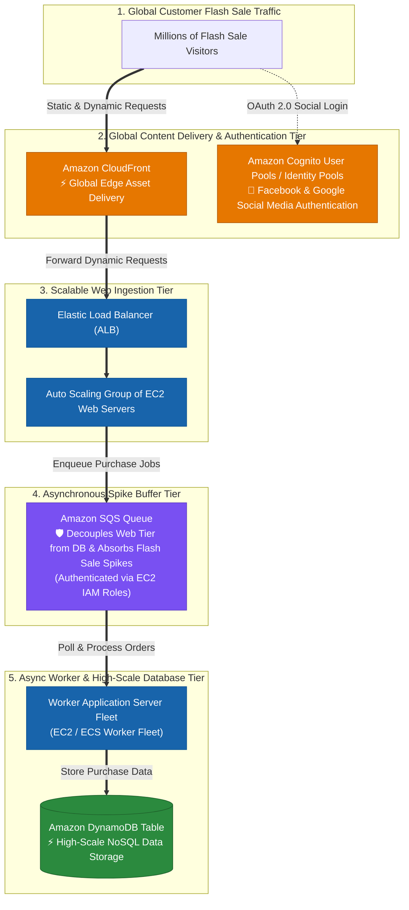

### Key Technical Rationale:
1. **Amazon SQS for Flash Sale Spike Absorption**: SQS provides an infinitely scalable, decoupled message buffer. Incoming purchase requests during flash sales accumulate safely in the queue without overwhelming downstream databases or web servers.
2. **Amazon Cognito for Public Social Identity Federation**: Cognito natively handles OAuth 2.0 social identity provider integration (Facebook, Google, Apple, Amazon) via `AssumeRoleWithWebIdentity`.
3. **Auto Scaling + DynamoDB for Infinite Scale**: Elastic Load Balancing with EC2 Auto Scaling handles web traffic surges, while DynamoDB provides predictable single-digit millisecond latency at scale.

### Why Distractor Options Fail:
- *Amazon Lex for Social Login + Multi-AZ RDS*:
  - **Amazon Lex** is a conversational AI chatbot service (voice/text NLP); it does **NOT** authenticate users or handle social login!
  - Synchronous writes directly to a relational **Amazon RDS database** during flash sales cause write connection pool exhaustion and database locking.
- *Direct Synchronous Writes to DynamoDB Without SQS + Fixed EC2*:
  - Deploying fixed EC2 web servers without an Auto Scaling group destroys elasticity.
  - Writing millions of flash sale purchases directly into DynamoDB without SQS buffering causes severe write throttling spikes and massive cost bloat.
- *AWS Global Accelerator for S3 Static Website Hosting*:
  - **AWS Global Accelerator** routes traffic to static IP endpoints (ALBs, NLBs, EC2); it CANNOT route or accelerate traffic directly to an S3 static website hosting bucket endpoint! Use **Amazon CloudFront** for S3 static website acceleration.

---

## 11.2 Real-World Exam Scenario 2: Cost-Optimized Media Photo Processing & Archival (SQS-Based EC2 Spot Auto Scaling + Amazon Glacier vs. SNS, S3 Standard-IA & Standalone CloudWatch Traps)

- **Scenario**: A media company in South Korea ingests raw wildlife photos uploaded to Amazon S3. Currently, an on-premises server fleet uses an open-source messaging queue to process photo jobs and archives processed output to tape libraries. The company wants to migrate to AWS using native storage and messaging tools to replicate the existing architecture while **minimizing cost**. What is the recommended solution?
- **Architecture Solution**:
  - Create an **Auto Scaling Group of EC2 Spot Instances** that scales dynamically based on the queue depth of an **Amazon SQS queue**.
  - After processing, transfer S3 objects to **Amazon S3 Glacier** for low-cost long-term archival storage.

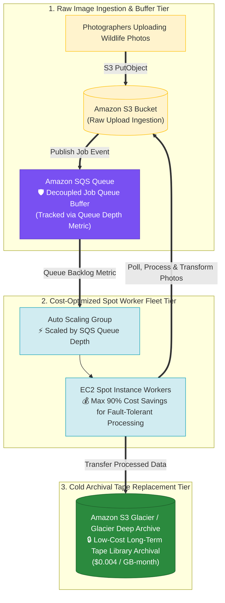

### Key Technical Rationale:
1. **EC2 Spot Instances + SQS Queue Depth Scaling**:
   - **EC2 Spot Instances** offer up to 90% cost savings over On-Demand instances, ideal for stateless, queue-driven photo processing workloads.
   - Scaling an Auto Scaling Group based on SQS queue depth (`ApproximateNumberOfMessagesVisible`) ensures worker instances scale up during upload bursts and scale down to zero when the queue is empty.
2. **Amazon S3 Glacier for Tape Library Replacement**:
   - Amazon S3 Glacier provides secure, durable cold storage at extremely low cost ($0.004/GB-mo), making it the direct cloud replacement for legacy on-premises tape libraries.

### Why Distractor Options Fail:
- *Using Amazon SNS instead of Amazon SQS*:
  - **Push Notifications vs. Queue Buffering**: Amazon SNS is a push-based pub/sub notification service. SNS does **NOT** buffer, queue, or persist job messages for worker instances to poll asynchronously.
- *Transferring Processed Photos to Amazon S3 Standard-IA*:
  - **Wrong Storage Class for Cold Archival**: S3 Standard-Infrequent Access ($0.0125/GB-mo) is designed for active data requiring sub-millisecond instant retrieval. For long-term tape archival, **Amazon S3 Glacier** ($0.004/GB-mo) or Glacier Deep Archive ($0.00099/GB-mo) is significantly cheaper.
- *Using Standalone CloudWatch Alarms to Terminate Idle Workers*:
  - Terminating EC2 instances directly via standalone CloudWatch alarms without an Auto Scaling Group destroys fleet capacity management, health check automated replacements, and dynamic scaling elasticity.

---

## 11.3 Real-World Exam Scenario 3: High-Scale Serverless Household IoT Telemetry Ingestion (AWS IoT Core MQTT + Direct DynamoDB Rule vs. EC2 ASG + NLB + EFS & Greengrass Traps)

- **Scenario**: Millions of household temperature sensors send data via the MQTT protocol to a domain registered in Route 53 (`iot.tutorialsdojotest.com`). The backend uses a self-hosted custom MQTT broker running on a single large EC2 instance. Over time, the custom EC2 broker crashed repeatedly from data overload, causing sensor data loss. The company requires a reliable, serverless, cost-effective solution with minimum operational overhead. What is the recommended solution?
- **Architecture Solution**:
  - Use **AWS IoT Core with MQTT** to create a new **Data-ATS endpoint**.
  - Update the **Amazon Route 53** DNS record to point to the new AWS IoT Core Data-ATS endpoint.
  - Create an **AWS IoT Rule** to directly insert incoming sensor data payloads into the **Amazon DynamoDB table**.

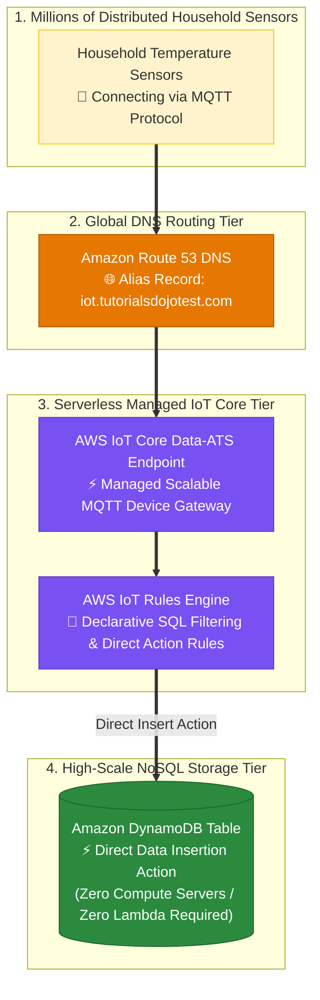

### Key Technical Rationale:
1. **AWS IoT Core Managed MQTT Message Broker**:
   - AWS IoT Core natively supports the **MQTT protocol** and automatically scales to support millions of connected devices and billions of messages without provisioning, patching, or managing EC2 server fleets.
2. **Direct DynamoDB Insertion via AWS IoT Rules Engine**:
   - The AWS IoT Rules Engine permits direct integration actions to insert MQTT payloads straight into **Amazon DynamoDB** tables without requiring intermediate Lambda functions or custom compute layers, minimizing latency, operational overhead, and cost.

### Why Distractor Options Fail:
- *EC2 Auto Scaling Group behind Network Load Balancer (NLB) + EFS (Your Selection)*:
  - **High Operational Overhead & Excessive Cost**: Operating a custom MQTT broker cluster on EC2 instances behind an NLB requires manual server patching, custom MQTT cluster state sync scripts, and ongoing operational maintenance. Amazon EFS ($0.30/GB-mo) is expensive and unneeded for ephemeral MQTT message brokering. AWS IoT Core eliminates EC2/NLB/EFS management completely.
- *AWS IoT Greengrass Data-ATS Endpoint*:
  - **Greengrass Misunderstanding**: AWS IoT Greengrass is edge software installed on physical gateway devices on-premises to execute local compute logic. AWS IoT Greengrass is **NOT** a cloud-hosted MQTT endpoint broker service for millions of remote household sensors!
- *AWS IoT Device Management Firmware Timers + Multi-Region EC2 Brokers*:
  - **Non-Scalable Complexity**: Updating device firmware with random timers does not solve broker scalability. Running redundant custom EC2 brokers across regions increases infrastructure costs without providing managed serverless MQTT scalability.

---

## 11.4 Real-World Exam Scenario 4: Real-Time Continuous Telemetry Stream Ingestion & Analytics (Kinesis Data Streams + KCL + EMR + Redshift vs. API Gateway SQS, Firehose S3 & S3 Direct Traps)

- **Scenario**: A biotech platform receives continuous 8KB/s plant genomic submissions every second from global biologists. The platform requires near-real-time data processing/analytics, durable parallel storage, and automated loading of processed results into a data warehouse (Amazon Redshift). What is the recommended architecture?
- **Architecture Solution**:
  - Ingest continuous genomic data streams using **Amazon Kinesis Data Streams (KDS)**.
  - Analyze and process streaming records in near-real-time using a **Kinesis Client Library (KCL)** application.
  - Process and aggregate output using **Amazon EMR** to load the results into an **Amazon Redshift** data warehouse cluster.

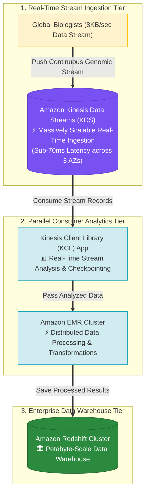

### Key Technical Rationale:
1. **Amazon Kinesis Data Streams (KDS) for Continuous High-Frequency Ingestion**:
   - Kinesis Data Streams is purpose-built for continuous high-frequency data stream ingestion ($< 70\text{ ms}$ latency), providing durable, ordered, multi-AZ partition storage.
2. **Kinesis Client Library (KCL) for Distributed Stream Consumption**:
   - KCL handles consumer load balancing, shard checkpointing, and resharding management automatically, allowing custom analytics applications to consume data directly out of Kinesis Data Streams.
3. **Amazon EMR + Amazon Redshift for Analytics & Data Warehousing**:
   - EMR processes distributed batch/stream transformations at scale and loads structured analytics into Amazon Redshift (the AWS enterprise relational data warehouse).

### Why Distractor Options Fail:
- *API Gateway + Amazon SQS Queue + Lambda (Your Selection)*:
  - **Queue vs. Stream Misunderstanding**: Amazon SQS is a discrete job queue designed for worker job decoupling, NOT a real-time continuous streaming ingestion engine. SQS does NOT support ordered stream partition processing or shared multi-consumer analytics. Polling SQS via Lambda introduces batching delays that fail near-real-time SLAs.
- *Amazon Data Firehose + S3 Bucket + KCL on S3 + QuickSight*:
  - **Library Misuse**: KCL (Kinesis Client Library) reads records from Kinesis Data Streams, **NOT** directly from Amazon S3 object files!
  - **QuickSight is BI, Not a Data Warehouse**: QuickSight is a BI visualization dashboard, NOT a data warehouse. Redshift is the required data warehouse.
- *Direct S3 Storage + SQS/Kinesis*:
  - **High Latency File IO**: Writing 8KB per second directly to S3 creates millions of small files and massive S3 PUT request fees. Polling S3 via SQS introduces severe file IO latency, failing near-real-time ingestion requirements.

---

## 11.5 Real-World Exam Scenario 5: Decoupling Unpredictable E-Commerce Promotional Sale DB Writes (Amazon SQS Queue + Lambda vs. Memcached Write Buffer, DynamoDB Migration & Manual Scaling Traps)

- **Scenario**: An e-commerce platform running on an EC2 Auto Scaling group and an Amazon RDS for PostgreSQL database schedules a promotional sale. Management anticipates sudden, unpredictable traffic spikes with a massive volume of database write submissions (user registrations and orders). The Solutions Architect must implement a solution ensuring all submissions are committed to the database without data loss and **without changing the underlying data model**. What is the recommended solution?
- **Architecture Solution**:
  - Decouple the web application and database tiers by placing an **Amazon SQS queue** between them.
  - Create an **AWS Lambda function** (or worker process) that consumes messages from the SQS queue and writes them into the Amazon RDS PostgreSQL database.

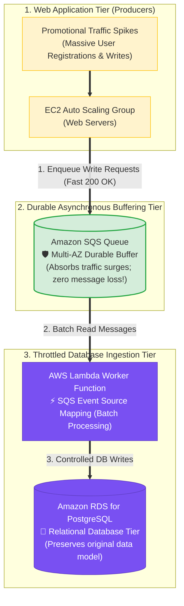

### Key Technical Rationale:
1. **Amazon SQS Queue for Asynchronous Write Decoupling**:
   - Placing an Amazon SQS queue between web servers and the RDS database decouples the tiers. Web instances immediately send write requests to SQS and return fast responses to users.
   - SQS durably stores messages across multiple Availability Zones with virtually unlimited throughput, holding submissions until the database can process them.
2. **AWS Lambda Consumer for Controlled Ingestion Rate**:
   - Lambda automatically reads messages off SQS in batches and performs controlled database writes, buffering the RDS database connection pool against connection exhaustion during extreme traffic spikes.
3. **Preserves Relational Data Model**:
   - Using SQS + Lambda buffers writes to the existing RDS PostgreSQL database without requiring schema changes or database migrations.

### Why Distractor Options Fail:
- *ElastiCache for Memcached Cluster as Write Buffer (Your Selection)*:
  - **Volatile In-Memory Cache (Data Loss Risk)**: ElastiCache for Memcached is an in-memory key-value cache designed for **read caching**, NOT durable transaction queuing! Memcached is volatile (reboots/node failures erase memory contents), lacks data persistence/replication, and cannot reliably hold queued writes during traffic spikes.
- *Manual Vertical Scaling of RDS Instance*:
  - **Downtime & Unpredictable Traffic Failure**: Scaling up an RDS instance can cause brief downtime during modification (if Single-AZ) and cannot guarantee handling unpredictable traffic bursts.
- *Migrate RDS PostgreSQL to Amazon DynamoDB*:
  - **Violates Data Model Constraint**: Migrating from relational SQL to NoSQL requires altering the entire application schema, explicitly violating the requirement to operate *"without changing the underlying data model"*.

---

## 12. Common Application Integration Exam Traps

1. **Trap 1: Conflating Amazon SQS (Pull) with Amazon SNS (Push)**: SQS requires consumers to poll for messages; SNS pushes notifications to subscribers. For buffering high-traffic web spikes, select **SQS**.
2. **Trap 2: Using Scheduled EventBridge Lambda Polling Every 5 Mins for SQS**: Polling SQS on a fixed timer invokes Lambda when the queue is empty, wasting money. Use **SQS Event Source Mapping** directly with Lambda.
3. **Trap 3: Selecting Amazon Lex for User Authentication**: Amazon Lex builds conversational AI chatbots. For social media user login (Facebook/Google), always select **Amazon Cognito**.
4. **Trap 4: Using AWS Global Accelerator to Accelerate S3 Static Websites**: Global Accelerator requires static IP endpoints (ALBs/EC2). For accelerating S3 static website content at global edge locations, always select **Amazon CloudFront**.

---

## 13. Final Mental Model

`Event Occurs ➔ Route (EventBridge) ➔ Social Auth (Cognito) ➔ Edge (CloudFront) ➔ Decouple Flash Spikes (SQS) ➔ Real-Time Stream (Kinesis) ➔ NoSQL Storage (DynamoDB)`