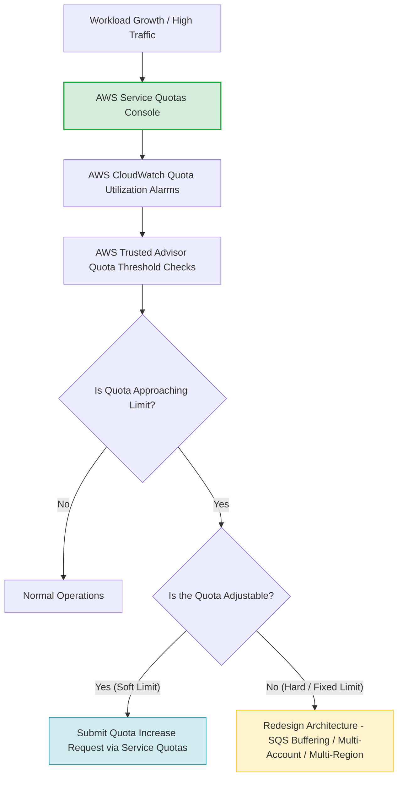
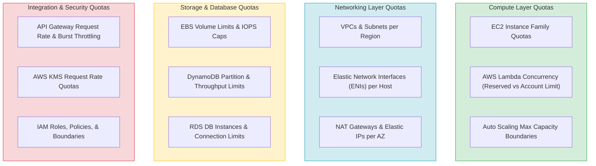
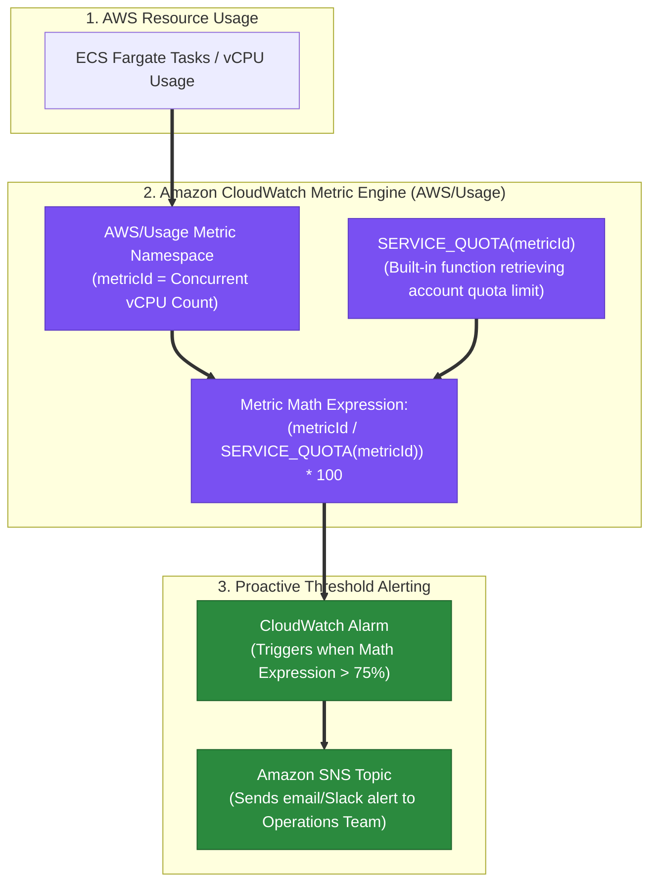
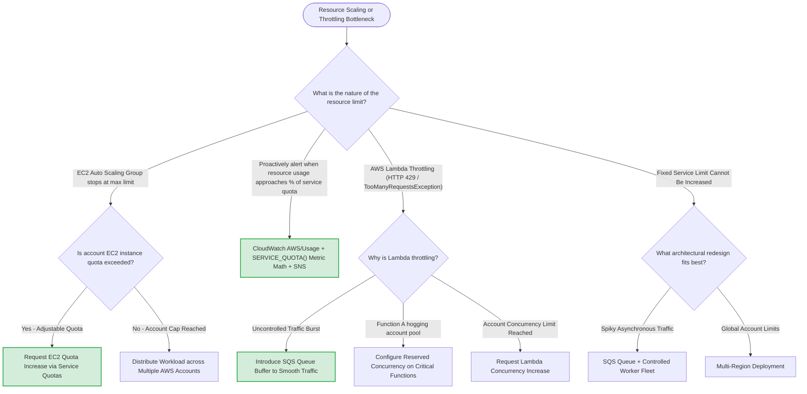

# Task 2.4: Design a Strategy to Meet Reliability Requirements — Service Quotas and Limits

> [!NOTE]
> **Exam Mindset**: For the AWS Solutions Architect Professional (SAP-C02) and AI Practitioner (AIP-C01) exams, view AWS Service Quotas as **critical reliability, scalability, and availability boundaries**.
> - **Core Exam Insight**: A solution can be architecturally perfect, yet fail in production because an unmonitored AWS service quota was reached.
> - **Decision Hierarchy**: Identify Bottleneck $\rightarrow$ Check if Quota is Adjustable $\rightarrow$ **If Adjustable**: Request Increase via Service Quotas $\rightarrow$ **If Fixed / Spiky Traffic**: Redesign Architecture (SQS Buffering, Multi-Account Isolation, or Multi-Region Distribution).

---

## 1. Why Service Quotas Exist

AWS imposes quotas (formerly called "service limits") across all accounts to protect:
- **Service Stability**: Prevents single-tenant runaway processes from overwhelming multi-tenant infrastructure.
- **Account & Regional Isolation**: Prevents accidental resource exhaustion within an AWS account or Region.
- **Fair Resource Allocation**: Ensures equal access to regional AWS infrastructure capacity.



---

## 2. Core Concepts: Adjustable vs. Fixed Quotas

| Quota Category | Characteristics | Operational Resolution Path | Exam Action |
| :--- | :--- | :--- | :--- |
| **Adjustable Quotas** (Soft Limits) | Can be increased via AWS Service Quotas console or API | Submit automated or manual Quota Increase Request | **Request Quota Increase** |
| **Fixed Quotas** (Hard Limits) | Enforced by AWS engineering; cannot be increased | Architect around the limitation using AWS design patterns | **Redesign Architecture** |

---

## 3. Multi-Layer AWS Service Quotas Breakdown



---

## 4. Quotas as a Reliability & Scalability Bottleneck

> [!IMPORTANT]
> **Exam Trap: ASG MaxSize vs. EC2 Account Quota**:
> - Setting an Auto Scaling Group `MaxSize = 500` does **NOT** guarantee that 500 instances can launch.
> - If your AWS account's regional EC2 quota for that instance family is `100`, scaling will fail once 100 instances are launched.
> - **Scalability = Application Design + AWS Service Quotas + Regional Capacity**.

---

## 5. Centralized Quota Management Tools

- **AWS Service Quotas**: Centralized service to view default and account-specific quotas, track current usage, and request limit increases.
- **Amazon CloudWatch**: Monitors quota utilization metrics and triggers alarms when utilization exceeds defined thresholds (e.g., 80%).
- **AWS Trusted Advisor**: Audits service usage and alerts on account-level limits approaching maximum thresholds.

### Governance Tooling Comparison

| Service | Primary Function | Primary Exam Role |
| :--- | :--- | :--- |
| **AWS Service Quotas** | View quotas & request increases | Requesting soft limit increases |
| **Amazon CloudWatch** | Metric collection & alarming | Proactive quota threshold alerting |
| **AWS Trusted Advisor** | Account optimization & checks | Audit check for approaching limits |

---

## 6. Architectural Strategies to Circumvent Quota Bottlenecks

```mermaid
flowchart TD
    subgraph Problem ["1. Synchronous Direct Pattern (Throttling Risk)"]
        Client1["100,000 Concurrent Users"] ==>|"Direct HTTP Requests"| APIGW1["API Gateway"]
        APIGW1 ==>|"Throttled (HTTP 429 Error)"| Lambda1["Lambda Functions"]
        Lambda1 ==>|"Database Connection Exhaustion"| DB1["Amazon RDS / DynamoDB"]
    end

    subgraph Solution ["2. Buffer & Decouple Pattern (Quota Protection)"]
        Client2["100,000 Concurrent Users"] ==>|"Direct HTTP Requests"| APIGW2["API Gateway"]
        APIGW2 ==>|"1. Enqueue Message"| SQS["Amazon SQS Queue<br/>(Buffers Traffic Burst)"]
        SQS ==>|"2. Controlled Processing Rate"| Lambda2["Lambda Worker Fleet<br/>(Operates within Concurrency Limit)"]
        Lambda2 ==>|"3. Steady Writes"| DB2["Amazon RDS / DynamoDB"]
    end

    style Problem fill:#f8d7da,stroke:#dc3545,stroke-width:1px
    style Solution fill:#d4edda,stroke:#28a745,stroke-width:2px
```



### Key Architectural Solutions
1. **SQS Buffering**: Absorb spiky traffic bursts using **Amazon SQS** queues so downstream Lambda or EC2 workers process messages within concurrency quotas.
2. **Multi-Account Architecture**: Distribute workloads across multiple AWS accounts in **AWS Organizations** to double or triple account-scoped service quotas.
3. **Multi-Region Distribution**: Distribute traffic across geographically distinct AWS Regions to access separate regional quotas.

---

## 7. Deep-Dive: AWS Lambda Concurrency Quotas

> [!WARNING]
> **Exam Distinction: Reserved Concurrency vs. Provisioned Concurrency**:
> - **Account Concurrency Limit**: Default $1,000$ per Region (adjustable).
> - **Reserved Concurrency**: Guarantees a minimum pool of concurrency for a specific function, but *deducts* that amount from the shared account pool.
> - **Provisioned Concurrency**: Pre-warms execution environments to eliminate cold starts for critical workloads.

---

## 8. Service Quotas vs. Throttling

- **Service Quota**: An administrative or technical limit on resources (e.g., number of VPCs, max concurrent executions).
- **Throttling**: The active rejection of incoming requests (HTTP 429 / `TooManyRequestsException`) when traffic exceeds defined request rate quotas or capacity limits.

---

## 8.1 Native CloudWatch Quota Utilization Alarms (`AWS/Usage` Namespace & `SERVICE_QUOTA()`)

AWS natively publishes resource usage metrics into the **`AWS/Usage`** CloudWatch metric namespace. To proactively alert on quota utilization percentage with **minimal operational overhead**:



### Key Technical Rationale:
1. **Built-in `AWS/Usage` Namespace**: AWS services automatically report resource consumption metrics to the `AWS/Usage` namespace, eliminating the need to publish custom metrics or write custom scripts.
2. **Native `SERVICE_QUOTA()` Metric Math Function**: CloudWatch provides a built-in metric math function `SERVICE_QUOTA(metricId)` that dynamically fetches the current service quota limit for the given metric.
3. **Proactive Percentage Calculation**: The math expression `(metricId / SERVICE_QUOTA(metricId)) * 100` dynamically calculates usage percentage regardless of whether the underlying quota increases, triggering alarms at $75\%$ threshold with zero custom code maintenance.

---

## 9.1 Real-World Exam Scenario: ECS Fargate vCPU Service Quota Proactive Monitoring

- **Scenario**: An online streaming startup runs hundreds of microservices using Amazon ECS on AWS Fargate. Concurrently running tasks are growing steadily. The operations team needs to be proactively alerted when concurrently running Fargate vCPUs reach **75% of the service quota's maximum limit**. What is the **MOST operationally efficient** solution?
- **Architecture Solution**:
  - Use **Amazon CloudWatch** to monitor service quotas published in the **`AWS/Usage`** metric namespace. Set up a CloudWatch alarm based on the math expression `metricId / SERVICE_QUOTA(metricId) * 100` greater than `75`. Configure **Amazon SNS** to send notifications to the operations team.

### Why Distractor Options Fail:
- *CloudWatch Container Insights with Custom Dashboard & Custom Metric*: Container Insights monitors container performance metrics (CPU, memory, disk utilization), NOT account-level service quota limits. Creating custom metrics and dashboards requires manual calculation and ongoing maintenance when native `AWS/Usage` metrics and `SERVICE_QUOTA()` functions already exist.
- *AWS Service Quotas Increase + AWS Health Dashboard + EventBridge + Lambda*: AWS Health Dashboard provides reactive notices during AWS outages or after quota limits are breached, NOT proactive utilization percentage monitoring. Pre-emptively increasing quotas by 200% avoids monitoring and adds unnecessary process.
- *CloudWatch Sample Count Metric*: `SampleCount` tracks the count of data points/invocations, NOT concurrent vCPU utilization or service quota caps.

---

## 9. SAP-C02 Service Quotas & Throttling Master Decision Engine



---

## 10. SAP-C02 Exam Keyword Cheat Sheet

```
"Approaching service quota"             ──> AWS Service Quotas
"Request limit increase"                ──> AWS Service Quotas
"Monitor quota utilization"             ──> CloudWatch Metrics + Service Quotas
"Audit account service limits"          ──> AWS Trusted Advisor
"Lambda TooManyRequestsException / 429" ──> Lambda Concurrency Quotas / SQS Queue Buffer
"ASG cannot launch more instances"      ──> EC2 Account Quota Limit
"Isolated quota limits per environment" ──> Multi-Account Architecture (AWS Organizations)
"Smooth spiky traffic bursts"           ──> Amazon SQS Queue Buffer
"Fixed quota reached"                   ──> Architectural Redesign (Multi-Region / Multi-Account)
```

---

## 11. Common SAP-C02 Exam Traps

1. **Trap 1: Redesigning when a Quota Increase is available**: If a question states an adjustable quota is reached, do **NOT** prematurely redesign the entire application. The simplest solution is to request a **Service Quota Increase**.
2. **Trap 2: Assuming ASG MaxSize overrides Account Quotas**: Increasing `MaxSize` does not grant more capacity if the account-level EC2 instance quota is exhausted.
3. **Trap 3: Using Direct Synchronous Execution during Traffic Bursts**: Calling Lambda directly during heavy traffic bursts causes HTTP 429 throttling. Insert **Amazon SQS** between API Gateway and Lambda.
4. **Trap 4: Conflating Reserved Concurrency with Unlimited Scaling**: Assigning high reserved concurrency to one Lambda function starves all other functions in the same AWS account.

---

## 12. Final Mental Model

`Identify Bottleneck ➔ Check Adjustable? ➔ If Yes: Request Quota Increase ➔ If Fixed: SQS Buffer / Multi-Account / Multi-Region Redesign`