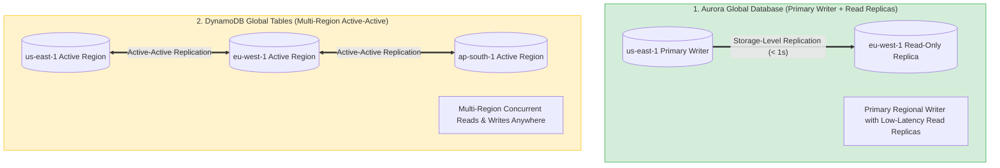
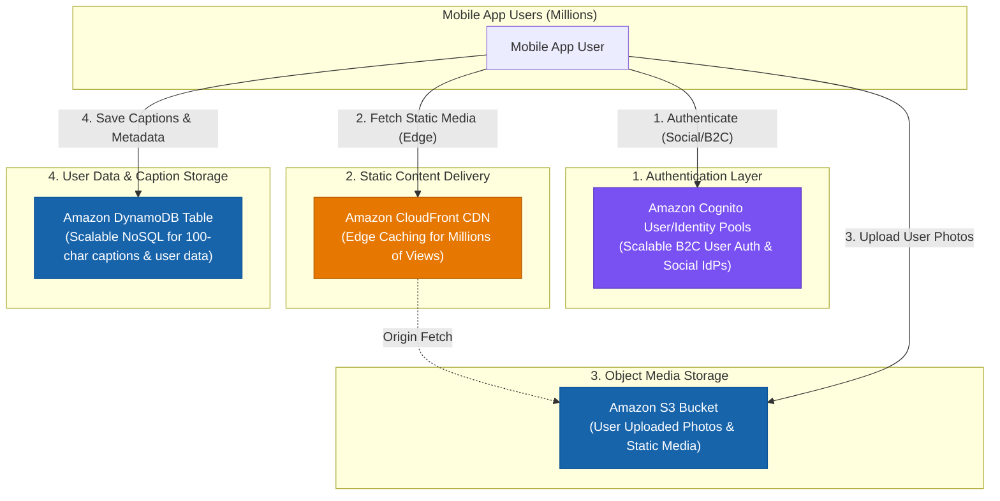
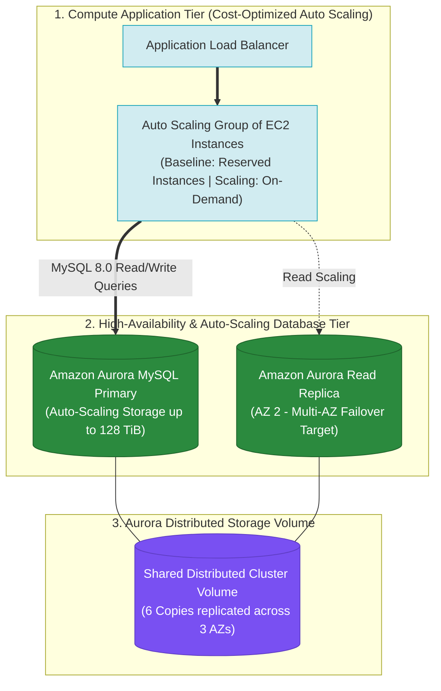
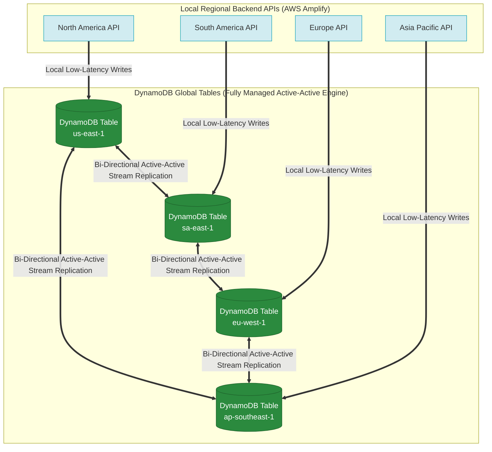
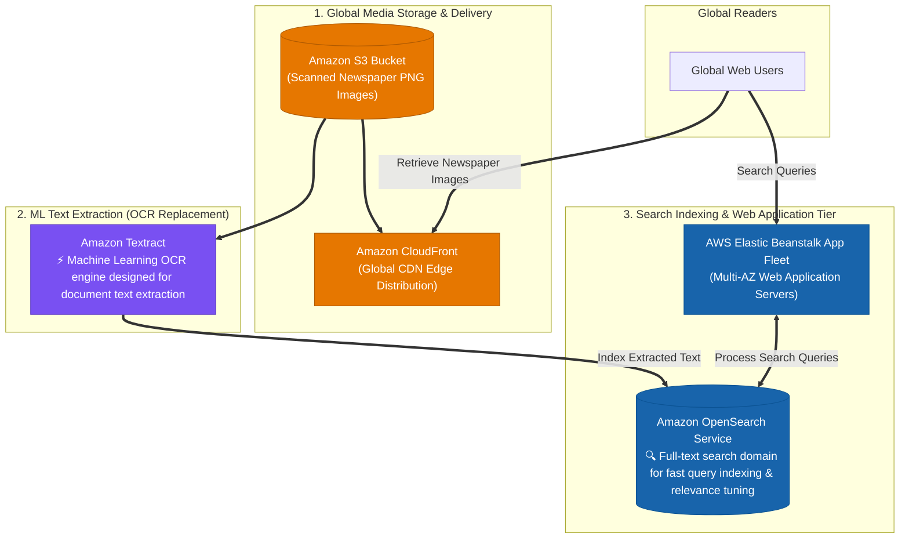
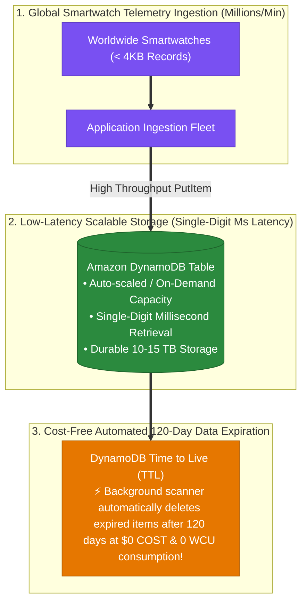

# Task 2.5: Design a Solution to Meet Performance Objectives — Purpose-Built Databases

> [!NOTE]
> **Exam Mindset**: For the AWS Solutions Architect Professional (SAP-C02) and AI Practitioner (AIP-C01) exams, never ask *"Which database is best?"*. Ask:
> **"What data access pattern, query model, and latency SLA does the workload require?"**
> Match the workload access pattern directly to the specialized purpose-built AWS database engine.

---

## 1. Workload Access Pattern Taxonomy & Database Alignment

```mermaid
flowchart TD
    subgraph Data_Access ["Data Access Pattern Classification"]
        Relational["1. Relational (SQL & ACID Transactions)<br/>• Amazon RDS / Amazon Aurora"]
        KeyValue["2. Key-Value & Document (High-Scale NoSQL)<br/>• Amazon DynamoDB / Amazon DocumentDB"]
        InMem["3. In-Memory Cache (Sub-Millisecond Speed)<br/>• Amazon ElastiCache (Redis / Memcached) / DAX"]
        Graph["4. Graph (Complex Network Relationships)<br/>• Amazon Neptune"]
        TimeSeries["5. Time-Series (Timestamped Telemetry & Metrics)<br/>• Amazon Timestream"]
        Search["6. Search & Log Analytics (Full-Text Search)<br/>• Amazon OpenSearch Service"]
        Analytics["7. Data Warehouse (Complex OLAP Analytics)<br/>• Amazon Redshift"]
    end

    Relational --- KeyValue --- InMem --- Graph --- TimeSeries --- Search --- Analytics

    style Relational fill:#d4edda,stroke:#28a745,stroke-width:1px
    style KeyValue fill:#d1ecf1,stroke:#17a2b8,stroke-width:1px
    style InMem fill:#fff3cd,stroke:#ffc107,stroke-width:1px
    style Graph fill:#f8d7da,stroke:#dc3545,stroke-width:1px
```



---

## 2. AWS Purpose-Built Databases Feature Matrix

| Database Service | Data Model | Primary Query Pattern | Latency SLA | Key Exam Keyword Trigger |
| :--- | :--- | :--- | :--- | :--- |
| **Amazon Aurora / RDS**| Relational (SQL) | Complex SQL, ACID, multi-table joins | Milliseconds | *"ACID transactions / Complex SQL joins"* |
| **Amazon DynamoDB** | Key-Value / Document | Single-digit millisecond key lookups | Single-digit ms | *"Serverless NoSQL / Millions of req/sec"* |
| **Amazon ElastiCache** | In-Memory Key-Value | Sub-millisecond read/write cache | Sub-millisecond | *"In-memory session cache / Sub-millisecond"* |
| **Amazon Neptune** | Graph (Property/RDF) | Relationship traversal & connected graphs| Milliseconds | *"Social graphs / Fraud relationships"* |
| **Amazon DocumentDB** | Document (JSON) | MongoDB-compatible JSON query | Milliseconds | *"MongoDB-compatible / Flexible JSON schema"* |
| **Amazon Timestream** | Time-Series | Timestamped sequential queries | Milliseconds | *"IoT telemetry / Sensor timestamped metrics"* |
| **Amazon Redshift** | Columnar OLAP | Complex analytical queries & aggregations| Seconds / Mins | *"Data Warehouse / OLAP / Petabyte Analytics"* |
| **Amazon OpenSearch** | Search / Logs | Full-text search & log aggregation | Sub-second | *"Full-text search / Log analytics"* |

---

## 3. Deep-Dive: Caching Mechanics — ElastiCache vs. DAX

```mermaid
flowchart TD
    subgraph ElastiCache_Pattern ["1. General Application Caching (Amazon ElastiCache)"]
        App1["Application"] -->|"1. Check Cache"| Cache1["Amazon ElastiCache (Redis / Memcached)"]
        Cache1 -.->|"Cache Miss"| DB1["Relational DB (RDS / Aurora) or NoSQL"]
        DB1 -.->|"2. Write Back to Cache"| Cache1
    end

    subgraph DAX_Pattern ["2. DynamoDB-Specific In-Memory Caching (DAX)"]
        App2["Application"] ==>|"1. Transparent API Read Call"| DAX["DynamoDB Accelerator (DAX)"]
        DAX ==>|"Microsecond Cache Hit / Miss Sync"| DDB["Amazon DynamoDB Table"]
    end

    style Cache1 fill:#d1ecf1,stroke:#17a2b8,stroke-width:1px
    style DAX fill:#d4edda,stroke:#28a745,stroke-width:2px
```



### ElastiCache Redis vs. Memcached Feature Comparison

| Feature | Amazon ElastiCache for Redis | Amazon ElastiCache for Memcached |
| :--- | :--- | :--- |
| **Data Persistence** | Supported (Snapshots & Append-Only Files) | No (Purely ephemeral in-memory) |
| **Replication & HA** | Multi-AZ with automatic failover | Multi-node horizontal sharding (No failover) |
| **Data Structures** | Strings, Hashes, Lists, Sets, Sorted Sets, Geospatial | Simple Key-Value strings |
| **Pub/Sub Messaging**| Supported | Not supported |

---

## 4. Multi-Region Replication: Aurora Global DB vs. DynamoDB Global Tables



> [!IMPORTANT]
> **Exam Distinction**:
> - **Aurora Global Database**: Single-Region Primary Writer with low-latency cross-Region storage replication to read-only secondary Regions.
> - **DynamoDB Global Tables**: Multi-Region **Active-Active** multi-master replication allowing concurrent writes in any configured AWS Region.

---

## 5. Capacity & Cost Strategy: DynamoDB On-Demand vs. Provisioned

- **On-Demand Capacity**: Automatically scales request throughput up and down. Ideal for **unpredictable or spiky workloads**.
- **Provisioned Capacity**: Specify Read Capacity Units (RCUs) and Write Capacity Units (WCUs). Ideal for **predictable traffic** or when combined with Auto Scaling and Reserved Capacity.

---

## 6. Operational Overhead: Managed Purpose-Built vs. Self-Hosted EC2

> [!TIP]
> **Managed Service Rule**: Always prefer AWS managed database services over self-hosting databases on EC2 instances:
> - **Self-Hosted MySQL/PostgreSQL on EC2** $\longrightarrow$ **Amazon RDS / Amazon Aurora**
> - **Self-Hosted MongoDB on EC2** $\longrightarrow$ **Amazon DocumentDB**
> - **Self-Hosted Redis/Memcached on EC2** $\longrightarrow$ **Amazon ElastiCache**
> - **Self-Hosted Elasticsearch on EC2** $\longrightarrow$ **Amazon OpenSearch Service**

---

## 7. SAP-C02 Purpose-Built Database Master Decision Engine


---

## 8. SAP-C02 Exam Keyword Cheat Sheet

```
"Relational / SQL / ACID transactions" ──> Amazon RDS / Amazon Aurora
"Massive scale key-value NoSQL"         ──> Amazon DynamoDB
"Multi-Region active-active writes"     ──> DynamoDB Global Tables
"Sub-millisecond DynamoDB read cache"   ──> DynamoDB Accelerator (DAX)
"General application session caching"   ──> Amazon ElastiCache (Redis / Memcached)
"Social graph / Fraud relationships"    ──> Amazon Neptune
"MongoDB-compatible JSON documents"     ──> Amazon DocumentDB
"IoT sensor telemetry / Timestamped"    ──> Amazon Timestream
"Complex OLAP analytics / Data Warehouse"──> Amazon Redshift
"Full-text search / Log analytics"      ──> Amazon OpenSearch Service
```

---

## 9. Common SAP-C02 Exam Traps

1. **Trap 1: Choosing DynamoDB for Time-Series Data**: While DynamoDB can store time-series data, **Amazon Timestream** is specifically optimized for automated time-based tiering and lifecycle retention.
2. **Trap 2: Selecting Redshift for OLTP Transactional Workloads**: Redshift is a columnar OLAP Data Warehouse. High-frequency OLTP writes will degrade performance. Use **Amazon Aurora / RDS**.
3. **Trap 3: Adding DAX for General Database Caching**: DAX is specifically integrated with DynamoDB APIs. For caching RDS, Aurora, or custom application backends, use **Amazon ElastiCache**.
4. **Trap 4: Installing Custom Database Engines on EC2**: Self-hosting databases on EC2 increases patching, backup, and failover management overhead. Always prefer AWS managed database services unless unsupported.

---

## 9.1 Real-World Exam Scenario: High-Scale B2C Mobile Application Stack

- **Scenario**: A fashion startup is launching a mobile app expecting viral traffic (millions of views). The app allows users to log in, view static fashion content, and upload photos of themselves wearing accessories with captions up to 100 characters. The architecture must automatically scale to handle millions of views and users.
- **Architecture Solution**:



### Component Selection Rationale:
1. **Amazon Cognito**: Authenticates millions of public B2C mobile end-users with support for social identity providers (Google, Facebook, Amazon) and OAuth 2.0 / OIDC.
2. **Amazon DynamoDB**: Provides single-digit millisecond latency and seamless auto-scaling for simple unstructured key-value records (e.g., 100-character captions) without relational database connection overhead.
3. **Amazon S3**: Unlimited scalable object storage for raw photo uploads.
4. **Amazon CloudFront**: Global CDN edge locations distribute static assets to millions of concurrent viewers, preventing S3 origin hot-spotting and latency spikes.

### Why Distractor Options Fail:
- *RDS instead of DynamoDB*: RDS requires connection pooling and fixed provisioned instances; it is over-engineered and less auto-scalable for simple 100-character key-value metadata.
- *SAML 2.0 / On-Premises Active Directory*: SAML 2.0 and enterprise LDAP/AD are designed for internal corporate workforce federation, NOT public consumer mobile applications with millions of social media logins.
- *Direct S3 Distro without CloudFront*: S3 alone lacks edge-caching distribution needed to efficiently handle sudden surges of millions of global image views.

5. **Trap 5: Using Lambda@Edge for Heavy Application Frameworks**: Lambda@Edge is designed for lightweight CloudFront HTTP request/response manipulation at global edge locations; it is NOT intended for executing heavy backend application frameworks (e.g. Ruby on Rails data processing pipelines).

---

## 9.2 Real-World Exam Scenario: High-Scale Weather Simulation Engine (Amazon Aurora MySQL vs. RDS/EC2)

- **Scenario**: A weather modeling facility generates terabytes of simulation data stored in a MySQL 8.0 database (currently **16 TiB** and growing continuously). A Ruby on Rails app processes the data. The application requires $24\times7$ high availability, seamless database storage auto-scaling, and maximum cost-effectiveness.
- **Architecture Solution**:



### Key Architectural Rationale:
1. **Amazon Aurora MySQL Storage Scaling**: Aurora's shared cluster storage volume automatically grows in 10 GB increments up to **128 TiB** per database cluster. It eliminates manual storage volume expansion, EBS resizing downtime, or storage allocation limits.
2. **Aurora Multi-AZ High Availability**: Creating an Aurora Read Replica in a second Availability Zone provides automated failover. If the primary instance fails, Aurora automatically promotes the read replica in under 30 seconds with zero data loss.
3. **Compute Tier Cost Optimization**: Running the web/app tier on an Auto Scaling Group of smaller EC2 instances behind an Application Load Balancer optimizes cost. Purchasing **Reserved Instances (RIs)** for baseline capacity and utilizing **On-Demand** for traffic spikes maximizes cost efficiency.

### Why Distractor Options Fail:
- *Lambda@Edge + RDS MySQL*: Lambda@Edge customizes HTTP responses at CloudFront edge locations; it cannot run full-stack Ruby on Rails simulation data processors. RDS MySQL requires managing storage limits or manual storage allocation, whereas Aurora storage auto-scales natively.
- *RDS MySQL with Manual Volume Adjustments*: Requiring manual storage volume expansion risks database downtime and outages when simulations fill disk space unexpectedly.
- *Self-Hosted MySQL on EC2 with LVM*: Hosting MySQL on EC2 with Logical Volume Manager (LVM) and multiple EBS volumes requires massive manual management overhead for backups, volume striping, and failover scripts.

---

## 9.3 Real-World Exam Scenario: Global Multi-Region Mobile Marketplace Database Architecture (DynamoDB Global Tables)

- **Scenario**: A tech startup launches a global mobile marketplace using AWS Amplify. Backend APIs operate in multiple AWS Regions (North America, South America, Europe, Asia) to process sales and financial transactions close to users. Transactions in any region must automatically replicate across all other regions. The team rejected Amazon Keyspaces due to high cross-region management overhead. What is the most scalable, cost-effective, and highly available solution with the least operational effort?
- **Architecture Solution**:
  - Create a **Global Amazon DynamoDB Table** with replica tables in each required AWS region.
  - In each local region, write individual transactions to the local DynamoDB replica table. Changes automatically replicate across all global replica tables.



### Key Technical Rationale:
1. **Fully Managed Active-Active Multi-Master Replication**: **DynamoDB Global Tables** build upon DynamoDB Streams to automatically replicate data changes across designated AWS Regions with single-digit millisecond latency and zero operational management overhead.
2. **Local Low Latency**: Clients in North America, South America, Europe, and Asia write to their local regional DynamoDB table with low latency, and DynamoDB asynchronously propagates changes globally.
3. **Automatic Conflict Resolution**: DynamoDB Global Tables natively resolve update conflicts across regions using a last-writer-wins mechanism, eliminating the need to write custom replication logic.

### Why Distractor Options Fail:
- *Custom AWS Lambda Function + DynamoDB Streams Replay*: Writing a custom Lambda function to poll streams and manually replay writes across multiple regions is unscalable, introduces severe bottleneck risks under millions of transactions, and requires massive custom code and error-handling maintenance.
- *Amazon S3 Buckets + Cross-Region Replication (CRR)*: Amazon S3 is an object storage service, NOT a transactional relational or NoSQL database. S3 lacks query indexes, transaction locks, and atomic operations required for financial transactions.
- *AWS Control Tower + Amazon Connect*: Amazon Connect is a cloud contact center (call center) service; AWS Control Tower governs multi-account landing zones. Neither manages database replication.

---

## 9.4 Real-World Exam Scenario: Global Print Media Archive Search (S3 + CloudFront + Amazon Textract + OpenSearch)

- **Scenario**: A print media company hosts a popular web application allowing global users to search its back catalog of scanned newspaper PNG images. The legacy commercial OCR software license is expiring. The company wants to migrate to AWS with a highly available, durable, and scalable architecture to extract text from newspaper images and provide fast global search capabilities. What is the optimal architecture?
- **Architecture Solution**:
  1. Store scanned newspaper image files in an **Amazon S3 bucket** and deliver them globally via an **Amazon CloudFront** web distribution.
  2. Host the web application on **AWS Elastic Beanstalk** across multiple Availability Zones.
  3. Deploy **Amazon OpenSearch Service** to handle full-text search indexing and query processing for the website.
  4. Use **Amazon Textract** to automatically detect and extract text from the scanned newspaper images (replacing the legacy OCR software).



### Key Technical Rationale:
1. **Amazon Textract for Document OCR**: **Amazon Textract** is a specialized ML service designed specifically to extract typed and handwritten text, forms, and tables from scanned documents and newsprint. It eliminates commercial OCR software licensing costs and operational server management.
2. **Amazon OpenSearch Service for Query Processing**: **Amazon OpenSearch Service** provides fully managed, scalable full-text search capabilities, handling query indexing, relevance scoring, and low-latency search execution across millions of document pages.
3. **Amazon S3 + CloudFront Global Delivery**: Storing images in S3 provides 99.999999999% (11 9s) durability, while CloudFront caches PNG images at global edge locations for rapid low-latency retrieval.

### Why Distractor Options Fail:
- *Using Amazon Rekognition instead of Amazon Textract*: Amazon Rekognition is designed for image object/face recognition and basic scene text (e.g. license plates, signs), NOT dense document OCR! **Amazon Textract** is the dedicated service for document and newspaper text extraction.
- *Using Amazon Kendra + Athena + S3 Glacier*: **Amazon Kendra cannot OCR raw PNG image files directly** (it requires pre-extracted text). Setting up lifecycle policies to move images to S3 Glacier introduces retrieval delays (hours) unacceptable for public web browsing. Amazon Athena cannot query binary PNG image files.
- *Storing images on EBS volumes with DLM*: Amazon EBS volumes are single-AZ block storage devices; they are not scalable or durable global object storage compared to Amazon S3 + CloudFront.

---

## 9.5 Real-World Exam Scenario 5: High-Scale Smartwatch Telemetry & 120-Day Retention (DynamoDB + TTL)

- **Scenario**: A tech company ingests millions of telemetry records per minute globally from smartwatches (< 4KB per record). Data must be stored durably with low-latency retrieval times for 120 days, after which it must be automatically deleted. The annual storage volume is 10-15 TB. What is the **MOST cost-effective and scalable storage solution**?
- **Architecture Solution**:
  - Configure the application to ingest records into an **Amazon DynamoDB table** with Auto Scaling (or On-Demand mode). Enable **DynamoDB Time to Live (TTL)** on a Unix epoch timestamp attribute to delete records automatically after 120 days.



### Key Technical Rationale:
1. **Single-Digit Millisecond Latency for Millions of Records**: **Amazon DynamoDB** scales seamlessly to millions of requests per minute for small key-value records (< 4KB) while maintaining predictable single-digit millisecond query performance.
2. **Zero-Cost Data Purging via DynamoDB TTL**: DynamoDB Time to Live (TTL) uses an internal background thread to continuously evaluate item timestamps and purge expired items **at zero extra cost without consuming any Read or Write Capacity Units (RCUs/WCUs)**.
3. **Eliminates Manual SQL Purge Locks**: Avoids database performance degradation caused by running heavy SQL `DELETE` queries across millions of rows.

### Why Distractor Options Fail:
- *Amazon Aurora Serverless + Nightly Lambda DELETE Queries*: Continuous 24/7 ingestion of millions of records per minute prevents Aurora Serverless from ever scaling down to 0 ACUs, incurring high continuous database compute costs. Furthermore, running `DELETE` queries on millions of rows in MySQL/PostgreSQL consumes high I/O, locks tables, and generates huge WAL/transaction logs.
- *Amazon Managed Streaming for Apache Kafka (MSK) + S3*: MSK is a streaming ingestion pipeline; it is NOT optimized for low-latency random key-value item lookups. Dumping stream data to S3 lacks single-digit millisecond query performance.
- *Individual S3 Objects per Record (<4KB) + S3 Lifecycle*: Storing millions of individual <4KB objects directly in S3 creates astronomical S3 `PUT` request costs ($0.005 per 1,000 requests = thousands of dollars per day at millions of records per minute) and causes high latency for random key lookups.

---

## 9. Common SAP-C02 Exam Traps

1. **Trap 1: Choosing DynamoDB for Time-Series Data**: While DynamoDB can store time-series data, **Amazon Timestream** is specifically optimized for automated time-based tiering and lifecycle retention.
2. **Trap 2: Selecting Redshift for OLTP Transactional Workloads**: Redshift is a columnar OLAP Data Warehouse. High-frequency OLTP writes will degrade performance. Use **Amazon Aurora / RDS**.
3. **Trap 3: Adding DAX for General Database Caching**: DAX is specifically integrated with DynamoDB APIs. For caching RDS, Aurora, or custom application backends, use **Amazon ElastiCache**.
4. **Trap 4: Installing Custom Database Engines on EC2**: Self-hosting databases on EC2 increases patching, backup, and failover management overhead. Always prefer AWS managed database services unless unsupported.
5. **Trap 5: Writing Custom Lambda Replication Scripts for Multi-Region Databases**: Never build custom Lambda streams-replay scripts to replicate databases across regions when **DynamoDB Global Tables** or **Amazon Aurora Global Database** provide native, fully managed cross-region replication.
6. **Trap 6: Confusing Amazon Rekognition with Amazon Textract for Document OCR**: Amazon Rekognition detects objects, faces, and scene text in photos. For extracting structured text, paragraphs, and tables from scanned documents or newspapers, always choose **Amazon Textract** paired with **Amazon OpenSearch Service** for full-text search indexing.
7. **Trap 7: Using Nightly SQL DELETE Scripts for Expiring Data in High-Scale Systems**: Running nightly SQL `DELETE` scripts on high-volume relational databases consumes high database I/O, locks tables, and generates massive transaction log bloat. Use **DynamoDB Time to Live (TTL)** for zero-cost, non-blocking background data deletion.

---

## 10. Final Mental Model

`Identify Access Pattern ➔ Select Purpose-Built Service ➔ Document OCR (Textract) ➔ Full-Text Search (OpenSearch) ➔ Zero-Cost Auto-Purge (DynamoDB TTL)`