# Task 2.5: Design a Solution to Meet Performance Objectives — Purpose-Built Databases

> [!NOTE]
> **Exam Mindset**: For the AWS Solutions Architect Professional (SAP-C02) and AI Practitioner (AIP-C01) exams, never ask *"Which database is best?"*. Ask:
> **"What data access pattern, query model, and latency SLA does the workload require?"**
> Match the workload access pattern directly to the specialized purpose-built AWS database engine.

---

## 1. Workload Access Pattern Taxonomy & Database Alignment

```mermaid
flowchart TD
    subgraph Data_Access ["Data Access Pattern Classification"]
        Relational["1. Relational (SQL & ACID Transactions)<br/>• Amazon RDS / Amazon Aurora"]
        KeyValue["2. Key-Value & Document (High-Scale NoSQL)<br/>• Amazon DynamoDB / Amazon DocumentDB"]
        InMem["3. In-Memory Cache (Sub-Millisecond Speed)<br/>• Amazon ElastiCache (Redis / Memcached) / DAX"]
        Graph["4. Graph (Complex Network Relationships)<br/>• Amazon Neptune"]
        TimeSeries["5. Time-Series (Timestamped Telemetry & Metrics)<br/>• Amazon Timestream"]
        Search["6. Search & Log Analytics (Full-Text Search)<br/>• Amazon OpenSearch Service"]
        Analytics["7. Data Warehouse (Complex OLAP Analytics)<br/>• Amazon Redshift"]
    end

    Relational --- KeyValue --- InMem --- Graph --- TimeSeries --- Search --- Analytics

    style Relational fill:#d4edda,stroke:#28a745,stroke-width:1px
    style KeyValue fill:#d1ecf1,stroke:#17a2b8,stroke-width:1px
    style InMem fill:#fff3cd,stroke:#ffc107,stroke-width:1px
    style Graph fill:#f8d7da,stroke:#dc3545,stroke-width:1px
```

---

## 2. AWS Purpose-Built Databases Feature Matrix

| Database Service | Data Model | Primary Query Pattern | Latency SLA | Key Exam Keyword Trigger |
| :--- | :--- | :--- | :--- | :--- |
| **Amazon Aurora / RDS**| Relational (SQL) | Complex SQL, ACID, multi-table joins | Milliseconds | *"ACID transactions / Complex SQL joins"* |
| **Amazon DynamoDB** | Key-Value / Document | Single-digit millisecond key lookups | Single-digit ms | *"Serverless NoSQL / Millions of req/sec"* |
| **Amazon ElastiCache** | In-Memory Key-Value | Sub-millisecond read/write cache | Sub-millisecond | *"In-memory session cache / Sub-millisecond"* |
| **Amazon Neptune** | Graph (Property/RDF) | Relationship traversal & connected graphs| Milliseconds | *"Social graphs / Fraud relationships"* |
| **Amazon DocumentDB** | Document (JSON) | MongoDB-compatible JSON query | Milliseconds | *"MongoDB-compatible / Flexible JSON schema"* |
| **Amazon Timestream** | Time-Series | Timestamped sequential queries | Milliseconds | *"IoT telemetry / Sensor timestamped metrics"* |
| **Amazon Redshift** | Columnar OLAP | Complex analytical queries & aggregations| Seconds / Mins | *"Data Warehouse / OLAP / Petabyte Analytics"* |
| **Amazon OpenSearch** | Search / Logs | Full-text search & log aggregation | Sub-second | *"Full-text search / Log analytics"* |

---

## 3. Deep-Dive: Caching Mechanics — ElastiCache vs. DAX

```mermaid
flowchart TD
    subgraph ElastiCache_Pattern ["1. General Application Caching (Amazon ElastiCache)"]
        App1["Application"] -->|"1. Check Cache"| Cache1["Amazon ElastiCache (Redis / Memcached)"]
        Cache1 -.->|"Cache Miss"| DB1["Relational DB (RDS / Aurora) or NoSQL"]
        DB1 -.->|"2. Write Back to Cache"| Cache1
    end

    subgraph DAX_Pattern ["2. DynamoDB-Specific In-Memory Caching (DAX)"]
        App2["Application"] ==>|"1. Transparent API Read Call"| DAX["DynamoDB Accelerator (DAX)"]
        DAX ==>|"Microsecond Cache Hit / Miss Sync"| DDB["Amazon DynamoDB Table"]
    end

    style Cache1 fill:#d1ecf1,stroke:#17a2b8,stroke-width:1px
    style DAX fill:#d4edda,stroke:#28a745,stroke-width:2px
```

### ElastiCache Redis vs. Memcached Feature Comparison

| Feature | Amazon ElastiCache for Redis | Amazon ElastiCache for Memcached |
| :--- | :--- | :--- |
| **Data Persistence** | Supported (Snapshots & Append-Only Files) | No (Purely ephemeral in-memory) |
| **Replication & HA** | Multi-AZ with automatic failover | Multi-node horizontal sharding (No failover) |
| **Data Structures** | Strings, Hashes, Lists, Sets, Sorted Sets, Geospatial | Simple Key-Value strings |
| **Pub/Sub Messaging**| Supported | Not supported |

---

## 4. Multi-Region Replication: Aurora Global DB vs. DynamoDB Global Tables

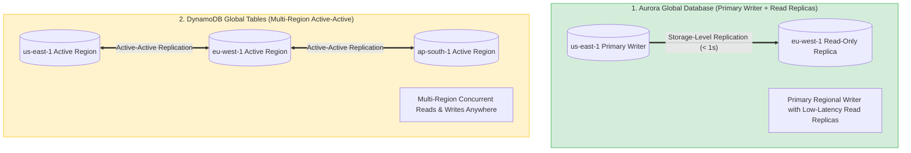

> [!IMPORTANT]
> **Exam Distinction**:
> - **Aurora Global Database**: Single-Region Primary Writer with low-latency cross-Region storage replication to read-only secondary Regions.
> - **DynamoDB Global Tables**: Multi-Region **Active-Active** multi-master replication allowing concurrent writes in any configured AWS Region.

---

## 5. Capacity & Cost Strategy: DynamoDB On-Demand vs. Provisioned

- **On-Demand Capacity**: Automatically scales request throughput up and down. Ideal for **unpredictable or spiky workloads**.
- **Provisioned Capacity**: Specify Read Capacity Units (RCUs) and Write Capacity Units (WCUs). Ideal for **predictable traffic** or when combined with Auto Scaling and Reserved Capacity.

---

## 6. Operational Overhead: Managed Purpose-Built vs. Self-Hosted EC2

> [!TIP]
> **Managed Service Rule**: Always prefer AWS managed database services over self-hosting databases on EC2 instances:
> - **Self-Hosted MySQL/PostgreSQL on EC2** $\longrightarrow$ **Amazon RDS / Amazon Aurora**
> - **Self-Hosted MongoDB on EC2** $\longrightarrow$ **Amazon DocumentDB**
> - **Self-Hosted Redis/Memcached on EC2** $\longrightarrow$ **Amazon ElastiCache**
> - **Self-Hosted Elasticsearch on EC2** $\longrightarrow$ **Amazon OpenSearch Service**

---

## 7. SAP-C02 Purpose-Built Database Master Decision Engine

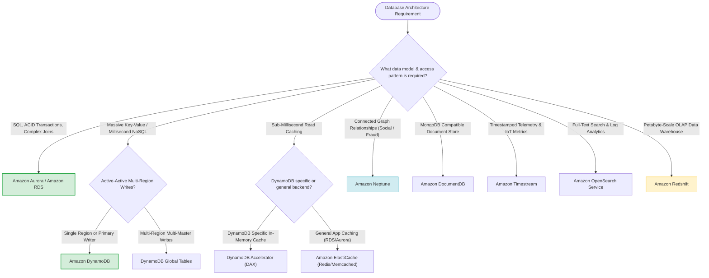

---

## 8. SAP-C02 Exam Keyword Cheat Sheet

```
"Relational / SQL / ACID transactions" ──> Amazon RDS / Amazon Aurora
"Massive scale key-value NoSQL"         ──> Amazon DynamoDB
"Multi-Region active-active writes"     ──> DynamoDB Global Tables
"Sub-millisecond DynamoDB read cache"   ──> DynamoDB Accelerator (DAX)
"General application session caching"   ──> Amazon ElastiCache (Redis / Memcached)
"Social graph / Fraud relationships"    ──> Amazon Neptune
"MongoDB-compatible JSON documents"     ──> Amazon DocumentDB
"IoT sensor telemetry / Timestamped"    ──> Amazon Timestream
"Complex OLAP analytics / Data Warehouse"──> Amazon Redshift
"Full-text search / Log analytics"      ──> Amazon OpenSearch Service
```

---

## 8.7 Real-World Exam Scenario 7: Multi-Region Active-Active Semi-Structured Web Portal (DynamoDB Global Tables On-Demand + ECS Fargate ASG + Route 53 Latency Routing vs. DocumentDB, S3 CRR & Aurora Traps)

- **Scenario**: A company wants to refactor its web portal where users perform read and write operations on semi-structured data. The service must respond to short but significant system load spikes and remain highly available and fault-tolerant in the event of an entire regional AWS failure. What architecture solution should be implemented?
- **Architecture Solution**:
  - Store semi-structured data in an **Amazon DynamoDB Global Table** replicated across two regions using **On-Demand Capacity Mode**.
  - Run the web service on an **Auto Scaling Amazon ECS Fargate cluster** behind an **Application Load Balancer (ALB)** in each region.
  - Create **Amazon Route 53 Alias records** pointing to each ALB using a **Latency Routing Policy with Health Checks** enabled.

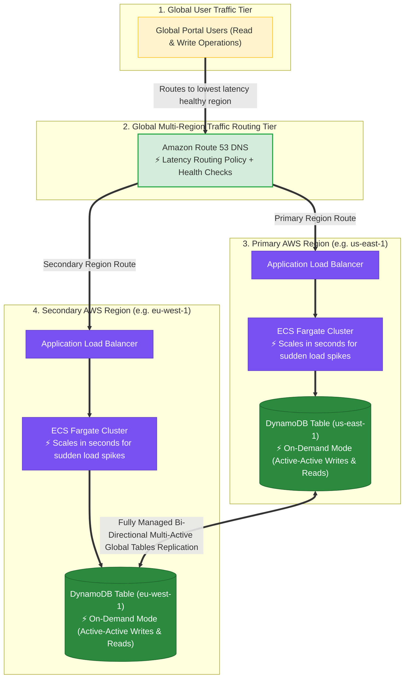

### Key Technical Rationale:
1. **DynamoDB Global Tables for Multi-Region Active-Active Writes**:
   - DynamoDB Global Tables provide fully managed, multi-active bi-directional replication across multiple AWS Regions, enabling low-latency read AND write operations locally in all regions with automatic failover.
2. **On-Demand Capacity Mode for Sudden Load Spikes**:
   - On-Demand mode instantly absorbs unpredictable, short-duration traffic spikes without pre-provisioning or waiting for auto-scaling capacity adjustments.
3. **ECS Fargate Containers for Rapid Compute Scaling**:
   - AWS Fargate container tasks launch in seconds, scaling compute capacity far faster during sudden traffic spikes than EC2 instances.
4. **Route 53 Latency Routing with Health Checks**:
   - Automatically directs global users to the healthiest AWS Region offering the lowest network latency. If a region fails, health checks automatically divert 100% of user traffic to the surviving region.

### Why Distractor Options Fail:
- *Amazon DocumentDB Global Clusters*:
  - **Single-Region Writes Only**: DocumentDB Global Clusters support single-region primary writes only; secondary regions are read-only replicas, failing multi-region active-active write requirements.
- *Amazon S3 Cross-Region Replication (CRR) + Failover Routing*:
  - **Not a Database & Asynchronous Delay**: S3 is an object store, not a semi-structured database engine. S3 CRR is asynchronous and can take up to 15 minutes to replicate, risking data loss on regional failover.
- *Amazon Aurora Global Database + EC2 Auto Scaling + Multi-Value Routing*:
  - **Single-Region Writes & Slow EC2 Booting**: Aurora Global Database supports writes in 1 primary region only. EC2 instances take minutes to provision, boot OS, and run User Data scripts (too slow for short load spikes). Multi-Value Routing returns random IPs rather than lowest-latency healthy region routing.

---

## 9. Common SAP-C02 Exam Traps


1. **Trap 1: Choosing DynamoDB for Time-Series Data**: While DynamoDB can store time-series data, **Amazon Timestream** is specifically optimized for automated time-based tiering and lifecycle retention.
2. **Trap 2: Selecting Redshift for OLTP Transactional Workloads**: Redshift is a columnar OLAP Data Warehouse. High-frequency OLTP writes will degrade performance. Use **Amazon Aurora / RDS**.
3. **Trap 3: Adding DAX for General Database Caching**: DAX is specifically integrated with DynamoDB APIs. For caching RDS, Aurora, or custom application backends, use **Amazon ElastiCache**.
4. **Trap 4: Installing Custom Database Engines on EC2**: Self-hosting databases on EC2 increases patching, backup, and failover management overhead. Always prefer AWS managed database services unless unsupported.

---

## 9.1 Real-World Exam Scenario: High-Scale B2C Mobile Application Stack

- **Scenario**: A fashion startup is launching a mobile app expecting viral traffic (millions of views). The app allows users to log in, view static fashion content, and upload photos of themselves wearing accessories with captions up to 100 characters. The architecture must automatically scale to handle millions of views and users.
- **Architecture Solution**:

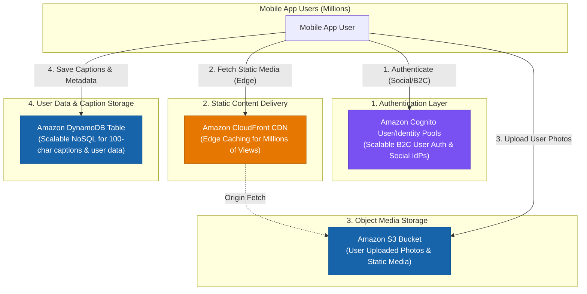

### Component Selection Rationale:
1. **Amazon Cognito**: Authenticates millions of public B2C mobile end-users with support for social identity providers (Google, Facebook, Amazon) and OAuth 2.0 / OIDC.
2. **Amazon DynamoDB**: Provides single-digit millisecond latency and seamless auto-scaling for simple unstructured key-value records (e.g., 100-character captions) without relational database connection overhead.
3. **Amazon S3**: Unlimited scalable object storage for raw photo uploads.
4. **Amazon CloudFront**: Global CDN edge locations distribute static assets to millions of concurrent viewers, preventing S3 origin hot-spotting and latency spikes.

### Why Distractor Options Fail:
- *RDS instead of DynamoDB*: RDS requires connection pooling and fixed provisioned instances; it is over-engineered and less auto-scalable for simple 100-character key-value metadata.
- *SAML 2.0 / On-Premises Active Directory*: SAML 2.0 and enterprise LDAP/AD are designed for internal corporate workforce federation, NOT public consumer mobile applications with millions of social media logins.
- *Direct S3 Distro without CloudFront*: S3 alone lacks edge-caching distribution needed to efficiently handle sudden surges of millions of global image views.

5. **Trap 5: Using Lambda@Edge for Heavy Application Frameworks**: Lambda@Edge is designed for lightweight CloudFront HTTP request/response manipulation at global edge locations; it is NOT intended for executing heavy backend application frameworks (e.g. Ruby on Rails data processing pipelines).

---

## 9.2 Real-World Exam Scenario: High-Scale Weather Simulation Engine (Amazon Aurora MySQL vs. RDS/EC2)

- **Scenario**: A weather modeling facility generates terabytes of simulation data stored in a MySQL 8.0 database (currently **16 TiB** and growing continuously). A Ruby on Rails app processes the data. The application requires $24\times7$ high availability, seamless database storage auto-scaling, and maximum cost-effectiveness.
- **Architecture Solution**:

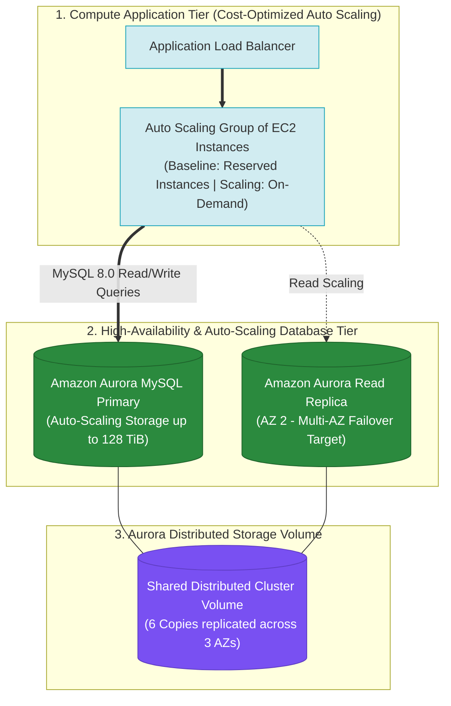

### Key Architectural Rationale:
1. **Amazon Aurora MySQL Storage Scaling**: Aurora's shared cluster storage volume automatically grows in 10 GB increments up to **128 TiB** per database cluster. It eliminates manual storage volume expansion, EBS resizing downtime, or storage allocation limits.
2. **Aurora Multi-AZ High Availability**: Creating an Aurora Read Replica in a second Availability Zone provides automated failover. If the primary instance fails, Aurora automatically promotes the read replica in under 30 seconds with zero data loss.
3. **Compute Tier Cost Optimization**: Running the web/app tier on an Auto Scaling Group of smaller EC2 instances behind an Application Load Balancer optimizes cost. Purchasing **Reserved Instances (RIs)** for baseline capacity and utilizing **On-Demand** for traffic spikes maximizes cost efficiency.

### Why Distractor Options Fail:
- *Lambda@Edge + RDS MySQL*: Lambda@Edge customizes HTTP responses at CloudFront edge locations; it cannot run full-stack Ruby on Rails simulation data processors. RDS MySQL requires managing storage limits or manual storage allocation, whereas Aurora storage auto-scales natively.
- *RDS MySQL with Manual Volume Adjustments*: Requiring manual storage volume expansion risks database downtime and outages when simulations fill disk space unexpectedly.
- *Self-Hosted MySQL on EC2 with LVM*: Hosting MySQL on EC2 with Logical Volume Manager (LVM) and multiple EBS volumes requires massive manual management overhead for backups, volume striping, and failover scripts.

---

## 9.3 Real-World Exam Scenario: Global Multi-Region Mobile Marketplace Database Architecture (DynamoDB Global Tables)

- **Scenario**: A tech startup launches a global mobile marketplace using AWS Amplify. Backend APIs operate in multiple AWS Regions (North America, South America, Europe, Asia) to process sales and financial transactions close to users. Transactions in any region must automatically replicate across all other regions. The team rejected Amazon Keyspaces due to high cross-region management overhead. What is the most scalable, cost-effective, and highly available solution with the least operational effort?
- **Architecture Solution**:
  - Create a **Global Amazon DynamoDB Table** with replica tables in each required AWS region.
  - In each local region, write individual transactions to the local DynamoDB replica table. Changes automatically replicate across all global replica tables.

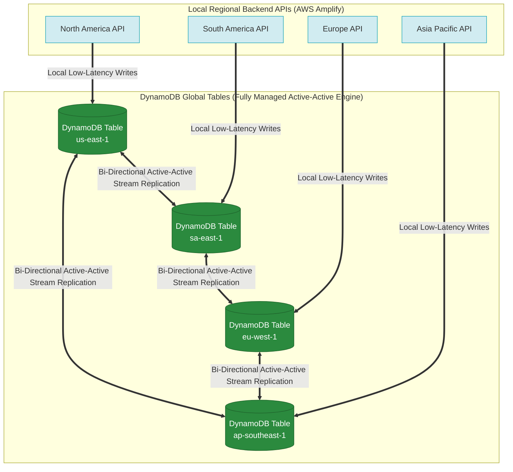

### Key Technical Rationale:
1. **Fully Managed Active-Active Multi-Master Replication**: **DynamoDB Global Tables** build upon DynamoDB Streams to automatically replicate data changes across designated AWS Regions with single-digit millisecond latency and zero operational management overhead.
2. **Local Low Latency**: Clients in North America, South America, Europe, and Asia write to their local regional DynamoDB table with low latency, and DynamoDB asynchronously propagates changes globally.
3. **Automatic Conflict Resolution**: DynamoDB Global Tables natively resolve update conflicts across regions using a last-writer-wins mechanism, eliminating the need to write custom replication logic.

### Why Distractor Options Fail:
- *Custom AWS Lambda Function + DynamoDB Streams Replay*: Writing a custom Lambda function to poll streams and manually replay writes across multiple regions is unscalable, introduces severe bottleneck risks under millions of transactions, and requires massive custom code and error-handling maintenance.
- *Amazon S3 Buckets + Cross-Region Replication (CRR)*: Amazon S3 is an object storage service, NOT a transactional relational or NoSQL database. S3 lacks query indexes, transaction locks, and atomic operations required for financial transactions.
- *AWS Control Tower + Amazon Connect*: Amazon Connect is a cloud contact center (call center) service; AWS Control Tower governs multi-account landing zones. Neither manages database replication.

---

## 9.4 Real-World Exam Scenario: Global Print Media Archive Search (S3 + CloudFront + Amazon Textract + OpenSearch)

- **Scenario**: A print media company hosts a popular web application allowing global users to search its back catalog of scanned newspaper PNG images. The legacy commercial OCR software license is expiring. The company wants to migrate to AWS with a highly available, durable, and scalable architecture to extract text from newspaper images and provide fast global search capabilities. What is the optimal architecture?
- **Architecture Solution**:
  1. Store scanned newspaper image files in an **Amazon S3 bucket** and deliver them globally via an **Amazon CloudFront** web distribution.
  2. Host the web application on **AWS Elastic Beanstalk** across multiple Availability Zones.
  3. Deploy **Amazon OpenSearch Service** to handle full-text search indexing and query processing for the website.
  4. Use **Amazon Textract** to automatically detect and extract text from the scanned newspaper images (replacing the legacy OCR software).

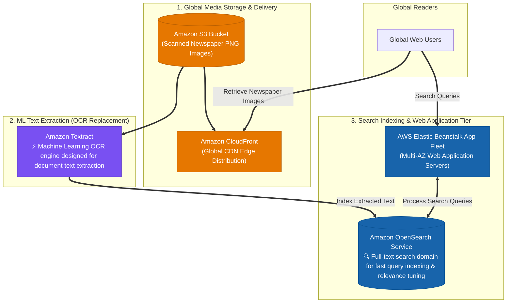

### Key Technical Rationale:
1. **Amazon Textract for Document OCR**: **Amazon Textract** is a specialized ML service designed specifically to extract typed and handwritten text, forms, and tables from scanned documents and newsprint. It eliminates commercial OCR software licensing costs and operational server management.
2. **Amazon OpenSearch Service for Query Processing**: **Amazon OpenSearch Service** provides fully managed, scalable full-text search capabilities, handling query indexing, relevance scoring, and low-latency search execution across millions of document pages.
3. **Amazon S3 + CloudFront Global Delivery**: Storing images in S3 provides 99.999999999% (11 9s) durability, while CloudFront caches PNG images at global edge locations for rapid low-latency retrieval.

### Why Distractor Options Fail:
- *Using Amazon Rekognition instead of Amazon Textract*: Amazon Rekognition is designed for image object/face recognition and basic scene text (e.g. license plates, signs), NOT dense document OCR! **Amazon Textract** is the dedicated service for document and newspaper text extraction.
- *Using Amazon Kendra + Athena + S3 Glacier*: **Amazon Kendra cannot OCR raw PNG image files directly** (it requires pre-extracted text). Setting up lifecycle policies to move images to S3 Glacier introduces retrieval delays (hours) unacceptable for public web browsing. Amazon Athena cannot query binary PNG image files.
- *Storing images on EBS volumes with DLM*: Amazon EBS volumes are single-AZ block storage devices; they are not scalable or durable global object storage compared to Amazon S3 + CloudFront.

---

## 9.5 Real-World Exam Scenario 5: High-Scale Smartwatch Telemetry & 120-Day Retention (DynamoDB + TTL)

- **Scenario**: A tech company ingests millions of telemetry records per minute globally from smartwatches (< 4KB per record). Data must be stored durably with low-latency retrieval times for 120 days, after which it must be automatically deleted. The annual storage volume is 10-15 TB. What is the **MOST cost-effective and scalable storage solution**?
- **Architecture Solution**:
  - Configure the application to ingest records into an **Amazon DynamoDB table** with Auto Scaling (or On-Demand mode). Enable **DynamoDB Time to Live (TTL)** on a Unix epoch timestamp attribute to delete records automatically after 120 days.

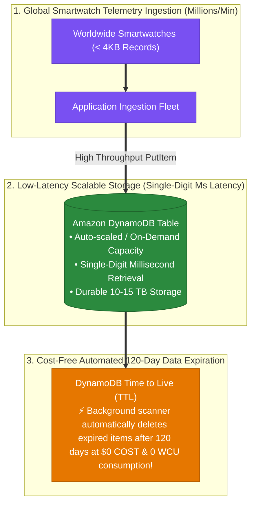

### Key Technical Rationale:
1. **Single-Digit Millisecond Latency for Millions of Records**: **Amazon DynamoDB** scales seamlessly to millions of requests per minute for small key-value records (< 4KB) while maintaining predictable single-digit millisecond query performance.
2. **Zero-Cost Data Purging via DynamoDB TTL**: DynamoDB Time to Live (TTL) uses an internal background thread to continuously evaluate item timestamps and purge expired items **at zero extra cost without consuming any Read or Write Capacity Units (RCUs/WCUs)**.
3. **Eliminates Manual SQL Purge Locks**: Avoids database performance degradation caused by running heavy SQL `DELETE` queries across millions of rows.

### Why Distractor Options Fail:
- *Amazon Aurora Serverless + Nightly Lambda DELETE Queries*: Continuous 24/7 ingestion of millions of records per minute prevents Aurora Serverless from ever scaling down to 0 ACUs, incurring high continuous database compute costs. Furthermore, running `DELETE` queries on millions of rows in MySQL/PostgreSQL consumes high I/O, locks tables, and generates huge WAL/transaction logs.
- *Amazon Managed Streaming for Apache Kafka (MSK) + S3*: MSK is a streaming ingestion pipeline; it is NOT optimized for low-latency random key-value item lookups. Dumping stream data to S3 lacks single-digit millisecond query performance.
- *Individual S3 Objects per Record (<4KB) + S3 Lifecycle*: Storing millions of individual <4KB objects directly in S3 creates astronomical S3 `PUT` request costs ($0.005 per 1,000 requests = thousands of dollars per day at millions of records per minute) and causes high latency for random key lookups.

---

## 9.6 Real-World Exam Scenario 6: 50 TB Scanned Document Storage & Full-Text Search (S3 + OpenSearch + Elastic Beanstalk)

- **Scenario**: An international humanitarian organization needs to store 20 TB (growing to 50 TB) of scanned relief files. They require a website with a search feature to easily search and query through thousands of scanned files. The system will run for > 3 years. What is the **MOST cost-effective option** for implementing the storage and search feature?
- **Architecture Solution**:
  - Store and serve the scanned files out of an **Amazon S3 bucket** (Standard storage).
  - Deploy **Amazon OpenSearch Service** for query processing and full-text search indexing across document metadata.
  - Use **AWS Elastic Beanstalk** to host the website across multiple Availability Zones with high availability and low operational overhead.

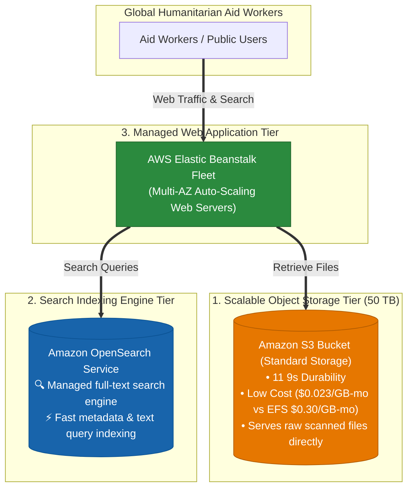

### Key Technical Rationale:
1. **Amazon S3 Standard Storage Cost Efficiency**: Amazon S3 is the most durable (11 9s) and cost-effective object storage service for petabyte-scale files ($0.023/GB-month vs. $0.30/GB-month for Amazon EFS).
2. **Amazon OpenSearch Service for Full-Text Search**: Amazon S3 native search (prefix listings / S3 Select) lacks full-text index capabilities, fuzzy search, and relevance ranking. **Amazon OpenSearch Service** provides a dedicated, highly scalable full-text search engine to query document metadata.
3. **AWS Elastic Beanstalk for Web Hosting**: Reduces operational overhead by automatically handling deployment, capacity provisioning, load balancing, and auto-scaling across multiple AZs.

### Why Distractor Options Fail:
- *Amazon EFS + 3rd-Party Search Software on On-Demand EC2*:
  - Amazon EFS storage is ~13x more expensive for 50 TB than Amazon S3.
  - Running On-Demand EC2 instances for 3+ years violates cost optimization (Reserved Instances/Savings Plans should be used for 3-year commitments).
  - Purchasing 3rd-party search software introduces unnecessary licensing fees compared to managed Amazon OpenSearch Service.
- *Relying on Native S3 Search Capabilities Alone*:
  - Amazon S3 does NOT possess built-in full-text search indexing engines. S3 Select only filters CSV/JSON/Parquet files by column, and list operations cannot perform full-text relevance queries.
- *EBS RAID Volumes on EC2 NGINX*:
  - EBS RAID arrays for 50 TB introduce high block storage costs, lack 11 9s cross-AZ durability, and require heavy manual administration for disk replacement and scaling compared to Amazon S3.

---

## 9.7 Real-World Exam Scenario 7: Oracle RAC Migration to EC2 (DLM Snapshots + SSM Patch Manager vs. RDS Trap)

- **Scenario**: A company wants to migrate an on-premises **Oracle Real Application Clusters (RAC)** database to AWS. The CISO requires automating the OS patch management process and setting up scheduled backups for disaster recovery with the **least amount of effort**. What is the optimal solution?
- **Architecture Solution**:
  - Migrate the database to a cluster of **EBS-backed Amazon EC2 instances** across multiple Availability Zones.
  - Automate the creation of EBS snapshots from EBS volumes using **Amazon Data Lifecycle Manager (DLM)**.
  - Install the **SSM Agent** on the EC2 instances and automate the OS patch management process using **AWS Systems Manager Patch Manager**.

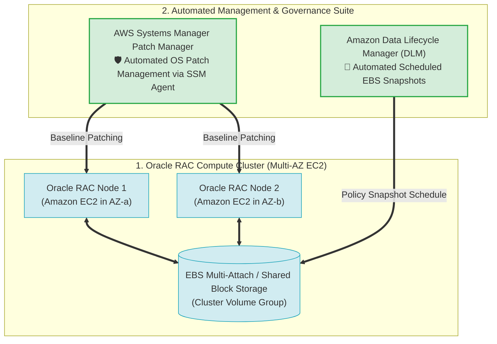

### Key Technical Rationale:
1. **Oracle RAC Unsupported on Managed Database Engines**: **Amazon RDS (including RDS for Oracle) DOES NOT support Oracle Real Application Clusters (RAC)**! Oracle RAC requires direct OS cluster node control, low-level interconnects, and shared block storage management, which RDS masks. Therefore, Oracle RAC MUST be deployed on **Amazon EC2 instances**.
2. **Amazon Data Lifecycle Manager (DLM) for Backup Automation**: DLM automates the creation, retention, and deletion of EBS volume snapshots according to defined schedules, eliminating manual snapshot scripts.
3. **AWS Systems Manager Patch Manager for OS Patching**: Installing the SSM Agent allows Patch Manager to scan and apply security updates across Linux/Windows operating systems automatically.

### Why Distractor Options Fail:
- *Migrate to Amazon RDS for Oracle RAC (Your Selection)*:
  - **Amazon RDS does NOT support Oracle RAC**! Choosing RDS for Oracle RAC fails because RDS only supports single-instance Oracle with Multi-AZ Standby failover, not multi-node active-active RAC clusters.
- *Migrate to Amazon Aurora RAC*:
  - **Amazon Aurora does NOT support Oracle database engines** (Aurora supports MySQL and PostgreSQL only). There is no "Aurora RAC" engine.
- *Lambda for Snapshots + CodeDeploy/CodePipeline for OS Patching*:
  - **AWS CodePipeline and CodeDeploy are CI/CD application software deployment services**; they are NOT designed for operating system patch management. **AWS Systems Manager Patch Manager** is the native AWS service for OS patching.

---

## 9.8 Real-World Exam Scenario: High-Availability 24/7 Oracle Migration (RDS Multi-AZ vs. Read Replicas, RMAN & Oracle RAC Traps)

- **Scenario**: A popular news website migrating an on-premises Oracle database to AWS requires 24/7 database availability for write transactions (content writers upload breaking news articles continuously, including early morning hours). The company tracks Oracle BYOL licenses using AWS License Manager. How should the Solutions Architect implement a highly available architecture for the Oracle database?
- **Architecture Solution**:
  - Create an **Oracle database instance in Amazon RDS with Multi-AZ deployments**.

```mermaid
flowchart TD
    subgraph AppTier ["1. News Portal & Content Writers Tier"]
        Writers["Content Writers & Web Application<br/>(Uploading Breaking News 24/7)"]
    end

    subgraph DatabaseTier ["2. High-Availability Amazon RDS for Oracle Tier"]
        RDS_Primary[("Amazon RDS for Oracle Primary DB<br/>(Active Instance in AZ-1)")]
        RDS_Standby[("Amazon RDS Multi-AZ Standby DB<br/>🛡️ Passive Synchronous Replica in AZ-2")]

        RDS_Primary <==|"Synchronous Block Replication & Auto-Failover (<60s)"==> RDS_Standby
    end

    subgraph LicenseGov ["3. License Management & Governance"]
        LicMgr["AWS License Manager<br/>📜 Tracks Oracle BYOL Licenses on AWS"]
    end

    Writers ==>|"Writes & Primary Queries"| RDS_Primary
    RDS_Primary -.->|"Tracks License Usage"| LicMgr

    classDef app fill:#d1ecf1,stroke:#17a2b8,stroke-width:1px;
    classDef db fill:#2b8a3e,stroke:#1e632b,color:#ffffff;
    classDef gov fill:#7950f2,stroke:#5f3dc4,color:#ffffff;

    class Writers app;
    class RDS_Primary,RDS_Standby db;
    class LicMgr gov;
```

### Key Technical Rationale:
1. **Amazon RDS Multi-AZ for 24/7 Write Availability**:
   - RDS Multi-AZ automatically provisions a synchronous passive standby instance in another AZ. If an AZ outage or hardware failure crashes the primary Oracle DB instance, RDS performs automated DNS failover in < 60 seconds, allowing content writers to continue posting articles without manual intervention or application endpoint modifications.
2. **Oracle BYOL Tracking via AWS License Manager**:
   - **AWS License Manager** integrates with Amazon RDS for Oracle to track software license compliance and core counts for Bring Your Own License (BYOL) deployments.

### Why Distractor Options Fail:
- *Creating Oracle Real Application Clusters (RAC) in Amazon RDS*:
  - **CRITICAL AWS RDS INCOMPATIBILITY RULE**: **Oracle Real Application Clusters (RAC) is NOT SUPPORTED on Amazon RDS** (or Aurora)! Oracle RAC requires shared block storage and multicast cluster networking, which RDS masks. (If Oracle RAC is strictly required, it MUST be deployed on **Amazon EC2 instances** across AZs).
- *Using Oracle Recovery Manager (RMAN) for High Availability*:
  - RMAN is an Oracle database backup/recovery utility; it does **NOT** provide real-time automated failover for write transactions during database server failures. RDS manages backups natively via automated snapshots.
- *Creating Oracle RDS Read Replicas for Write High Availability*:
  - RDS Read Replicas offload read-heavy query traffic asynchronously, but do **NOT** accept write transactions (like content writers uploading new articles) when the primary database crashes, unless manually promoted.

---

## 9.9 Real-World Exam Scenario 9.9: Zero-Code-Modification MongoDB & Java Migration (Multi-AZ EC2 ASG + Multi-AZ Amazon DocumentDB vs. Aurora, DynamoDB & Single-AZ Traps)

- **Scenario**: An organization is migrating an on-premises web application comprising a Java backend and a NoSQL MongoDB database to AWS. Due to constraints, the application **cannot be modified** during the migration process and must maintain an architecture similar to the on-premises setup. High availability is required for both backend and database tiers. Which solution meets these requirements while adhering to all constraints?
- **Architecture Solution**:
  - Deploy the Java application on **Amazon EC2 instances within an Auto Scaling group (ASG) spanning multiple Availability Zones**.
  - Migrate the MongoDB database to **Amazon DocumentDB (with MongoDB compatibility) deployed across multiple Availability Zones**.

```mermaid
flowchart TD
    subgraph WebClients ["1. External Client Access Tier"]
        Users["Web Application Users"]
    end

    subgraph ComputeTier ["2. Multi-AZ Java Application Tier (Unchanged Code)"]
        ALB["Application Load Balancer (ALB)"]
        subgraph ASG ["Auto Scaling Group (Multi-AZ)"]
            EC2_AZ1["EC2 Instance (Java App in AZ-1)"]
            EC2_AZ2["EC2 Instance (Java App in AZ-2)"]
        end
        Users ==> ALB ==> EC2_AZ1 & EC2_AZ2
    end

    subgraph DatabaseTier ["3. Multi-AZ MongoDB Compatible Storage Tier"]
        DocDB_Primary[("Amazon DocumentDB Primary Node<br/>🍃 MongoDB API & JSON Compatible<br/>(AZ-1 Active Writer)")]
        DocDB_Replica[("Amazon DocumentDB Replica Node<br/>🛡️ Automated Multi-AZ Failover<br/>(AZ-2 / AZ-3 Passive Replica)")]

        EC2_AZ1 & EC2_AZ2 ==>|"MongoDB Drivers & JSON Queries (Zero Code Changes)"| DocDB_Primary
        DocDB_Primary <==|"Storage-Level Continuous Replication"==> DocDB_Replica
    end

    classDef client fill:#fff3cd,stroke:#ffc107,stroke-width:1px;
    classDef compute fill:#d1ecf1,stroke:#17a2b8,stroke-width:1px;
    classDef db fill:#2b8a3e,stroke:#1e632b,color:#ffffff;

    class Users client;
    class ALB,EC2_AZ1,EC2_AZ2 compute;
    class DocDB_Primary,DocDB_Replica db;
```

### Key Technical Rationale:
1. **Amazon DocumentDB for Zero Application Modification**:
   - Amazon DocumentDB (with MongoDB compatibility) natively supports MongoDB JSON storage formats, query APIs, and standard MongoDB database drivers.
   - Migrating from on-premises MongoDB to DocumentDB requires **zero application code or driver changes**, fulfilling the strict migration constraint.
2. **Multi-AZ Architecture for High Availability**:
   - Deploying EC2 instances across an Auto Scaling Group in multiple AZs ensures compute redundancy.
   - DocumentDB replicates data across 3 Availability Zones by default and automatically promotes a read replica to primary if an AZ outage occurs.

### Why Distractor Options Fail:
- *Migrating MongoDB to Amazon Aurora*:
  - **Relational vs. NoSQL Incompatibility**: Amazon Aurora is a relational SQL database (MySQL/PostgreSQL). Migrating MongoDB to Aurora requires completely rewriting database drivers, table schemas, and queries, violating the zero-code-modification constraint!
- *Migrating MongoDB to Amazon DynamoDB + EKS Containerization*:
  - **API & Query Driver Rewrite**: Amazon DynamoDB uses a distinct key-value API and AWS SDK, requiring significant code rewrites. Containerizing with App2Container and deploying to EKS also alters the compute architecture significantly.
- *Deploying DocumentDB in a Single Availability Zone*:
  - **High Availability Failure**: Single-AZ DocumentDB introduces a Single Point of Failure (SPOF), failing the explicit requirement for high availability across the database tier.

---

## 8.4 Real-World Exam Scenario 4: Large Digital Asset Storage & Full-Text Search Engine (AWS CloudFormation + S3 + OpenSearch + EC2 vs. CodeDeploy, RDS & Kinesis Traps)

- **Scenario**: A national library plans to store approximately 50 TB of digital books, articles, and written materials in AWS. The system requires a full-text search feature allowing users to search the library's collection on a dynamic website. All infrastructure resources must be deployed declaratively using an automated AWS deployment service. What is the most suitable architecture?
- **Architecture Solution**:
  - Utilize **AWS CloudFormation** as the infrastructure deployment service.
  - Deploy an **Amazon S3 bucket** for cost-effective 50 TB document storage.
  - Deploy **Amazon OpenSearch Service** to provide full-text indexing and search capabilities.
  - Deploy **Amazon EC2 instances** to host the dynamic website application.

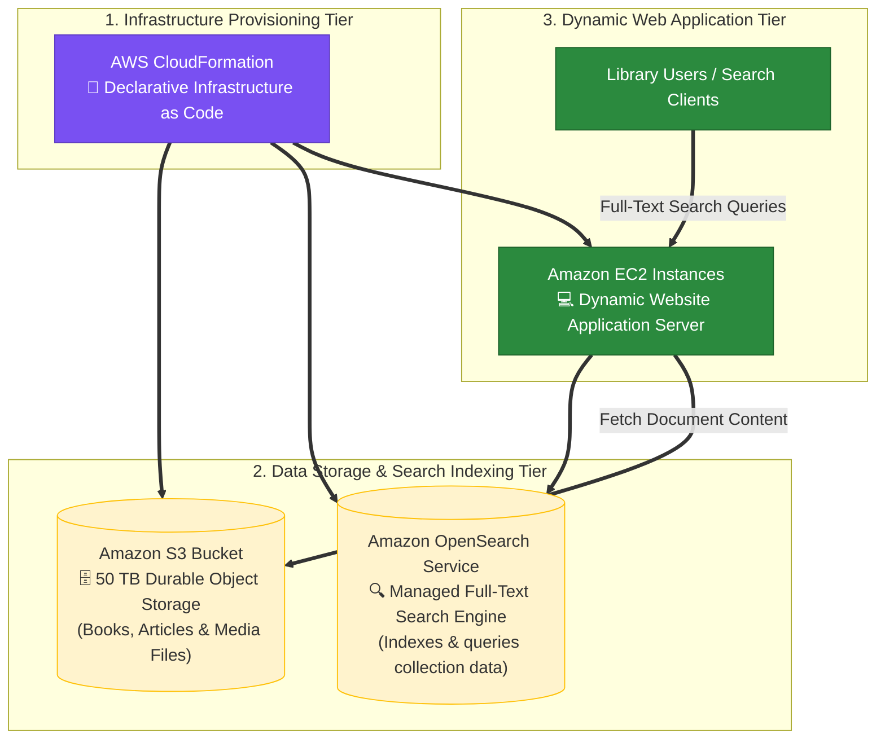

### Key Technical Rationale:
1. **AWS CloudFormation for IaC Stack Deployment**:
   - CloudFormation is the native Infrastructure as Code (IaC) service used to declaratively provision AWS resource stacks (S3, OpenSearch, EC2) automatically across environments.
2. **Amazon S3 for Large Asset Storage (50 TB)**:
   - Amazon S3 is the most durable and cost-effective object storage service for storing massive datasets (50 TB of digital books and articles).
3. **Amazon OpenSearch Service for Full-Text Search**:
   - OpenSearch is purpose-built for high-performance interactive search, indexing, faceting, and filtering over large unstructured datasets.
4. **Amazon EC2 for Dynamic Web Application Compute**:
   - EC2 provides scalable compute to host dynamic application logic that interfaces between users, OpenSearch, and S3.

### Why Distractor Options Fail:
- *Amazon CodeDeploy + 2 S3 Buckets + "S3 Native Search"*:
  - **Service Misuse & Missing Search Engine**: CodeDeploy deploys application code packages onto compute hosts (EC2/Lambda/ECS)—it **cannot** provision infrastructure resources like S3 buckets. S3 static website hosting cannot run dynamic web server logic, and S3 lacks built-in full-text indexing/search engines for collection lookups.
- *AWS Elastic Beanstalk + Multi-AZ Amazon RDS for 50 TB Storage*:
  - **Cost & Database Mismatch**: Storing 50 TB of raw books and unstructured documents inside relational RDS database tables is cost-prohibitive and lacks native full-text indexing capabilities compared to OpenSearch + S3.
- *AWS CodePipeline + Amazon Kinesis for Storage*:
  - **Wrong Tools**: CodePipeline orchestrates CI/CD release workflow stages; it does not deploy AWS infrastructure stacks directly. Kinesis Data Streams is an ephemeral real-time stream buffer (24h to 365d retention), NOT a long-term data storage service.

---

## 8.5 Real-World Exam Scenario 5: Automated DynamoDB Table Modification Verification (DynamoDB Streams + AWS Lambda vs. DocumentDB Migration, SNS & SSM Traps)

- **Scenario**: A financial company runs an application in an Amazon ECS cluster to process intraday market data and store generated results in an Amazon DynamoDB table. To comply with financial regulatory policies, the Solutions Architect must design a system that automatically detects new entries added to the DynamoDB table and runs automated verification tests using an AWS Lambda function with **MINIMAL CONFIGURATION CHANGES**. What is the recommended solution?
- **Architecture Solution**:
  - Enable **DynamoDB Streams** on the Amazon DynamoDB table.
  - Configure an **AWS Lambda function** with an Event Source Mapping attached to the DynamoDB Stream ARN to automatically trigger verification tests whenever new item stream records are detected.

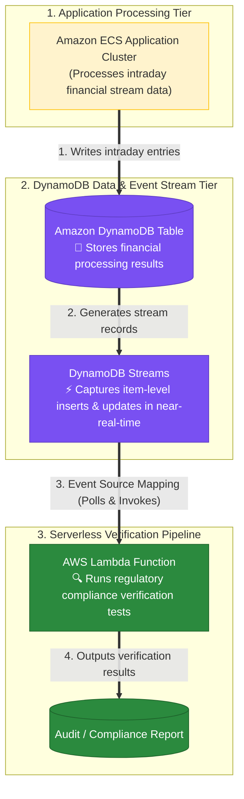

### Key Technical Rationale:
1. **DynamoDB Streams for Native Event Capture**:
   - DynamoDB Streams captures time-ordered sequences of item-level modifications (inserts, updates, deletes) in a DynamoDB table with near-zero latency.
2. **AWS Lambda Event Source Mapping for Minimal Configuration**:
   - AWS Lambda natively integrates with DynamoDB Streams via Event Source Mapping. Lambda automatically polls the stream and invokes the function when new stream records appear, fulfilling the requirement for **minimal configuration changes** without altering ECS application code.

### Why Distractor Options Fail:
- *Migrating Table to Amazon DocumentDB for EventBridge Integration*:
  - **Excessive Refactoring Effort**: Migrating from key-value DynamoDB to Amazon DocumentDB (MongoDB API) requires rewriting database schemas, application drivers, and container code, violating the explicit requirement for *minimal configuration changes*.
- *Using Amazon SNS Triggers from ECS Cluster*:
  - **Unnecessary Architectural Complexity**: Creating an SNS topic and modifying ECS code to publish notifications adds extra code dependencies and fails to monitor the actual database table state natively.
- *Detecting New Entries using Systems Manager (SSM) Automation*:
  - **Service Misuse**: Systems Manager Automation manages EC2 instance maintenance runbooks and OS patches—it **cannot** monitor item-level database insertions inside a DynamoDB table.

---

## 8.6 Real-World Exam Scenario 6: Automated Scanned Form OCR & NLP Entity Extraction (Step Functions + Lambda + Textract + Comprehend vs. Rekognition, EKS Open-Source OCR & SageMaker Traps)

- **Scenario**: A company hosts a web application on EC2 instances connected to an RDS PostgreSQL database and an Amazon S3 bucket for storing user-uploaded scanned forms. When a form is uploaded, an SNS notification alerts team members who log in, manually extract text data from the scanned forms, and submit it to an external system via an API. Management wants to automate this process to reduce human effort, increase processing efficiency, and maintain high accuracy. What solution should be implemented?
- **Architecture Solution**:
  - Add a serverless orchestration tier using **AWS Step Functions and AWS Lambda** to manage processing stages.
  - Use **Amazon Textract** to perform Optical Character Recognition (OCR) and extract text, form fields, and tables from scanned documents.
  - Use **Amazon Comprehend** to parse extracted text for entities, key phrases, and insights using Natural Language Processing (NLP).
  - Store the structured output in an **Amazon S3 bucket**, updating the application to read output objects and transmit data to the external API.

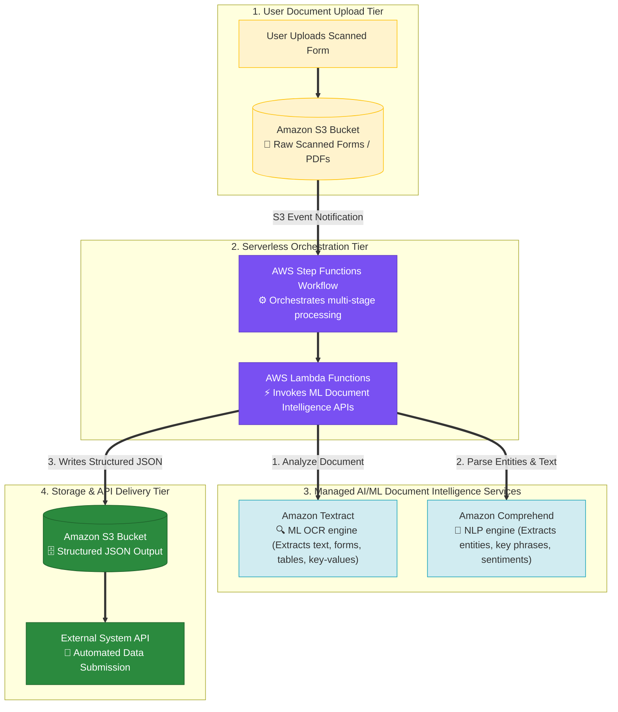

### Key Technical Rationale:
1. **Amazon Textract for Managed ML Document OCR**:
   - **Amazon Textract** goes beyond basic OCR software by using pre-trained machine learning models to automatically identify, understand, and extract printed/handwritten text, key-value pairs, and tables from scanned PDF and image forms without custom ML model training.
2. **Amazon Comprehend for Natural Language Processing (NLP)**:
   - **Amazon Comprehend** analyzes extracted document text using NLP to identify entities (names, dates, addresses), key phrases, and sentiments for downstream processing.
3. **AWS Step Functions + Lambda Serverless Orchestration**:
   - Step Functions coordinates the multi-step pipeline (Textract extraction $\rightarrow$ Comprehend NLP enrichment $\rightarrow$ S3 delivery) serverlessly with zero host infrastructure overhead.

### Why Distractor Options Fail:
- *Amazon Rekognition + Amazon Transcribe*:
  - **Service Purpose Mismatch**: **Amazon Rekognition** performs computer vision object/face detection in photos and videos; **Amazon Transcribe** converts audio speech to text. Neither service performs document OCR, form key-value extraction, or NLP text parsing!
- *Deploying Open-Source OCR Software on Amazon EKS*:
  - **High Operational Overhead**: Provisioning Kubernetes clusters (EKS), managing container OS patches, and writing custom scaling logic introduces heavy operational friction compared to managed serverless AI services (Textract + Comprehend).
- *Training a Custom ML Model on Amazon SageMaker for OCR*:
  - **Unnecessary Heavy Lifting**: Building, annotating data for, training, and hosting a custom ML model on SageMaker for document OCR requires months of data science effort and infrastructure maintenance when **Amazon Textract** is pre-trained for form OCR out of the box.

---

## 9.12 Real-World Exam Scenario 12: EMR Cost-Effective Node Purchasing Strategy for Short-Term Jobs (On-Demand Master & Core Nodes + Spot Task Nodes vs. Reserved Instance & Spot Master Traps)

- **Scenario**: An analytics company runs a 48-hour one-time performance testing job on an Amazon EMR cluster (ingesting 20 TB of data with 30 EC2 instances). What is the most cost-effective EC2 instance purchasing strategy for Master, Core, and Task nodes without sacrificing data integrity or cluster stability?
- **Architecture Solution**:
  - Use **On-Demand EC2 instances** for both **Master** and **Core** nodes.
  - Use **Spot EC2 instances** for **Task** nodes.

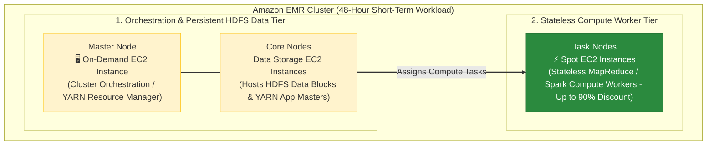

### Key Technical Rationale:
1. **Master & Core Nodes on On-Demand Instances**:
   - **Master Node**: Manages the cluster (YARN Resource Manager / NameNode). If the Master node fails or is reclaimed, the entire cluster immediately crashes.
   - **Core Nodes**: Store persistent data in the Hadoop Distributed File System (HDFS) and run YARN Application Masters. If Core nodes are reclaimed, HDFS data loss occurs.
   - Using **On-Demand instances** for Master and Core nodes guarantees 100% availability without risk of Spot reclamation.
2. **Task Nodes on Spot Instances**:
   - **Task Nodes**: Perform pure compute (Hadoop MapReduce / Spark) and do **NOT** store HDFS data. If a Spot Task node is reclaimed, EMR automatically reschedules its tasks on remaining nodes without data loss. Using Spot instances slashes compute costs by up to 90%.
3. **No Reserved Instances for Short-Term Jobs**:
   - Reserved Instances (RIs) require a **1-year or 3-year commitment**. Purchasing RIs for a 48-hour short-term test is completely wasteful.

### Why Distractor Options Fail:
- *Using Reserved EC2 Instances for Master or Core Nodes*:
  - **1-Year Contract Waste**: Reserved Instances require a minimum 1-year contract. Using RIs for a 48-hour one-time job incurs massive unnecessary long-term cost.
- *Using Spot Instances for Master or Core Nodes*:
  - **Cluster Crash & Data Loss**: Spot reclamation on Master or Core nodes crashes the EMR cluster and risks HDFS data corruption.
- *Using On-Demand Instances for Task Nodes (Your Selection)*:
  - **Excessive Cost**: Task nodes are stateless and hold no HDFS data. Running Task nodes on On-Demand instances wastes money when Spot instances can process workloads at up to 90% discount.

---

## 9.13 Real-World Exam Scenario 13: Amazon Aurora Primary (Writer/Master) Node Scaling Restrictions vs. Read Replica Auto Scaling & Serverless v2

- **Key Architectural Rule**: In a provisioned Amazon Aurora cluster, **you CANNOT configure Auto Scaling for the primary master (writer) database node**. Aurora Auto Scaling only scales the number of Aurora Read Replicas (readers).
- **Architecture Solution & Scaling Mechanics**:
  - **Scaling Provisioned Primary Master (Writer) Nodes**: To scale compute capacity on a provisioned Aurora primary master writer node, you must **manually modify/resize the instance class size** (vertical instance scaling).
  - **Scaling Read Replicas (Readers)**: Use **Aurora Auto Scaling** (Application Auto Scaling) to automatically add or remove Aurora Read Replicas (up to 15 replicas) dynamically based on CPU utilization or connection metrics.
  - **Automated Writer & Reader Scaling**: To scale compute capacity on both primary writer and reader nodes automatically without manual instance resizing, deploy or migrate to **Amazon Aurora Serverless v2** (scales Aurora Capacity Units [ACUs] dynamically).

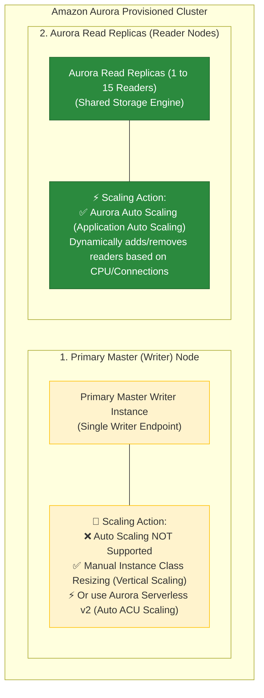

### Key Technical Rationale:
1. **Primary Master Node Auto Scaling Prohibition**:
   - In standard provisioned Aurora clusters, there is only one primary writer node per cluster. AWS **does not support Auto Scaling for the primary master node**. You cannot set Auto Scaling rules to add multiple master nodes or auto-change the master instance class size in a provisioned cluster.
2. **Manual Resizing vs. Aurora Serverless v2**:
   - To handle increased write transactions or CPU bottlenecks on a provisioned primary writer node, database administrators must **manually modify the instance class size** of the master instance.
   - For applications requiring seamless, automated compute scaling for the writer instance without manual instance resizing, use **Aurora Serverless v2**.

### Common Exam Traps:
- *Attempting to set Auto Scaling for the Aurora Master/Writer DB Instance*:
  - **Invalid Configuration**: Auto Scaling cannot be attached to the primary master instance. Auto Scaling in Aurora applies **ONLY to Read Replicas**.
- *Assuming Read Replica Auto Scaling Increases Write Performance*:
  - **Architecture Misunderstanding**: Adding Aurora Read Replicas via Auto Scaling offloads read traffic (`SELECT` queries), but does **NOT** increase write capacity on the primary master node.

---

## 9.14 Real-World Exam Scenario 14: Dynamic JSON Streaming Ingestion & Real-Time Visualization (Amazon Data Firehose + Lambda Transformation + Amazon OpenSearch Service & OpenSearch Dashboards vs. Kinesis Data Streams & Relational DB Traps)

- **Scenario**: An adventure company runs an on-premises PostgreSQL database storing monitoring events that cannot scale to handle high-frequency write events. Management needs a hybrid solution using an existing VPN connection to AWS to ingest events with minimal operational overhead. The solution requires an auto-scaling buffer, support for dynamic schemas and semi-structured JSON data, and a near real-time visualization tool for dashboards. Which TWO options should the solutions architect implement? (Select TWO)
- **Architecture Solution**:
  - Ingest the events using **Amazon Data Firehose** and write an **AWS Lambda function** to process and transform the buffered events.
  - Create an **Amazon OpenSearch Service domain** to ingest and index the events, and leverage **OpenSearch Dashboards** to build near real-time dashboards and visualizations.

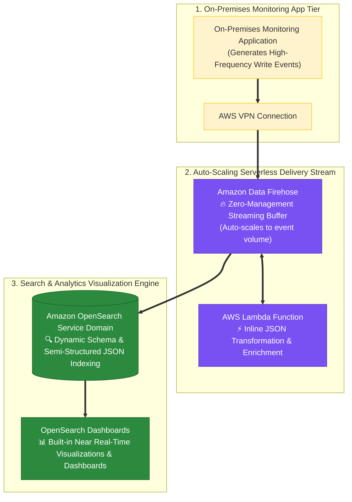

### Key Technical Rationale:
1. **Amazon Data Firehose for Zero-Overhead Streaming Buffering**:
   - **Amazon Data Firehose** is a fully managed, serverless delivery stream that automatically buffers and scales dynamically without shard management. It natively supports inline data transformation via **AWS Lambda** and streams directly into Amazon OpenSearch Service.
2. **Amazon OpenSearch Service & OpenSearch Dashboards**:
   - **OpenSearch** is purpose-built for semi-structured JSON log/event indexing with dynamic schemas. Every OpenSearch domain includes **OpenSearch Dashboards** built-in, providing instant near real-time data visualization and operational dashboards with zero additional software licenses or QuickSight setup overhead.

### Why Distractor Options Fail:
- *Use Amazon Kinesis Data Streams + AWS Lambda (Your Selection)*:
  - **Shard Management Overhead**: Kinesis Data Streams requires manual shard management or capacity monitoring, retains data up to 365 days, and lacks direct native destination streaming to OpenSearch without writing/managing custom consumers. For serverless delivery and direct streaming buffer to OpenSearch, choose **Amazon Data Firehose**.
- *Provision Amazon Aurora PostgreSQL DB Cluster + Amazon QuickSight (Your Selection)*:
  - **Relational Schema Bottleneck**: High-frequency dynamic semi-structured JSON writes degrade relational database indexes in Aurora. Furthermore, Aurora requires separate QuickSight setup, whereas OpenSearch includes OpenSearch Dashboards out of the box.
- *Leverage Amazon Neptune DB + Amazon QuickSight*:
  - **Database Purpose Mismatch**: **Amazon Neptune** is a graph database (for social networks/fraud graphs). It is NOT designed for log/event stream indexing, nor does QuickSight directly query Neptune.

---

## 9.15 Real-World Exam Scenario 15: High-Volume IoT Time-Series Data Modeling in DynamoDB (Weekly Table-Per-Period + Partition Key: SensorID & Sort Key: Timestamp vs. Single Table Concatenated Keys Traps)

- **Scenario**: An IoT company stores telemetry readings from 20,000 gas sensors emitting data points every 15 minutes (over 1.9 million records/day, ~13.4 million records/week) to Amazon DynamoDB. The application needs to query data for a specific gas sensor over the past week and delete data older than 8 weeks in the most cost-effective manner. How should this be implemented in DynamoDB?
- **Architecture Solution**:
  - Use **one table every week** (Table-Per-Period time-series data model).
  - Use a **composite primary key** with `Sensor ID` as the **Partition Key** (Hash Key) and `Timestamp` as the **Sort Key** (Range Key).

```mermaid
flowchart TD
    subgraph IoTTier ["1. 20,000 IoT Gas Sensors"]
        Sensors["Gas Sensors (Every 15 mins)<br/>📡 Emits: Sensor ID, Gas Level, Timestamp"]
    end

    subgraph WeeklyTables ["2. DynamoDB Weekly Table-Per-Period Data Model"]
        TableW34[("Table: SensorData_2026_W34<br/>🔑 PK: Sensor ID (Partition Key)<br/>🔑 SK: Timestamp (Sort Key)")]
        TableW35[("Table: SensorData_2026_W35<br/>🔑 PK: Sensor ID (Partition Key)<br/>🔑 SK: Timestamp (Sort Key)")]
        
        Sensors ==>|"Write Telemetry Data"| TableW35
    end

    subgraph QueryLifecycle ["3. Efficient Range Querying & Zero-Cost Lifecycle Deletion"]
        RangeQuery["Fast Range Query<br/>🔍 Query(PK = 'SENSOR123', SK BETWEEN Start & End)"]
        DropTable["Drop Expired Table (> 8 Weeks Old)<br/>🗑️ DeleteTable('SensorData_2026_W26')<br/>(⚡ $0 WCU/RCU Consumed! Zero Table Scans)"]

        TableW35 <==> RangeQuery
        WeeklyTables -.-> DropTable
    end

    classDef iot fill:#fff3cd,stroke:#ffc107,stroke-width:1px;
    classDef table fill:#7950f2,stroke:#5f3dc4,color:#ffffff;
    classDef lifecycle fill:#2b8a3e,stroke:#1e632b,color:#ffffff;

    class Sensors iot;
    class TableW34,TableW35 table;
    class RangeQuery,DropTable lifecycle;
```

### Key Technical Rationale:
1. **Weekly Table-Per-Period Pattern for Low-Cost Deletion**:
   - In high-volume time-series workloads (millions of records per week), deleting old data using `DeleteItem` or table scans consumes massive Write Capacity Units (WCUs) and risks hot-partition throttling. Creating a **new DynamoDB table every week** allows dropping data older than 8 weeks simply by calling `DeleteTable`, which instantly reclaims storage with **zero WCU/RCU consumption**.
2. **Composite Primary Key (`Sensor ID` PK + `Timestamp` SK)**:
   - Setting `Sensor ID` as the **Partition Key** evenly distributes telemetry writes across physical storage partitions. Setting `Timestamp` as the **Sort Key** allows efficient `Query` calls filtering by time ranges (e.g. past week) without performing expensive full-table `Scan` operations.

### Why Distractor Options Fail:
- *Single Table with Concatenated Primary Key (`SensorID_Timestamp`) (Your Selection)*:
  - **Destroys Range Queries & High Deletion Cost**: Concatenating `Sensor ID` and `Timestamp` into a single simple partition key prevents using range conditions on timestamps. Fetching a week's data would require performing expensive full-table `Scan` operations. Furthermore, deleting items older than 8 weeks from a single table consumes millions of WCUs via `DeleteItem` calls.
- *Single Table with Hash Key `Sensor ID` & Hash Key `Timestamp`*:
  - **Invalid DynamoDB Schema Syntax**: A DynamoDB table can only have ONE Partition (Hash) Key. Defining two separate Hash Keys is an invalid configuration.
- *Weekly Table with Concatenated Primary Key*:
  - Concatenating the timestamp into the partition key prevents using `Timestamp` as a sort key range condition in `Query` API requests.

---


## 9. Common SAP-C02 Exam Traps

1. **Trap 1: Choosing DynamoDB for Time-Series Data**: While DynamoDB can store time-series data, **Amazon Timestream** is specifically optimized for automated time-based tiering and lifecycle retention.
2. **Trap 2: Selecting Redshift for OLTP Transactional Workloads**: Redshift is a columnar OLAP Data Warehouse. High-frequency OLTP writes will degrade performance. Use **Amazon Aurora / RDS**.
3. **Trap 3: Adding DAX for General Database Caching**: DAX is specifically integrated with DynamoDB APIs. For caching RDS, Aurora, or custom application backends, use **Amazon ElastiCache**.
4. **Trap 4: Installing Custom Database Engines on EC2**: Self-hosting databases on EC2 increases patching, backup, and failover management overhead. Always prefer AWS managed database services unless unsupported.
5. **Trap 5: Writing Custom Lambda Replication Scripts for Multi-Region Databases**: Never build custom Lambda streams-replay scripts to replicate databases across regions when **DynamoDB Global Tables** or **Amazon Aurora Global Database** provide native, fully managed cross-region replication.
6. **Trap 6: Confusing Amazon Rekognition with Amazon Textract for Document OCR**: Amazon Rekognition detects objects, faces, and scene text in photos. For extracting structured text, paragraphs, and tables from scanned documents or newspapers, always choose **Amazon Textract** paired with **Amazon OpenSearch Service** for full-text search indexing.
7. **Trap 7: Using Nightly SQL DELETE Scripts for Expiring Data in High-Scale Systems**: Running nightly SQL `DELETE` scripts on high-volume relational databases consumes high database I/O, locks tables, and generates massive transaction log bloat. Use **DynamoDB Time to Live (TTL)** for zero-cost, non-blocking background data deletion.
8. **Trap 8: Using Amazon EFS for Large Cold/Warm Document Warehouses**: Amazon EFS ($0.30/GB-mo) is designed for active shared file systems. For storing tens or hundreds of terabytes of scanned files and documents, always choose **Amazon S3** ($0.023/GB-mo) paired with **Amazon OpenSearch Service** for query search indexing.
9. **Trap 9: Choosing Amazon RDS or Aurora for Oracle Real Application Clusters (RAC)**: Neither Amazon RDS nor Amazon Aurora supports Oracle RAC! Migrating an Oracle RAC workload to AWS requires deploying on **Amazon EC2 instances**, backing up with **Data Lifecycle Manager (DLM)**, and patching with **SSM Patch Manager**.
10. **Trap 10: Confusing RDS Read Replicas vs. RDS Multi-AZ for 24/7 Write High Availability**: RDS Read Replicas offload read-heavy query traffic asynchronously; they CANNOT accept write transactions during a primary database outage without manual promotion. To ensure continuous 24/7 write availability and 60-second automated failover for applications (e.g. content writers uploading news), choose **Amazon RDS Multi-AZ**.
11. **Trap 11: Migrating MongoDB to Aurora or DynamoDB when Zero Code Modification is Required**: Migrating a MongoDB NoSQL database to Amazon Aurora (relational SQL) or Amazon DynamoDB (different NoSQL SDK/API) requires rewriting application database drivers and query logic. When an application **cannot be modified** during migration, always choose **Amazon DocumentDB (with MongoDB compatibility)** deployed across **multiple Availability Zones**.

---


## 10. Final Mental Model

`Identify Access Pattern ➔ Select Purpose-Built Service ➔ Document OCR (Textract) ➔ Full-Text Search (OpenSearch) ➔ 24/7 Write HA (RDS Multi-AZ) ➔ Oracle RAC (EC2 Only)`