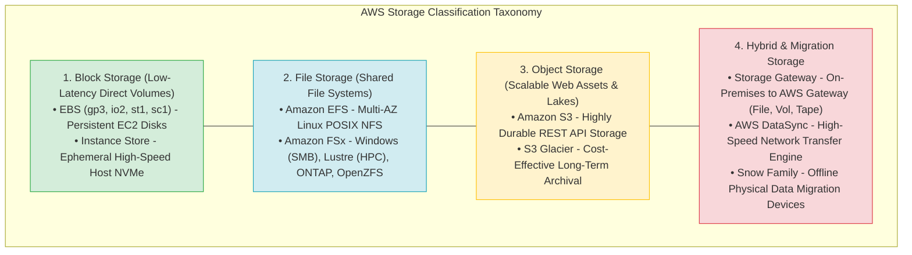
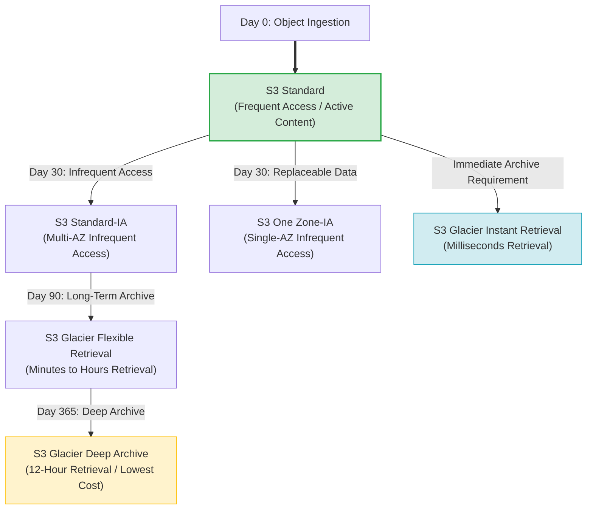
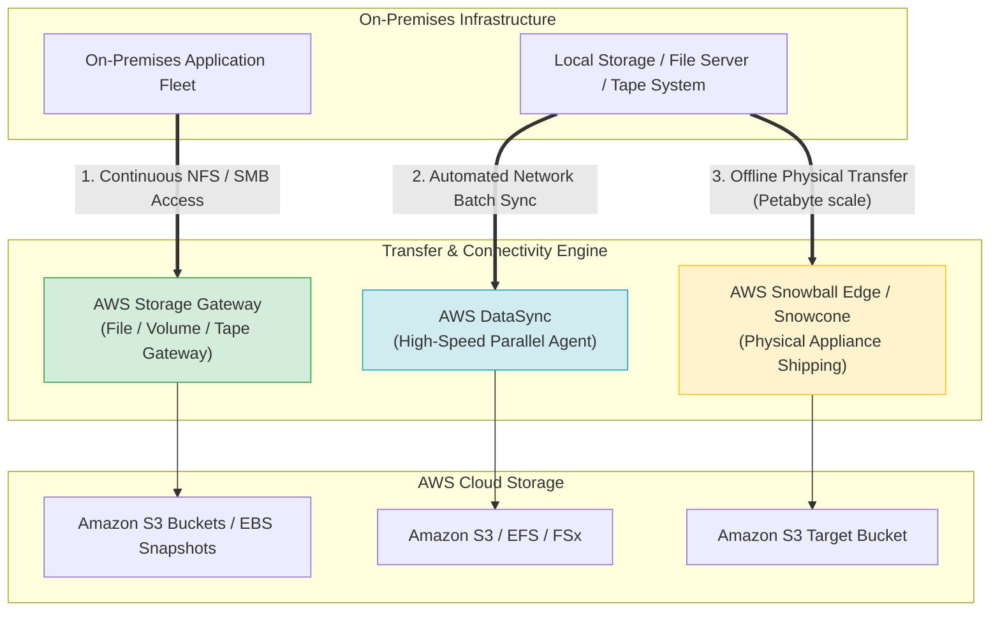
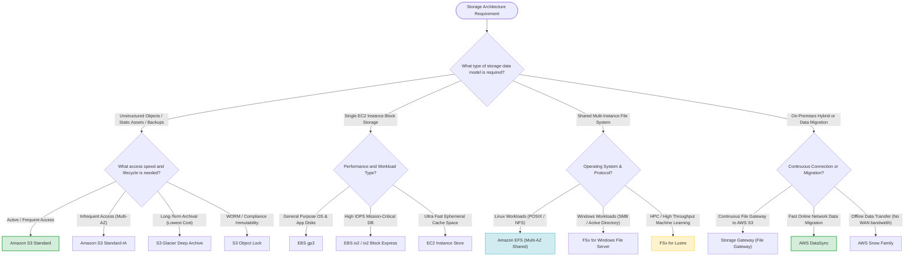
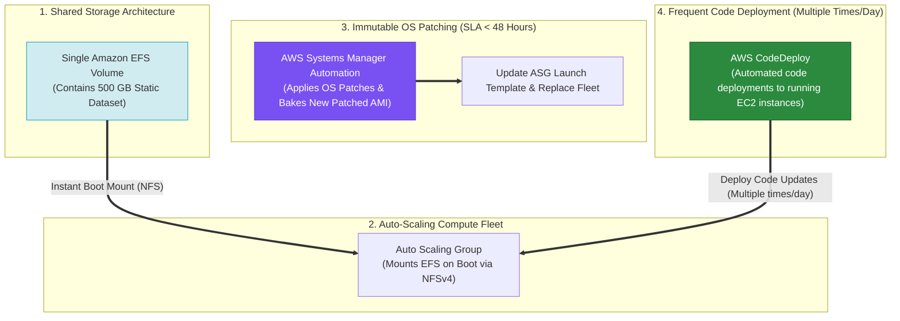

# Task 2.5: Design a Solution to Meet Performance Objectives — Storage Options on AWS

> [!NOTE]
> **Exam Mindset**: For the AWS Solutions Architect Professional (SAP-C02) and AI Practitioner (AIP-C01) exams, do not evaluate storage services in isolation. Select storage based on a structured decision flow:
> **Data Type** (Block vs. File vs. Object) $\rightarrow$ **Access Protocol** $\rightarrow$ **IOPS & Throughput SLAs** $\rightarrow$ **Availability & Failure Boundary** $\rightarrow$ **Replication Target** $\rightarrow$ **Total Cost of Ownership (TCO)**.

---

## 1. Core Storage Taxonomy & AWS Architecture Alignment



---

## 2. Core AWS Storage Categories Comparison Matrix

| Storage Service | Storage Model | Access Protocol | Scope & Resilience | Primary Target Workloads |
| :--- | :--- | :--- | :--- | :--- |
| **Amazon EBS** | **Block** | Direct Block Storage | Single Availability Zone | OS Boot Disks, Relational DBs (RDS, SQL Server) |
| **EC2 Instance Store**| **Block** | Ephemeral Host NVMe | Single EC2 Host (Non-persistent) | Ultra-fast caches, temporary scratch space, buffer |
| **Amazon EFS** | **File** | Network File System (NFSv4) | Multi-AZ (Regional) | Shared Linux web content, container volumes |
| **Amazon FSx** | **File** | SMB, POSIX, Lustre, ONTAP | Multi-AZ or Single-AZ | Windows Server (SMB), HPC, ML training, NetApp |
| **Amazon S3** | **Object** | REST API (HTTP GET/PUT) | Multi-AZ (Regional, $99.999999999\%$) | Static media, Data Lakes, Backups, Unstructured files |
| **Storage Gateway** | **Hybrid File/Block**| NFS, SMB, iSCSI | On-Premises Gateway to AWS | Hybrid cloud storage, cloud-backed tape backup |

---

## 3. Deep-Dive: Amazon S3 & Storage Tiering

**Amazon S3** provides object storage designed for $99.999999999\%$ (11 9's) durability.



### S3 Storage Classes Feature Breakdown

| Storage Class | Access Frequency | Retrieval Time SLA | Availability SLA | Cost Profile |
| :--- | :--- | :--- | :--- | :--- |
| **S3 Standard** | Frequent | Milliseconds | $99.99\%$ | Highest storage / Lowest retrieval |
| **S3 Standard-IA** | Infrequent | Milliseconds | $99.9\%$ | Lower storage / Retrieval fee applies |
| **S3 One Zone-IA** | Infrequent (Replaceable) | Milliseconds | $99.5\%$ (Single AZ) | $20\%$ cheaper than Standard-IA |
| **Glacier Instant** | Archive (Infrequent) | Milliseconds | $99.9\%$ | Archive pricing + millisecond access |
| **Glacier Flexible**| Archive | 1 min – 12 hours | $99.9\%$ | Low cost archival |
| **Glacier Deep Archive**| Long-Term Archive | 12 – 48 hours | $99.9\%$ | **Lowest cost storage in AWS** |

> [!IMPORTANT]
> **Exam Rule 1: S3 Versioning vs. Object Lock**:
> - **Versioning**: Protects against accidental deletion/overwrite by retaining object revision history.
> - **Object Lock**: Enforces **Write-Once-Read-Many (WORM)** compliance (Governance or Compliance Mode) to make objects immutable against deletion by any user including root.

> [!TIP]
> **Exam Rule 2: S3 High-Throughput Ingestion**:
> - **Multipart Upload**: Mandatory for files $> 5\text{ GB}$; recommended for files $> 100\text{ MB}$ to enable parallel part uploads.
> - **S3 Transfer Acceleration**: Uses AWS CloudFront Edge Locations to accelerate uploads over long geographic distances.

---

## 4. Deep-Dive: Amazon EBS (Elastic Block Store) & Instance Store

### EBS Volume Types Comparison

| Volume Type | Technology | Max IOPS / Volume | Max Throughput | Primary Target Workloads |
| :--- | :--- | :--- | :--- | :--- |
| **gp3** | General Purpose SSD | $16,000$ IOPS | $1,000\text{ MB/s}$ | Default baseline for OS, web apps, dev/test |
| **io2 / io2 Block Express**| Provisioned IOPS SSD | **256,000 IOPS** | **4,000 MB/s** | Mission-critical DBs (Oracle, SQL Server, SAP HANA) |
| **st1** | Throughput Optimized HDD | $500$ IOPS | $500\text{ MB/s}$ | Big Data, Data Warehouses, Log processing |
| **sc1** | Cold HDD | $250$ IOPS | $250\text{ MB/s}$ | Infrequently accessed cold sequential workloads |

> [!WARNING]
> **Exam Trap: EBS Scope is Single-AZ**: An EBS volume resides strictly in **one Availability Zone**. You cannot directly attach an EBS volume to an EC2 instance in another AZ without creating an EBS Snapshot or using **EFS / FSx** shared file storage.

---

## 5. Shared File Systems: EFS vs. Amazon FSx Family

- **Amazon EFS**: Fully managed POSIX NFS file system for **Linux workloads**. Multi-AZ durability; accessible concurrently by thousands of EC2 instances.
- **FSx for Windows File Server**: Fully managed **SMB file system** with native Microsoft Active Directory integration, Windows ACLs, and SMB performance.
- **FSx for Lustre**: High-performance parallel file system designed for **HPC, Machine Learning training, and financial modeling**.
- **FSx for NetApp ONTAP**: Enterprise multi-protocol storage (NFS, SMB, iSCSI) with NetApp ONTAP data management features.

---

## 6. On-Premises to AWS Hybrid Storage & Migration Spectrum



### Hybrid & Migration Tools Matrix

| Service | Mode of Operation | Primary Exam Purpose |
| :--- | :--- | :--- |
| **Storage Gateway (File Gateway)** | Continuous Hybrid Cloud Bridge | On-premises app expects NFS/SMB file access backed by S3 |
| **AWS DataSync** | Online Network Data Transfer | Automated high-speed data migration over Direct Connect / WAN |
| **AWS Snowball Edge** | Physical Appliance Offline Shipping | Migrating petabyte-scale data when network bandwidth is limited |
| **AWS Backup** | Centralized Policy-Based Backup | Enterprise backup governance across EBS, RDS, EFS, DynamoDB, S3 |

---

## 7. SAP-C02 Master Storage Selection & Replication Decision Engine



---

## 8. SAP-C02 Exam Keyword Cheat Sheet

```
"Shared Linux filesystem across multiple EC2s" ──> Amazon EFS
"Windows SMB file share with Active Directory"  ──> FSx for Windows File Server
"High-performance parallel computing / ML"     ──> FSx for Lustre
"Ephemeral ultra-fast scratch storage"          ──> EC2 Instance Store
"Mission-critical DB requiring 64,000+ IOPS"    ──> EBS io2 Block Express
"Immutable WORM storage for compliance"         ──> S3 Object Lock
"Accidental file deletion protection"           ──> S3 Versioning
"Global long-distance fast upload to S3"        ──> S3 Transfer Acceleration + Multipart Upload
"On-premises app needs NFS file interface to S3"──> Storage Gateway (File Gateway)
"Migrate 100 TB over online network"            ──> AWS DataSync
"Migrate 500 TB with poor internet connection"  ──> AWS Snowball Edge
"Lowest-cost long-term archive"                 ──> S3 Glacier Deep Archive
"Centralized policy-based backup management"    ──> AWS Backup
```

---

## 9. Common SAP-C02 Exam Traps

1. **Trap 1: Selecting EBS for Multi-EC2 Shared Access**: Standard EBS volumes cannot be shared across multiple instances in different AZs. Use **Amazon EFS** (for Linux) or **Amazon FSx** (for Windows).
2. **Trap 2: Confusing AWS DataSync with Storage Gateway**: DataSync is an online *migration and sync tool*. Storage Gateway provides *ongoing hybrid file/block access* for on-premises servers.
3. **Trap 3: Using S3 One Zone-IA for Critical Single-Copy Data**: One Zone-IA stores data in only one AZ. If that AZ experiences an outage, data is unavailable. Use One Zone-IA only for *easily reproducible data*.
4. **Trap 4: Selecting Snowball for High-Bandwidth Online Transfer**: If a high-speed Direct Connect circuit is available, use **AWS DataSync**. Use **Snowball** when network transfer would take weeks/months due to poor connectivity.
5. **Trap 5: Downloading Large Datasets from S3 on Every Boot in Auto Scaling**: Writing User Data scripts to download large static datasets (e.g., 500 GB) from S3 onto local EBS volumes on *every* new EC2 instance launch adds severe boot-time delays (15–30+ mins) and requires purchasing redundant 500 GB EBS storage per instance. Mount a single **Amazon EFS volume** instead.

---

## 9.1 Real-World Exam Scenario: Auto-Scaling Fleet with 500 GB Shared Dataset & SSM Patching

- **Scenario**: A company needs an auto-scaling EC2 deployment solution with the following strict requirements:
  - Must access a **500 GB static dataset** immediately upon boot.
  - Must scale out/in based on traffic spikes.
  - Development team needs to deploy code updates **several times a day**.
  - Operating system security patches must be installed **within 48 hours** of release.
  - Must be cost-effective.
- **Architecture Solution**:



### Architectural Key Points:
1. **Amazon EFS vs. S3 Download & EBS**: Mounting a single shared **Amazon EFS volume** provides instant NFS access to the 500 GB dataset upon boot. It avoids paying for 500 GB EBS volumes on every auto-scaling instance and eliminates long 500 GB download delays during scale-out events.
2. **AWS Systems Manager Automation for OS Patching**: Systems Manager installs OS security patches and bakes an updated AMI to satisfy the 48-hour patching SLA via instance replacement.
3. **AWS CodeDeploy for Frequent Code Updates**: Allows developers to push code updates to running instances multiple times a day independently of AMI baking cycles or nightly batch windows.

### Why Distractor Options Fail:
- *S3 Download via User Data + EBS per Instance*: Downloading 500 GB from S3 on every launch adds 15–30+ minutes to boot times (stalling auto-scaling during traffic spikes) and multiplies EBS storage costs across every instance in the fleet.
- *Nightly Batch Job for Code Deployments*: Batch jobs run once a night, failing the requirement to deploy code updates **several times during the day**.
- *Waiting for New AWS Amazon Linux AMI Releases*: Amazon Linux AMI releases occur over weeks/months, failing the requirement to patch security vulnerabilities within **48 hours** of release.

---

## 10. Final Mental Model

`Identify Storage Type (Block/File/Object) ➔ Check Access Protocol ➔ Verify Availability Boundary (AZ/Region) ➔ Optimize Storage Class & Cost`