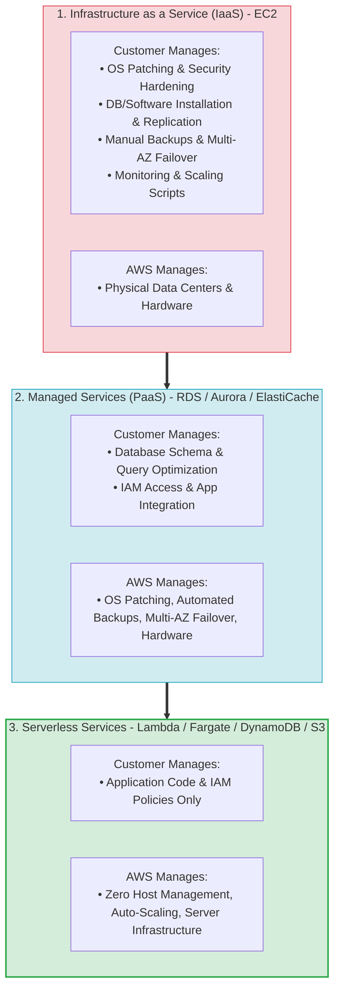
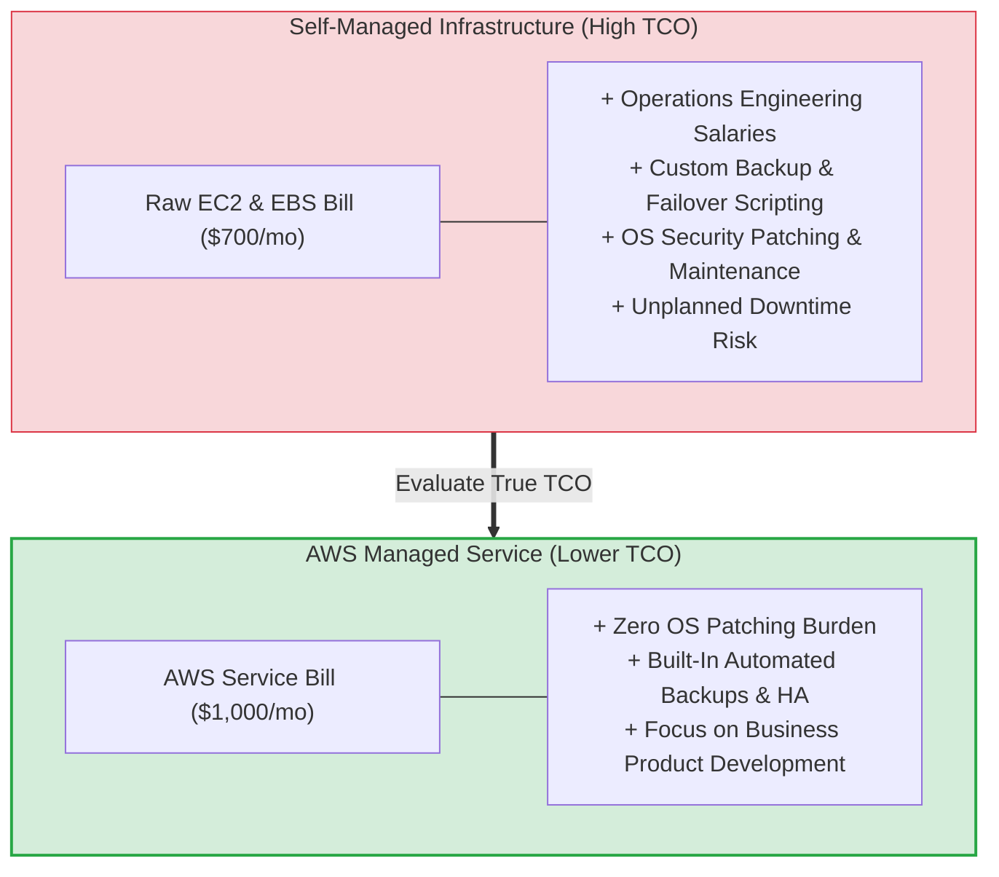
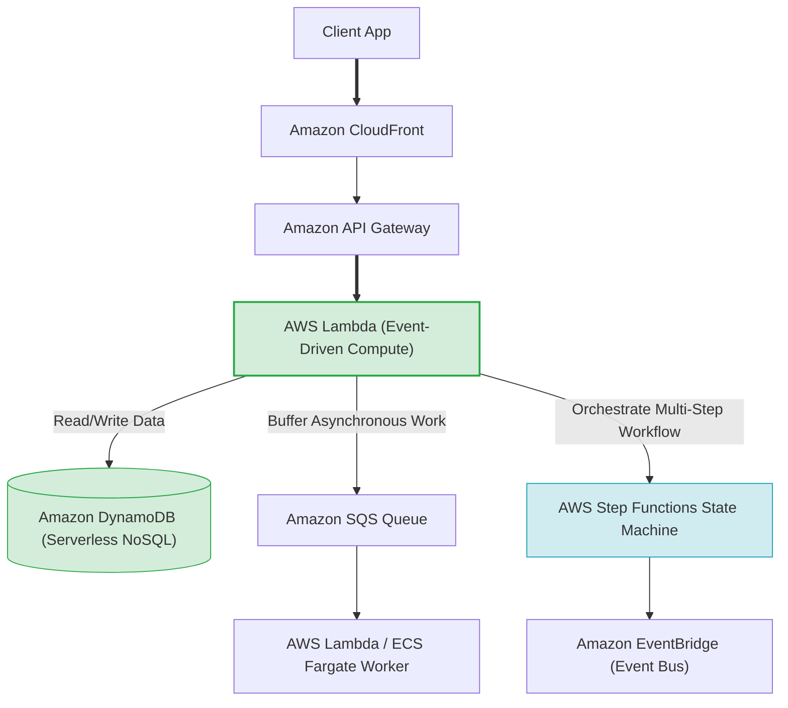
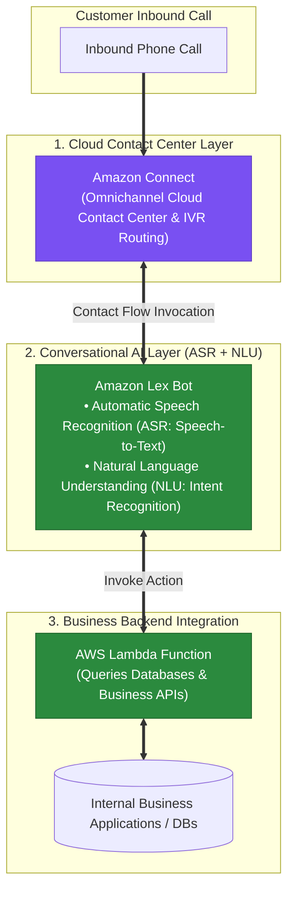
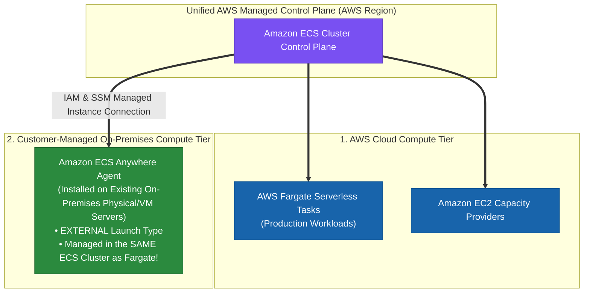

# Task 2.6: Determine a Cost Optimization Strategy — AWS Managed Service Offerings

> [!NOTE]
> **Exam Mindset**: For the AWS Solutions Architect Professional (SAP-C02) and AI Practitioner (AIP-C01) exams, the foundational rule for managed services is:
> **"Eliminate undifferentiated heavy lifting. Do not build, patch, and operate infrastructure yourself when an AWS managed service satisfies the requirement at a lower Total Cost of Ownership (TCO)."**

---

## 1. Shared Responsibility & Operational Overhead Shift



---

## 2. Managed Services vs. Self-Managed EC2 Comparison Matrix

| Architectural Layer | Self-Managed on EC2 (IaaS) | AWS Managed Service (PaaS) | AWS Serverless Service |
| :--- | :--- | :--- | :--- |
| **Compute / OS** | EC2 (Customer patches OS) | RDS / ECS on EC2 (AWS manages OS) | AWS Lambda / Fargate (Zero OS access) |
| **Database** | Self-Managed MySQL on EC2 | Amazon RDS / Amazon Aurora | Amazon DynamoDB |
| **Shared File System**| Self-Managed NFS on EC2 | Amazon EFS / Amazon FSx | Amazon S3 (Object Storage) |
| **Caching** | Self-Managed Redis on EC2 | Amazon ElastiCache | DynamoDB Accelerator (DAX) |
| **Messaging Queue** | Self-Managed RabbitMQ on EC2 | Amazon MQ | Amazon SQS |
| **Workflow State** | Custom DB State Machine | AWS Step Functions | AWS Step Functions |

---

## 3. Total Cost of Ownership (TCO) Spectrum



> [!IMPORTANT]
> **TCO Rule: Infrastructure vs. Operational Cost**:
> A self-managed EC2 solution may show a cheaper raw monthly AWS bill, but when accounting for **DBA salaries**, **OS patching overhead**, **custom backup scripts**, and **downtime risks**, an AWS Managed Service (like RDS or Aurora) delivers a significantly lower **Total Cost of Ownership (TCO)**.

---

## 4. Modern Serverless Application Architecture Stack



---

## 5. Container Compute: ECS Fargate vs. ECS on EC2

| Dimension | AWS Fargate (Serverless Containers) | ECS on EC2 (Container Host Fleet) |
| :--- | :--- | :--- |
| **Host Management** | **Zero host provisioning or OS patching** | Customer manages, scales, and patches EC2 host fleet |
| **Pricing Model** | Pay per vCPU and Memory requested per second | Pay for underlying EC2 instances (running or idle) |
| **Operational Effort** | **Minimal** | Medium (requires EC2 host Auto Scaling policy tuning) |
| **Best Fit** | Variable workloads, microservices, minimal ops team | Large steady-state fleets, custom host GPUs, BYOL licenses |

---

## 6. What Managed Services Do NOT Eliminate

> [!WARNING]
> **Exam Trap: Managed Service $\neq$ Zero Management**:
> AWS managed services handle underlying infrastructure, but you are still responsible for:
> - **Amazon RDS**: Schema design, query indexing, parameter groups, IAM access policies, capacity selection.
> - **Amazon S3**: Bucket policies, encryption rules, versioning, object lifecycle policies, storage class selection.
> - **AWS Lambda**: Code execution logic, memory allocation, timeout limits, concurrency limits, IAM roles.

---

## 7. When NOT to Use Managed Services

Do **NOT** force a managed service when business requirements demand:
- **Full OS Access**: Require root access or custom Linux kernel modules.
- **Unsupported Legacy Software**: Legacy database engines or custom software extensions unsupported by RDS.
- **BYOL Per-Socket Licensing**: Dedicated host hardware visibility required for per-socket software licenses.

---

## 7.1 Amazon AI/ML Speech & Contact Center Services Matrix

When selecting AWS managed services for customer contact centers and conversational interfaces:



### AWS AI & Contact Center Service Distinction Matrix

| AWS Managed Service | Primary Purpose | Capabilities | Key Exam Distractor Role |
| :--- | :--- | :--- | :--- |
| **Amazon Connect** | Cloud-based Omnichannel Contact Center | Manages telephony, contact flows, queues, IVR routing, agent UI | Core contact center service |
| **Amazon Lex** | Conversational Chatbot (Voice & Text) | **ASR (Speech-to-Text)** + **NLU (Intent Recognition)** | **Correct choice for interactive voice bots** |
| **Amazon Polly** | Text-to-Speech (TTS) | Synthesizes written text into spoken lifelike audio | Cannot process caller speech or recognize intent! |
| **Amazon Comprehend** | Text Analytics & Sentiment Analysis | Extracts entities, key phrases, and sentiment from text documents | Does not perform speech recognition (ASR) or dialog routing |
| **AWS Elemental MediaConnect** | Live Video Broadcast Transport | Ingests high-quality live video streams | Fictitious contact center service |
| **AWS Ground Station** | Satellite Operations & Data | Satellite downlink and command processing | Fictitious contact center service |

---

## 8.1 Real-World Exam Scenario: Cloud Call Center & Conversational Voice Bot Architecture

- **Scenario**: A BPO startup is launching a cloud-based call center system. The solution must receive inbound calls from thousands of customers, generate contact flows, and allow callers to perform self-service tasks (e.g., password resets, balance checks) via Interactive Voice Response (IVR) without speaking to an agent. The system requires Automatic Speech Recognition (ASR) and Natural Language Understanding (NLU) to process caller intent and query backend business applications. What is the most suitable architecture?
- **Architecture Solution**:
  - Set up a cloud-based contact center using **Amazon Connect**. Create a conversational chatbot using **Amazon Lex** with Automatic Speech Recognition (ASR) and Natural Language Understanding (NLU) to recognize caller intent, then integrate it with Amazon Connect contact flows. Connect the solution to business applications using **AWS Lambda** functions.

### Why Distractor Options Fail:
- *AWS Elemental MediaConnect + Amazon Polly (Your Selection)*: **AWS Elemental MediaConnect** is a live video ingestion service for broadcast television streams, NOT a contact center service! **Amazon Polly** is Text-to-Speech (TTS) only—it converts text into spoken audio output, but CANNOT recognize incoming caller speech (ASR) or determine user intent (NLU).
- *AWS Ground Station + Amazon Alexa for Business*: **AWS Ground Station** is a satellite communication service. **Alexa for Business** manages office smart speakers, NOT customer call center IVR systems.
- *Amazon Connect + Amazon Comprehend*: **Amazon Comprehend** is a Natural Language Processing (NLP) text analysis service for documents; it does not contain Automatic Speech Recognition (ASR) engines to convert live telephone speech to text or handle voice dialog flows.

---

## 7.2 Hybrid Container Orchestration: Amazon ECS Anywhere vs. AWS Outposts & EKS Anywhere

When running container workloads across on-premises data centers and the AWS Cloud, selecting the right hybrid container service depends on **infrastructure ownership, orchestrator choice, and cluster integration**:



### Hybrid Container Options Decision Matrix

| Service Option | Infrastructure Hardware | Container Orchestrator | Same Cluster as Fargate? | Fargate Support? | Primary Use Case |
| :--- | :--- | :--- | :---: | :---: | :--- |
| **Amazon ECS Anywhere** | **Existing Customer On-Premises Hardware** | **Amazon ECS** | ✅ **YES (Same Cluster)** | ✅ **YES (Same Cluster)** | **Lowest cost hybrid ECS; leverage existing on-prem servers & migrate to Fargate.** |
| **AWS Outposts (ECS)** | AWS-Managed Physical Racks (High Cost) | Amazon ECS | ❌ No | ❌ **NO (EC2 Only)** | On-premises ultra-low latency; requires buying AWS Outpost hardware racks. |
| **Amazon EKS Anywhere** | Existing Customer On-Premises Hardware | Kubernetes (EKS) | ❌ No | ❌ No | Customer-managed on-premises Kubernetes cluster management. |

---

## 8.2 Real-World Exam Scenario: Hybrid Container Workload Migration to AWS Fargate via ECS Anywhere

- **Scenario**: A company hosts production workloads in **AWS Fargate**. To save costs, the CIO wants to deploy new development workloads on **existing on-premises servers** to leverage capital investments. The architect must provide a solution that manages both on-premises servers and AWS Fargate tasks in the **same cluster**, ensures consistent tooling, and makes it easy to migrate dev workloads to AWS Fargate. What is the **MOST operationally efficient solution**?
- **Architecture Solution**:
  - Utilize **Amazon ECS Anywhere** to streamline software management on-premises and on AWS with a standardized container orchestrator. This allows registering existing on-premises servers into the **same Amazon ECS cluster** as AWS Fargate tasks (`EXTERNAL` capacity provider), enabling seamless migration from on-premises to AWS Fargate in the cloud.

### Why Distractor Options Fail:
- *Install and configure AWS Outposts (Your Selection)*:
  - **AWS Outposts** requires purchasing expensive, dedicated AWS-managed physical hardware racks to install on-premises, failing the requirement to leverage existing customer hardware to save costs!
  - Furthermore, **AWS Fargate is NOT supported on AWS Outposts** (ECS on Outposts requires EC2 capacity providers, not Fargate), so you cannot run Fargate on Outposts or manage Fargate and Outposts in the same cluster.
- *Amazon EKS Anywhere*: EKS Anywhere manages Kubernetes clusters on customer-managed hardware on-premises, but EKS Anywhere operates as a distinct customer-managed Kubernetes control plane. It does NOT integrate into the same cluster as AWS Fargate in an AWS region!

---

## 7.3 AWS IoT Service Ecosystem: AWS IoT Core vs. Device Management vs. Device Defender vs. SiteWise

AWS offers specialized IoT services to manage the device lifecycle from connectivity and messaging to security and industrial telemetry:

```mermaid
flowchart TD
    subgraph EdgeDevices["1. Oceanic / Remote IoT Device Fleet"]
        IoT_Sensors["Oceanic Weather Sensors<br/>(Temperature & Pressure Telemetry)"]
    end

    subgraph MessagingTier["2. Core Messaging & Routing Tier"]
        IoTCore["AWS IoT Core<br/>• MQTT / HTTP Message Broker<br/>• IoT Rules Engine (Routes to DynamoDB / SQS)"]
        IoT_Sensors ==>|"MQTT Messages"| IoTCore
    end

    subgraph LifecycleManagement["3. Fleet Health & Lifecycle Management Tier"]
        DeviceMgmt["AWS IoT Device Management<br/>⚡ Register, organize, & monitor fleet connectivity<br/>⚡ Troubleshoot connectivity drops & push OTA firmware updates"]
        DeviceDefender["AWS IoT Device Defender<br/>🔒 Audit security policies & detect anomalous behavior"]

        IoT_Sensors <==>"Fleet Health & OTA"| DeviceMgmt
        IoT_Sensors <==>"Security Audit"| DeviceDefender
    end

    classDef msg fill:#7950f2,stroke:#5f3dc4,color:#ffffff;
    classDef mgmt fill:#2b8a3e,stroke:#1e632b,color:#ffffff;
    classDef sec fill:#1864ab,stroke:#0b5394,color:#ffffff;

    class IoTCore msg;
    class DeviceMgmt mgmt;
    class DeviceDefender sec;
```

### AWS IoT Service Comparison Matrix

| AWS IoT Service | Primary Operational Purpose | Core Capabilities | Key Exam Use Case / Trigger |
| :--- | :--- | :--- | :--- |
| **AWS IoT Core** | Device Messaging & Data Routing | Connects devices over MQTT/HTTP; routes payloads via Rules Engine. | *"Connect IoT devices to AWS & update DynamoDB."* |
| **AWS IoT Device Management**| **Fleet Health & Lifecycle Management** | **Monitors device connectivity, troubleshoots connection drops, pushes OTA firmware updates.** | **"Troubleshoot IoT device connectivity interruptions & fleet health."** |
| **AWS IoT Device Defender** | IoT Security Auditing & Anomaly Detection | Audits X.509 cert policies and alerts on abnormal traffic/IP connections. | *"Detect abnormal IoT device behavior & audit security policies."* |
| **AWS IoT SiteWise** | Industrial Equipment Telemetry | Collects, models, and analyzes data from factory floor equipment (PLCs). | *"Industrial plant equipment & manufacturing telemetry."* |
| **AWS IoT 1-Click** | Single-Button Action Triggering | Enables simple push-button devices (IoT Buttons) to invoke Lambda functions. | *"Simple push-button alerts or facility service requests."* |

---

## 8.3 Real-World Exam Scenario: Oceanic IoT Telemetry Interruption & Fleet Health (AWS IoT Device Management)

- **Scenario**: A weather forecasting agency deploys a fleet of oceanic IoT devices monitoring sea temperature and pressure. Devices send MQTT messages to **AWS IoT Core**, which updates an **Amazon DynamoDB** table. The administrator notices that database updates have stopped occurring. The agency uses **AWS IoT Device Defender** for security audits, but it cannot diagnose connectivity interruptions. What should the administrator do to troubleshoot the issue?
- **Architecture Solution**:
  - Register the IoT devices in **AWS IoT Device Management** to monitor device health, track fleet connectivity status to AWS IoT Core, troubleshoot individual device connection drops, and manage remote software/firmware updates.

### Why Distractor Options Fail:
- *AWS IoT Device Defender for X.509 CA registration*:
  - Device Defender audits security policy compliance and detects anomalous behavior; it does NOT manage Certificate Authorities or monitor device connectivity status.
- *AWS IoT SiteWise*:
  - SiteWise is designed for industrial manufacturing equipment telemetry (factory machinery, turbines); it is NOT a device fleet health monitoring service for oceanic weather sensors.
- *AWS Lambda via IoT 1-Click*:
  - AWS IoT 1-Click is for simple single-button push devices (e.g., physical alert buttons); it does not troubleshoot or restore IoT Core connectivity for ocean telemetry sensors.

---

## 8. SAP-C02 Managed vs. Custom Compute Selection Master Decision Engine


---

## 9. SAP-C02 Exam Keyword Cheat Sheet

```
"Minimize operational overhead"             ──> Managed / Serverless Services (RDS / Fargate / Lambda)
"Reduce patching & server maintenance"      ──> Managed AWS Services / Systems Manager Patch Manager
"Small operations team / Focus on code"    ──> AWS Lambda / AWS Fargate / Amazon DynamoDB
"Container workload without managing hosts"  ──> AWS Fargate
"Managed relational database"              ──> Amazon RDS / Amazon Aurora
"Managed message queue / Decouple"          ──> Amazon SQS
"Managed pub/sub fan-out"                  ──> Amazon SNS
"Managed workflow orchestration"            ──> AWS Step Functions
"Event-driven serverless routing"          ──> Amazon EventBridge
"Centralized fleet patch management"        ──> AWS Systems Manager (Patch Manager)
"Centralized enterprise backup management"  ──> AWS Backup
"Full OS control / Custom kernel module"    ──> Amazon EC2
```

---

## 10. Common SAP-C02 Exam Traps

1. **Trap 1: Assuming Managed Services are Always Cheaper Raw Price**: A managed service bill may look higher than raw EC2 instances. Always evaluate **Total Cost of Ownership (TCO)** including DBA and engineering labor.
2. **Trap 2: Forcing Lambda for Long-Running Batch Workloads**: Lambda has a 15-minute maximum execution timeout. For long-running batch jobs, use **AWS Fargate / AWS Batch** or **EC2 Auto Scaling**.
3. **Trap 3: Choosing EC2 to Build Custom Queues or Caches**: Building RabbitMQ or Redis on EC2 adds unnecessary patching and failover management. Always prefer **Amazon SQS** and **Amazon ElastiCache**.
4. **Trap 4: Forgetting Customer Responsibilities on Managed Services**: RDS does not write your SQL queries or optimize your indexes. You remain responsible for schema design and query performance.

---

## 11. Final Mental Model

`Identify Requirement ➔ Prefer Managed/Serverless Service ➔ Evaluate TCO ➔ Check Control Limitations (OS/BYOL) ➔ Select Smallest Managed Architecture`