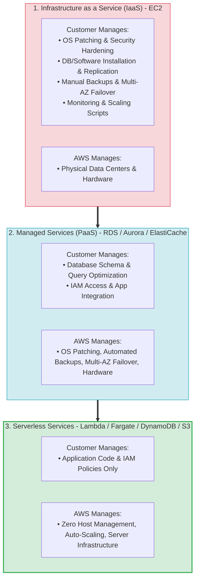
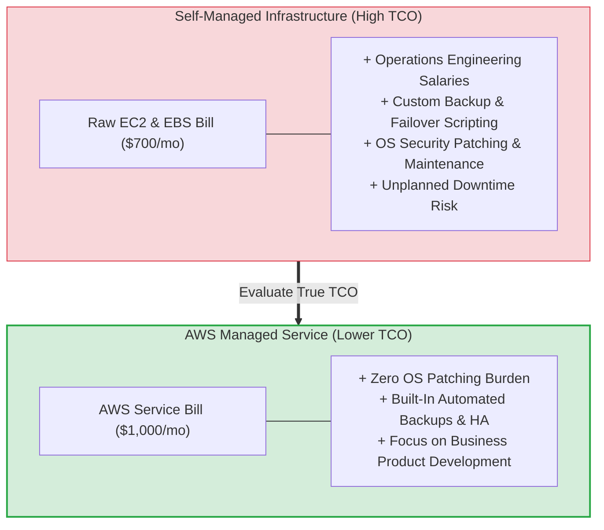
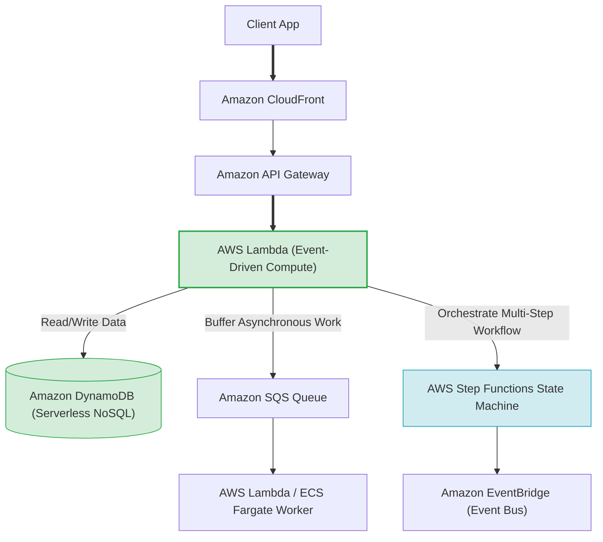
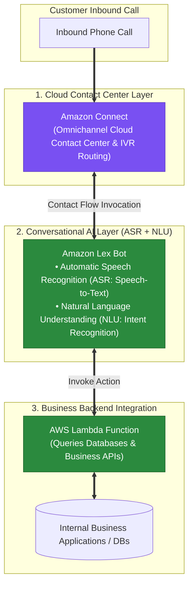
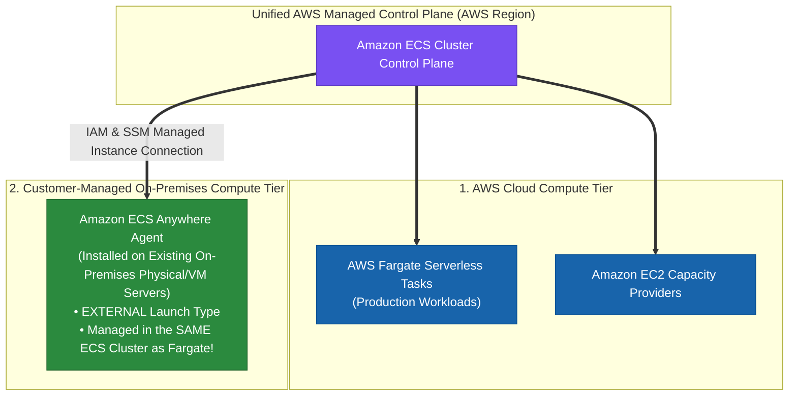
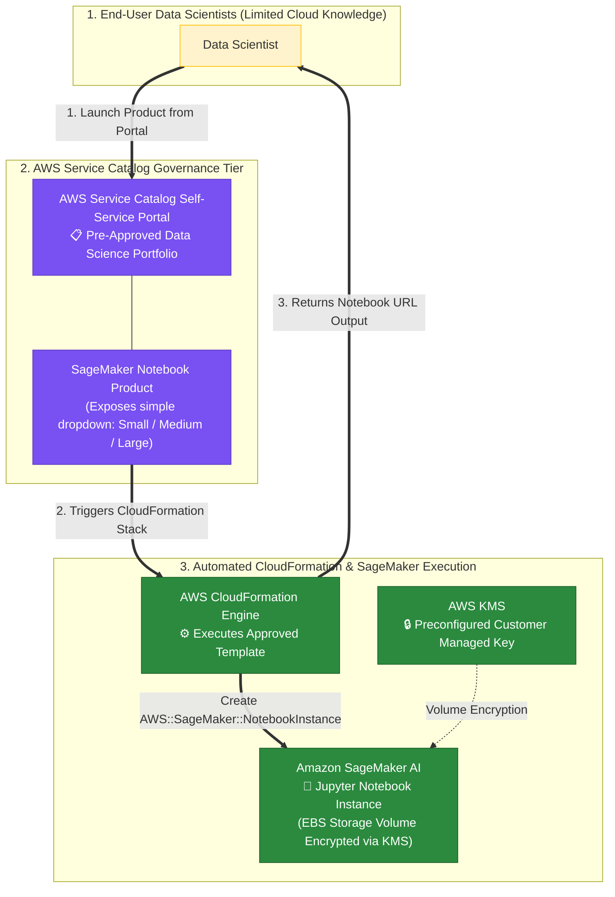
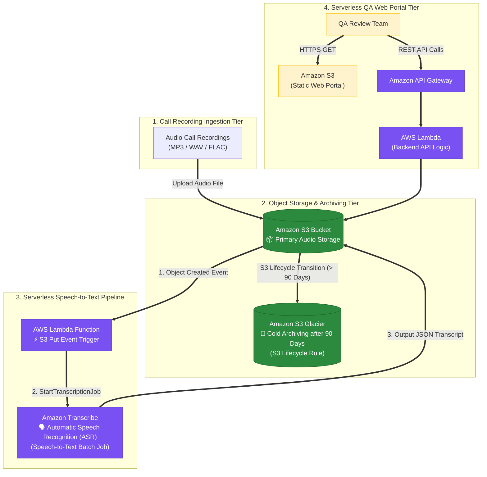
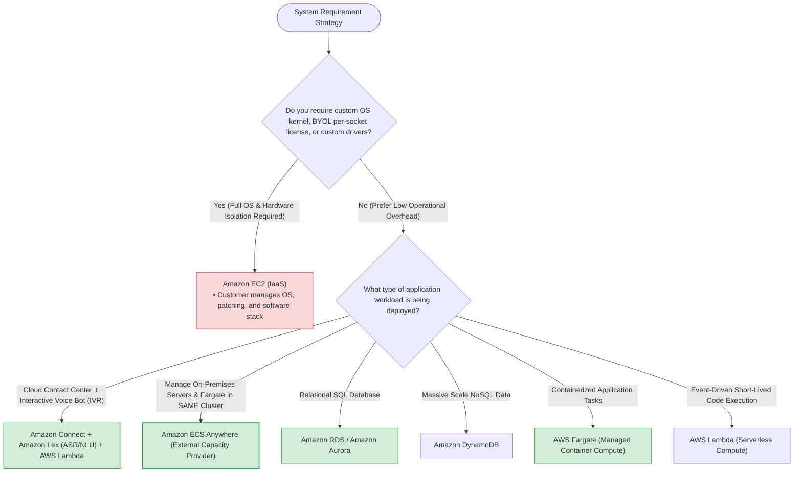
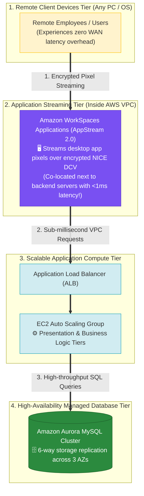

# Task 2.6: Determine a Cost Optimization Strategy — AWS Managed Service Offerings

> [!NOTE]
> **Exam Mindset**: For the AWS Solutions Architect Professional (SAP-C02) and AI Practitioner (AIP-C01) exams, the foundational rule for managed services is:
> **"Eliminate undifferentiated heavy lifting. Do not build, patch, and operate infrastructure yourself when an AWS managed service satisfies the requirement at a lower Total Cost of Ownership (TCO)."**

---

## 1. Shared Responsibility & Operational Overhead Shift



---

## 2. Managed Services vs. Self-Managed EC2 Comparison Matrix

| Architectural Layer | Self-Managed on EC2 (IaaS) | AWS Managed Service (PaaS) | AWS Serverless Service |
| :--- | :--- | :--- | :--- |
| **Compute / OS** | EC2 (Customer patches OS) | RDS / ECS on EC2 (AWS manages OS) | AWS Lambda / Fargate (Zero OS access) |
| **Database** | Self-Managed MySQL on EC2 | Amazon RDS / Amazon Aurora | Amazon DynamoDB |
| **Shared File System**| Self-Managed NFS on EC2 | Amazon EFS / Amazon FSx | Amazon S3 (Object Storage) |
| **Caching** | Self-Managed Redis on EC2 | Amazon ElastiCache | DynamoDB Accelerator (DAX) |
| **Messaging Queue** | Self-Managed RabbitMQ on EC2 | Amazon MQ | Amazon SQS |
| **Workflow State** | Custom DB State Machine | AWS Step Functions | AWS Step Functions |

---

## 3. Total Cost of Ownership (TCO) Spectrum



> [!IMPORTANT]
> **TCO Rule: Infrastructure vs. Operational Cost**:
> A self-managed EC2 solution may show a cheaper raw monthly AWS bill, but when accounting for **DBA salaries**, **OS patching overhead**, **custom backup scripts**, and **downtime risks**, an AWS Managed Service (like RDS or Aurora) delivers a significantly lower **Total Cost of Ownership (TCO)**.

---

## 4. Modern Serverless Application Architecture Stack



---

## 5. Container Compute: ECS Fargate vs. ECS on EC2

| Dimension | AWS Fargate (Serverless Containers) | ECS on EC2 (Container Host Fleet) |
| :--- | :--- | :--- |
| **Host Management** | **Zero host provisioning or OS patching** | Customer manages, scales, and patches EC2 host fleet |
| **Pricing Model** | Pay per vCPU and Memory requested per second | Pay for underlying EC2 instances (running or idle) |
| **Operational Effort** | **Minimal** | Medium (requires EC2 host Auto Scaling policy tuning) |
| **Best Fit** | Variable workloads, microservices, minimal ops team | Large steady-state fleets, custom host GPUs, BYOL licenses |

---

## 6. What Managed Services Do NOT Eliminate

> [!WARNING]
> **Exam Trap: Managed Service $\neq$ Zero Management**:
> AWS managed services handle underlying infrastructure, but you are still responsible for:
> - **Amazon RDS**: Schema design, query indexing, parameter groups, IAM access policies, capacity selection.
> - **Amazon S3**: Bucket policies, encryption rules, versioning, object lifecycle policies, storage class selection.
> - **AWS Lambda**: Code execution logic, memory allocation, timeout limits, concurrency limits, IAM roles.

---

## 7. When NOT to Use Managed Services

Do **NOT** force a managed service when business requirements demand:
- **Full OS Access**: Require root access or custom Linux kernel modules.
- **Unsupported Legacy Software**: Legacy database engines or custom software extensions unsupported by RDS.
- **BYOL Per-Socket Licensing**: Dedicated host hardware visibility required for per-socket software licenses.

---

## 7.1 Amazon AI/ML Speech & Contact Center Services Matrix

When selecting AWS managed services for customer contact centers and conversational interfaces:



### AWS AI & Contact Center Service Distinction Matrix

| AWS Managed Service | Primary Purpose | Capabilities | Key Exam Distractor Role |
| :--- | :--- | :--- | :--- |
| **Amazon Connect** | Cloud-based Omnichannel Contact Center | Manages telephony, contact flows, queues, IVR routing, agent UI | Core contact center service |
| **Amazon Lex** | Conversational Chatbot (Voice & Text) | **ASR (Speech-to-Text)** + **NLU (Intent Recognition)** | **Correct choice for interactive voice bots** |
| **Amazon Polly** | Text-to-Speech (TTS) | Synthesizes written text into spoken lifelike audio | Cannot process caller speech or recognize intent! |
| **Amazon Comprehend** | Text Analytics & Sentiment Analysis | Extracts entities, key phrases, and sentiment from text documents | Does not perform speech recognition (ASR) or dialog routing |
| **AWS Elemental MediaConnect** | Live Video Broadcast Transport | Ingests high-quality live video streams | Fictitious contact center service |
| **AWS Ground Station** | Satellite Operations & Data | Satellite downlink and command processing | Fictitious contact center service |

---

## 8.1 Real-World Exam Scenario: Cloud Call Center & Conversational Voice Bot Architecture

- **Scenario**: A BPO startup is launching a cloud-based call center system. The solution must receive inbound calls from thousands of customers, generate contact flows, and allow callers to perform self-service tasks (e.g., password resets, balance checks) via Interactive Voice Response (IVR) without speaking to an agent. The system requires Automatic Speech Recognition (ASR) and Natural Language Understanding (NLU) to process caller intent and query backend business applications. What is the most suitable architecture?
- **Architecture Solution**:
  - Set up a cloud-based contact center using **Amazon Connect**. Create a conversational chatbot using **Amazon Lex** with Automatic Speech Recognition (ASR) and Natural Language Understanding (NLU) to recognize caller intent, then integrate it with Amazon Connect contact flows. Connect the solution to business applications using **AWS Lambda** functions.

### Why Distractor Options Fail:
- *AWS Elemental MediaConnect + Amazon Polly (Your Selection)*: **AWS Elemental MediaConnect** is a live video ingestion service for broadcast television streams, NOT a contact center service! **Amazon Polly** is Text-to-Speech (TTS) only—it converts text into spoken audio output, but CANNOT recognize incoming caller speech (ASR) or determine user intent (NLU).
- *AWS Ground Station + Amazon Alexa for Business*: **AWS Ground Station** is a satellite communication service. **Alexa for Business** manages office smart speakers, NOT customer call center IVR systems.
- *Amazon Connect + Amazon Comprehend*: **Amazon Comprehend** is a Natural Language Processing (NLP) text analysis service for documents; it does not contain Automatic Speech Recognition (ASR) engines to convert live telephone speech to text or handle voice dialog flows.

---

## 7.2 Hybrid Container Orchestration: Amazon ECS Anywhere vs. AWS Outposts & EKS Anywhere

When running container workloads across on-premises data centers and the AWS Cloud, selecting the right hybrid container service depends on **infrastructure ownership, orchestrator choice, and cluster integration**:



### Hybrid Container Options Decision Matrix

| Service Option | Infrastructure Hardware | Container Orchestrator | Same Cluster as Fargate? | Fargate Support? | Primary Use Case |
| :--- | :--- | :--- | :---: | :---: | :--- |
| **Amazon ECS Anywhere** | **Existing Customer On-Premises Hardware** | **Amazon ECS** | ✅ **YES (Same Cluster)** | ✅ **YES (Same Cluster)** | **Lowest cost hybrid ECS; leverage existing on-prem servers & migrate to Fargate.** |
| **AWS Outposts (ECS)** | AWS-Managed Physical Racks (High Cost) | Amazon ECS | ❌ No | ❌ **NO (EC2 Only)** | On-premises ultra-low latency; requires buying AWS Outpost hardware racks. |
| **Amazon EKS Anywhere** | Existing Customer On-Premises Hardware | Kubernetes (EKS) | ❌ No | ❌ No | Customer-managed on-premises Kubernetes cluster management. |

---

## 8.2 Real-World Exam Scenario: Hybrid Container Workload Migration to AWS Fargate via ECS Anywhere

- **Scenario**: A company hosts production workloads in **AWS Fargate**. To save costs, the CIO wants to deploy new development workloads on **existing on-premises servers** to leverage capital investments. The architect must provide a solution that manages both on-premises servers and AWS Fargate tasks in the **same cluster**, ensures consistent tooling, and makes it easy to migrate dev workloads to AWS Fargate. What is the **MOST operationally efficient solution**?
- **Architecture Solution**:
  - Utilize **Amazon ECS Anywhere** to streamline software management on-premises and on AWS with a standardized container orchestrator. This allows registering existing on-premises servers into the **same Amazon ECS cluster** as AWS Fargate tasks (`EXTERNAL` capacity provider), enabling seamless migration from on-premises to AWS Fargate in the cloud.

### Why Distractor Options Fail:
- *Install and configure AWS Outposts (Your Selection)*:
  - **AWS Outposts** requires purchasing expensive, dedicated AWS-managed physical hardware racks to install on-premises, failing the requirement to leverage existing customer hardware to save costs!
  - Furthermore, **AWS Fargate is NOT supported on AWS Outposts** (ECS on Outposts requires EC2 capacity providers, not Fargate), so you cannot run Fargate on Outposts or manage Fargate and Outposts in the same cluster.
- *Amazon EKS Anywhere*: EKS Anywhere manages Kubernetes clusters on customer-managed hardware on-premises, but EKS Anywhere operates as a distinct customer-managed Kubernetes control plane. It does NOT integrate into the same cluster as AWS Fargate in an AWS region!

---

## 7.3 AWS IoT Service Ecosystem: AWS IoT Core vs. Device Management vs. Device Defender vs. SiteWise

AWS offers specialized IoT services to manage the device lifecycle from connectivity and messaging to security and industrial telemetry:

```mermaid
flowchart TD
    subgraph EdgeDevices["1. Oceanic / Remote IoT Device Fleet"]
        IoT_Sensors["Oceanic Weather Sensors<br/>(Temperature & Pressure Telemetry)"]
    end

    subgraph MessagingTier["2. Core Messaging & Routing Tier"]
        IoTCore["AWS IoT Core<br/>• MQTT / HTTP Message Broker<br/>• IoT Rules Engine (Routes to DynamoDB / SQS)"]
        IoT_Sensors ==>|"MQTT Messages"| IoTCore
    end

    subgraph LifecycleManagement["3. Fleet Health & Lifecycle Management Tier"]
        DeviceMgmt["AWS IoT Device Management<br/>⚡ Register, organize, & monitor fleet connectivity<br/>⚡ Troubleshoot connectivity drops & push OTA firmware updates"]
        DeviceDefender["AWS IoT Device Defender<br/>🔒 Audit security policies & detect anomalous behavior"]

        IoT_Sensors <==>"Fleet Health & OTA"| DeviceMgmt
        IoT_Sensors <==>"Security Audit"| DeviceDefender
    end

    classDef msg fill:#7950f2,stroke:#5f3dc4,color:#ffffff;
    classDef mgmt fill:#2b8a3e,stroke:#1e632b,color:#ffffff;
    classDef sec fill:#1864ab,stroke:#0b5394,color:#ffffff;

    class IoTCore msg;
    class DeviceMgmt mgmt;
    class DeviceDefender sec;
```

### AWS IoT Service Comparison Matrix

| AWS IoT Service | Primary Operational Purpose | Core Capabilities | Key Exam Use Case / Trigger |
| :--- | :--- | :--- | :--- |
| **AWS IoT Core** | Device Messaging & Data Routing | Connects devices over MQTT/HTTP; routes payloads via Rules Engine. | *"Connect IoT devices to AWS & update DynamoDB."* |
| **AWS IoT Device Management**| **Fleet Health & Lifecycle Management** | **Monitors device connectivity, troubleshoots connection drops, pushes OTA firmware updates.** | **"Troubleshoot IoT device connectivity interruptions & fleet health."** |
| **AWS IoT Device Defender** | IoT Security Auditing & Anomaly Detection | Audits X.509 cert policies and alerts on abnormal traffic/IP connections. | *"Detect abnormal IoT device behavior & audit security policies."* |
| **AWS IoT SiteWise** | Industrial Equipment Telemetry | Collects, models, and analyzes data from factory floor equipment (PLCs). | *"Industrial plant equipment & manufacturing telemetry."* |
| **AWS IoT 1-Click** | Single-Button Action Triggering | Enables simple push-button devices (IoT Buttons) to invoke Lambda functions. | *"Simple push-button alerts or facility service requests."* |

---

## 8.3 Real-World Exam Scenario: Oceanic IoT Telemetry Interruption & Fleet Health (AWS IoT Device Management)

- **Scenario**: A weather forecasting agency deploys a fleet of oceanic IoT devices monitoring sea temperature and pressure. Devices send MQTT messages to **AWS IoT Core**, which updates an **Amazon DynamoDB** table. The administrator notices that database updates have stopped occurring. The agency uses **AWS IoT Device Defender** for security audits, but it cannot diagnose connectivity interruptions. What should the administrator do to troubleshoot the issue?
- **Architecture Solution**:
  - Register the IoT devices in **AWS IoT Device Management** to monitor device health, track fleet connectivity status to AWS IoT Core, troubleshoot individual device connection drops, and manage remote software/firmware updates.

### Why Distractor Options Fail:
- *AWS IoT Device Defender for X.509 CA registration*:
  - Device Defender audits security policy compliance and detects anomalous behavior; it does NOT manage Certificate Authorities or monitor device connectivity status.
- *AWS IoT SiteWise*:
  - SiteWise is designed for industrial manufacturing equipment telemetry (factory machinery, turbines); it is NOT a device fleet health monitoring service for oceanic weather sensors.
- *AWS Lambda via IoT 1-Click*:
  - AWS IoT 1-Click is for simple single-button push devices (e.g., physical alert buttons); it does not troubleshoot or restore IoT Core connectivity for ocean telemetry sensors.

---

## 8.4 Real-World Exam Scenario 4: Serverless Stateless REST API Architecture with Low Operational Overhead & Minimum Cost (API Gateway + Lambda + Cognito User Pools + DynamoDB + S3 Presigned URLs vs. Custom Authorizer, Fargate & ElastiCache Traps)

- **Scenario**: A company builds a new stateless, REST-compliant service to complement a product launch. The service must handle unpredictable workloads at **minimum cost**, maintain persistent storage for service object metadata, durable storage for static content, and authenticate all requests while **minimizing operational overhead** (avoiding custom Lambda authorizers). What is the recommended solution?
- **Architecture Solution**:
  - Configure **Amazon API Gateway** with Lambda proxy integration to unique **AWS Lambda** functions per resource.
  - Control user access to the API by using **Amazon Cognito User Pools** integrated directly as an API Gateway authorizer.
  - Store service object metadata in an **Amazon DynamoDB table** with Auto Scaling enabled.
  - Store static content in a private **Amazon S3 bucket** and generate **S3 Presigned URLs** when referencing objects.

```mermaid
flowchart TD
    subgraph ClientAccess ["1. Global REST Client Access"]
        Users["Web / Mobile REST Clients"]
    end

    subgraph AuthEdge ["2. Authentication & API Edge Gateway Tier"]
        Cognito["Amazon Cognito User Pools<br/>🔑 Managed User Directory & Native API Gateway Authorizer<br/>(Zero custom code or operational overhead)"]
        APIGW["Amazon API Gateway<br/>🌐 REST API Management & Lambda Proxy Integration"]

        Users -.->|"1. Authenticate & Obtain JWT Token"| Cognito
        Users ==>|"2. REST Request + JWT Authorization Header"| APIGW
        APIGW <==|"Validate Token (Built-in Authorizer)"==> Cognito
    end

    subgraph ServerlessCompute ["3. Serverless Compute Tier ($0 When Idle)"]
        Lambda["AWS Lambda Functions<br/>⚡ Stateless Request Processing & Proxy Handler"]
        APIGW ==>|"3. Invoke Proxy Execution"| Lambda
    end

    subgraph PersistenceLayer ["4. Dual-Layer Persistent Storage Tier"]
        DynamoDB[("Amazon DynamoDB Table<br/>📜 Persistent Object Metadata Store<br/>(Auto Scaling / On-Demand)")]
        S3Bucket[("Private Amazon S3 Bucket<br/>📦 Durable Static Content Storage")]

        Lambda ==>|"4a. Read/Write Object Metadata Index"| DynamoDB
        Lambda ==>|"4b. Generate Short-Lived S3 Presigned URL"| S3Bucket
    end

    Users -.->|"5. Direct Secure File Download via Presigned URL"| S3Bucket

    classDef auth fill:#fff3cd,stroke:#ffc107,stroke-width:1px;
    classDef compute fill:#1864ab,stroke:#0b5394,color:#ffffff;
    classDef db fill:#2b8a3e,stroke:#1e632b,color:#ffffff;
    classDef storage fill:#7950f2,stroke:#5f3dc4,color:#ffffff;

    class Cognito,APIGW auth;
    class Lambda compute;
    class DynamoDB db;
    class S3Bucket storage;
```

### Key Technical Rationale:
1. **Serverless API Gateway + Lambda for Minimum Cost**: API Gateway paired with AWS Lambda follows a serverless pay-per-request model ($0 when idle), providing the lowest cost for unpredictable REST workloads compared to running 24/7 container fleets.
2. **Amazon Cognito User Pools for Zero-Overhead Auth**: API Gateway integrates natively with Cognito User Pools to validate JWT tokens automatically. This fulfills the requirement to *minimize operational overhead* by eliminating custom Lambda authorizer code maintenance.
3. **DynamoDB Metadata Store + S3 Presigned URLs**: DynamoDB provides persistent, low-cost NoSQL indexing for object metadata. Using S3 Presigned URLs allows clients to download static files directly from private S3 buckets without proxying bandwidth through backend application servers.

### Why Distractor Options Fail:
- *API Gateway Custom Authorizer + ElastiCache Multi-AZ Cluster (Your Selection)*:
  - **API Gateway Custom Authorizer**: The scenario explicitly mandates *minimizing operational overhead* and avoiding custom Lambda authorizers. **Amazon Cognito User Pools** provides a native built-in authorizer requiring zero custom code maintenance.
  - **Amazon ElastiCache Multi-AZ Cluster**: ElastiCache is an *in-memory transient cache*; it is NOT a persistent primary metadata store! Furthermore, running a 24/7 ElastiCache cluster is expensive and violates the *minimum cost* requirement for unpredictable workloads.
- *ECS Fargate Container Service + Application Load Balancer*:
  - Running continuous ECS Fargate container tasks behind an ALB incurs 24/7 hourly compute charges ($ per vCPU/RAM hour), whereas AWS Lambda is serverless ($0 when idle) and ideal for unpredictable REST workloads at minimal cost.

---

## 8.5 Real-World Exam Scenario 5: AWS Service Catalog Self-Service Data Science Portal for SageMaker AI Notebooks (AWS Service Catalog + CloudFormation + KMS vs. Custom S3/Lambda Forms & Proton Traps)

- **Scenario**: An analytics company wants to create a self-service solution for data scientists to launch **Amazon SageMaker AI** Jupyter notebook instances across company AWS accounts. Data scientists have limited AWS knowledge, so complex setup details must be hidden. The data at rest on the storage volume of the notebook instance must be encrypted with a preconfigured AWS KMS key. What solution meets these requirements with the **LEAST amount of operational overhead**?
- **Architecture Solution**:
  - Write an **AWS CloudFormation template** containing the `AWS::SageMaker::NotebookInstance` resource type configured with a preconfigured KMS key (`KmsKeyId`).
  - Create CloudFormation `Mappings` to map user-friendly parameter names (e.g. Small, Medium, Large) to underlying instance sizes, and reference the notebook URL in the `Outputs` section.
  - Create a portfolio in **AWS Service Catalog** and upload the template to be shared with the IAM role/group of the data scientists.



### Key Technical Rationale:
1. **AWS Service Catalog for Governed Self-Service Portals**:
   - AWS Service Catalog allows central IT/security teams to package pre-approved CloudFormation templates into portfolios and grant self-service launch access to IAM users (data scientists) without exposing underlying AWS infrastructure, IAM roles, or KMS keys.
2. **Hiding Technical Complexity via Mappings & Outputs**:
   - CloudFormation `Mappings` translate simple user choices (Small, Medium, Large) into specific ML instance types (`ml.t3.medium`, `ml.m5.xlarge`). The `Outputs` section cleanly exposes the HTTPS Jupyter Notebook URL so non-technical data scientists click one link to start working.

### Why Distractor Options Fail:
- *Custom S3 Form + API Gateway + Lambda*:
  - **High Operational Overhead**: Writing and maintaining custom HTML/JS frontends, API Gateway routes, and Lambda provisioning logic across multiple accounts requires significant custom code development, violating **LEAST operational overhead**.
- *Sharing Raw CloudFormation Templates in S3 Bucket*:
  - **Poor User Experience**: Requires non-technical data scientists to manually download raw `.yaml` files from S3 and navigate the complex AWS CloudFormation console.
- *AWS Proton + Custom Local CLI Script*:
  - **Operational Overhead**: Requiring data scientists to execute custom local AWS CLI scripts on their laptops adds administrative overhead and client configuration issues. AWS Proton is designed for microservice deployment pipelines, not end-user IT service catalog provisioning.

---

## 8.6 Real-World Exam Scenario 6: Automated Speech-to-Text Call Recording Transcription & Serverless QA Web Portal (S3 + Lambda + Amazon Transcribe + S3 Glacier vs. AWS IQ, Amazon Translate & EFS Traps)

- **Scenario**: A call center company wants to migrate call recording processing and storage from an on-premises NFS share to AWS to reduce storage costs and automate call transcriptions. Recordings older than 90 days must be sent to offsite long-term storage. A web portal is needed for a QA team to review transcriptions. What is the recommended architecture solution?
- **Architecture Solution**:
  - Store all call recordings in an **Amazon S3 bucket**. Create an **S3 Lifecycle policy** to transition objects older than 90 days to **Amazon S3 Glacier**.
  - Configure an **AWS Lambda trigger** on S3 upload events to start an automated speech-to-text transcription job using **Amazon Transcribe**.
  - Host the QA review web portal serverlessly using **Amazon S3 (static hosting), Amazon API Gateway, and AWS Lambda**.



### Key Technical Rationale:
1. **Amazon Transcribe for Speech-to-Text ASR**:
   - Amazon Transcribe is a managed AI service that uses Automatic Speech Recognition (ASR) to convert audio speech into text. S3 upload events trigger Lambda to execute `StartTranscriptionJob` on Transcribe.
2. **S3 Lifecycle Rules for Cost-Effective Archiving**:
   - Transitioning S3 objects older than 90 days to **Amazon S3 Glacier** reduces storage costs significantly compared to maintaining files on Amazon EFS or active S3 Standard storage.
3. **Serverless Web Portal for Minimal Cost**:
   - Hosting the QA web portal on S3 + API Gateway + Lambda eliminates 24/7 EC2 server costs ($0 when idle).

### Why Distractor Options Fail:
- *AWS IQ for Automated Transcription*:
  - **AWS IQ is a freelance expert marketplace platform** for hiring AWS certified consultants! It is NOT a machine learning service and cannot execute automated audio transcriptions.
- *Amazon Translate for Audio Transcription*:
  - **Amazon Translate is a text language translation service** (translates Text A $\rightarrow$ Text B). It cannot process audio files or perform Speech-to-Text transcription.
- *Storing Recordings on Amazon EFS*:
  - **High Storage Cost**: Amazon EFS ($0.30/GB-month) is vastly more expensive than S3 ($0.023/GB-month) and S3 Glacier ($0.004/GB-month) for cold audio files. Furthermore, Transcribe natively ingests audio objects directly from S3 buckets.

---

## 8.7 Real-World Exam Scenario 7: High-Volume IoT Sensor Telemetry Enrichment & S3 Data Lake Delivery (AWS IoT Basic Ingest + Amazon Data Firehose + Lambda vs. Timestream, Step Functions & EC2 Traps)

- **Scenario**: A manufacturing company uses AWS IoT Core to collect data from 500 sensors across production lines every 10 seconds. The sensor data must be enriched with additional context metadata before being stored in an Amazon S3 data lake. Enriched data must be available in the S3 data lake within 20 minutes of collection. What approach fulfills these requirements in the **MOST cost-effective and scalable manner**?
- **Architecture Solution**:
  - Use **AWS IoT Core Basic Ingest** for data collection (publishing directly to rules engine topics `$aws/rules/rule_name/topic` to eliminate message broker costs).
  - Configure an **AWS IoT rule action** to send sensor payload streams directly to **Amazon Data Firehose**.
  - Configure Amazon Data Firehose with an **AWS Lambda function** for inline data enrichment and a **buffer interval of 300 seconds (5 minutes)** before streaming batches to **Amazon S3**.

```mermaid
flowchart TD
    subgraph Sensors ["1. IoT Sensor Fleet (500 Sensors)"]
        SensorsList["500 IoT Sensors<br/>⚡ Sends Telemetry Every 10 Seconds"]
    end

    subgraph IoT_Ingest ["2. AWS IoT Ingestion Tier"]
        BasicIngest["AWS IoT Core Basic Ingest<br/>($aws/rules/rule_name/topic)<br/>💰 Bypasses Message Broker Ingestion Fees"]
        IoTRule["AWS IoT Rules Engine"]
        
        SensorsList ==>|"MQTT Publish"| BasicIngest ==> IoTRule
    end

    subgraph FirehosePipeline ["3. Serverless Firehose & Lambda Enrichment Tier"]
        Firehose["Amazon Data Firehose<br/>📦 Streams & Batches Telemetry Data<br/>(Buffer Interval: 300s / 5 min)"]
        LambdaEnrich["AWS Lambda Function<br/>⚡ Inline Payload Enrichment<br/>(Appends Metadata Context)"]

        IoTRule ==>|"1. IoT Rule Action"| Firehose
        Firehose <==|"2. Transform Micro-Batches"==> LambdaEnrich
    end

    subgraph DataLake ["4. Target S3 Data Lake Tier"]
        S3_DataLake[("Amazon S3 Data Lake<br/>📊 Enriched Telemetry Available within 5 Minutes<br/>(SLA < 20 Minutes Met)")]

        Firehose ==>|"3. Compressed Batch Upload"| S3_DataLake
    end

    classDef sensor fill:#fff3cd,stroke:#ffc107,stroke-width:1px;
    classDef iot fill:#1864ab,stroke:#0b5394,color:#ffffff;
    classDef firehose fill:#7950f2,stroke:#5f3dc4,color:#ffffff;
    classDef s3 fill:#2b8a3e,stroke:#1e632b,color:#ffffff;

    class SensorsList sensor;
    class BasicIngest,IoTRule iot;
    class Firehose,LambdaEnrich firehose;
    class S3_DataLake s3;
```

### Key Technical Rationale:
1. **AWS IoT Core Basic Ingest for Cost Optimization**:
   - Basic Ingest allows devices to publish data directly to the AWS IoT Rules Engine using topics formatted as `$aws/rules/rule_name/topic`. This bypasses the pub/sub message broker, eliminating message ingestion billing and reducing costs for high-frequency sensor telemetry (500 sensors * 6/min = 50 msgs/sec).
2. **Amazon Data Firehose + Lambda Transformation**:
   - Firehose provides native integration with AWS Lambda to transform/enrich streaming data records before delivery.
   - Setting a **300-second (5-minute) buffer interval** batches incoming sensor records into cost-effective S3 writes well within the 20-minute SLA window.

### Why Distractor Options Fail:
- *Amazon Timestream for Temporary Storage (Your Selection)*:
  - **Amazon Timestream is an analytical time-series database**, NOT a streaming buffer queue! Storing data in Timestream only to query it back out with Lambda to upload to S3 incurs double database/query costs and custom code maintenance overhead.
- *AWS Step Functions Workflow per Sensor Message*:
  - **Extreme Cost**: Triggering a Step Functions workflow for 500 sensors sending data every 10 seconds generates **50 executions/sec (~130 Million state transitions/month)**, creating massive execution costs. Step Functions is for long-running workflows, not high-frequency streaming events.
- *AWS IoT Basic Ingest -> Kinesis Data Streams -> EC2 Auto Scaling Group*:
  - **High Operational Overhead**: Managing custom EC2 instance fleets running custom `PutObject` code introduces unnecessary server patching and scaling maintenance compared to fully managed serverless Firehose + Lambda.

---


## 8. SAP-C02 Managed vs. Custom Compute Selection Master Decision Engine



---

## 8.6 Real-World Exam Scenario 6: Desktop Client App WAN Latency & Remote User Experience Optimization (WorkSpaces Applications / AppStream 2.0 + Aurora MySQL vs. WorkSpaces DaaS, DynamoDB & Redshift Traps)

- **Scenario**: A telecommunications company is migrating its multi-tier application from an on-premises data center to AWS. Thick desktop client applications installed on remote user PCs experience high connection latency and slow load times over WAN when communicating with on-premises servers. The database tier hosts a MySQL database on a VM, and business logic/presentation layers run across multiple VMs. What is the MOST cost-effective architecture to improve application uptime with MINIMAL change and enhance the remote user experience?
- **Architecture Solution**:
  - Use **Amazon WorkSpaces applications (formerly Amazon AppStream 2.0)** to centrally manage and stream the desktop client applications to remote users.
  - Migrate the MySQL database from the VM to **Amazon Aurora MySQL**.
  - Host the presentation and business logic application layers in an **Auto Scaling Group of Amazon EC2 instances** behind an **Application Load Balancer (ALB)**.



### Key Technical Rationale:
1. **Amazon WorkSpaces Applications (AppStream 2.0) for Desktop App Streaming**:
   - The primary bottleneck is the thick desktop client application making WAN calls across the internet to backend application servers.
   - **Amazon WorkSpaces applications (formerly AppStream 2.0)** streams the desktop application interface (pixels) to remote client devices over encrypted streaming protocols (NICE DCV). Moving the desktop client executable into the AWS VPC right next to the application servers completely eliminates WAN database/application latency with **minimal code changes** (no web app rewrite needed!).
2. **Amazon WorkSpaces Applications vs. Full Amazon WorkSpaces DaaS Cost Difference**:
   - **Amazon WorkSpaces (DaaS)** provisions dedicated, persistent Windows/Linux virtual desktops per user, which is far more expensive than AppStream 2.0 / WorkSpaces applications when users only need access to specific desktop applications.
3. **Amazon Aurora MySQL for Managed High Availability**:
   - Migrating MySQL on VM to Amazon Aurora provides native MySQL compatibility (zero application code changes), automated 6-way storage replication across 3 AZs, and sub-second failover.

### Why Distractor Options Fail:
- *Amazon WorkSpaces (Full DaaS) + Self-Hosted MySQL on EC2*:
  - **High Cost & Operational Overhead**: Provisioning dedicated virtual desktops (WorkSpaces) per user is significantly more expensive than streaming individual applications. Self-hosting MySQL on EC2 adds manual patching, backup, and failover management overhead compared to Aurora.
- *Amazon ElastiCache + Direct Migration from MySQL to Amazon DynamoDB*:
  - **Database Paradigm Mismatch**: Direct migration from relational MySQL to NoSQL DynamoDB requires completely rewriting SQL queries and application code, violating the "MINIMAL change" requirement. ElastiCache does not stream desktop application GUIs.
- *Amazon CloudFront + Amazon Redshift Cluster*:
  - **Service Misuse**: CloudFront caches web HTTP/HTTPS assets; it cannot stream desktop client executables. Amazon Redshift is an OLAP data warehouse for analytics, NOT an OLTP transactional database for MySQL applications!

---


## 9. SAP-C02 Exam Keyword Cheat Sheet

```
"Minimize operational overhead"             ──> Managed / Serverless Services (RDS / Fargate / Lambda)
"Reduce patching & server maintenance"      ──> Managed AWS Services / Systems Manager Patch Manager
"Small operations team / Focus on code"    ──> AWS Lambda / AWS Fargate / Amazon DynamoDB
"Container workload without managing hosts"  ──> AWS Fargate
"Managed relational database"              ──> Amazon RDS / Amazon Aurora
"Managed message queue / Decouple"          ──> Amazon SQS
"Managed pub/sub fan-out"                  ──> Amazon SNS
"Managed workflow orchestration"            ──> AWS Step Functions
"Event-driven serverless routing"          ──> Amazon EventBridge
"Centralized fleet patch management"        ──> AWS Systems Manager (Patch Manager)
"Centralized enterprise backup management"  ──> AWS Backup
"Full OS control / Custom kernel module"    ──> Amazon EC2
```

---

## 10. Common SAP-C02 Exam Traps

1. **Trap 1: Assuming Managed Services are Always Cheaper Raw Price**: A managed service bill may look higher than raw EC2 instances. Always evaluate **Total Cost of Ownership (TCO)** including DBA and engineering labor.
2. **Trap 2: Forcing Lambda for Long-Running Batch Workloads**: Lambda has a 15-minute maximum execution timeout. For long-running batch jobs, use **AWS Fargate / AWS Batch** or **EC2 Auto Scaling**.
3. **Trap 3: Choosing EC2 to Build Custom Queues or Caches**: Building RabbitMQ or Redis on EC2 adds unnecessary patching and failover management. Always prefer **Amazon SQS** and **Amazon ElastiCache**.
4. **Trap 4: Forgetting Customer Responsibilities on Managed Services**: RDS does not write your SQL queries or optimize your indexes. You remain responsible for schema design and query performance.
5. **Trap 5: Selecting Custom Lambda Authorizers or ElastiCache for Low-Overhead Serverless REST APIs**: Creating custom API Gateway Lambda authorizers adds custom code maintenance and operational overhead. To minimize operational overhead, use **Amazon Cognito User Pools** authorizer natively. Furthermore, do NOT use **Amazon ElastiCache** as a primary metadata store; ElastiCache is a transient in-memory cache. For persistent serverless metadata indexing at minimum cost, use **Amazon DynamoDB**.
6. **Trap 6: Building Custom S3/Lambda Websites or Local CLI Scripts for Self-Service AWS Provisioning**: Building custom web portals with S3, API Gateway, and Lambda or forcing non-technical end users to execute local CLI scripts introduces high operational and maintenance overhead. For self-service provisioning of pre-approved AWS resources (e.g. SageMaker AI notebooks encrypted with KMS) to non-technical users with the **LEAST operational overhead**, publish CloudFormation templates to an **AWS Service Catalog** portfolio.
7. **Trap 7: Using Timestream or Step Functions as Streaming Buffers for High-Frequency IoT Telemetry**: Amazon Timestream is an analytical time-series database (NOT a streaming buffer queue), and Step Functions state machines incur massive per-transition execution costs when triggered for high-frequency streaming events (e.g. 50 msgs/sec). To ingest, enrich, and stream high-volume IoT telemetry to an S3 Data Lake at minimum cost, use **AWS IoT Core Basic Ingest** (bypasses message broker fees), route payloads via IoT rules to **Amazon Data Firehose**, perform inline payload enrichment via **AWS Lambda**, and set a 300s Firehose buffer interval.

---


## 11. Final Mental Model

`Identify Requirement ➔ Prefer Managed/Serverless Service ➔ Evaluate TCO ➔ Check Control Limitations (OS/BYOL) ➔ Select Smallest Managed Architecture`