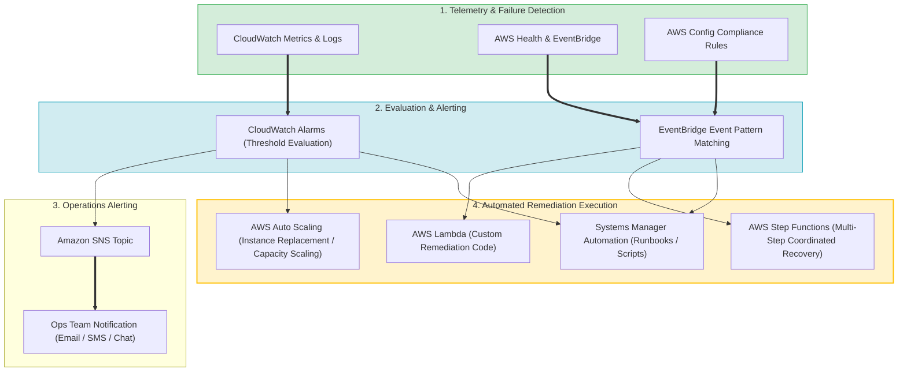
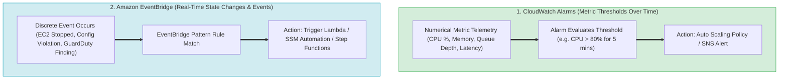
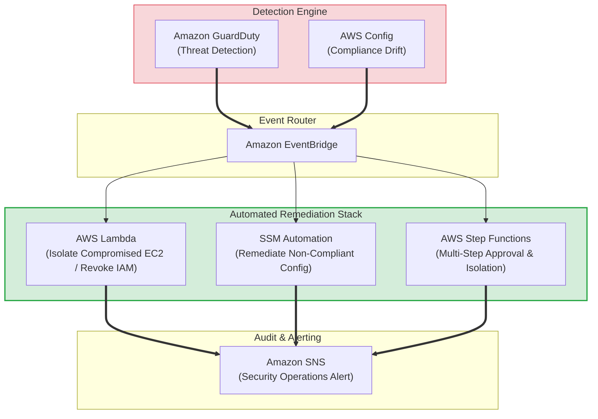
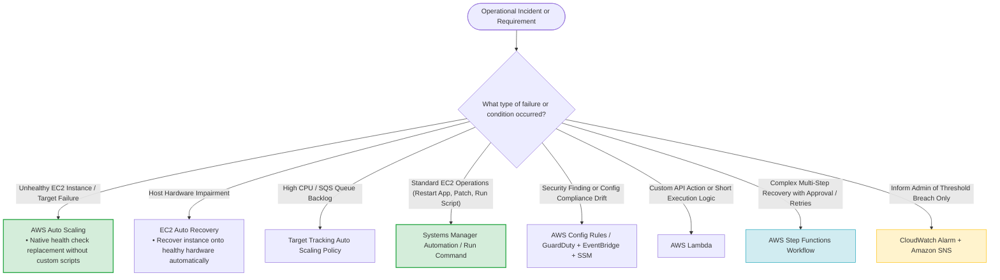
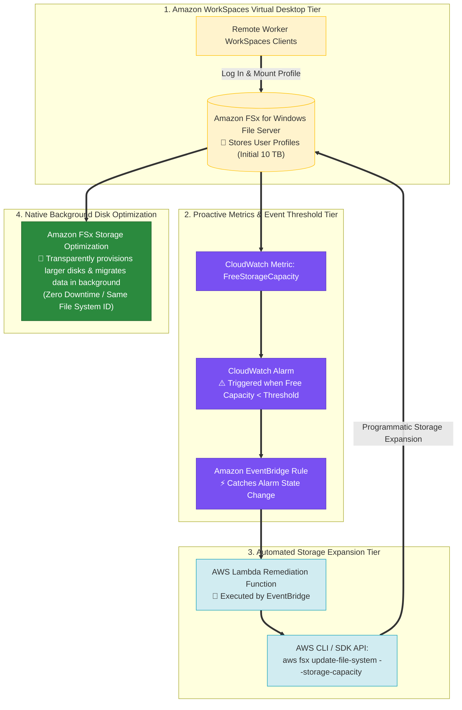

# Task 3.1: Determine a Strategy to Improve Operational Excellence — Alerting and Automatic Remediation Strategies

> [!NOTE]
> **Exam Mindset**: For the AWS Solutions Architect Professional (SAP-C02) and AI Practitioner (AIP-C01) exams, operational excellence requires moving from reactive human intervention to proactive, automated self-healing.
> Evaluate operational remediation across a 5-step lifecycle:
> **Detect** $\rightarrow$ **Alert** $\rightarrow$ **Decide** $\rightarrow$ **Remediate** $\rightarrow$ **Verify**.

---

## 1. End-to-End Self-Healing Operational Excellence Pipeline



---

## 2. Core Alerting & Remediation Mechanisms Matrix

| Operational Capability | Primary Function | Trigger Mechanism | Key Exam Keyword Trigger |
| :--- | :--- | :--- | :--- |
| **CloudWatch Alarms** | Metric threshold evaluation over time | Metrics crossing static/anomaly limit | *"Notify / Alert when CPU exceeds 80%"* |
| **Amazon EventBridge** | Event pattern matching & routing | Real-time state change / Security finding | *"Event-driven remediation / EC2 state change"* |
| **AWS Auto Scaling** | Native capacity scaling & target replacement | Target health check failure / Metric policy | *"Automatically replace unhealthy EC2 instance"* |
| **EC2 Auto Recovery** | Hardware host failure recovery | Instance status check failure | *"Underlying host impairment recovery"* |
| **SSM Automation** | Pre-packaged operational runbook execution | Alarm / EventBridge / Systems Manager | *"Automate operational tasks across fleet"* |
| **AWS Lambda** | Custom remediation API execution | EventBridge / CloudWatch Alarm / SNS | *"Custom remediation logic / API actions"* |
| **AWS Step Functions** | Multi-step coordinated recovery workflow | EventBridge / API Gateway | *"Multi-step recovery / Human approval step"* |
| **AWS Config** | Compliance auditing & auto-remediation | Resource configuration drift | *"Detect & remediate non-compliant security group"* |

---

## 3. CloudWatch Alarms vs. Amazon EventBridge



> [!IMPORTANT]
> **CloudWatch Alarms vs. EventBridge Rule**:
> - **CloudWatch Alarms**: Evaluate **numerical metrics over time** (*"CPU $> 80\%$ for 5 minutes"*).
> - **Amazon EventBridge**: Evaluates **discrete events & state changes in real time** (*"EC2 instance state changed to STOPPED"* or *"GuardDuty finding generated"*).

---

## 4. Automated Security & Compliance Remediation Stack



---

## 5. Prefer Native AWS Self-Healing Over Custom Automation

> [!TIP]
> **Native Self-Healing Principle**:
> Do **not** write custom Lambda scripts for problems AWS natively handles out-of-the-box.
> - **Unhealthy EC2 Instance Replacement**: Use **AWS Auto Scaling Health Checks**.
> - **Host Hardware Failure**: Use **EC2 Auto Recovery**.
> - **Capacity Pressure / Queue Backlog**: Use **Target Tracking Auto Scaling Policies**.
> - **Patching Fleet**: Use **Systems Manager Patch Manager**.

---

## 6. SAP-C02 Operational Remediation Master Selection Decision Engine



---

## 7. SAP-C02 Exam Keyword Cheat Sheet

```
"Notify operations when CPU exceeds limit"    ──> CloudWatch Alarm + Amazon SNS
"Event-driven remediation for state changes"  ──> Amazon EventBridge + Lambda / SSM Automation
"Automatically replace unhealthy EC2 target"   ──> AWS Auto Scaling Group Health Check
"Underlying host impairment recovery"        ──> EC2 Auto Recovery
"Automate operational runbooks across fleet" ──> Systems Manager Automation
"Remediate non-compliant security groups"    ──> AWS Config Rules + Systems Manager Automation
"Threat detection & automated isolation"      ──> Amazon GuardDuty + EventBridge + Lambda
"Multi-step recovery workflow with approval"  ──> AWS Step Functions State Machine
"Monitor queue backlog & scale workers"      ──> SQS ApproximateNumberOfMessagesVisible + Auto Scaling
```

---

## 7.1 Real-World Exam Scenario: Automated In-Place FSx Storage Capacity Expansion (CloudWatch Alarm + EventBridge + Lambda `update-file-system` vs. Manual Migration, Step Functions & Dynamic Allocate Traps)

- **Scenario**: Amazon WorkSpaces remote workers report that they cannot log in to their virtual desktops. Investigation reveals that the 10 TB Amazon FSx for Windows File Server file system storing user profiles reached 100% capacity. The Solutions Architect must resolve the outage and automatically prevent future storage exhaustion without manual data migration. What is the recommended solution?
- **Architecture Solution**:
  - Create an **Amazon CloudWatch Alarm** to monitor the `FreeStorageCapacity` metric of the FSx file system.
  - Write an **AWS Lambda function** to expand the storage capacity of the existing FSx for Windows File Server using the `update-file-system` command/API (`aws fsx update-file-system`).
  - Configure **Amazon EventBridge** to invoke the Lambda function automatically when the CloudWatch Alarm threshold is reached.



### Key Technical Rationale:
1. **Programmatic In-Place FSx Storage Capacity Expansion**:
   - Amazon FSx for Windows File Server supports non-disruptive, in-place storage capacity expansion via the `update-file-system` API action (`aws fsx update-file-system`).
   - When storage capacity is increased, FSx automatically adds larger storage disks in the background and transparently migrates data from old to new disks without interrupting active SMB client connections or changing the file system ID.
2. **Event-Driven Automated Self-Healing**:
   - Monitoring the `FreeStorageCapacity` metric via a CloudWatch Alarm and connecting it to Lambda via EventBridge provides an automated, self-healing storage tier that prevents storage exhaustion without human intervention.

### Why Distractor Options Fail:
- *Enabling the "Dynamically Allocate" option in the FSx Console*:
  - **Fictional Feature**: Amazon FSx for Windows File Server does NOT have a native "Dynamically Allocate" checkbox setting. FSx storage expansion must be triggered explicitly via Console, CLI (`update-file-system`), or SDK API.
- *Creating a New FSx File System and Copying User Profiles via Scripts*:
  - **Unnecessary Operational Overhead**: Creating a new FSx file system and manually running data copy scripts across 10 TB is slow, disruptive, and unnecessary. FSx natively expands storage and migrates data transparently on the existing file system ID.
- *Using Step Functions to Migrate Profiles to a New FSx File System*:
  - **Redundant Orchestration**: Step Functions workflows to copy user profiles are redundant because FSx automatically provisions larger disks and migrates data in the background when `update-file-system` is invoked on the existing file system.

---

## 8. SAP-C02 Exam Keyword Cheat Sheet


1. **Trap 1: Building Custom Lambda Scripts when ASG Solves it Natively**: Writing Lambda functions to terminate and launch EC2 instances when an ALB target fails adds unnecessary operational code. Use **Auto Scaling Group Health Checks**.
2. **Trap 2: Confusing CloudWatch Alarms with EventBridge Rules**: CloudWatch Alarms evaluate continuous numerical metrics over time. EventBridge matches real-time discrete JSON event payloads.
3. **Trap 3: Assuming AWS Budgets or Alarms Automatically Stop Resources**: Budgets and Alarms emit notifications. They do **not** automatically stop instances unless hooked into automation (Lambda/SSM).
4. **Trap 4: Triggering Uncontrolled Destructive Automation**: Automatic remediation of database failures without human approval can cause data loss. For destructive recovery actions, use **Step Functions workflows with approval steps**.

---

## 9. Final Mental Model

`Detect (CloudWatch/GuardDuty/Config) ➔ Match Metric/Event ➔ Prefer Native Self-Healing (ASG/Auto-Recovery) ➔ Use Managed Automation (SSM) ➔ Use Custom Code (Lambda/Step Functions) for Complex Logic`