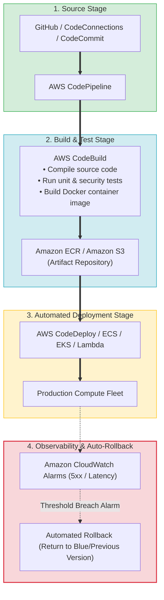
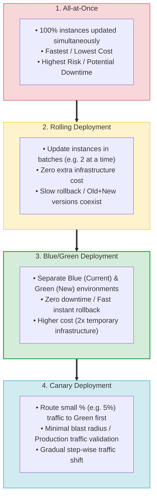
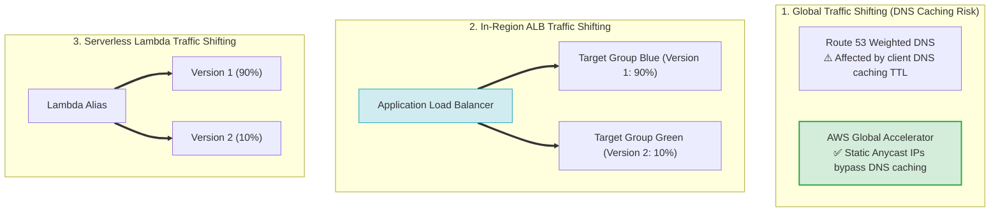
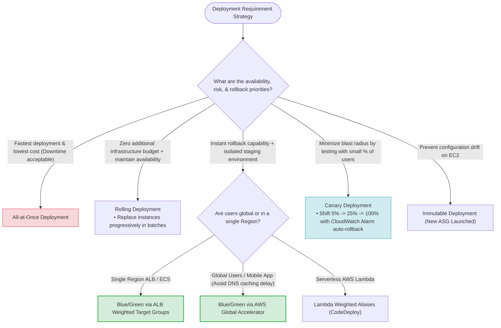
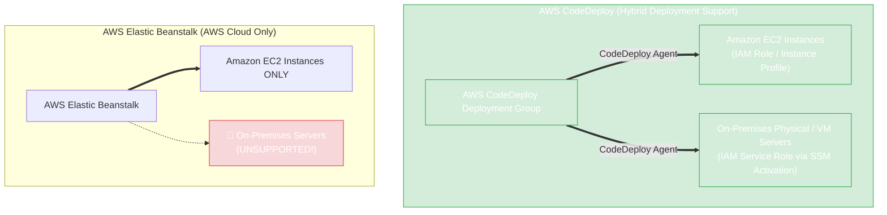
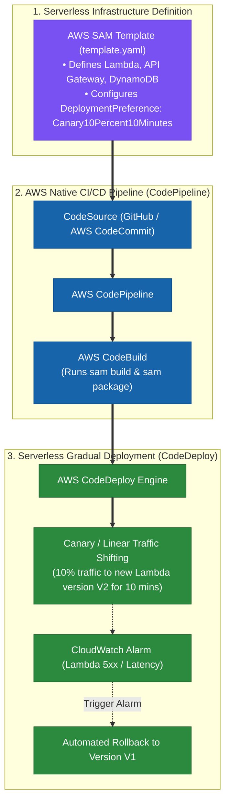
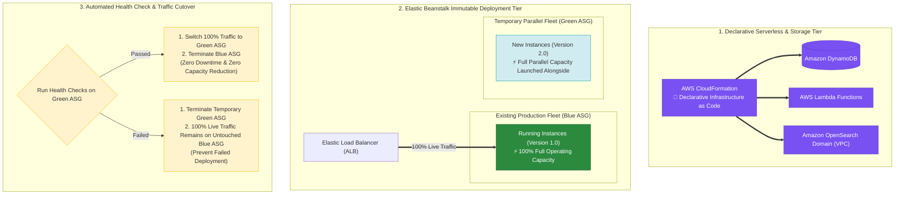

# Task 3.1: Determine a Strategy to Improve Operational Excellence — CI/CD Pipelines and Deployment Strategies

> [!NOTE]
> **Exam Mindset**: For the AWS Solutions Architect Professional (SAP-C02) and AI Practitioner (AIP-C01) exams, CI/CD is evaluated as a controlled, automated pipeline moving code safely into production:
> **Code** $\rightarrow$ **Build** $\rightarrow$ **Test** $\rightarrow$ **Deploy** $\rightarrow$ **Validate** $\rightarrow$ **Monitor** $\rightarrow$ **Auto-Rollback**.
> Always select deployment strategies based on:
> **Availability SLAs** $\rightarrow$ **Rollback Speed** $\rightarrow$ **Blast Radius Tolerance** $\rightarrow$ **Infrastructure Cost** $\rightarrow$ **DNS Caching Limitations**.

---

## 1. End-to-End AWS Native CI/CD Pipeline Architecture



---

## 2. Core Deployment Strategies Comparison Matrix

| Strategy | Availability Impact | Rollback Speed | Extra Infrastructure Cost | Blast Radius | Key Exam Keyword Trigger |
| :--- | :--- | :--- | :--- | :--- | :--- |
| **All-at-Once** | Potential Downtime | Slow (Re-deploy old build)| **Zero ($0$)** | **High** ($100\%$ fleet) | *"Fastest deployment / Lowest cost / Downtime acceptable"* |
| **Rolling** | High Availability | Moderate | **Zero ($0$)** (In-place) | **Medium** (Batch size) | *"Gradually replace instances / Zero extra capacity cost"* |
| **Blue/Green** | **Zero Downtime** | **Instant** (Switch traffic) | **High** ($2\times$ environment)| **Low** (Pre-tested Green) | *"Fastest rollback / Test new version before traffic switch"* |
| **Canary** | **Zero Downtime** | **Fast** (Revert % shift) | Low to Medium | **Lowest** (Small % users) | *"Small percentage of users / Minimize blast radius"* |
| **Immutable** | **Zero Downtime** | Fast (Terminate new ASG)| Medium ($1\times$ temporary ASG)| Low | *"Prevent configuration drift / New fresh instances"* |

---

## 3. Deployment Strategies Spectrum (Risk vs. Cost vs. Speed vs. Rollback)



---

## 4. Traffic Shifting Mechanics: Route 53 vs. Global Accelerator vs. ALB vs. Lambda



> [!IMPORTANT]
> **DNS Caching vs. Global Accelerator Rule**:
> - **Route 53 Weighted Routing**: Subject to **client & ISP DNS caching TTLs** (mobile clients often ignore low TTLs).
> - **AWS Global Accelerator**: Uses **static Anycast IPs** to route traffic over the AWS global network, enabling **instant traffic shifting** without DNS propagation delay.
> - **ALB Weighted Target Groups**: Enables **in-Region HTTP/HTTPS weighted traffic splits** between Blue & Green target groups.

---

## 5. Database Schema Changes in Blue/Green Deployments

> [!WARNING]
> **The Expand-Migrate-Contract Pattern for Databases**:
> In Blue/Green deployments, both Blue and Green application versions often connect to the **same database**. Destructive schema changes (e.g. deleting a column) will break Blue if instant rollback is required.
> Always implement **backward-compatible database schema changes**:
> 1. **Expand**: Add new columns/tables (supports both V1 and V2).
> 2. **Migrate**: Deploy V2 application and migrate data.
> 3. **Contract**: Remove old columns only after V2 is fully stable and rollback is no longer required.

---

## 6. SAP-C02 Deployment Strategy Master Selection Decision Engine



---

## 6.1 Hybrid Deployment Engine Comparison: AWS CodeDeploy vs. AWS Elastic Beanstalk

When deploying application revisions across **hybrid environments** (on-premises data centers + Amazon EC2 instances), choose **AWS CodeDeploy**:



### Architectural Comparison Matrix

| Capability / Feature | AWS CodeDeploy | AWS Elastic Beanstalk |
| :--- | :---: | :---: |
| **Deploy to On-Premises Servers** | **YES (Fully Supported via CodeDeploy Agent)** | ❌ **NO (Unsupported)** |
| **Deploy to Amazon EC2** | **YES** | **YES** |
| **Deploy to ECS & Lambda** | **YES** | ❌ NO (EC2 / Docker on EC2 only) |
| **IAM Authentication Mechanism** | EC2: **IAM Instance Profile**<br/>On-Premises: **IAM Service Role** | EC2: **IAM Instance Profile** |
| **Secrets Integration** | **SSM Parameter Store (`SecureString`) / Secrets Manager** | Environment Variables / Parameter Store |

---

## 7.1 Real-World Exam Scenario: Secure Hybrid Node.js Deployment (CodeDeploy + SSM Parameter Store)

- **Scenario**: A global financial company launches a Node.js web app connected to an Amazon RDS MariaDB database. Application servers run on both **on-premises servers** and **Reserved EC2 instances**. Database credentials must be encrypted at rest and in transit. The architect must automate application deployment across all servers in the **MOST secure manner**. What is the optimal architecture?
- **Architecture Solution**:
  1. Store database credentials as a `SecureString` parameter in **AWS Systems Manager Parameter Store** (encrypted with AWS KMS).
  2. Install the **AWS SSM Agent** on all EC2 and on-premises servers.
  3. Associate an **IAM Role** (Instance Profile) to the EC2 instances, and create an **IAM Service Role** for the on-premises servers to grant access and KMS decryption rights for the SSM Parameter.
  4. Deploy application packages to both EC2 instances and on-premises servers using **AWS CodeDeploy**.

### Key Technical Rationale:
1. **CodeDeploy Hybrid Deployment Capability**: **AWS CodeDeploy** natively supports deploying code packages to both Amazon EC2 instances and on-premises servers using the CodeDeploy agent.
2. **SSM Parameter Store `SecureString`**: Encrypts credentials at rest with AWS KMS and decrypts them in transit when requested by authorized IAM entities.
3. **EC2 IAM Role vs. On-Premises IAM Service Role**:
   - EC2 instances authenticate using an **IAM Role attached to an Instance Profile**.
   - Hybrid on-premises servers authenticate using an **IAM Service Role** via SSM Managed Instance Activations (`AmazonSSMDirectoryServiceAccess`).

### Why Distractor Options Fail:
- *Deploying to On-Premises Servers via AWS Elastic Beanstalk*: **AWS Elastic Beanstalk cannot deploy applications to on-premises servers**. Elastic Beanstalk only manages AWS-hosted infrastructure (EC2, ASG, ELB).
- *Attaching an IAM Policy directly to instances instead of IAM Roles*: Permissions cannot be attached directly to servers as raw IAM Policies. EC2 instances require **IAM Roles** (Instance Profiles), and on-premises servers require **IAM Service Roles** through SSM Activations.

---

## 7.2 Real-World Exam Scenario 2: Serverless CI/CD & Gradual Lambda Deployment (AWS SAM + CodePipeline + CodeDeploy)

- **Scenario**: A company decommissions a legacy EC2 web application and builds a new serverless architecture using **AWS Lambda, Amazon API Gateway, and Amazon DynamoDB**. The team needs to set up a CI/CD pipeline to automate the build process and support **gradual deployments** (Canary or Linear traffic shifting) because an all-at-once deployment strategy failed to meet business requirements. What is the most suitable architecture?
- **Architecture Solution**:
  - Use the **AWS Serverless Application Model (AWS SAM)** to define and package serverless resources. Set up a CI/CD pipeline using **AWS CodeBuild, AWS CodeDeploy, and AWS CodePipeline** to automate builds and execute gradual deployments.



### Key Technical Rationale:
1. **AWS SAM for Serverless IaC**: AWS SAM extends AWS CloudFormation to provide shorthand syntax for defining serverless applications (Lambda functions, API Gateway APIs, DynamoDB tables) as a single versioned entity.
2. **Native CodeDeploy Gradual Traffic Shifting**: AWS SAM natively integrates with **AWS CodeDeploy** via `DeploymentPreference` settings. CodeDeploy automatically shifts traffic between Lambda version aliases (e.g. `Canary10Percent10Minutes` or `Linear10PercentEvery1Minute`) and monitors CloudWatch Alarms to automatically roll back if errors occur.
3. **AWS Native Pipeline Stack**: **AWS CodePipeline** orchestrates the workflow stages, **AWS CodeBuild** executes `sam build` and `sam package`, and **AWS CodeDeploy** executes gradual serverless traffic shifting.

### Why Distractor Options Fail:
- *Systems Manager Automation for Build & Gradual Deployments (Your Selection)*: **AWS Systems Manager (SSM) Automation** is designed to manage EC2 operating system configurations, OS patching, and operational runbooks on VMs. SSM Automation cannot package serverless applications or manage gradual Lambda version traffic shifting!
- *AWS Elastic Beanstalk*: Elastic Beanstalk provisions and deploys applications onto EC2 instance fleets; it is not designed for serverless architectures (Lambda + API Gateway + DynamoDB).
- *AWS Serverless Application Repository (SAR)*: SAR is a managed catalog for discovering and sharing serverless application templates. SAR does NOT automate CI/CD build pipelines or execute gradual deployment rollouts.

---

## 7.2 Real-World Exam Scenario 2: Zero Downtime & Full Capacity Enterprise Deployment (Elastic Beanstalk Immutable Policy + CodeDeploy Blue/Green & CloudFormation vs. All-at-Once, Rolling & Lightsail Traps)

- **Scenario**: An enterprise ERP application processes supply chain, order management, and delivery tracking. Public REST web services use AWS Lambda, DynamoDB, and Amazon OpenSearch in a VPC. The architecture must ensure zero downtime on failed deployments, prevent subsequent failed deployments via automatic rollback, and **strictly maintain full compute capacity during deployment without any capacity reduction**. What is the most efficient solution?
- **Architecture Solution**:
  - Execute **Blue/Green deployments for upcoming changes using AWS CodeDeploy**.
  - Launch DynamoDB tables, Lambda functions, and OpenSearch domains using **AWS CloudFormation**.
  - Host the web application in **AWS Elastic Beanstalk and set the deployment policy to `Immutable`**.



### Key Technical Rationale:
1. **Elastic Beanstalk `Immutable` Deployment Policy for Full Capacity**:
   - An `Immutable` deployment policy provisions a full set of brand new EC2 instances in a temporary Auto Scaling Group alongside the existing running instances.
   - Because the existing instances remain untouched at 100% capacity while new instances are provisioned and tested, the environment **strictly maintains full compute capacity without any capacity reduction**.
   - If the new version fails health checks, Elastic Beanstalk immediately terminates the temporary instances, leaving the original instances operating at 100% capacity with zero downtime.
2. **AWS CodeDeploy Blue/Green for Serverless/Compute Deployment**:
   - CodeDeploy automates Blue/Green deployment cutovers and integrates with CloudWatch Alarms for automated rollback on error threshold breaches.

### Why Distractor Options Fail:
- *Elastic Beanstalk "All-at-Once" Deployment Policy*:
  - **100% Downtime Failure**: All-at-Once deploys the new application version to all instances simultaneously, taking the entire environment out of service for the duration of the deployment.
- *Elastic Beanstalk "Rolling" Deployment Policy*:
  - **Capacity Reduction Failure**: Rolling deployment updates instances in sequential batches, taking each batch out of service during the update phase. This reduces overall compute capacity by the size of the batch (e.g. 50% capacity reduction during a 2-batch deployment), violating the strict full-capacity mandate!
- *Amazon Lightsail for Enterprise ERP Applications*:
  - **Dev/Test Scope**: Amazon Lightsail is designed for simple, low-cost websites or Dev/Test environments; it lacks enterprise-grade Blue/Green automated deployment integration, VPC OpenSearch orchestration, and advanced deployment policies.

---


## 8. SAP-C02 Exam Keyword Cheat Sheet

```
"Deploy to all instances simultaneously / Lowest cost"  ──> All-at-Once Deployment
"Gradually replace instances in batches / Maintain HA" ──> Rolling Deployment
"Two identical environments / Instant rollback"         ──> Blue/Green Deployment
"Small percentage of production users / Minimal blast"  ──> Canary Deployment
"Build, test, & gradually deploy serverless Lambda"     ──> AWS SAM + CodePipeline + CodeBuild + CodeDeploy
"Automate serverless gradual deployment via SSM"      ──> ❌ FAILS (SSM Automation is for EC2/VM runbooks!)
"Deploy code to BOTH EC2 and on-premises servers"      ──> AWS CodeDeploy
"Deploy code to on-premises servers via Beanstalk"     ──> ❌ FAILS (Beanstalk cannot deploy to on-prem!)
"Encrypt DB credentials for hybrid servers"           ──> SSM Parameter Store (SecureString) + KMS
"On-premises server SSM authentication"               ──> IAM Service Role via SSM Hybrid Activations
"Global users + mobile clients + bypass DNS caching"   ──> AWS Global Accelerator
"Weighted HTTP traffic shifting in same Region"        ──> ALB Weighted Target Groups
"Shift percentage traffic between Lambda versions"      ──> Lambda Weighted Aliases / AWS SAM DeploymentPreference
"Compile code & run unit tests without build servers"   ──> AWS CodeBuild
"Pipeline stage orchestration & approval gates"        ──> AWS CodePipeline
"Automate EC2/ECS/Lambda deployment execution"          ──> AWS CodeDeploy
"Automated rollback on error metrics"                  ──> CodeDeploy + CloudWatch Alarm Integration
```

---

## 9. Common SAP-C02 Exam Traps

1. **Trap 1: Selecting Route 53 for Mobile App Blue/Green Traffic Shifting**: Mobile OSs heavily cache DNS responses. If rapid traffic shifting or instant rollback is required for mobile clients, choose **AWS Global Accelerator** or **ALB Weighted Target Groups**.
2. **Trap 2: Destructive Database Migrations in Blue/Green**: Dropping database columns during Green deployment breaks Blue during rollback. Use **backward-compatible schema migrations (Expand-Migrate-Contract)**.
3. **Trap 3: Using Jenkins for AWS-Native Pipeline when Minimal Ops is Requested**: Operating self-managed Jenkins servers requires patching and scaling. For minimal operational overhead, select **AWS CodePipeline + AWS CodeBuild**.
4. **Trap 4: Confusing Continuous Delivery with Continuous Deployment**: Continuous *Delivery* includes a manual approval gate before production; Continuous *Deployment* automatically deploys every passed build to production.
5. **Trap 5: Selecting Elastic Beanstalk for Deploying to On-Premises Servers**: Elastic Beanstalk only provisions and deploys to AWS cloud resources (EC2). To deploy code packages to **on-premises physical or virtual servers**, always select **AWS CodeDeploy** with the CodeDeploy Agent and SSM Hybrid Service Roles.
6. **Trap 6: Using Systems Manager Automation for Serverless Deployments**: AWS Systems Manager Automation manages EC2 instance configurations, OS patching, and VM scripts. To build and deploy serverless applications (Lambda + API Gateway + DynamoDB) with gradual traffic shifting, always select **AWS SAM + CodePipeline + CodeBuild + CodeDeploy**.
7. **Trap 7: Selecting Elastic Beanstalk Rolling or All-at-Once when Full Capacity is Required Without Reduction**: Rolling deployments take instance batches out of service sequentially (reducing compute capacity), while All-at-Once takes all instances down simultaneously (causing 100% downtime). When a deployment must **strictly maintain 100% full capacity without any capacity reduction** and ensure zero downtime on failed deployments, set the Elastic Beanstalk deployment policy to **`Immutable`** (which launches a temporary parallel ASG fleet alongside the running fleet).

---


## 10. Final Mental Model

`All-at-Once (Fast/Cheapest/Risk) ➔ Rolling (Batches/Zero Extra Cost) ➔ Blue/Green (Isolated/Instant Rollback) ➔ Canary (Minimal Blast Radius) ➔ CodeDeploy (Hybrid EC2 + On-Premises & Serverless SAM Gradual Rollout)`