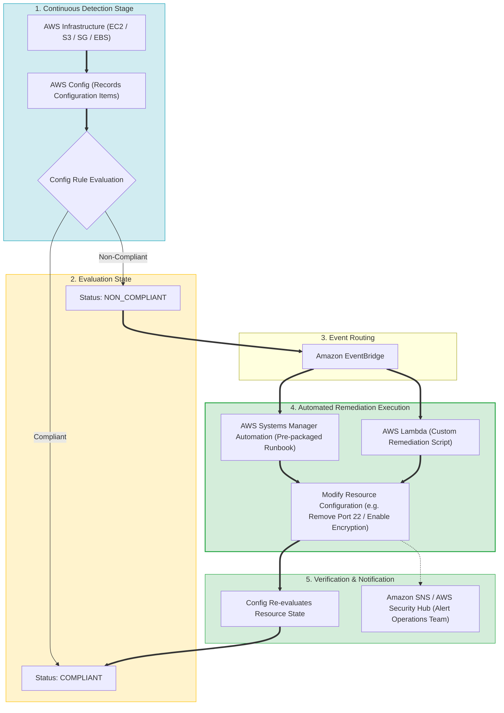
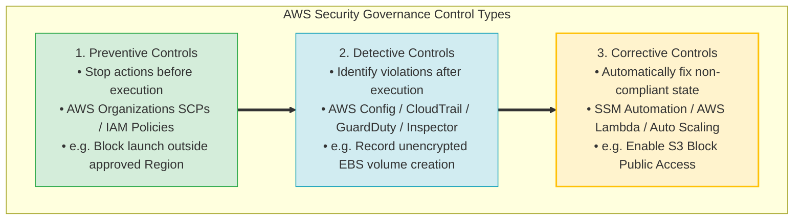
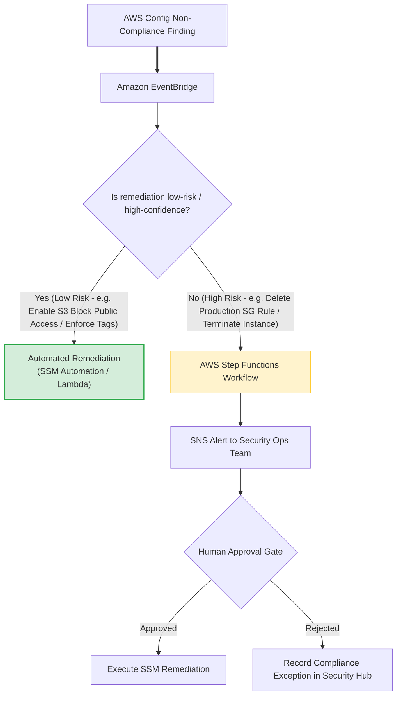
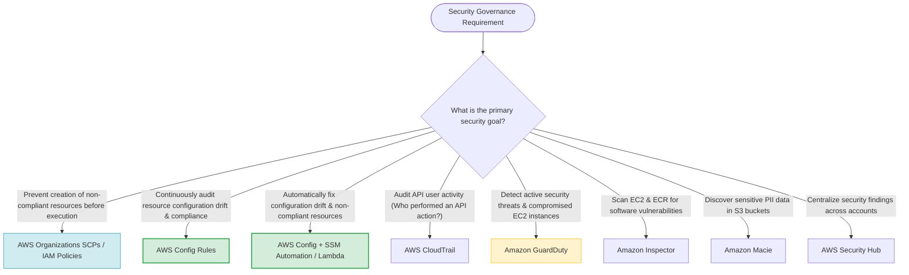
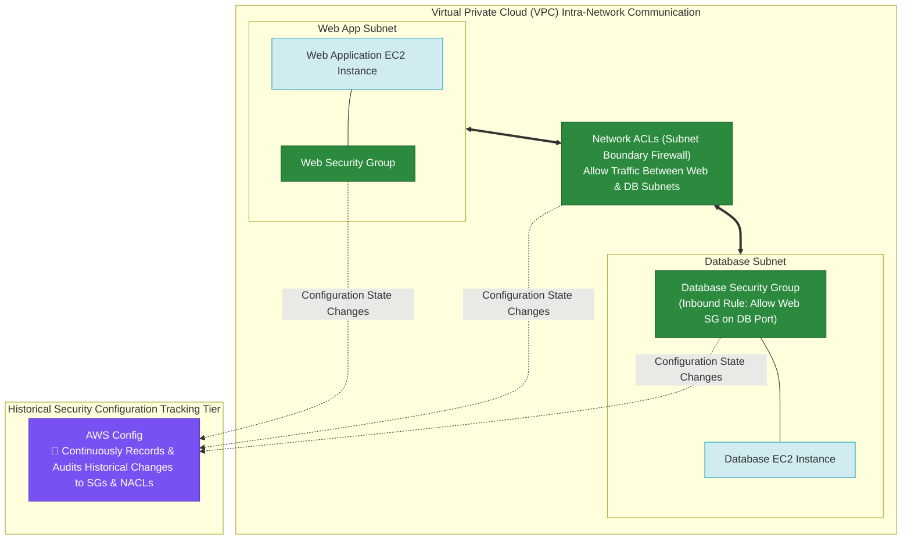

> [!NOTE]
> **Exam Mindset**: For the AWS Solutions Architect Professional (SAP-C02) and AI Practitioner (AIP-C01) exams, automated security monitoring and remediation addresses **configuration drift**:
> **Detect Configuration Drift (AWS Config)** $\rightarrow$ **Evaluate Policy Compliance** $\rightarrow$ **Route Event (EventBridge)** $\rightarrow$ **Automatically Remediate (SSM Automation / Lambda)** $\rightarrow$ **Continuously Verify State**.

---

## 1. End-to-End Automated Monitoring & Remediation Pipeline



---

## 2. Core Security Control Types Breakdown Matrix

| Control Classification | Primary Function | Key AWS Services | Key Exam Keyword Trigger |
| :--- | :--- | :--- | :--- |
| **Preventive Controls** | Block non-compliant actions before execution | **AWS Organizations SCPs, IAM Policies** | *"Prevent creation / Block deployment outside region"* |
| **Detective Controls** | Identify non-compliant resource states & threats | **AWS Config Rules, CloudTrail, GuardDuty, Macie** | *"Evaluate configuration compliance / Detect PII / Audit API"* |
| **Corrective Controls** | Automatically repair non-compliant configurations | **Systems Manager Automation, AWS Lambda** | *"Automatically remediate / Fix configuration drift"* |

---

## 3. Security Service Comparison: Config vs. CloudTrail vs. GuardDuty

| Security Service | Core Focus | Operational Question Answered | Primary Exam Trigger Keyword |
| :--- | :--- | :--- | :--- |
| **AWS Config** | Resource configuration compliance & drift | *"Is my infrastructure configured according to policy?"* | *"Configuration drift / Encrypted volume check / S3 public block"* |
| **AWS CloudTrail** | API user activity & identity auditing | *"Who performed what AWS API action & when?"* | *"Who deleted the S3 bucket? / Who changed the security group?"* |
| **Amazon GuardDuty** | Intelligent threat & anomaly detection | *"Is there suspicious or malicious activity in my account?"* | *"Threat detection / Malicious EC2 behavior / DNS exfiltration"* |
| **Amazon Inspector** | Vulnerability management & CVE scanning | *"Are there software vulnerabilities in my EC2/ECR workloads?"* | *"CVE vulnerability scanning / Container image security"* |

---

## 4. Preventive vs. Detective vs. Corrective Controls Spectrum



---

## 5. Automated Security & Compliance Remediation Stack with Risk Approval Gate



> [!IMPORTANT]
> **Remediation Risk & Human Approval Gates**:
> Automated remediation should be **immediate** for low-risk, high-confidence violations (e.g. enabling S3 Block Public Access).
> For potentially **disruptive remediations** (e.g. modifying live production security groups or terminating EC2 instances), route findings through **AWS Step Functions** or **Amazon SNS** to incorporate a **human approval step** before executing remediation.

---

## 6. Config Conformance Packs for Multi-Account Governance

> [!TIP]
> **Config Conformance Packs**:
> A Conformance Pack is a collection of **AWS Config rules and remediation actions** packaged into a single YAML template.
> Use **AWS Organizations** to deploy standardized Conformance Packs across hundreds of spoke accounts simultaneously to enforce enterprise compliance baselines (e.g. PCI-DSS, NIST-800-53, or CIS Benchmarks).

---

## 7. SAP-C02 Security Governance & Remediation Master Selection Decision Engine



---

## 8. SAP-C02 Exam Keyword Cheat Sheet

```
"Continuous configuration compliance auditing"     ──> AWS Config Rules
"Audit resource configuration drift"               ──> AWS Config Rules
"Automatically remediate configuration drift"       ──> AWS Config + Systems Manager Automation
"Execute custom remediation code"                  ──> AWS Config + EventBridge + AWS Lambda
"Deploy standardized compliance rule baselines"     ──> AWS Config Conformance Packs
"Prevent resource creation outside approved Region" ──> AWS Organizations Service Control Policies (SCPs)
"Audit API user calls & identity actions"           ──> AWS CloudTrail
"Intelligent threat detection & DNS anomalies"      ──> Amazon GuardDuty
"Software vulnerability scanning for EC2/ECR"      ──> Amazon Inspector
"Centralized security findings dashboard"           ──> AWS Security Hub
```

---

## 7.5 Real-World Exam Scenario: Intra-VPC Communication & Historical Security Configuration Audit (Select TWO)

- **Scenario**: An online gambling site runs on 2 EC2 instances inside a VPC across different subnets (a web application instance and a database instance). The architect must (1) ensure the two instances can communicate over the network, and (2) track historical changes to the security configurations associated with the instances over time. What TWO options fulfill the requirements? (Select TWO)
- **Architecture Solutions (Select TWO)**:
  1. **Security Groups & Network ACLs**: Configure Network ACLs to allow inbound/outbound communication between the subnets, and configure Security Groups on the database instance to allow inbound traffic from the web application host security group/IP on the database port.
  2. **AWS Config**: Use **AWS Config** to continuously record, audit, and evaluate historical changes to the security group and NACL configurations associated with the instances.



### Key Technical Rationale:
1. **Intra-VPC Subnet Security (Security Groups & NACLs)**:
   - Traffic between instances in different subnets within the same VPC is routed locally via the VPC local route table (`10.0.0.0/16 local`).
   - Security Groups (stateful instance firewalls) and Network ACLs (stateless subnet firewalls) govern packet flows. Allowing traffic in NACLs and configuring the DB Security Group to accept traffic from the Web SG enables secure communication.
2. **AWS Config for Historical Security Tracking**:
   - **AWS Config** continuously monitors, records, and audits configuration changes to AWS resources (Security Groups, NACLs, EC2, IAM). It maintains a historical timeline of security group rule modifications for compliance auditing.

### Why Distractor Options Fail:
- *AWS Systems Manager for Security Configuration Tracking*:
  - **AWS Systems Manager** manages EC2 OS patching, automation runbooks, and remote shell sessions (Session Manager). SSM does NOT record or track historical configuration timelines or audit rule changes for AWS infrastructure resources like Security Groups (AWS Config performs this function).
- *Internet Gateway (IGW) or NAT Instance*:
  - Intra-VPC traffic between subnets is routed locally via the VPC router. An Internet Gateway (IGW) or NAT Instance is for public internet egress/ingress, NOT for internal VPC subnet-to-subnet traffic!
- *Amazon Route 53 for Subnet Routing*:
  - **Amazon Route 53** is a DNS domain name resolution service; it does NOT route IP packets between VPC subnets.

---

## 9. Common SAP-C02 Exam Traps

1. **Trap 1: Confusing Preventive Controls (SCPs) with Detective Controls (AWS Config)**: SCPs *prevent* non-compliant API calls from succeeding; AWS Config *detects* configuration violations after resources are created.
2. **Trap 2: Choosing CloudTrail for Resource Configuration State**: CloudTrail records event logs (*who called what API*); AWS Config evaluates the *resulting state and compliance* of the resource.
3. **Trap 3: Selecting Automatic Remediation when Disruptive Action Requires Approval**: Automatically deleting production security group rules can break running applications. Use **Step Functions approval gates** for high-risk actions.
4. **Trap 4: Using GuardDuty for Configuration Compliance**: GuardDuty detects *malicious threats and unusual behavior*; AWS Config evaluates *static configuration rules*.
5. **Trap 5: Using Systems Manager instead of AWS Config for Infrastructure Security Rule History**: AWS Systems Manager manages OS-level patching and execution tasks. To track and audit historical configuration changes to Security Groups and NACLs, always choose **AWS Config**.

---

## 10. Final Mental Model

`Prevent (SCP/IAM) ➔ Detect State & History (Config) ➔ Route Event (EventBridge) ➔ Remediate (SSM/Lambda) ➔ Centralize (Security Hub)`