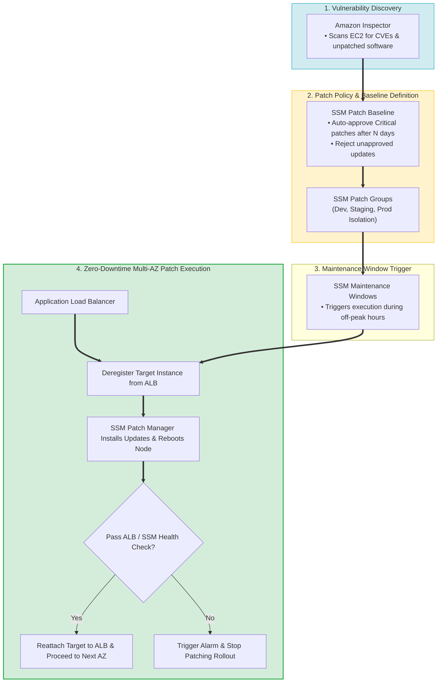
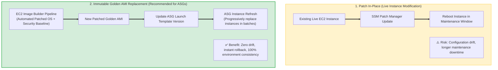
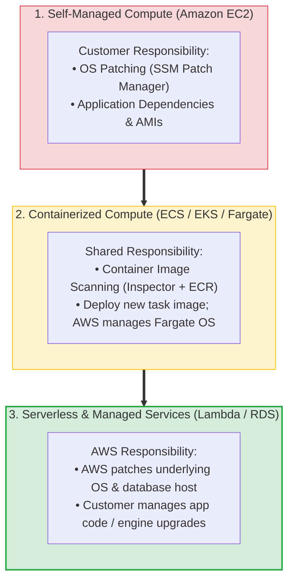
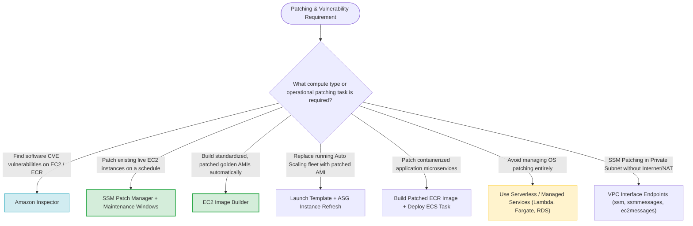
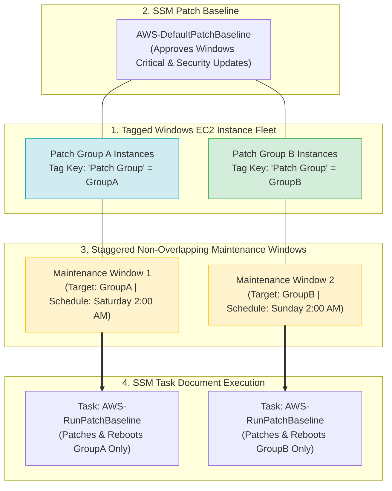
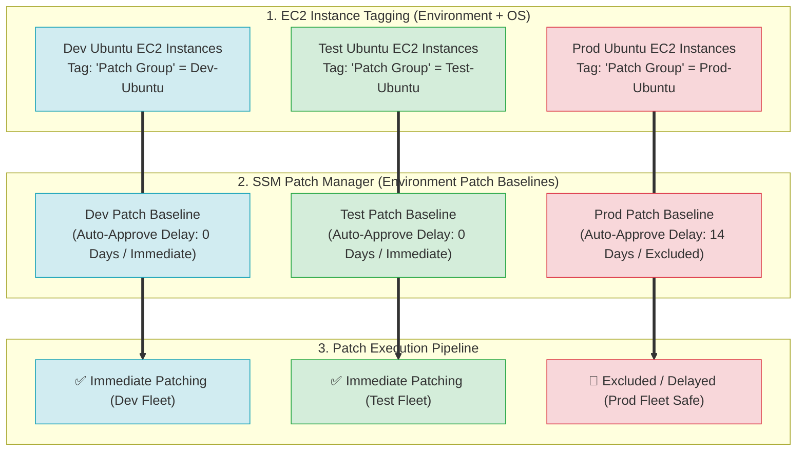
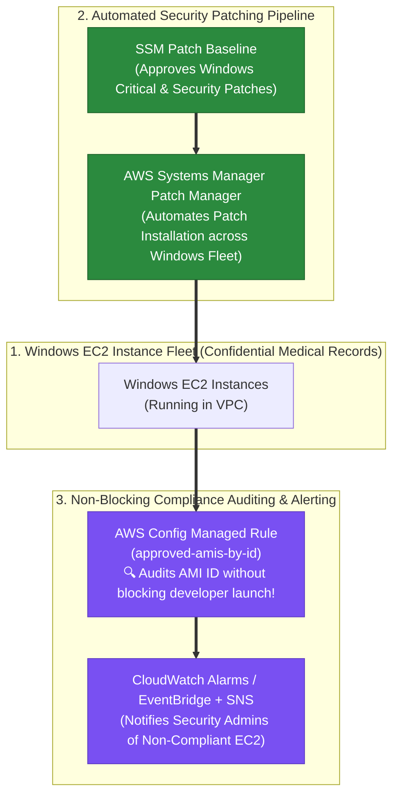
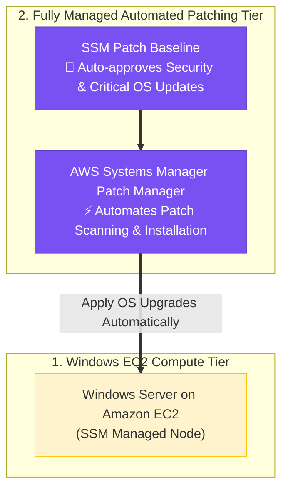

> [!NOTE]
> **Exam Mindset**: For the AWS Solutions Architect Professional (SAP-C02) and AI Practitioner (AIP-C01) exams, patching is evaluated as a security and operational control problem.
> Always select patching strategies based on compute abstraction:
> **Self-Managed EC2 (SSM Patch Manager / Golden AMIs)** $\rightarrow$ **Containers (ECR Image Scanning & Task Replacement)** $\rightarrow$ **Serverless / Managed Services (AWS Managed Infrastructure)**.

---

## 1. End-to-End Automated Fleet Patching Pipeline



---

## 2. Patch In-Place vs. Immutable Golden AMI Replacement



---

## 3. Patching Strategy Comparison Breakdown

| Strategy | Applicable Compute | Operational Overhead | Drift Protection | Key Exam Trigger Keyword |
| :--- | :--- | :--- | :--- | :--- |
| **Patch In-Place (SSM Patch Manager)** | Stateful EC2 / Legacy Servers | Moderate | Low (Potential Drift) | *"Automate OS security updates on existing EC2 instances"* |
| **Immutable AMI (EC2 Image Builder)** | Stateless EC2 Fleets / Auto Scaling | Low (Automated Pipeline) | **High (Zero Drift)** | *"Golden AMI / Automated image pipeline / Replace ASG fleet"* |
| **Container Image Replacement** | ECS / EKS / Fargate | Low | **High** | *"Scan ECR container images & deploy updated task definition"* |
| **Managed Infrastructure** | AWS Fargate, Lambda, Amazon RDS | **Lowest (Zero OS Ops)** | **High** | *"Eliminate OS patching overhead / Serverless database"* |

---

## 4. Compute Abstraction & Patching Responsibility Matrix



> [!IMPORTANT]
> **Vulnerability Discovery vs. Patch Execution**:
> - **Amazon Inspector**: Detects and reports **CVE vulnerabilities and unpatched software packages** in EC2 instances and ECR container images.
> - **AWS Systems Manager Patch Manager**: Executes the **installation of approved security patches** on EC2 instances according to defined Patch Baselines and Maintenance Windows.

---

## 5. Private Subnet Connectivity for Systems Manager Patching

> [!TIP]
> **VPC Endpoint Requirement for Private EC2 Patching**:
> To allow EC2 instances in private subnets (without Internet Access or NAT Gateways) to register and receive patches from Systems Manager, deploy **VPC Interface Endpoints (PrivateLink)**:
> 1. `com.amazonaws.[region].ssm`
> 2. `com.amazonaws.[region].ssmmessages`
> 3. `com.amazonaws.[region].ec2messages`

---

## 6. SAP-C02 Patching & Vulnerability Master Selection Decision Engine



---

## 7. SAP-C02 Exam Keyword Cheat Sheet

```
"Automate OS patching on existing EC2 instances"     ──> Systems Manager Patch Manager
"Define approved security patch rules & delay"       ──> SSM Patch Baseline
"Schedule patching outside business hours"           ──> SSM Maintenance Windows
"Build standardized golden AMIs automatically"       ──> EC2 Image Builder
"Replace ASG instances with new patched AMI"        ──> Launch Template + ASG Instance Refresh
"Identify software CVE vulnerabilities in EC2/ECR"   ──> Amazon Inspector
"Private subnet EC2 SSM patching without NAT"        ──> VPC Interface Endpoints (ssm, ssmmessages)
"Eliminate OS patching overhead for databases"       ──> Amazon RDS / Aurora
"Eliminate OS patching overhead for compute"         ──> AWS Lambda / AWS Fargate
```

---

## 8. Common SAP-C02 Exam Traps

1. **Trap 1: Choosing Amazon Inspector to Install Patches**: Inspector discovers vulnerabilities and reports CVE findings; it does **not** install patches. Use **Systems Manager Patch Manager** to apply updates.
2. **Trap 2: Patching In-Place on Stateless Auto Scaling Fleets**: Updating running EC2 instances individually leads to configuration drift. For stateless ASGs, use **EC2 Image Builder** to create a golden AMI and trigger an **ASG Instance Refresh**.
3. **Trap 3: Forgetting Maintenance Windows for Live Server Patching**: Patching live production servers during peak hours causes unexpected reboots. Always attach **SSM Maintenance Windows**.
4. **Trap 4: Attempting to Patch Managed Service OSs Manually**: You do not SSH into RDS, Lambda, or Fargate to apply OS patches. AWS manages underlying infrastructure patching automatically.
5. **Trap 5: Using a Single Patch Group or Single Maintenance Window for Uptime-Critical Fleets**: Patching a large fleet under a single Maintenance Window causes all instances to reboot simultaneously, breaking application uptime. Divide instances into multiple **Patch Groups** (tag key `Patch Group`) and attach them to **non-overlapping Maintenance Windows**.

---

## 8.1 Real-World Exam Scenario: Staggered Automated Windows EC2 Patching without Reboot Downtime

- **Scenario**: A company runs hundreds of Windows EC2 instances on AWS. The Solutions Architect must establish an automated workflow to apply required Windows OS security patches while ensuring that instance reboots **do not occur at the same time** on all servers to maintain system uptime SLAs and avoid revenue loss. What is the most suitable solution?
- **Architecture Solution**:



### Key Technical Rationale:
1. **Multiple Patch Groups (`Patch Group` Tag Key)**: Dividing the instance fleet into two or more **Patch Groups** (using the mandatory case-sensitive tag key `Patch Group`) enables segmenting server reboot schedules.
2. **Predefined Patch Baseline (`AWS-DefaultPatchBaseline`)**: Approves Windows Server operating system patches classified as `CriticalUpdates` or `SecurityUpdates` with `Critical` or `Important` MSRC severity.
3. **Non-Overlapping SSM Maintenance Windows**: Creating two separate maintenance windows with different start times ensures that Group A instances patch/reboot while Group B instances continue serving production traffic, guaranteeing zero application downtime.
4. **SSM Task Document (`AWS-RunPatchBaseline`)**: Assigning `AWS-RunPatchBaseline` as the task within each Maintenance Window automates both scanning and installation of missing approved patches.

### Why Distractor Options Fail:
- *Single Patch Group + Single Maintenance Window*: Patching all servers in one maintenance window causes all EC2 instances to reboot simultaneously, causing full application unavailability and revenue loss.
- *CloudWatch Events + SSM Run Command + State Manager*: State Manager maintains configuration states (e.g. agent versions, firewall rules) and Run Command executes one-off shell scripts; neither provides native scheduled patch baseline management or reboot staggering like **SSM Maintenance Windows + Patch Manager**.

---

## 8.2 Real-World Exam Scenario: Multi-Environment Multi-OS Selective Patching (Dev, Test, Prod Isolation)

- **Scenario**: A company has Development, Test, and Production environments, each with hundreds of EC2 instances running various operating systems (e.g. Ubuntu). A critical OS vulnerability is released. The company must immediately patch all affected EC2 instances in **Dev and Test**, but **exclude Production** until patches are verified. Each environment has different baseline patch rules. What is the least-effort SSM solution?
- **Architecture Solution**:
  1. **Tag each EC2 instance based on BOTH Environment AND OS** (e.g. `Patch Group = Dev-Ubuntu`, `Patch Group = Test-Ubuntu`, `Patch Group = Prod-Ubuntu`).
  2. Create a custom **Patch Baseline in AWS Systems Manager Patch Manager** for each environment (e.g. Dev/Test baselines auto-approve immediately; Prod baseline delays auto-approval).
  3. Categorize EC2 instances into **Patch Groups** using the mandatory tag key **`Patch Group`**.
  4. Register each **Patch Group** to its corresponding environment **Patch Baseline** and apply the patches.



### Key Technical Rationale:
1. **Tagging by BOTH Environment AND OS**: Tagging instances by OS alone (e.g. `OS = Ubuntu`) would cause Patch Manager to patch ALL Ubuntu servers across ALL environments—including Production—causing catastrophic unverified reboots! You **MUST** tag by both **Environment AND OS** (e.g. `Patch Group = Dev-Ubuntu`).
2. **Patch Baselines per Environment**: Creating separate Patch Baselines allows defining different auto-approval delays, approved patches, and rejected patches per environment.
3. **Patch Groups**: The case-sensitive tag key **`Patch Group`** maps target EC2 instances directly to their designated Patch Baseline in Patch Manager.

### Why Distractor Options Fail:
- *Tagging based ONLY on OS*: Tagging by OS alone applies the Ubuntu patch to Production at the same time as Dev/Test, violating the requirement to keep Production unpatched until verified.
- *Custom Shell Scripts via SSM Run Command*: Writing custom bash/shell scripts to evaluate patch versions and executing via Run Command introduces high manual scripting and maintenance effort compared to native **SSM Patch Manager**.
- *CloudWatch Events Cron + State Manager*: State Manager maintains static node configuration states; it is not designed to govern environment-specific patch approval delays or selective baseline exclusions.

---

## 8.3 Real-World Exam Scenario 3: Automated Windows EC2 Patch Baseline & AWS Config AMI Governance

- **Scenario**: A clinic runs a medical records system using a fleet of Windows EC2 instances storing confidential patient health files. Requirements:
  - Latest security patches must be installed on all EC2 instances.
  - The system must check if running EC2 instances are using an approved Amazon Machine Image (AMI).
  - The governance solution must **NOT** impede developers from launching instances with unapproved AMIs, but must notify administrators if non-compliant instances are running in the VPC.
  What TWO options should the Solutions Architect implement? (Select TWO)
- **Architecture Solution (Select TWO)**:
  1. **Automated Security Patching**: Set up a **Patch Baseline** that defines which patches are approved for installation on your instances using **AWS Systems Manager Patch Manager**.
  2. **Non-Blocking AMI Governance & Alerting**: Use an **AWS Config Managed Rule** (`approved-amis-by-id`) which automatically checks whether running EC2 instances are using approved AMIs. Set up **CloudWatch Alarms** (or EventBridge) to notify administrators if non-compliant instances are detected.



### Key Technical Rationale:
1. **SSM Patch Manager + Patch Baseline**: SSM Patch Manager uses patch baselines to auto-approve OS security updates for Windows Server fleets within a set timeframe, keeping confidential health record servers fully patched.
2. **AWS Config Managed Rule for Non-Blocking Auditing**: The AWS Config managed rule `approved-amis-by-id` evaluates whether running instances use authorized AMIs. AWS Config operates asynchronously and passively—it **does NOT block developers** from launching instances, fulfilling the constraint to avoid impeding developer workflows while alerting admins via CloudWatch/EventBridge.

### Why Distractor Options Fail:
- *IAM Policy Restricting Unapproved AMIs*: Attaching an IAM policy with explicit `Deny` rules prevents developers from launching EC2 instances with unapproved AMIs. This explicitly **impedes developers**, violating the scenario requirement.
- *Amazon GuardDuty for Patching & AMI Audit*: Amazon GuardDuty is an intelligent threat detection service analyzing VPC Flow Logs, DNS logs, and CloudTrail for compromised hosts or unauthorized API calls. GuardDuty does **NOT** check OS patch baselines or audit AMI compliance.
- *AWS Shield Advanced*: AWS Shield Advanced provides DDoS attack mitigation for L3/L4/L7 network traffic; it cannot patch operating systems or audit EC2 AMIs.

---

### Scenario 8.4: Automated Windows Server OS Updates (SSM Patch Manager vs. AppSync, CloudShell & Lightsail Lambda Traps)

- **Scenario**: A company hosts a Microsoft Windows Server on Amazon EC2. The server must always have the latest operating system upgrades installed to maintain security. System administrators need to automate patching activities with the **least amount of administrative overhead**. What is the recommended solution?
- **Architecture Solution**:
  - Launch the Windows Server on Amazon EC2 instances.
  - Use **AWS Systems Manager (SSM) Patch Manager** to automate OS patch management, configuring it to automatically apply patches as they become available.



### Key Technical Rationale:
1. **AWS Systems Manager Patch Manager**:
   - Patch Manager is the native, fully managed AWS service for automating operating system and application updates across Windows and Linux EC2 instances.
   - Using **Patch Baselines** to automatically approve and install patches upon release eliminates manual script maintenance, custom Lambda code, and third-party orchestration, delivering the least administrative overhead.

### Why Distractor Options Fail:
- *Hosting Server in AWS CloudShell + AppStream 2.0 Bastion*:
  - **Fictional Setting**: AWS CloudShell is a browser-based command-line shell interface for running CLI commands—it CANNOT host a production Windows Server! AppStream 2.0 streams desktop apps; using it as a bastion host adds unnecessary cost and complexity.
- *Launching an AWS AppSync Environment for EC2*:
  - **Service Misuse**: AWS AppSync is a managed GraphQL API service; it cannot host EC2 instances or manage OS patching.
- *Amazon Lightsail + Scheduled EventBridge + Lambda Calling Lightsail API*:
  - **Excessive Overhead & Fictional API**: Amazon Lightsail does NOT feature an "Upgrade Operating System API". Building custom EventBridge schedules and Lambda functions introduces high administrative overhead compared to native **SSM Patch Manager**.

---

## 9. Final Mental Model

`Tag (Environment + OS) ➔ Baseline (SSM Patch Baseline for Security Patches) ➔ Audit (AWS Config Managed Rules for Non-Blocking AMI Check) ➔ Alert (CloudWatch / EventBridge)`