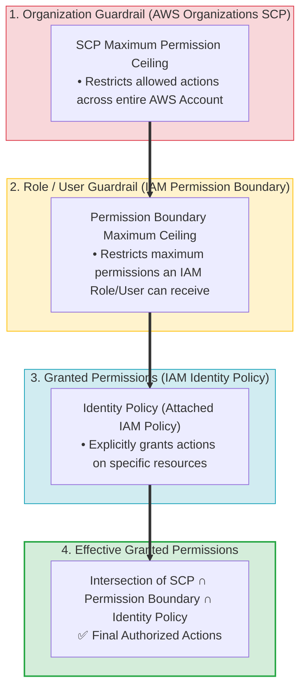
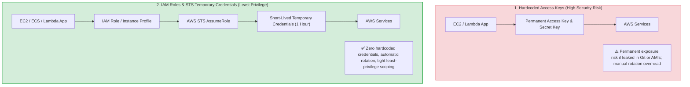
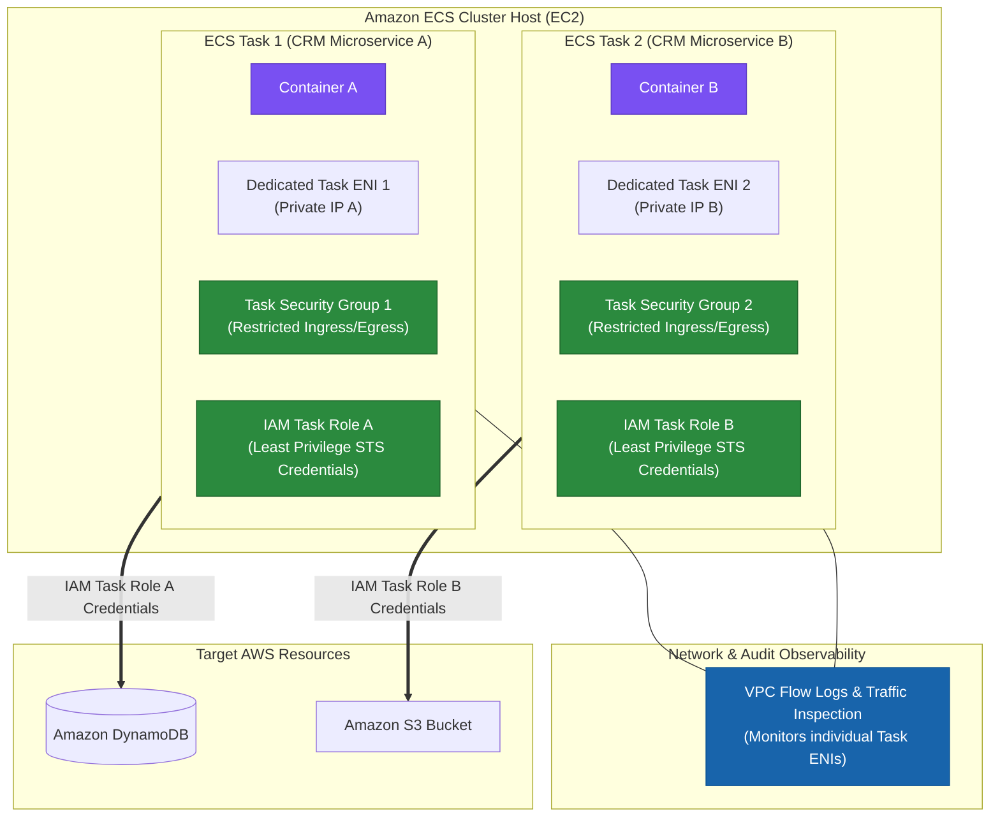

> [!NOTE]
> **Exam Mindset**: For the AWS Solutions Architect Professional (SAP-C02) and AI Practitioner (AIP-C01) exams, the Principle of Least Privilege means:
> **Give every identity only the minimum permissions required to perform its job, for only the required resources, for only the required actions, for only the required duration.**
> Evaluate IAM access across five dimensions:
> **Identity (IAM Role)** $\rightarrow$ **Action (`Action`)** $\rightarrow$ **Resource (`Resource`)** $\rightarrow$ **Condition (`Condition`)** $\rightarrow$ **Duration (STS Temporary Credentials)**.

---

## 1. IAM Policy Evaluation Logic & Decision Flow


> [!IMPORTANT]
> **Explicit Deny Rule**:
> In AWS IAM policy evaluation, an **Explicit Deny ALWAYS overrides an Explicit Allow**. If an SCP, Permission Boundary, or IAM Policy contains an Explicit Deny statement matching the request, the final decision is **DENY**, regardless of how many Allow statements exist elsewhere.

---

## 2. IAM Policy Types & Governance Scope Breakdown

| Policy / Guardrail Type | Attachment Point | Primary Purpose | Key Exam Characteristics |
| :--- | :--- | :--- | :--- |
| **Identity-Based Policy** | IAM User, Group, or Role | Explicitly grants permissions to identities | Defines allowed actions (`Action`) & target resources (`Resource`) |
| **Resource-Based Policy** | AWS Resource (S3, KMS, SQS, Secrets Mgr) | Grants principals access to the resource | Supports cross-account access without role switching |
| **Permission Boundary** | IAM User or Role | Sets the **maximum permission ceiling** | **DOES NOT grant permissions**; limits created roles |
| **Service Control Policy (SCP)**| AWS Organizations Account or OU | Sets organization-wide permission guardrails | **DOES NOT grant permissions**; restricts root & admins |
| **IAM Access Analyzer** | IAM Account / AWS Organizations | Analyzes resource policies for external access | Identifies resources shared unintentionally outside trust boundary |

---

## 3. Effective Permission Boundaries & Guardrail Ceilings Matrix



> [!WARNING]
> **Permission Boundaries & SCPs Do NOT Grant Access**:
> Neither SCPs nor Permission Boundaries grant permissions by themselves. They act as **maximum permission ceilings**. For an identity to execute an API action, an **Identity Policy or Resource Policy must explicitly grant the Allow action** within the boundaries set by the SCP and Permission Boundary.

---

## 4. Temporary Credentials vs. Permanent Access Keys (Blast Radius)



---

## 5. Fine-Grained Access Controls using IAM Policy Conditions

| Condition Key | Security Function | Example Exam Use Case |
| :--- | :--- | :--- |
| `aws:SecureTransport` | Enforces HTTPS in transit | Deny S3 requests where `aws:SecureTransport: false` |
| `aws:SourceIp` | Restricts access to corporate IP ranges | Allow API access only from company CIDR block `203.0.113.0/24` |
| `aws:PrincipalOrgID` | Restricts resource access to AWS Organization | Allow S3 bucket policy access only to accounts in Org `o-12345` |
| `aws:RequestedRegion` | Restricts AWS API actions to approved Regions | Deny API actions outside `us-east-1` and `eu-west-1` |
| `aws:PrincipalArn` | Restricts execution to specific IAM Role | Limit KMS decryption key usage to specific Lambda execution role |

---

## 6. SAP-C02 Least Privilege & IAM Governance Master Selection Decision Engine


---

## 7. SAP-C02 Exam Keyword Cheat Sheet

```
"Provide temporary credentials to EC2/Lambda"        ──> IAM Role / Instance Profile / Execution Role
"Human workforce SSO authentication"                ──> AWS IAM Identity Center
"Short-lived temporary credentials"                 ──> AWS STS (Security Token Service)
"Cross-account access to AWS resources"            ──> IAM Role + STS AssumeRole
"Identify unintended external access to S3/KMS"     ──> AWS IAM Access Analyzer
"Limit maximum permissions delegated to junior admin"──> IAM Permission Boundaries
"Organization-wide service or Region guardrails"    ──> AWS Organizations SCPs
"Enforce HTTPS in transit on S3 bucket"             ──> S3 Bucket Policy with `aws:SecureTransport: false` Deny
"Explicit Deny vs Explicit Allow evaluation"        ──> Explicit Deny ALWAYS overrides Allow
```

---

## 8. Common SAP-C02 Exam Traps

1. **Trap 1: Hardcoding IAM Access Keys in Source Code or AMIs**: Permanent access keys in code or AMIs are a critical security violation. AWS workloads must use **IAM Roles & Instance Profiles** to retrieve short-lived STS credentials automatically.
2. **Trap 2: Assuming SCPs or Permission Boundaries Grant Access**: SCPs and Permission Boundaries only set **maximum permission ceilings**. They do not grant access unless an attached **Identity Policy or Resource Policy contains an explicit Allow**.
3. **Trap 3: Using IAM Users for Application Services**: Creating IAM users with permanent access keys for EC2, ECS tasks, or Lambda functions is incorrect. Always use **IAM Roles**.
4. **Trap 4: Confusing IAM Access Analyzer with AWS Config**: IAM Access Analyzer analyzes resource policies to discover *unintended public or cross-account access*; AWS Config evaluates *general resource configuration compliance*.
5. **Trap 5: Passing Static IAM Credentials via Container Environment Variables**: Adding `AWS_ACCESS_KEY_ID` and `AWS_SECRET_ACCESS_KEY` to container environment variables or launch scripts exposes plaintext credentials. Always assign **IAM Task Roles (`taskRoleArn`)** to ECS task definitions.

---

## 8.1 Real-World Exam Scenario: Secure Amazon ECS Microservices Architecture (`awsvpc` + IAM Task Roles)

- **Scenario**: An enterprise is building a CRM portal hosted as containerized microservices on Amazon ECS. Security policy mandates granting **least privilege** access to AWS resources and enforcing **task-level Security Groups** and **network monitoring tools (VPC Flow Logs)** at the container task level. What is the most secure configuration?
- **Architecture Solution**:



### ECS Networking Modes Comparison

| ECS Network Mode | Dedicated Task ENI & IP | Task-Level Security Groups | Task-Level VPC Flow Logs | Least Privilege Security Rating |
| :--- | :--- | :--- | :--- | :--- |
| **`awsvpc`** | **YES** (Each task gets dedicated ENI & IP) | **YES** (Attaches SGs directly to tasks) | **YES** (Monitors task-level ENI traffic) | **highest (Recommended)** |
| **`bridge`** | NO (Uses Docker virtual bridge on host) | NO (SGs attached to EC2 host instance) | NO (Cannot isolate individual tasks) | Medium |
| **`host`** | NO (Binds directly to host ENI) | NO (SGs attached to EC2 host instance) | NO (Traffic merged with host ENI) | Low |
| **`none`** | NO (No external network interface) | N/A (No external network connectivity) | N/A | Isolated (No network) |

### Key Architectural Rationale:
1. **`awsvpc` Network Mode**: Grants every ECS task its own Elastic Network Interface (ENI) and primary private IP address. This enables attaching **Security Groups directly to tasks** and running **VPC Flow Logs & network monitoring tools** at the task boundary.
2. **IAM Task Roles (`taskRoleArn`)**: Vends short-lived, temporary AWS STS credentials directly to containerized applications via the task metadata endpoint. Each microservice task gets its own specific IAM role, satisfying the **least privilege** principle without sharing the host EC2 instance profile.

### Why Distractor Options Fail:
- *`bridge` Network Mode*: Uses Docker's virtual bridge on the host; Security Groups can only be attached to the EC2 host, NOT individual tasks.
- *Passing IAM Credentials in Environment Variables*: Exposes static AWS access keys in plaintext inside container definitions or launch scripts—a severe security risk.
- *EC2 Instance Roles for Tasks*: Grants permissions to the host EC2 instance profile. All tasks on the host inherit the same broad permissions, violating container-level least privilege isolation.

---

## 9. Final Mental Model

`Identify Role (STS Temp Creds) ➔ Restrict Action/Resource (Least Privilege Policy) ➔ Set Ceilings (Boundary & SCP) ➔ Audit (Access Analyzer)`