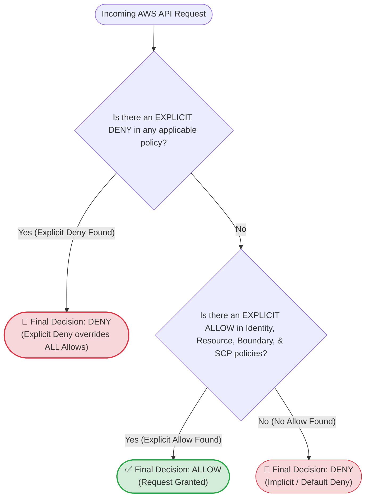
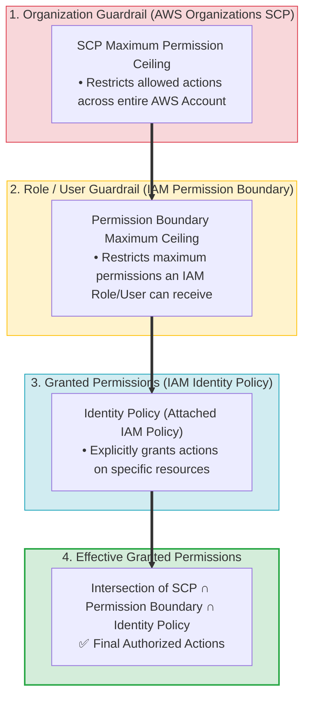
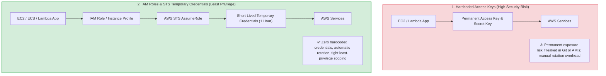
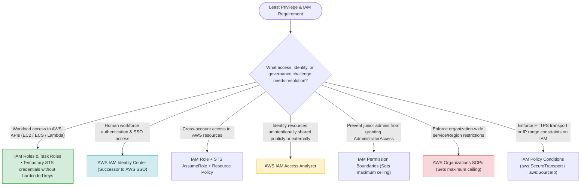
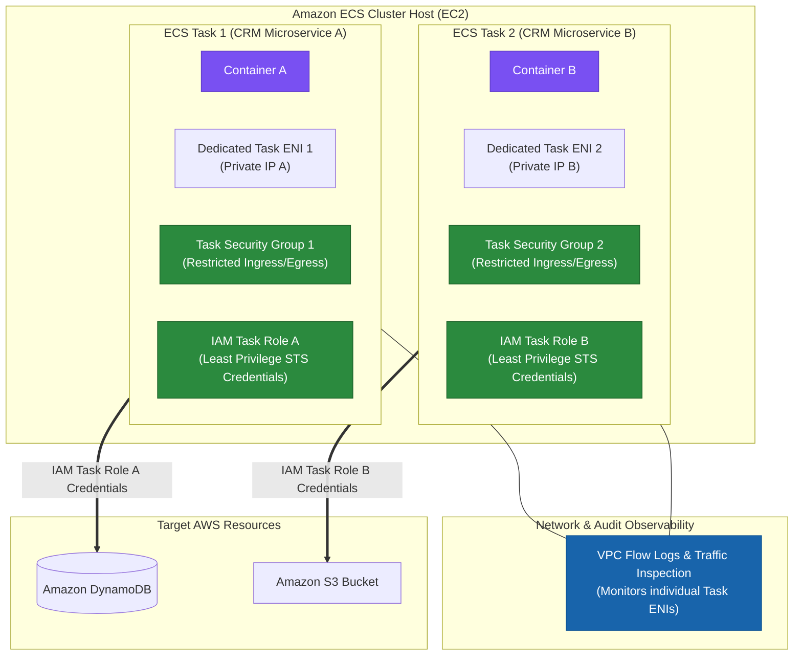
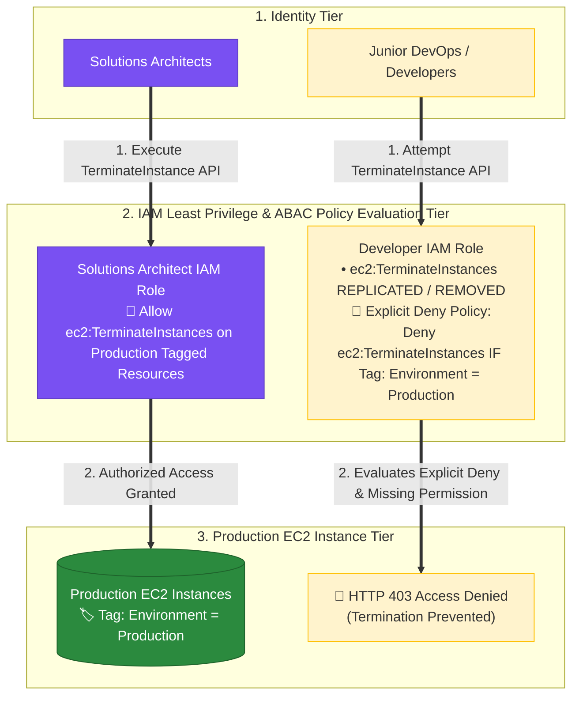
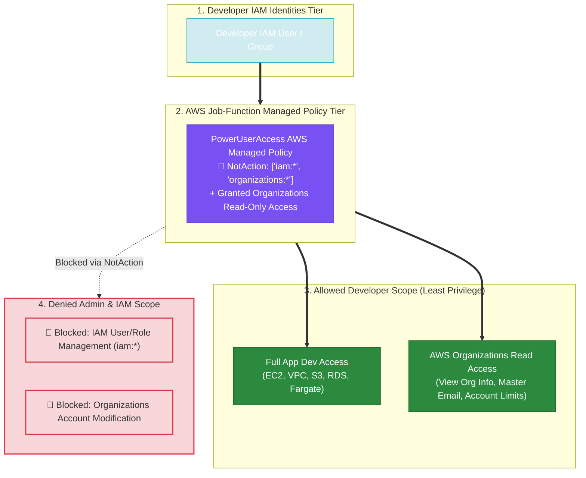
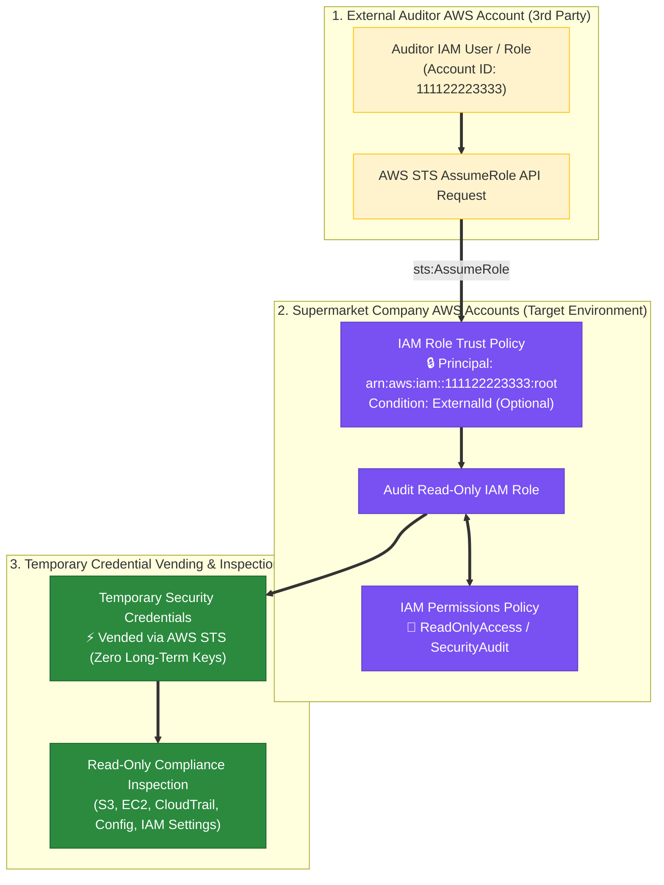

> [!NOTE]
> **Exam Mindset**: For the AWS Solutions Architect Professional (SAP-C02) and AI Practitioner (AIP-C01) exams, the Principle of Least Privilege means:
> **Give every identity only the minimum permissions required to perform its job, for only the required resources, for only the required actions, for only the required duration.**
> Evaluate IAM access across five dimensions:
> **Identity (IAM Role)** $\rightarrow$ **Action (`Action`)** $\rightarrow$ **Resource (`Resource`)** $\rightarrow$ **Condition (`Condition`)** $\rightarrow$ **Duration (STS Temporary Credentials)**.

---

## 1. IAM Policy Evaluation Logic & Decision Flow



> [!IMPORTANT]
> **Explicit Deny Rule**:
> In AWS IAM policy evaluation, an **Explicit Deny ALWAYS overrides an Explicit Allow**. If an SCP, Permission Boundary, or IAM Policy contains an Explicit Deny statement matching the request, the final decision is **DENY**, regardless of how many Allow statements exist elsewhere.

---

## 2. IAM Policy Types & Governance Scope Breakdown

| Policy / Guardrail Type | Attachment Point | Primary Purpose | Key Exam Characteristics |
| :--- | :--- | :--- | :--- |
| **Identity-Based Policy** | IAM User, Group, or Role | Explicitly grants permissions to identities | Defines allowed actions (`Action`) & target resources (`Resource`) |
| **Resource-Based Policy** | AWS Resource (S3, KMS, SQS, Secrets Mgr) | Grants principals access to the resource | Supports cross-account access without role switching |
| **Permission Boundary** | IAM User or Role | Sets the **maximum permission ceiling** | **DOES NOT grant permissions**; limits created roles |
| **Service Control Policy (SCP)**| AWS Organizations Account or OU | Sets organization-wide permission guardrails | **DOES NOT grant permissions**; restricts root & admins |
| **IAM Access Analyzer** | IAM Account / AWS Organizations | Analyzes resource policies for external access | Identifies resources shared unintentionally outside trust boundary |

---

## 3. Effective Permission Boundaries & Guardrail Ceilings Matrix



> [!WARNING]
> **Permission Boundaries & SCPs Do NOT Grant Access**:
> Neither SCPs nor Permission Boundaries grant permissions by themselves. They act as **maximum permission ceilings**. For an identity to execute an API action, an **Identity Policy or Resource Policy must explicitly grant the Allow action** within the boundaries set by the SCP and Permission Boundary.

---

## 4. Temporary Credentials vs. Permanent Access Keys (Blast Radius)



---

## 5. Fine-Grained Access Controls using IAM Policy Conditions

| Condition Key | Security Function | Example Exam Use Case |
| :--- | :--- | :--- |
| `aws:SecureTransport` | Enforces HTTPS in transit | Deny S3 requests where `aws:SecureTransport: false` |
| `aws:SourceIp` | Restricts access to corporate IP ranges | Allow API access only from company CIDR block `203.0.113.0/24` |
| `aws:PrincipalOrgID` | Restricts resource access to AWS Organization | Allow S3 bucket policy access only to accounts in Org `o-12345` |
| `aws:RequestedRegion` | Restricts AWS API actions to approved Regions | Deny API actions outside `us-east-1` and `eu-west-1` |
| `aws:PrincipalArn` | Restricts execution to specific IAM Role | Limit KMS decryption key usage to specific Lambda execution role |

---

## 6. SAP-C02 Least Privilege & IAM Governance Master Selection Decision Engine



---

## 7. SAP-C02 Exam Keyword Cheat Sheet

```
"Provide temporary credentials to EC2/Lambda"        ──> IAM Role / Instance Profile / Execution Role
"Human workforce SSO authentication"                ──> AWS IAM Identity Center
"Short-lived temporary credentials"                 ──> AWS STS (Security Token Service)
"Cross-account access to AWS resources"            ──> IAM Role + STS AssumeRole
"Identify unintended external access to S3/KMS"     ──> AWS IAM Access Analyzer
"Limit maximum permissions delegated to junior admin"──> IAM Permission Boundaries
"Organization-wide service or Region guardrails"    ──> AWS Organizations SCPs
"Enforce HTTPS in transit on S3 bucket"             ──> S3 Bucket Policy with `aws:SecureTransport: false` Deny
"Explicit Deny vs Explicit Allow evaluation"        ──> Explicit Deny ALWAYS overrides Allow
```

---

## 8. Common SAP-C02 Exam Traps

1. **Trap 1: Hardcoding IAM Access Keys in Source Code or AMIs**: Permanent access keys in code or AMIs are a critical security violation. AWS workloads must use **IAM Roles & Instance Profiles** to retrieve short-lived STS credentials automatically.
2. **Trap 2: Assuming SCPs or Permission Boundaries Grant Access**: SCPs and Permission Boundaries only set **maximum permission ceilings**. They do not grant access unless an attached **Identity Policy or Resource Policy contains an explicit Allow**.
3. **Trap 3: Using IAM Users for Application Services**: Creating IAM users with permanent access keys for EC2, ECS tasks, or Lambda functions is incorrect. Always use **IAM Roles**.
4. **Trap 4: Confusing IAM Access Analyzer with AWS Config**: IAM Access Analyzer analyzes resource policies to discover *unintended public or cross-account access*; AWS Config evaluates *general resource configuration compliance*.
5. **Trap 5: Passing Static IAM Credentials via Container Environment Variables**: Adding `AWS_ACCESS_KEY_ID` and `AWS_SECRET_ACCESS_KEY` to container environment variables or launch scripts exposes plaintext credentials. Always assign **IAM Task Roles (`taskRoleArn`)** to ECS task definitions.

---

## 8.1 Real-World Exam Scenario: Secure Amazon ECS Microservices Architecture (`awsvpc` + IAM Task Roles)

- **Scenario**: An enterprise is building a CRM portal hosted as containerized microservices on Amazon ECS. Security policy mandates granting **least privilege** access to AWS resources and enforcing **task-level Security Groups** and **network monitoring tools (VPC Flow Logs)** at the container task level. What is the most secure configuration?
- **Architecture Solution**:



### ECS Networking Modes Comparison

| ECS Network Mode | Dedicated Task ENI & IP | Task-Level Security Groups | Task-Level VPC Flow Logs | Least Privilege Security Rating |
| :--- | :--- | :--- | :--- | :--- |
| **`awsvpc`** | **YES** (Each task gets dedicated ENI & IP) | **YES** (Attaches SGs directly to tasks) | **YES** (Monitors task-level ENI traffic) | **highest (Recommended)** |
| **`bridge`** | NO (Uses Docker virtual bridge on host) | NO (SGs attached to EC2 host instance) | NO (Cannot isolate individual tasks) | Medium |
| **`host`** | NO (Binds directly to host ENI) | NO (SGs attached to EC2 host instance) | NO (Traffic merged with host ENI) | Low |
| **`none`** | NO (No external network interface) | N/A (No external network connectivity) | N/A | Isolated (No network) |

### Key Architectural Rationale:
1. **`awsvpc` Network Mode**: Grants every ECS task its own Elastic Network Interface (ENI) and primary private IP address. This enables attaching **Security Groups directly to tasks** and running **VPC Flow Logs & network monitoring tools** at the task boundary.
2. **IAM Task Roles (`taskRoleArn`)**: Vends short-lived, temporary AWS STS credentials directly to containerized applications via the task metadata endpoint. Each microservice task gets its own specific IAM role, satisfying the **least privilege** principle without sharing the host EC2 instance profile.

### Why Distractor Options Fail:
- *`bridge` Network Mode*: Uses Docker's virtual bridge on the host; Security Groups can only be attached to the EC2 host, NOT individual tasks.
- *Passing IAM Credentials in Environment Variables*: Exposes static AWS access keys in plaintext inside container definitions or launch scripts—a severe security risk.
- *EC2 Instance Roles for Tasks*: Grants permissions to the host EC2 instance profile. All tasks on the host inherit the same broad permissions, violating container-level least privilege isolation.

---

## 8.2 Real-World Exam Scenario 2: Preventing Unauthorized Production Instance Termination (IAM Role Revocation + Tag-Based Explicit Deny vs. Security Groups & MFA Traps — Select TWO)

- **Scenario**: A major incident occurred when a junior DevOps engineer unexpectedly terminated an EC2 instance in the production environment, causing web application downtime. Only Solutions Architects should be permitted to stop or terminate EC2 instances in production. Multiple developers currently have excessive access to the production AWS account. Which TWO options will fix this security vulnerability and prevent future unauthorized instance terminations?
- **Architecture Solutions (Select TWO)**:
  1. **Revoke Termination Permissions from Developer IAM Roles**: Modify the associated IAM roles assigned to developers by removing policies that grant `ec2:TerminateInstances` or `ec2:StopInstances` permissions.
  2. **Tag-Based ABAC Explicit Deny Policy**: Add tags (e.g. `Environment = Production`) to production EC2 instances, and assign developers an IAM policy containing an **explicit Deny** statement (`Deny ec2:TerminateInstances IF aws:ResourceTag/Environment = Production`).



### Key Technical Rationale:
1. **Removing Excessive Permissions (Least Privilege)**:
   - Modifying developer IAM roles to remove `ec2:TerminateInstances` enforces the principle of least privilege, preventing non-architect roles from invoking destructive API calls.
2. **Attribute-Based Access Control (ABAC) Explicit Deny via Tags**:
   - Tags categorize AWS resources (e.g. `Environment = Production`). In IAM policy evaluation, an **Explicit Deny ALWAYS overrides an Explicit Allow**. Attaching a tag-based condition policy (`Deny ec2:TerminateInstances` where `aws:ResourceTag/Environment = Production`) guarantees developers cannot terminate production instances even if they possess broad permissions elsewhere.

### Why Distractor Options Fail:
- *Replacing Security Groups on EC2 Instances*:
  - **Network Traffic vs. IAM API Failure**: Security groups control inbound/outbound network traffic (ports/protocols). Security groups **have ZERO effect on AWS IAM API calls** (`ec2:TerminateInstances`) executed via the AWS Management Console, CLI, or SDK!
- *Modifying IAM Policy to Require MFA for Deleting Instances*:
  - **MFA Does Not Revoke Permission**: Requiring MFA adds an authentication prompt, but does NOT revoke permissions! Once a developer enters an MFA token, their `ec2:TerminateInstances` permission allows them to delete the production instance.
- *Attaching `PowerUserAccess` Managed Policy*:
  - **Excessive Permission Assignment**: `PowerUserAccess` provides full access to AWS services excluding IAM user/role administration. Attaching `PowerUserAccess` still grants developers full permission to terminate EC2 instances!

---

### Scenario 8.3: Provisioning Least Privilege Developer Access (`PowerUserAccess` AWS Managed Policy vs. `AdministratorAccess` & `SystemAdministrator` Traps)

- **Scenario**: An insurance company's development team requires access to create and configure AWS resources in a VPC (deploy Windows EC2 servers, S3, RDS) for application development. Additionally, developers must be able to view AWS Organizations information (management account email, organization limits). What policy should be assigned to follow the principle of least privilege?
- **Architecture Solution**:
  - Attach the **`PowerUserAccess` AWS managed policy** to the developer IAM users (or developer IAM user group).



### Key Technical Rationale:
1. **`PowerUserAccess` Job-Function Managed Policy**:
   - `PowerUserAccess` is designed specifically for application developers. It uses a `NotAction` block to allow all actions on all AWS services (EC2, VPC, S3, RDS) **EXCEPT IAM user/role/policy management and Organizations modification**.
   - Crucially, `PowerUserAccess` explicitly grants read-only access to AWS Organizations (`organizations:DescribeOrganization`, `organizations:DescribeAccount`), fulfilling the requirement to view organization limits and management account email details without over-privileging developers.

### Why Distractor Options Fail:
- *Attaching `AdministratorAccess` Managed Policy*:
  - **Violates Least Privilege**: `AdministratorAccess` grants full unrestricted administrative rights (`Action: "*", Resource: "*"`), including modifying IAM permissions and Organizations management account settings, severely over-privileging developer identities.
- *Creating an IAM Role with `AdministratorAccess`*:
  - **Over-privileged & Unnecessary Role Wrapping**: Still assigns full `AdministratorAccess` (violating least privilege) and unnecessarily adds role-assumption overhead when managed job-function policies can be directly attached to IAM users/groups.
- *Attaching `SystemAdministrator` Managed Policy*:
  - **Lacks Organizations Read Access**: The `SystemAdministrator` policy provides infrastructure management permissions, but does NOT grant the required AWS Organizations read permissions to view organization limits and management account details.

---

### Scenario 8.4: External Third-Party PCI DSS Security Auditor Access (Cross-Account IAM Role Assumption vs. Static IAM User Keys, Credential Sharing & Active Directory Traps)

- **Scenario**: A supermarket chain processes branded credit card transactions (Mastercard, Visa, AMEX) and undergoes an external PCI DSS security compliance audit. An external auditor operating from their own AWS account requests read-only access across all company AWS accounts to conduct security checks. What is the recommended solution to grant the required access securely with minimal operational overhead?
- **Architecture Solution**:
  - Create an **IAM role** in each AWS account requiring auditing.
  - Configure the role's **Trust Policy** to list the external auditor's AWS account ARN as the trusted principal (`sts:AssumeRole`).
  - Attach a **read-only permissions policy** (e.g. `SecurityAudit` or `ReadOnlyAccess`) to the role.



### Key Technical Rationale:
1. **Cross-Account IAM Role Assumption (`sts:AssumeRole`)**:
   - Cross-account IAM roles allow external third parties to access resources in target AWS accounts without creating static IAM users or sharing long-term credentials.
   - The target account's **Trust Policy** specifies the external auditor's account ARN as a trusted principal. When the auditor invokes `sts:AssumeRole`, AWS Security Token Service (STS) issues temporary, short-lived security credentials.
2. **Zero Long-Term Credential Exposure**:
   - Once the compliance audit concludes, access can be revoked instantaneously by updating or deleting the IAM role trust policy without needing to rotate or delete access keys.

### Why Distractor Options Fail:
- *Sharing AWS Usernames and Passwords*:
  - **Catastrophic Security Violation**: Providing static IAM usernames and passwords to third parties violates basic security best practices and results in immediate PCI DSS compliance failure.
- *Creating Static IAM Users with Access Key ID & Secret Access Key*:
  - **Long-Term Credential Risk**: Provisioning static IAM users with long-term API access keys (`AKIA...`) creates credential management overhead, risks key leakage, and leaves unneeded credentials active after the audit completes.
- *Creating On-Premises Active Directory Accounts + Identity Federation SSO*:
  - **Excessive Administrative Overhead**: Provisioning external third-party auditors in internal enterprise Active Directory domain controllers creates unnecessary user lifecycle bloat. Cross-account IAM roles handle temporary third-party access natively and securely.

---

## 9. Final Mental Model


`Identify Role (STS Temp Creds) ➔ Restrict Action/Resource (Least Privilege Policy) ➔ Set Ceilings (Boundary & SCP) ➔ Audit (Access Analyzer)`