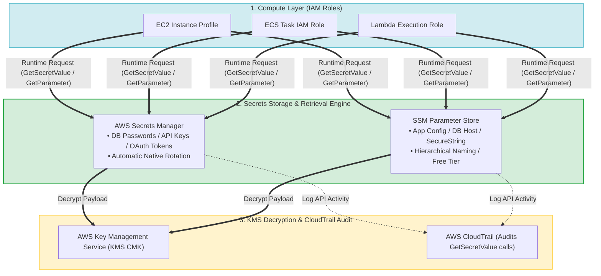
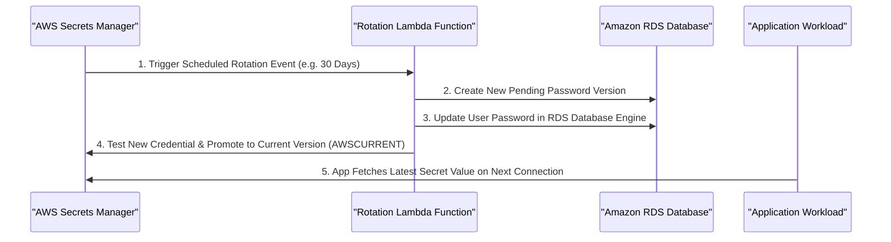
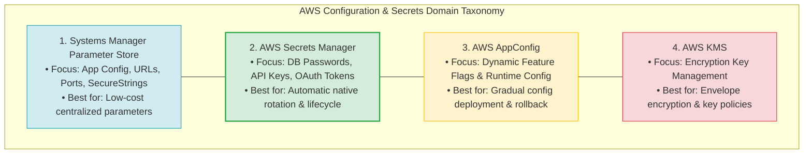
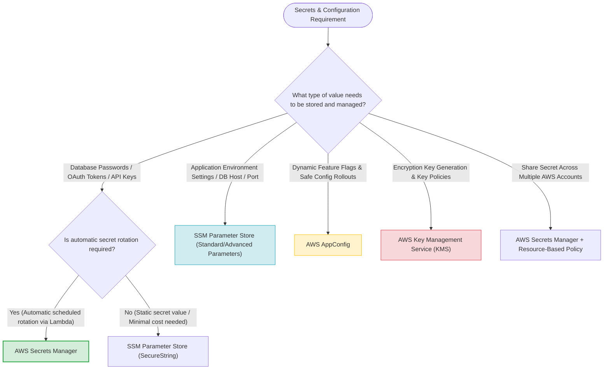
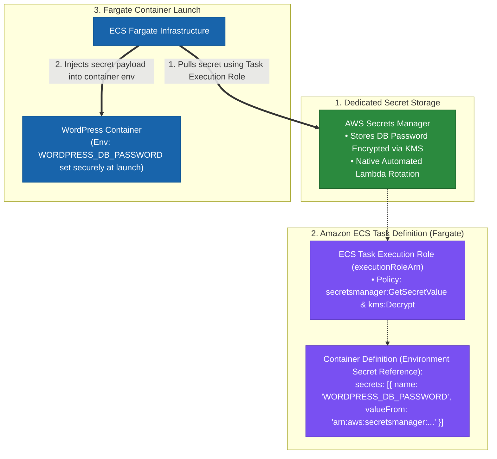
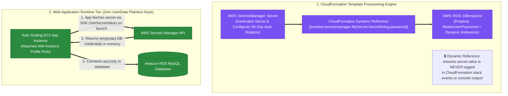

> [!NOTE]
> **Exam Mindset**: For the AWS Solutions Architect Professional (SAP-C02) and AI Practitioner (AIP-C01) exams, secrets management ensures credentials are **never hardcoded** in source code, AMIs, container images, Git repositories, or plaintext config files.
> Applications retrieve secrets dynamically at runtime using IAM Roles. Select the appropriate store based on:
> **Automatic Rotation Requirement** $\rightarrow$ **Cost & Parameter Volume** $\rightarrow$ **Dynamic Configuration vs. Secrets** $\rightarrow$ **Cross-Account Sharing**.

---

## 1. Secure Runtime Secrets Ingestion Architecture



---

## 2. Secrets Manager vs. Parameter Store Comparison Matrix

| Feature / Requirement | AWS Secrets Manager | SSM Parameter Store |
| :--- | :--- | :--- |
| **Primary Focus** | Passwords, API keys, database credentials | Application configuration parameters, URLs, ports |
| **Automatic Rotation** | **Native automatic rotation (RDS, Redshift, DocumentDB, Lambda)** | No automatic rotation capabilities |
| **Cost Model** | Monthly fee per secret + API request charges | **Standard parameters are FREE** ($0$) |
| **KMS Encryption** | Mandatory encryption (KMS CMK or AWS Managed) | Optional encryption (`SecureString`) |
| **Cross-Account Access**| Native Resource-Based Policies | AWS Resource Access Manager (RAM) for supported types |
| **Key Exam Trigger** | *"Rotate database credentials automatically every 30 days"* | *"Store 50,000 application parameters at lowest cost"* |

---

## 3. Automated RDS Secret Rotation Workflow



> [!IMPORTANT]
> **Automatic Rotation Rule**:
> When a scenario requires **automatic scheduled rotation** of database credentials (RDS, Aurora, Redshift), **AWS Secrets Manager** is the mandatory choice. Secrets Manager natively invokes AWS Lambda to update the credential in the database engine and store the new secret version seamlessly.

---

## 4. Configuration vs. Secrets vs. Feature Flags vs. Keys Taxonomy



---

## 5. Compute Service Integrations: ECS, Lambda, EC2

> [!TIP]
> **Performance Optimization - Secret Caching**:
> - **Amazon ECS**: Pass secret ARNs into ECS Task Definitions to automatically inject Secrets Manager values into container environment variables without writing SDK code.
> - **AWS Lambda**: Do **not** call `GetSecretValue` on every Lambda invocation. Fetch the secret once outside the handler function (in global initialization memory) to cache the credential across warm invocations, reducing latency and KMS API costs.

---

## 6. Configuration & Secrets Services Comparison Breakdown

| Service | Primary Use Case | Deployment & Lifecycle Control |
| :--- | :--- | :--- |
| **SSM Parameter Store** | Key-value settings, database hostnames, environment variables | Standard/Advanced parameter hierarchy (`/prod/db/host`) |
| **AWS Secrets Manager** | Database credentials, API tokens, OAuth keys | Scheduled automatic rotation, versioning, resource policies |
| **AWS AppConfig** | Dynamic feature flags, runtime operational toggles | Gradual rollout strategies, monitoring, automated rollback |
| **AWS KMS** | Master encryption keys (CMKs) for data at rest | Key policy management, key rotation, envelope encryption |

---

## 7. SAP-C02 Secrets & Configuration Master Selection Decision Engine



---

## 8. SAP-C02 Exam Keyword Cheat Sheet

```
"Automatically rotate database credentials"         ──> AWS Secrets Manager
"Rotate database password every 30 days"             ──> AWS Secrets Manager
"Cross-account access to secret without copying"     ──> AWS Secrets Manager Resource-Based Policy
"Store 50,000 application parameters at lowest cost" ──> SSM Parameter Store
"Store database hostname or environment URL"         ──> SSM Parameter Store
"Encrypted parameter with KMS"                      ──> SSM Parameter Store (SecureString)
"Dynamic feature flags with gradual rollout"        ──> AWS AppConfig
"Audit secret retrieval & access calls"             ──> AWS CloudTrail (`GetSecretValue`)
"Least privilege access to secret"                  ──> IAM Task Role / Instance Profile
```

---

## 9. Common SAP-C02 Exam Traps

1. **Trap 1: Selecting Secrets Manager for Tens of Thousands of Ordinary Parameters**: Parameter Store standard parameters are **free**; Secrets Manager charges per secret per month. For high-volume non-rotating settings, select **Parameter Store**.
2. **Trap 2: Hardcoding Credentials in Code, Container Images, or AMIs**: Storing credentials in git or AMIs is always incorrect. Applications must retrieve secrets dynamically at runtime using **IAM Roles**.
3. **Trap 3: Confusing Secrets Manager with KMS**: KMS manages *encryption keys*; Secrets Manager manages *application credentials & passwords*. Secrets Manager uses KMS to encrypt secret payloads.
4. **Trap 4: Confusing Parameter Store with AppConfig**: Parameter Store holds static values; AppConfig actively deploys dynamic configuration changes and feature flags with validation and automated rollback.
5. **Trap 5: Selecting SSM Parameter Store for Credentials Requiring Dedicated Lifecycle & Automatic Rotation**: While Parameter Store `SecureString` can store encrypted strings, it lacks dedicated secrets lifecycle management and automated credential rotation. Use **AWS Secrets Manager** when automatic rotation or dedicated secret lifecycle management is required.

---

## 9.1 Real-World Exam Scenario: ECS Fargate Container Secrets Injection & Automatic Lifecycle Rotation

- **Scenario**: A company hosts a WordPress site on Amazon ECS Fargate. Database credentials must be provided to the container via environment variables securely without being visible in cluster console definitions or git. The credentials require dedicated storage with **lifecycle management and key rotation** implemented with the least effort.
- **Architecture Solution**:



### Key Technical Rationale:
1. **AWS Secrets Manager vs. SSM Parameter Store**: Secrets Manager is the dedicated secrets store designed for database credentials, featuring built-in **automatic rotation** (via AWS Lambda templates), versioning, and lifecycle management. Parameter Store `SecureString` stores encrypted strings at lower cost but **lacks automatic credential rotation**.
2. **ECS Task Execution Role (`executionRoleArn`)**: The IAM role used by the ECS container agent (or Fargate infrastructure) before container launch. It requires `secretsmanager:GetSecretValue` and `kms:Decrypt` permissions to fetch the secret from Secrets Manager and inject it into the container environment.
3. **Task Definition `secrets` Mapping**: Referencing the Secret ARN in the `secrets` array of the container definition passes the secret securely into the container environment variable at launch time without exposing the plaintext password in task JSON definitions, console logs, or git repositories.

### Why Distractor Options Fail:
- *SSM Parameter Store*: While Parameter Store `SecureString` integrates with ECS `secrets`, it lacks native **automatic credential rotation and dedicated secret lifecycle management**.
- *Storing Credentials in S3 JSON Task Definitions*: Storing credentials in plaintext JSON files on S3 exposes sensitive data, lacks automated rotation, and creates massive manual operational overhead.
- *Migrating to Amazon EKS with Kubernetes Secrets*: Migrating from ECS to EKS creates huge operational overhead and migration effort. Furthermore, Kubernetes Secrets do not natively support automated secret rotation.

---

## 9.2 Real-World Exam Scenario: CloudFormation DB Password Secret Provisioning, Dynamic References, & Direct App Retrieval (Secrets Manager vs. UserData & SSM Traps)

- **Scenario**: A company deploys a 2-tier web application (Auto Scaling EC2 frontend + RDS MySQL database) using AWS CloudFormation templates. Security requirements mandate that the database password must be **automatically rotated every 60 days**. What is the MOST SECURE way to store, reference, and retrieve the database password for the web application?
- **Architecture Solution**:
  - In the CloudFormation template, create an **`AWS::SecretsManager::Secret`** resource for the database password.
  - Modify the web application to retrieve the database password directly from **Secrets Manager** when it launches (via AWS SDK).
  - Use a **CloudFormation Dynamic Reference** (`'{{resolve:secretsmanager:SecretName:SecretString:password}}'`) for the secret resource to populate the `MasterUserPassword` property of the `AWS::RDS::DBInstance` resource.



### Key Technical Rationale:
1. **AWS Secrets Manager Automatic 60-Day Rotation**:
   - `AWS::SecretsManager::Secret` natively supports automated credential rotation schedules (`AWS::SecretsManager::RotationSchedule`) via AWS Lambda templates to rotate RDS database passwords every 60 days automatically.
2. **CloudFormation Dynamic References (`{{resolve:secretsmanager:...}}`)**:
   - Dynamic references allow CloudFormation to fetch external secret strings directly during stack operations without logging or persisting the secret value in CloudFormation template parameters, stack event histories, or console outputs.
3. **SDK Secret Retrieval vs. UserData Plaintext Anti-Pattern**:
   - Web applications should fetch secrets at runtime directly from Secrets Manager using the **AWS SDK** authenticated via IAM Roles. Passing secrets via EC2 `UserData` scripts is an anti-pattern because UserData is written in plain text to disk (`/var/log/cloud-init.log`) and accessible to any local OS user via Instance Metadata (`http://169.254.169.254/latest/user-data`).

### Why Distractor Options Fail:
- *Passing Secrets via EC2 `UserData` Scripts (Your Selection)*:
  - Referencing secret resources inside `UserData` launch scripts exposes the plaintext password in server log files (`cloud-init.log`), CloudFormation stack event logs, and Instance Metadata (`169.254.169.254/latest/user-data`), allowing any OS process or user with metadata access to compromise the secret!
- *Using Standard `Ref` for CloudFormation DB Password*:
  - Standard `Ref` on a `SecretsManager::Secret` resource returns the **Secret ARN**, NOT the secret password string! Using standard parameters (`Parameters`) exposes plain-text passwords in CloudFormation stack history and template parameters. Dynamic references (`{{resolve:secretsmanager:...}}`) prevent CloudFormation from logging or exposing the secret value.
- *Using AWS Systems Manager Parameter Store*:
  - SSM Parameter Store cannot automatically generate unique RDS passwords during CloudFormation execution or perform automated scheduled rotation every 60 days natively.

---

## 9. Common SAP-C02 Exam Traps

1. **Trap 1: Selecting Secrets Manager for Tens of Thousands of Ordinary Parameters**: Parameter Store standard parameters are **free**; Secrets Manager charges per secret per month. For high-volume non-rotating settings, select **Parameter Store**.
2. **Trap 2: Hardcoding Credentials in Code, Container Images, or AMIs**: Storing credentials in git or AMIs is always incorrect. Applications must retrieve secrets dynamically at runtime using **IAM Roles**.
3. **Trap 3: Confusing Secrets Manager with KMS**: KMS manages *encryption keys*; Secrets Manager manages *application credentials & passwords*. Secrets Manager uses KMS to encrypt secret payloads.
4. **Trap 4: Confusing Parameter Store with AppConfig**: Parameter Store holds static values; AppConfig actively deploys dynamic configuration changes and feature flags with validation and automated rollback.
5. **Trap 5: Selecting SSM Parameter Store for Credentials Requiring Dedicated Lifecycle & Automatic Rotation**: While Parameter Store `SecureString` can store encrypted strings, it lacks dedicated secrets lifecycle management and automated credential rotation. Use **AWS Secrets Manager** when automatic rotation or dedicated secret lifecycle management is required.
6. **Trap 6: Passing Secrets via CloudFormation UserData or Using Standard `Ref` Instead of Dynamic References**: Passing database passwords in EC2 `UserData` exposes plaintext credentials in `/var/log/cloud-init.log` and Instance Metadata. Standard `Ref` on a CloudFormation secret returns the Secret ARN or logs plain-text parameters. Always use **CloudFormation Dynamic References (`{{resolve:secretsmanager:...}}`)** for DB master passwords and retrieve secrets dynamically via **AWS SDK** inside application code.

---

## 10. Final Mental Model

`App Config (Parameter Store) ➔ Credentials + Rotation (Secrets Manager) ➔ Dynamic Reference ({{resolve:secretsmanager:...}}) ➔ Direct SDK Retrieval (No UserData Plaintext)`