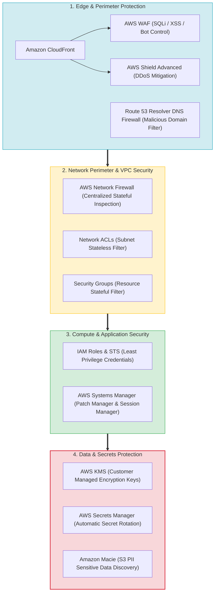
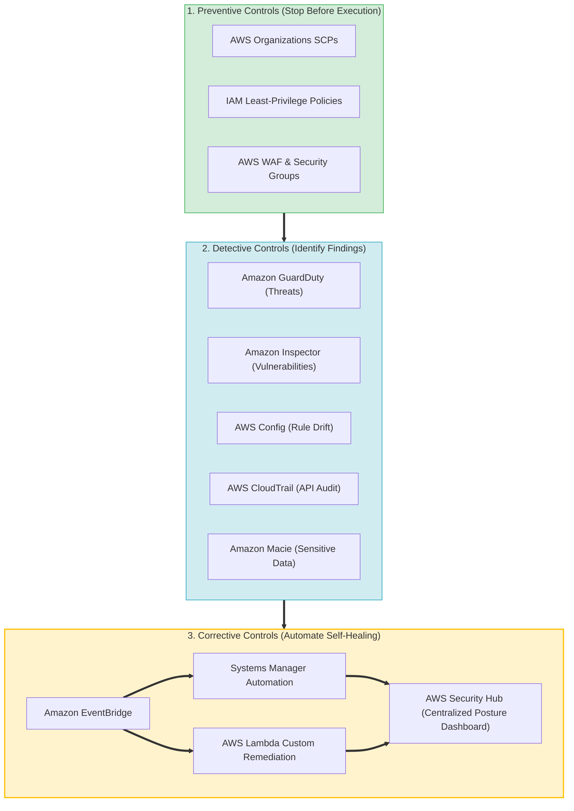
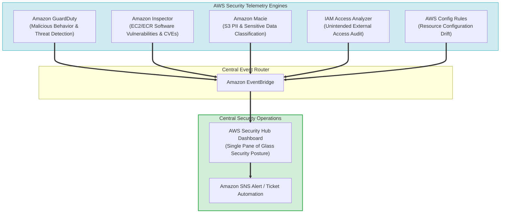
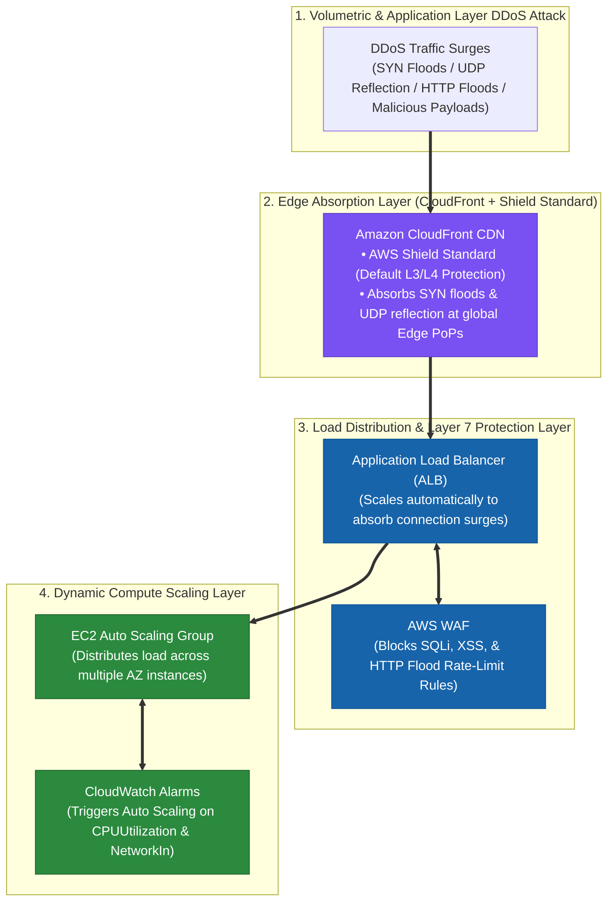
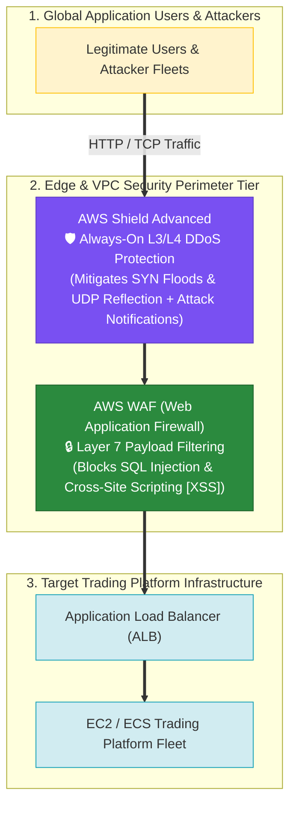
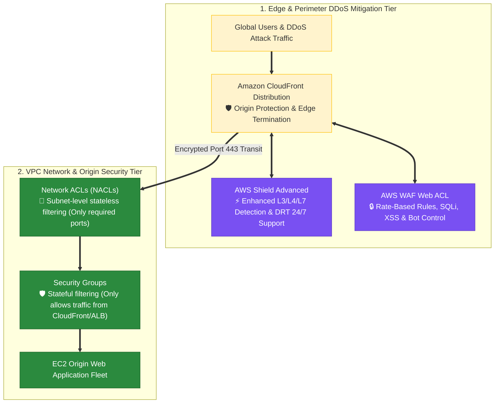
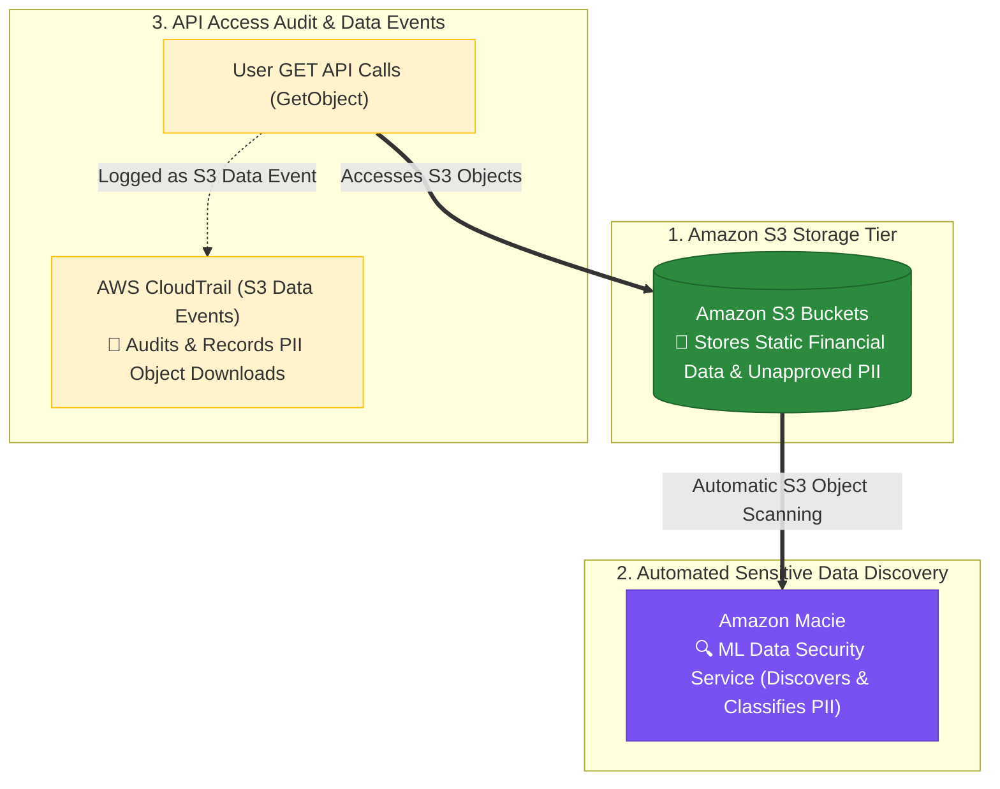
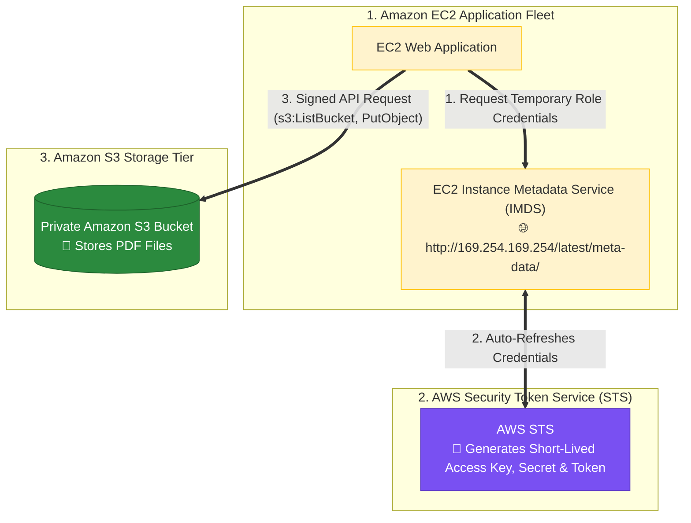
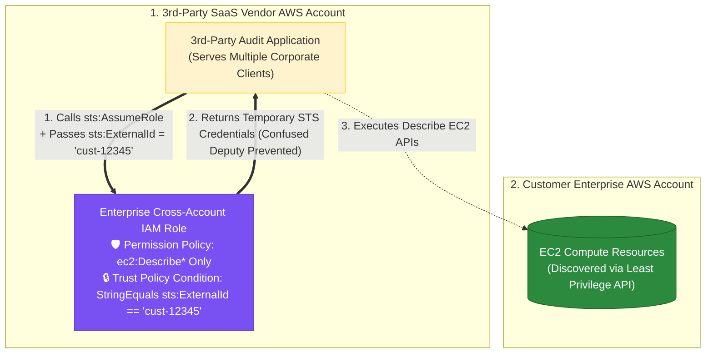
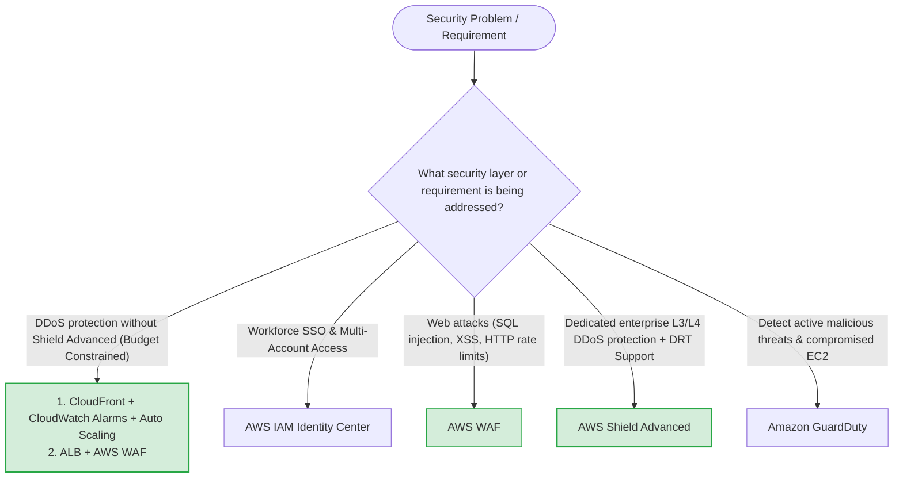

> [!NOTE]
> **Exam Mindset**: For the AWS Solutions Architect Professional (SAP-C02) and AI Practitioner (AIP-C01) exams, never evaluate security services as isolated products. Always process security architecture through the problem lifecycle:
> **Security Requirement** $\rightarrow$ **Threat Model** $\rightarrow$ **Security Control Type (Prevent / Detect / Correct)** $\rightarrow$ **AWS Service** $\rightarrow$ **Lowest Cost & Operational Overhead**.

---

## 1. AWS Multi-Layer Security & Defense in Depth Stack



---

## 2. Comprehensive Security Services Problem-to-Solution Matrix

| Security Problem | Primary Control Type | Target AWS Service | Key Exam Keyword Trigger |
| :--- | :--- | :--- | :--- |
| **Workforce SSO & Identity Access** | Prevention | **AWS IAM Identity Center** | *"Single sign-on across multiple AWS accounts"* |
| **Unintended External Resource Access**| Detection | **AWS IAM Access Analyzer** | *"Identify resources unintentionally shared externally"* |
| **Organization-Wide Permission Ceilings**| Prevention | **AWS Organizations SCPs** | *"Prevent users from performing actions across all accounts"* |
| **Application Layer Attacks (SQLi/XSS)**| Prevention | **AWS WAF** | *"Block SQL injection, XSS, & malicious HTTP requests"* |
| **DDoS Attack Mitigation** | Prevention | **AWS Shield Advanced** | *"Protect web application against DDoS attacks"* |
| **Intelligent Threat Detection** | Detection | **Amazon GuardDuty** | *"Detect compromised credentials & malicious behavior"* |
| **Software Vulnerability Scanning** | Detection | **Amazon Inspector** | *"Scan EC2 instances & ECR images for CVEs"* |
| **Centralized Security Posture** | Aggregation | **AWS Security Hub** | *"Centralize security findings across multiple services"* |
| **Resource Configuration Drift** | Detection | **AWS Config Rules** | *"Continuously evaluate configuration compliance"* |
| **API User & Identity Auditing** | Audit | **AWS CloudTrail** | *"Audit API activity & discover who deleted a resource"* |
| **Sensitive PII Discovery in S3** | Discovery | **Amazon Macie** | *"Discover sensitive PII data in Amazon S3 buckets"* |
| **Centralized Stateful VPC Firewall** | Prevention | **AWS Network Firewall** | *"Centralized stateful traffic inspection across VPCs"* |
| **Outbound DNS Malicious Filtering** | Prevention | **Route 53 Resolver DNS Firewall**| *"Block DNS resolution for known malicious domains"* |

---

## 3. Prevention vs. Detection vs. Remediation Lifecycle Workflow



---

## 4. Specialized Security Findings Aggregation Topology



> [!IMPORTANT]
> **Security Detector Triad: GuardDuty vs. Inspector vs. Config**:
> - **Amazon GuardDuty**: Detects **active threats and suspicious behavior** (e.g. compromised credentials, cryptomining, malicious IP communication).
> - **Amazon Inspector**: Scans workloads for **software vulnerabilities (CVEs) and package flaws** in EC2, ECR container images, and Lambda functions.
> - **AWS Config**: Evaluates **resource configuration drift** against defined compliance rules (e.g. unencrypted EBS volumes or open security groups).

---

## 5. Security Services Decision Matrix: GuardDuty vs. Inspector vs. Config vs. Security Hub

| Operational Question | Target Security Service |
| :--- | :--- |
| *"Is something malicious or suspicious happening right now?"* | **Amazon GuardDuty** |
| *"Does my workload have known software vulnerabilities (CVEs)?"* | **Amazon Inspector** |
| *"Is my resource configuration compliant with security policy?"* | **AWS Config Rules** |
| *"What is our overall enterprise security posture and consolidated findings?"* | **AWS Security Hub** |
| *"Is sensitive PII exposed or stored in S3?"* | **Amazon Macie** |
| *"Who called what AWS API action and from what IP address?"* | **AWS CloudTrail** |

---

## 5.1 Multi-Layer DDoS Mitigation Architecture (AWS Shield Standard + CloudFront + ALB + AWS WAF + Auto Scaling)

When budget constraints prevent purchasing **AWS Shield Advanced**, companies can build a highly resilient **AWS Shield Standard DDoS Mitigation Architecture** using core AWS edge, network, and compute services:



### Architectural DDoS Mitigation Techniques

| DDoS Protection Layer | Target Service | Technical Mitigation Mechanism |
| :--- | :--- | :--- |
| **Edge Perimeter (L3/L4)** | **Amazon CloudFront** | Absorbs SYN floods, ACK floods, and UDP reflection attacks at edge PoPs using AWS Shield Standard. |
| **Layer 7 Application Protection** | **AWS WAF** | Inspects HTTP/HTTPS payloads; rate-limits abusive IPs and blocks web exploits (SQLi, XSS). |
| **Traffic Distribution (L7)** | **Application Load Balancer** | Scales automatically to distribute heavy web traffic surges across backend EC2 instances. |
| **Compute Surge Capacity** | **EC2 Auto Scaling + CloudWatch** | Automatically provisions additional EC2 instances based on `CPUUtilization` and `NetworkIn` metric alarms. |

---

## 6.1 Real-World Exam Scenario: Cost-Effective Multi-Layer DDoS Mitigation Without Shield Advanced

- **Scenario**: A company launches a bug bounty program to patch security vulnerabilities. As a Solutions Architect, you must protect web applications and cloud infrastructure from DDoS attacks. Due to budget constraints, the company **cannot afford AWS Shield Advanced**. What TWO techniques provide the best solution to mitigate DDoS attacks? (Select TWO)
- **Architecture Solution (Select TWO)**:
  1. **Edge Caching & Dynamic Auto Scaling**: Use an **Amazon CloudFront** distribution for both static and dynamic web content. Add **CloudWatch alerts** to automatically monitor `CPUUtilization` and `NetworkIn` metrics and trigger **Auto Scaling** of EC2 instances.
  2. **Traffic Load Balancing & Web Exploits Protection**: Use an **Application Load Balancer (ALB)** to distribute traffic across backend instances. Integrate **AWS WAF** with the ALB to protect web applications from common web exploits that affect availability.

### Why Distractor Options Fail:
- *S3 POSIX Storage + SSM Patch Manager (Your Selection)*: Amazon S3 is **NOT** a POSIX-compliant file system (EFS and FSx are POSIX-compliant). Storage choices and OS patch baselines do NOT mitigate network or application layer DDoS floods.
- *Reserved EC2 Instances + AWS WAF*: Reserved Instances are a billing discount mechanism; they provide **ZERO** computing performance boost compared to On-Demand instances.
- *Multiple ENIs + Enhanced Networking*: Adding ENIs and enabling Enhanced Networking increases network throughput on a single EC2 instance, but raw DDoS traffic will still saturate the single EC2 instance's CPU and memory. Traffic MUST be load balanced across an Auto Scaling fleet via an ALB.

---

## 6.2 Real-World Exam Scenario: Comprehensive Layer 3/4 & Layer 7 DDoS Mitigation & Web Security (AWS Shield Advanced + AWS WAF vs. Fraud Detector & Network Firewall Traps - Select TWO)

- **Scenario**: A company building a new cryptocurrency trading platform in a single VPC needs to (1) mitigate Layer 3 and Layer 4 DDoS attacks (SYN floods, UDP reflection attacks) with notification alerts, and (2) protect against Layer 7 web exploits (SQL injection, Cross-Site Scripting [XSS]). What TWO options should be implemented together? (Select TWO)
- **Architecture Solutions (Select TWO)**:
  1. **AWS Shield Advanced for L3/L4 DDoS Mitigation & Notifications**: Use **AWS Shield Advanced** to provide enhanced DDoS attack detection, automatic inline mitigation for Layer 3/4 SYN floods and UDP reflection attacks, attack notification alarms, and 24/7 access to the AWS DDoS Response Team (DRT).
  2. **AWS WAF for Layer 7 Web Exploits**: Use **AWS WAF** to define customizable web security rules that block common application-layer attack patterns (SQL injection, XSS, rate limiting) before traffic reaches web servers.



### Key Technical Rationale:
1. **AWS Shield Advanced for L3/L4 DDoS & Notifications**:
   - Shield Standard automatically protects against basic network layer attacks, but **AWS Shield Advanced** adds enhanced detection for complex Layer 3/4 attacks (SYN floods, UDP reflection), real-time CloudWatch metrics/notifications, and 24/7 access to the AWS DDoS Response Team (DRT).
2. **AWS WAF for Layer 7 Exploit Protection**:
   - **AWS WAF** inspects HTTP/HTTPS payload bodies at Layer 7 to enforce rules preventing SQL injection, Cross-Site Scripting (XSS), and HTTP request rate spikes.

### Why Distractor Options Fail:
- *Sending Network Logs to Amazon Fraud Detector*:
  - **Amazon Fraud Detector** uses machine learning to predict online transaction/checkout fraud (fake user signups, stolen credit cards); it does **NOT** detect or mitigate network/application-layer DDoS attacks.
- *AWS Network Firewall for Single VPC Web App*:
  - AWS Network Firewall is designed to manage stateful firewall rules across complex multi-VPC topologies or AWS Firewall Manager setups. For protecting a single-VPC web application against Layer 7 HTTP exploits (SQLi/XSS) and providing 24/7 DRT support for SYN/UDP floods, **AWS Shield Advanced + AWS WAF** is the native, dedicated solution.
- *CloudFront Cache Hit Ratio Alone*:
  - Improving CloudFront cache hit ratio helps absorb GET request volume, but does NOT inspect POST payloads for SQL injection/XSS or send attack notifications for SYN/UDP floods.

---

## 6.2 Real-World Exam Scenario 2: Comprehensive DDoS Attack Surface Reduction & Blast Radius Minimization (NACL Port Filtering + AWS WAF L7 Blocking + Security Groups & CloudFront Origin Protection + AWS Shield Advanced vs. Oversizing EC2, Session Manager & Fraud Detector Traps)

- **Scenario**: A company hosting a web application on AWS needs to improve resource security, reduce its DDoS attack surface area, and minimize blast radius against simultaneous Distributed Denial of Service (DDoS) attacks originating from thousands of global locations. Which TWO strategies should be implemented? (Select TWO)
- **Architecture Solution**:
  - Configure **Network ACLs (NACLs)** to allow only required ports into the subnet network, and use **AWS WAF** to identify and block common DDoS request patterns and HTTP rate floods.
  - Restrict **Security Groups** to allow only required ports from authorized servers, protect EC2 origin servers behind an **Amazon CloudFront** distribution, and enable **AWS Shield Advanced** for enhanced DDoS detection and automatic application-layer mitigation.



### Key Technical Rationale:
1. **Network ACL & Security Group Port Restriction (Attack Surface Reduction)**:
   - Restricting **NACLs** (stateless subnet boundaries) and **Security Groups** (stateful instance firewalls) to accept traffic only on specific required ports (e.g. 80/443) and strictly from authorized load balancers or CloudFront edge IPs minimizes the reachable network attack surface.
2. **AWS WAF for Layer 7 Request Filtering**:
   - **AWS WAF** inspects HTTP/HTTPS payloads to identify and block malicious request patterns (SQL injection, XSS) and rate-limit HTTP floods (rate-based rules) before requests reach backend application instances.
3. **CloudFront + AWS Shield Advanced for Origin Isolation & Volumetric Mitigation**:
   - Placing EC2 origin servers behind **Amazon CloudFront** hides origin IP addresses from public internet discovery. **AWS Shield Advanced** provides always-on inline L3/L4/L7 DDoS mitigation, automatic application-layer DDoS response, and 24/7 access to the AWS DDoS Response Team (DRT).

### Why Distractor Options Fail:
- *Oversizing EC2 Instances + Systems Manager Session Manager*:
  - **Absorbing Traffic is Expensive**: Provisioning extra-large EC2 instances to absorb DDoS traffic does NOT reduce the attack surface—it exponentially inflates AWS infrastructure costs during an attack! Furthermore, **AWS Systems Manager Session Manager** is an EC2 remote shell terminal management tool, NOT a web session filtering engine.
- *S3 Bucket Versioning + Systems Manager Patch Manager*:
  - **Wrong Control Type**: S3 Versioning protects objects against accidental overwrites, and Patch Manager applies OS software updates—neither mitigates volumetric network floods or application-layer DDoS attacks.
- *Strict MFA + Amazon Fraud Detector + AWS Config*:
  - **Wrong Threat Model**: Amazon Fraud Detector uses ML to detect checkout and credit card payment fraud; MFA secures user login authentication; AWS Config audits compliance drift. None of these tools block network or HTTP DDoS flood attacks.

---

## 6.3 Real-World Exam Scenario 3: Automated PII Data Discovery & API Access Auditing (Amazon Macie + CloudTrail S3 Data Events vs. Athena, GuardDuty & Inspector Traps)

- **Scenario**: A company hosting financial applications discovers that employees are storing unapproved highly classified data in Amazon S3 buckets. The solutions architect must implement an automated solution to discover and classify all S3 objects containing personally identifiable information (PII), and audit whether those PII objects have been recently accessed via `GET` API calls. Which solution should be implemented?
- **Architecture Solution**:
  - Enable **Amazon Macie** on the S3 buckets to automatically discover, classify, and protect objects containing personally identifiable information (PII).
  - Track `GET` API calls (`GetObject`) in **AWS CloudTrail** (S3 Data Events) to determine if objects containing PII have been recently accessed.



### Key Technical Rationale:
1. **Amazon Macie for Automated PII Discovery & Data Classification**:
   - **Amazon Macie** is an ML-powered data security service designed specifically to discover, classify, and protect sensitive data (credit cards, social security numbers, passport IDs, secret API keys) stored in Amazon S3 buckets.
2. **AWS CloudTrail S3 Data Events for Object-Level Access Auditing**:
   - CloudTrail management events record bucket-level operations (`CreateBucket`). To audit individual object access (`GetObject` / `GET` API calls), **CloudTrail S3 Data Events** must be enabled.

### Why Distractor Options Fail:
- *Amazon Athena + Amazon CloudWatch*:
  - **Service Misuse**: Amazon Athena is an interactive SQL query engine for data lakes; it cannot automatically scan, discover, or classify PII in S3. CloudWatch tracks operational metrics, NOT object-level API audit logs.
- *Amazon GuardDuty for PII Discovery*:
  - **Wrong Threat Model**: Amazon GuardDuty monitors network flow logs, DNS logs, and CloudTrail management events to detect compromised credentials and malicious activity. GuardDuty does NOT inspect S3 object contents or discover PII data.
- *Installing Amazon Inspector Agent on Amazon S3 Buckets*:
  - **Architectural Error**: Amazon Inspector scans EC2 instances, ECR container images, and Lambda functions for OS/package software vulnerabilities. You CANNOT install agents on serverless Amazon S3 storage buckets, nor does Inspector perform S3 PII discovery.

---

## 6.4 Real-World Exam Scenario 4: Secure EC2 S3 Access via IAM Roles & Instance Metadata (IAM Role + IMDS Credentials vs. Hardcoded Keys, User Data & IAM User Traps)

- **Scenario**: A web application hosted on an EC2 instance allows users to upload and download PDF files from a private Amazon S3 bucket via presigned URLs. The application checks file existence in S3 before generating URLs. How should the solutions architect configure the web application to access the S3 bucket securely?
- **Architecture Solution**:
  - Create an **IAM Role** with a policy allowing listing, uploading, and reading objects in the S3 bucket (`s3:ListBucket`, `s3:PutObject`, `s3:GetObject`). Launch the EC2 instance with the IAM role attached (Instance Profile).
  - Program the web application to retrieve temporary security credentials from **EC2 Instance Metadata (IMDS)**.



### Key Technical Rationale:
1. **IAM Roles for EC2 Instance Security**:
   - Applications running on EC2 instances should never use long-term static AWS credentials (access keys). Attaching an **IAM Role** (Instance Profile) to an EC2 instance allows applications to obtain short-lived, automatically rotated credentials without hardcoding secrets.
2. **Retrieving Credentials from Instance Metadata (IMDS)**:
   - AWS SDKs and CLI automatically fetch temporary security credentials from the **Instance Metadata Service (IMDS)** endpoint (`http://169.254.169.254/latest/meta-data/iam/security-credentials/<role_name>`).

### Why Distractor Options Fail:
- *Storing Hardcoded Access Keys on the EC2 Instance*:
  - **Severe Vulnerability**: Hardcoding static IAM access keys on disk creates major credential leakage risks and requires manual secret management/rotation.
- *Retrieving Temporary Credentials from EC2 User Data*:
  - **Wrong IMDS Endpoint**: EC2 **User Data** (`/latest/user-data/`) contains instance initialization bootstrap scripts. Temporary IAM role credentials are provided by **Instance Metadata** (`/latest/meta-data/iam/security-credentials/`), NOT user data.
- *Associating EC2 Instance with an IAM User*:
  - **Invalid IAM Construct**: IAM Users represent human identities or static external callers. EC2 instances CANNOT be associated directly with IAM Users; compute resources must use **IAM Roles** via Instance Profiles.

---

## 6.5 Real-World Exam Scenario 5: 3rd-Party SaaS Cross-Account Access & Confused Deputy Prevention (IAM Role + `sts:ExternalId` Condition vs. IAM User Access Keys & Amazon Connect Traps)

- **Scenario**: A tech company undergoing a financial audit must allow a 3rd-party SaaS web application (running in the vendor's AWS account) to issue API commands and discover EC2 resources in the company's AWS account. The vendor services multiple corporate clients and provides a unique customer ID. How should cross-account access be granted in compliance with least privilege while ensuring the credentials/roles cannot be misused by other clients of the vendor (preventing the Confused Deputy problem)?
- **Architecture Solution**:
  - Create a new **IAM Role** in the enterprise account with a permission policy granting only required EC2 discovery actions.
  - Add a **trust policy** allowing the 3rd-party vendor's AWS account to assume the role, with a `Condition` element verifying that the **`sts:ExternalId`** context key matches the unique customer ID provided by the vendor.



### Key Technical Rationale:
1. **Cross-Account Access via IAM Roles**:
   - Sharing long-term static AWS credentials (access keys) with external 3rd parties is a major security violation. The AWS-recommended pattern for 3rd-party SaaS integrations is creating an **IAM Role** in the target account that the 3rd-party AWS account can assume via `sts:AssumeRole`.
2. **Preventing the Confused Deputy Problem via `sts:ExternalId`**:
   - When a 3rd-party SaaS vendor monitors multiple AWS customer accounts, a malicious customer could attempt to trick the vendor's application into assuming another customer's IAM role.
   - Including a `Condition` statement in the IAM role trust policy checking `sts:ExternalId == <unique-customer-id>` guarantees that the vendor's application can ONLY assume your role when acting specifically on your behalf.

### Why Distractor Options Fail:
- *Creating an IAM User & Generating Static Access/Secret Keys*:
  - **Severe Security Risk & Confused Deputy Vulnerability**: Provisioning IAM users and distributing long-term static access keys to 3rd-party vendors creates secret leakage risks, lacks automatic rotation, and CANNOT prevent the Confused Deputy problem across vendor clients.
- *Use Amazon Connect*:
  - **Wrong Service Purpose**: Amazon Connect is an omnichannel cloud contact center for customer service telephony; it plays zero role in IAM cross-account role delegation or API discovery.
- *Provide Admin Access Keys to 3rd-Party Software*:
  - **Extreme Security Violation**: Never share root or account administrator access keys with external 3rd-party applications.

---


## 7. SAP-C02 Security Solutions Master Selection Decision Engine



---

## 8. SAP-C02 Exam Keyword Cheat Sheet

```
"SQL injection or Cross-Site Scripting (XSS)"       ──> AWS WAF
"DDoS attack mitigation with L3/L4 notifications"     ──> AWS Shield Advanced
"Detect online account/transaction fraud"           ──> Amazon Fraud Detector (NOT for DDoS!)
"Detect malicious activity or compromised credentials"──> Amazon GuardDuty
"Scan EC2 & ECR for vulnerabilities (CVEs)"          ──> Amazon Inspector
"Consolidate security findings across services"     ──> AWS Security Hub
"Evaluate resource configuration compliance"         ──> AWS Config Rules
"Audit API calls & find who deleted an S3 bucket"    ──> AWS CloudTrail
"Discover sensitive PII data in S3"                  ──> Amazon Macie
"Single sign-on across multiple AWS accounts"        ──> AWS IAM Identity Center
"Identify unintended public or external resource sharing"──> AWS IAM Access Analyzer
"Centralized stateful traffic inspection in VPC"     ──> AWS Network Firewall
"Block outbound DNS queries to malicious domains"   ──> Route 53 Resolver DNS Firewall
```

---

## 9. Common SAP-C02 Exam Traps

1. **Trap 1: Selecting AWS WAF for DDoS Protection**: AWS WAF filters HTTP/HTTPS application-layer attacks (SQLi/XSS). For volumetric DDoS mitigation, choose **AWS Shield Advanced**.
2. **Trap 2: Confusing GuardDuty with Amazon Inspector**: GuardDuty detects *active malicious threats*; Inspector scans *software packages for known vulnerabilities (CVEs)*.
3. **Trap 3: Using Network Firewall when AWS WAF is Requested**: Network Firewall operates at IP/Port network layers across VPCs; AWS WAF operates specifically at HTTP/HTTPS web application layers.
4. **Trap 4: Deploying Every Security Service without a Specific Requirement**: The SAP exam rewards selecting the *minimal effective security architecture* matching the stated requirement.
5. **Trap 5: Using Amazon Fraud Detector for DDoS Mitigation**: Amazon Fraud Detector evaluates online account and transaction fraud (fake signups, credit card abuse); it does **NOT** detect or mitigate network DDoS attacks. Use **AWS Shield Advanced** for L3/L4 DDoS mitigation and **AWS WAF** for L7 web exploits.

---

## 10. Final Mental Model

`Prevent (IAM/SCP/WAF/Shield) ➔ Detect (GuardDuty/Inspector/Macie/Config/CloudTrail) ➔ Aggregated Posture (Security Hub) ➔ Remediate (SSM/Lambda)`