# Task 3.3: Determine a Strategy to Improve Performance — Global Service Offerings

> [!NOTE]
> **Exam Mindset**: For the AWS Solutions Architect Professional (SAP-C02) and AI Practitioner (AIP-C01) exams, global service offerings optimize user experience by moving traffic, content, compute, or data closer to global users:
> **User Location** $\rightarrow$ **Bottleneck Analysis (Network Latency / Caching / DNS Caching / Uploads)** $\rightarrow$ **Global Service Selection** $\rightarrow$ **Cost & Operational Overhead Optimization**.

---

## 1. AWS Global Network & Acceleration Architecture

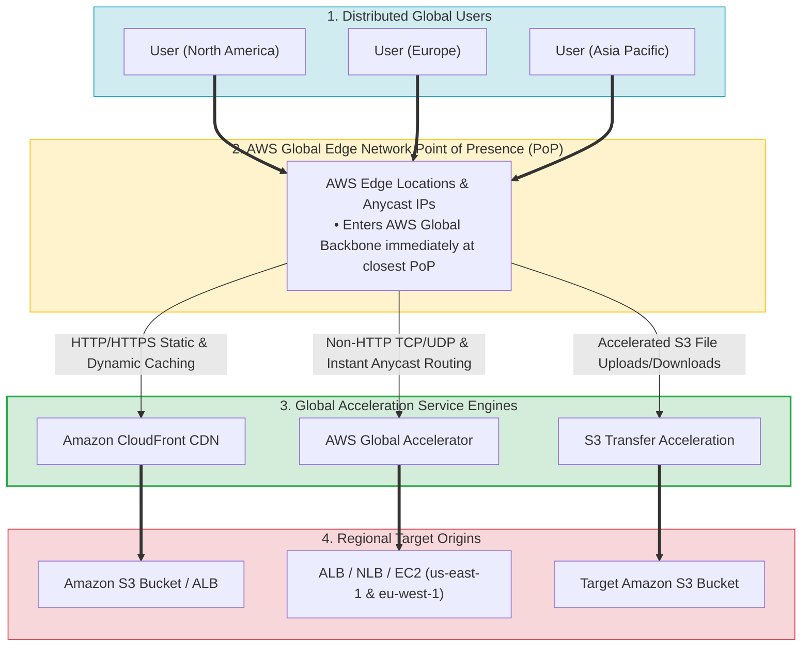

---

## 2. CloudFront vs. AWS Global Accelerator Traffic Flow Comparison

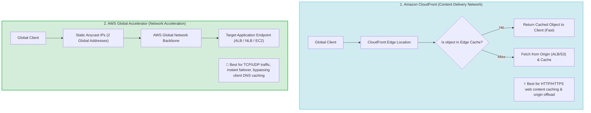

---

## 3. Global Acceleration Services Breakdown Matrix

| Global Service | Traffic Protocol | Caching Capability | Key Architectural Benefit | Key Exam Keyword Trigger |
| :--- | :--- | :--- | :--- | :--- |
| **Amazon CloudFront** | HTTP / HTTPS | **Yes (Edge Caching)** | Caches static/dynamic web content near users | *"Cache static content / Reduce origin load / CDN"* |
| **AWS Global Accelerator** | TCP / UDP / HTTP | **No** | Static Anycast IPs; instant failover over AWS backbone | *"TCP/UDP acceleration / Static IP / Avoid DNS caching delays"* |
| **S3 Transfer Acceleration** | HTTP / HTTPS (S3) | **No** | Accelerates global file uploads to S3 via Edge PoPs | *"Upload large files to S3 globally / Long-distance transfer"* |
| **Route 53 Latency Routing**| DNS | **No** | Routes users to the AWS Region with lowest network latency | *"Route users to nearest Region based on network latency"* |
| **Route 53 Geolocation Routing**| DNS | **No** | Routes users based on geographic country or continent | *"Route users based on country / Content localization / Compliance"* |

---

## 4. Edge Computing Decision Matrix (CloudFront Functions vs. Lambda@Edge)


> [!IMPORTANT]
> **Bypassing Client DNS Caching Delays via Global Accelerator**:
> When an application requires **rapid failover or traffic shifting (blue/green)** between AWS Regions, standard Route 53 DNS weighted routing can be delayed by client DNS caching (TTL). **AWS Global Accelerator** provides **2 static Anycast IP addresses** and routes traffic inside the AWS global network backbone, performing endpoint health checks and traffic shifting within seconds without relying on client DNS cache expiration.

---

## 5. CloudFront Functions vs. Lambda@Edge Feature Comparison

| Feature / Capability | CloudFront Functions | Lambda@Edge |
| :--- | :--- | :--- |
| **Primary Use Case** | Simple URL rewrites, header tweaks, redirects | Complex authorization, body manipulation, origin selection |
| **Runtime Support** | Lightweight JavaScript (ECMAScript 5.1+) | Node.js, Python |
| **Execution Location** | 210+ CloudFront Edge Locations | Regional Edge Caches |
| **Execution Time Limit** | Sub-millisecond (< 1 ms) | Up to 5 seconds (Viewer) / 30 seconds (Origin) |
| **Network & File Access** | No network access, no body access | Full network access, body access allowed |
| **Cost & Scale** | Extremely low cost, high scale | Standard Lambda pricing tier |

---

## 6. Route 53 Latency Routing vs. Geolocation Routing

> [!TIP]
> **Latency vs. Geolocation Distinction**:
> - **Latency-Based Routing**: Sends the user to the AWS Region that provides the **lowest network latency** (measured via real-time latency probes).
> - **Geolocation Routing**: Sends the user to a specific endpoint based on their **geographic location (country, continent, or state)** regardless of latency. Use Geolocation for content licensing, language localization, or regulatory compliance.

---

## 7. SAP-C02 Global Service Offerings Master Selection Decision Engine


---

## 6.1 CloudFront Geo-Restriction (Geoblocking) vs. Route 53 Geolocation / Geoproximity / NACLs

When a global application must block users in specific countries (e.g. FATF blacklisted non-cooperative countries for AML/CFT compliance) while delivering web content with **low latency**, choose **CloudFront Geo-Restriction**:

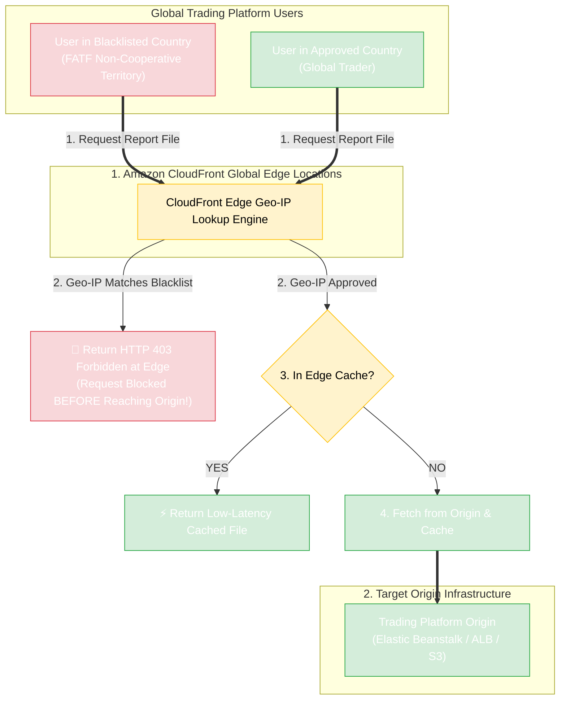

### Architectural Comparison Matrix

| Geoblocking Mechanism | Caches Content for Low Latency? | Operational Complexity | Granularity & Scale | Primary Exam Use Case |
| :--- | :---: | :---: | :--- | :--- |
| **CloudFront Geo-Restriction** | **YES (Edge Caching)** | **Lowest (Built-in Toggle)** | **Country-level Allowlist / Blocklist** | **Default choice for low-latency web delivery + country geoblocking compliance** |
| **Route 53 Geolocation Routing**| NO (DNS Resolution Only) | Low | Country / Continent / State DNS routing | Directing DNS traffic to localized servers or localized language endpoints |
| **Route 53 Geoproximity Routing**| NO (DNS Resolution Only) | Medium | Route 53 Bias distance routing | Shifting geographic traffic boundaries towards specific AWS Regions |
| **VPC Network ACL (NACL) IP Blocking**| NO (Subnet Firewall) | **Extremely High (Fails)** | Manual IP CIDR Deny rules (Max 20–40 rules) | Blocking specific malicious individual IP addresses (NOT whole countries) |

---

## 7.1 Real-World Exam Scenario: Global Financial Platform Country-Level Geoblocking (FATF Compliance)

- **Scenario**: A global financial company launches a cryptocurrency trading platform on AWS. To comply with anti-money laundering and counter-terrorist financing (AML/CFT) laws, report files must **NOT be accessible in blacklisted countries** listed on the FATF non-cooperative territory list. The solution must ensure compliance while **delivering content globally with low latency**. What is the best solution?
- **Architecture Solution**:
  - Create an **Amazon CloudFront Distribution with Geo-Restriction enabled** to block all blacklisted countries from accessing the trading platform and report files.

### Key Technical Rationale:
1. **CloudFront Geo-Restriction**: Native feature on CloudFront distributions that restricts access at the country level using an allowlist or blocklist. Incoming requests from blacklisted countries receive an `HTTP 403 Forbidden` response directly at the nearest CloudFront edge location without hitting origin servers.
2. **Global Low Latency**: CloudFront caches static and dynamic report files across 600+ global edge points of presence (PoPs), accelerating performance for approved international users.

### Why Distractor Options Fail:
- *Route 53 Geolocation / Geoproximity Routing*: Route 53 handles DNS name resolution (translating hostnames to IPs). DNS resolution does **not** cache web application files or accelerate content delivery like a CDN. Furthermore, users accessing origin IPs directly bypass DNS routing.
- *Denying Country IP Addresses in Subnet Network ACLs (NACLs)*: Blacklisted countries contain millions of constantly shifting IP addresses. Manually maintaining thousands of country IP ranges in stateless VPC NACLs is operationally impossible, quickly exceeds NACL rule limits (maximum 20–40 rules per NACL), and fails to cache content for low-latency delivery.

---

## 7.2 Real-World Exam Scenario: Global Serverless Forex Login Optimization (Lambda@Edge + CloudFront Origin Failover)

- **Scenario**: An international foreign exchange company has a serverless forex trading portal built with AWS SAM. Millions of users worldwide experience **sluggish login speeds (taking a few minutes to log in)** and **occasional HTTP 504 Gateway Timeout errors**. As the Solutions Architect, optimize performance and eliminate 504 errors with **MINIMAL COST**. What two solutions should be implemented? (Select TWO)
- **Architecture Solution**:
  1. **Use Lambda@Edge for Authentication**: Execute the authentication process inside **Lambda@Edge** functions at CloudFront edge locations closer to users worldwide.
  2. **Configure CloudFront Origin Failover**: Create a CloudFront **Origin Group** with a primary and secondary origin. CloudFront automatically switches to the secondary origin when the primary returns HTTP status code 504 (Gateway Timeout) or 502/503 errors.

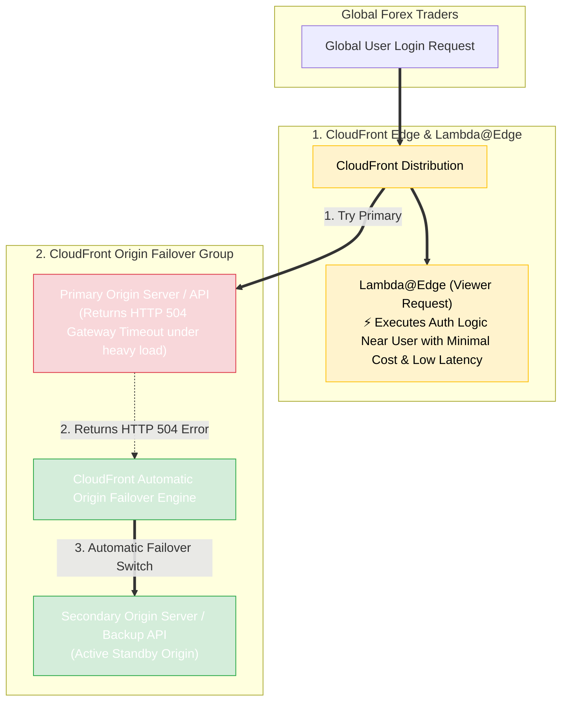

### Key Technical Rationale:
1. **Lambda@Edge for Low-Cost Global Auth**: Lambda@Edge executes viewer-request or origin-request functions across Regional Edge Caches worldwide. Moving authentication logic to the edge eliminates cross-oceanic network round-trips without paying to deploy full serverless application stacks across multiple AWS Regions.
2. **CloudFront Origin Groups for HTTP 504 Remediation**: An **Origin Group** configures CloudFront to automatically retry requests against a secondary origin when the primary origin returns `504 Gateway Timeout`, `502 Bad Gateway`, or `503 Service Unavailable` errors.

### Why Distractor Options Fail:
- *Deploying Application to Multiple AWS Regions + Route 53 Latency Routing*: Deploying complete active application stacks across multiple AWS Regions introduces massive multi-region infrastructure costs, violating the **minimal cost** requirement. Lambda@Edge achieves edge authentication at a tiny fraction of the cost.
- *Increasing Cache-Control max-age*: Authentication requests (submitting credentials, receiving OAuth/JWT tokens) are dynamic and non-cacheable. Increasing static cache `max-age` has zero effect on authentication latency or origin timeouts.
- *Geographically Dispersed VPCs + Transit VPC*: Transit VPCs manage network routing between VPCs. They are expensive, operationally complex, and do not execute serverless Lambda code closer to end users.

---

## 7.3 Real-World Exam Scenario: Multi-Region Global Accelerator with Zone Apex Domain Mapping (Route 53 Alias A Record)

- **Scenario**: A multinational financial firm deploys a cryptocurrency trading application across multiple AWS Regions (US and Europe) using containerized Kubernetes and DynamoDB Global Tables. Distributed computing resources use public Application Load Balancers (ALBs) in each region. The firm wants to make the application available through an **apex domain** (`example.com`) with low latency and high availability. What is the most operationally efficient architecture?
- **Architecture Solution**:
  1. Launch an **AWS Global Accelerator** distribution with endpoint groups targeting the specific public ALBs across the required AWS Regions (US and Europe).
  2. Create a **Public Alias A Record in Amazon Route 53** that points the custom **apex domain** (`example.com`) directly to the assigned DNS name of the accelerator (`a123456789.awsglobalaccelerator.com`).

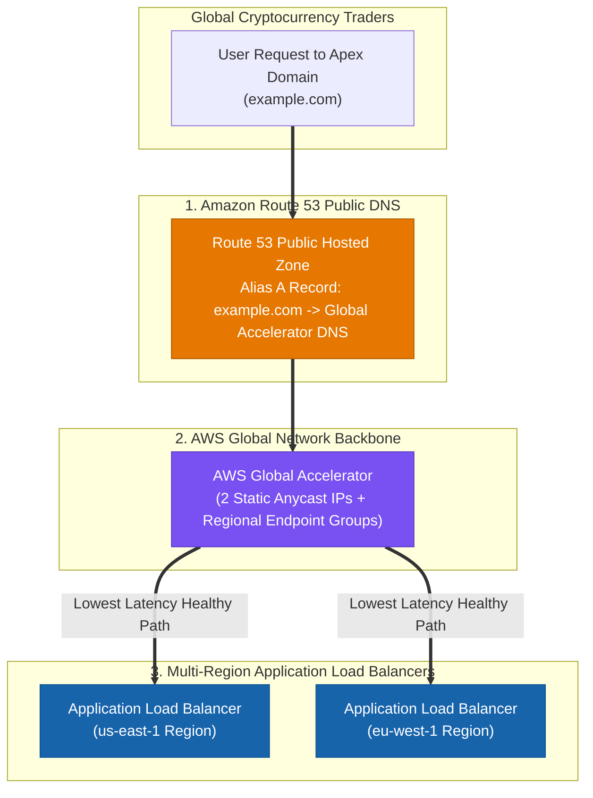

### Key Technical Rationale:
1. **AWS Global Accelerator for Multi-Region ALBs**: Global Accelerator provides 2 static Anycast IP addresses that route user traffic over the AWS global network backbone to the nearest healthy regional ALB. It reacts instantly to regional health degradation with zero DNS caching delay.
2. **Route 53 Alias Record for Zone Apex (`example.com`)**: RFC 1034 DNS standards **prohibit placing a CNAME record at the zone apex** (`example.com`). Route 53 **Alias A Records** solve this restriction natively by mapping root zone apex domains directly to AWS service endpoints (Global Accelerator, ALBs, CloudFront) with zero query fee and instant response.

### Why Distractor Options Fail:
- *Creating a CNAME Record at the Zone Apex*: CNAME records **cannot** be placed at the root zone apex (`example.com`); DNS RFC standards only allow CNAMEs on subdomains (`www.example.com`). To map a zone apex domain, you **MUST use a Route 53 Alias A Record**.
- *Using AWS Transit Gateway to Route Web Traffic to ALBs*: AWS Transit Gateway handles inter-VPC private network routing; it cannot front or load balance public internet web traffic to public ALBs across regions.
- *AWS Transit Gateway Multicast Domain*: Multicast routes UDP multicast streams between EC2 instance subnets; it is completely invalid for HTTP/HTTPS web application load balancing.
- *Route 53 Resolver Inbound Endpoint*: Inbound Resolvers accept DNS queries from on-premises networks into a VPC; they do not map public domain names to Global Accelerator or balance public web traffic.

---

## 7.4 Real-World Exam Scenario 4: PCI DSS Compliance Field-Level Encryption & CloudFront Cache Hit Ratio Optimization

- **Scenario**: A fintech startup processing credit card payments failed a 3rd-party audit because credit card numbers were unencrypted in transit/application processing stacks (failing PCI DSS requirements). The company also wants to improve performance by increasing the proportion of viewer requests served from CloudFront edge caches instead of origin servers (improving the cache hit ratio). What is the optimal configuration?
- **Architecture Solution**:
  - Configure the **CloudFront distribution to enforce secure end-to-end connections to origin servers using HTTPS and Field-Level Encryption**. Configure your origin to add a **`Cache-Control: max-age` directive** to your objects, specifying the longest practical value for `max-age` to increase your cache hit ratio.

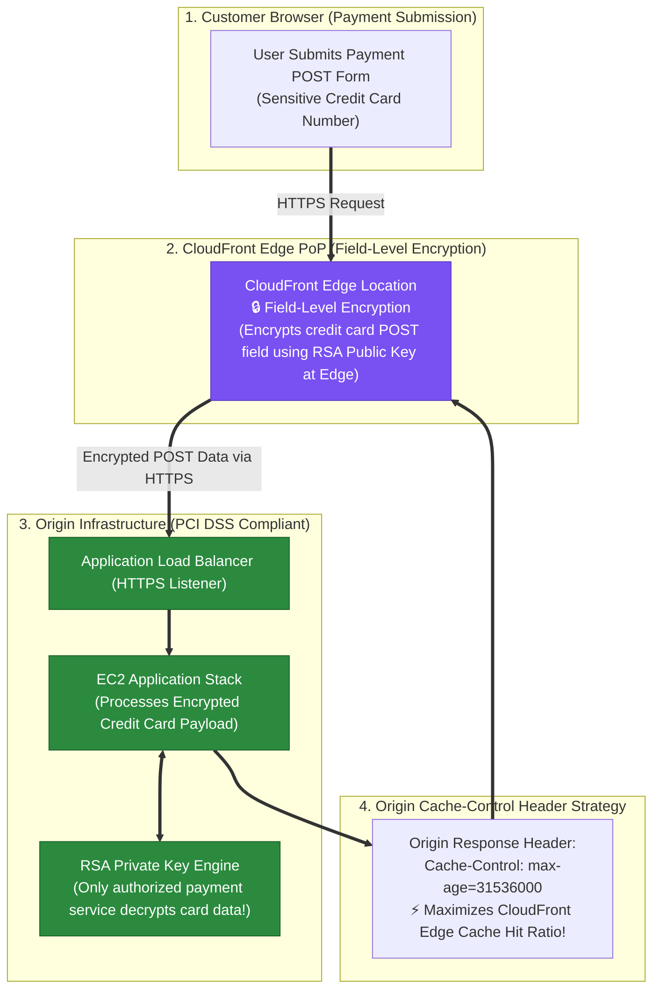

### Key Technical Rationale:
1. **CloudFront Field-Level Encryption for PCI DSS Compliance**: Field-Level Encryption encrypts specific sensitive data fields (e.g. up to 10 POST fields like credit card numbers) at the CloudFront edge using an RSA public key before payload data is forwarded to origin web servers. The sensitive data remains encrypted throughout the entire application stack until decrypted by an isolated backend service holding the private key.
2. **`Cache-Control: max-age` for Cache Hit Ratio**: Setting `Cache-Control: max-age` with the longest practical duration instructs CloudFront edge caches to retain objects longer, preventing unnecessary origin revalidations and maximizing cache hit ratio.

### Why Distractor Options Fail:
- *Forwarding `User-Agent` and `Host` Headers to Origin*: Adding headers like `User-Agent` or `Host` into CloudFront cache keys dramatically **DECREASES** the cache hit ratio because every web browser emits a unique `User-Agent` string, forcing CloudFront to fetch fresh content from origin servers for almost every single request!
- *CloudFront Signed URLs*: Signed URLs provide time-limited authorization to access private static content in S3 or CloudFront; Signed URLs do **NOT** encrypt sensitive payload data fields in POST requests for PCI DSS compliance!
- *Origin Access Control (OAC)*: OAC restricts S3 bucket access so objects can only be downloaded via CloudFront; OAC does **NOT** encrypt sensitive field inputs in POST requests!

### Scenario 7.5: CloudFront Custom Domain HTTPS & Cache Hit Ratio Optimization (ACM + Cache-Control max-age vs. Lambda@Edge & S3 Certificate Traps - Select TWO)

- **Scenario**: A cryptocurrency analytics website uses a CloudFront distribution with a custom domain name (`tutorialsdojo.com`). Management requires (1) enforced HTTPS communication between viewers and CloudFront for the custom domain, and (2) performance improvement by increasing the proportion of viewer requests served directly from edge caches (Cache Hit Ratio). What TWO actions should be implemented? (Select TWO)
- **Architecture Solutions (Select TWO)**:
  1. **ACM SSL/TLS Certificate for Custom Domain**: Provision or import an SSL/TLS certificate provided by **AWS Certificate Manager (ACM)** in `us-east-1` and associate it with the CloudFront distribution.
  2. **`Cache-Control: max-age` Directive at Origin**: Configure the CloudFront origin server to attach a `Cache-Control: max-age` directive with the longest practical `max-age` value to extend object retention in CloudFront edge locations, maximizing the Cache Hit Ratio.

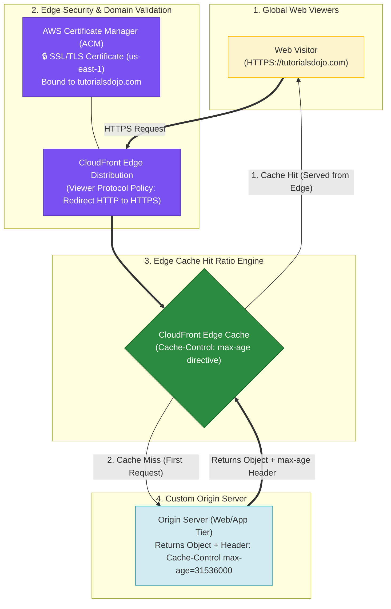

### Key Technical Rationale:
1. **ACM SSL/TLS Certificate Requirement for Custom CNAMEs**:
   - Default CloudFront domain names (`*.cloudfront.net`) use AWS's built-in SSL certificate.
   - When associating a **custom domain name** (`tutorialsdojo.com`), CloudFront requires a custom SSL/TLS certificate provisioned or imported in **AWS Certificate Manager (ACM)** in the `us-east-1` (N. Virginia) region.
2. **Maximizing Cache Hit Ratio via `Cache-Control: max-age`**:
   - The Cache Hit Ratio measures the percentage of requests served directly by CloudFront edge caches without hitting origin servers.
   - Attaching `Cache-Control: max-age` with the longest practical duration instructs CloudFront to retain objects longer in edge caches, reducing origin fetches and improving performance.

### Why Distractor Options Fail:
- *Associating CloudFront with Lambda@Edge (Your Selection)*:
  - `Lambda@Edge` runs custom serverless code at edge locations to mutate HTTP requests/responses (e.g., A/B testing, URI rewrites). Executing Lambda@Edge functions on viewer requests does **NOT** increase the CloudFront cache hit ratio! In fact, executing custom Lambda code on every request adds processing latency and cost.
- *Importing SSL Certificate into an Amazon S3 Bucket*:
  - CloudFront requires SSL certificates to be stored in **AWS Certificate Manager (ACM)** (specifically in `us-east-1`) or the IAM certificate store. Storing certificates as plain files in an S3 bucket is invalid and insecure.
- *Integrating CloudFront with Amazon OpenSearch + Kibana*:
  - Amazon OpenSearch is a search indexing and log analytics engine; it is **NOT** a CDN caching layer and does not increase CloudFront edge cache hit ratios.

### Scenario 7.6: Device-Based Static Content Delivery (S3 + CloudFront + Lambda@Edge vs. Caching Raw User-Agent & NLB Traps)

- **Scenario**: A viral mobile game registration webpage hosted on an EC2 Auto Scaling group behind an ALB serves static content customized based on the user's device type (`User-Agent`). High CPU usage and sluggishness occur during a traffic surge. How can a Solutions Architect improve response times and offload EC2 capacity?
- **Architecture Solution**:
  - Create an **Amazon S3 bucket** to host static content and configure it as the origin for an **Amazon CloudFront distribution**.
  - Write a **Lambda@Edge function** to parse the `User-Agent` HTTP header at the edge location, map the device type (e.g. mobile vs. desktop), and serve the appropriate static content directly from S3/CloudFront.

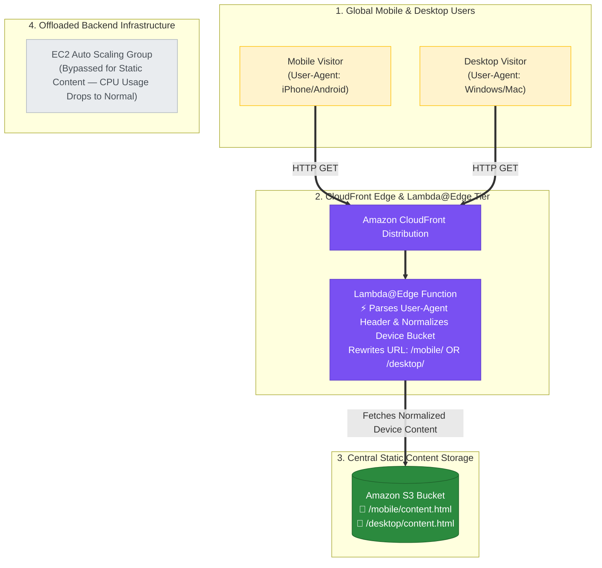

### Key Technical Rationale:
1. **Lambda@Edge for Device-Based Request Transformation**:
   - Lambda@Edge intercepts CloudFront requests at edge locations, inspects the `User-Agent` HTTP header, normalizes the device type into categories (e.g., mobile, tablet, desktop), and rewrites the request URL to fetch the matching device version from S3.
   - Processing device categorization at the edge offloads CPU pressure from EC2 instances and lowers global user latency.
2. **The `User-Agent` Native Cache Fragment Anti-Pattern**:
   - Configuring CloudFront to natively cache content based directly on the raw `User-Agent` HTTP header is an **AWS anti-pattern**.
   - Raw `User-Agent` strings contain thousands of variations (browser versions, OS builds). Caching on raw `User-Agent` fragments the cache into thousands of tiny keys, destroying the Cache Hit Ratio and bombarding origin servers. Lambda@Edge normalizes raw strings into a few device buckets to preserve high cache efficiency.

### Why Distractor Options Fail:
- *Configuring CloudFront Cache Policy on Raw `User-Agent` Header (Your Selection)*:
  - Caching on raw `User-Agent` strings creates thousands of cache key variants, resulting in a near-0% cache hit ratio and overloading the origin server.
- *Network Load Balancer (NLB) with User-Agent Routing*:
  - An NLB operates at **Layer 4 (Transport Layer)** and cannot inspect or parse Layer 7 HTTP headers like `User-Agent`.
- *Amazon Route 53 User-Agent Routing*:
  - Amazon Route 53 operates at the **DNS layer** and cannot evaluate HTTP headers.

### Scenario 7.7: Aging Content Lifecycle Optimization (S3 Date-Partitioning + CloudFront Restricted Access vs. Minimum TTL = 0 & Price Class Traps)

- **Scenario**: A global blogging platform receives millions of 300 KB entries per month. Blog entries have high update rates in the first 3 months, updates drop to zero after 6 months, and access drops to negligible levels after 6 months. How can a Solutions Architect optimize CloudFront load times and origin caching for this content lifecycle?
- **Architecture Solution**:
  - Store blog entries in a **single S3 source bucket partitioned by submission month** (e.g. `s3://bucket/YYYY/MM/entry.html`).
  - Create a **CloudFront distribution** with access restricted exclusively to the origin S3 bucket (via Origin Access Control - OAC).
  - Configure path-based cache behaviors matching date prefixes to assign long TTLs to older partitions (where updates cease) and shorter TTLs / frequent revalidations to current month partitions.

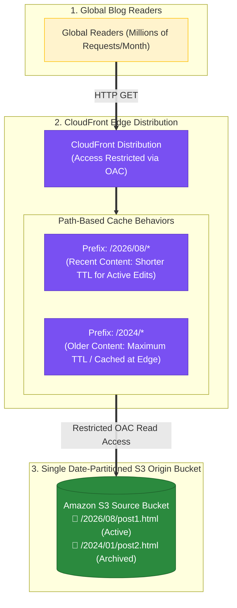

### Key Technical Rationale:
1. **Date-Based S3 Partitioning for Granular Cache Behaviors**:
   - Partitioning S3 object keys by date prefixes (e.g. `/YYYY/MM/`) allows creating targeted CloudFront path-based cache behaviors.
   - Older content partitions (where edits drop to zero after 6 months) receive maximum TTL settings to keep static blog posts cached at the edge indefinitely. Active recent month partitions receive lower TTLs to support blogger updates.
2. **Restricted Origin Access (OAC)**: Restricting S3 bucket access exclusively to CloudFront (via Origin Access Control - OAC) ensures users cannot bypass edge caching or download files directly from S3.

### Why Distractor Options Fail:
- *Setting Minimum TTL to 0*:
  - Setting Minimum TTL to 0 forces CloudFront to revalidate every single request with the S3 origin server, completely bypassing edge caching and degrading load times!
- *Storing Two Copies of Each Entry in Two Separate S3 Buckets*:
  - Duplicating blog entries across multiple S3 buckets doubles storage costs and does not improve load times or cache hit ratios.
- *Creating Two CloudFront Distributions for US-Europe vs All Locations Price Classes*:
  - CloudFront Price Classes (PriceClass_100, PriceClass_200, PriceClass_All) control edge location cost by excluding certain geographic regions (e.g. South America, India), NOT performance or load time for specific users. Creating separate distributions by price class does not optimize cache behaviors for aging blog content.

---

## 7.8 Scenario: On-Premises Assembly Line Defect Detection & Offline ML Inference (AWS IoT Greengrass Core + SageMaker AI Model + Greengrass Components vs. AWS Outposts & Rekognition Traps)

- **Scenario**: A car parts manufacturer uses IP cameras along an assembly line for quality inspection, capturing images to detect defects using a model trained in **Amazon SageMaker AI**. Workers must receive real-time defect feedback via an API hosted on an on-premises Linux server. The company mandates that the inspection solution **must remain operational even when factory internet connectivity is unavailable**. What is the recommended deployment solution?
- **Architecture Solution**:
  - Deploy **AWS IoT Greengrass client software** to a local server in the factory data center.
  - Run ML inference locally on the Greengrass core server using the cloud-trained model from Amazon SageMaker AI.
  - Use **Greengrass components** (custom edge runtime software modules) to interact with the local Linux server API whenever a defect is detected.

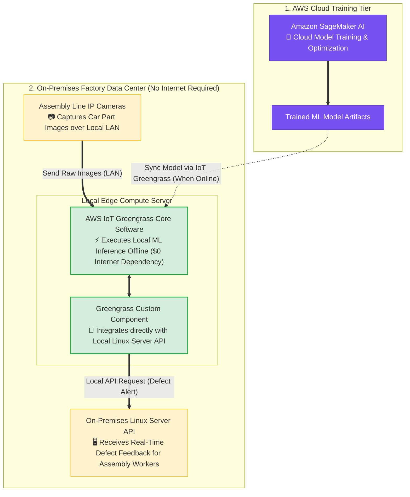

### Key Technical Rationale:
1. **AWS IoT Greengrass Core for Offline Edge ML Inference**:
   - AWS IoT Greengrass provides an open-source edge runtime that allows edge devices and local servers to run ML inference locally on data generated at the edge, using models trained in Amazon SageMaker AI.
   - Greengrass continues executing ML predictions and local automation autonomously even when factory internet connectivity is completely disconnected.
2. **Greengrass Components for Local API Integration**:
   - Greengrass components are modular software packages deployed to core devices. Custom components can execute Python scripts that communicate locally with on-premises HTTP/REST APIs (e.g. Linux server API) with sub-millisecond latency over the local LAN.

### Why Distractor Options Fail:
- *AWS Outposts + Amazon Rekognition (Your Selection)*:
  - **Amazon Rekognition is NOT supported on AWS Outposts**! Amazon Rekognition requires regional cloud service endpoints. Furthermore, Outposts is expensive hardware provisioning that relies on control plane connectivity back to the AWS Region.
- *SageMaker Edge Manager / Ground Truth Directly on IP Cameras*:
  - **Hardware Compute Limitations**: Standard IP cameras are lightweight image capture sensors that lack the CPU/GPU memory compute capacity to run heavy deep learning computer vision inference models directly on-device! Inference should be offloaded to a local server running **AWS IoT Greengrass Core**.
  - **SageMaker Ground Truth**: Ground Truth is a cloud data labeling service used during training dataset preparation; it does **NOT** deploy models or run real-time inference at the edge!

---

### Scenario 7.8: Restricting Private Content Access via CloudFront Signed URLs + OAC vs. S3 Presigned URLs (Select TWO)

- **Scenario**: An international insurance company stores financial files in an Amazon S3 bucket behind CloudFront. Clients currently access data directly via S3 URLs or CloudFront URLs. The company needs to deliver content to a specific client in California ensuring **ONLY that client can access the specific files** and preventing direct S3 URL bypass for anyone else. Which TWO options are valid solutions?
- **Architecture Solutions (Select TWO)**:
  1. **CloudFront Signed URLs + Origin Access Control (OAC) + Block Direct S3 Access**: Use CloudFront Signed URLs to restrict access to the specific files for that client. Create an Origin Access Control (OAC) with S3 read permissions and remove public S3 read permissions to block direct S3 URL bypass.
  2. **Amazon S3 Presigned URLs + Block Direct S3 Access**: Create an S3 bucket in `us-west-1` (N. California), generate S3 Presigned URLs to grant temporary access to the specific client, and remove public S3 read permissions for everyone else.

```mermaid
flowchart TD
    subgraph Client ["1. Authorized Client (California)"]
        User["Target Client Application"]
    end

    subgraph Solution1 ["Option 1: CloudFront Signed URL + OAC"]
        CF_URL["CloudFront Signed URL<br/>🔑 Restricted Single-File Access"]
        CF_Edge["CloudFront Edge Distribution"]
        OAC["Origin Access Control (OAC)<br/>🛡️ Restricts Bucket Access to CloudFront ONLY"]
        S3_Private1[("Private Amazon S3 Bucket<br/>🔒 Direct S3 URLs Blocked for Public")]

        User ==>|"Access via Signed URL"| CF_URL ==> CF_Edge
        CF_Edge <==|"Authenticate OAC Header"==> OAC ==> S3_Private1
    end

    subgraph Solution2 ["Option 2: Amazon S3 Presigned URL"]
        S3_Presigned["S3 Presigned URL<br/>🔑 Temporary Signature for Target File"]
        S3_Private2[("Private Amazon S3 Bucket (us-west-1)<br/>🔒 Direct S3 Public Access Blocked")]

        User ==>|"Access via S3 Presigned URL"| S3_Presigned ==> S3_Private2
    end

    classDef client fill:#fff3cd,stroke:#ffc107,stroke-width:1px;
    classDef cf fill:#7950f2,stroke:#5f3dc4,color:#ffffff;
    classDef s3 fill:#2b8a3e,stroke:#1e632b,color:#ffffff;

    class User client;
    class CF_URL,CF_Edge,OAC cf;
    class S3_Private1,S3_Presigned,S3_Private2 s3;
```

### Key Technical Rationale:
1. **CloudFront Signed URLs vs. Signed Cookies**:
   - **Signed URLs**: Designed for restricting access to **individual specific files** (e.g., a specific PDF financial report download) or when clients don't support cookies.
   - **Signed Cookies**: Designed for providing access to **multiple restricted files** simultaneously (e.g. an entire subscriber website or video HLS segments).
2. **Preventing Direct S3 URL Bypass via OAC**:
   - Creating an **Origin Access Control (OAC)** restricts access to the S3 bucket so that ONLY the specified CloudFront distribution can read files. Removing public bucket read permissions prevents users from bypassing CloudFront controls via direct S3 URLs (`https://bucket.s3.amazonaws.com/file`).
3. **Amazon S3 Presigned URLs**:
   - S3 Presigned URLs embed temporary security credentials directly into the URL signature, allowing the target client to download a specific file from a private S3 bucket without exposing public bucket permissions.

### Why Distractor Options Fail:
- *Writing an S3 Bucket Policy with CloudFront Distribution ID as Principal (Your Selection)*:
  - **Invalid IAM Syntax & Principal**: A raw CloudFront distribution ID (e.g., `EDFDVBD632BHDS`) is **NOT a valid IAM Principal**! IAM bucket policies require service principals (`Service: cloudfront.amazonaws.com`) or account ARNs in the `Principal` block. The distribution ID is passed in the `Condition` block (`AWS:SourceArn`), and an **Origin Access Control (OAC)** must be associated with the distribution to sign requests with SigV4.
- *CloudFront Signed Cookies*:
  - **Single vs. Multiple File Scope**: Signed cookies are used for accessing multiple files (e.g. an entire subscriber portal), not individual specific file deliveries.
  - **Omission of OAC**: Enabling signed cookies without **Origin Access Control (OAC)** leaves the underlying S3 bucket exposed, allowing users to bypass CloudFront restrictions using direct S3 URLs.
- *CloudFront Signed URLs + Field-Level Encryption*:
  - **Field-Level Encryption** encrypts sensitive POST payload data at CloudFront edge using RSA keys before forwarding to origin web servers; it does NOT restrict GET access to private S3 files or block direct S3 URL bypass.
- *Assigning an IAM User to CloudFront*:
  - CloudFront does not authenticate to S3 origins via static IAM users.

---

### Scenario 7.9: Dual Origin CloudFront Enforcement for Static S3 & Dynamic ALB (OAC + Custom Header AWS WAF on ALB vs. NACLs & WAF on CloudFront Traps — Select TWO)

- **Scenario**: A website hosts static media in a private Amazon S3 bucket and dynamic content on an AWS Fargate cluster behind an Application Load Balancer (ALB). Both origins sit behind an Amazon CloudFront distribution. The company wants to guarantee that access to BOTH static and dynamic content can occur **ONLY through CloudFront**. What TWO options should the Solutions Architect implement?
- **Architecture Solutions (Select TWO)**:
  1. **Restricting Private S3 Origin Access**: Create an **Origin Access Control (OAC)** and associate it with the CloudFront distribution. Configure the S3 bucket policy to grant read access strictly to the OAC.
  2. **Restricting Private ALB Origin Access**: Configure CloudFront to add a **custom header** (e.g. `X-Origin-Verify: SecretHeaderValue`) to all origin requests. Create an **AWS WAF Web ACL** with a rule that denies requests without this custom header, and **associate the Web ACL with the Application Load Balancer (ALB)**.

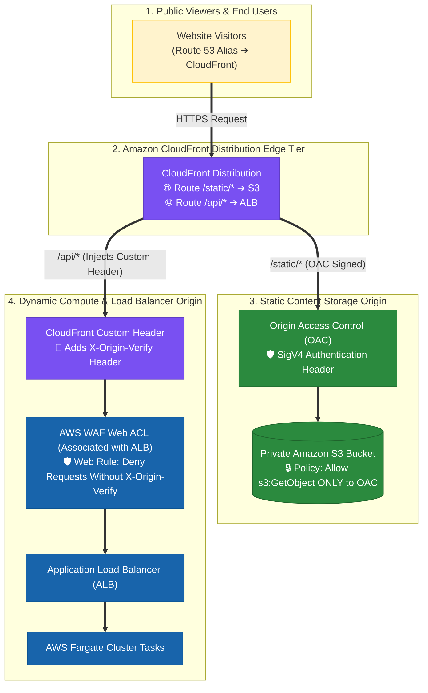

### Key Technical Rationale:
1. **CloudFront OAC for Private S3 Bucket Access**:
   - Origin Access Control (OAC) signs CloudFront requests using SigV4. Restricting the S3 bucket policy to the OAC prevents viewers from accessing static files directly via S3 bucket URLs (`https://bucket.s3.amazonaws.com`).
2. **CloudFront Custom Header + AWS WAF on ALB for Private ALB Access**:
   - CloudFront allows adding **Origin Custom Headers** when forwarding requests to custom HTTP origins like ALBs.
   - Attaching an **AWS WAF Web ACL to the ALB** that inspects incoming HTTP headers and drops requests lacking the custom header ensures that direct requests to the ALB's public DNS endpoint (`http://alb-name.elb.amazonaws.com`) are immediately blocked by WAF with `HTTP 403 Forbidden`.

### Why Distractor Options Fail:
- *Associating the AWS WAF Web ACL with CloudFront instead of the ALB*:
  - **Blocks End Users at Edge**: If the Web ACL requiring the custom header is attached to CloudFront, incoming end-user requests (which do NOT contain the custom header yet) are immediately blocked by WAF at the edge before reaching CloudFront! The custom header is injected *by CloudFront* when forwarding traffic to the origin. Thus, the Web ACL MUST be attached to the **ALB**.
- *Network ACLs (NACLs) Allowing CloudFront IPs Only*:
  - **Dynamic IP Pool Management**: CloudFront does NOT have static IP addresses. Manually maintaining dynamic CloudFront IP CIDR blocks in subnet NACLs creates massive operational overhead and breaks when AWS updates CloudFront edge IP ranges.
- *Configuring S3 Bucket ACLs*:
  - S3 Bucket ACLs do not support SigV4 CloudFront OAC condition policies.

---


## 8. SAP-C02 Exam Keyword Cheat Sheet

```
"Cache static web content close to users"            ──> Amazon CloudFront
"Reduce origin load and bandwidth costs"            ──> Amazon CloudFront
"Encrypt specific POST fields at the edge for PCI DSS" ──> CloudFront Field-Level Encryption
"Increase CloudFront cache hit ratio"                ──> Cache-Control max-age header / Avoid forwarding User-Agent
"Forward User-Agent header in cache key"             ──> ❌ FAILS (Dramatically DECREASES cache hit ratio!)
"Associate Lambda@Edge to improve cache hit ratio"   ──> ❌ FAILS (Lambda@Edge mutates requests; does NOT improve cache hit ratio!)
"Deliver different content based on User-Agent"      ──> Lambda@Edge (Parses & normalizes User-Agent at Edge)
"Configure native CloudFront cache on User-Agent"    ──> ❌ FAILS (Fragments cache into thousands of keys!)
"Route NLB based on User-Agent header"               ──> ❌ FAILS (NLB is Layer 4; cannot read HTTP headers!)
"Optimize CloudFront cache for aging content"       ──> Single S3 bucket partitioned by month + Path-based cache behaviors
"Set Minimum TTL to 0 to improve load time"          ──> ❌ FAILS (Forces origin revalidation on every request!)
"Use Price Classes to improve user performance"      ──> ❌ FAILS (Price Classes manage cost by region, NOT load speed!)
"Custom domain HTTPS certificate for CloudFront"    ──> AWS Certificate Manager (ACM) in us-east-1
"Store SSL certificate in S3 bucket"                ──> ❌ FAILS (CloudFront requires ACM in us-east-1 or IAM store!)
"Country-level compliance geoblocking with low latency" ──> CloudFront Geo-Restriction (Geoblocking)
"Execute serverless auth logic close to users at minimal cost" ──> Lambda@Edge
"Remediate HTTP 504 / 502 / 503 origin errors automatically" ──> CloudFront Origin Group (Origin Failover)
"Route zone apex domain to multi-region ALBs"        ──> Route 53 Alias A Record + AWS Global Accelerator
"CNAME at zone apex (example.com)"                  ──> ❌ FAILS (CNAME forbidden at zone apex! Use Alias A Record)
"Non-HTTP / TCP / UDP traffic acceleration"         ──> AWS Global Accelerator
"Static Anycast IP addresses for multi-Region app"   ──> AWS Global Accelerator
"Rapid blue/green traffic shifting bypassing DNS"   ──> AWS Global Accelerator (Traffic Dials)
"Upload large files to S3 from global users"         ──> S3 Transfer Acceleration
"Route to nearest Region based on network latency"   ──> Route 53 Latency-Based Routing
"Route users based on country / legal compliance"    ──> Route 53 Geolocation Routing
"Lightweight URL rewrites at CloudFront Edge"        ──> CloudFront Functions
"Complex authorization & origin selection at Edge"   ──> Lambda@Edge
```

---

## 9. Common SAP-C02 Exam Traps

1. **Trap 1: Choosing Geolocation Routing when Lowest Latency is Requested**: Geolocation routes based on country boundaries, which may not always be the lowest latency path. For network latency, select **Latency-Based Routing**.
2. **Trap 2: Selecting Global Accelerator for Caching Static Web Content**: Global Accelerator does not cache content; it accelerates TCP/UDP network paths. For web caching, select **Amazon CloudFront**.
3. **Trap 3: Using Global Accelerator for S3 File Uploads**: For accelerating long-distance file transfers specifically to S3 buckets, select **S3 Transfer Acceleration**.
4. **Trap 4: Selecting Lambda@Edge for Simple Header Manipulation**: Lambda@Edge carries higher latency and cost. For simple header tweaks, URL rewrites, or redirects, select **CloudFront Functions**.
5. **Trap 5: Using Route 53 Geolocation Routing for Content Delivery Geoblocking**: Route 53 only resolves DNS hostnames; it does NOT cache web application files or block HTTP requests at the edge. To combine low-latency global content delivery with country-level geoblocking, always select **CloudFront Geo-Restriction**.
6. **Trap 6: Deploying Full Multi-Region Stack when Edge Execution is Required at Minimal Cost**: Deploying entire multi-region app stacks with Route 53 latency routing is expensive. To accelerate authentication or dynamic edge logic at **minimal cost**, use **Lambda@Edge**.
7. **Trap 7: Using CNAME Records for Zone Apex Domains (`example.com`)**: Standard CNAME records cannot be placed at the root zone apex (`example.com`). To map a root domain to an AWS Global Accelerator or ALB, always use a **Route 53 Alias A Record**.
8. **Trap 8: Forwarding `User-Agent` Headers to Improve Cache Hit Ratio**: Including dynamic headers like `User-Agent` in CloudFront cache policies fragments the cache and **reduces** the cache hit ratio. To increase cache hit ratio, use **`Cache-Control: max-age`**.
9. **Trap 9: Selecting Lambda@Edge to Increase Cache Hit Ratio**: Lambda@Edge executes custom code to transform requests/responses at edge locations; it does **NOT** increase CloudFront cache hit ratios. To increase cache hit ratio, configure `Cache-Control: max-age` at the origin server. Custom domain HTTPS for CloudFront requires **ACM in `us-east-1`**, NOT S3 buckets.
10. **Trap 10: Caching Directly on Raw `User-Agent` Headers vs. Lambda@Edge**: Caching CloudFront content on raw `User-Agent` headers creates thousands of cache key variants and degrades cache hit ratios to near 0%. Always use **Lambda@Edge** to parse and normalize `User-Agent` headers into a few device buckets.
11. **Trap 11: Minimum TTL = 0 & Price Classes for Performance Optimization**: Setting Minimum TTL to 0 forces CloudFront to revalidate every single request with the origin, destroying caching performance. CloudFront Price Classes control edge location billing costs, NOT user load speeds. To optimize aging content lifecycle, use **S3 Date-Partitioning (`/YYYY/MM/`) + Path-Based Cache Behaviors**.
12. **Trap 12: Selecting AWS Outposts + Amazon Rekognition for Offline Edge ML Inference**: **Amazon Rekognition is NOT supported on AWS Outposts**! Rekognition requires regional cloud endpoints. Furthermore, standard IP cameras lack the GPU/CPU compute capacity to run heavy deep learning computer vision models directly on-device. For offline local ML inference and local API integration when factory internet is unavailable, deploy **AWS IoT Greengrass Core** to an on-premises local server and use **Greengrass components**.
13. **Trap 13: Using CloudFront Signed Cookies for Single Files or Omitting OAC**: CloudFront Signed Cookies are designed for providing access to **multiple restricted files/pages** at once (e.g., an entire subscriber portal). For restricting access to **a single specific file**, use **CloudFront Signed URLs** or **Amazon S3 Presigned URLs**. Furthermore, enabling Signed URLs/Cookies alone without **Origin Access Control (OAC)** leaves the underlying S3 bucket exposed to direct S3 URL bypass! Always pair Signed URLs with **Origin Access Control (OAC)** and block public S3 bucket read access.

---

## 10. Final Mental Model

`Custom Domain HTTPS (ACM in us-east-1) ➔ Device-Based Routing (Lambda@Edge Normalize User-Agent) ➔ Aging Content (S3 Date Partitioning + Path Behaviors) ➔ Maximize Cache (Cache-Control max-age) ➔ Never Set Minimum TTL to 0`
```