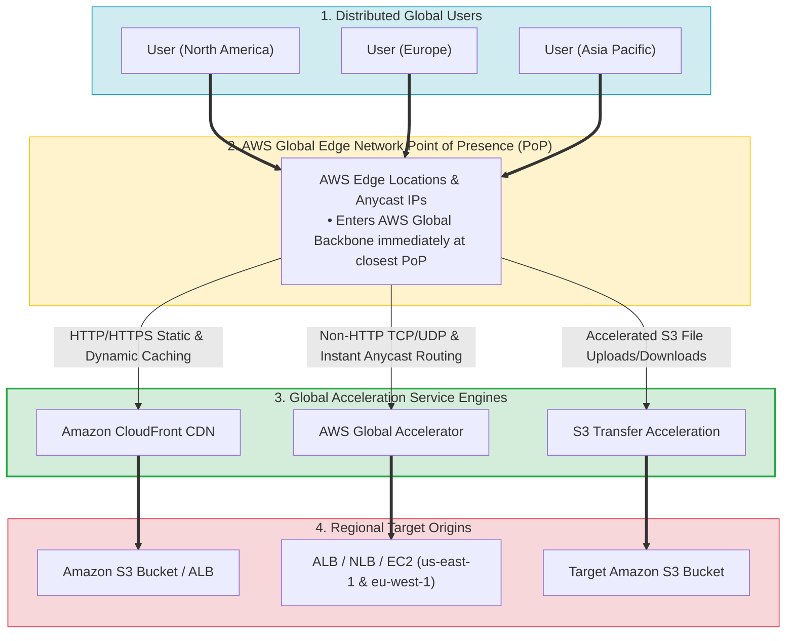
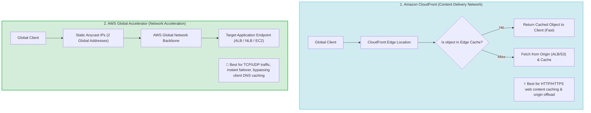
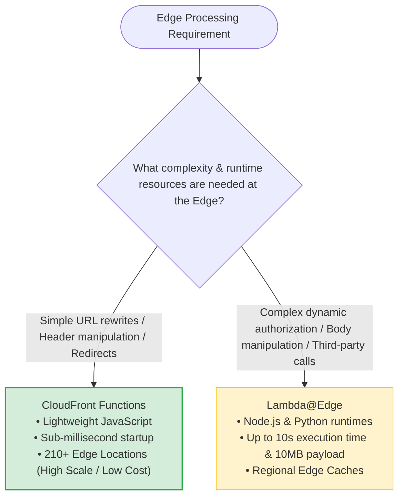
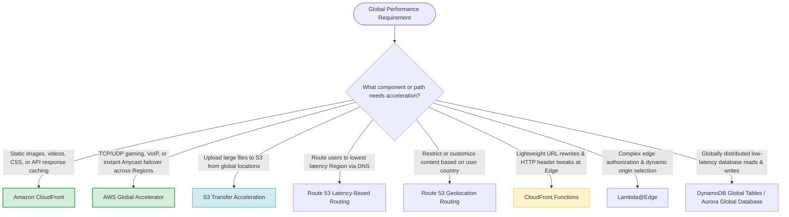
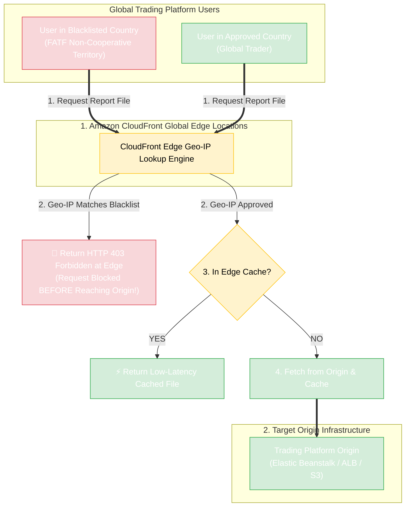
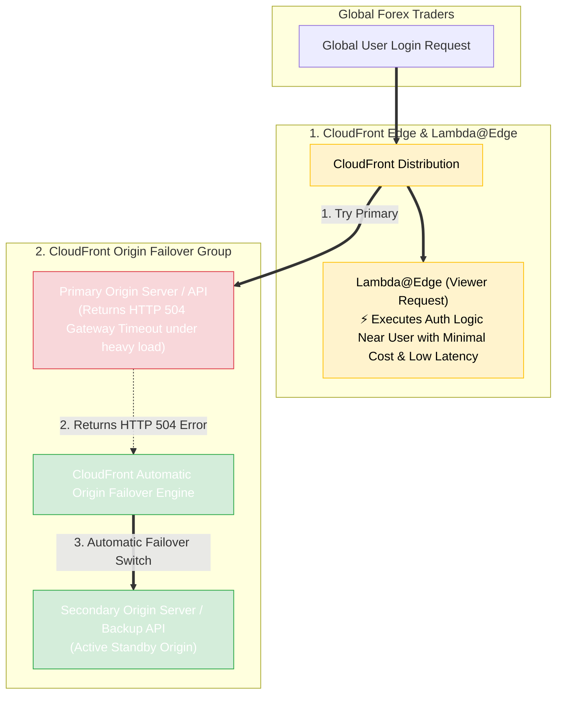
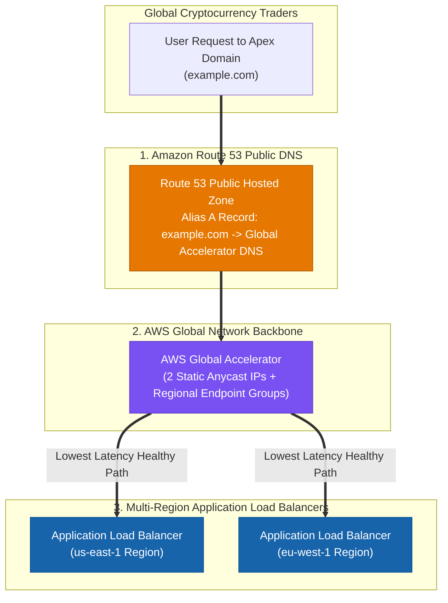
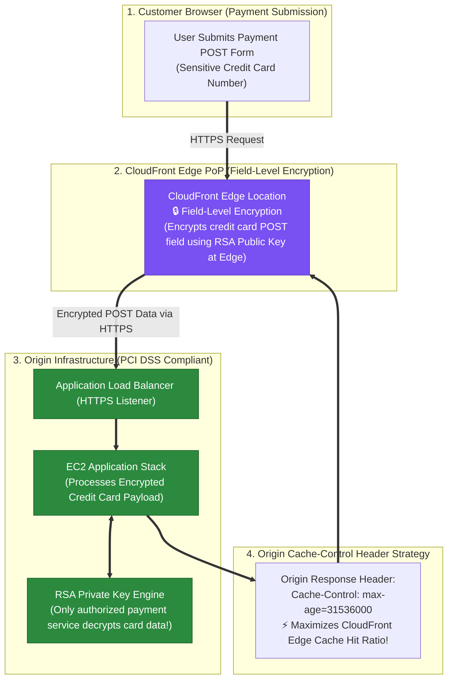

# Task 3.3: Determine a Strategy to Improve Performance — Global Service Offerings

> [!NOTE]
> **Exam Mindset**: For the AWS Solutions Architect Professional (SAP-C02) and AI Practitioner (AIP-C01) exams, global service offerings optimize user experience by moving traffic, content, compute, or data closer to global users:
> **User Location** $\rightarrow$ **Bottleneck Analysis (Network Latency / Caching / DNS Caching / Uploads)** $\rightarrow$ **Global Service Selection** $\rightarrow$ **Cost & Operational Overhead Optimization**.

---

## 1. AWS Global Network & Acceleration Architecture



---

## 2. CloudFront vs. AWS Global Accelerator Traffic Flow Comparison



---

## 3. Global Acceleration Services Breakdown Matrix

| Global Service | Traffic Protocol | Caching Capability | Key Architectural Benefit | Key Exam Keyword Trigger |
| :--- | :--- | :--- | :--- | :--- |
| **Amazon CloudFront** | HTTP / HTTPS | **Yes (Edge Caching)** | Caches static/dynamic web content near users | *"Cache static content / Reduce origin load / CDN"* |
| **AWS Global Accelerator** | TCP / UDP / HTTP | **No** | Static Anycast IPs; instant failover over AWS backbone | *"TCP/UDP acceleration / Static IP / Avoid DNS caching delays"* |
| **S3 Transfer Acceleration** | HTTP / HTTPS (S3) | **No** | Accelerates global file uploads to S3 via Edge PoPs | *"Upload large files to S3 globally / Long-distance transfer"* |
| **Route 53 Latency Routing**| DNS | **No** | Routes users to the AWS Region with lowest network latency | *"Route users to nearest Region based on network latency"* |
| **Route 53 Geolocation Routing**| DNS | **No** | Routes users based on geographic country or continent | *"Route users based on country / Content localization / Compliance"* |

---

## 4. Edge Computing Decision Matrix (CloudFront Functions vs. Lambda@Edge)



> [!IMPORTANT]
> **Bypassing Client DNS Caching Delays via Global Accelerator**:
> When an application requires **rapid failover or traffic shifting (blue/green)** between AWS Regions, standard Route 53 DNS weighted routing can be delayed by client DNS caching (TTL). **AWS Global Accelerator** provides **2 static Anycast IP addresses** and routes traffic inside the AWS global network backbone, performing endpoint health checks and traffic shifting within seconds without relying on client DNS cache expiration.

---

## 5. CloudFront Functions vs. Lambda@Edge Feature Comparison

| Feature / Capability | CloudFront Functions | Lambda@Edge |
| :--- | :--- | :--- |
| **Primary Use Case** | Simple URL rewrites, header tweaks, redirects | Complex authorization, body manipulation, origin selection |
| **Runtime Support** | Lightweight JavaScript (ECMAScript 5.1+) | Node.js, Python |
| **Execution Location** | 210+ CloudFront Edge Locations | Regional Edge Caches |
| **Execution Time Limit** | Sub-millisecond (< 1 ms) | Up to 5 seconds (Viewer) / 30 seconds (Origin) |
| **Network & File Access** | No network access, no body access | Full network access, body access allowed |
| **Cost & Scale** | Extremely low cost, high scale | Standard Lambda pricing tier |

---

## 6. Route 53 Latency Routing vs. Geolocation Routing

> [!TIP]
> **Latency vs. Geolocation Distinction**:
> - **Latency-Based Routing**: Sends the user to the AWS Region that provides the **lowest network latency** (measured via real-time latency probes).
> - **Geolocation Routing**: Sends the user to a specific endpoint based on their **geographic location (country, continent, or state)** regardless of latency. Use Geolocation for content licensing, language localization, or regulatory compliance.

---

## 7. SAP-C02 Global Service Offerings Master Selection Decision Engine



---

## 6.1 CloudFront Geo-Restriction (Geoblocking) vs. Route 53 Geolocation / Geoproximity / NACLs

When a global application must block users in specific countries (e.g. FATF blacklisted non-cooperative countries for AML/CFT compliance) while delivering web content with **low latency**, choose **CloudFront Geo-Restriction**:



### Architectural Comparison Matrix

| Geoblocking Mechanism | Caches Content for Low Latency? | Operational Complexity | Granularity & Scale | Primary Exam Use Case |
| :--- | :---: | :---: | :--- | :--- |
| **CloudFront Geo-Restriction** | **YES (Edge Caching)** | **Lowest (Built-in Toggle)** | **Country-level Allowlist / Blocklist** | **Default choice for low-latency web delivery + country geoblocking compliance** |
| **Route 53 Geolocation Routing**| NO (DNS Resolution Only) | Low | Country / Continent / State DNS routing | Directing DNS traffic to localized servers or localized language endpoints |
| **Route 53 Geoproximity Routing**| NO (DNS Resolution Only) | Medium | Route 53 Bias distance routing | Shifting geographic traffic boundaries towards specific AWS Regions |
| **VPC Network ACL (NACL) IP Blocking**| NO (Subnet Firewall) | **Extremely High (Fails)** | Manual IP CIDR Deny rules (Max 20–40 rules) | Blocking specific malicious individual IP addresses (NOT whole countries) |

---

## 7.1 Real-World Exam Scenario: Global Financial Platform Country-Level Geoblocking (FATF Compliance)

- **Scenario**: A global financial company launches a cryptocurrency trading platform on AWS. To comply with anti-money laundering and counter-terrorist financing (AML/CFT) laws, report files must **NOT be accessible in blacklisted countries** listed on the FATF non-cooperative territory list. The solution must ensure compliance while **delivering content globally with low latency**. What is the best solution?
- **Architecture Solution**:
  - Create an **Amazon CloudFront Distribution with Geo-Restriction enabled** to block all blacklisted countries from accessing the trading platform and report files.

### Key Technical Rationale:
1. **CloudFront Geo-Restriction**: Native feature on CloudFront distributions that restricts access at the country level using an allowlist or blocklist. Incoming requests from blacklisted countries receive an `HTTP 403 Forbidden` response directly at the nearest CloudFront edge location without hitting origin servers.
2. **Global Low Latency**: CloudFront caches static and dynamic report files across 600+ global edge points of presence (PoPs), accelerating performance for approved international users.

### Why Distractor Options Fail:
- *Route 53 Geolocation / Geoproximity Routing*: Route 53 handles DNS name resolution (translating hostnames to IPs). DNS resolution does **not** cache web application files or accelerate content delivery like a CDN. Furthermore, users accessing origin IPs directly bypass DNS routing.
- *Denying Country IP Addresses in Subnet Network ACLs (NACLs)*: Blacklisted countries contain millions of constantly shifting IP addresses. Manually maintaining thousands of country IP ranges in stateless VPC NACLs is operationally impossible, quickly exceeds NACL rule limits (maximum 20–40 rules per NACL), and fails to cache content for low-latency delivery.

---

## 7.2 Real-World Exam Scenario: Global Serverless Forex Login Optimization (Lambda@Edge + CloudFront Origin Failover)

- **Scenario**: An international foreign exchange company has a serverless forex trading portal built with AWS SAM. Millions of users worldwide experience **sluggish login speeds (taking a few minutes to log in)** and **occasional HTTP 504 Gateway Timeout errors**. As the Solutions Architect, optimize performance and eliminate 504 errors with **MINIMAL COST**. What two solutions should be implemented? (Select TWO)
- **Architecture Solution**:
  1. **Use Lambda@Edge for Authentication**: Execute the authentication process inside **Lambda@Edge** functions at CloudFront edge locations closer to users worldwide.
  2. **Configure CloudFront Origin Failover**: Create a CloudFront **Origin Group** with a primary and secondary origin. CloudFront automatically switches to the secondary origin when the primary returns HTTP status code 504 (Gateway Timeout) or 502/503 errors.



### Key Technical Rationale:
1. **Lambda@Edge for Low-Cost Global Auth**: Lambda@Edge executes viewer-request or origin-request functions across Regional Edge Caches worldwide. Moving authentication logic to the edge eliminates cross-oceanic network round-trips without paying to deploy full serverless application stacks across multiple AWS Regions.
2. **CloudFront Origin Groups for HTTP 504 Remediation**: An **Origin Group** configures CloudFront to automatically retry requests against a secondary origin when the primary origin returns `504 Gateway Timeout`, `502 Bad Gateway`, or `503 Service Unavailable` errors.

### Why Distractor Options Fail:
- *Deploying Application to Multiple AWS Regions + Route 53 Latency Routing*: Deploying complete active application stacks across multiple AWS Regions introduces massive multi-region infrastructure costs, violating the **minimal cost** requirement. Lambda@Edge achieves edge authentication at a tiny fraction of the cost.
- *Increasing Cache-Control max-age*: Authentication requests (submitting credentials, receiving OAuth/JWT tokens) are dynamic and non-cacheable. Increasing static cache `max-age` has zero effect on authentication latency or origin timeouts.
- *Geographically Dispersed VPCs + Transit VPC*: Transit VPCs manage network routing between VPCs. They are expensive, operationally complex, and do not execute serverless Lambda code closer to end users.

---

## 7.3 Real-World Exam Scenario: Multi-Region Global Accelerator with Zone Apex Domain Mapping (Route 53 Alias A Record)

- **Scenario**: A multinational financial firm deploys a cryptocurrency trading application across multiple AWS Regions (US and Europe) using containerized Kubernetes and DynamoDB Global Tables. Distributed computing resources use public Application Load Balancers (ALBs) in each region. The firm wants to make the application available through an **apex domain** (`example.com`) with low latency and high availability. What is the most operationally efficient architecture?
- **Architecture Solution**:
  1. Launch an **AWS Global Accelerator** distribution with endpoint groups targeting the specific public ALBs across the required AWS Regions (US and Europe).
  2. Create a **Public Alias A Record in Amazon Route 53** that points the custom **apex domain** (`example.com`) directly to the assigned DNS name of the accelerator (`a123456789.awsglobalaccelerator.com`).



### Key Technical Rationale:
1. **AWS Global Accelerator for Multi-Region ALBs**: Global Accelerator provides 2 static Anycast IP addresses that route user traffic over the AWS global network backbone to the nearest healthy regional ALB. It reacts instantly to regional health degradation with zero DNS caching delay.
2. **Route 53 Alias Record for Zone Apex (`example.com`)**: RFC 1034 DNS standards **prohibit placing a CNAME record at the zone apex** (`example.com`). Route 53 **Alias A Records** solve this restriction natively by mapping root zone apex domains directly to AWS service endpoints (Global Accelerator, ALBs, CloudFront) with zero query fee and instant response.

### Why Distractor Options Fail:
- *Creating a CNAME Record at the Zone Apex*: CNAME records **cannot** be placed at the root zone apex (`example.com`); DNS RFC standards only allow CNAMEs on subdomains (`www.example.com`). To map a zone apex domain, you **MUST use a Route 53 Alias A Record**.
- *Using AWS Transit Gateway to Route Web Traffic to ALBs*: AWS Transit Gateway handles inter-VPC private network routing; it cannot front or load balance public internet web traffic to public ALBs across regions.
- *AWS Transit Gateway Multicast Domain*: Multicast routes UDP multicast streams between EC2 instance subnets; it is completely invalid for HTTP/HTTPS web application load balancing.
- *Route 53 Resolver Inbound Endpoint*: Inbound Resolvers accept DNS queries from on-premises networks into a VPC; they do not map public domain names to Global Accelerator or balance public web traffic.

---

## 7.4 Real-World Exam Scenario 4: PCI DSS Compliance Field-Level Encryption & CloudFront Cache Hit Ratio Optimization

- **Scenario**: A fintech startup processing credit card payments failed a 3rd-party audit because credit card numbers were unencrypted in transit/application processing stacks (failing PCI DSS requirements). The company also wants to improve performance by increasing the proportion of viewer requests served from CloudFront edge caches instead of origin servers (improving the cache hit ratio). What is the optimal configuration?
- **Architecture Solution**:
  - Configure the **CloudFront distribution to enforce secure end-to-end connections to origin servers using HTTPS and Field-Level Encryption**. Configure your origin to add a **`Cache-Control: max-age` directive** to your objects, specifying the longest practical value for `max-age` to increase your cache hit ratio.



### Key Technical Rationale:
1. **CloudFront Field-Level Encryption for PCI DSS Compliance**: Field-Level Encryption encrypts specific sensitive data fields (e.g. up to 10 POST fields like credit card numbers) at the CloudFront edge using an RSA public key before payload data is forwarded to origin web servers. The sensitive data remains encrypted throughout the entire application stack until decrypted by an isolated backend service holding the private key.
2. **`Cache-Control: max-age` for Cache Hit Ratio**: Setting `Cache-Control: max-age` with the longest practical duration instructs CloudFront edge caches to retain objects longer, preventing unnecessary origin revalidations and maximizing cache hit ratio.

### Why Distractor Options Fail:
- *Forwarding `User-Agent` and `Host` Headers to Origin*: Adding headers like `User-Agent` or `Host` into CloudFront cache keys dramatically **DECREASES** the cache hit ratio because every web browser emits a unique `User-Agent` string, forcing CloudFront to fetch fresh content from origin servers for almost every single request!
- *CloudFront Signed URLs*: Signed URLs provide time-limited authorization to access private static content in S3 or CloudFront; Signed URLs do **NOT** encrypt sensitive payload data fields in POST requests for PCI DSS compliance!
- *Origin Access Control (OAC)*: OAC restricts S3 bucket access so objects can only be downloaded via CloudFront; OAC does **NOT** encrypt sensitive field inputs in POST requests!

---

## 8. SAP-C02 Exam Keyword Cheat Sheet

```
"Cache static web content close to users"            ──> Amazon CloudFront
"Reduce origin load and bandwidth costs"            ──> Amazon CloudFront
"Encrypt specific POST fields at the edge for PCI DSS" ──> CloudFront Field-Level Encryption
"Increase CloudFront cache hit ratio"                ──> Cache-Control max-age header / Avoid forwarding User-Agent
"Forward User-Agent header in cache key"             ──> ❌ FAILS (Dramatically DECREASES cache hit ratio!)
"Country-level compliance geoblocking with low latency" ──> CloudFront Geo-Restriction (Geoblocking)
"Execute serverless auth logic close to users at minimal cost" ──> Lambda@Edge
"Remediate HTTP 504 / 502 / 503 origin errors automatically" ──> CloudFront Origin Group (Origin Failover)
"Route zone apex domain to multi-region ALBs"        ──> Route 53 Alias A Record + AWS Global Accelerator
"CNAME at zone apex (example.com)"                  ──> ❌ FAILS (CNAME forbidden at zone apex! Use Alias A Record)
"Non-HTTP / TCP / UDP traffic acceleration"         ──> AWS Global Accelerator
"Static Anycast IP addresses for multi-Region app"   ──> AWS Global Accelerator
"Rapid blue/green traffic shifting bypassing DNS"   ──> AWS Global Accelerator (Traffic Dials)
"Upload large files to S3 from global users"         ──> S3 Transfer Acceleration
"Route to nearest Region based on network latency"   ──> Route 53 Latency-Based Routing
"Route users based on country / legal compliance"    ──> Route 53 Geolocation Routing
"Lightweight URL rewrites at CloudFront Edge"        ──> CloudFront Functions
"Complex authorization & origin selection at Edge"   ──> Lambda@Edge
```

---

## 9. Common SAP-C02 Exam Traps

1. **Trap 1: Choosing Geolocation Routing when Lowest Latency is Requested**: Geolocation routes based on country boundaries, which may not always be the lowest latency path. For network latency, select **Latency-Based Routing**.
2. **Trap 2: Selecting Global Accelerator for Caching Static Web Content**: Global Accelerator does not cache content; it accelerates TCP/UDP network paths. For web caching, select **Amazon CloudFront**.
3. **Trap 3: Using Global Accelerator for S3 File Uploads**: For accelerating long-distance file transfers specifically to S3 buckets, select **S3 Transfer Acceleration**.
4. **Trap 4: Selecting Lambda@Edge for Simple Header Manipulation**: Lambda@Edge carries higher latency and cost. For simple header tweaks, URL rewrites, or redirects, select **CloudFront Functions**.
5. **Trap 5: Using Route 53 Geolocation Routing for Content Delivery Geoblocking**: Route 53 only resolves DNS hostnames; it does NOT cache web application files or block HTTP requests at the edge. To combine low-latency global content delivery with country-level geoblocking, always select **CloudFront Geo-Restriction**.
6. **Trap 6: Deploying Full Multi-Region Stack when Edge Execution is Required at Minimal Cost**: Deploying entire multi-region app stacks with Route 53 latency routing is expensive. To accelerate authentication or dynamic edge logic at **minimal cost**, use **Lambda@Edge**.
7. **Trap 7: Using CNAME Records for Zone Apex Domains (`example.com`)**: Standard CNAME records cannot be placed at the root zone apex (`example.com`). To map a root domain to an AWS Global Accelerator or ALB, always use a **Route 53 Alias A Record**.
8. **Trap 8: Forwarding `User-Agent` Headers to Improve Cache Hit Ratio**: Including dynamic headers like `User-Agent` in CloudFront cache policies fragments the cache and **reduces** the cache hit ratio. To increase cache hit ratio, use **`Cache-Control: max-age`**.

---

## 10. Final Mental Model

`Encrypt Edge Fields (CloudFront Field-Level Encryption) ➔ Maximize Cache (Cache-Control max-age) ➔ Avoid User-Agent Header Forwarding ➔ Secure Origin (HTTPS)`