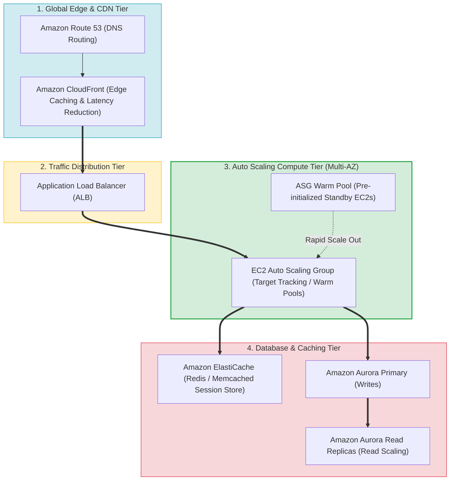
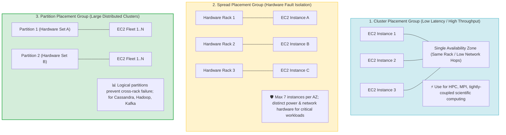
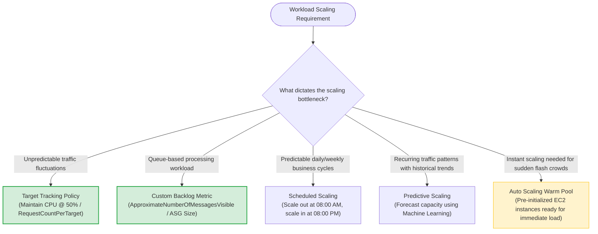
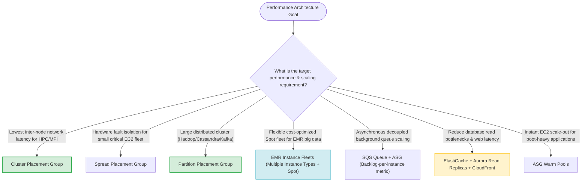
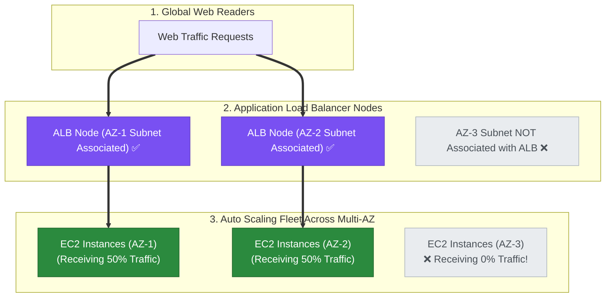
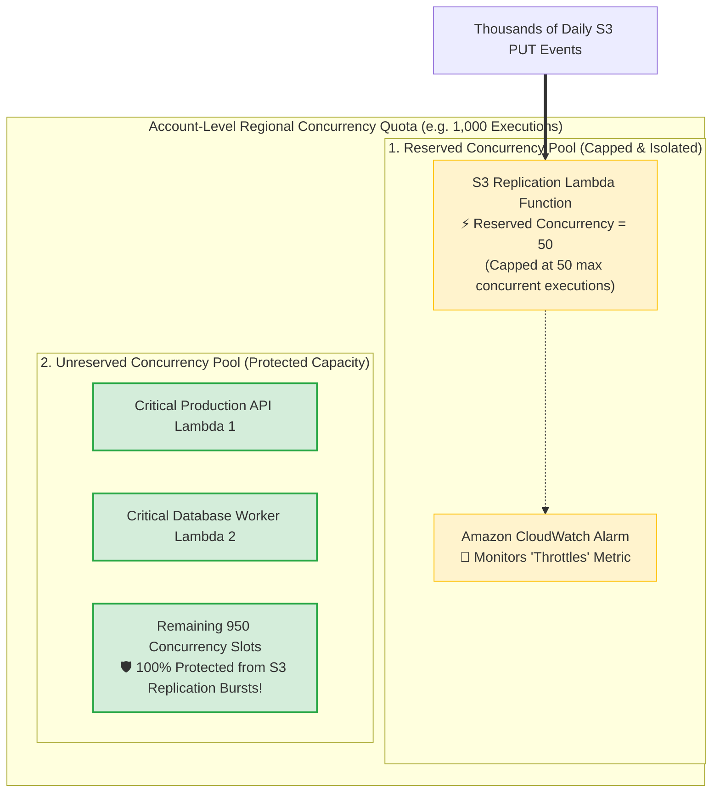
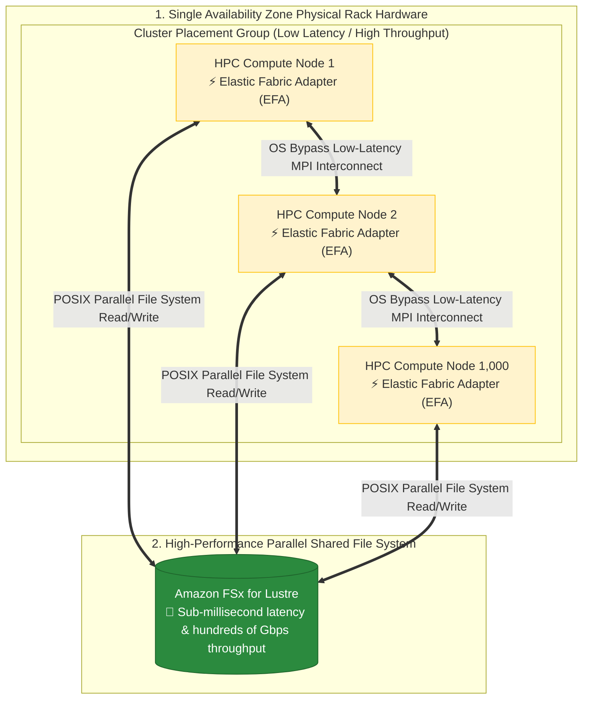
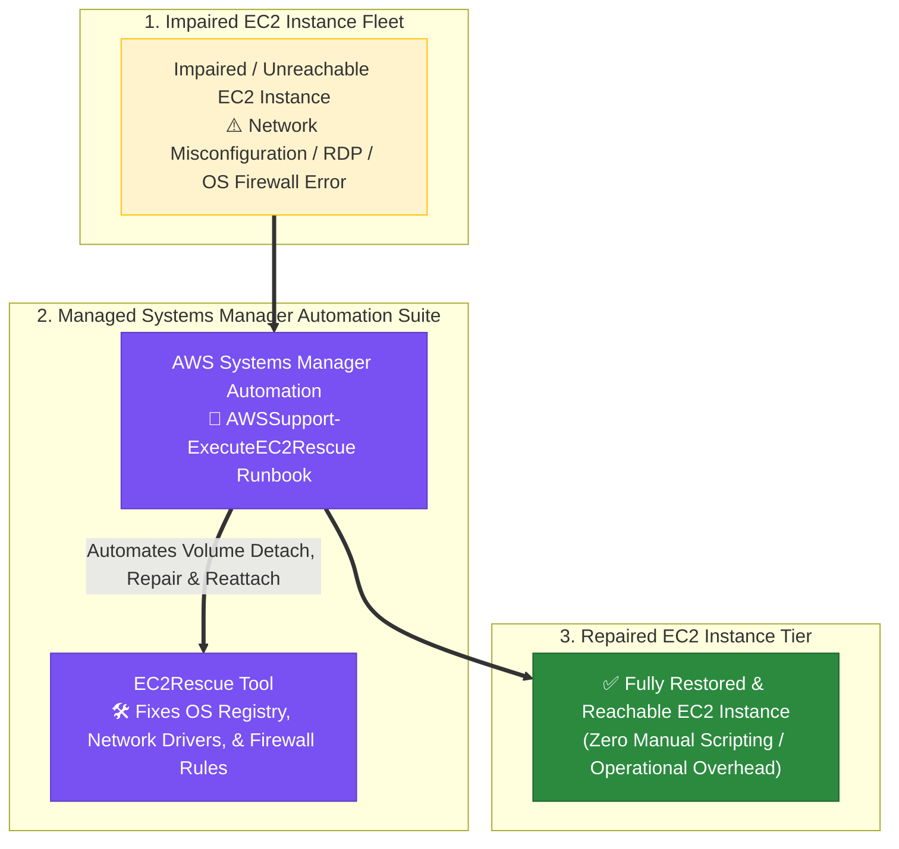

> [!NOTE]
> **Exam Mindset**: For the AWS Solutions Architect Professional (SAP-C02) and AI Practitioner (AIP-C01) exams, high-performing systems architectures optimize capacity, placement, and compute models to match actual workload bottlenecks:
> **Workload Pattern** $\rightarrow$ **Bottleneck Analysis (Compute / Latency / Database / Queue)** $\rightarrow$ **Scaling Mechanism** $\rightarrow$ **Physical Placement / Compute Type** $\rightarrow$ **Cost Efficiency**.

---

## 1. Multi-Tier Elastic Application & Caching Topology



---

## 2. EC2 Placement Groups Physical Positioning Matrix



---

## 3. Placement Groups Feature & Use Case Comparison Matrix

| Placement Group Type | Physical Hardware Placement | Primary Architectural Purpose | Ideal Workload Use Case | Key Exam Trigger Keyword |
| :--- | :--- | :--- | :--- | :--- |
| **Cluster Placement Group** | Packed tightly inside a single AZ (Same Rack) | **Lowest inter-node latency & highest throughput** | HPC, MPI, high-performance distributed simulations | *"Low network latency between instances / HPC / MPI"* |
| **Spread Placement Group** | Placed on distinct physical hardware racks | **Strict hardware fault isolation (Max 7 per AZ)** | Critical small EC2 fleet (master nodes, firewalls) | *"Critical instances must not share underlying hardware"* |
| **Partition Placement Group**| Grouped into logical hardware partitions | **Prevents cross-partition hardware failures at scale**| Large distributed workloads (Hadoop, Cassandra, Kafka) | *"Large distributed application / HDFS / Cassandra"* |

---

## 4. Auto Scaling Policy & Metric Selection Engine



> [!IMPORTANT]
> **Queue-Based Scaling Rule (SQS Backlog Metric)**:
> For asynchronous worker fleets consuming from Amazon SQS, scaling based solely on **CPU utilization is an anti-pattern**. Instead, scale the Auto Scaling Group using a custom CloudWatch metric: **Backlog Per Instance** $\left(\frac{\text{ApproximateNumberOfMessagesVisible}}{\text{ASG Capacity}}\right)$ to maintain consistent processing SLAs.

---

## 5. Auto Scaling Policy Types Breakdown

| Policy Type | Operational Behavior | Target Use Case |
| :--- | :--- | :--- |
| **Target Tracking Scaling** | Automatically adjusts capacity to maintain metric target (e.g., 50% CPU) | General web applications with variable load |
| **Step Scaling** | Scales capacity in steps based on predefined threshold breaches | Sudden, severe traffic spikes requiring scaled responses |
| **Scheduled Scaling** | Scales capacity at specific dates/times based on predictable schedules | Known business cycles (e.g. 9 AM start of business) |
| **Predictive Scaling** | Uses Machine Learning on historical trends to scale out proactively before load arrives | Recurring daily or weekly traffic cycles |
| **Warm Pools** | Keeps pre-initialized EC2 instances in Stopped/Running state | Applications with long boot/initialization times |

---

## 6. Instance Fleets & Spot Optimization for EMR & Big Data

> [!TIP]
> **EMR Instance Fleets for Maximum Capacity & Cost Efficiency**:
> For Amazon EMR big data clusters, use **Instance Fleets** rather than uniform instance groups. Instance Fleets allow specifying up to **5 instance types per node type** across On-Demand and Spot instances, maximizing capacity availability and reducing Spot interruption risks.

---

## 7. SAP-C02 High-Performance Architecture Master Selection Decision Engine



---

## 8. SAP-C02 Exam Keyword Cheat Sheet

```
"Lowest network latency between instances"           ──> Cluster Placement Group
"High network throughput for HPC / MPI"              ──> Cluster Placement Group
"Critical instances must not share underlying hardware"──> Spread Placement Group (Max 7 per AZ)
"Large distributed application (Hadoop / Cassandra)" ──> Partition Placement Group
"Predictable traffic spike every morning at 8 AM"    ──> Scheduled Scaling
"Predict capacity using historical ML patterns"      ──> Predictive Scaling
"Scale workers based on SQS queue size"             ──> Custom Metric: Backlog Per Instance
"Reduce application boot/startup latency during scale"──> Auto Scaling Warm Pools
"Flexible capacity across multiple instance types"   ──> EMR Instance Fleets / ASG Mixed Instances Policy
```

---

## 6.5 Real-World Exam Scenario: High-Availability 3-Tier Web Architecture (Stateless ASG + ElastiCache + RDS Multi-AZ & Read Replicas vs. Stateful & Multi-AZ Alone Traps)

- **Scenario**: A central hospital web portal handles millions of patient medical data requests per day. The 3-tier architecture (web, app, database) experiences unpredictable traffic spikes. The architect must ensure the infrastructure is **highly available**, **scalable**, and capable of handling web traffic fluctuations automatically with high read performance. What solution should be implemented?
- **Architecture Solution**:
  - Web & App Tiers: Run **stateless EC2 instances in an Auto Scaling group** monitored by **Amazon CloudWatch**, using **Amazon ElastiCache Serverless** for session state synchronization and microsecond read caching.
  - Database Tier: Run **Amazon RDS with Multi-AZ enabled** (for high availability and automated failover) **AND Amazon RDS Read Replicas** (to offload read-heavy database query performance).

```mermaid
flowchart TD
    subgraph ClientTier ["1. Doctor & Nurse Clients"]
        Clients["Doctors & Nurses (Millions of Requests/Day)"]
    end

    subgraph ComputeTier ["2. Stateless Auto Scaling Compute Tier"]
        ALB["Application Load Balancer"]
        ASG["Stateless EC2 Web & App Auto Scaling Group<br/>(Monitored by CloudWatch Metrics)"]
        CloudWatch["Amazon CloudWatch<br/>(Triggers Scale Out/In Alarms)"]

        Clients ==> ALB ==> ASG
        ASG <==> CloudWatch
    end

    subgraph CachingTier ["3. Session Offloading & Microsecond Cache Tier"]
        ElastiCache["Amazon ElastiCache Serverless<br/>⚡ Offloads Sessions & Fast Patient Lookups"]
        ASG <==> ElastiCache
    end

    subgraph DatabaseTier ["4. High-Availability & Read-Scaled Database Tier"]
        RDS_Primary[("Amazon RDS Primary DB<br/>(Multi-AZ Active Instance)")]
        RDS_Standby[("Amazon RDS Multi-AZ Standby<br/>🛡️ Passive Synchronous Replica for HA")]
        RDS_Replica[("Amazon RDS Read Replicas<br/>📊 Async Replicas for Read Scaling")]

        ASG ==>|"Writes & Primary Queries"| RDS_Primary
        ASG ==>|"Read Queries"| RDS_Replica
        RDS_Primary <==|"Sync Replication"==> RDS_Standby
        RDS_Primary -.->|"Async Replication"| RDS_Replica
    end

    classDef compute fill:#d1ecf1,stroke:#17a2b8,stroke-width:1px;
    classDef cache fill:#7950f2,stroke:#5f3dc4,color:#ffffff;
    classDef db fill:#2b8a3e,stroke:#1e632b,color:#ffffff;

    class Clients,ALB,ASG,CloudWatch compute;
    class ElastiCache cache;
    class RDS_Primary,RDS_Standby,RDS_Replica db;
```

### Key Technical Rationale:
1. **Stateless Compute for Elastic Auto Scaling**: Stateful instances store user sessions locally on instance disk/RAM. Scaling in or terminating stateful instances destroys active user sessions! Auto Scaling requires **stateless compute instances** with session data offloaded to external stores like **Amazon ElastiCache Serverless**.
2. **RDS Multi-AZ vs. RDS Read Replicas**:
   - **RDS Multi-AZ**: Provides high availability and disaster recovery via synchronous passive standby replication across Availability Zones. Multi-AZ standbys **CANNOT** accept read queries.
   - **RDS Read Replicas**: Offloads read-heavy query traffic asynchronously from the primary database to increase read throughput. Both Multi-AZ AND Read Replicas are required to deliver high availability **and** read query performance.

### Why Distractor Options Fail:
- *Stateful Instances in Auto Scaling Group*:
  - Storing session data on instance local disks/memory causes active session loss whenever Auto Scaling terminates instances or routes requests to peers.
- *RDS Multi-AZ Alone (Without Read Replicas)*:
  - Multi-AZ standby instances are passive failover targets that do NOT accept read traffic. Omitting Read Replicas leaves the primary database vulnerable to performance degradation under heavy read queries.
- *RDS Read Replicas Alone (Without Multi-AZ)*:
  - Read Replicas provide horizontal read scaling, but do NOT provide automated 60-second failover for the primary database during an AZ outage.

---

## 6.6 Real-World Exam Scenario: Load Balancer AZ Subnet Association & Traffic Distribution Troubleshooting

- **Scenario**: A web service analyzing tweets is hosted on an Auto Scaling fleet of On-Demand EC2 instances across multiple Availability Zones behind an Application Load Balancer (ALB). After analyzing the ALB logs, the architect notices that EC2 instances launched in one specific Availability Zone are **not receiving any traffic**. What is the most likely cause?
- **Architecture Solution**: **The specific Availability Zone not receiving traffic was not associated with (enabled on) the Application Load Balancer**.
  - For an ALB to route requests to EC2 instances in an Availability Zone, at least one public or private subnet from that AZ must be explicitly added/associated with the load balancer configuration.



### Key Technical Rationale:
1. **ALB Subnet Association Requirement**:
   - Elastic Load Balancers deploy nodes into specific subnets in each enabled Availability Zone. If an Availability Zone's subnet is not added to the ALB configuration, no load balancer nodes exist in that AZ, and traffic will not be routed to registered target instances in that unassociated AZ.
2. **Cross-Zone Load Balancing Mechanics**:
   - **Cross-Zone Enabled**: Load balancer nodes distribute traffic evenly across ALL registered targets in ALL enabled AZs.
   - **Cross-Zone Disabled**: Each load balancer node routes 100% of its incoming traffic exclusively to targets within its local AZ.

### Why Distractor Options Fail:
- *Amazon EC2 Auto Scaling does not span multiple AZs*:
  - EC2 Auto Scaling Groups natively span multiple Availability Zones within an AWS Region to ensure high availability and balanced capacity distribution.
- *Multi-AZ Auto Scaling only works in N. Virginia (`us-east-1`)*:
  - Multi-AZ Auto Scaling works natively in all commercial AWS Regions worldwide.
- *Must manually add instances in each AZ for them to receive traffic*:
  - Auto Scaling automatically registers newly launched EC2 instances with the ALB target group; manual target registration is not required.

---

## 6.7 Real-World Exam Scenario: Managing High-Volume Lambda S3 Replication & Concurrency Isolation (Reserved Concurrency + CloudWatch Throttles Alarm vs. Exponential Backoff & 5-Min Timeout Traps)

- **Scenario**: A company's data analysts upload generated data points to a primary S3 bucket, triggering an AWS Lambda function to replicate objects to destination S3 buckets across multiple AWS accounts. Thousands of daily object uploads trigger thousands of S3 event Lambda invocations. The company is concerned that this non-urgent replication function will exhaust the regional account-level concurrency quota (default 1,000) and starve other critical Lambda functions. The replication does not need to happen in real time, and the solution must require the **LEAST amount of development effort**. How should this be configured?
- **Architecture Solution**:
  - Configure a **Reserved Concurrency Limit** for the replication Lambda function to cap its maximum execution capacity.
  - Set up an **Amazon CloudWatch alarm** on the `Throttles` metric for the Lambda function to monitor if the concurrency limit is reached.



### Key Technical Rationale:
1. **Reserved Concurrency for Blast Radius Isolation & Zero Code Effort**:
   - **Reserved Concurrency** creates a dedicated execution pool for a specific function while **capping** its maximum concurrency. Setting a reserved concurrency limit (e.g. 50) prevents a high-burst non-urgent function from using unreserved concurrency slots, guaranteeing that the rest of the account-level pool (e.g. 950) remains isolated and available for critical Lambda functions.
   - Configuring Reserved Concurrency is a simple AWS configuration setting (`ReservedConcurrentExecutions`) requiring **LEAST development effort** (zero code edits).
2. **CloudWatch `Throttles` Metric Monitoring**:
   - When a function exceeds its reserved concurrency limit, Lambda throttles excess invocations. Monitoring the `Throttles` metric via CloudWatch alarms alerts administrators if the limit needs adjustment.

### Why Distractor Options Fail:
- *Implement an Exponential Backoff Algorithm in Lambda Code (Your Selection)*:
  - **Logical Flaw**: A Lambda function MUST already be invoked and running in an active execution environment to execute backoff code! If the account-level concurrency quota is exhausted, Lambda cannot initialize an environment to run your code or backoff algorithm.
  - **Development Effort**: Writing custom exponential backoff logic requires writing custom code, violating the **LEAST development effort** requirement. Setting **Reserved Concurrency** requires zero code edits.
- *Set Execution Timeout to 5 Minutes*:
  - Extending execution timeout forces Lambda functions to hold open execution environments for 5 minutes, keeping concurrency slots occupied even longer. This **exacerbates** concurrency exhaustion and starves other functions further!
- *Decouple to Separate AWS Account + SQS Queue*:
  - Creating a new AWS account, cross-account IAM roles, and SQS queue infrastructure introduces significant operational and setup overhead, violating **LEAST development effort**. Setting **Reserved Concurrency** achieves isolation instantly within the existing account.

---

## 8.8 Real-World Exam Scenario 8: Tightly-Coupled HPC Cluster Performance Optimization (Cluster Placement Group + Elastic Fabric Adapter EFA + Amazon FSx for Lustre vs. EFS, Multiple ENIs & EBS RAID 0 Traps)

- **Scenario**: A data analytics company runs tightly-coupled High-Performance Computing (HPC) simulations on an AWS cluster. When expanding from 200 to 1,000 EC2 instances sharing files on an Amazon EFS mount, the cluster experiences severe performance degradation due to inter-node network latency and shared file system throughput bottlenecks. Which THREE actions will achieve maximum performance for this HPC cluster? (Select THREE)
- **Architecture Solution**:
  - Re-launch all compute EC2 instances within a **single Availability Zone inside a Cluster Placement Group**.
  - Equipping the compute EC2 instances with an **Elastic Fabric Adapter (EFA)** network interface.
  - Replace Amazon EFS with **Amazon FSx for Lustre** for shared file storage.



### Key Technical Rationale:
1. **Cluster Placement Group in a Single AZ**:
   - Tightly-coupled HPC workloads rely on continuous inter-node communication (Message Passing Interface - MPI). Placing all 1,000 EC2 instances inside a single AZ in a **Cluster Placement Group** packs them onto the same physical hardware rack with ultra-low latency and high-throughput inter-instance bandwidth.
2. **Elastic Fabric Adapter (EFA)**:
   - **EFA** is a specialized network interface that enables **OS bypass** networking for HPC and ML applications. By bypassing the operating system kernel, EFA delivers ultra-low latency, low-jitter inter-node communication necessary for scaling tightly-coupled parallel workloads across thousands of CPU cores.
3. **Amazon FSx for Lustre**:
   - Amazon EFS is an NFS file system designed for general-purpose Linux workloads and becomes a massive throughput/IOPS bottleneck under 1,000 concurrent HPC compute nodes. **Amazon FSx for Lustre** is an open-source, POSIX-compliant parallel file system built specifically for HPC, AI/ML, and video processing, providing sub-millisecond latencies, hundreds of Gbps throughput, and millions of IOPS.

### Why Distractor Options Fail:
- *Attaching Multiple Standard Network Interfaces (ENIs)*:
  - **No OS Bypass**: Standard ENIs do NOT support OS bypass networking or lower inter-node MPI latency. Furthermore, multiple ENIs on nodes do nothing to resolve the shared file system bottleneck of Amazon EFS.
- *Spreading EC2 Instances Across Multiple Availability Zones*:
  - **Increased Latency**: Spreading nodes across multiple AZs increases physical network distance and inter-AZ transit delays, crippling tightly-coupled HPC workloads that depend on sub-millisecond node communication.
- *Using Amazon EBS Throughput Optimized (st1) / RAID 0 Volumes*:
  - **No 1,000-Node Shared Access**: EBS `st1` volumes cannot be attached across 1,000 EC2 instances simultaneously. EBS Multi-Attach is strictly limited to Provisioned IOPS SSD (`io1`/`io2`) volumes for up to 16 Linux instances in a single AZ—it cannot serve as a shared file system for 1,000 nodes.

---

## 8.9 Real-World Exam Scenario 9: Automated Recovery of Impaired EC2 Instances via Systems Manager Automation (`EC2Rescue` + `AWSSupport-ExecuteEC2Rescue` vs. AWS Config & Session Manager Traps)

- **Scenario**: A company runs hundreds of EC2 instances in an Amazon VPC. Whenever an EC2 instance becomes impaired or unreachable (due to network misconfigurations, RDP issues, OS firewall settings, or corrupted drivers), the architect performs manual recovery steps. Management wants an automated solution to diagnose and recover impaired EC2 Linux and Windows Server instances to meet compliance with minimal operational overhead. What solution should be implemented?
- **Architecture Solution**:
  - Use the **EC2Rescue tool** to diagnose and troubleshoot problems on EC2 Linux and Windows Server instances.
  - Automatically run the tool using **AWS Systems Manager Automation** and the pre-defined **`AWSSupport-ExecuteEC2Rescue`** runbook document.



### Key Technical Rationale:
1. **EC2Rescue Tool**:
   - **EC2Rescue** is an AWS-provided troubleshooting utility specifically built to fix OS-level issues on unreachable EC2 Linux and Windows instances (repairing broken firewall rules, misconfigured network settings, or corrupt RDP/registry keys).
2. **AWS Systems Manager Automation (`AWSSupport-ExecuteEC2Rescue`)**:
   - AWS provides a pre-defined managed Automation document: **`AWSSupport-ExecuteEC2Rescue`**. It orchestrates the multi-step recovery process automatically (stopping the impaired instance, attaching its root volume to a temporary rescue instance, running EC2Rescue, and reattaching the repaired volume) with zero custom code or manual intervention.

### Why Distractor Options Fail:
- *AWS Config + SSM Session Manager + Custom Lambda Script (Your Selection)*:
  - **Service & Connection Capability Failures**:
    1. **AWS Config**: Evaluates resource configuration metadata (e.g. checking if S3 buckets are encrypted); it CANNOT diagnose internal OS kernel, RDP, or network driver errors inside an EC2 instance.
    2. **SSM Session Manager**: Requires a functioning SSM Agent and active network connection. When an instance is impaired due to network/firewall misconfigurations, Session Manager is completely unreachable!
    3. **High Operational Overhead**: Writing custom CloudWatch alarms, Lambda scripts, and SSM Run Commands creates excessive development friction compared to using AWS's built-in managed runbook.
- *EC2Rescue + Custom AWS Lambda Script*:
  - **Unnecessary Custom Development**: Writing custom Lambda code to handle volume detachment, rescue instance lifecycle, and reattachment introduces maintenance overhead. The AWS-managed **`AWSSupport-ExecuteEC2Rescue`** SSM Automation document does this out-of-the-box natively.

---


## 9. Common SAP-C02 Exam Traps

1. **Trap 1: Confusing Cluster Placement Groups with Spread Placement Groups**: Cluster groups pack instances *together* for low network latency; Spread groups push instances *apart* onto distinct hardware for fault isolation.
2. **Trap 2: Using CPU Utilization for SQS Queue Worker Scaling**: When scaling worker fleets processing queue messages, CPU does not reflect queue depth. Always scale using **Backlog Per Instance**.
3. **Trap 3: Attempting to Deploy Spread Placement Groups for Hundreds of Instances**: Spread placement groups are limited to **7 instances per AZ**. For large distributed fleets, use **Partition Placement Groups**.
4. **Trap 4: Scaling Up (Vertical) Instead of Scaling Out (Horizontal) for Web Fleets**: Scaling up a single EC2 instance creates a single point of failure and hard limits. For stateless web workloads, always **scale out horizontally**.
5. **Trap 5: Assuming RDS Multi-AZ Offloads Database Read Queries**: Multi-AZ standby instances are purely passive failover targets for HA and CANNOT accept read queries. To scale read query performance, always add **RDS Read Replicas**, and offload web session state using **Amazon ElastiCache**.
6. **Trap 6: Assuming Unrouted Multi-AZ EC2 Auto Scaling Traffic is Caused by Auto Scaling Limits**: Auto Scaling natively spans multiple AZs across all global AWS regions without manual instance registration. If EC2 instances in a specific AZ receive zero load balancer traffic, the cause is that the **Availability Zone (subnet) was not associated with the Elastic Load Balancer**.
7. **Trap 7: Writing Exponential Backoff Code inside Lambda to Prevent Concurrency Exhaustion**: If the account-level regional concurrency limit (e.g. 1,000) is reached, Lambda cannot initialize an execution environment to run your code or backoff script! Writing custom backoff code also adds unnecessary development effort. To isolate non-urgent high-burst functions and protect critical workloads with the **LEAST development effort**, configure a **Reserved Concurrency Limit** on the non-urgent Lambda function and monitor the **CloudWatch `Throttles` metric**.

---

## 10. Final Mental Model

`Stateless Compute (ASG + ElastiCache Session Store) ➔ HA Database (RDS Multi-AZ) ➔ Read Query Scaling (RDS Read Replicas) ➔ ALB Subnet Association in All Target AZs`