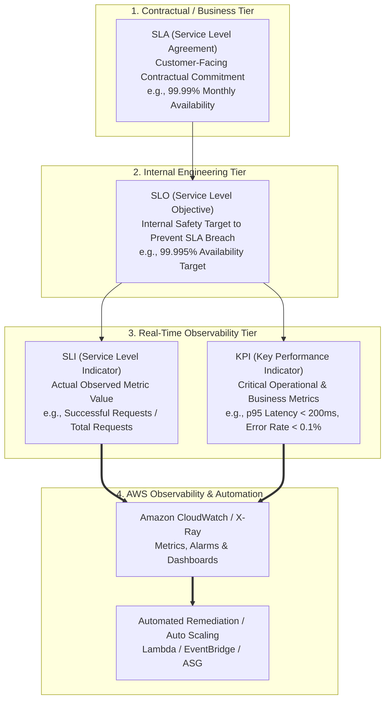
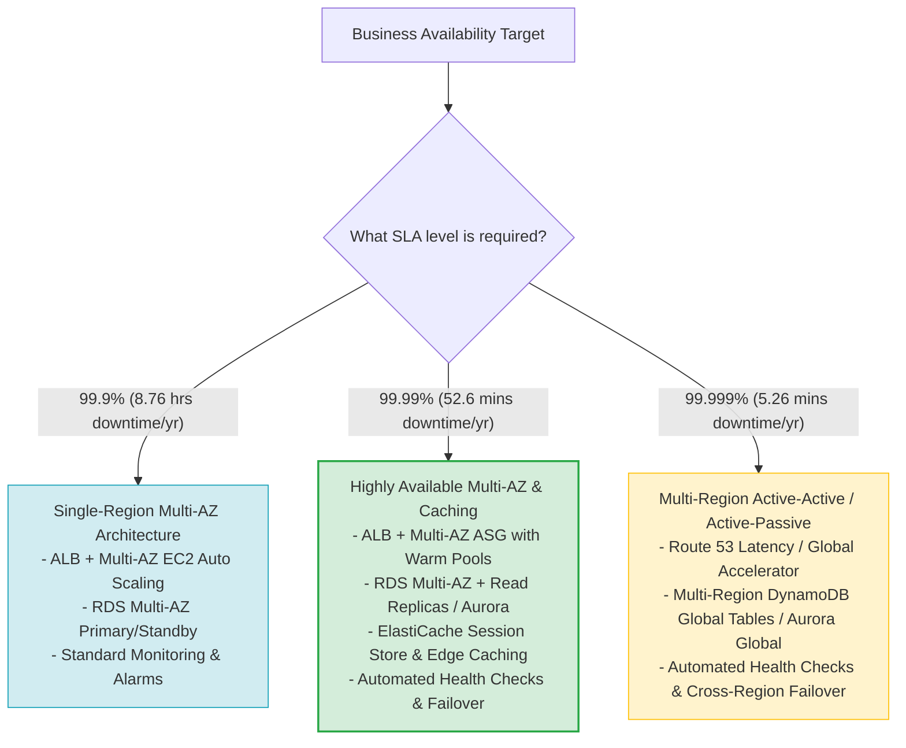
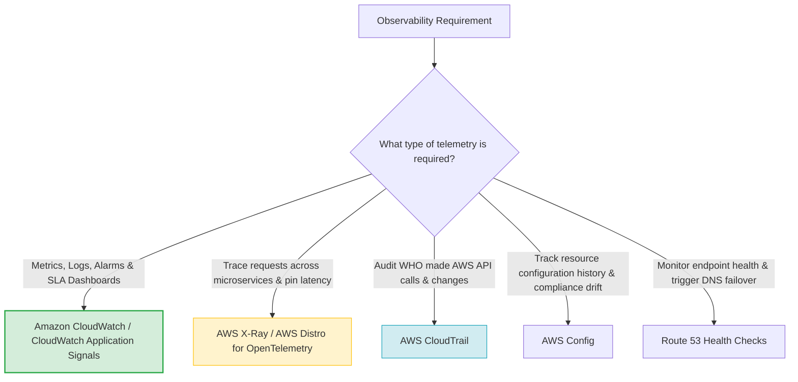
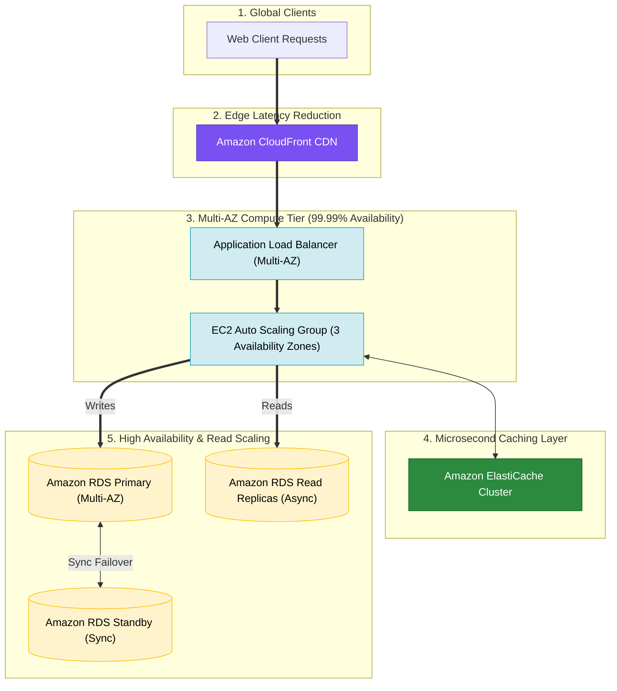
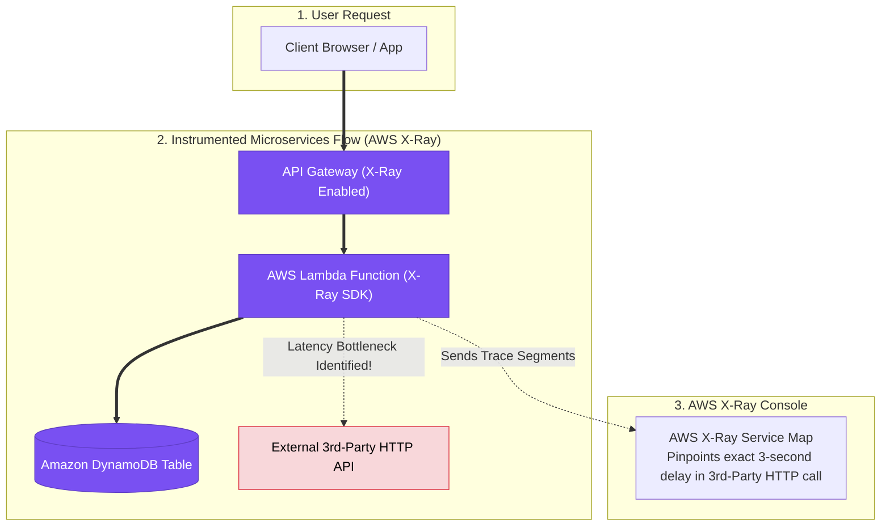

# Task 3.3: Determine a Strategy to Improve Performance — SLAs & KPIs

> [!NOTE]
> **Exam Mindset**: For the AWS Solutions Architect Professional (SAP-C02) and AI Practitioner (AIP-C01) exams, SLAs and KPIs drive architectural decisions. A Solutions Architect does not optimize infrastructure first—start with the business requirement, convert it into measurable KPIs, and then design the architecture required to meet those targets:  
> **Business Requirement** $\rightarrow$ **SLA / SLO** $\rightarrow$ **SLI / KPI Selection** $\rightarrow$ **Architecture Design** $\rightarrow$ **Observability & Monitoring** $\rightarrow$ **Automated Remediation**.

---

## 1. SLA vs. SLO vs. SLI vs. KPI Framework

Understanding the distinctions between **SLA**, **SLO**, **SLI**, and **KPI** is essential for answering SAP-C02 architectural design and observability questions.



### Terminology Comparison Matrix

| Concept | Full Name | Primary Owner | Purpose | Concrete Example |
| :--- | :--- | :--- | :--- | :--- |
| **SLA** | Service Level Agreement | Business / Legal | Customer-facing agreement with financial/legal penalties for breach | *"99.99% monthly availability with service credits for downtime"* |
| **SLO** | Service Level Objective | Engineering / Ops | Stricter internal target designed to ensure the SLA is never breached | *"Engineering targets 99.995% availability internally"* |
| **SLI** | Service Level Indicator | Monitoring System | Quantifiable measurement of actual real-time service performance | *"Current availability = 99.997% (Successful Requests / Total Requests)"* |
| **KPI** | Key Performance Indicator | Business & Engineering | High-level metrics indicating system health and business outcomes | *"p95 Latency < 200 ms, Checkout Conversion Rate > 99.5%"* |

---

## 2. How Availability SLAs Drive Architecture Selection

Higher SLA commitments exponentially increase architectural complexity, redundancy requirements, and financial costs.



### SLA Downtime Allowance & Architectural Requirements

| SLA Availability | Allowed Downtime per Year | Allowed Downtime per Month | Minimum AWS Architectural Requirements |
| :--- | :--- | :--- | :--- |
| **99.0%** ("Two Nines") | 3.65 days | 7.31 hours | Single EC2 instance with automated recovery or single-AZ ALB + EC2 |
| **99.9%** ("Three Nines") | 8.76 hours | 43.8 minutes | Multi-AZ deployment (ALB + Multi-AZ Auto Scaling + RDS Multi-AZ) |
| **99.99%** ("Four Nines") | 52.56 minutes | 4.38 minutes | Multi-AZ + ElastiCache + Aurora + Route 53 health check failover |
| **99.999%** ("Five Nines") | 5.26 minutes | 26.3 seconds | Multi-Region Active-Active (Global Accelerator / DynamoDB Global Tables) |

> [!WARNING]
> **SAP Exam Cost Principle**: Do **not** automatically select a Multi-Region Active-Active deployment unless the scenario explicitly demands **99.999% availability** or **near-zero RTO/RPO**. If a scenario asks for a "cost-effective" solution with 99.99% availability, choose a **Multi-AZ architecture**.

---

## 3. Key Performance Indicators (KPIs) & Latency Percentiles

### Why Percentiles (p95, p99) Matter Over Averages

Relying on **average latency (p50)** masks severe performance degradation for high-value users.

$$\text{Average Latency} = \frac{\sum \text{Response Times}}{N}$$

* **Example Scenario**:
  * $95\%$ of requests take **$100\text{ ms}$**
  * $5\%$ of requests take **$2,000\text{ ms}$ ($2\text{ seconds}$)**
  * **Average Latency**: $\approx 195\text{ ms}$ (Looks acceptable)
  * **p95 Latency**: **$2,000\text{ ms}$** (Reveals that $5\%$ of users experience severe lag)

> **Exam Takeaway**: AWS SAP-C02 questions evaluate performance using **p95** or **p99 percentiles** to measure tail latency for critical transactions.

---

### KPI Category Matrix

| KPI Category | Metric Name | CloudWatch / AWS Metric Source | Architectural Action When Threshold Breached |
| :--- | :--- | :--- | :--- |
| **Availability** | HTTP 5xx Error Rate | `ALB HTTPCode_Target_5XX_Count` | Scale out target ASG or fail over to secondary origin |
| **Performance** | Target Response Time | `ALB TargetResponseTime (p95 / p99)` | Add ElastiCache layer or scale out application compute |
| **Reliability** | Health Check Failures | `Route53 UnHealthyHostCount` | Trigger Route 53 DNS failover to healthy endpoint |
| **Scalability** | Queue Backlog per Instance | `SQS ApproximateNumberOfMessagesVisible` | Scale worker ASG based on Backlog-per-Instance metric |
| **Database** | CPU / Read Latency | `RDS CPUUtilization` / `ReadLatency` | Add RDS Read Replicas or migrate to Aurora |

---

## 4. AWS Observability & Observability Tools Matrix

Selecting the correct AWS monitoring service depends on the specific observability domain:



### AWS Observability Services Comparison

| AWS Service | Telemetry Type | Primary Purpose | Key Exam Trigger Keywords |
| :--- | :--- | :--- | :--- |
| **Amazon CloudWatch** | Metrics, Logs, Alarms | Primary resource monitoring & alarm engine | *"Monitor CPU/Memory / Create alarm / Auto Scaling trigger"* |
| **CloudWatch Application Signals** | Application SLOs / APM | Automated discovery & tracking of application SLOs | *"Track application SLOs / APM / SLA compliance"* |
| **AWS X-Ray** | Distributed Traces | Pinpoints latency bottlenecks across microservices | *"Trace requests across microservices / Identify latency bottleneck"* |
| **AWS CloudTrail** | API Audit Logs | Audits user actions and API call history | *"Who made the API call? / Audit changes / Security governance"* |
| **AWS Config** | Configuration History | Evaluates resource compliance and drift | *"Configuration history / Compliance drift / Unapproved changes"* |
| **Route 53 Health Checks** | Endpoint Status | Monitors endpoint availability for DNS routing | *"Health checks / Failover DNS routing / External monitoring"* |

---

## 5. SLA-Driven Auto Scaling & Caching Strategies

### 1. SQS Backlog-per-Worker Auto Scaling Rule

Scaling asynchronous SQS worker fleets based purely on CPU utilization is an **anti-pattern**. Instead, scale the Auto Scaling Group using a custom CloudWatch metric:

$$\text{Backlog Per Worker} = \frac{\text{SQS ApproximateNumberOfMessagesVisible}}{\text{ASG Current Capacity}}$$

* **Target Tracking Metric**: Maintain `Backlog Per Worker` $\le 100$ messages per instance to preserve processing SLAs.

### 2. Caching Strategy for Latency KPIs

When the KPI mandates **p95 latency $< 50\text{ ms}$**, evaluate caching layers:

* **Edge Caching**: Amazon CloudFront for static assets & dynamic HTTP API responses.
* **Database In-Memory Caching**: Amazon ElastiCache (Redis / Memcached) for database read queries and user session offloading.
* **Database Engine Optimization**: Amazon Aurora with Read Replicas or Aurora Serverless v2.

---

## 6. Real-World Exam Scenarios & Architecture Solutions

### Scenario 6.1: High-Availability 3-Tier Web Application with 99.99% SLA & Sub-200ms p95 Latency

- **Scenario**: A financial platform requires an SLA of **99.99% monthly availability** and a KPI of **p95 API response time $< 200\text{ ms}$**. The application uses an Application Load Balancer, EC2 web instances, and an RDS database. How should the architect design the solution for high availability and low latency?
- **Architecture Solution**:
  - Deploy the ALB and EC2 instances across **at least 3 Availability Zones** managed by an **Auto Scaling Group**.
  - Configure **Amazon ElastiCache** in front of the database to cache read queries and store user session states.
  - Deploy **Amazon RDS with Multi-AZ enabled** (for HA failover) and **RDS Read Replicas** (to offload read queries).



---

### Scenario 6.2: Microservices Latency Bottleneck Identification via AWS X-Ray

- **Scenario**: A microservices application running on Amazon EKS and AWS Lambda is experiencing intermittent SLA violations where **p99 latency exceeds 3 seconds**. Developers cannot determine which downstream service (API Gateway, Lambda, DynamoDB, or external HTTP service) is causing the delay. What is the most efficient solution?
- **Architecture Solution**:
  - Instrument the application code with the **AWS X-Ray SDK** or **AWS Distro for OpenTelemetry (ADOT)**.
  - Enable X-Ray tracing on API Gateway, Lambda, and EKS deployments to visualize the service map and trace latency across call segments.



---

## 7. SAP-C02 Exam Keyword Cheat Sheet

```text
"99.99% availability requirement"                   ──> Multi-AZ + Auto Scaling + RDS Multi-AZ + ElastiCache
"99.999% availability / Near-zero RTO"               ──> Multi-Region Active-Active + Global Accelerator / Route 53
"p95 / p99 latency metric"                           ──> Tail latency measurement (Use CloudWatch / X-Ray)
"Identify downstream microservice latency bottleneck"──> AWS X-Ray / OpenTelemetry
"Scale SQS worker fleet based on queue depth"        ──> Custom Metric: Backlog Per Instance
"Audit user actions and API calls"                  ──> AWS CloudTrail
"Detect configuration drift and compliance"          ──> AWS Config
"Automate remediation on SLA threshold breach"       ──> CloudWatch Alarm ──> EventBridge ──> Systems Manager / Lambda
```

---

## 8. Common SAP-C02 Exam Traps

1. **Trap 1: Selecting Multi-Region for 99.99% SLA**: 99.99% availability is achievable within a single AWS Region using **Multi-AZ deployments**. Selecting Multi-Region for 99.99% introduces unnecessary cost and operational overhead.
2. **Trap 2: Scaling SQS Workers on CPU Utilization**: CPU utilization does not reflect queue depth. Always scale SQS worker fleets using a **Backlog-per-Instance** custom CloudWatch metric.
3. **Trap 3: Confusing CloudWatch with CloudTrail**: CloudWatch monitors system performance, metrics, and logs. CloudTrail audits **WHO made API calls** and configuration modifications.
4. **Trap 4: Relying on Average Latency (p50)**: Average latency masks poor tail performance for high-value users. Always evaluate **p95** or **p99** percentiles for SLA compliance.
5. **Trap 5: Assuming RDS Multi-AZ Offloads Read Queries**: RDS Multi-AZ standby instances are passive failover targets and **cannot** serve read traffic. To scale read queries, add **RDS Read Replicas**.

---

## 9. Final Decision Framework & Mental Model

```text
SLA (Customer Contract) ➔ SLO (Internal Engineering Target) ➔ SLI / KPI (CloudWatch Measurement) ➔ Architecture Design (Multi-AZ / Multi-Region) ➔ Automated Remediation
```

### Step-by-Step SAP-C02 Decision Chain

1. **Identify the SLA Target**: Is it 99.9% (Multi-AZ), 99.99% (Multi-AZ + Caching), or 99.999% (Multi-Region)?
2. **Select the KPI Metric**: Use **p95/p99 latency**, **error rate**, or **Backlog-per-Instance** rather than raw CPU or average latency.
3. **Choose the Observability Tool**: Use **CloudWatch** for metrics/alarms, **X-Ray** for distributed microservice tracing, **CloudTrail** for API auditing, and **AWS Config** for compliance.
4. **Enforce Automated Remediation**: Connect CloudWatch Alarms to **Auto Scaling Policies**, **EventBridge**, **AWS Lambda**, or **Systems Manager Automation**.