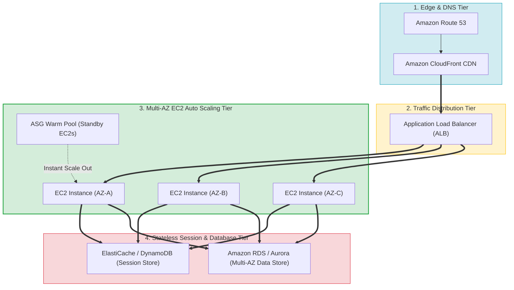
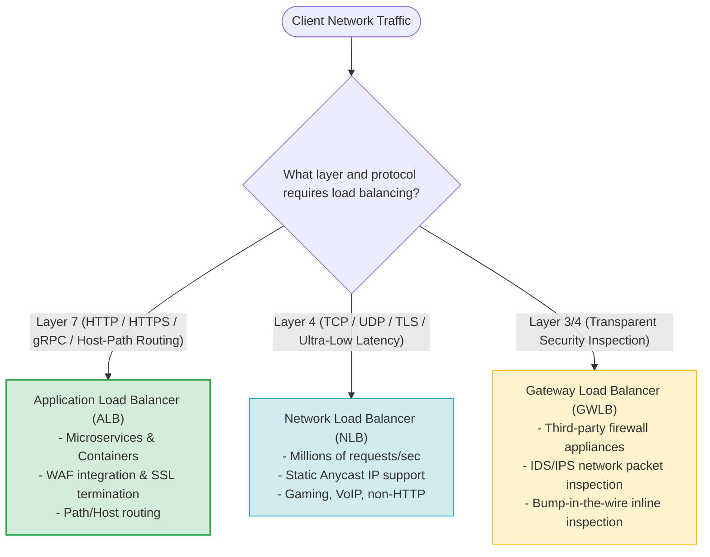
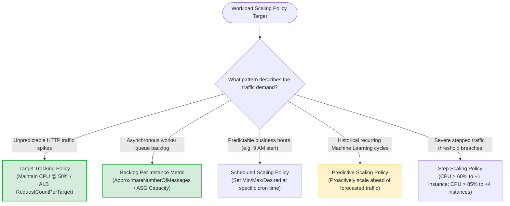
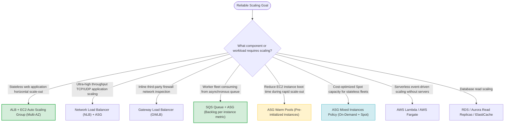

# Task 3.4: Determine a Strategy to Improve Reliability — Scaling Methodologies

> [!NOTE]
> **Exam Mindset**: For the AWS Solutions Architect Professional (SAP-C02) and AI Practitioner (AIP-C01) exams, scaling is a fundamental reliability mechanism:
> **Traffic / Load Demand** $\rightarrow$ **Bottleneck Analysis (CPU / Request Count / Queue Backlog)** $\rightarrow$ **Elastic Capacity Adjustment (ALB + ASG)** $\rightarrow$ **System Availability Maintenance**.

---

## 1. Multi-AZ Elastic Load Balancing & Auto Scaling Topology



---

## 2. AWS Load Balancer Types (ALB vs. NLB vs. GWLB) Feature Comparison



---

## 3. Load Balancer Family Comparison Breakdown Matrix

| Load Balancer Type | OSI Operating Layer | Protocol Support | Primary Architectural Benefit | Key Exam Keyword Trigger |
| :--- | :--- | :--- | :--- | :--- |
| **Application Load Balancer (ALB)** | Layer 7 (Application) | HTTP, HTTPS, HTTP/2, gRPC | Path-based & host-based routing, microservices, container targets | *"HTTP/HTTPS / Path-based routing / Container targets / WAF"* |
| **Network Load Balancer (NLB)** | Layer 4 (Transport) | TCP, UDP, TLS | Ultra-high throughput, ultra-low latency, static IP addresses | *"TCP/UDP / Low latency / Millions of requests/sec / Static IP"* |
| **Gateway Load Balancer (GWLB)**| Layer 3/4 (Network) | IP packets (Geneve) | Transparent inline inspection via 3rd-party firewall appliances | *"Third-party firewall / Security appliance / Packet inspection"* |

---

## 4. Auto Scaling Policy & Metric Selection Engine



> [!IMPORTANT]
> **Load Balancing vs. Auto Scaling Distinction**:
> **Load Balancers (ALB/NLB)** *distribute incoming traffic across healthy targets*.
> **Auto Scaling (ASG)** *dynamically adjusts target compute capacity based on demand metrics*.
> Combining ALB + ASG across multiple Availability Zones forms the foundational AWS pattern for high availability and fault-tolerant elasticity.

---

## 5. Workload & Scaling Methodology Mapping Matrix

| Workload Type | Recommended Scaling Strategy | Key Target Metric | Exam Clue Keyword |
| :--- | :--- | :--- | :--- |
| **Stateless Web Application** | ALB + EC2 Auto Scaling (Target Tracking) | `RequestCountPerTarget` or CPU utilization | *"Unpredictable HTTP web traffic / Stateless"* |
| **Asynchronous Worker Fleet** | SQS + Worker Auto Scaling | `Backlog Per Instance` $\left(\frac{\text{Queue Depth}}{\text{ASG Capacity}}\right)$ | *"Process jobs from SQS / Buffer traffic bursts"* |
| **Predictable Business Cycle** | Scheduled Scaling Policy | Time-based schedule (Cron format) | *"Traffic increases every morning at 8:00 AM"* |
| **Long Boot Time Instance Fleet** | ASG with Warm Pools | Standby capacity pool | *"Reduce instance initialization & boot latency"* |
| **Fault-Tolerant Batch Fleet** | ASG Mixed Instances Policy | On-Demand + Spot Instances | *"Lowest cost compute for interruptible batch processing"* |

---

## 6. Connection Draining & Deregistration Delay

> [!TIP]
> **Deregistration Delay for Graceful Scale-In**:
> When an Auto Scaling Group scales in or an instance is marked unhealthy, the Application Load Balancer enforces **Deregistration Delay (Connection Draining)**. This allows existing active in-flight HTTP requests to complete before the target instance is terminated, preventing 502/504 errors for active users.

---

## 7. SAP-C02 Scaling Methodologies Master Selection Decision Engine



---

## 8. SAP-C02 Exam Keyword Cheat Sheet

```
"Distribute traffic across healthy targets"          ──> Application Load Balancer (ALB) / NLB
"Layer 7 path-based or host-based routing"           ──> Application Load Balancer (ALB)
"Ultra-low latency TCP/UDP traffic with static IP"   ──> Network Load Balancer (NLB)
"Transparent inspection via 3rd-party firewalls"    ──> Gateway Load Balancer (GWLB)
"Maintain average CPU or request count target"      ──> Target Tracking Scaling Policy
"Scale workers based on SQS queue size"             ──> Custom Metric: Backlog Per Instance
"Predictable traffic spike every weekday at 8 AM"   ──> Scheduled Scaling Policy
"Reduce application boot time during scale-out"     ──> Auto Scaling Warm Pools
"Combine On-Demand and Spot instances across types" ──> ASG Mixed Instances Policy
"Allow active HTTP requests to complete during scale-in"──> ALB Deregistration Delay / Connection Draining
```

---

## 9. Common SAP-C02 Exam Traps

1. **Trap 1: Believing Load Balancers Automatically Add Instances**: Load balancers only distribute traffic to existing instances. **Auto Scaling Groups** are required to add/remove instances.
2. **Trap 2: Using CPU Metrics to Scale SQS Worker Fleets**: CPU does not reflect queue backlog. Always scale worker fleets using **Backlog Per Instance** (`ApproximateNumberOfMessagesVisible`).
3. **Trap 3: Scaling Out Application EC2 Fleets to Resolve DB Bottlenecks**: Adding EC2 web instances increases connections to the database, exacerbating database bottlenecks. Scale the database via **Read Replicas, ElastiCache, or Query Optimization**.
4. **Trap 4: Expecting Single-AZ Auto Scaling to Provide High Availability**: An ASG configured in a single AZ will fail if that AZ goes down. Always configure ASGs to span **multiple Availability Zones**.

---

## 10. Final Mental Model

`Distribute Traffic (ALB/NLB) ➔ Externalize State (ElastiCache/DynamoDB) ➔ Scale Out Dynamically (ASG Multi-AZ) ➔ Match Metric to Bottleneck`