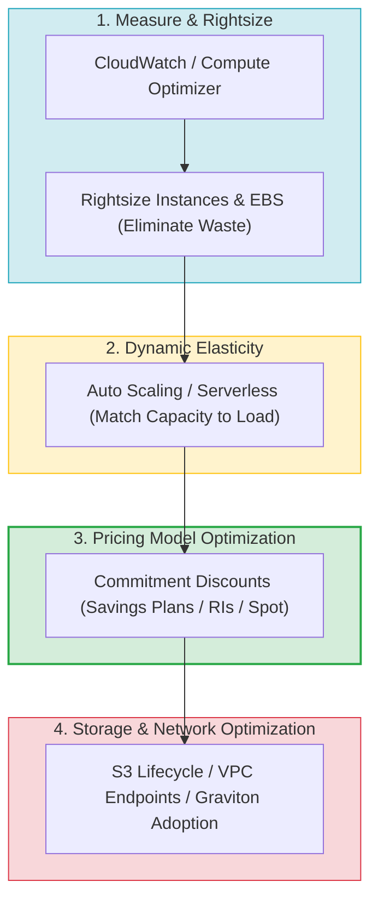
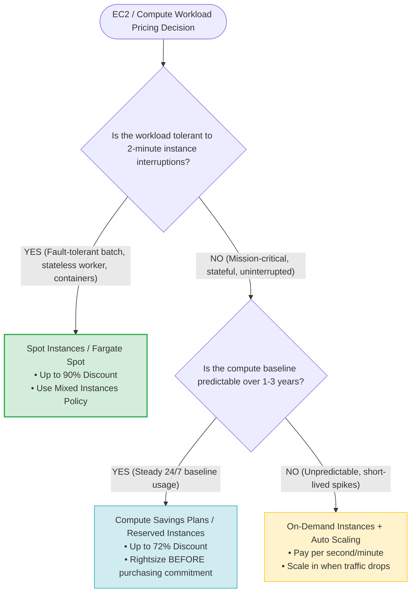
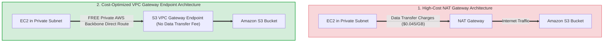
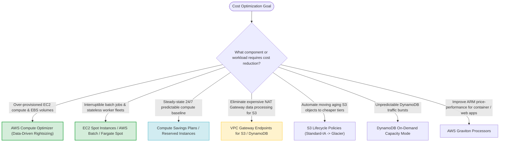
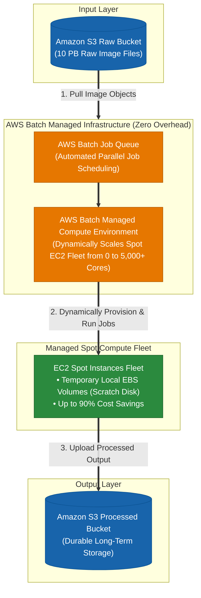
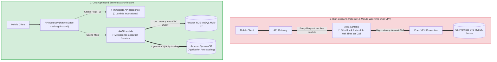
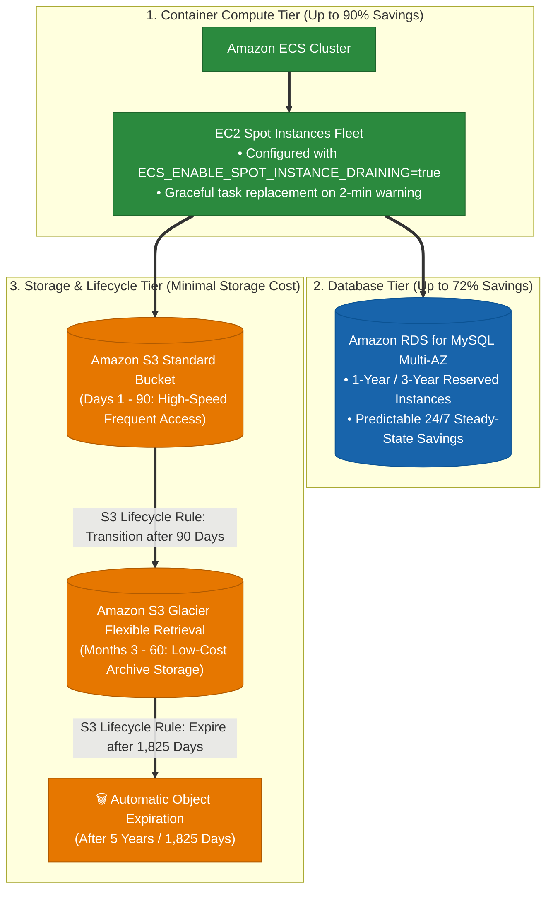
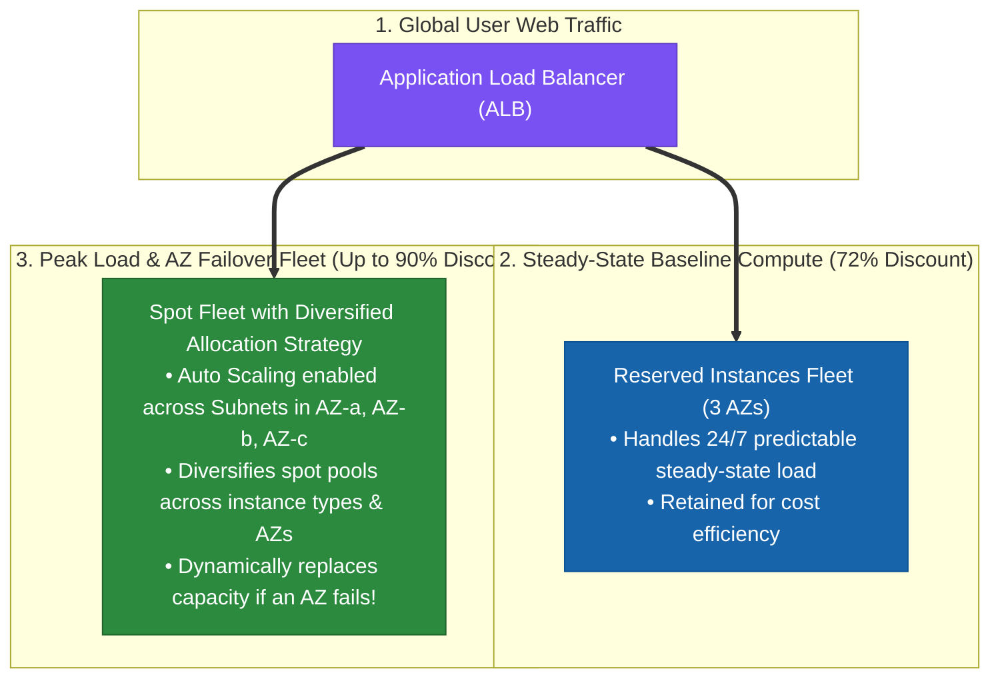
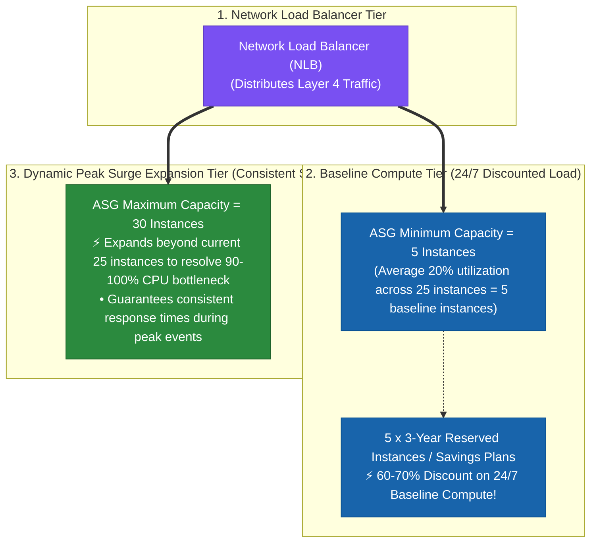

# Task 3.5: Identify Opportunities for Cost Optimizations — Cost-Conscious Architecture Choices

> [!NOTE]
> **Exam Mindset**: For the AWS Solutions Architect Professional (SAP-C02) and AI Practitioner (AIP-C01) exams, cost optimization balances business performance, security, and availability against expense:
> **Workload Requirements** $\rightarrow$ **Rightsizing & Waste Removal** $\rightarrow$ **Dynamic Elasticity (Auto Scaling / Serverless)** $\rightarrow$ **Optimal Pricing Model (Spot / Savings Plans / RIs)** $\rightarrow$ **Storage & Network Optimization**.

---

## 1. The 4-Pillar AWS Cost Optimization Framework & Order of Operations



---

## 2. EC2 Capacity & Pricing Model Decision Strategy (Spot vs. Savings Plans vs. On-Demand)



---

## 3. Workload Characteristic vs. Cost Strategy Selection Matrix

| Workload Characteristic | Recommended AWS Cost Strategy | Key Service / Feature | Exam Clue Keyword Trigger |
| :--- | :--- | :--- | :--- |
| **Fault-Tolerant & Interruptible** | Spot Instances / Fargate Spot | ASG Mixed Instances Policy | *"Batch jobs / Fault-tolerant / Lowest compute cost"* |
| **Predictable 24/7 Baseline Usage** | Compute Savings Plans / Reserved Instances | Savings Plans / RIs | *"Steady long-running compute / 1-year commitment"* |
| **Unpredictable Web Spikes** | Dynamic Auto Scaling / Serverless | Target Tracking ASG / Lambda | *"Variable demand / Pay for actual utilization"* |
| **Over-Provisioned Resources** | Data-Driven Rightsizing | AWS Compute Optimizer | *"Underutilized CPU/Memory / Recommend size"* |
| **Infrequently Accessed S3 Data** | S3 Storage Tiering | S3 Lifecycle Policies | *"Archive aging objects / Reduce storage cost"* |
| **High S3 Traffic from Private VPC**| Eliminate NAT Processing Charges | S3 Gateway Endpoint | *"High data volume to S3 / NAT Gateway cost"* |

---

## 4. Network & Storage Data Transfer Cost Reduction Architecture



> [!IMPORTANT]
> **Always Rightsize BEFORE Purchasing Commitment Discounts**:
> Purchasing a 3-year Savings Plan or Reserved Instance for an over-provisioned instance locks in unnecessary spending.
> **Correct Sequence**: **Measure & Rightsize First** $\rightarrow$ **Establish Actual Baseline** $\rightarrow$ **Purchase Savings Plans / RIs**.

---

## 5. Pricing Model Feature Comparison Breakdown

| Pricing Model | Cost Discount | Interruption Risk? | Flexibility Scope | Ideal Use Case |
| :--- | :--- | :--- | :--- | :--- |
| **Spot Instances** | Up to 90% off On-Demand | ⚠️ **Yes** (2-minute warning) | EC2, ECS, EKS, Batch | Batch processing, stateless microservices |
| **Compute Savings Plans** | Up to 72% off On-Demand | ❌ **No** | EC2, Fargate, Lambda | Flexible multi-service steady compute |
| **EC2 Instance Savings Plans**| Up to 72% off On-Demand | ❌ **No** | Specific EC2 Family | Deep discount on single instance family |
| **Reserved Instances (RIs)** | Up to 72% off On-Demand | ❌ **No** | RDS, OpenSearch, ElastiCache | Non-EC2 steady-state database instances |
| **On-Demand Instances** | Baseline rate (0% discount) | ❌ **No** | Full flexibility | Unpredictable, short-duration workloads |

---

## 6. Eliminating NAT Gateway Processing Charges via Gateway Endpoints

> [!TIP]
> **Free S3 & DynamoDB Access via Gateway Endpoints**:
> NAT Gateways charge both an hourly rate and a per-GB data processing fee ($0.045/GB). For workloads transferring terabytes of data from private EC2 subnets to **Amazon S3** or **Amazon DynamoDB**, creating a **VPC Gateway Endpoint** routes traffic over the free internal AWS backbone, completely eliminating NAT processing costs.

---

## 7. SAP-C02 Domain 3.5 Cost-Conscious Architecture Master Selection Decision Engine



---

## 7.1 Real-World Exam Scenario: Scalable Petabyte-Scale Batch Image Processing (AWS Batch + Spot Instances)

- **Scenario**: A media company processes petabytes of user images every month (10 PB raw data). On-premises, a 5,000-core HPC cluster runs parallel jobs for one week per month, but the data center has maxed out its capacity. The architect must design a scalable cloud solution that exceeds current capacity with the **least management overhead** while being **cost-effective**. What is the optimal architecture?
- **Architecture Solution**:
  1. Store raw input images in an **Amazon S3 bucket**.
  2. Use **AWS Batch with Managed Compute Environments** configured to provision a fleet of **EC2 Spot Instances**.
  3. Create jobs in **AWS Batch Job Queues** that pull objects from the S3 bucket, temporarily stage them on local **EBS volumes** for high-speed scratch processing, and write processed output back to a target **Amazon S3 bucket**.



### Key Technical Rationale:
1. **AWS Batch Managed Compute Environments**: Fully automates job scheduling, batch queue management, and cluster scaling (scaling from 0 to thousands of vCPUs and back to 0). Requires **zero cluster management overhead** compared to managing custom batch schedulers or Kubernetes control planes.
2. **EC2 Spot Instances for HPC Batch**: Image conversion jobs are stateless, parallel, and fault-tolerant. Running Spot Instances within AWS Batch Managed Compute Environments reduces compute costs by up to $90\%$.
3. **Amazon S3 + Local EBS Staging**: Storing petabytes of raw data in S3 provides $99.999999999\%$ (11 9s) durability at low cost. Temporarily staging files on local EBS volumes provides fast I/O throughput during image processing.

### Why Distractor Options Fail:
- *Amazon EKS (Kubernetes) + EBS Cold HDD (`sc1`)*: Deploying Docker images on EKS requires managing Kubernetes control planes and node groups, adding high operational overhead. SC1 EBS volumes cannot scale dynamically down to zero, incurring high idle storage costs for 10 PB.
- *Amazon EMR (Spark) + DynamoDB*: Provisioning EMR clusters with On-Demand/Reserved nodes incurs continuous running costs even when no jobs are running, and requires managing Apache Spark cluster configurations and DynamoDB queues manually.
- *Custom SQS Queue + Custom EC2 ASG + Amazon EFS*: EFS is significantly more expensive per GB than Amazon S3 for storing petabytes of raw files. Custom queue-poller Auto Scaling groups require writing complex retry logic for Spot interruptions, whereas **AWS Batch** handles Spot retries and queue scheduling natively.

---

## 7.2 Real-World Exam Scenario: Hybrid Serverless Application Cost Optimization & High Latency Remediation

- **Scenario**: A company runs a serverless mobile app on API Gateway, AWS Lambda, and DynamoDB (user preferences). The app queries an on-premises 3 TB MySQL database over a VPN connection. Traffic grows 20% monthly. A cost review reveals an exponential increase in Lambda costs caused by Lambda execution times averaging **4.5 minutes—mostly idle wait time due to network latency calling the on-premises MySQL database over VPN**. How can the architect reduce overall cost while maintaining high performance?
- **Architecture Solution**:
  1. **Migrate Database to AWS**: Migrate the on-premises MySQL server to **Amazon RDS for MySQL Multi-AZ** inside the AWS VPC.
  2. **Enable API Gateway Caching**: Configure **native API Caching on Amazon API Gateway** to cache endpoint responses and reduce overall Lambda invocations.
  3. **Rightsize Lambda Memory & Timeout**: Gradually lower the timeout and memory properties of the Lambda functions without increasing execution time.
  4. **Auto Scale DynamoDB**: Configure **AWS Application Auto Scaling on DynamoDB** to automatically adjust provisioned throughput based on actual user traffic.



### Key Technical Rationale:
1. **Eliminate Lambda Idle Wait Billing via RDS Migration**: AWS Lambda duration billing is calculated per millisecond of total execution time. Calling an on-premises database over a VPN forces Lambda functions to sit idle for 4.5 minutes per request. Migrating MySQL to **Amazon RDS for MySQL Multi-AZ** in the same VPC reduces execution duration from minutes to milliseconds, cutting Lambda billing by over 95%.
2. **Native API Gateway Caching**: Enabling API Caching on API Gateway stages caches HTTP endpoint responses. Cached requests are served directly by API Gateway without invoking Lambda functions at all, eliminating unnecessary compute charges.
3. **Lambda Memory & Timeout Tuning**: Rightsizing Lambda memory allocations and setting conservative execution timeouts prevents paying for over-provisioned memory or lingering hung function executions.
4. **DynamoDB Application Auto Scaling**: Application Auto Scaling dynamically scales Read/Write Capacity Units (RCUs/WCUs) based on CloudWatch traffic utilization metrics, preventing over-provisioned capacity waste.

---

## 7.3 Real-World Exam Scenario: Internal Web Application Multi-Tier Cost Optimization (ECS Spot + Spot Draining + RDS RIs + S3 Glacier Lifecycle)

- **Scenario**: A company hosts an internal 3-tier web application (Docker containers + MySQL database). Company documents are accessed frequently for the first 3 months, rarely after that, and must be retained for at least 5 years. The architect must design the **MOST cost-effective solution with the lowest possible cost**. What is the optimal architecture?
- **Architecture Solution**:
  1. **Container Compute**: Deploy Docker containers on **Amazon ECS with EC2 Spot Instances** and enable **Spot Instance Draining** (`ECS_ENABLE_SPOT_INSTANCE_DRAINING=true` in `ecs.config`).
  2. **Database Compute**: Use **Reserved Instances (RIs)** for the **Amazon RDS for MySQL** database and its read replicas.
  3. **Document Storage & Archival**: Store documents in an encrypted **Amazon S3 bucket**. Configure an **S3 Lifecycle Policy** to transition documents to **S3 Glacier** after 3 months (90 days) and delete objects older than 5 years (1,825 days).



### Key Technical Rationale:
1. **ECS Spot Instances + Spot Instance Draining**: Containerized tasks on ECS are stateless. Running EC2 Spot Instances saves up to 90% over On-Demand. Setting `ECS_ENABLE_SPOT_INSTANCE_DRAINING=true` in `/etc/ecs/ecs.config` instructs the ECS agent to receive 2-minute interruption warnings, place terminating instances in `DRAINING` status, stop scheduling new tasks, and gracefully relocate running tasks to replacement instances.
2. **RDS Reserved Instances for Steady Internal Workloads**: Internal web databases run 24/7 continuously. Purchasing Reserved Instances for RDS provides up to 72% savings compared to paying On-Demand prices.
3. **Automated S3 Lifecycle Management**: Storing documents in Amazon S3 costs far less than Amazon EFS or local EBS volumes. Native S3 Lifecycle policies handle transition to S3 Glacier after 90 days and deletion after 5 years automatically with zero cron job operational overhead.

### Why Distractor Options Fail:
- *Amazon EKS with Spot + On-Demand RDS*: Running continuous 24/7 RDS databases on On-Demand rates is significantly more expensive than purchasing **Reserved Instances** for RDS. Additionally, EKS charges a cluster control plane fee ($0.10/hr), whereas ECS cluster management is free.
- *ECS On-Demand EC2 + On-Demand RDS + EFS*: Using On-Demand compute maximizes cost. Storing documents on Amazon EFS is drastically more expensive per GB than Amazon S3, and writing custom cron scripts to copy files to Glacier adds operational maintenance.
- *ECS Spot + EBS Shared Volumes + Aurora Serverless v2 + Cron*: Shared EBS volumes require over-provisioning disk space on EC2 hosts and cannot lifecycle objects automatically like Amazon S3. Aurora Serverless v2 can be more expensive than RDS Reserved Instances for steady 24/7 internal databases. Custom cron jobs lack native S3 durability and automated deletion.

---

## 7.4 Real-World Exam Scenario 4: Global Sports Event Analytics & Read Scaling (Multi-AZ RDS Read Replica + S3 Batch + CloudFront CDN)

- **Scenario**: A data analytics startup is building a system to track FIFA World Cup statistics and host global fan voting (best player/coach). The system experiences high global read traffic (10M to 30M queries on game days) for static reports (top scorers, average goals) alongside transactional voting writes. What is the **MOST cost-effective solution** that provides durable, highly available, and scalable access?
- **Architecture Solution**:
  1. Generate FIFA reports and handle voting writes from a **Multi-AZ Amazon RDS MySQL** database deployment configured with **Read Replicas**.
  2. Set up a **batch job** that queries the Read Replica, pre-generates report files, and uploads them to an **Amazon S3 bucket**.
  3. Launch an **Amazon CloudFront distribution** to cache report content with a TTL set to expire objects daily.

```mermaid
flowchart TD
    subgraph GlobalFans["1. Global Fans & 3rd-Party Analytics (30M+ Queries/Day)"]
        Users["Global Viewers & Analytics Sites"]
    end

    subgraph EdgeCDN["2. Global Edge Distribution Tier (Lowest Cost Read Scaling)"]
        CF["Amazon CloudFront CDN<br/>• Edge Caching with 24-hr TTL<br/>• Serves 99.9% of Read Requests at Edge!"]
        S3Bucket[("Amazon S3 Bucket<br/>• Durable Static Report Storage")]

        Users ==> CF ==> S3Bucket
    end

    subgraph BatchOffload["3. Daily Analytical Batch Processing"]
        BatchJob["Daily Batch Job<br/>(Pre-generates static JSON/HTML reports)"]
        S3Bucket <== BatchJob
    end

    subgraph DatabaseTier["4. Transactional & Analytical Database Tier"]
        RDS_Primary[("Amazon RDS MySQL Multi-AZ<br/>(Primary Writer for Fan Votes)")]
        RDS_Replica[("Amazon RDS Read Replica<br/>(Offloads Batch Analytics Queries)")]

        RDS_Primary ==>|"Synchronous Multi-AZ Failover / Async Replication"| RDS_Replica
        RDS_Replica ==> BatchJob
    end

    classDef cdn fill:#7950f2,stroke:#5f3dc4,color:#ffffff;
    classDef s3 fill:#e67700,stroke:#b05a00,color:#ffffff;
    classDef db fill:#1864ab,stroke:#0b5394,color:#ffffff;

    class CF cdn;
    class S3Bucket s3;
    class RDS_Primary,RDS_Replica db;
```

### Key Technical Rationale:
1. **CloudFront CDN Edge Offloading for Millions of Queries**: Serving 30 million daily read queries directly from database instances requires provisioning massive, expensive DB clusters. Offloading static reports to **Amazon CloudFront** caches responses at edge locations worldwide, absorbing $99.9\%$ of query volume at a fraction of database compute costs.
2. **S3 Object Storage for Durability & Low Cost**: Storing pre-generated static reports in Amazon S3 provides 11 9s of durability and virtually unlimited read scaling at cents per GB.
3. **Multi-AZ RDS with Read Replicas**: Using Multi-AZ RDS ensures high availability and automatic failover for transactional fan voting. Read Replicas isolate analytical batch queries from the primary transactional database, preventing report generation jobs from impacting live voting writes.

### Why Distractor Options Fail:
- *Querying RDS Read Replicas Directly for 30M Queries*: Forcing 30 million queries directly against RDS Read Replicas requires scaling out dozens of large RDS DB instances, creating astronomical database compute costs compared to CloudFront edge caching.
- *RDS + ElastiCache Redis/Memcached*: Querying ElastiCache for 30M requests requires maintaining a large, expensive ElastiCache cluster and complex application caching code. It lacks global edge delivery and durable object storage.
- *RDS + DynamoDB + Daily Table Deletion*: Storing pre-generated reports in DynamoDB and deleting tables daily introduces high DynamoDB read capacity provisioning costs and operational complexity compared to simple Amazon S3 + CloudFront edge caching.

---

## 7.5 Real-World Exam Scenario 5: Multi-AZ Peak Scaling & AZ Outage Recovery (Diversified Spot Fleet + Baseline RIs)

- **Scenario**: A multi-tier web application behind an Application Load Balancer (ALB) operates across 3 Availability Zones (AZs). Stateless web servers reach 95% utilization during peak traffic. Current model: Reserved Instances (RIs) handle steady-state baseline load, and On-Demand instances handle peak load. The architecture lacks dynamic auto scaling to handle sudden surges or AZ failure outages. What is the **MOST cost-effective architecture** allowing the app to recover quickly during an AZ outage at peak load?
- **Architecture Solution**:
  - Launch a **Spot Fleet using a diversified allocation strategy**, with **Auto Scaling enabled on each AZ** to handle peak load instead of On-Demand instances. Retain the current **Reserved Instances** setup for handling the steady-state load.



### Key Technical Rationale:
1. **Spot Fleet Diversified Allocation Strategy**: Using a **diversified allocation strategy** across multiple instance types and subnets in all 3 AZs ensures that Spot capacity request fulfillment is distributed across distinct capacity pools. If one AZ or instance type suffers an outage or reclamation, the remaining AZs maintain capacity.
2. **Auto Scaling for Dynamic Surge & AZ Recovery**: Enabling Auto Scaling on the Spot Fleet dynamically provisions instances when traffic spikes or when an AZ outage drops total fleet capacity.
3. **Spot vs. Reserved Instances for Transient Peak Load**: Reserved Instances require 1-year or 3-year commitments. Purchasing RIs for transient, short-lived peak loads wastes money on unused capacity during off-peak hours. Spot Instances deliver up to 90% savings for transient peak workloads.

### Why Distractor Options Fail:
- *Launching an Auto Scaling Group of Reserved Instances for Peak Load (Your Selection)*: Reserved Instances require long-term commitments. Purchasing RIs for dynamic peak scaling causes massive over-payment for unused commitments during off-peak hours.
- *Spot and On-Demand without Auto Scaling*: Fixed capacity models without dynamic **Auto Scaling** cannot automatically scale out during traffic surges or replace instances lost during an AZ outage.

---

## 7.6 Real-World Exam Scenario 6: Baseline RI Rightsizing + Peak Auto-Scaling Expansion (NLB + ASG Min 5 / Max 30)

- **Scenario**: A stateless application on 25 On-Demand EC2 instances behind a Network Load Balancer (NLB) experiences severe performance drops during peak traffic (CPU spiking 90%-100%), while average utilization is only 20%. The app requires **consistent response times** during peak traffic and will run for 3 years. What is the **MOST cost-effective solution**?
- **Architecture Solution**:
  - Configure an **EC2 Auto Scaling Group (ASG)** attached to the **NLB**.
  - Set **Minimum Capacity = 5** instances and **Maximum Capacity = 30** instances.
  - Purchase 3-Year **Reserved Instances (RIs)** for **5 instances** to cover baseline load.



### Key Technical Rationale:
1. **Mathematical Baseline Rightsizing**: 25 instances running at an average of 20% CPU utilization represent a true baseline load equivalent to **5 instances** running at normal capacity ($25 \times 0.20 = 5$). Setting ASG `Min = 5` and purchasing 5 Reserved Instances locks in maximum commitment discounts for the exact 24/7 baseline load.
2. **Expanding Maximum Capacity to Resolve Bottlenecks**: The current 25 instances spike to 90-100% CPU during peak demand, causing performance degradation. Setting ASG `Max = 30` allows the fleet to dynamically scale out to 30 instances during peak events, resolving the CPU bottleneck and maintaining consistent response times.
3. **Spot vs. Consistent Performance SLA**: Spot instances are subject to 2-minute interruption terminations. Applications explicitly requiring **consistent response times** and predictable performance SLA during peak traffic cannot rely 100% on Spot Fleets.

### Why Distractor Options Fail:
- *Replacing On-Demand with 100% Spot Fleet (Your Selection)*:
  - Relying 100% on Spot Instances for applications requiring **consistent response times** violates SLA requirements. If Spot capacity is reclaimed by AWS during peak demand events, mass instance terminations cause severe latency spikes and service degradation.
- *ASG Min 15 / Max 25 with 15 RIs*:
  - Setting `Min = 15` and buying 15 RIs over-provises baseline capacity (baseline load only requires 5 instances), wasting money on unused commitments off-peak.
  - Setting `Max = 25` caps capacity at the existing 25 instances, failing to provide additional headroom during peak traffic and leaving the 90-100% CPU bottleneck unresolved.

---

## 8. SAP-C02 Exam Keyword Cheat Sheet

```
"Identify underutilized EC2 instances and EBS volumes"──> AWS Compute Optimizer
"Lowest cost compute for fault-tolerant batch"       ──> EC2 Spot Instances / Fargate Spot
"Graceful ECS task removal on Spot interruption"     ──> ECS_ENABLE_SPOT_INSTANCE_DRAINING=true
"Petabyte-scale HPC batch processing with least overhead" ──> AWS Batch Managed Compute + Spot Instances + S3
"Predictable 24/7 baseline compute across services"  ──> Compute Savings Plans / Reserved Instances
"Steady-state baseline + transient peak scaling"      ──> Baseline RIs + Diversified Spot Fleet with Auto Scaling
"Purchasing Reserved Instances for peak load"         ──> ❌ FAILS (RIs are for 24/7 baseline; waste money off-peak!)
"Scale 30M daily read queries cost-effectively"      ──> Pre-generate Reports to S3 + CloudFront CDN Caching
"Reduce data transfer costs to S3 from private VPC"  ──> VPC Gateway Endpoint for S3
"Reduce Lambda idle wait time on-premises DB calls" ──> Migrate DB to Amazon RDS in VPC
"Reduce Lambda invocations for REST APIs"            ──> Configure API Caching on API Gateway
"Automatically scale DynamoDB throughput cost-effectively" ──> AWS Application Auto Scaling on DynamoDB
"Automatically transition aging S3 objects"         ──> S3 Lifecycle Policies (S3 -> Glacier -> Expiration)
"Best price-performance for ARM-compatible apps"    ──> AWS Graviton Processors
```

---

## 9. Common SAP-C02 Exam Traps

1. **Trap 1: Choosing Spot Instances for Mission-Critical Stateful Databases**: Spot instances can be reclaimed with a 2-minute notice. Never use Spot for non-fault-tolerant production databases.
2. **Trap 2: Purchasing Savings Plans Before Rightsizing Infrastructure**: Buying a Savings Plan for an oversized EC2 instance locks in waste. Always **Rightsize First** using **AWS Compute Optimizer**.
3. **Trap 3: Selecting S3 Standard-IA for Frequently Accessed Small Files**: Standard-IA charges retrieval fees per GB and minimum storage durations (30 days). For small, frequently read objects, Standard-IA may increase costs.
4. **Trap 4: Using Multi-Region Active/Active solely to Reduce Global Latency without Cost Justification**: Multi-Region active/active doubles infrastructure and cross-region replication costs. Use **Amazon CloudFront** edge caching first to reduce latency cost-effectively.
5. **Trap 5: Choosing Amazon EFS for Storing Petabytes of Raw HPC Batch Files**: Amazon EFS is designed for shared file access and costs significantly more per GB than Amazon S3. For petabyte-scale batch processing input/output, store raw data in **Amazon S3** and stage on temporary **local EBS volumes**.
6. **Trap 6: Provisioning Direct Connect or DAX to Reduce Serverless Costs**: Provisioning expensive Direct Connect circuits or DAX clusters for cost reduction is an anti-pattern. Migrate hybrid databases into AWS VPC (RDS) to eliminate Lambda wait time, and use **API Gateway Stage Caching** and **DynamoDB Application Auto Scaling**.
7. **Trap 7: Using On-Demand Database Instances with Spot Compute for 24/7 Workloads**: When optimizing an entire application stack for cost, pairing EC2 Spot instances with **On-Demand RDS** misses massive database savings. Always use **Reserved Instances** for 24/7 steady-state RDS databases, and **Amazon S3 Lifecycle Policies** instead of EFS or custom cron jobs.
8. **Trap 8: Scaling Database Read Replicas or ElastiCache to Handle High Volume Static Reports**: Scaling database read replicas or in-memory caches for tens of millions of static report queries is far more expensive than pre-generating static assets to **Amazon S3** and serving them via **Amazon CloudFront CDN**.
9. **Trap 9: Purchasing Reserved Instances for Transient Peak Load Scaling**: Reserved Instances require 1-year or 3-year commitments and are meant for 24/7 baseline workloads. Purchasing RIs for temporary peak loads causes massive waste during off-peak hours. Use **Auto Scaling Spot Fleets (with Diversified Allocation)** for peak loads.

---

## 10. Final Mental Model

`Measure & Rightsize First ➔ Baseline RIs (24/7 Load) ➔ Diversified Spot Fleet + Auto Scaling (Peak Load & AZ Failover) ➔ Pre-generate Static Reports (S3 + CloudFront CDN)`