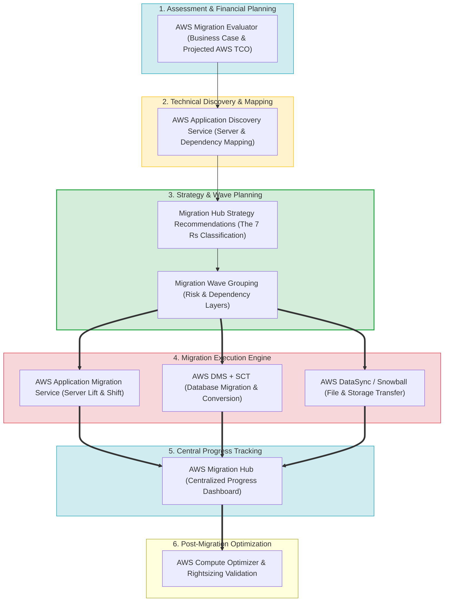
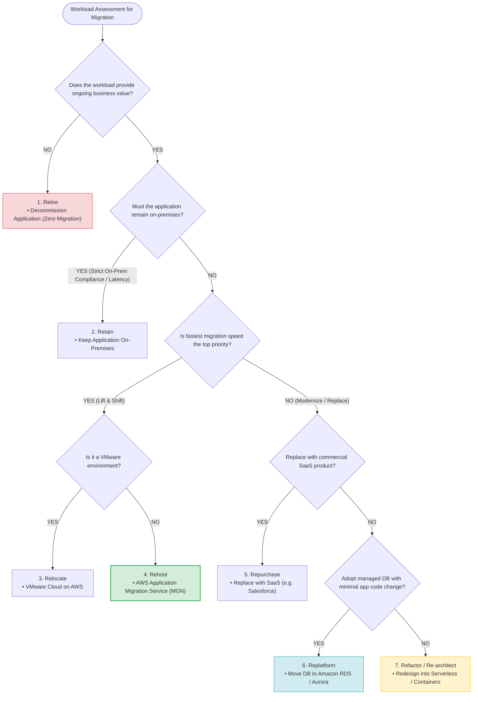
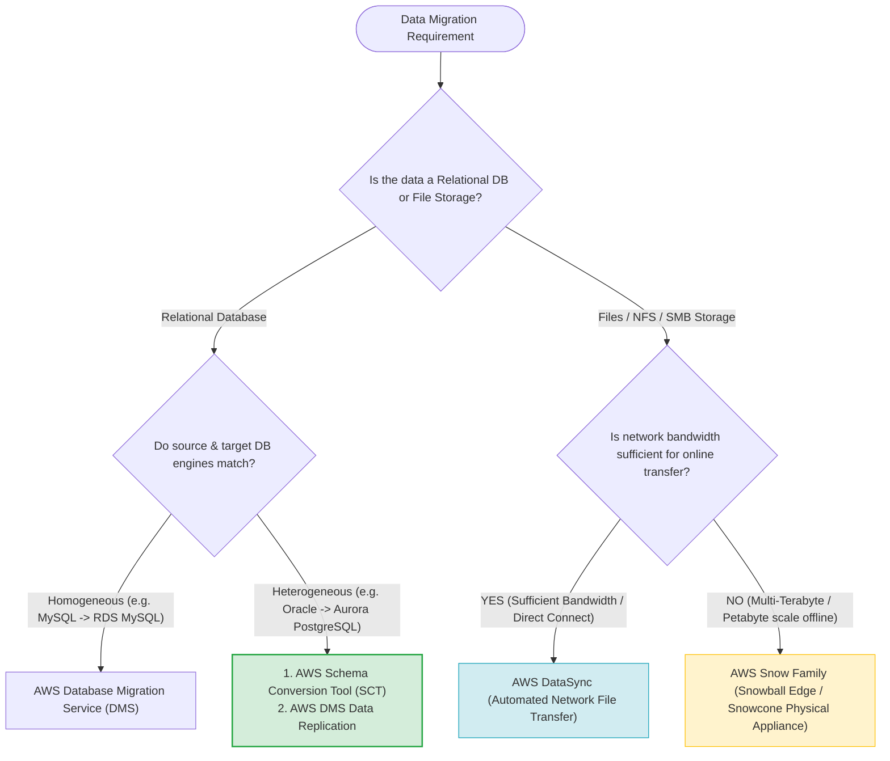
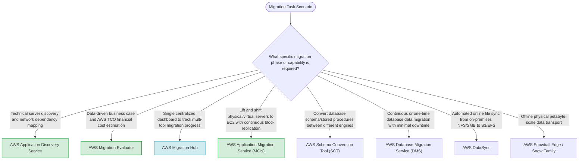
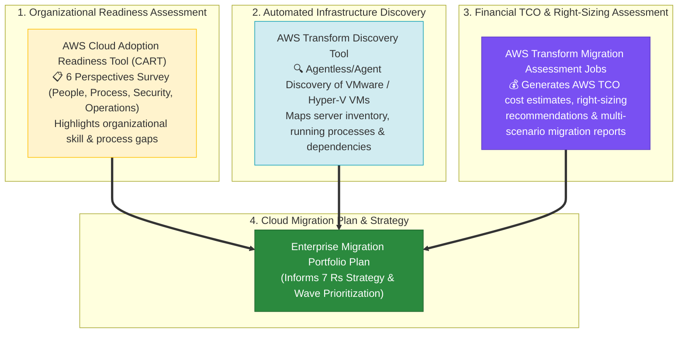

# Task 4.1: Select Existing Workloads and Processes for Potential Migration — Migration Assessment and Tracking Tools

> [!NOTE]
> **Exam Mindset**: For the AWS Solutions Architect Professional (SAP-C02) and AI Practitioner (AIP-C01) exams, Domain 4.1 evaluates your ability to plan and track migration workloads:
> **Business Case (Migration Evaluator)** $\rightarrow$ **Technical Discovery & Dependency Mapping (Application Discovery Service)** $\rightarrow$ **Strategy Selection (The 7 Rs)** $\rightarrow$ **Execution (MGN / DMS / DataSync)** $\rightarrow$ **Centralized Progress Tracking (AWS Migration Hub)**.

---

## 1. End-to-End Enterprise AWS Migration & Tracking Lifecycle



---

## 2. The 7 Rs Migration Strategy Decision Matrix



---

## 3. Migration Tooling Feature & Responsibility Matrix

| Migration Tool / Service | Primary Role in Migration | Input / Source | Primary Output / Target | Primary Exam Keyword Trigger |
| :--- | :--- | :--- | :--- | :--- |
| **AWS Migration Hub** | **Centralized Progress Tracking** | Progress metrics from MGN, DMS, etc. | Single-pane management view | *"Single view to track migration status across tools"* |
| **AWS Application Discovery Service**| **Technical Discovery & Dependencies**| On-prem servers, VMs, network | Dependency maps & inventory | *"Map server dependencies before migration"* |
| **AWS Migration Evaluator** | **Business Case & TCO Estimation**| On-prem infrastructure costs | Projected AWS cost estimate | *"Data-driven business case / Compare TCO to AWS"* |
| **AWS Application Migration Service (MGN)**| **Server Lift & Shift Execution**| Physical, Virtual, Cloud VMs | Amazon EC2 Instances | *"Migrate servers quickly with minimal code change"* |
| **AWS Schema Conversion Tool (SCT)**| **Database Schema Conversion** | Heterogeneous database schemas | Target DB SQL DDL scripts | *"Convert Oracle/SQL Server schema to PostgreSQL"* |
| **AWS Database Migration Service (DMS)**| **Database Data Replication** | Source relational / NoSQL DB | Target AWS DB (RDS/Aurora/Dynamo) | *"Continuous database replication / Minimal downtime"* |
| **AWS DataSync** | **Online File & Object Transfer** | On-prem NFS, SMB, HDFS | Amazon S3, EFS, FSx | *"Automated online transfer of file storage to S3"* |
| **AWS Snow Family** | **Offline Physical Data Transport**| Multi-Terabyte / Petabyte data | Amazon S3 | *"Petabyte data transfer with limited network bandwidth"* |

---

## 4. Database & File Migration Tool Selection Engine



> [!IMPORTANT]
> **AWS Migration Hub Tracks — It Does NOT Perform Data Migration**:
> A major SAP-C02 exam trap is choosing Migration Hub to move servers or databases. **AWS Migration Hub only provides centralized visibility and progress tracking**. Actual migrations are performed by **AWS MGN** (servers), **AWS DMS** (databases), or **AWS DataSync** (files).

---

## 5. Technical Discovery vs. Business Case Assessment

> [!TIP]
> **Application Discovery Service vs. Migration Evaluator**:
> - **Application Discovery Service**: Gathers **technical server telemetry** (CPU, memory, network connections, dependencies) to map migration waves.
> - **AWS Migration Evaluator**: Gathers **financial cost data** to build a data-driven **business case and AWS TCO comparison** for executive stakeholders.

---

## 6. Schema Conversion Tool (SCT) vs. Database Migration Service (DMS)

> [!NOTE]
> **Schema Conversion vs. Data Migration**:
> - **AWS SCT**: Converts database **schemas, tables, views, and stored procedures** from one engine to another (e.g., Oracle $\rightarrow$ PostgreSQL).
> - **AWS DMS**: Reads source data, loads target database, and keeps databases synchronized via **Change Data Capture (CDC)**.

---

## 7. SAP-C02 Domain 4.1 Migration Tools Master Selection Decision Engine



---

---

## 7.5 Real-World Exam Scenario: Enterprise Migration Discovery, Readiness & Cost Assessment Planning (AWS Transform Discovery + CART + Assessment Jobs vs. MGN & Inspector Traps - Select THREE)

- **Scenario**: A company plans to migrate thousands of virtualized Linux and Windows servers running Java/PHP web applications and MySQL/Oracle databases to AWS. System documentation is outdated and incomplete. The Solutions Architect must analyze the current environment, evaluate organizational readiness, and estimate cloud migration costs to plan the migration effectively. Which THREE options should be selected? (Select THREE)
- **Architecture Solutions (Select THREE)**:
  1. **AWS Transform Discovery Tool (formerly Application Discovery Service)**: Use the AWS Transform discovery tool to automatically gather information about running virtual machines, server inventories (VMware vCenter/Hyper-V), and application dependency maps inside on-premises servers.
  2. **AWS Cloud Adoption Readiness Tool (CART)**: Generate a migration readiness assessment report with CART to highlight organizational skill and process gaps across 6 perspectives (Business, People, Process, Platform, Operations, Security).
  3. **AWS Transform Migration Assessment Jobs & Workspaces (formerly Migration Evaluator / MPA)**: Use AWS Transform migration assessment jobs and workspaces to estimate migration costs, generate automated right-sizing recommendations, produce executive reports, and support migration planning.



### Key Technical Rationale:
1. **AWS Transform Discovery Tool (Server Inventory & Dependencies)**:
   - Automatically discovers on-premises VMware vCenter, Microsoft Hyper-V, and physical server inventory, capturing CPU, RAM, disk utilization, and network dependency maps when technical documentation is outdated.
2. **AWS Cloud Adoption Readiness Tool (CART) (Organizational Readiness)**:
   - A 16-question online assessment that evaluates an enterprise's cloud readiness across 6 CAF perspectives (Business, People, Process, Platform, Operations, Security) to identify organizational training and process gaps.
3. **AWS Transform Migration Assessment Jobs (Financial TCO & Right-Sizing)**:
   - Evaluates on-premises server utilization telemetry to provide automated right-sizing recommendations (preventing over-provisioned instance waste) and projected TCO cost estimates for EC2, RDS, EBS, and S3.

### Why Distractor Options Fail:
- *AWS Transform MGN (AWS Application Migration Service)*:
  - AWS MGN is an **execution tool** used for block-level replication to migrate virtual machines into EC2 during the execution phase; it is NOT a planning tool used for initial discovery or TCO cost estimation!
- *Amazon Inspector for On-Premises Discovery*:
  - Amazon Inspector is a security vulnerability/CVE scanner for **AWS workloads** (EC2, ECR, Lambda); it does NOT run on-premises to discover server inventory or estimate migration costs.
- *AWS X-Ray for Migration Planning*:
  - AWS X-Ray is an application tracing service for debugging distributed microservices requests in production; it is NOT used to plan data center migrations or discover server inventories.

---

## 8. SAP-C02 Exam Keyword Cheat Sheet

```
"Single dashboard to track migration progress across tools" ──> AWS Migration Hub
"Discover servers and map application network dependencies" ──> AWS Transform Discovery Tool (Application Discovery Service)
"Assess organizational readiness across 6 perspectives"   ──> AWS Cloud Adoption Readiness Tool (CART)
"Financial business case and right-sizing TCO estimation"   ──> AWS Transform Migration Assessment (Migration Evaluator)
"Lift-and-shift physical/VM servers with block replication" ──> AWS Application Migration Service (AWS MGN)
"Convert database schema and stored procedures"             ──> AWS Schema Conversion Tool (SCT)
"Replicate database data with minimal downtime (CDC)"        ──> AWS Database Migration Service (DMS)
"Automate network file transfer from NFS/SMB to S3/EFS"      ──> AWS DataSync
"Migrate petabytes of data with limited internet bandwidth" ──> AWS Snowball Edge / Snow Family
```

---

## 9. Common SAP-C02 Exam Traps

1. **Trap 1: Selecting AWS Migration Hub to Perform Server Block Replication**: Migration Hub only tracks status. Use **AWS Application Migration Service (MGN)** to perform server block replication.
2. **Trap 2: Using AWS DMS Alone to Convert Oracle Stored Procedures**: DMS moves data rows; it does not convert complex stored procedure code. Use **AWS SCT** first to convert the schema and stored procedures.
3. **Trap 3: Migrating All 500 Servers Simultaneously Without Dependency Mapping**: Migrating servers without mapping dependencies will break inter-component communications. Always run **AWS Transform Discovery Tool** to create dependency waves.
4. **Trap 4: Attempting to Transfer Petabytes of Data Over a Saturated 100 Mbps WAN Line**: Network transfer will take months. For petabyte-scale migrations with limited bandwidth, deploy **AWS Snowball Edge** appliances.
5. **Trap 5: Selecting AWS MGN or Amazon Inspector for Initial Migration Planning**: AWS MGN is an *execution tool* for server block replication; Amazon Inspector is an *AWS vulnerability scanner*. For initial migration planning, discovery, organizational readiness, and TCO estimation, select **AWS Transform Discovery Tool**, **AWS CART**, and **AWS Transform Migration Assessment**.

---

## 10. Final Mental Model

`Assess Readiness (CART) ➔ Discover & Map (Transform Discovery) ➔ Estimate TCO (Transform Assessment) ➔ Select Strategy (7 Rs) ➔ Migrate (MGN / DMS / DataSync) ➔ Track (Migration Hub)`