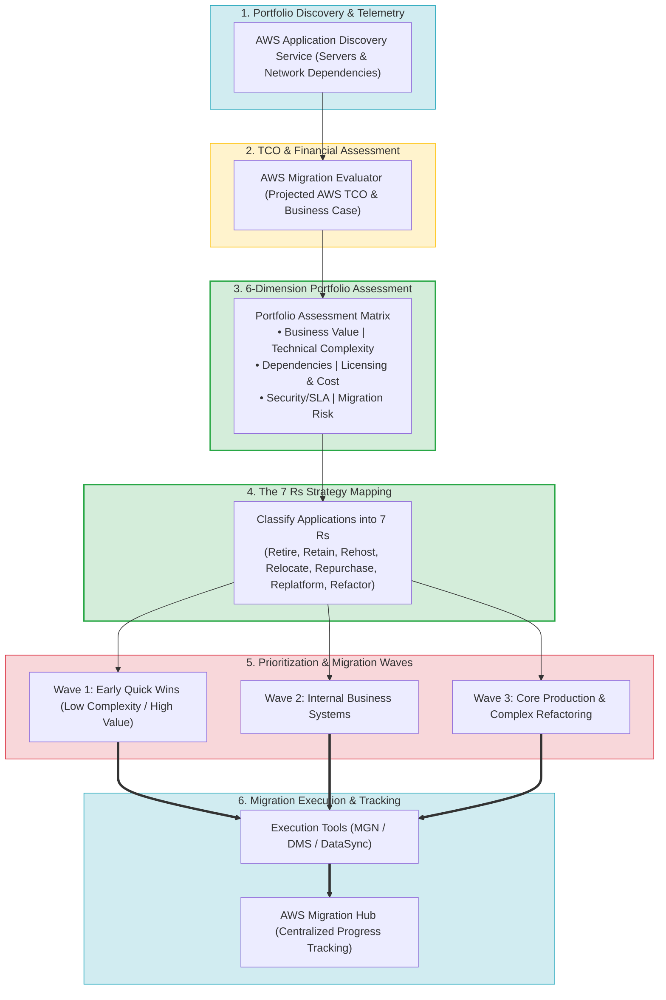
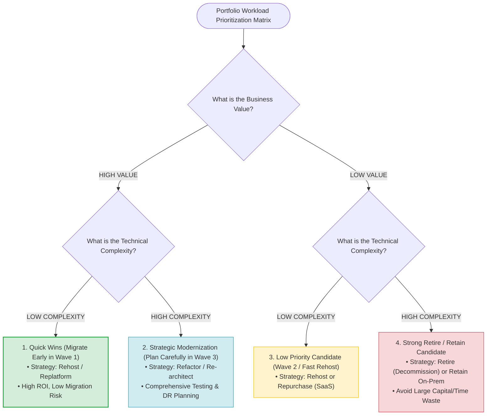
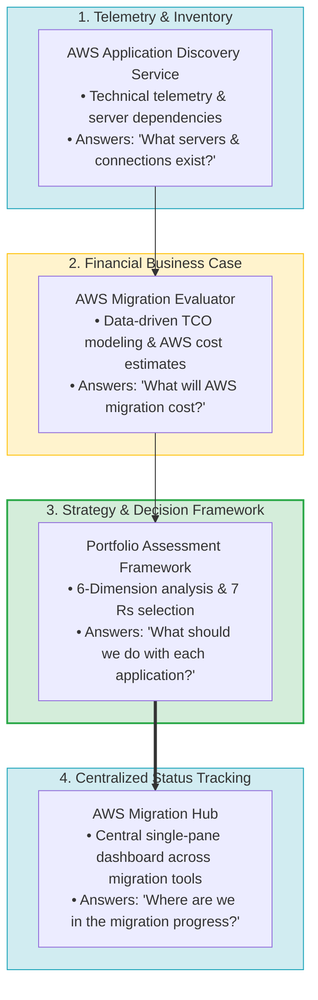
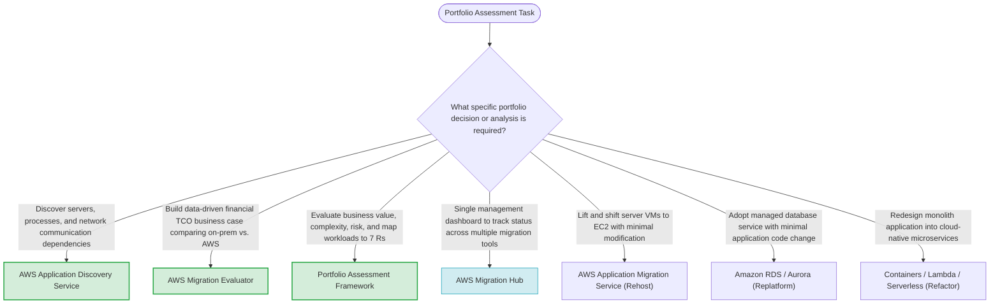
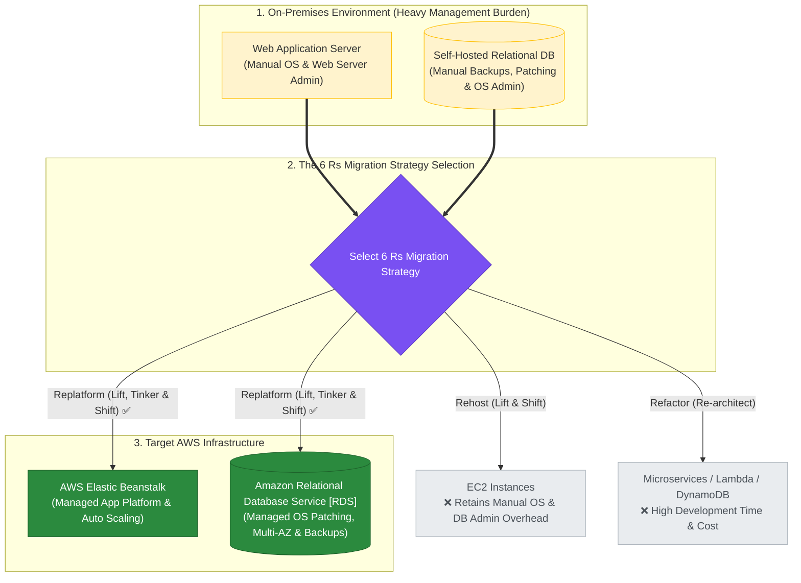

# Task 4.1: Select Existing Workloads and Processes for Potential Migration — Portfolio Assessment

> [!NOTE]
> **Exam Mindset**: For the AWS Solutions Architect Professional (SAP-C02) and AI Practitioner (AIP-C01) exams, portfolio assessment is the decision-making framework executed before choosing a migration strategy:
> **Telemetry Discovery (Application Discovery Service)** $\rightarrow$ **Financial TCO (Migration Evaluator)** $\rightarrow$ **6-Dimension Evaluation Matrix** $\rightarrow$ **7 Rs Strategy Selection** $\rightarrow$ **Wave Prioritization (Value vs. Complexity)** $\rightarrow$ **Centralized Tracking (Migration Hub)**.

---

## 1. End-to-End Enterprise Portfolio Assessment & Migration Strategy Lifecycle



---

## 2. Workload Prioritization Matrix (Business Value vs. Technical Complexity)



---

## 3. The 6 Dimensions of Portfolio Evaluation

| Evaluation Dimension | Key Questions Asked | Primary Inputs / Artifacts | Impact on Migration Strategy |
| :--- | :--- | :--- | :--- |
| **1. Business Value** | Is the application critical to revenue or business operations? | Business SLA, Revenue impact, User count | High value drives priority; zero value leads to **Retire** |
| **2. Technical Complexity**| What is the OS, database, middleware, and architecture state? | System specs, OS lifecycle, Custom code | High complexity favors **Rehost** first or **Refactor** wave |
| **3. Dependencies** | What web, app, database, and auth components communicate? | Application Discovery Service network maps | Groups applications into unified **Migration Waves** |
| **4. Licensing & Cost** | Are there expensive proprietary licenses (Oracle/SQL Server)? | License agreements, On-prem TCO | Licensing costs drive **Replatforming** to open source DBs |
| **5. Security & Compliance**| What PII, payment, or regulatory rules apply (PCI-DSS / HIPAA)? | Data classification, Audit requirements | Dictates target AWS Region, VPC isolation, and encryption |
| **6. Migration Risk** | What is the failure impact and business downtime tolerance? | RTO/RPO requirements, Cutover windows | High risk requires migration rehearsals and fallback plans |

---

## 4. Portfolio Assessment Tooling & Responsibility Pipeline



> [!IMPORTANT]
> **Portfolio Assessment vs. Discovery vs. Migration Hub**:
> - **Application Discovery Service**: Discovers technical infrastructure telemetry (servers, IP connections, process maps).
> - **Migration Evaluator**: Quantifies the financial business case (TCO on-prem vs. AWS).
> - **Portfolio Assessment**: The **architectural decision framework** assigning 7 Rs strategies to workloads.
> - **AWS Migration Hub**: Tracks multi-tool migration execution progress.

---

## 5. Rightsize BEFORE Migration to Eliminate Legacy Waste

> [!TIP]
> **Avoid Moving Over-Provisioned Infrastructure**:
> If an on-premises physical server has 64 vCPUs but averages **10% CPU utilization**, do not rehost it to a matching 64-vCPU EC2 instance (`m5.16xlarge`). Conduct rightsizing assessment during portfolio analysis to select a properly sized instance (`m5.2xlarge`), immediately reducing target AWS running costs.

---

## 6. Migration Wave Structuring & Risk Reduction

> [!NOTE]
> **Wave-Based Migration Planning**:
> Never migrate an entire enterprise portfolio of 500 applications simultaneously. Structure migration into **Wave Groups** based on dependency mapping. Execute **Wave 1 (Low-risk quick wins)** first to establish operational patterns before migrating **Wave 3 (Mission-critical core systems)**.

---

## 7. SAP-C02 Domain 4.1 Portfolio Assessment Master Selection Decision Engine



---

## 6.5 Real-World Exam Scenario: Cost-Effective Migration Strategy Selection (Replatform [RDS & Elastic Beanstalk] vs. Rehost & Refactor Traps)

- **Scenario**: A company plans to migrate its on-premises workload to AWS. The architect wants to reduce management time spent on database instances and application servers by adopting managed services: **Amazon RDS** for the database and **AWS Elastic Beanstalk** for the web application platform. What is the most **cost-effective 6 Rs migration strategy**?
- **Architecture Solution**: **Replatform ("Lift, Tinker, and Shift")**.
  - Replatforming replaces unmanaged on-premises infrastructure (self-managed MySQL and web servers) with fully managed AWS platforms (Amazon RDS and Elastic Beanstalk) without altering core application code architecture.



### The 6 Rs Migration Strategies Comparison Matrix

| Migration Strategy | Technical Core Approach | Operational Management Overhead | Ideal Use Case & Exam Keyword Trigger |
| :--- | :--- | :--- | :--- |
| **1. Rehost** ("Lift & Shift") | Move VMs directly into EC2 via AWS MGN without changes | High (Self-managed OS, DB patching, backup scripts) | *"Quickly migrate to AWS with minimal configuration/testing"* |
| **2. Replatform** ("Lift, Tinker & Shift") | Replace unmanaged components with managed services (RDS, Beanstalk) | **Low (AWS manages OS patching, DB backups, scaling)** | *"Reduce management overhead by adopting Amazon RDS / Elastic Beanstalk"* |
| **3. Repurchase** ("Drop & Shop") | Abandon custom software to adopt a commercial SaaS product | Zero (SaaS vendor manages infrastructure & app) | *"Replace existing software with commercial SaaS product (e.g. Salesforce)"* |
| **4. Refactor / Re-architect** | Rewrite monolith into cloud-native microservices/serverless | Lowest (Full cloud-native Serverless/Lambda/DynamoDB) | *"Strong business need to add features, performance, or auto-scale"* |
| **5. Retire** | Decommission obsolete or unused applications | Zero (Turned off completely) | *"System no longer used or provides zero business value"* |
| **6. Retain** | Keep applications on-premises without migrating | High (On-prem legacy) | *"Strict compliance, specialized hardware, or recent upgrade on-prem"* |

### Why Distractor Options Fail:
- *Rehost ("Lift and Shift")*:
  - Rehosting moves virtual machine disks directly to EC2 instances without changing DB engines or adopting managed platform services. Migrating to Elastic Beanstalk and Amazon RDS requires deployment and environment configuration beyond simple rehosting.
- *Refactor / Re-architect*:
  - Refactoring requires completely rewriting application code and breaking monolithic codebases into cloud-native microservices (Lambda, DynamoDB). It incurs substantial development time, budget, and risk compared to Replatforming.
- *Repurchase ("Drop and Shop")*:
  - Repurchasing involves abandoning existing application code to purchase a commercial third-party SaaS product, which is not applicable when migrating an existing custom application and database to AWS managed services.

---

## 8. SAP-C02 Exam Keyword Cheat Sheet

```
"Assess portfolio business value, technical complexity, and dependencies" ──> Portfolio Assessment Framework
"Discover servers and map application network dependencies"               ──> AWS Application Discovery Service
"Financial business case and projected AWS TCO modeling"                  ──> AWS Migration Evaluator
"High business value + low technical complexity application"              ──> Quick Win (Migrate Early in Wave 1 via Rehost)
"Low business value + obsolete/unused application"                        ──> Retire (Decommission immediately)
"Application with strict on-premises compliance/latency requirements"     ──> Retain (Keep on-premises)
"Minimize operational overhead by adopting managed DB (RDS/Beanstalk)"    ──> Replatform ("Lift, Tinker, and Shift")
"Quickly migrate VMs without software/configuration changes"              ──> Rehost ("Lift and Shift" via AWS MGN)
"Rewrite application into serverless microservices for scaling"          ──> Refactor / Re-architect (Lambda + DynamoDB)
"Replace existing software with commercial SaaS product"                  ──> Repurchase ("Drop and Shop")
```

---

## 9. Common SAP-C02 Exam Traps

1. **Trap 1: Assuming All 500 Portfolio Applications Must Be Migrated**: Migrating obsolete or duplicate workloads wastes migration budget and AWS operational costs. Always identify **Retire** candidates first.
2. **Trap 2: Treating Application Discovery Service as a Strategy Selector**: Discovery collects telemetry metrics. It does not select the 7 Rs migration strategy or calculate financial TCO.
3. **Trap 3: Migrating Complex Applications Without Dependency Analysis**: Migrating an application server while leaving its dependent identity or database server behind causes total application failure. Always map dependencies into unified **Migration Waves**.
4. **Trap 4: Rehosting Commercial Databases Without Licensing Evaluation**: Rehosting proprietary databases to EC2 locks in expensive licensing costs. Evaluate **Replatforming to Amazon RDS/Aurora** to eliminate database OS management.
5. **Trap 5: Confusing Rehosting vs. Replatforming vs. Refactoring**: Moving VMs directly to EC2 without service optimization is **Rehost**; adopting managed services like Amazon RDS or Elastic Beanstalk with minimal code changes is **Replatform**; completely rewriting application code into microservices/serverless is **Refactor**.

---

## 10. Final Mental Model

`Discover Telemetry (Discovery Service) ➔ Model TCO (Migration Evaluator) ➔ Evaluate 6 Dimensions (Portfolio Assessment) ➔ Select Strategy (Rehost / Replatform / Refactor) ➔ Prioritize Waves ➔ Track (Migration Hub)`