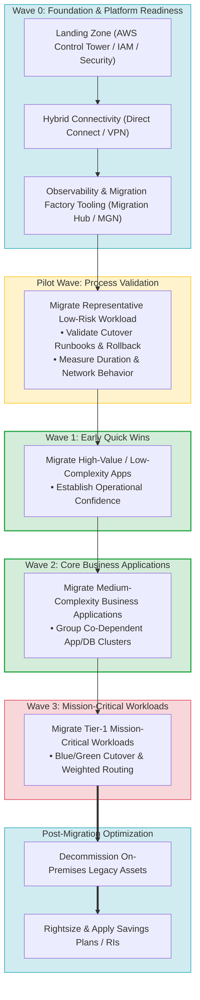
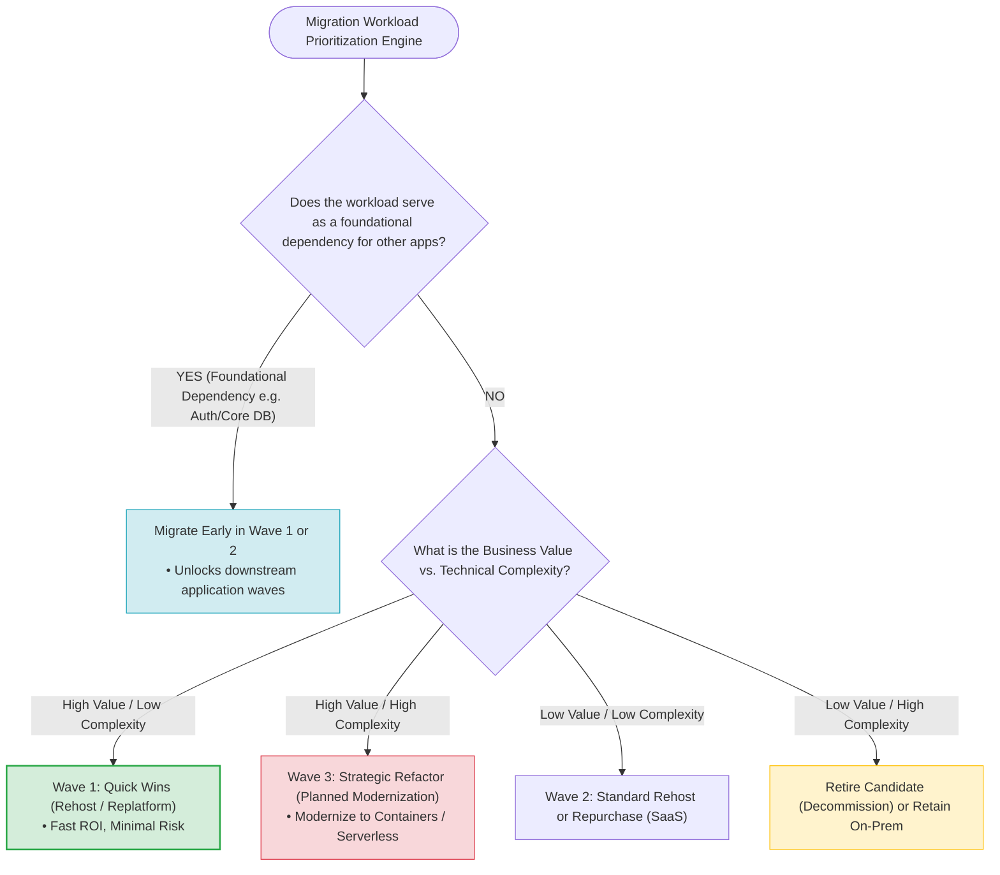
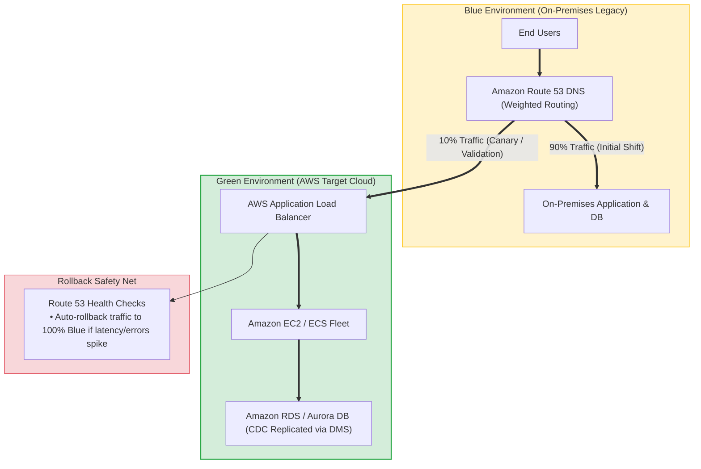
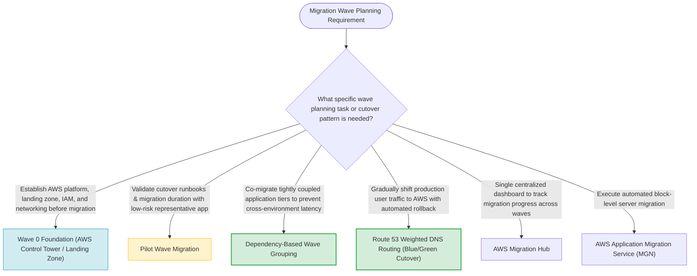
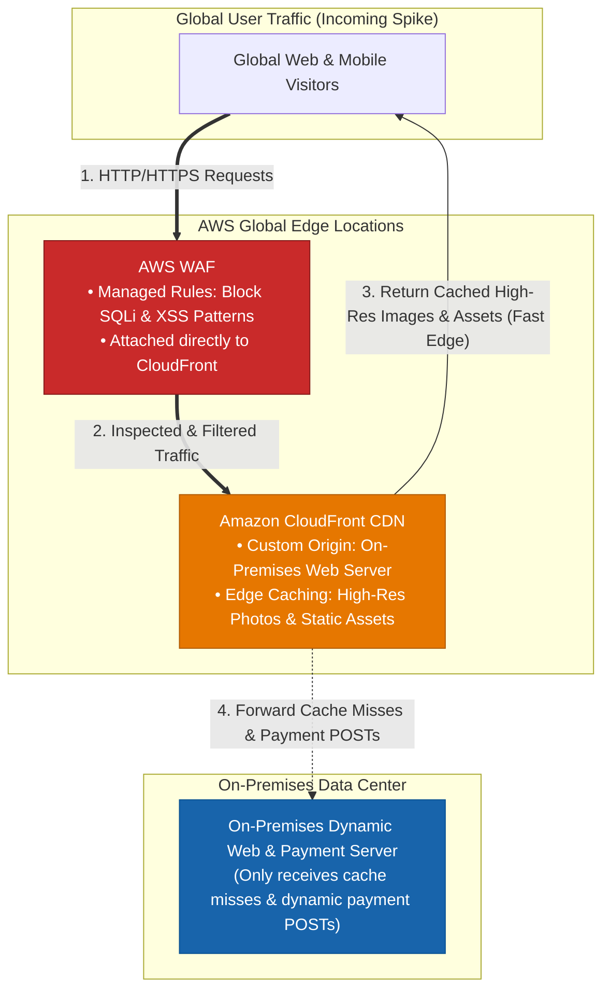
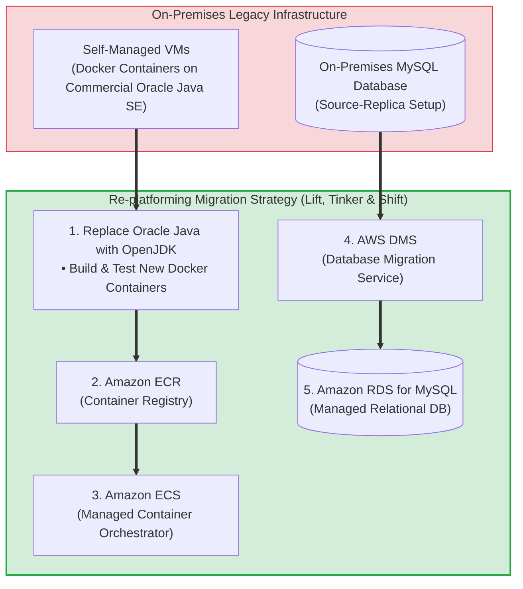

# Task 4.1: Select Existing Workloads and Processes for Potential Migration — Prioritization and Migration of Workloads (Wave Planning)

> [!NOTE]
> **Exam Mindset**: For the AWS Solutions Architect Professional (SAP-C02) and AI Practitioner (AIP-C01) exams, wave planning provides the risk-reduction framework to migrate large enterprise portfolios predictably:
> **Wave 0 (Landing Zone Foundation)** $\rightarrow$ **Pilot Wave (Process Validation)** $\rightarrow$ **Dependency-Grouped Waves (Quick Wins $\rightarrow$ Core $\rightarrow$ Mission Critical)** $\rightarrow$ **Blue/Green Cutover** $\rightarrow$ **Legacy Decommissioning**.

---

## 1. End-to-End Enterprise Migration Factory & Wave Execution Lifecycle



---

## 2. Workload Prioritization Matrix & Strategy Selection Engine



---

## 3. Migration Wave Phasing Breakdown

| Migration Phase / Wave | Primary Focus & Target Workloads | Core Objective | Primary Risk Mitigation |
| :--- | :--- | :--- | :--- |
| **Wave 0 (Foundation)** | Landing Zone, IAM, Networking, Security, CMDB | Establish governance & AWS migration platform | Prevents security gaps & networking rework |
| **Pilot Wave** | Low-risk, non-critical representative apps | Validate runbooks, bandwidth, and cutover steps | Tests migration factory without business risk |
| **Wave 1 (Quick Wins)**| High business value, low complexity apps | Build team confidence & demonstrate fast ROI | Establishes operational velocity |
| **Wave 2 (Core Apps)** | Multi-tier business applications & dependencies | Group co-dependent web/app/DB clusters together | Eliminates cross-environment network latency |
| **Wave 3 (Mission Critical)**| Tier-1 core transactional databases & systems | Migrate highest-value mission-critical assets | Uses Blue/Green cutover & Route 53 rollback |

---

## 4. Blue/Green & Route 53 Weighted Cutover Architecture



> [!IMPORTANT]
> **Group Co-Dependent Application Tiers in the Same Migration Wave**:
> Never migrate an application server to AWS while leaving its underlying database on-premises. Cross-environment traffic between AWS and on-premises introduces high latency, increased egress costs, and security risks. Co-migrate dependent tiers in the same wave.

---

## 5. Wave 0 Foundation & Landing Zone Readiness

> [!TIP]
> **Prerequisites Before Production Wave Execution**:
> Before launching Wave 1, complete **Wave 0**:
> - Deploy **AWS Control Tower / AWS Organizations** multi-account structure.
> - Establish **AWS Direct Connect** or **AWS Site-to-Site VPN** hybrid connectivity.
> - Configure **AWS IAM Identity Center**, Centralized CloudTrail Logging, and Security Hub.

---

## 6. On-Demand Pricing During Migration & Testing

> [!NOTE]
> **Use On-Demand Instances During Migration Transitions**:
> Avoid purchasing 1-year or 3-year **Savings Plans / Reserved Instances** before or during active migration waves. Workload instance sizing and runtime requirements evolve during testing. Use **On-Demand** pricing during cutover, and purchase Savings Plans *after* post-migration stabilization.

---

## 9. SAP-C02 Domain 4.1 Prioritization & Wave Planning Master Selection Decision Engine



---

## 10. SAP-C02 Exam Keyword Cheat Sheet

```
"Group workloads into controlled phases to reduce blast radius" ──> Migration Wave Planning
"Establish multi-account structure and networking before migration"──> Wave 0 Landing Zone Foundation
"Validate migration runbooks using low-risk representative app"──> Pilot Wave Migration
"Co-migrate application server and database together"          ──> Dependency-Based Wave Grouping
"Gradual user traffic shift to AWS with health-check rollback" ──> Amazon Route 53 Weighted Routing (Blue/Green)
"Track migration wave status across tools in one dashboard"     ──> AWS Migration Hub
```

---

## 9. Common SAP-C02 Exam Traps

1. **Trap 1: Starting Migration Waves with the Most Critical Production System**: Migrating Tier-1 applications first increases business risk and blast radius. Always validate migration factory runbooks with a **Pilot Wave** of low-risk representative applications.
2. **Trap 2: Grouping Waves Solely by Business Unit Instead of Dependencies**: Grouping applications by department ignores technical network dependencies. Always build migration waves using **Application Discovery Service dependency maps**.
3. **Trap 3: Purchasing Savings Plans Before Migration Waves Complete**: Committing to Savings Plans before cutover locks in instance sizes that may change during post-migration optimization. Use **On-Demand pricing** until target workloads stabilize.
4. **Trap 4: Executing All-at-Once Cutover Without a Rollback Safety Net**: Cutting over traffic abruptly without DNS routing safety nets leaves no recovery option during failures. Deploy **Route 53 Weighted Routing** for gradual Blue/Green cutover.

---

## 9.1 Real-World Exam Scenario: Tight-Deadline Hybrid Traffic Offloading (CloudFront Custom Origin + AWS WAF)

- **Scenario**: A company hosts a dynamic Flight Deals web application on-premises serving high-resolution photos and processing third-party payments. Due to a global marketing campaign, massive incoming traffic is expected in days. **Due to a tight deadline, the company does NOT have time to fully migrate the website to AWS.** Security compliance requires blocking SQL injection (SQLi) and cross-site scripting (XSS) attack patterns.
- **Architecture Solution**:



### Architectural Key Points:
1. **Immediate Offloading Without Migration**: Configuring CloudFront with a **Custom Origin** pointing to the existing on-premises server takes minutes/hours, requiring zero server migration or downtime.
2. **Edge Offload**: Caches high-resolution destination photos and static assets at global edge locations, absorbing 90%+ of incoming traffic spikes away from the on-premises data center.
3. **Edge Security**: Attaching **AWS WAF** directly to the CloudFront distribution inspects incoming HTTP requests for SQL injection and XSS patterns at the edge before traffic ever hits the on-premises origin.

### Why Distractors Fail:
- *Full Migration via AWS Application Migration Service (MGN)*: Replicating server block storage, configuring VPC subnets, and testing cutover is time-consuming and violates the **tight deadline** requirement.
- *Static S3 Website Hosting*: The application is dynamic (handles flight bookings and payment processing); static S3 hosting breaks payment functionality.
- *Hybrid ALB Load Balancing*: Placing an ALB in front of an on-premises server requires pre-configured AWS Direct Connect or Site-to-Site VPN, does not provide global edge caching for worldwide users, and omits the required WAF security filtering.

---

## 9.2 Real-World Exam Scenario 2: Re-platforming Containerized OpenJDK Java Apps & MySQL Database to AWS

- **Scenario**: A company hosts Docker containers running Java SE on self-managed VMs and a MySQL database in a source-replica HA setup. They want to migrate to AWS, switch the Java runtime to **OpenJDK** to eliminate licensing costs **without major changes to the application**, and reduce operational management overhead. What is the correct migration strategy and architecture?
- **Architecture Solution**:
  - **Re-platform the environment on AWS Cloud**: Test the new OpenJDK Docker containers, upload them to **Amazon Elastic Container Registry (ECR)**, and run them on **Amazon Elastic Container Service (Amazon ECS)**. Migrate the MySQL database to **Amazon RDS for MySQL** using **AWS Database Migration Service (AWS DMS)**.



### Key Technical Rationale:
1. **Re-platforming Strategy (Lift, Tinker, and Shift)**: Re-platforming optimizes specific components (container orchestration via **Amazon ECS** and database management via **Amazon RDS**) to achieve operational benefits **without changing the core application code or database schema**.
2. **Homogeneous Database Migration via AWS DMS**: Migrating on-premises MySQL to Amazon RDS for MySQL preserves the relational database structure, ACID compliance, and SQL queries with zero application rewrite.

### Why Distractor Options Fail:
- *Refactoring / Re-architecting to AWS Lambda & Amazon DynamoDB (Your Selection)*: Converting Docker containers to serverless AWS Lambda functions and converting relational MySQL schemas to NoSQL Amazon DynamoDB is **Refactoring/Re-architecting**. This requires massive application code rewrites, query model changes, and schema redesign, violating the core requirement to migrate **without major application changes**.
- *Re-hosting (Lift and Shift) to Self-Managed EC2*: Launching EC2 instances to mirror self-managed Docker VMs and self-managed MySQL servers on EC2 is simple **Re-hosting**, but fails to leverage AWS managed container/database services (ECS and RDS) to reduce operational management overhead.
- *AWS App Runner + DynamoDB Conversion*: Converting MySQL to DynamoDB is an unnecessary, complex refactoring step when RDS MySQL accepts the existing relational schema directly.

---

## 10. Final Mental Model

`Wave 0 Foundation ➔ Pilot Wave Process Validation ➔ Group Dependency Waves (Quick Wins ➔ Core ➔ Critical) ➔ Select Strategy (Rehost / Replatform / Refactor) ➔ Route 53 Weighted Cutover ➔ Decommission`