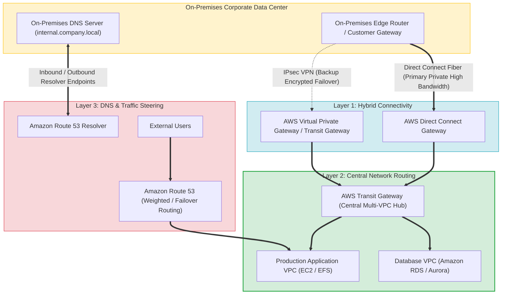
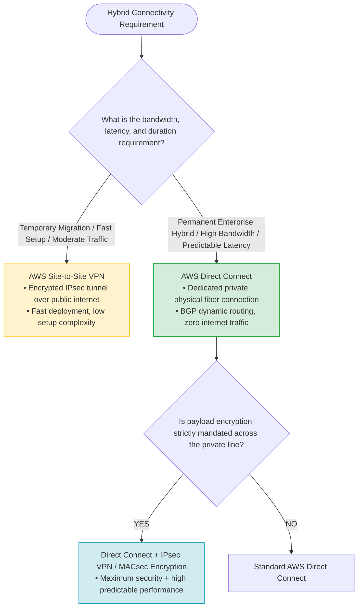
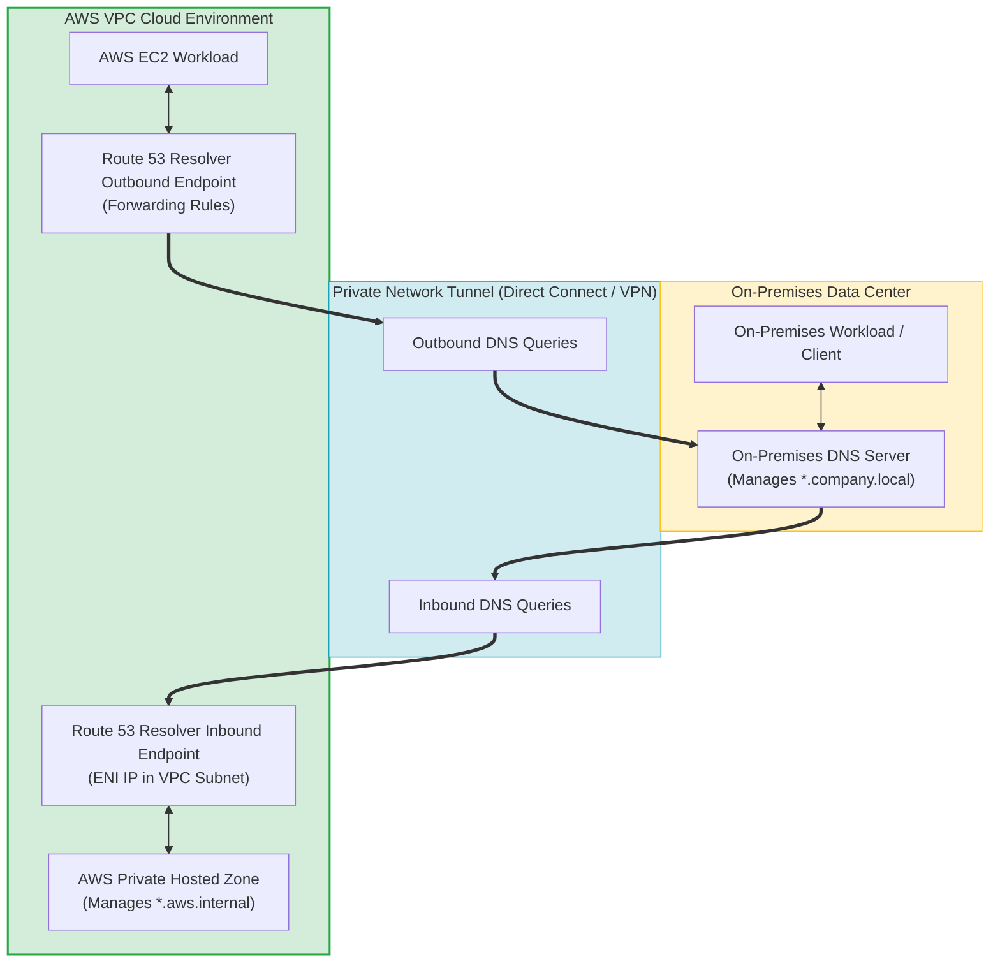
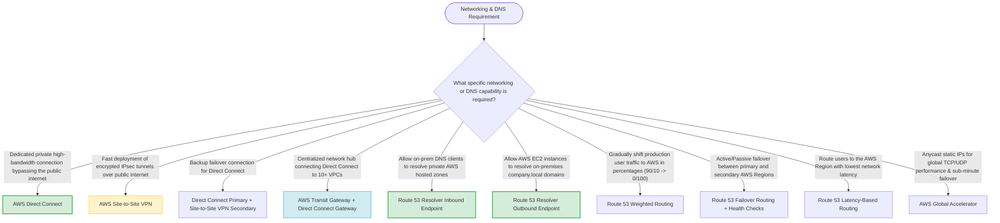
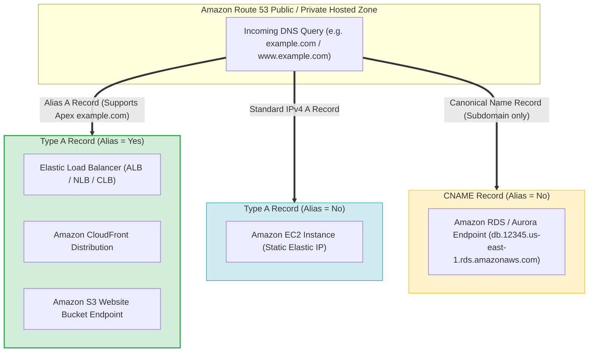
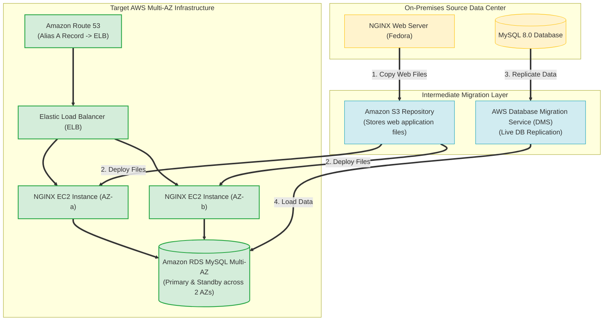

# Task 4.2: Determine the Optimal Migration Approach for Existing Workloads — AWS Networking Services and DNS

> [!NOTE]
> **Exam Mindset**: For the AWS Solutions Architect Professional (SAP-C02) and AI Practitioner (AIP-C01) exams, hybrid networking and traffic routing operate in 3 distinct layers:
> **Layer 1: Connectivity (Direct Connect vs. VPN)** $\rightarrow$ **Layer 2: Routing Architecture (Transit Gateway & DX Gateway)** $\rightarrow$ **Layer 3: Traffic Steering & Resolution (Amazon Route 53 & Resolver)**.

---

## 1. Hybrid Network & Traffic Routing Architecture (Layered 3-Tier Pattern)



---

## 2. Direct Connect vs. Site-to-Site VPN Decision Matrix



---

## 3. Hybrid Connectivity Comparison Breakdown

| Feature / Aspect | AWS Site-to-Site VPN | AWS Direct Connect | Direct Connect + VPN Backup |
| :--- | :--- | :--- | :--- |
| **Transport Medium** | Public Internet (IPsec Tunnels) | Dedicated Private Physical Fiber | DX Private Fiber (Primary) + Internet IPsec (Secondary) |
| **Bandwidth & Latency** | Variable (Internet dependent) | High (1 Gbps - 100 Gbps, Predictable) | High primary bandwidth with encrypted failover path |
| **Deployment Speed** | Fast (Hours) | Slow (Weeks/Months for physical circuit) | Staggered (Deploy VPN first, DX later) |
| **Encryption Default** | Encrypted by default (IPsec) | Not encrypted by default (Private circuit) | Encrypted backup path over internet |
| **Primary Use Case** | Temporary migration, branch office, backup link | Permanent enterprise hybrid data center | High-availability enterprise production workloads |

---

## 4. Route 53 Resolver Inbound vs. Outbound Hybrid DNS Architecture



> [!IMPORTANT]
> **Direct Connect is Private BUT NOT Encrypted by Default**:
> A critical exam distinction: **AWS Direct Connect** provides a private, dedicated physical connection that bypasses the public internet, but traffic is **unencrypted** by default. If encryption is required over Direct Connect, build an **IPsec VPN tunnel over Direct Connect** or use **MACsec encryption**.

---

## 5. Amazon Route 53 Routing Policies Feature Breakdown

| Route 53 Policy | Routing Mechanics | Primary Exam Trigger / Workload Requirement |
| :--- | :--- | :--- |
| **Weighted Routing** | Distributes traffic by assigned percentages (e.g., 90/10) | *"Gradual migration traffic shift, canary testing, Blue/Green cutover"* |
| **Failover Routing** | Active/Passive failover using endpoint health checks | *"Primary/Secondary Region disaster recovery failover"* |
| **Latency-Based Routing**| Routes to the AWS Region providing lowest network latency | *"Serve global users from the best performing AWS Region"* |
| **Geolocation Routing**| Routes based on client geographic country/continent | *"Enforce data sovereignty rules or location-specific localized content"* |
| **Geoproximity Routing**| Routes based on geographic location of resources with bias | *"Shift geographic boundaries of traffic toward specific AWS Regions"* |
| **Multi-Value Answer** | Returns up to 8 healthy records with health checking | *"Basic DNS-level load balancing across multiple IP endpoints"* |

---

## 6. Route 53 vs. AWS Global Accelerator vs. Amazon CloudFront

> [!TIP]
> **Selecting the Right Global Traffic Service**:
> - **Amazon Route 53**: **DNS-level routing** (resolves domain names to IPs based on policies).
> - **AWS Global Accelerator**: **Network-level IP acceleration** using static Anycast IPs over AWS global backbone (sub-minute failover without DNS TTL delays).
> - **Amazon CloudFront**: **Global Content Delivery Network (CDN)** caching static/dynamic web content at edge locations.

---

## 7. SAP-C02 Domain 4.2 Networking & DNS Master Selection Decision Engine



---

## 8. SAP-C02 Exam Keyword Cheat Sheet

```
"Dedicated physical private circuit with predictable latency"         ──> AWS Direct Connect
"Quick encrypted connectivity over public internet"                  ──> AWS Site-to-Site VPN
"Resilient hybrid connection with encrypted failover path"           ──> Direct Connect (Primary) + Site-to-Site VPN (Secondary)
"Connect Direct Connect to multiple VPCs across multiple Regions"    ──> AWS Transit Gateway + Direct Connect Gateway
"On-premises DNS resolving private AWS Private Hosted Zone records"  ──> Route 53 Resolver Inbound Endpoint
"AWS EC2 instances resolving on-premises internal.company.local"    ──> Route 53 Resolver Outbound Endpoint
"Gradually shift user traffic during migration phase"                ──> Route 53 Weighted Routing
"Active/Passive Regional failover based on health checks"             ──> Route 53 Failover Routing
"Static Anycast IPs with sub-minute failover bypassing DNS TTL"      ──> AWS Global Accelerator
```

---

## 5.1 Route 53 Record Types & Alias Record Mapping for AWS Infrastructure Targets

A high-yield exam topic is knowing **which Route 53 Record Type** to create for specific AWS target endpoints:



### Route 53 Target Record Type Mapping Matrix

| AWS Target Infrastructure | Route 53 Record Type | Alias Required? | Zone Apex (`example.com`) Compatible? | Key Technical Reason |
| :--- | :--- | :---: | :---: | :--- |
| **Elastic Load Balancer (ALB/NLB)** | **Type A Record** | **YES (Alias = Yes)** | **YES** | ELB IP addresses change dynamically. Alias records automatically track ELB IPs and work on zone apex (`example.com`). |
| **Amazon CloudFront CDN** | **Type A / AAAA Record** | **YES (Alias = Yes)** | **YES** | Alias routes apex domains directly to CloudFront distributions with $0$ extra Route 53 query costs. |
| **Amazon S3 Website Endpoint** | **Type A Record** | **YES (Alias = Yes)** | **YES** | Allows pointing zone apex to S3 static website hosting bucket endpoints. |
| **Amazon EC2 Instance (Static EIP)**| **Type A Record** | NO (Alias = No) | YES | Standard IPv4 address mapping directly to an EC2 Elastic IP. |
| **Amazon RDS / Aurora Endpoint** | **CNAME Record** | NO (Alias = No) | NO (Subdomains only) | RDS endpoints are DNS names (`my-db.rds.amazonaws.com`). CNAME maps custom subdomains (`db.example.com`). |

---

## 8.1 Real-World Exam Scenario: On-Premises NGINX + MySQL Migration & Route 53 ELB Alias Routing

- **Scenario**: A company is migrating an interactive car registration web application from an on-premises Fedora server (NGINX web server + MySQL database) to AWS. The architecture requires distributing incoming traffic across web servers in 2 Availability Zones using an Elastic Load Balancer (ELB), and using Route 53 for domain management. What is the most efficient migration approach?
- **Architecture Solution**:
  1. Launch two NGINX EC2 instances across **two Availability Zones**.
  2. Copy web application files from the on-premises web server to each EC2 instance (using S3 as an intermediate transfer repository).
  3. Migrate the MySQL database to AWS using **AWS Database Migration Service (DMS)**.
  4. Create an Elastic Load Balancer (ELB) to front the web servers across both AZs.
  5. In Route 53, create an **Alias A record** pointing to the ELB DNS name.



### Key Technical Rationale:
1. **Route 53 Alias A Record for ELBs**: ELBs do not have static IP addresses. To route domain traffic (`example.com` or `www.example.com`) to an ELB, Route 53 requires an **Alias A Record**. Standard (non-alias) A records require static IP addresses and cannot point directly to an ELB DNS name.
2. **AWS DMS for Database Migration**: Migrating a live MySQL database to AWS is efficiently handled by AWS DMS with minimal downtime.
3. **Multi-AZ Architecture Truth**: A Multi-AZ RDS deployment provisions primary and standby database instances across **multiple (2+) Availability Zones**. Options stating *"Launch Multi-AZ RDS in one Availability Zone only"* are self-contradictory and invalid.

### Why Distractor Options Fail:
- *Pointing a Non-Alias A Record to ELB*: Non-alias A records require IP addresses. ELB endpoints use DNS hostnames that resolve to dynamic IPs. You MUST use an **Alias A Record**.
- *Hosting Interactive App directly out of S3*: Amazon S3 static website hosting only supports static HTML/JS assets. An interactive car registration system with NGINX + PHP/Ruby/Python backend querying MySQL requires EC2 or container compute instances.
- *AWS Transform MGN*: "AWS Transform" or "AWS Transform MGN" is a fictitious service name. AWS Application Migration Service (MGN) rehosts VMs, but does not use a service named "AWS Transform".
- *Multi-AZ RDS in One AZ Only*: Multi-AZ deployment by definition spans multiple AZs; deploying Multi-AZ in "one AZ only" is impossible.

---

## 9. Common SAP-C02 Exam Traps

1. **Trap 1: Assuming Direct Connect Encrypts Traffic Automatically**: Direct Connect is private, but payload data is unencrypted unless combined with **IPsec VPN over Direct Connect** or **MACsec**.
2. **Trap 2: Choosing Direct Connect for Temporary 2-Week Data Migration**: Provisioning a physical Direct Connect circuit takes weeks or months. For temporary migration, deploy **AWS Site-to-Site VPN** or **AWS DataSync**.
3. **Trap 3: Confusing Route 53 Resolver Inbound vs. Outbound Endpoints**: Inbound endpoints receive DNS queries *from on-premises to AWS*. Outbound endpoints forward DNS queries *from AWS to on-premises DNS servers*.
4. **Trap 4: Selecting Route 53 DNS for Sub-Second Failover**: DNS propagation depends on client TTL caching. For instant sub-minute failover with static IP addresses, select **AWS Global Accelerator**.
5. **Trap 5: Using Non-Alias A Records or CNAME Records for ELB Zone Apex**: Standard CNAME records cannot be created at the zone apex (`example.com`). To route root apex domain traffic to an Elastic Load Balancer or CloudFront distribution, always select **Route 53 Type A Record with Alias = Yes**.

---

## 10. Final Mental Model

`Connect Privately (Direct Connect) ➔ Encrypt Internet Path (VPN) ➔ Route Central Networks (Transit Gateway) ➔ Resolve Hybrid DNS (Resolver) ➔ Route ELB/CDN via Alias A Record`