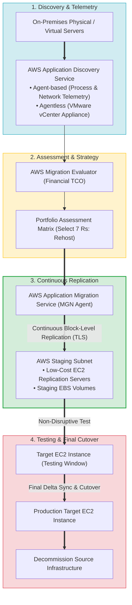
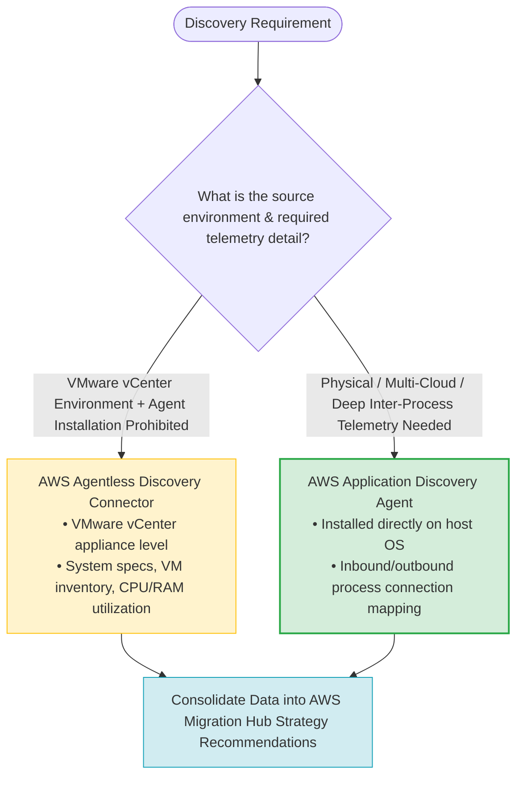
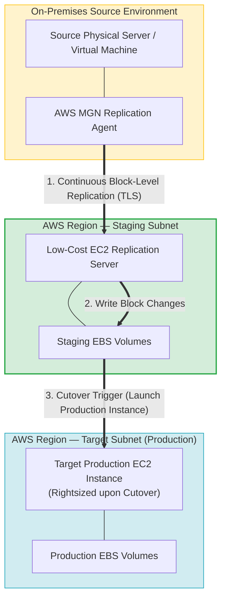

# Task 4.2: Determine the Optimal Migration Approach for Existing Workloads — Application Migration Tools

> [!NOTE]
> **Exam Mindset**: For the AWS Solutions Architect Professional (SAP-C02) and AI Practitioner (AIP-C01) exams, the foundational distinction between application migration tools is:
> **AWS Application Discovery Service** = *"Understand what I have (Telemetry & Dependencies)"*
> **AWS Application Migration Service (AWS MGN)** = *"Move what I have (Continuous Block Replication)"*.

---

## 1. End-to-End Discovery to Cutover Pipeline Architecture



---

## 2. Agent-Based vs. Agentless Discovery Decision Matrix



---

## 3. AWS Application Discovery Service vs. AWS MGN Comparison Breakdown

| Feature / Dimension | AWS Application Discovery Service | AWS Application Migration Service (AWS MGN) |
| :--- | :--- | :--- |
| **Primary Purpose** | Discover inventory, utilization, and process dependencies | Execute continuous server replication and automated cutover |
| **Core Question Asked** | *"What servers and application connections exist?"* | *"How do we lift and shift these servers into EC2 with minimal downtime?"* |
| **Deployment Mode** | Agent-based (OS Agent) or Agentless (VMware vCenter Connector) | MGN Replication Agent installed on source host |
| **Replication Scope** | None (Telemetry collection only) | Continuous block-level volume replication via TLS |
| **AWS Target Component**| AWS Migration Hub Strategy Recommendations / Reports | AWS Staging Subnet $\rightarrow$ Production Target EC2 Instances |
| **Primary Strategy Alignment**| Portfolio & Asset Assessment | Rehost (Lift & Shift) |

---

## 4. AWS MGN Continuous Replication & Staging Architecture



> [!IMPORTANT]
> **Application Discovery Service Does NOT Migrate Servers**:
> A classic exam trap is choosing Application Discovery Service to migrate server workloads. Discovery Service only collects telemetry data. Actual server migration requires **AWS Application Migration Service (AWS MGN)**.

---

## 5. AWS MGN (Rehost Migration) vs. AWS Elastic Disaster Recovery (DRS)

> [!NOTE]
> **Migration vs. Disaster Recovery**:
> Although AWS MGN and AWS Elastic Disaster Recovery (DRS) share similar underlying replication engines, their business objectives differ:
> - **AWS MGN**: Used for **one-time permanent workload migration** into AWS.
> - **AWS Elastic Disaster Recovery (DRS)**: Used for **ongoing business continuity and failover/failback** in case of disaster events.

---

## 6. Two-Step Migration & Modernization Strategy

> [!TIP]
> **Separate Migration Risk from Modernization Risk**:
> When asked to migrate a large portfolio quickly and modernize it:
> 1. **Phase 1 (Rehost)**: Use **AWS MGN** to move physical/virtual servers into EC2 quickly with minimal downtime.
> 2. **Phase 2 (Modernize)**: Replatform to managed services (e.g., Amazon RDS) or Refactor into cloud-native microservices/containers *after* the application is stable in AWS.

---

## 6.1 AWS Application Migration Service (AWS MGN / Transform MGN) vs. VM Import/Export

When migrating physical or virtual servers (VMs) with continuous data synchronization and **minimal cutover downtime**, choose **AWS Application Migration Service (AWS MGN)**:

```mermaid
flowchart TD
    subgraph MGN_Engine["AWS Application Migration Service (AWS MGN / Transform MGN)"]
        SourceVM["On-Premises VM Server<br/>(Root + Multi-TB Data Volumes)"]
        Agent["AWS Replication Agent"]
        Staging["AWS Staging Subnet<br/>(Continuous Block-Level TLS Delta Sync)"]
        Cutover["Production Cutover EC2 Instance<br/>⚡ Minimal Downtime & Zero Code Changes!"]

        SourceVM ==> Agent ==> Staging ==> Cutover
    end

    subgraph VMIE_Engine["VM Import/Export CLI (Manual Snapshot Import)"]
        SourceVM2["On-Premises VM Server"]
        CLI_Script["Manual CLI Script / Export Disk Image to S3"]
        AMI_Import["Import AMI / Snapshot from S3"]
        FailNotice["🚫 NO Continuous Delta Sync!<br/>❌ Requires re-importing multi-TB disks from scratch<br/>❌ High Operational Overhead & Long Cutover Downtime"]

        SourceVM2 ==> CLI_Script ==> AMI_Import ==> FailNotice
    end

    classDef safe fill:#d4edda,stroke:#28a745,color:#ffffff;
    classDef danger fill:#f8d7da,stroke:#dc3545,color:#ffffff;

    class MGN_Engine,SourceVM,Agent,Staging,Cutover safe;
    class FailNotice danger;
```



### Architectural Comparison Matrix

| Migration Capability | AWS Application Migration Service (AWS MGN) | VM Import/Export |
| :--- | :---: | :---: |
| **Continuous Block Replication** | **YES (Automated real-time delta sync until cutover)** | ❌ **NO (Manual single snapshot import)** |
| **Multi-Terabyte Volume Support**| **YES (Replicates root and all attached data volumes)** | Manual individual disk image exports to S3 |
| **Cutover Downtime Window** | **Minimal (Minutes for final delta sync)** | **High (Hours/days to re-upload full disk images)** |
| **Operational Overhead** | **Lowest (Fully managed lifecycle in AWS Console)** | **High (Requires writing & scheduling custom CLI scripts)** |
| **Non-Disruptive Testing** | **YES (Launch test instances anytime without stopping replication)** | Requires manually launching new AMIs from imported snapshots |

---

## 7.1 Real-World Exam Scenario: On-Premises 3-Tier VM Migration with Continuous Replication (AWS MGN)

- **Scenario**: A company has several virtual machines on its on-premises data center hosting a 3-tier web application. The company wants to migrate the VMs to AWS. Requirements:
  - Root volumes and multi-terabyte data volumes of the VMs must be imported to AWS.
  - On-premises server changes must be continuously synchronized to AWS servers until production cutover.
  - Minimal downtime during production cutover.
  - **Minimal operational overhead**.
  What is the recommended migration solution?
- **Architecture Solution**:
  - Use **AWS Application Migration Service (AWS MGN / Transform MGN)**. Install the **AWS Replication Agent** on each server in the application tiers to continuously replicate root volumes and data volumes to AWS. Launch test instances from the replicated servers to validate the application, then execute a cutover launch to production Amazon EC2 instances.

### Key Technical Rationale:
1. **Continuous Block-Level Replication**: The **AWS Replication Agent** performs non-disruptive, continuous block-level replication of all root and data volumes over TLS into an AWS staging area. This allows on-premises systems to continue operating normally while keeping AWS staging volumes continuously updated.
2. **Minimal Operational Overhead & Short Downtime**: AWS MGN manages the entire migration lifecycle natively from the console (Replication $\rightarrow$ Testing $\rightarrow$ Cutover), eliminating custom CLI scripting and keeping the final cutover window down to minutes.

### Why Distractor Options Fail:
- *VM Import/Export with recurring CLI scripts*: VM Import/Export does **NOT** support continuous or incremental block-level data synchronization. Re-importing multi-terabyte VM disk images from scratch every cycle adds massive operational overhead, bandwidth consumption, and downtime during cutover.
- *Migrating root volumes via MGN and data volumes separately via `import-snapshot`*: Splitting root and data volume migration paths increases operational complexity and causes data state inconsistency between root OS disks and attached data disks. MGN natively replicates root and all attached data volumes automatically.
- *AWS Application Discovery Service + VM Import/Export CLI scripts*: Discovery service assists with dependency mapping, but VM Import/Export is an ad-hoc image import tool, not an automated continuous replication migration factory like AWS MGN.

---

## 8. SAP-C02 Exam Keyword Cheat Sheet

```
"Discover servers, running processes, and network connections"     ──> AWS Application Discovery Service (Agent-based)
"Discover VMware inventory without installing agents on VMs"       ──> AWS Application Discovery Service (Agentless)
"Lift and shift physical/virtual servers with minimal downtime"     ──> AWS Application Migration Service (AWS MGN)
"Continuous block-level volume replication to staging subnet"      ──> AWS Application Migration Service (AWS MGN)
"Replicate root and data volumes continuously until cutover"      ──> AWS Application Migration Service (AWS MGN)
"Automate VM migration with minimal operational overhead"          ──> AWS Application Migration Service (AWS MGN)
"Use VM Import/Export for continuous delta replication"             ──> ❌ FAILS (VM Import/Export cannot do delta sync!)
"Track migration status across tools in one central dashboard"      ──> AWS Migration Hub
"Ongoing disaster recovery failover and failback capability"       ──> AWS Elastic Disaster Recovery (DRS)
```

---

## 9. Common SAP-C02 Exam Traps

1. **Trap 1: Choosing Application Discovery Service to Migrate Servers**: Discovery Service collects telemetry. It cannot migrate server disks or launch EC2 instances. Choose **AWS MGN** for migration.
2. **Trap 2: Using AWS MGN for Database Modernization**: AWS MGN performs block-level server rehosting to EC2. To migrate and replatform databases to managed services (RDS/Aurora), choose **AWS DMS**.
3. **Trap 3: Selecting AWS MGN for Disaster Recovery Failover**: MGN is designed for permanent one-time migration. For ongoing disaster recovery failover and failback, choose **AWS Elastic Disaster Recovery (DRS)**.
4. **Trap 4: Attempting to Modernize Code Architecture Simultaneously with Rapid Lift-and-Shift**: Attempting to rewrite monoliths while migrating 1,000 servers under tight deadlines increases risk. Rehost first with **AWS MGN**, then modernize in Phase 2.
5. **Trap 5: Selecting VM Import/Export for Continuous Data Synchronization**: VM Import/Export is a manual single-snapshot import utility for single VM images. It **cannot** perform continuous or incremental block-level delta replication. For continuous server synchronization with minimal cutover downtime, always choose **AWS MGN**.

---

## 10. Final Mental Model

`Discover & Map Telemetry (Discovery Service) ➔ Financial Case (Migration Evaluator) ➔ Replicate Block-Level to Staging (AWS MGN Agent) ➔ Non-Disruptive Test Launch ➔ Minimal-Downtime Cutover`