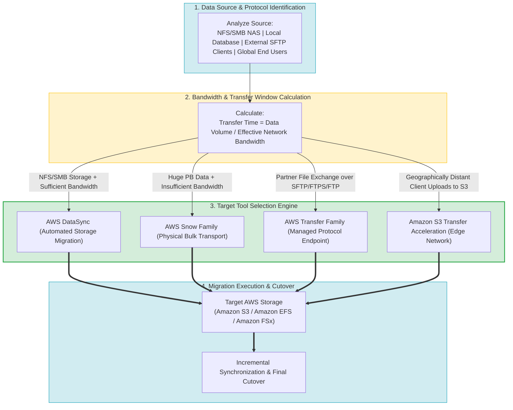
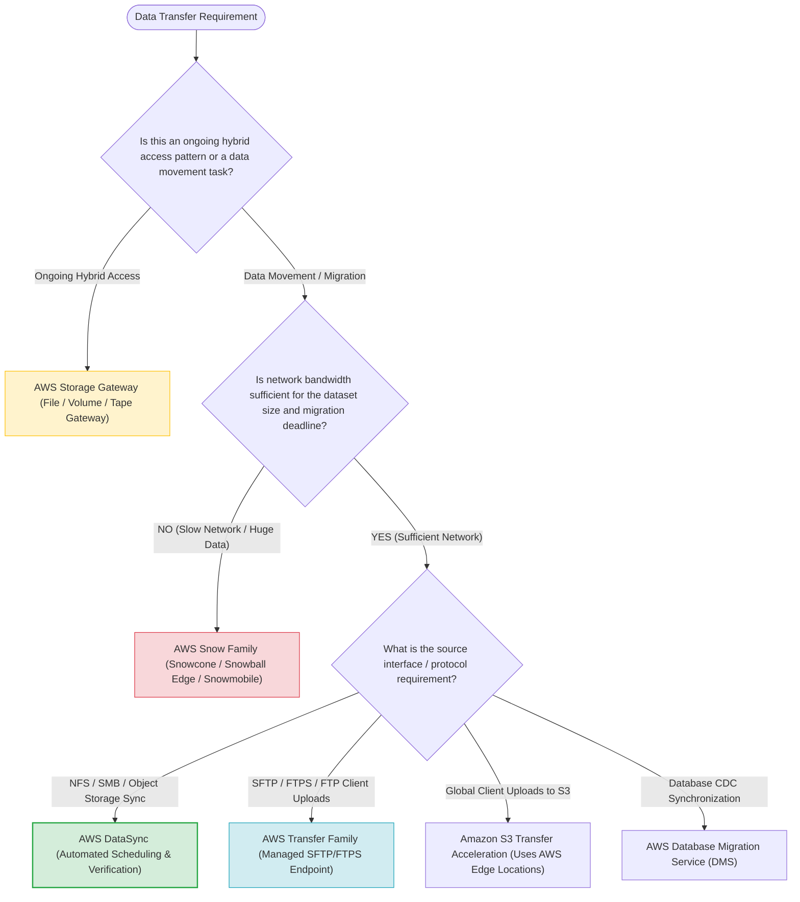
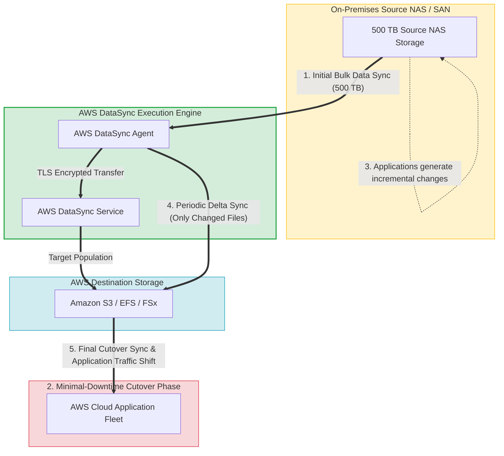
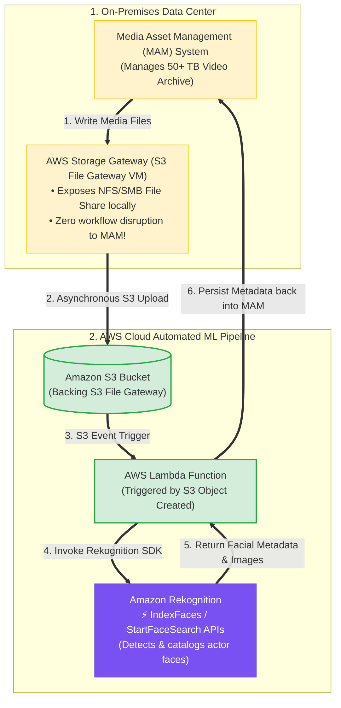
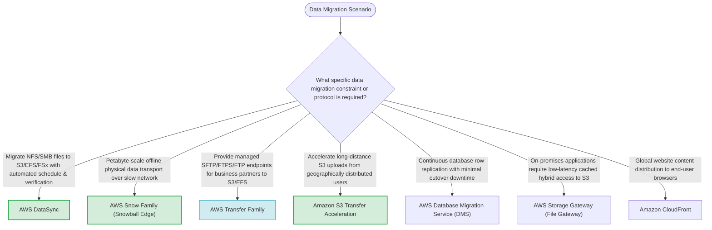

# Task 4.2: Determine the Optimal Migration Approach for Existing Workloads — Data Migration Options and Tools

> [!NOTE]
> **Exam Mindset**: For the AWS Solutions Architect Professional (SAP-C02) and AI Practitioner (AIP-C01) exams, selecting the correct data migration tool depends on evaluating 6 core variables:
> **Source Data Format** $\rightarrow$ **Data Volume** $\rightarrow$ **Effective Network Bandwidth** $\rightarrow$ **Migration Window** $\rightarrow$ **Required Protocol** $\rightarrow$ **AWS Target Storage**.

---

## 1. End-to-End Data Migration Selection & Pipeline Lifecycle



---

## 2. Data Transfer Method Selection Tree (Network vs. Physical vs. Protocol vs. Distance)



---

## 3. Data Migration Tooling Comparison Breakdown

| Tool / Service | Transfer Mechanism | Primary Protocol / Interface | Typical Use Case | Key Differentiator |
| :--- | :--- | :--- | :--- | :--- |
| **AWS DataSync** | Network-based (Agent) | NFS, SMB, HDFS, S3 API | Storage-to-storage automated migration | Automated scheduling, verification & incremental sync |
| **AWS Snow Family** | Physical appliance shipping | NFS, SMB, S3 API, Local Compute | Massive data migration over slow networks | Bypasses network bottleneck via physical transport |
| **AWS Transfer Family**| Managed network endpoint | SFTP, FTPS, FTP, AS2 | Partner B2B file exchange directly into S3/EFS | Protocol compatibility without self-managed SFTP servers |
| **Amazon S3 Transfer Acceleration**| AWS Edge Locations network | S3 REST API (Over CloudFront edge) | Global client uploads over long distances | Uses AWS global backbone network for fast distant uploads |
| **AWS Storage Gateway**| Hybrid cache appliance | NFS, SMB, iSCSI | Low-latency local access to AWS storage | Persistent hybrid storage caching (Not bulk migration) |
| **AWS DMS** | Network DB replication | SQL / NoSQL database engines | Database migration with ongoing CDC sync | Continuous database row replication with minimal downtime |

---

## 4. Minimal-Downtime Incremental DataSync Migration Architecture



> [!IMPORTANT]
> **DataSync (Storage Migration) vs. Transfer Family (Managed SFTP Interface)**:
> - Use **AWS DataSync** when migrating existing storage systems (NFS/SMB NAS $\rightarrow$ S3/EFS/FSx) in automated batches or recurring schedules.
> - Use **AWS Transfer Family** when external partners or legacy clients need to upload files via **SFTP, FTPS, or FTP** directly into Amazon S3 or Amazon EFS.

---

## 5. Calculate Transfer Time Before Choosing Between DataSync and Snowball

> [!TIP]
> **Data Volume ÷ Effective Bandwidth Formula**:
> Do not assume large data automatically means Snowball. Calculate the transfer duration:
> $$\text{Transfer Time} = \frac{\text{Total Data Volume (Bits)}}{\text{Available Network Bandwidth (Bps)}}$$
> - **100 TB over a 10 Gbps Direct Connect**: $\approx 24$ hours $\rightarrow$ Select **AWS DataSync**.
> - **100 TB over a 100 Mbps VPN Link**: $\approx 100+$ days $\rightarrow$ Select **AWS Snowball Edge**.

---

## 6. S3 Transfer Acceleration vs. Amazon CloudFront

> [!NOTE]
> **Uploading vs. Content Distribution**:
> - **Amazon S3 Transfer Acceleration**: Optimizes **long-distance uploads to Amazon S3** from geographically distributed clients using AWS Edge Locations.
> - **Amazon CloudFront**: Optimizes **global web content distribution and caching** to end-user browsers.

---

## 7.1 S3 File Gateway + Lambda + Amazon Rekognition Integration Pattern

When hybrid applications (such as on-premises Media Asset Management [MAM] systems) need to migrate video assets to AWS S3 while applying automated Machine Learning facial recognition, **S3 File Gateway provides seamless file-to-object translation**:



---

## 7. DataSync vs. AWS Storage Gateway

> [!CAUTION]
> **Migration vs. Persistent Hybrid Access**:
> - Use **AWS DataSync** to move or synchronize data from on-premises storage to AWS.
> - Use **AWS Storage Gateway (File Gateway)** when on-premises applications must retain persistent, low-latency NFS/SMB access to data stored in Amazon S3.

---

## 10.5 Real-World Exam Scenario: Hybrid Media Archival Tagging (S3 File Gateway + Rekognition vs. Kinesis Video Streams Trap)

- **Scenario**: A major entertainment studio maintains a 50+ TB video archive on-premises managed by a Media Asset Management (MAM) system. The studio wants an automated tagging system using facial recognition (Amazon Rekognition) to catalog actors across the archive while gradually migrating assets to AWS with **minimal disruption** and **least operational overhead**. What is the optimal solution?
- **Architecture Solution**:
  - Set up an on-premises **AWS Storage Gateway (S3 File Gateway)** appliance. Configure the MAM solution to write video files to the File Gateway file share (which asynchronously backs files into Amazon S3). Use an **AWS Lambda function** triggered by S3 uploads to invoke the **Amazon Rekognition** SDK to build a face collection (`IndexFaces`/`StartFaceSearch`) and persist facial metadata back into the MAM solution.

### Why Distractor Options Fail:
- *Amazon Kinesis Video Streams (Your Selection)*:
  - Kinesis Video Streams is designed for real-time live camera feed ingestion (RTSP/WebRTC from IoT/security cameras), NOT for processing existing 50+ TB archival video files! Refactoring an existing MAM system to stream pre-recorded 50 TB archival files into Kinesis Video Streams requires massive custom code refactoring, high operational complexity, and stream consumer management.
- *Tape Gateway + Real-time Rekognition from Tape*:
  - Tape Gateway archives virtual tapes directly into Amazon S3 Glacier / S3 Glacier Deep Archive. Amazon Rekognition **CANNOT directly process objects stored in S3 Glacier in real-time** without an expensive, multi-hour retrieval process! Tape Gateway is strictly for cold tape backup, not live file access for ML APIs.
- *AWS DataSync + EC2 Instance running OpenFace/OpenCV*:
  - Installing open-source facial recognition software on self-managed EC2 instances introduces massive operational management overhead (OS patching, scaling, custom ML model tuning) compared to using fully managed Amazon Rekognition + AWS Lambda.

---

## 8. SAP-C02 Domain 4.2 Data Migration Master Selection Decision Engine



---

## 9. SAP-C02 Exam Keyword Cheat Sheet

```
"Migrate NFS/SMB NAS file system data to S3 or EFS over network"  ──> AWS DataSync
"Huge petabyte dataset with constrained/slow network bandwidth"    ──> AWS Snowball Edge / Snow Family
"External partners must upload files using SFTP/FTPS directly to S3"──> AWS Transfer Family
"Geographically distant users experiencing slow S3 upload speeds"  ──> Amazon S3 Transfer Acceleration
"Database migration with continuous change data capture (CDC)"     ──> AWS Database Migration Service (DMS)
"On-premises apps require local NFS cache to S3 buckets"           ──> AWS Storage Gateway (File Gateway)
```

---

## 10. Common SAP-C02 Exam Traps

1. **Trap 1: Selecting Snowball Purely Based on Terabyte Size**: If a company has a 10 Gbps Direct Connect connection, 100 TB can migrate via DataSync in one day. Always calculate transfer time based on bandwidth before picking physical appliances.
2. **Trap 2: Using AWS Transfer Family for Bulk Server Storage Migration**: Transfer Family provides an SFTP client endpoint. For automated bulk file server migration, choose **AWS DataSync**.
3. **Trap 3: Confusing CloudFront with S3 Transfer Acceleration**: CloudFront caches content for global browser downloads. For accelerating client uploads directly to S3, select **S3 Transfer Acceleration**.
4. **Trap 4: Using Storage Gateway for One-Time File Migration**: Storage Gateway creates a persistent hybrid caching layer. For one-time or scheduled data migration, choose **AWS DataSync**.

---

## 11. Final Mental Model

`Storage-to-Storage (DataSync) ➔ Bulk Offline (Snowball) ➔ Partner SFTP (Transfer Family) ➔ Distant S3 Uploads (Transfer Acceleration) ➔ Hybrid Cache (Storage Gateway) ➔ DB Sync (DMS)`