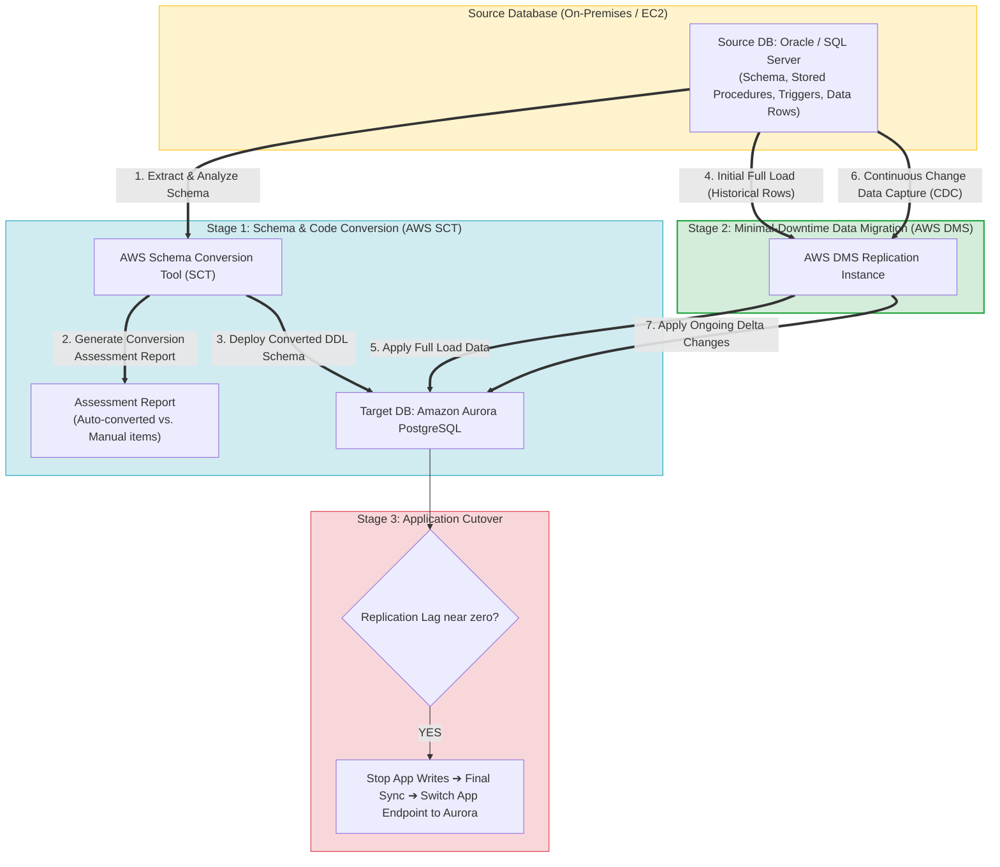
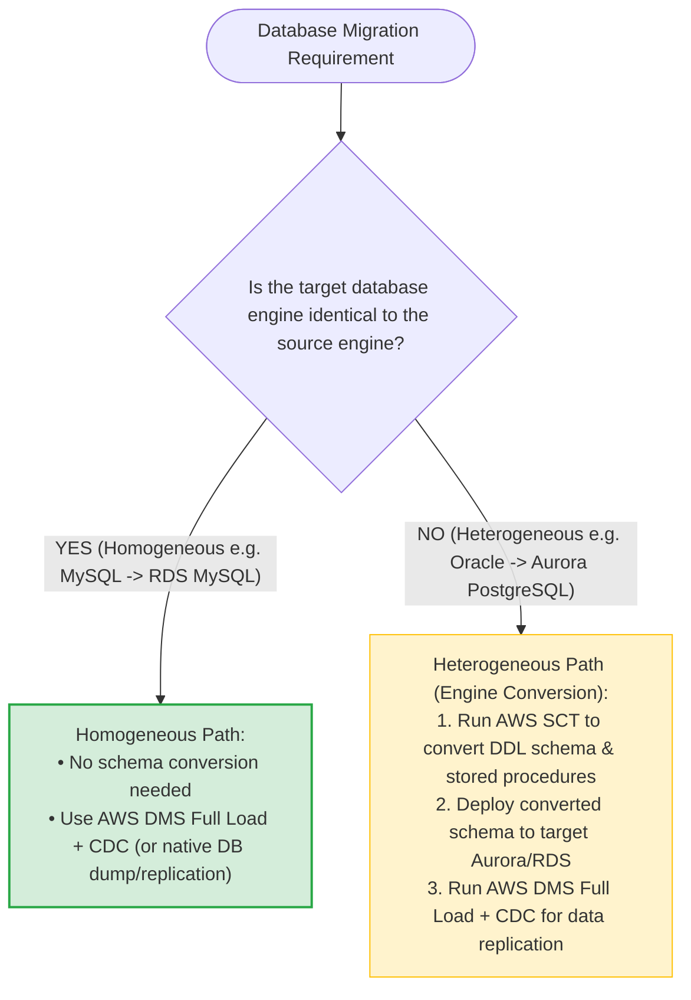
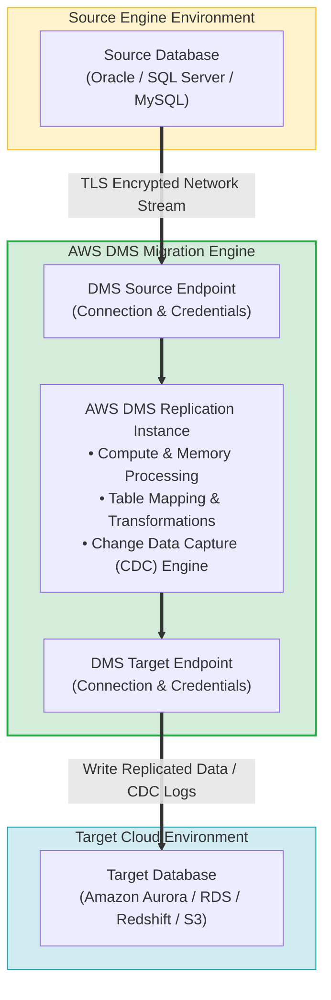
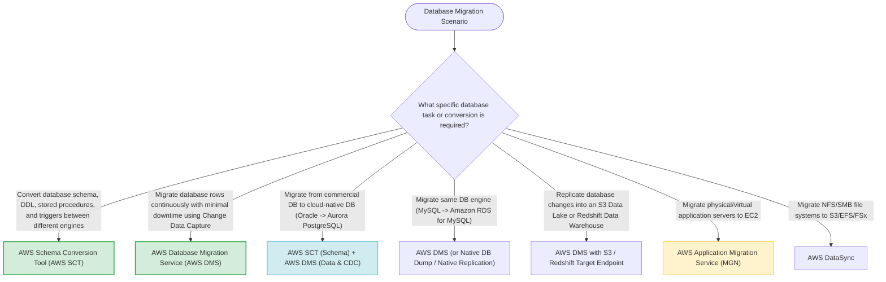
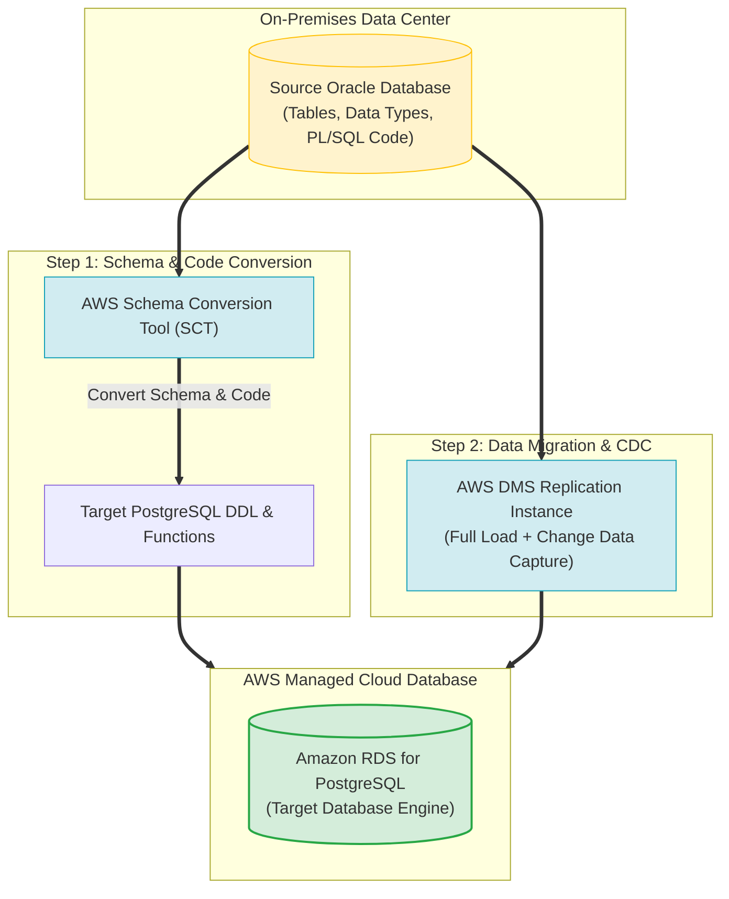
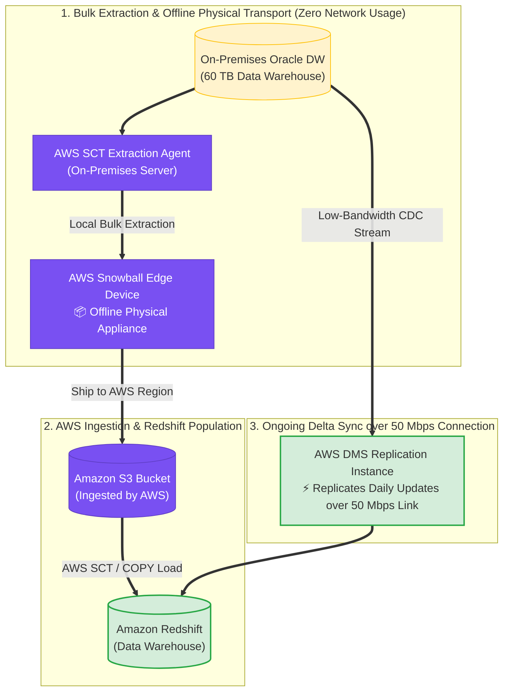

# Task 4.2: Determine the Optimal Migration Approach for Existing Workloads — Database Migration Tools

> [!NOTE]
> **Exam Mindset**: For the AWS Solutions Architect Professional (SAP-C02) and AI Practitioner (AIP-C01) exams, remember the golden rule separating database migration tooling:
> **AWS Schema Conversion Tool (AWS SCT)** = *"Converts database structure, DDL schema, and stored code"*
> **AWS Database Migration Service (AWS DMS)** = *"Migrates data rows and continuously replicates changes with CDC"*.

---

## 1. Heterogeneous Database Migration Pipeline Architecture (SCT + DMS CDC)



---

## 2. Homogeneous vs. Heterogeneous Database Migration Decision Matrix



---

## 3. Database Migration Tooling Responsibility Matrix

| Feature / Capability | AWS Schema Conversion Tool (AWS SCT) | AWS Database Migration Service (AWS DMS) |
| :--- | :--- | :--- |
| **Primary Responsibility** | Converts database schema, DDL, stored procedures, & functions | Migrates data records, historical rows, and ongoing CDC deltas |
| **Data Replication Scope** | None (Schema & code structure conversion only) | Full Load (initial copy) + Change Data Capture (CDC sync) |
| **Migration Type Focus** | Required for **Heterogeneous** migrations | Used for both **Homogeneous** and **Heterogeneous** migrations |
| **Key Output Artifact** | Converted target DDL script & Assessment Report | Synchronized Target Database (Amazon RDS / Aurora / Redshift) |
| **Downtime Impact** | Used before migration begins (Zero downtime impact) | Enables minimal-downtime cutover via continuous CDC |

---

## 4. AWS DMS Replication Instance & Endpoints Architecture



> [!IMPORTANT]
> **Heterogeneous Migrations Require BOTH AWS SCT and AWS DMS**:
> When migrating across different database engines (e.g., Oracle $\rightarrow$ Amazon Aurora PostgreSQL):
> 1. Use **AWS SCT** to convert DDL schemas, stored procedures, triggers, and functions.
> 2. Use **AWS DMS** to perform the initial **Full Load** data migration and enable continuous **Change Data Capture (CDC)**.

---

## 5. Homogeneous Migration Does NOT Require AWS SCT

> [!NOTE]
> **Same Engine Migration Simplification**:
> If migrating between the same engine (e.g., on-premises PostgreSQL $\rightarrow$ Amazon RDS for PostgreSQL), **AWS SCT is not required**. The target database uses native schema structure. Migrate data directly using **AWS DMS** or native engine tools (`pg_dump` / `mysqldump`).

---

## 6. Minimal Downtime Cutover via Change Data Capture (CDC)

> [!TIP]
> **Achieving Zero/Minimal Application Downtime**:
> To minimize cutover downtime during database migration:
> 1. Launch DMS **Full Load** while the source database remains live and fully operational.
> 2. Enable **CDC (Change Data Capture)** to continuously capture ongoing transaction logs.
> 3. Monitor **Replication Lag** in CloudWatch. When lag approaches zero, perform a brief cutover window, freeze source writes, perform final delta sync, and point the application to the new AWS database endpoint.

---

## 7. SAP-C02 Domain 4.2 Database Migration Master Selection Decision Engine



---

## 8. SAP-C02 Exam Keyword Cheat Sheet

```
"Convert DDL schemas, PL/SQL, and stored procedures between different engines"──> AWS Schema Conversion Tool (AWS SCT)
"Generate conversion complexity assessment report"                     ──> AWS SCT Assessment Report
"Migrate database data with minimal downtime using Change Data Capture"  ──> AWS DMS with CDC
"Oracle or SQL Server to Amazon Aurora PostgreSQL migration"           ──> AWS SCT (Schema) + AWS DMS (Data & CDC)
157: "Replicate live operational database changes to Amazon S3 data lake"   ──> AWS DMS with S3 Target Endpoint
```

---

## 8.1 Real-World Exam Scenario: Heterogeneous Database Migration (On-Premises Oracle to Amazon RDS PostgreSQL)

- **Scenario**: An enterprise adopts a hybrid cloud architecture requiring the migration of an on-premises **Oracle database to Amazon RDS for PostgreSQL**. Prior to data migration, schema and database code (stored procedures, functions, data types) must be transformed. What is the most suitable approach?
- **Architecture Solution**:
  1. Use the **AWS Schema Conversion Tool (AWS SCT)** to convert the source Oracle DDL schema, PL/SQL code, and data types into PostgreSQL-compatible schema syntax.
  2. Use **AWS Database Migration Service (AWS DMS)** to perform initial full-load data migration and continuous Change Data Capture (CDC) replication from the source Oracle database to Amazon RDS for PostgreSQL.



### Key Technical Rationale:
1. **Heterogeneous Migration Requirement**: Migrating across different database engines (Oracle $\rightarrow$ PostgreSQL) is a two-step process because source and target data types, SQL dialects, and stored procedures are incompatible.
2. **AWS SCT for Schema Transformation**: Converts DDL scripts, tables, indexes, views, and PL/SQL code into target PostgreSQL DDL scripts before data transfer begins.
3. **AWS DMS for Data Transfer**: Handles automatic data type conversions at runtime and streams continuous changes via CDC to allow minimal downtime cutover.

### Why Distractor Options Fail:
- *AWS Glue + AWS Batch*: AWS Glue is an ETL engine for analytics data lakes; AWS Batch runs batch compute jobs. Neither can convert database schemas or replicate relational transaction logs.
- *AWS Application Migration Service (MGN)*: AWS MGN performs block-level server VM rehosting to EC2. It cannot migrate databases into managed Amazon RDS engines or transform database schemas.
- *AWS SAM + AWS Lambda*: AWS SAM is a framework for serverless application development, not a database migration or schema conversion tool.

---

## 8.2 Real-World Exam Scenario: Large-Scale Oracle Data Warehouse Migration to Amazon Redshift (Snowball Edge + SCT Extraction Agent + DMS CDC)

- **Scenario**: An enterprise needs to migrate 60 TB of raw data from an on-premises Oracle Data Warehouse to Amazon Redshift within 30 days. The network connection is limited to 50 Mbps to avoid impacting business operations. Minor daily updates occur on the database. The solution must keep costs minimal. What is the most cost-effective and compliant strategy?
- **Architecture Solution**:
  1. Create an AWS Snowball import job for an **AWS Snowball Edge** device.
  2. Install an **AWS SCT Extraction Agent** on a separate on-premises server registered with the **AWS Schema Conversion Tool (SCT)** to process the Oracle Data Warehouse and extract data directly onto the Snowball Edge device.
  3. Ship the Snowball Edge device to AWS, where data is automatically imported into an **Amazon S3 bucket**.
  4. Use AWS SCT to migrate the data from Amazon S3 into **Amazon Redshift**.
  5. Configure an **AWS DMS task** over the 50 Mbps internet connection to continuously replicate ongoing daily delta updates (CDC) until final cutover verification.



### Key Technical Rationale:
1. **Physical Transport for 60 TB over 50 Mbps**: Transferring 60 TB over a 50 Mbps internet link takes over 111 days! Using **AWS Snowball Edge** bypasses network bottlenecks and completes bulk initial data transport in a few days.
2. **AWS SCT Extraction Agent for Data Warehouse Loading**: The **AWS SCT Extraction Agent** is specifically engineered to extract large volumes of data from data warehouses (Oracle, Teradata, Netezza) and format it directly into Snowball appliances for Redshift loading.
3. **AWS DMS for Delta CDC Sync**: While the 60 TB bulk load travels via Snowball, **AWS DMS** replicates low-volume daily updates over the allocated 50 Mbps connection to keep Redshift in sync for cutover within the 30-day window.

### Why Distractor Options Fail:
- *Provisioning 1 Gbps AWS Direct Connect*: Provisioning a 1 Gbps Direct Connect circuit for a one-time data migration introduces high setup costs, long lead times (weeks/months), and contract commitments, violating the cost-minimization requirement.
- *Staging Data through Amazon RDS for Oracle*: Intermediate staging into an Amazon RDS for Oracle database incurs unnecessary RDS compute/storage fees and adds extra migration steps. AWS SCT + DMS loads data directly into Amazon Redshift.
- *Replicating 60 TB over 50 Mbps VPN Network Link*: Transferring 60 TB over 50 Mbps takes ~111 days, missing the 30-day migration window and congesting corporate internet bandwidth.

---

## 9. Common SAP-C02 Exam Traps

1. **Trap 1: Choosing AWS DMS Alone for Heterogeneous Migrations**: DMS replicates data rows, but does not automatically rewrite incompatible PL/SQL stored procedures or proprietary SQL syntax. Always combine **AWS SCT + AWS DMS**.
2. **Trap 2: Using AWS SCT for Homogeneous Same-Engine Migrations**: Adding SCT to a PostgreSQL-to-PostgreSQL migration adds unnecessary complexity. Homogeneous migrations do not require schema conversion.
3. **Trap 3: Selecting AWS Application Migration Service (MGN) for Managed DB Replatforming**: MGN rehosts entire server VMs. To move database contents to Amazon RDS/Aurora managed database engines, choose **AWS DMS**.
4. **Trap 4: Selecting AWS DataSync for Relational Database Replication**: DataSync moves file systems and object storage. To migrate relational databases with transaction logs, choose **AWS DMS**.
5. **Trap 5: Selecting AWS Glue for Database Engine Schema Conversion**: AWS Glue is an ETL service for data preparation and data lakes. It is not designed to convert database engine schemas or PL/SQL code. Use **AWS SCT**.
6. **Trap 6: Provisioning Direct Connect for One-Time Bulk Data Migration under Bandwidth Limits**: Never provision an expensive Direct Connect line for a single bulk data migration when **AWS Snowball Edge** + **AWS SCT Extraction Agent** handles bulk physical transport and **AWS DMS** replicates ongoing deltas over existing low-bandwidth links.

---

## 10. Final Mental Model

`Heterogeneous Migration ➔ SCT (Schema & Code Conversion) ➔ DMS Full Load (Data Rows) ➔ DMS CDC (Continuous Replication) ➔ Minimal Downtime Cutover`