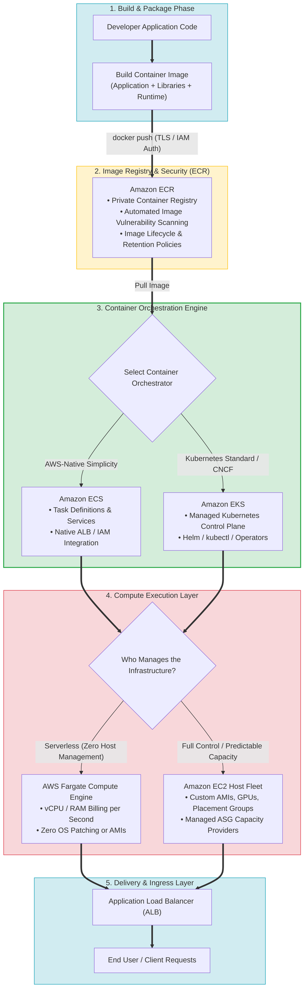
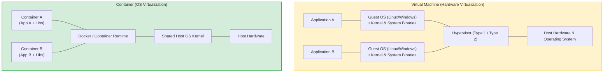
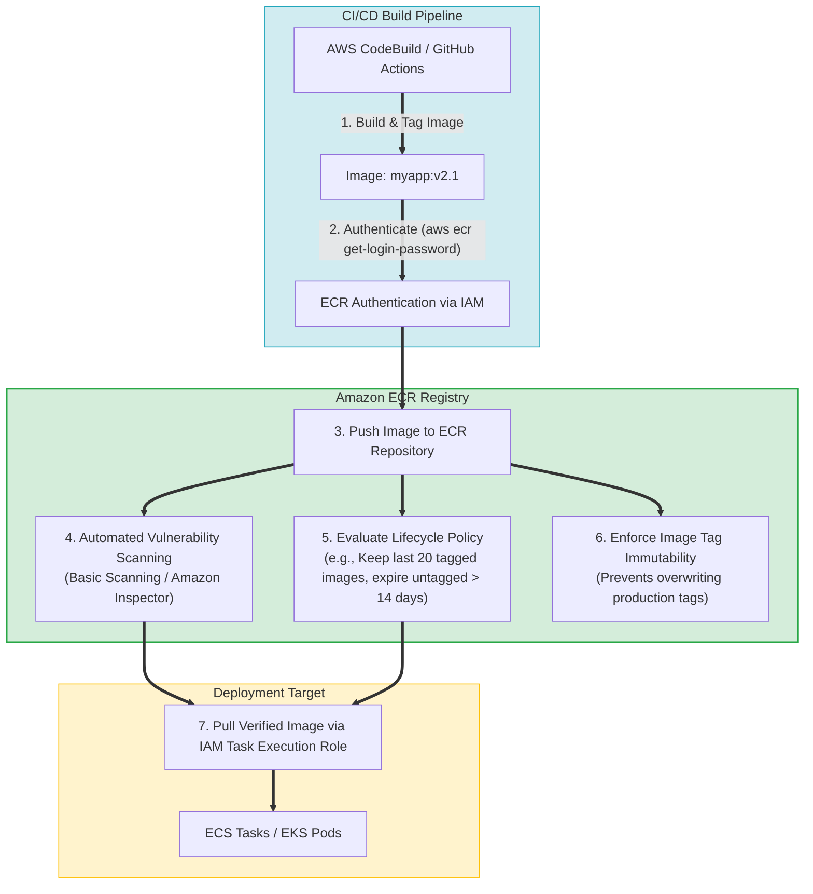
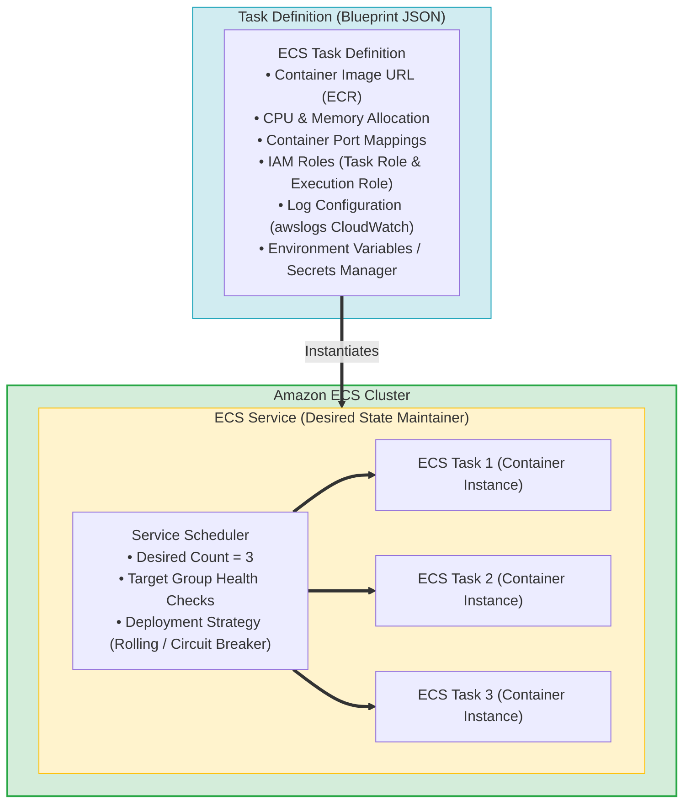
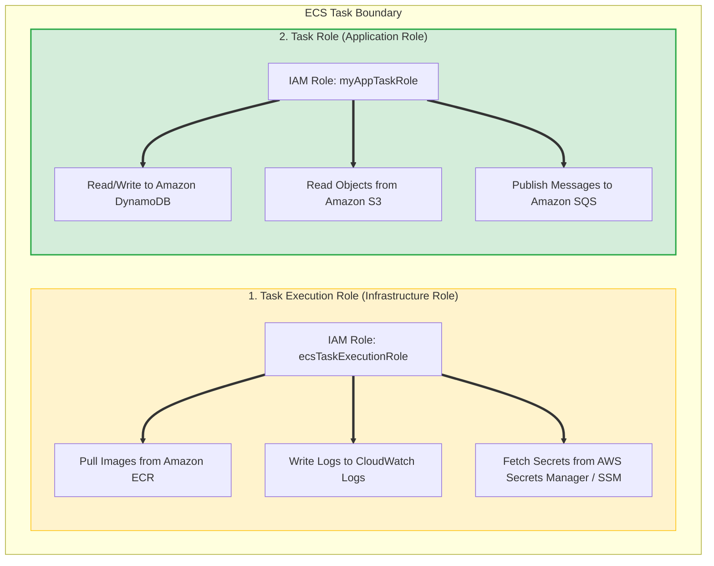
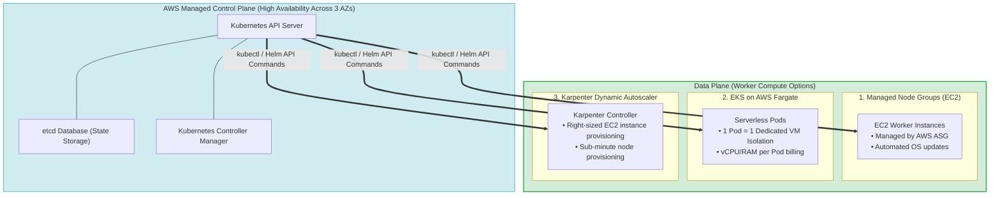
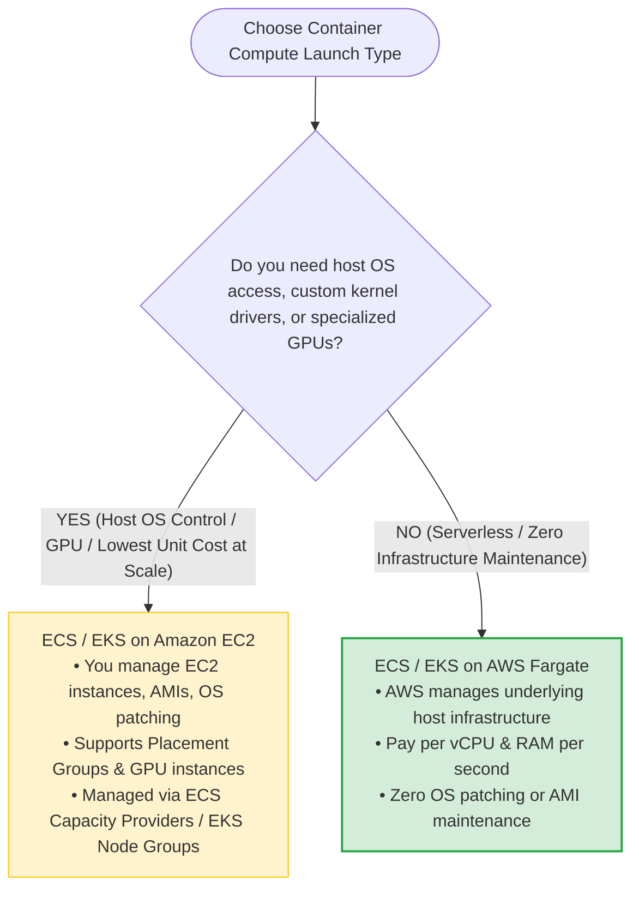
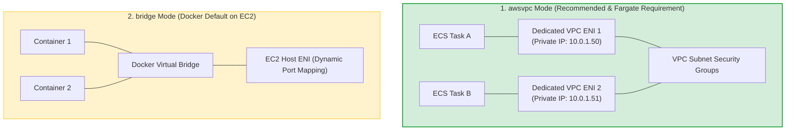
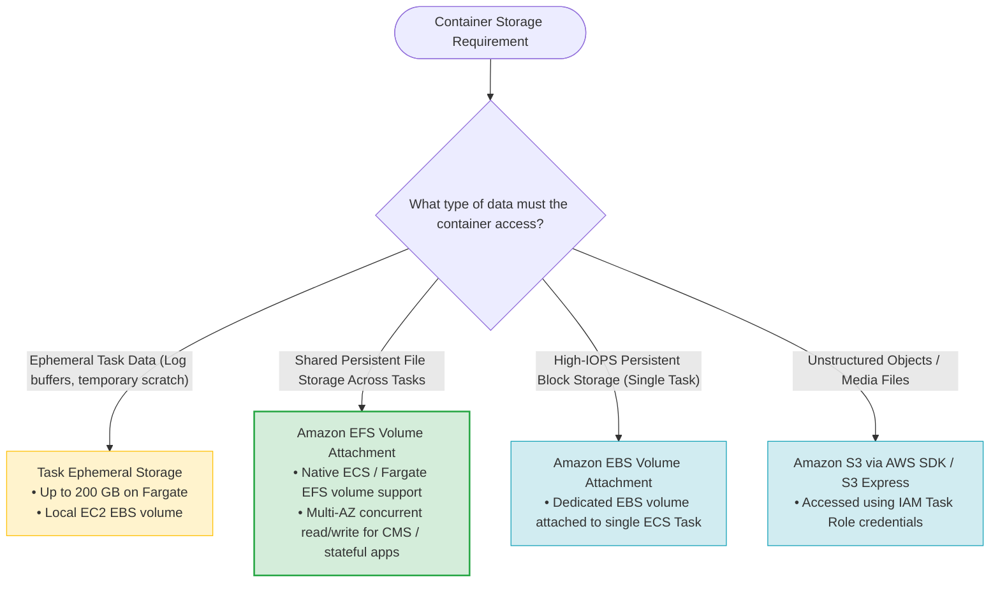
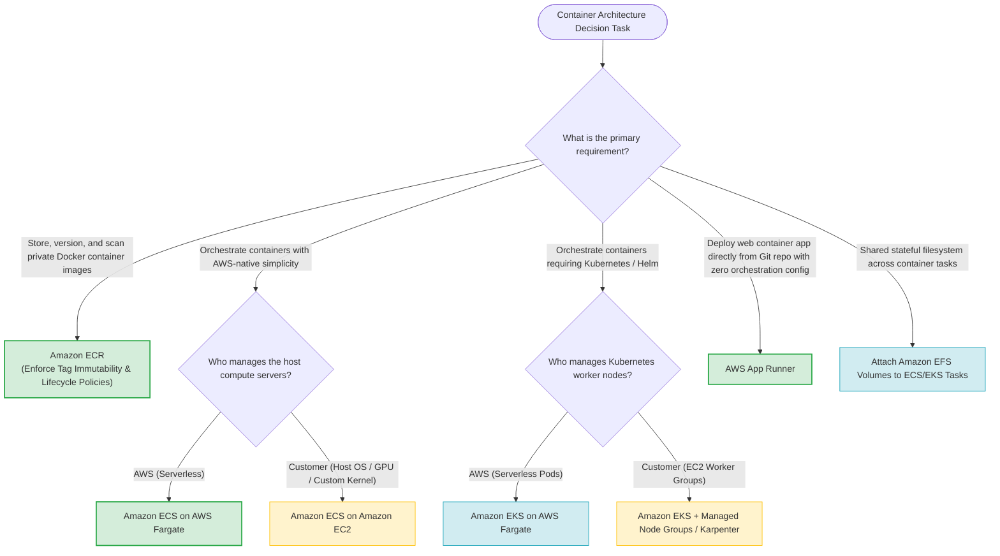

# Task 4.3: Determine the Optimal Compute and Application Strategy — Containers (Amazon ECS, Amazon EKS, AWS Fargate, Amazon ECR)

> [!NOTE]
> **Exam Mindset**: For the AWS Solutions Architect Professional (SAP-C02) and AI Practitioner (AIP-C01) exams, do not view ECS, EKS, Fargate, and ECR as four isolated services. They form a single integrated container execution engine:
> - **Amazon ECR (Image Storage)** = *"Where do I store, version, and scan private Docker container images securely?"*
> - **Amazon ECS (AWS-Native Orchestration)** = *"How do I orchestrate container tasks seamlessly using deep AWS service integrations with minimal operational complexity?"*
> - **Amazon EKS (Managed Kubernetes)** = *"How do I run standardized Kubernetes manifests, Helm charts, and custom operators on AWS?"*
> - **AWS Fargate (Serverless Compute)** = *"How do I run ECS/EKS container workloads without provisioning, patching, or scaling EC2 host servers?"*

---

## 1. End-to-End Container Architecture & Ecosystem Pipeline

---

## 2. Containers vs. Virtual Machines (VMs) Core Fundamentals

### 2.1 Virtual Machine vs. Container Architecture Comparison

### 2.2 Core Comparison Matrix: VMs vs. Containers

| Dimension | Virtual Machines (EC2) | Containers (ECS / EKS) |
| :--- | :--- | :--- |
| **Virtualization Layer** | Hardware level (Hypervisor / Guest OS) | OS level (Shared Host Kernel) |
| **Isolation Level** | Hard VM-level boundary (Separate OS per VM) | Process-level isolation (Namespaces & cgroups) |
| **Startup Time** | Minutes (Full OS boot cycle) | Seconds (Process instantiation) |
| **Resource Overhead** | High (Requires dedicated RAM/CPU for Guest OS) | Minimal (Shared kernel, lightweight image footprint) |
| **Portability** | Restricted by OS environment & dependencies | Universal ("Build once, run anywhere" container image) |
| **Primary Use Case** | Monoliths, legacy OS requirements, raw kernel control | Microservices, rapid scaling fleets, event batch tasks |

---

## 3. Amazon ECR (Elastic Container Registry) Deep Dive & Image Lifecycle

> [!IMPORTANT]
> **ECR Image Tag Immutability & Lifecycle Policies for SAP-C02**:
> - **Tag Immutability**: Enable Tag Immutability on production repositories to prevent malicious or accidental overwriting of existing tags (e.g., `myapp:latest` or `myapp:v1.0`).
> - **Lifecycle Policies**: Use ECR Lifecycle Policies to automatically purge old or untagged container images, eliminating uncontrolled storage cost accumulation.

---

## 4. Amazon ECS (Elastic Container Service) Architecture

### 4.1 ECS Component Hierarchy: Task Definition $\rightarrow$ Task $\rightarrow$ Service

---

### 4.2 ECS Task Execution Role vs. ECS Task Role (Critical Exam Distinctions)

| Role Type | Who Uses It? | Primary Purpose | Standard Granted Permissions |
| :--- | :--- | :--- | :--- |
| **Task Execution Role** (`executionRoleArn`) | The **ECS Container Agent** (Infrastructure) | Enables the container agent to launch the container task | `ecr:GetDownloadUrlForLayer`, `logs:CreateLogStream`, `secretsmanager:GetSecretValue` |
| **Task Role** (`taskRoleArn`) | The **Application Code** running inside the container | Grants the application permissions to call AWS APIs | `dynamodb:PutItem`, `s3:GetObject`, `sqs:SendMessage` |

---

## 5. Amazon EKS (Elastic Kubernetes Service) Architecture

> [!NOTE]
> **EKS Operational & Financial Realities for SAP-C02**:
> - **Control Plane Fee**: Amazon EKS charges a fixed control plane fee of **$0.10/hour (~$73/month)** per cluster.
> - **Operational Complexity**: EKS provides native Kubernetes API compatibility, but requires managing Kubernetes constructs (Pods, Deployments, CRDs, Helm charts, RBAC, Ingress Controllers). Select EKS when existing Kubernetes manifests or multi-cloud CNCF standardization is explicitly required.

---

## 6. AWS Fargate Serverless Compute Engine vs. EC2 Launch Type

### 6.1 ECS on EC2 vs. ECS on Fargate Feature Matrix

| Feature / Dimension | ECS on Amazon EC2 | ECS on AWS Fargate |
| :--- | :--- | :--- |
| **Server Management** | High (Customer manages EC2 instances, OS patching, AMIs) | **Zero** (AWS manages host infrastructure entirely) |
| **Pricing Model** | Pay for provisioned EC2 instance capacity (24/7 runtime) | Pay for exact **vCPU and Memory** consumed per second by tasks |
| **Networking Mode** | Supports `awsvpc`, `bridge`, `host`, `none` | Supports **`awsvpc` ONLY** (Task receives dedicated ENI) |
| **Host-Level Access / SSH**| Full root access to underlying EC2 host | **No access** to underlying host OS |
| **GPU / Specialized HW** | Supported (NVIDIA GPU, AWS Inferentia / Trainium) | Not supported |
| **AWS Outposts Support** | Fully Supported | **❌ NOT Supported on AWS Outposts** |
| **Daemon Services** | Supported (Runs 1 container task per EC2 instance) | Not supported |

---

## 7. Container Networking, Security & Storage Architectures

### 7.1 ECS Networking Modes (`awsvpc` vs. `bridge` vs. `host`)

---

### 7.2 Persistent Storage Options for Container Workloads

---

## 8. Real-World Exam Scenarios & Strategic Decision Patterns

### Scenario 1: AWS-Native Containerization with Zero Infrastructure Maintenance
- **Scenario**: A financial organization wants to migrate 40 microservices to Docker containers. The team has no Kubernetes experience, wants to eliminate server management, and requires full integration with Application Load Balancers and AWS IAM.
- **Solution**: Deploy containers to **Amazon ECS using the AWS Fargate launch type**.
- **Reasoning**:
  - Amazon ECS provides zero control-plane cost and seamless AWS integration (IAM, ALB, CloudWatch).
  - AWS Fargate removes all EC2 management, OS patching, and capacity planning.
  - *Exam Traps*: Do not select EKS when Kubernetes expertise is lacking and AWS-native operational simplicity is requested.

---

### Scenario 2: Existing Kubernetes Migration with Zero Control Plane Management
- **Scenario**: A company is migrating an enterprise workload already packaged with Helm charts and Kubernetes manifests from an on-premises vSphere cluster to AWS. The operations team insists on maintaining standard Kubernetes tooling while eliminating control plane management.
- **Solution**: Migrate the workload to **Amazon EKS with EKS Managed Node Groups (or Fargate)**.
- **Reasoning**:
  - Amazon EKS preserves existing Kubernetes manifests, kubectl scripts, and Helm charts without code rewrite.
  - AWS handles control plane availability, etcd backups, and master node patching.
  - *Exam Traps*: Re-architecting existing Kubernetes apps onto Amazon ECS causes unnecessary operational overhead and migration delays.

---

### Scenario 3: Container Microservices Requesting Database Credentials Privately
- **Scenario**: A containerized application running on ECS Fargate needs to query Amazon Aurora PostgreSQL securely. Database credentials must be rotated automatically and cannot be hardcoded in container images or environment text files.
- **Solution**: Store database credentials in **AWS Secrets Manager**, inject them into the ECS Task Definition via `secrets` parameter using the **Task Execution Role**, and grant the application's **Task Role** database access permissions.
- **Reasoning**:
  - `secrets` injection decrypts credentials at runtime without storing them in the image.
  - Secrets Manager supports automated credential rotation via Lambda functions.
  - *Exam Traps*: Hardcoding secrets or storing plain-text credentials in container environment variables violates security compliance.

---

### Scenario 4: High-Performance GPU AI/ML Model Training Containers
- **Scenario**: An AI startup runs intensive deep learning container training jobs requiring specialized NVIDIA GPUs and custom Linux kernel tuning. Cost optimization for heavy 24/7 compute is essential.
- **Solution**: Use **Amazon ECS (or EKS) with the Amazon EC2 Launch Type**, leveraging GPU-optimized instance families (`g5` / `p4`) and **ECS Capacity Providers with Auto Scaling Groups**.
- **Reasoning**:
  - AWS Fargate does not support GPU hardware or host kernel tuning.
  - EC2 launch type allows selecting GPU instances and applying Savings Plans / Reserved Instances for predictable baseline compute.
  - *Exam Traps*: Selecting AWS Fargate for GPU workloads is an invalid configuration.

---

## 9. SAP-C02 / AIP-C01 Master Container Architectural Decision Engine

---

## 10. Top Exam Traps & Anti-Patterns Checklist

> [!WARNING]
> **Critical Exam Traps for Container Services**:
> 1. **Amazon ECR is an Image Registry, NOT a Compute Runtime**: ECR stores, scans, and manages container images. It cannot execute container tasks.
> 2. **Confusing ECS Task Execution Role vs. Task Role**:
>    - **Task Execution Role**: Used by the ECS agent to pull images from ECR and write logs to CloudWatch.
>    - **Task Role**: Used by the application code inside the container to access AWS services (S3, DynamoDB, SQS).
> 3. **AWS Fargate is NOT Supported on AWS Outposts**: Outposts requires EC2 host capacity for running ECS or EKS tasks.
> 4. **Selecting EKS when Kubernetes is NOT Required**: If the user asks for simple, AWS-native container management without mentioning Kubernetes or Helm, select **Amazon ECS** to avoid unnecessary $0.10/hr control plane costs and operational complexity.
> 5. **AWS Fargate Does NOT Support GPUs or Host Privilege Mode**: For workloads requiring NVIDIA GPUs, custom Linux kernel parameters, or daemon instances, choose **ECS/EKS on EC2**.
> 6. **Using Hardcoded Credentials in Container Images**: Always fetch credentials dynamically from **AWS Secrets Manager** or **SSM Parameter Store** using the container's Task Role.
> 7. **Forgetting ECR Lifecycle Policies**: Without lifecycle policies, accumulating Docker image tags leads to continuously expanding storage costs. Always define policies to retain only the latest $N$ tags or expire untagged images.
