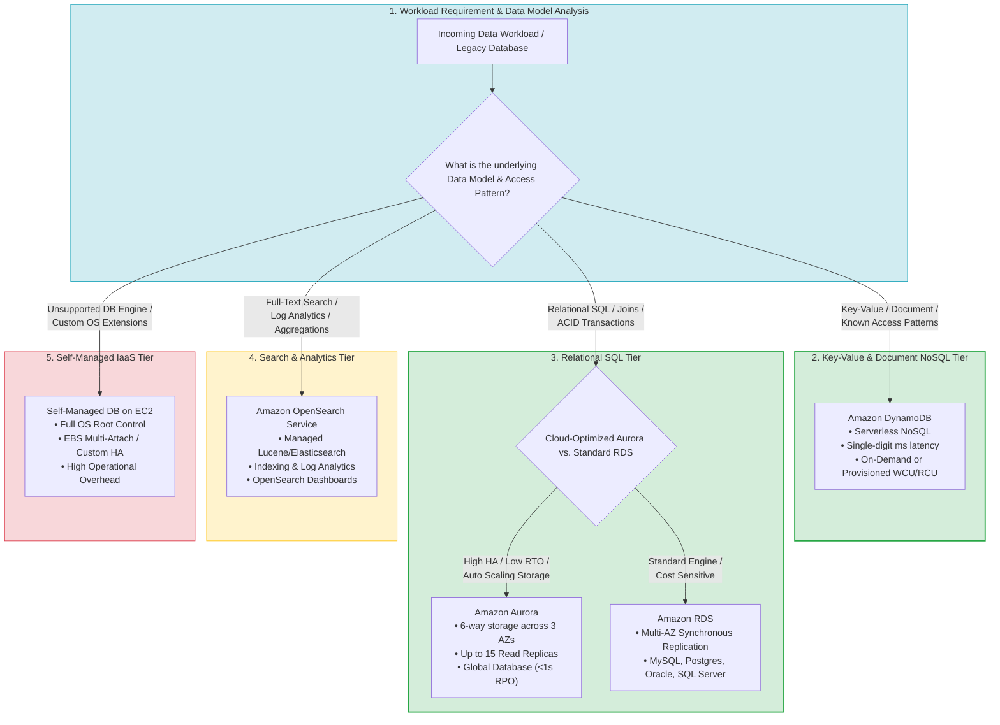
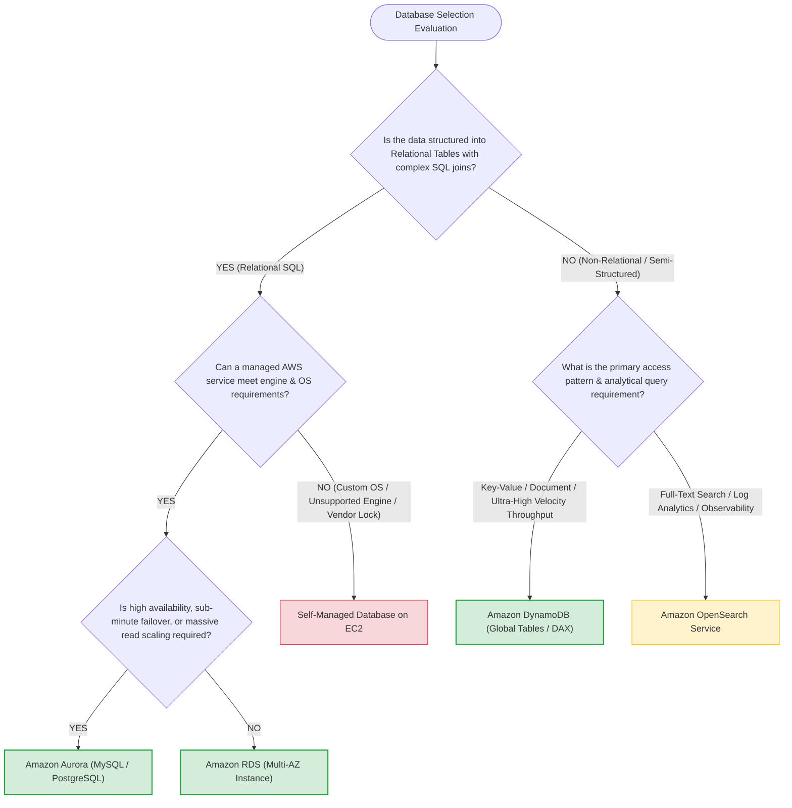
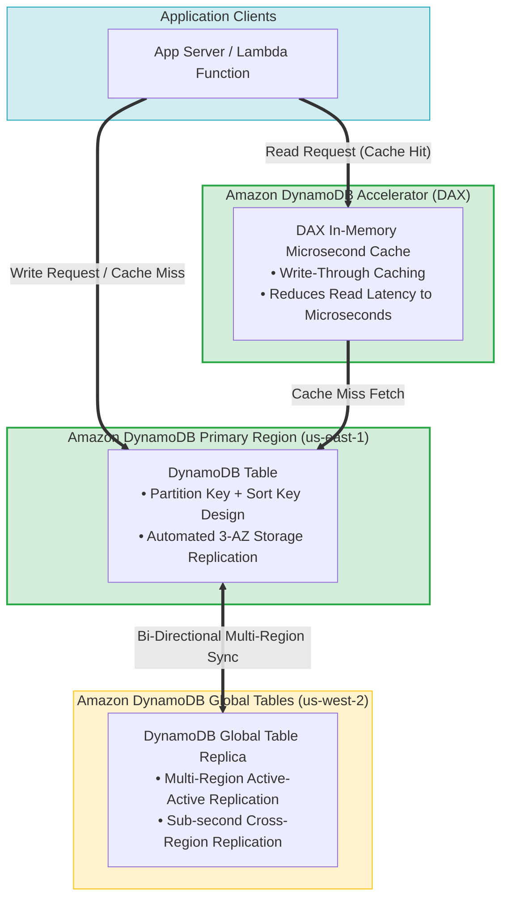
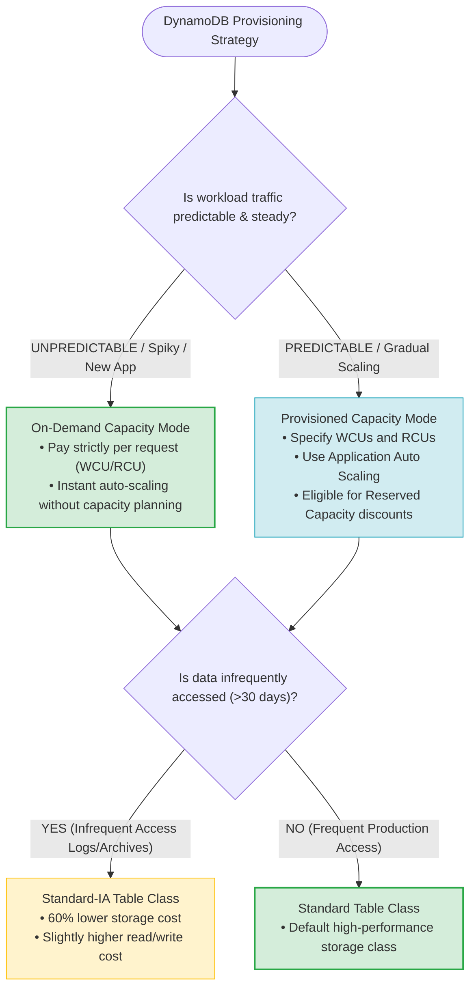
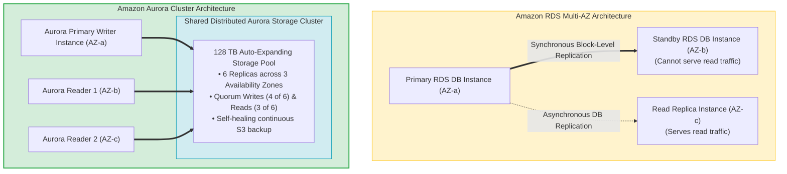
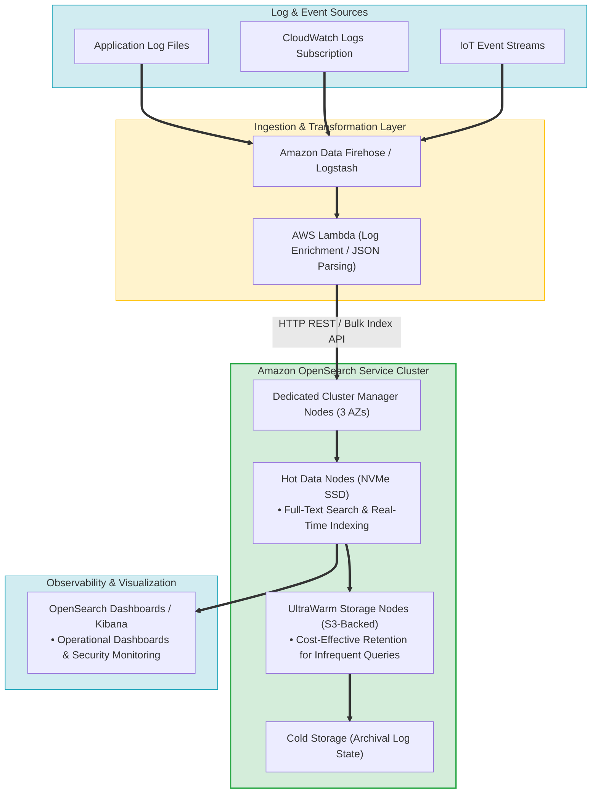
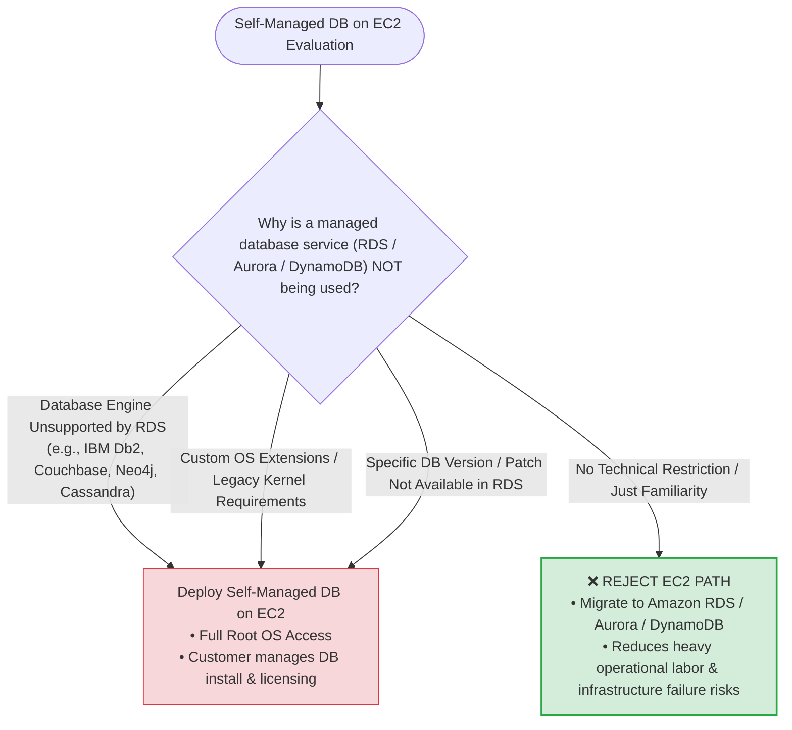
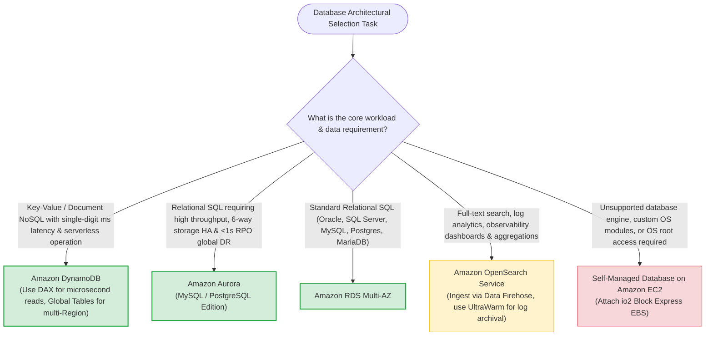

# Task 4.3: Determine the Optimal Compute and Application Strategy — Databases (Amazon DynamoDB, Amazon RDS, Amazon Aurora, Amazon OpenSearch Service, Self-Managed DBs on EC2)

> [!NOTE]
> **Exam Mindset**: For the AWS Solutions Architect Professional (SAP-C02) and AI Practitioner (AIP-C01) exams, do not memorize AWS database services as isolated products. Always evaluate database selection using the **Workload-First Decision Sequence**:
> **Data Model** $\rightarrow$ **Query Pattern** $\rightarrow$ **Consistency Requirements** $\rightarrow$ **Scaling Mechanics** $\rightarrow$ **Availability & RPO/RTO** $\rightarrow$ **Operational Overhead** $\rightarrow$ **Cost**.
> - **Amazon DynamoDB** = *"Serverless NoSQL key-value & document store for single-digit millisecond latency at any scale with zero server management."*
> - **Amazon RDS** = *"Managed relational SQL database (MySQL, PostgreSQL, MariaDB, Oracle, SQL Server) for traditional transactional workloads."*
> - **Amazon Aurora** = *"Cloud-optimized relational SQL database with decoupled storage, 6-way replication across 3 AZs, and sub-minute failover."*
> - **Amazon OpenSearch Service** = *"Distributed search and log analytics engine for full-text search, observability, and real-time aggregations."*
> - **Self-Managed DB on EC2** = *"Full OS/root access required for unsupported database engines, custom extensions, or specialized legacy configurations."*

---

## 1. End-to-End Database Selection & Migration Pipeline Architecture

---

## 2. Core Architectural Decision Framework (Data Model $\rightarrow$ Access Pattern $\rightarrow$ Scale)

---

## 3. Master AWS Database Services Comparison Matrix

| Service / Feature | Amazon DynamoDB | Amazon RDS | Amazon Aurora | Amazon OpenSearch Service | Self-Managed DB on EC2 |
| :--- | :--- | :--- | :--- | :--- | :--- |
| **Data Model** | NoSQL Key-Value & Document | Relational SQL (6 Engines) | Relational SQL (MySQL/PostgreSQL) | Document / Search Index | Any (NoSQL, SQL, Graph, Time-Series) |
| **Scaling Mechanism** | Auto-scaling WCU/RCU or On-Demand | Vertical instance scaling & Read Replicas | Auto-scaling storage (128TB) & 15 Replicas | Shard & Node Cluster Scaling | Manual EC2 Auto Scaling & EBS expansion |
| **Performance Latency**| Single-digit millisecond | Single to double-digit millisecond | Single-digit millisecond | Sub-second search & aggregations | Dependent on instance & EBS tuning |
| **High Availability** | Built-in Multi-AZ (Global Tables for multi-Region) | Multi-AZ Standby Instance (Synchronous) | 6-way storage across 3 AZs (Auto-failover <30s) | Multi-AZ (Dedicated Master & Data Nodes) | Manual Setup (Pacemaker, Data Guard, AlwaysOn) |
| **Backup & Recovery** | Point-in-time recovery (PITR) & On-Demand | Automated Snapshots & Transaction Logs | Continuous automated backup to S3 (Zero impact) | Automated Hourly Snapshots to S3 | Manual Scripts / EBS Snapshots / AWS Backup |
| **Operational Overhead**| Minimal (Serverless) | Low (AWS manages OS, DB patching, HA) | Low (AWS manages storage, HA, scaling) | Moderate (Cluster, shard & index management) | **High** (OS, DB patching, backups, HA setup) |
| **Primary Exam Traps** | Not for complex multi-table SQL joins | Scaling write IOPS requires vertical instance upgrades | Higher base cost for small non-prod workloads | Not an ACID transactional DB replacement | Avoid unless specific OS/engine rules force it |

---

## 4. Amazon DynamoDB Deep Dive

### 4.1 DynamoDB Architecture, Global Tables & DAX Accelerator Topology

### 4.2 DynamoDB Capacity Modes & Table Classes Matrix

> [!IMPORTANT]
> **DynamoDB Key Concepts for Exam Questions**:
> - **Partition Key Design**: High-cardinality partition keys prevent "hot partitions" (uneven IOPS throttling).
> - **DynamoDB Streams**: Captures item-level modification logs (Create, Update, Delete) and triggers AWS Lambda for asynchronous event processing.
> - **DAX (DynamoDB Accelerator)**: In-memory cache dedicated to DynamoDB that delivers **microsecond read latency** for read-heavy workloads without application code rewrites.

---

## 5. Amazon RDS vs. Amazon Aurora Architectural Comparison

### 5.1 Storage & High Availability Topology Comparison

### 5.2 Amazon RDS vs. Amazon Aurora Deep-Dive Comparison Matrix

| Architectural Feature | Amazon RDS (Multi-AZ) | Amazon Aurora |
| :--- | :--- | :--- |
| **Supported Engines** | MySQL, PostgreSQL, MariaDB, Oracle, SQL Server | MySQL-compatible, PostgreSQL-compatible |
| **Storage Architecture** | Dedicated EBS volumes bound to DB instance | Decoupled 128TB auto-expanding distributed storage cluster |
| **Data Durability / HA** | 2 copies across 2 AZs (Primary + Standby) | **6 copies across 3 AZs** (Tolerates loss of 2 copies without write interruption) |
| **Failover Downtime** | 60–120 seconds (DNS CNAME record swap) | **< 30 seconds** (Promotes Reader to Writer seamlessly) |
| **Read Replicas** | Up to 5 (Incurs replication lag & storage duplication) | **Up to 15** (Shared storage pool $\rightarrow$ zero storage duplication & near-zero lag) |
| **Cross-Region DR** | Cross-Region Read Replicas (Minutes RPO) | **Aurora Global Database** (Dedicated physical network transport $\rightarrow$ **< 1 second RPO**) |
| **Serverless Option** | RDS Custom / Provisioned instance sizing | **Aurora Serverless v2** (Instant scaling in fine-grained ACUs) |

---

## 6. Amazon OpenSearch Service Architecture & Log Analytics Pipeline

> [!NOTE]
> **OpenSearch Service Core Exam Purpose**:
> Amazon OpenSearch Service is **NOT an ACID relational database replacement**. It is designed specifically for **full-text search**, semi-structured log indexing, pattern analytics, and observability visualization. Pair OpenSearch with a primary database (e.g., DynamoDB or RDS) to serve as a high-speed search index alongside the primary store of truth.

---

## 7. Self-Managed Databases on Amazon EC2 (IaaS Hosting)

### 7.1 Operational Responsibility Matrix: Self-Managed EC2 vs. Managed AWS Database

| Responsibility / Task | Self-Managed DB on EC2 | Amazon RDS / Aurora | Amazon DynamoDB |
| :--- | :--- | :--- | :--- |
| **OS Installation & Security Patching** | 🔴 **Customer** | 🟢 **AWS** | 🟢 **AWS** |
| **Database Installation & Engine Upgrades** | 🔴 **Customer** | 🟢 **AWS** (Automated minor version upgrades) | 🟢 **AWS** |
| **High Availability & Failover Setup** | 🔴 **Customer** (Configure Pacemaker/Data Guard) | 🟢 **AWS** (Multi-AZ synchronous failover) | 🟢 **AWS** (Built-in Multi-AZ) |
| **Automated Backups & Point-in-Time Recovery**| 🔴 **Customer** (Custom scripts / AWS Backup) | 🟢 **AWS** (Continuous automated S3 backups) | 🟢 **AWS** (PITR & On-demand snapshots) |
| **Storage & IOPS Auto Scaling** | 🔴 **Customer** (Manual EBS volume management) | 🟢 **AWS** (Storage Auto Scaling / Aurora 128TB) | 🟢 **AWS** (Serverless On-Demand) |
| **Database Schema & Query Optimization** | 🔴 **Customer** | 🔴 **Customer** | 🔴 **Customer** |

---

## 8. Real-World Exam Scenarios & Strategic Solution Patterns

### Scenario 1: Global High-Throughput E-Commerce Application requiring <1s RPO DR
- **Scenario**: An enterprise e-commerce platform processes millions of daily orders using a PostgreSQL relational database. The solution must support multi-region disaster recovery with a **Recovery Point Objective (RPO) of less than 1 second** and automatic failover in the primary region in under 30 seconds.
- **Solution**: Deploy **Amazon Aurora PostgreSQL Edition with Aurora Global Database** across two AWS Regions, configuring Aurora Replicas in the secondary region.
- **Reasoning**:
  - Aurora Global Database uses dedicated storage replication nodes at the physical network layer, achieving cross-region latency of **<1 second**.
  - Aurora's 6-way distributed storage across 3 AZs handles primary region failover in **<30 seconds**.
  - *Exam Traps*: Standard RDS Cross-Region Read Replicas rely on logical database replication, incurring higher replication lag and longer RPO.

---

### Scenario 2: Unpredictable Flash-Sale Web Service with Single-Digit Millisecond Latency
- **Scenario**: A gaming company launches a viral mobile game with unpredictable user traffic surges (0 to 500,000 requests per second). The data store must deliver single-digit millisecond read/write latency, require zero database server scaling management, and charge only for actual request volume.
- **Solution**: Use **Amazon DynamoDB configured in On-Demand Capacity Mode**.
- **Reasoning**:
  - DynamoDB On-Demand instantly accommodates spiky, unpredictable traffic without capacity planning or scaling delays.
  - Delivers consistent single-digit millisecond latency regardless of scale.
  - *Exam Traps*: Avoid Provisioned Capacity mode for highly unpredictable spike patterns, as provisioned auto-scaling cannot react instantly to zero-second flash traffic spikes.

---

### Scenario 3: Real-Time Log Search & Threat Observability Indexing
- **Scenario**: A cybersecurity team needs to index 5 TB of daily JSON application logs from EC2 instance fleets, run full-text keyword searches, and build security dashboards showing threat anomalies in real time.
- **Solution**: Ingest logs using **Amazon Data Firehose** into an **Amazon OpenSearch Service** cluster with **UltraWarm storage nodes**, visualizing threat metrics on **OpenSearch Dashboards**.
- **Reasoning**:
  - OpenSearch Service is purpose-built for full-text search indexing and semi-structured log analytics.
  - UltraWarm storage leverages Amazon S3 to store historical log data at a 90% cost reduction while remaining queryable.
  - *Exam Traps*: Do not store full-text log indices in Amazon RDS or DynamoDB, as they lack native full-text indexing engines and dashboard capabilities.

---

### Scenario 4: Legacy Enterprise Application Requiring Unsupported Custom DB Plugins
- **Scenario**: An enterprise application requires an Oracle Database with custom third-party OS kernel extensions and root privileges on the operating system. Managed database services like Amazon RDS Oracle cannot support these OS-level modifications.
- **Solution**: Deploy the database on **Amazon EC2 instances using EBS Provisioned IOPS (io2 Block Express) volumes**, configuring Multi-AZ high availability using Oracle Data Guard.
- **Reasoning**:
  - Amazon RDS provides a managed database environment where OS root access is blocked.
  - When specific custom OS extensions or unsupported database configurations are required, hosting on EC2 is the valid architectural pattern.
  - *Exam Traps*: Never select RDS when a scenario explicitly states that root OS access or unsupported custom OS kernel modules are mandatory.

---

## 9. SAP-C02 / AIP-C01 Master Database Architectural Decision Engine

---

## 10. Top Exam Traps & Anti-Patterns Checklist

> [!WARNING]
> **Critical Exam Traps for Database Services**:
> 1. **Do NOT select Amazon RDS when OS Root Access is Required**: Amazon RDS is a managed service that blocks shell access and OS root credentials. If root access or custom OS kernel modules are required, select **Self-Managed DB on Amazon EC2** or **RDS Custom**.
> 2. **Amazon OpenSearch Service is NOT an ACID Database Replacement**: OpenSearch is designed for search indexing and analytics. Do not use it as the primary transactional store of record for financial accounts.
> 3. **Avoid Relational SQL Joins on Amazon DynamoDB**: DynamoDB is a NoSQL database. If an application requires complex dynamic multi-table SQL joins and ad-hoc queries, choose **Amazon RDS / Aurora**.
> 4. **Multi-AZ RDS Standby Instances Cannot Serve Read Traffic**: In a standard Amazon RDS Multi-AZ deployment, the secondary standby instance is strictly a failover target and cannot accept read queries. To scale read traffic, deploy **RDS Read Replicas** or switch to **Amazon Aurora**.
> 5. **DynamoDB Hot Partitions**: Designing partition keys with low cardinality (e.g., `Gender` or `Status`) causes uneven traffic distribution and throttling. Always select high-cardinality partition keys (e.g., `UUID` or `Device_ID`).
> 6. **Aurora Global Database vs. RDS Read Replicas for Low RPO**: Standard RDS Cross-Region Read Replicas use logical replication with higher replication lag. For sub-second cross-region RPO, select **Aurora Global Database**.
> 7. **Managed Service First Rule**: On the SAP-C02 exam, always prefer AWS managed database services (RDS, Aurora, DynamoDB) over self-managed EC2 databases unless an explicit technical constraint (e.g., unsupported engine or root OS requirement) renders managed services impossible.
