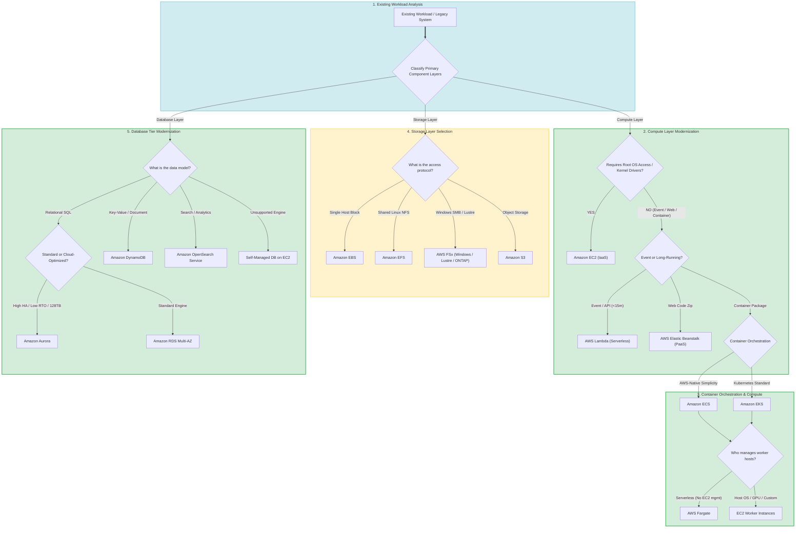
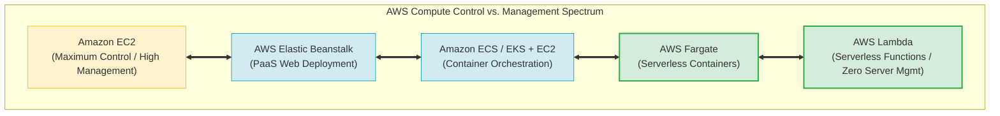
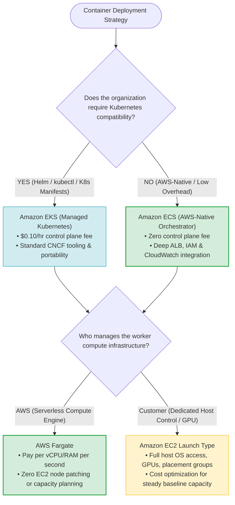
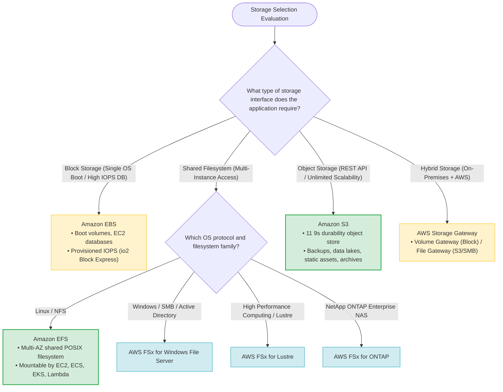
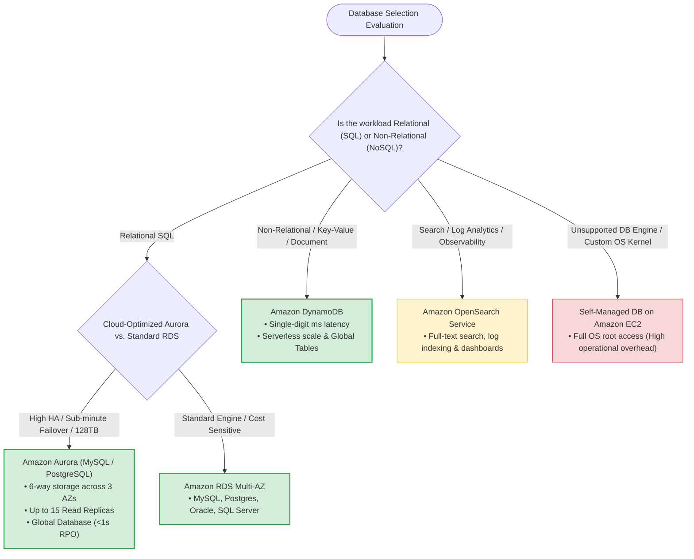
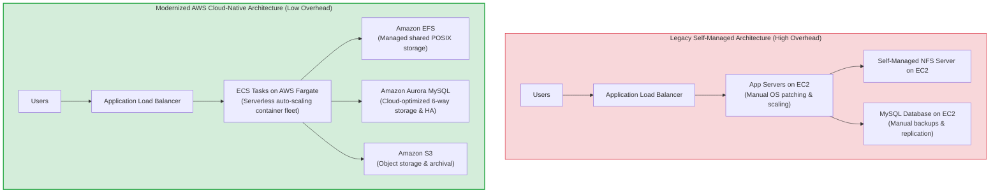
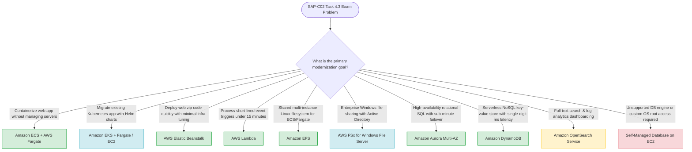

# Task 4.3: Determine the Optimal Compute and Application Strategy — Architectural Synthesis & Skills Guide

> [!NOTE]
> **Exam Mindset**: For the AWS Solutions Architect Professional (SAP-C02) and AI Practitioner (AIP-C01) exams, Task 4.3 tests your ability to evaluate an existing legacy or cloud-hosted workload and determine the optimal target architecture across four connected pillars:
> **Compute Engine** $\rightarrow$ **Container Orchestration** $\rightarrow$ **Storage Architecture** $\rightarrow$ **Database Tier**.
> Always follow the **Workload-First Decision Sequence**:
> **Workload Characteristics** $\rightarrow$ **Technical Constraints** $\rightarrow$ **Architecture Requirements** $\rightarrow$ **AWS Managed Service** $\rightarrow$ **Total Cost of Ownership (TCO)**.

---

## 1. End-to-End Workload Modernization Synthesis Pipeline

---

## 2. Compute Selection Framework & Control Spectrum

### 2.1 Complete Compute Platform Selection Matrix

| Requirement / Characteristic | Amazon EC2 | AWS Lambda | Amazon ECS / EKS + Fargate | AWS Elastic Beanstalk | Amazon Lightsail |
| :--- | :--- | :--- | :--- | :--- | :--- |
| **Abstraction Level** | IaaS (Virtual Machine) | FaaS (Serverless Function) | CaaS (Serverless Container) | PaaS (Managed App Platform) | Simple VPS |
| **Operational Overhead** | **High** (OS, patching, AMIs, ASG) | **Minimal** (Code & IAM only) | **Low** (Zero host management) | **Low** (Managed ASG/ALB stack) | Very Low |
| **Execution Limit** | Unlimited | **15 minutes max** | Unlimited | Unlimited | Unlimited |
| **Primary Fit** | Custom OS, root access, legacy apps | Event processing, S3/SQS triggers, REST APIs | Microservices, containerized fleets | Rapid web app rollouts (Node, Java, Python) | Simple dev/test, small monolithic blogs |
| **Key Exam Keywords** | *"OS root access", "custom kernel", "legacy lift-and-shift"* | *"event-driven", "short-lived", "pay per invocation"* | *"serverless containers", "no worker node management"* | *"deploy app quickly without managing infra"* | *"simple VPS", "low-cost basic website"* |

---

## 3. Container Orchestration & Execution Decision Framework

> [!IMPORTANT]
> **Fargate is a Compute Engine, NOT an Orchestrator**:
> Remember for SAP-C02: **Amazon ECS** and **Amazon EKS** are container *orchestrators* (handling task scheduling and desired state). **AWS Fargate** is a *compute engine* used by ECS or EKS to run containers without managing EC2 worker nodes.

---

## 4. Storage Selection Decision Architecture

### 4.1 Master Storage Services Comparison Matrix

| Storage Service | Protocol / Format | Primary Use Case | Multi-Instance Access |
| :--- | :--- | :--- | :--- |
| **Amazon EBS** | Block Storage | OS Boot volumes, databases on EC2 | Single instance (except Multi-Attach io1/io2) |
| **Amazon EFS** | Network File System (NFSv4) | Shared Linux web content, container data | Thousands of concurrent EC2/ECS/Fargate/Lambda instances |
| **AWS FSx for Windows** | Server Message Block (SMB) | Windows enterprise apps, Active Directory | Multi-instance Windows fleets |
| **AWS FSx for Lustre** | High Performance POSIX | HPC, machine learning, fast S3 ingestion | High-throughput compute clusters |
| **AWS FSx for ONTAP** | NetApp ONTAP (NFS/SMB/iSCSI) | Enterprise NAS migration, block & file | Enterprise multi-protocol shared storage |
| **Amazon S3** | REST API (HTTP GET/PUT) | Unstructured objects, media, backups, data lakes | Unlimited concurrent HTTP client access |
| **AWS Storage Gateway** | Hybrid Block/File/Tape | On-premises cache to S3 or EBS | Hybrid local infrastructure |

---

## 5. Database Tier Modernization Decision Tree

### 5.1 Master Database Services Comparison Matrix

| Database Service | Data Model | Scaling Model | Operational Overhead |
| :--- | :--- | :--- | :--- |
| **Amazon RDS** | Relational SQL (6 engines) | Instance sizing & Read Replicas | Low (AWS manages OS, DB patching, HA) |
| **Amazon Aurora** | Relational SQL (MySQL/PostgreSQL) | Auto-scaling storage (128TB) & 15 Replicas | Low (AWS manages storage, HA, scaling) |
| **Amazon DynamoDB** | NoSQL Key-Value & Document | Auto-scaling WCU/RCU or On-Demand | Minimal (Serverless) |
| **Amazon OpenSearch**| Document / Search Index | Shard & Node Cluster Scaling | Moderate (Cluster, shard & index management) |
| **Self-Managed EC2 DB**| Custom / Any | Manual EC2 Auto Scaling & EBS expansion | **High** (OS, DB patching, backups, HA setup) |

---

## 6. Legacy Workload Modernization Patterns (Before vs. After)

---

## 7. Master SAP-C02 Task 4.3 Architectural Decision Engine

---

## 8. Total Cost of Ownership (TCO) & Architectural Trade-off Analysis

> [!TIP]
> **Total Cost Thinking for SAP-C02**:
> The SAP-C02 exam evaluates **Total Cost of Ownership (TCO)**, which includes operational labor, maintenance overhead, and risk, rather than raw hourly EC2 pricing alone:
> $$\text{Total Architectural Cost} = \text{Direct AWS Service Charges} + \text{Operational Administration Labor} + \text{Downtime / Risk Exposure}$$
> 
> - **Self-Managed EC2 Architecture**: Low direct instance cost + **High operational labor** (patching, backups, HA configuration, manual scaling).
> - **Managed AWS Architecture (Fargate + Aurora + S3)**: Higher direct service cost + **Zero operational labor** (automated scaling, managed patching, 6-way storage durability).

---

## 9. Key Exam Signals & Elimination Technique

### The "Why Not the Other Service?" Elimination Guide

| Proposed Choice | Why NOT the Alternative? |
| :--- | :--- |
| **Choose DynamoDB over RDS** | Workload requires massive key-value scale and predictable single-digit ms latency without complex relational SQL joins. |
| **Choose RDS / Aurora over DynamoDB** | Application requires relational schemas, ACID transactions, complex multi-table SQL joins, or existing SQL compatibility. |
| **Choose ECS over EKS** | Containerization is required on AWS, but the team has no Kubernetes requirement or expertise and seeks minimal operational complexity. |
| **Choose EKS over ECS** | Workload relies on existing Kubernetes manifests, Helm charts, Kubernetes operators, or multi-cloud CNCF portability. |
| **Choose Fargate over EC2 Launch Type** | Primary goal is eliminating worker node patching, host OS maintenance, and capacity planning. |
| **Choose EFS over S3** | Application requires a standard mounted POSIX filesystem interface with multi-instance concurrent file locking. |
| **Choose S3 over EFS** | Application stores unstructured objects, media, or backups accessible via HTTP REST API calls at lower cost. |
| **Choose Managed RDS over EC2 Database** | Application runs standard database engines (MySQL, PostgreSQL, Oracle) without requiring root OS access or unsupported custom extensions. |

---

## 10. Top Exam Traps & Anti-Patterns Checklist

> [!WARNING]
> **Critical Exam Traps for Task 4.3 Architecture Synthesis**:
> 1. **Fargate is NOT an Orchestrator**: Do not select Fargate as a standalone orchestrator. It is a compute engine managed by **Amazon ECS** or **Amazon EKS**.
> 2. **Selecting EKS Without a Kubernetes Requirement**: Choosing EKS when simple container deployment is requested incurs unnecessary control-plane fees ($0.10/hr) and operational complexity. Default to **Amazon ECS + Fargate**.
> 3. **AWS Lambda Execution Limit (15 Mins)**: Never choose Lambda for long-running batch jobs, continuous streaming servers, or tasks exceeding 15 minutes. Use **AWS Batch** or **ECS/Fargate**.
> 4. **Managed Service First Rule**: Always prefer managed AWS services (RDS, Aurora, DynamoDB, ECS, EFS) over self-managed EC2 equivalents unless an explicit technical constraint (e.g., custom kernel drivers, unsupported DB engine) mandates EC2.
> 5. **Confusing File vs. Object Storage**: Mounting S3 as a filesystem is an anti-pattern. If a mounted filesystem is required, choose **Amazon EFS** (Linux/NFS) or **AWS FSx** (Windows/SMB).
