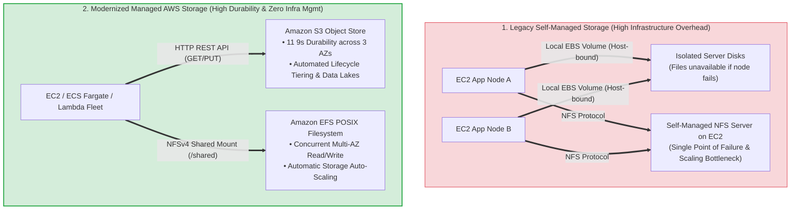
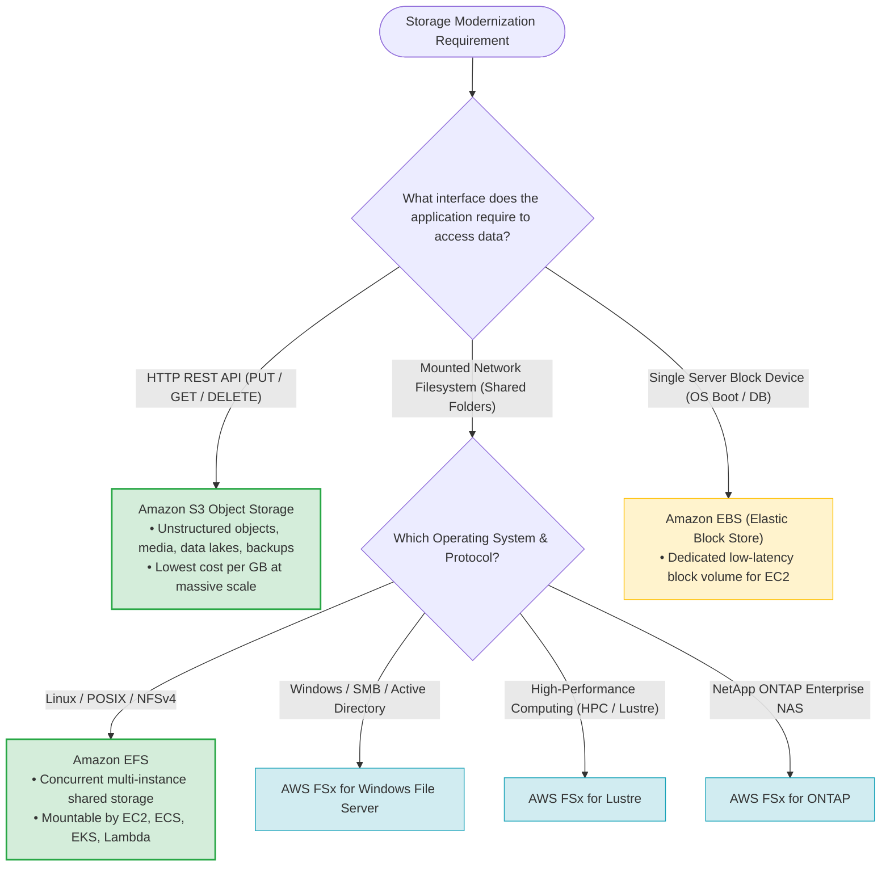
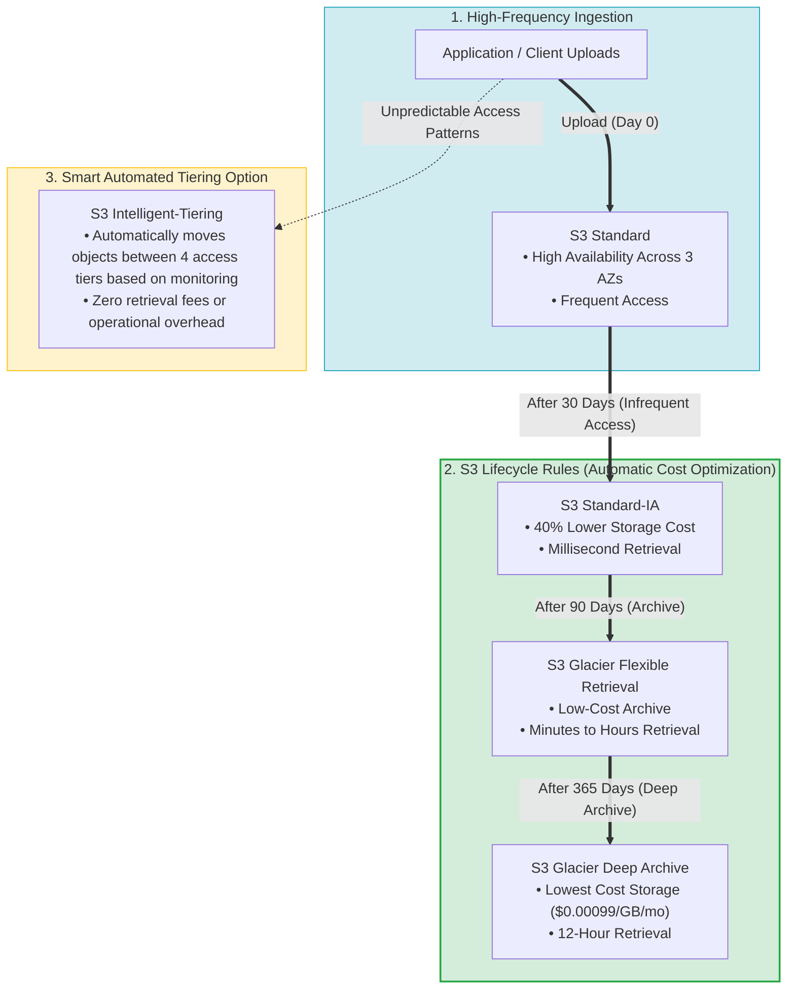
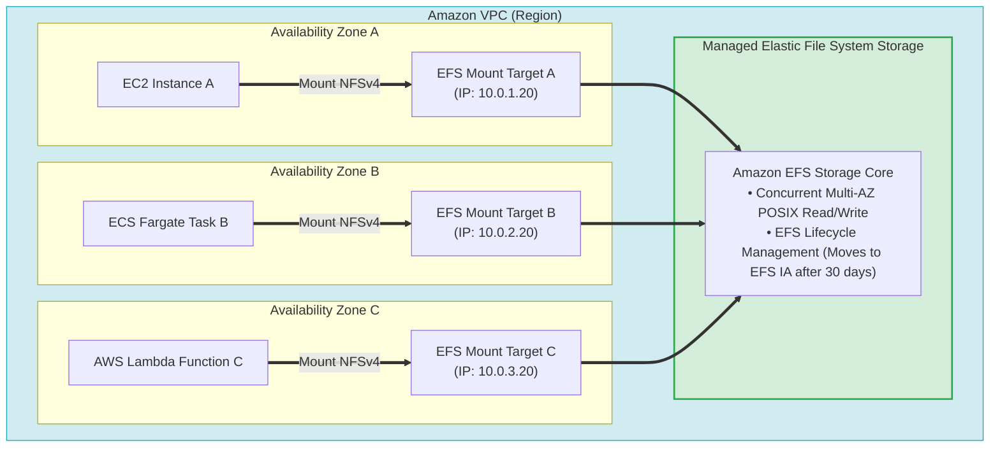
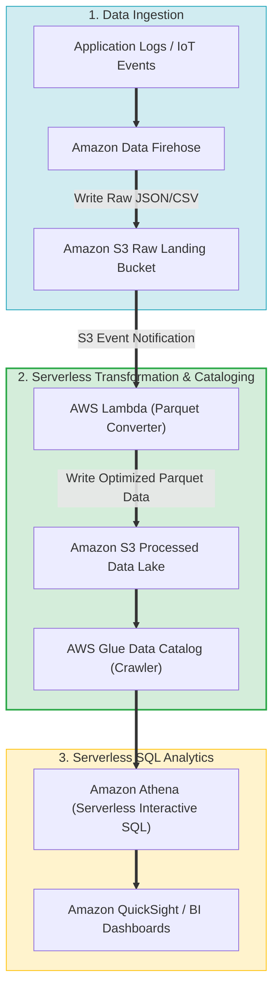
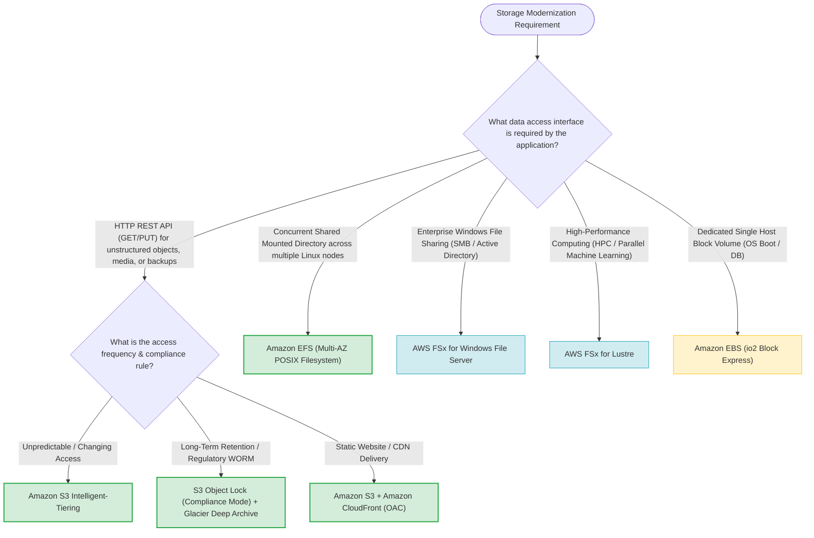

# Task 4.4: Determine Opportunities for Modernization and Enhancements — AWS Storage Services (Amazon S3, Amazon EFS)

> [!NOTE]
> **Exam Mindset**: For the AWS Solutions Architect Professional (SAP-C02) and AI Practitioner (AIP-C01) exams, storage modernization evaluates replacing self-managed file servers and unscalable server-bound disks with cloud-native managed storage abstractions:
> - **Storage Access Interface Rule**:
>   - **Amazon S3 (Object Storage)** = *"HTTP REST API (GET/PUT), 11 9s durability, unlimited scalability for unstructured media, backups, data lakes, and static assets."*
>   - **Amazon EFS (Shared POSIX Filesystem)** = *"NFSv4 protocol, concurrent multi-instance read/write file access across Availability Zones for Linux EC2, ECS, EKS, and Lambda."*
>   - **AWS FSx (Specialized Filesystems)** = *"Windows SMB / Active Directory (FSx for Windows), High Performance Computing (FSx for Lustre), or NetApp ONTAP NAS."*

---

## 1. End-to-End Legacy Storage Modernization Architecture

---

## 2. Storage Protocol & Access Interface Decision Tree

---

## 3. Master AWS Storage Services Comparison Matrix

| Storage Service | Protocol / Access Interface | Multi-Instance Concurrency | Scaling Mechanism | Primary Exam Modernization Trigger |
| :--- | :--- | :--- | :--- | :--- |
| **Amazon S3** | REST API (HTTP GET/PUT) | Unlimited concurrent web HTTP clients | Unlimited automatic capacity | *"Massive unstructured media, data lake, static assets, zero storage server management"* |
| **Amazon EFS** | Network File System (NFSv4) | Thousands of EC2, ECS, EKS, Lambda instances | Automatic elastic scaling (Petabytes) | *"Shared Linux directory across multiple servers/containers, POSIX compliance"* |
| **Amazon EBS** | Block Storage (iSCSI equivalent) | Single EC2 instance (except Multi-Attach io1/io2) | Provisioned GB capacity & IOPS | *"High-performance database storage, EC2 OS boot volume"* |
| **AWS FSx for Windows**| Server Message Block (SMB) | Multi-instance Windows fleets | Provisioned capacity & throughput | *"Enterprise Windows file shares, Active Directory integration, SMB protocol"* |
| **AWS FSx for Lustre** | High-Performance POSIX | Thousands of HPC compute instances | High-throughput parallel storage | *"Fast S3 data processing, ML training, high-performance computing (HPC)"* |

---

## 4. Amazon S3 Lifecycle Management & Archival Topology

### 4.1 Amazon S3 Storage Classes Summary

| Storage Class | Access Pattern | Minimum Storage Duration | Retrieval Time | Relative Cost / GB |
| :--- | :--- | :--- | :--- | :--- |
| **S3 Standard** | Frequent access | None | Instant (Milliseconds) | Baseline (Highest) |
| **S3 Intelligent-Tiering** | Unpredictable / changing access | None | Instant (Milliseconds) | Auto-optimizing (Small monitoring fee) |
| **S3 Standard-IA** | Infrequent access (>30 days) | 30 days | Instant (Milliseconds) | ~40% lower than Standard |
| **S3 One Zone-IA** | Non-critical infrequent access | 30 days | Instant (Single AZ durability) | ~20% lower than Standard-IA |
| **S3 Glacier Instant** | Rare access (Quarterly) | 90 days | Instant (Milliseconds) | ~68% lower than Standard |
| **S3 Glacier Flexible** | Archival data | 90 days | Minutes to 12 hours | ~80% lower than Standard |
| **S3 Glacier Deep Archive** | Long-term archival (7–10 years) | 180 days | 12 to 48 hours | **Lowest cost ($0.00099/GB/mo)** |

---

## 5. Amazon EFS Architecture & Multi-Instance Sharing Topology

> [!IMPORTANT]
> **Amazon EFS Key Features for Exam Questions**:
> - **Multi-AZ Durability**: EFS automatically replicates file metadata and content across 3 Availability Zones.
> - **Concurrent Access**: Supports thousands of concurrent NFS connections across EC2 instances, ECS/EKS container tasks, and serverless AWS Lambda functions.
> - **EFS Lifecycle Management**: Automatically moves files to **EFS Infrequent Access (IA)** or **EFS Archive** tiers after 1 to 90 days of inactivity, dropping storage costs by up to 92%.

---

## 6. Serverless Data Lake Processing Pipeline (S3 + Lambda + Athena)

---

## 7. Real-World Exam Scenarios & Strategic Solution Patterns

### Scenario 1: Replacing Self-Managed EC2 NFS File Servers for Linux Container Fleets
- **Scenario**: A software enterprise runs an auto-scaled fleet of Linux EC2 instances serving user profile images stored on a centralized self-managed NFS server running on a single EC2 instance. The NFS server creates a single point of failure and causes performance bottlenecks during peak traffic.
- **Solution**: Replace the self-managed NFS server with **Amazon EFS**, creating Mount Targets in each VPC subnet and configuring instances to mount the EFS filesystem via NFSv4.
- **Reasoning**:
  - Eliminates the single point of failure by providing multi-AZ storage replication.
  - Automatically scales capacity and IOPS dynamically without capacity management.
  - *Exam Traps*: Do not use EBS for multi-instance shared Linux directories (EBS standard volumes are single-instance bound).

---

### Scenario 2: Compliance WORM Object Storage for Financial Records
- **Scenario**: A financial institution must archive 10 million audit files annually. Regulations mandate Write-Once-Read-Many (WORM) compliance, requiring that files remain completely unalterable and un-deletable by any IAM user (including root) for 7 years.
- **Solution**: Upload the audit files to an **Amazon S3 bucket with S3 Object Lock enabled in Compliance Mode**, setting a retention period of 7 years, and define an **S3 Lifecycle Rule** to transition objects to **S3 Glacier Deep Archive** after 30 days.
- **Reasoning**:
  - S3 Object Lock in Compliance Mode ensures objects cannot be deleted or overwritten by any user, including root.
  - S3 Glacier Deep Archive reduces long-term storage costs to $0.00099/GB/month.
  - *Exam Traps*: Governance Mode allows privileged IAM users to bypass lock settings; Compliance Mode strictly enforces un-deletable WORM compliance.

---

### Scenario 3: Decoupling Static Web Assets from Auto-Scaling EC2 Web Fleets
- **Scenario**: A media company hosts a high-traffic news website on an EC2 Auto Scaling group behind an ALB. Web servers frequently crash under load because static video and image downloads consume all server CPU and network bandwidth.
- **Solution**: Migrate static media files to an **Amazon S3 bucket** and distribute content globally using **Amazon CloudFront** with Origin Access Control (OAC).
- **Reasoning**:
  - Offloads static asset delivery entirely from EC2 application servers to edge locations.
  - S3 + CloudFront provides unlimited scaling, lower latency, and reduced EC2 instance fleet sizes.
  - *Exam Traps*: Do not scale up EC2 instance sizes simply to serve static media files; decouple static storage to S3 and CloudFront.

---

### Scenario 4: High-Throughput Shared Storage for Windows Enterprise Applications
- **Scenario**: An organization is migrating a legacy Windows .NET enterprise application to AWS. The application requires a shared filesystem using the **SMB protocol**, integration with **AWS Managed Microsoft Active Directory**, and POSIX-style file locking across multiple Windows EC2 instances.
- **Solution**: Deploy **AWS FSx for Windows File Server** and join the filesystem to the Active Directory domain.
- **Reasoning**:
  - Amazon EFS uses NFSv4 and is optimized for Linux workloads, lacking native Windows SMB and Active Directory integration.
  - FSx for Windows File Server provides native SMB protocol support, Active Directory integration, and Windows ACLs.
  - *Exam Traps*: Do not select Amazon EFS for Windows SMB / Active Directory workloads.

---

## 8. SAP-C02 / AIP-C01 Master Storage Modernization Decision Engine

---

## 9. Top Exam Traps & Anti-Patterns Checklist

> [!WARNING]
> **Critical Exam Traps for Storage Modernization**:
> 1. **Do NOT Mount Amazon S3 as a Local Filesystem**: Using third-party tools to mount S3 as a POSIX filesystem is an architectural anti-pattern. If the application requires mounted directory semantics (`open()`, `read()`, `write()`), select **Amazon EFS** (Linux) or **AWS FSx** (Windows).
> 2. **Amazon EFS is for Linux (NFSv4), NOT Windows (SMB)**: Do not choose EFS for Windows file shares requiring Active Directory integration. Use **AWS FSx for Windows File Server**.
> 3. **Amazon EBS Standard Volumes are Bound to a Single Instance**: EBS volumes cannot be shared simultaneously across multiple EC2 instances (except specific EBS Multi-Attach io1/io2 volumes on a single AZ). For multi-node shared storage, select **Amazon EFS**.
> 4. **Confusing S3 Governance Mode vs. Compliance Mode**:
>    - **Governance Mode**: Allows users with specific IAM permissions (`s3:BypassGovernanceRetention`) to alter retention settings.
>    - **Compliance Mode**: Prevents **all users (including root)** from altering retention settings or deleting objects during the retention window.
> 5. **Serving Static Media Assets Directly from EC2**: Hosting videos, images, or downloads on EC2 instances causes severe scaling and cost inefficiencies. Modernize by storing static assets in **Amazon S3** and serving via **Amazon CloudFront**.
