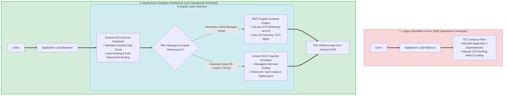
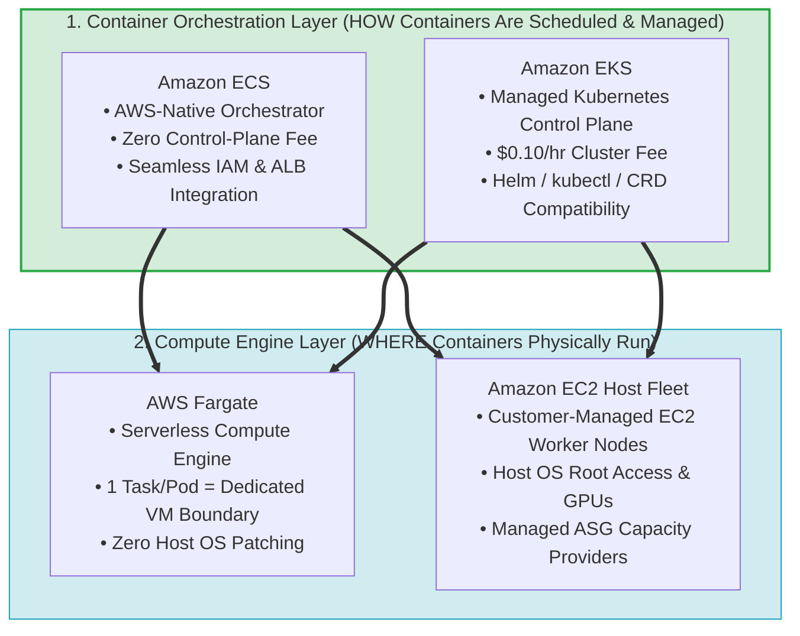
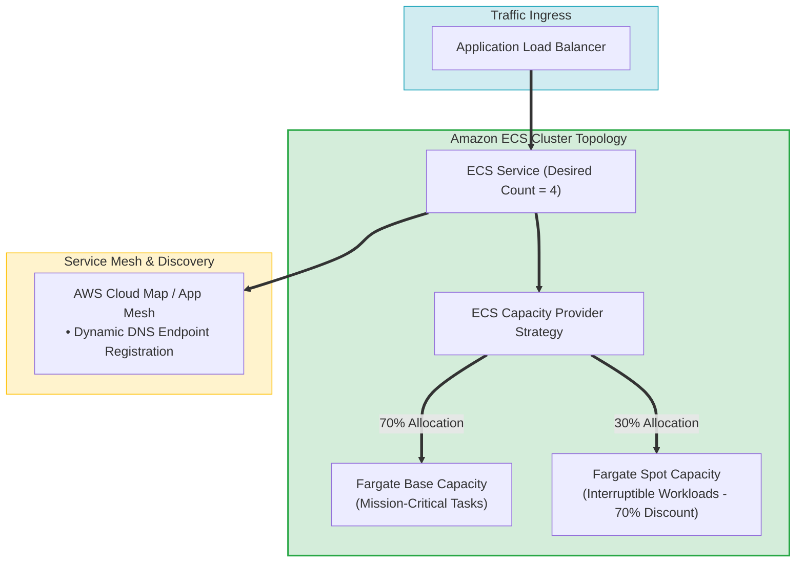
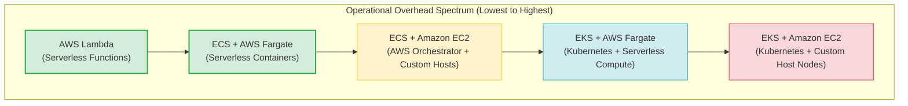
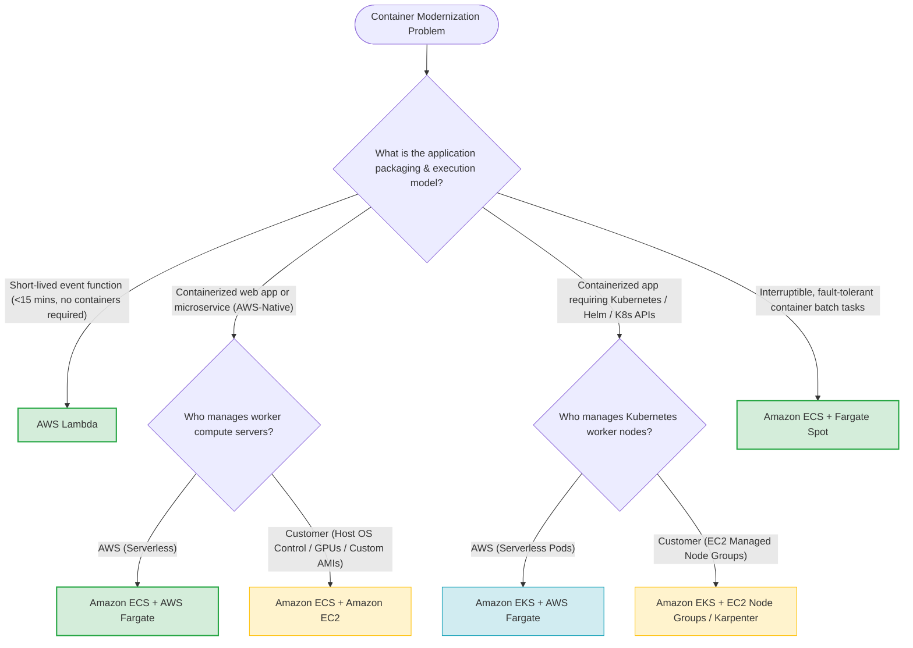

# Task 4.4: Determine Opportunities for Modernization and Enhancements — Container Modernization (Amazon ECS, Amazon EKS, AWS Fargate)

> [!NOTE]
> **Exam Mindset**: For the AWS Solutions Architect Professional (SAP-C02) and AI Practitioner (AIP-C01) exams, containerization sits strategically between raw EC2 virtual machines and serverless functions (AWS Lambda). When evaluating workload modernization opportunities:
> - **Orchestration Choice**: **Amazon ECS** (*"AWS-native simplicity without Kubernetes complexity"*) vs. **Amazon EKS** (*"Kubernetes API compatibility, Helm charts, and CNCF ecosystem"*).
> - **Compute Engine Choice**: **AWS Fargate** (*"Serverless container compute eliminating EC2 host OS patching"* ) vs. **Amazon EC2 Launch Type** (*"Host OS control, GPUs, custom AMIs, or dense steady-state cost optimization"*).

---

## 1. End-to-End Host Migration to Serverless Container Pipeline

---

## 2. Orchestrator vs. Compute Engine: The Core Architectural Distinction

> [!IMPORTANT]
> **Core Exam Rule: Orchestrator vs. Compute Engine**:
> - **ECS / EKS** answers *"How do I schedule, scale, and orchestrate container tasks?"*
> - **Fargate** answers *"Who manages the underlying host compute servers running the containers?"* (Fargate is **NOT** a standalone orchestrator).
> - **EC2** answers *"I require host OS root control, custom AMIs, GPUs, or kernel drivers."*
> - **Lambda** answers *"I do not need a server or a container as my application execution model."*

---

## 3. Amazon ECS Architecture & Capacity Provider Topologies

---

## 4. Amazon ECS vs. Amazon EKS In-Depth Architectural Comparison Matrix

| Architectural Dimension | Amazon ECS | Amazon EKS |
| :--- | :--- | :--- |
| **Control Plane Cost** | **Free** ($0/hour for ECS control plane) | **$0.10/hour (~$73/month)** per cluster |
| **Orchestration API** | AWS-native task definitions and services | Standard Kubernetes API (`kubectl`, Helm, CRDs) |
| **Operational Complexity** | **Low** (Simple JSON blueprints, deep AWS integration) | **Moderate to High** (Kubernetes Pods, RBAC, Ingress) |
| **Portability** | AWS Ecosystem optimized | **Multi-Cloud CNCF Standard** (Runs identical manifests on-prem/cloud) |
| **Compute Launch Support**| AWS Fargate, Amazon EC2, AWS Outposts (EC2 launch type) | AWS Fargate, Amazon EC2, EKS Managed Node Groups, Karpenter |
| **Service Discovery** | AWS Cloud Map, App Mesh, ALB Target Groups | Kubernetes Service, CoreDNS, Ingress Controllers |
| **Primary Exam Trigger** | *"AWS-native container orchestration, low operational overhead"* | *"Existing Kubernetes manifests, Helm charts, multi-cloud strategy"* |

---

## 5. AWS Fargate vs. Amazon EC2 Compute Execution Matrix

| Feature / Dimension | AWS Fargate (Serverless Launch Type) | Amazon EC2 Launch Type |
| :--- | :--- | :--- |
| **Host Maintenance** | **Zero** (AWS manages host OS, hypervisor, and capacity) | **Customer Managed** (OS patching, AMIs, ASG capacity) |
| **Pricing Structure** | Pay for exact vCPU & RAM allocated per task/second | Pay for provisioned EC2 instance hours (24/7 runtime) |
| **Network Isolation** | `awsvpc` mode ONLY (Dedicated ENI per Task/Pod) | Supports `awsvpc`, `bridge`, `host`, `none` network modes |
| **GPU / Inferentia** | Not supported | **Fully Supported** (NVIDIA GPU, AWS Inferentia / Trainium) |
| **AWS Outposts Support** | **❌ NOT Supported on AWS Outposts** | **Fully Supported** (Runs container tasks on Outposts EC2) |
| **Spot Discount Model** | Fargate Spot (Up to 70% discount for interruptible tasks) | EC2 Spot Instances (Up to 90% discount) |
| **Ideal Workload** | Variable traffic, microservices, zero host management | Continuous 24/7 heavy utilization, GPUs, custom AMIs |

---

## 6. Operational Overhead Spectrum Across Compute Models

> [!NOTE]
> **Operational Complexity Insight for SAP-C02**:
> Even when using AWS Fargate with EKS, the workload still inherits **Kubernetes operational complexity** (managing RBAC, Custom Resource Definitions, Pod security policies, and API version upgrades). If Kubernetes compatibility is not explicitly required, **ECS + Fargate** provides a significantly lower operational overhead model.

---

## 7. Real-World Exam Scenarios & Strategic Solution Patterns

### Scenario 1: Containerizing Monolithic Legacy Web Apps with Zero Server Patching
- **Scenario**: A company wants to modernize an existing monolithic Java web application running on EC2. The engineering team has packaged the application into a Docker container, wants to eliminate OS patching and worker node scaling, and has no Kubernetes experience.
- **Solution**: Deploy the container image to **Amazon ECS using the AWS Fargate launch type**, fronted by an **Application Load Balancer**.
- **Reasoning**:
  - Amazon ECS provides zero control-plane cost and seamless ALB / IAM integration.
  - AWS Fargate abstracts away host EC2 instances, OS patching, and capacity planning.
  - *Exam Traps*: Do not select EKS when Kubernetes expertise is lacking and simple AWS-native container management is requested.

---

### Scenario 2: Migrating On-Premises Kubernetes Cluster to AWS
- **Scenario**: An enterprise operates dozens of microservices on an on-premises Kubernetes cluster managed via Helm charts and kubectl deployment scripts. Management wants to migrate to AWS while preserving existing deployment pipelines and operational tooling.
- **Solution**: Deploy the microservices to **Amazon EKS with EKS Managed Node Groups (or Fargate)**.
- **Reasoning**:
  - Amazon EKS provides full Kubernetes API compatibility, allowing existing Helm charts and manifests to run unchanged.
  - AWS manages the Kubernetes control plane availability, etcd storage, and master node patching.
  - *Exam Traps*: Attempting to convert Kubernetes Helm charts into ECS task definitions introduces unnecessary migration friction and rewrite risk.

---

### Scenario 3: Cost-Optimized Batch Image Conversion on Fault-Tolerant Containers
- **Scenario**: A digital media publisher processes thousands of nightly video transcode tasks using containerized workers. Tasks take 30 to 45 minutes to execute, are stateless, and can tolerate occasional task interruptions if node capacity is reclaimed.
- **Solution**: Run the containerized transcode tasks on **Amazon ECS using Fargate Spot (or EC2 Spot Capacity Providers)**.
- **Reasoning**:
  - Video transcode tasks take longer than Lambda's 15-minute timeout limit, making containers necessary.
  - Fargate Spot delivers up to a 70% discount for stateless, fault-tolerant workloads that tolerate task termination signals (with a 2-minute warning).
  - *Exam Traps*: Do not use AWS Lambda for tasks exceeding 15 minutes. Avoid standard Fargate pricing when workloads are interruptible and cost reduction is the primary requirement.

---

### Scenario 4: Heavy GPU Machine Learning Inference Container Fleets
- **Scenario**: A healthtech startup deploys containerized AI inference models requiring specialized NVIDIA Tensor Core GPUs. The application runs continuously 24/7 at heavy CPU/GPU utilization, and the team needs custom Linux kernel drivers.
- **Solution**: Deploy containers to **Amazon ECS (or EKS) with the Amazon EC2 Launch Type**, leveraging GPU-optimized instance families (`g5` / `p4`) and **Savings Plans**.
- **Reasoning**:
  - AWS Fargate does not support GPU hardware or custom host OS kernel driver modifications.
  - EC2 launch type allows dense container packing onto GPU instances, optimized with Savings Plans for continuous 24/7 baseline capacity.
  - *Exam Traps*: Selecting AWS Fargate for GPU workloads is an invalid configuration.

---

## 8. SAP-C02 / AIP-C01 Master Container Modernization Decision Engine

---

## 9. Top Exam Traps & Anti-Patterns Checklist

> [!WARNING]
> **Critical Exam Traps for Container Modernization**:
> 1. **Fargate is NOT an Orchestrator**: Fargate is a serverless compute engine. Container orchestration is performed by **Amazon ECS** or **Amazon EKS**.
> 2. **Selecting EKS Without Kubernetes Requirements**: Do not pick EKS simply because containers are involved. If the scenario specifies AWS-native integration and minimal operational overhead without mentioning Kubernetes or Helm, select **Amazon ECS + Fargate**.
> 3. **AWS Fargate Does NOT Support GPUs or Host Privilege Mode**: For deep learning containers requiring GPUs or specialized kernel drivers, select **ECS/EKS on Amazon EC2**.
> 4. **AWS Fargate is NOT Supported on AWS Outposts**: Container workloads deployed on AWS Outposts must use the **Amazon EC2 launch type**.
> 5. **Attempting to Use Lambda for Tasks >15 Minutes**: AWS Lambda has a hard 15-minute execution limit. For tasks running longer than 15 minutes, select **Amazon ECS / EKS on Fargate**.
> 6. **Fargate Spot Interruptions**: Fargate Spot provides up to 70% savings but can be interrupted with a 2-minute notification. Do not use Fargate Spot for non-fault-tolerant, stateful, or critical production tasks without auto-retry mechanisms.
